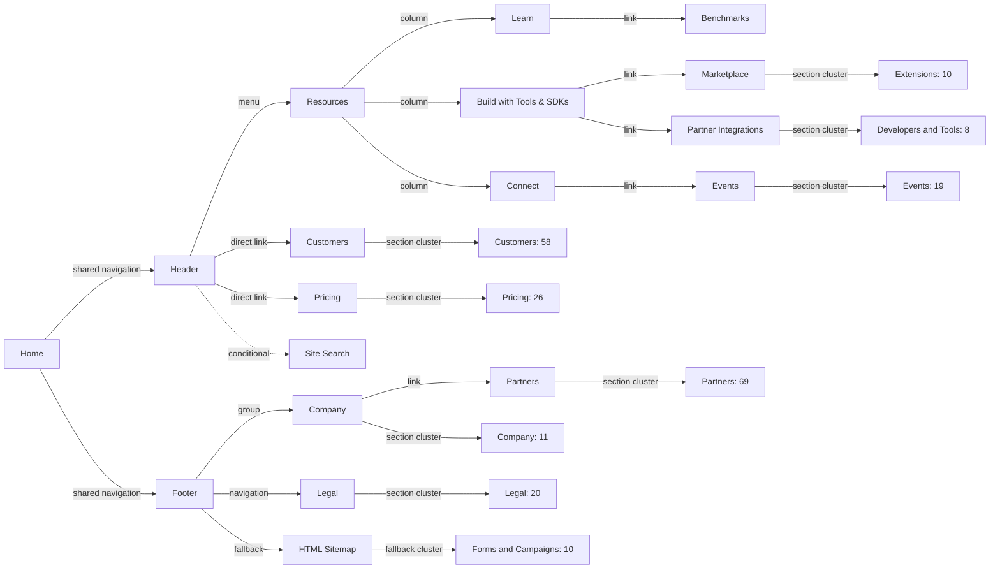
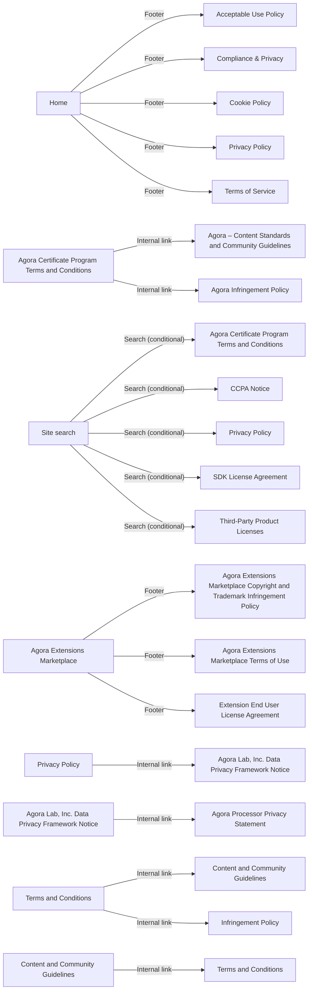
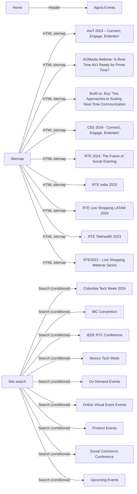
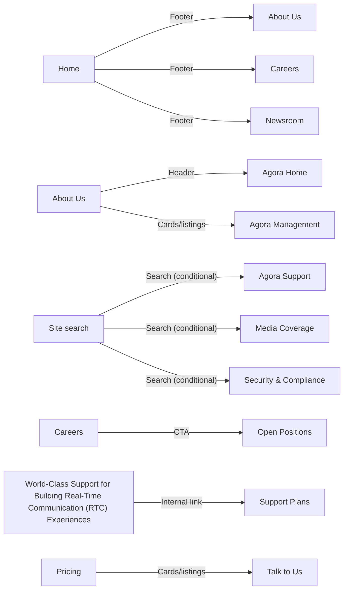
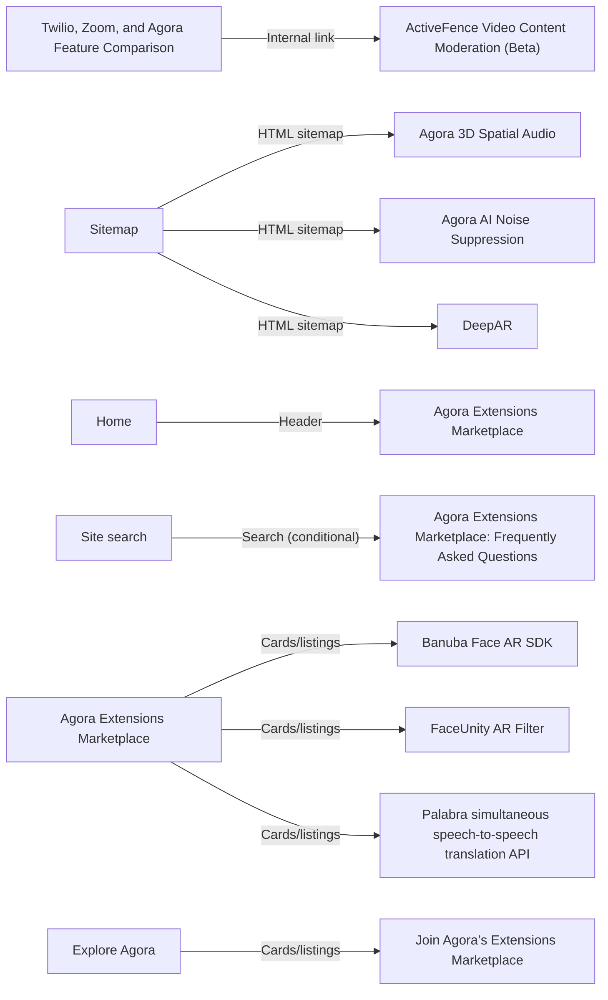
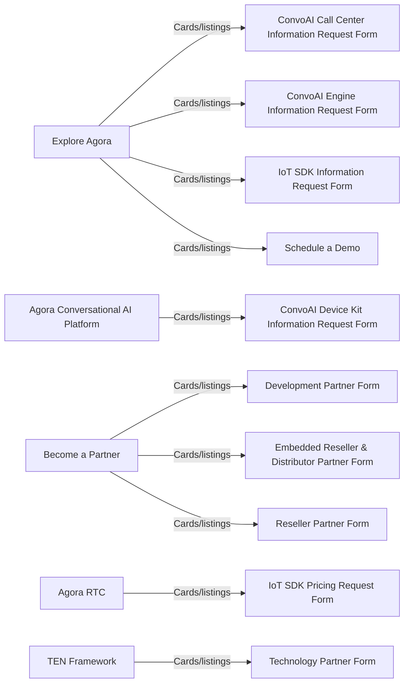
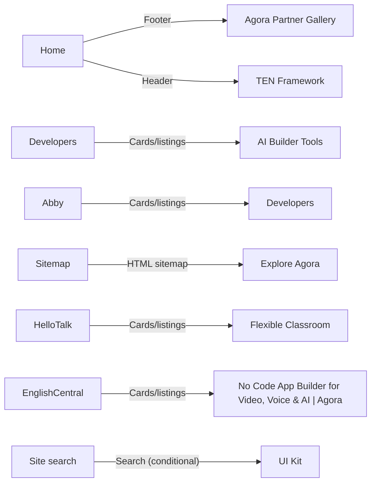

# Page Entry-Point Sitemap

## Scope and methodology

This reproducible report evaluates 231 canonical pages from `docs/public-page-inventory.md`. Product, Use Case, legacy Solutions, and SDRTN family routes are excluded as targets, but all 750 sitemap-backed built pages, including excluded families and pagination pages, are eligible inbound sources and path waypoints.

The generator parses built HTML with `parse5`, resolves built canonicals and redirect aliases, and classifies anchors as Header, Mobile navigation, Footer, Cards/listings, Breadcrumb, CTA, Internal link, HTML sitemap, or Template. Search indexes are conditional entry points. Primary precedence is Header/Mobile navigation, Footer, Cards/listings, Breadcrumb/CTA/Internal link, excluded-family inbound, Template/Search, then HTML sitemap. Paths are deterministic breadth-first searches from `/en/` over direct HTML anchors excluding HTML sitemap, search, and template edges. Friendly labels expand verified shared-header hierarchy from `siteNavigation`; they do not invent route edges. Search and HTML sitemap do not qualify a page as editorially discoverable.

A targeted hydrated-browser reconciliation confirmed shared header/footer links and search results against the generated build.

Status meanings: **Discoverable** has an in-scope editorial link; **Chrome only** has only shared header/footer links; **Editorial orphan** has only template or excluded-family editorial inbound; **Search only** and **Sitemap only** have only those fallback mechanisms; **Orphan** has none.

## Summary

| Discovery Status | Pages |
| --- | ---: |
| Discoverable | 193 |
| Sitemap only | 13 |
| Search only | 24 |
| Chrome only | 1 |
| Editorial orphan | 0 |
| Orphan | 0 |
| **Total** | **231** |

## Orphans and findings

- 38 pages are not editorially discoverable: 13 Sitemap only, 24 Search only, 1 Chrome only, 0 Editorial orphan, 0 Orphan.
- 74 pages have no direct HTML navigation path from Home.
- 0 pages depend primarily on an excluded-family source.
- 0 inventory pages have no sitemap-backed built HTML target.
- 0 inventory URLs resolve through configured redirects instead of remaining canonical targets.
- **Search only:** [Shoutem](https://www.agora.io/en/partners/shoutem/)
- **Search only:** [Vishleshan](https://www.agora.io/en/partners/vishleshan/)
- **Search only:** [Agent Studio](https://www.agora.io/en/pricing/convo-ai-call-center/)
- **Search only:** [Conversational AI Engine](https://www.agora.io/en/pricing/conversational-ai-engine/)
- **Search only:** [Convo AI Device Kit](https://www.agora.io/en/pricing/convoai-device-kit/)
- **Search only:** [Agora Certificate Program Terms and Conditions](https://www.agora.io/en/agora-certificate-program-terms-and-conditions/)
- **Search only:** [CCPA Notice](https://www.agora.io/en/ccpa/)
- **Search only:** [Privacy Policy](https://www.agora.io/en/privacy-policy-20210601/)
- **Search only:** [SDK License Agreement](https://www.agora.io/en/sdk-licence-agreement/)
- **Search only:** [Third-Party Product Licenses](https://www.agora.io/en/third-party-licenses/)
- **Sitemap only:** [AIoT 2023 – Connect, Engage, Entertain!](https://www.agora.io/en/events/aiot-2023/)
- **Sitemap only:** [AOMedia Webinar: Is Real-Time AV1 Ready for Prime Time?](https://www.agora.io/en/events/aomedia-webinar-is-real-time-av1-ready-for-prime-time/)
- **Sitemap only:** [Build vs. Buy: Two Approaches to Scaling Real-Time Communication](https://www.agora.io/en/events/build-vs-buy-two-approaches-to-scaling-real-time-communication/)
- **Sitemap only:** [CEE 2024 - Connect, Engage, Entertain!](https://www.agora.io/en/events/cee-2024--connect-engage-entertain/)
- **Search only:** [Colombia Tech Week 2024](https://www.agora.io/en/events/colombia-tech-week/)
- **Search only:** [IBC Convention](https://www.agora.io/en/events/ibc-convention/)
- **Search only:** [IEEE RTC Conference](https://www.agora.io/en/events/ieee-rtc-conference/)
- **Search only:** [Mexico Tech Week](https://www.agora.io/en/events/mexico-tech-week/)
- **Search only:** [On Demand Events](https://www.agora.io/en/event-category/on-demand/)
- **Search only:** [Online Virtual Event Events](https://www.agora.io/en/event-category/online-virtual-event/)
- **Search only:** [Product Events](https://www.agora.io/en/event-category/product/)
- **Sitemap only:** [RTE 2024: The Future of Social iGaming](https://www.agora.io/en/events/rte-2024-the-future-of-social-igaming/)
- **Sitemap only:** [RTE India 2023](https://www.agora.io/en/events/rte-india-2023/)
- **Sitemap only:** [RTE Live Shopping LATAM 2024](https://www.agora.io/en/events/rte-live-shopping-latam-2024/)
- **Sitemap only:** [RTE Telehealth 2023](https://www.agora.io/en/events/rte-telehealth-2023/)
- **Sitemap only:** [RTE2023 – Live Shopping Webinar Series](https://www.agora.io/en/events/rte2023-live-shopping-webinar-series/)
- **Search only:** [Social Commerce Conference](https://www.agora.io/en/events/social-commerce-conference/)
- **Search only:** [Upcoming Events](https://www.agora.io/en/event-category/upcoming/)
- **Chrome only:** [About Us](https://www.agora.io/en/about-us/)
- **Search only:** [Agora Support](https://www.agora.io/en/customer-support/)
- **Search only:** [Media Coverage](https://www.agora.io/en/media-coverage/)
- **Search only:** [Security & Compliance](https://www.agora.io/en/security/)
- **Sitemap only:** [Agora 3D Spatial Audio](https://www.agora.io/en/extensions/agora-spatial-audio/)
- **Sitemap only:** [Agora AI Noise Suppression](https://www.agora.io/en/extensions/agora-noise-suppression/)
- **Search only:** [Agora Extensions Marketplace: Frequently Asked Questions](https://www.agora.io/en/extensions/frequently-asked-questions/)
- **Sitemap only:** [DeepAR](https://www.agora.io/en/extensions/deepar/)
- **Sitemap only:** [Explore Agora](https://www.agora.io/en/explore/)
- **Search only:** [UI Kit](https://www.agora.io/en/tools/ui-kits/)

## Graph overview

## Section graphs

### Partners

```mermaid
flowchart LR
  classDef excluded fill:#fff1f0,stroke:#d4380d;
  src_e8ae68bcbc82["SaaS Partners"]
  page_84e2b70a33ee["Airmeet"]
  src_e8ae68bcbc82 -->|"Cards/listings"| page_84e2b70a33ee
  src_f4df894cb1f5["Platform Partners"]
  page_c16833e42eec["AjnaLens"]
  src_f4df894cb1f5 -->|"Cards/listings"| page_c16833e42eec
  src_439a5dc16c62["Technology Partners"]
  page_0a40d8d361ae["Arimars"]
  src_439a5dc16c62 -->|"Cards/listings"| page_0a40d8d361ae
  page_4319e057a0ec["Banuba"]
  src_439a5dc16c62 -->|"Cards/listings"| page_4319e057a0ec
  src_e8f4ffaf1ff9["Development Partners"]
  page_29582621a768["BeLive"]
  src_e8f4ffaf1ff9 -->|"Cards/listings"| page_29582621a768
  page_1399aeb54c4a["BigStep Technologies"]
  src_e8f4ffaf1ff9 -->|"Cards/listings"| page_1399aeb54c4a
  page_572bfb750dde["Box"]
  src_f4df894cb1f5 -->|"Cards/listings"| page_572bfb750dde
  page_227e2ffedcf6["Bunch"]
  src_439a5dc16c62 -->|"Cards/listings"| page_227e2ffedcf6
  page_377465ba86b2["BytePlus"]
  src_439a5dc16c62 -->|"Cards/listings"| page_377465ba86b2
  src_37372c06fdf4["Enterprise Integration Partners"]
  page_e1a332b760ad["Datadog"]
  src_37372c06fdf4 -->|"Cards/listings"| page_e1a332b760ad
  page_2aaf06134cad["DeepAR"]
  src_439a5dc16c62 -->|"Cards/listings"| page_2aaf06134cad
  src_29582621a768["BeLive"]
  page_e8f4ffaf1ff9["Development Partners"]
  src_29582621a768 -->|"CTA"| page_e8f4ffaf1ff9
  page_55cb4fbea518["DreamTeam Mobile"]
  src_e8f4ffaf1ff9 -->|"Cards/listings"| page_55cb4fbea518
  page_f074d1cc62a8["Elsner Technologies"]
  src_439a5dc16c62 -->|"Cards/listings"| page_f074d1cc62a8
  src_e1a332b760ad["Datadog"]
  page_37372c06fdf4["Enterprise Integration Partners"]
  src_e1a332b760ad -->|"CTA"| page_37372c06fdf4
  page_ddb852e39aae["EpiTek"]
  src_e8ae68bcbc82 -->|"Cards/listings"| page_ddb852e39aae
  page_70a5c0c239c4["EZDRM"]
  src_439a5dc16c62 -->|"Cards/listings"| page_70a5c0c239c4
  page_d2e8b809619c["FaceUnity"]
  src_439a5dc16c62 -->|"Cards/listings"| page_d2e8b809619c
  page_a85dd79b4bac["FairVi"]
  src_e8f4ffaf1ff9 -->|"Cards/listings"| page_a85dd79b4bac
  page_ed95a9d7bf1e["Fizz"]
  src_439a5dc16c62 -->|"Cards/listings"| page_ed95a9d7bf1e
  page_b152b2f311ef["High Fidelity"]
  src_439a5dc16c62 -->|"Cards/listings"| page_b152b2f311ef
  page_9cb54357a747["HTC VIVE"]
  src_f4df894cb1f5 -->|"Cards/listings"| page_9cb54357a747
  page_dce80ab3b14a["Human Soft"]
  src_e8f4ffaf1ff9 -->|"Cards/listings"| page_dce80ab3b14a
  page_5a8ed7efaa2b["LearnCube"]
  src_e8ae68bcbc82 -->|"Cards/listings"| page_5a8ed7efaa2b
  page_331516699b04["LiSA"]
  src_e8ae68bcbc82 -->|"Cards/listings"| page_331516699b04
  page_833cc55bc4c1["LiveLike"]
  src_e8ae68bcbc82 -->|"Cards/listings"| page_833cc55bc4c1
  page_6de84e9a8340["Loop Team"]
  src_e8ae68bcbc82 -->|"Cards/listings"| page_6de84e9a8340
  page_2b904a96f46b["Magic Leap"]
  src_f4df894cb1f5 -->|"Cards/listings"| page_2b904a96f46b
  page_43474f72cb54["MobileFirst Applications"]
  src_e8f4ffaf1ff9 -->|"Cards/listings"| page_43474f72cb54
  page_65724820002c["Nexplayer"]
  src_439a5dc16c62 -->|"Cards/listings"| page_65724820002c
  page_45ff8fbd2ced["Nix"]
  src_e8f4ffaf1ff9 -->|"Cards/listings"| page_45ff8fbd2ced
  src_3c7bce3991ad["Reseller Partners"]
  page_3c10383136a0["NyarTech"]
  src_3c7bce3991ad -->|"Cards/listings"| page_3c10383136a0
  page_b3c2fe1d86f1["OffsureIT"]
  src_e8f4ffaf1ff9 -->|"Cards/listings"| page_b3c2fe1d86f1
  page_70134f2dd3c6["Okta"]
  src_37372c06fdf4 -->|"Cards/listings"| page_70134f2dd3c6
  src_cdba34cf6483["VirBELA"]
  page_f4df894cb1f5["Platform Partners"]
  src_cdba34cf6483 -->|"CTA"| page_f4df894cb1f5
  page_84b407f3ca2f["PubNub"]
  src_439a5dc16c62 -->|"Cards/listings"| page_84b407f3ca2f
  page_98635d19315d["RaftLabs"]
  src_e8f4ffaf1ff9 -->|"Cards/listings"| page_98635d19315d
  page_25f3a0e77d4f["Relinns"]
  src_e8f4ffaf1ff9 -->|"Cards/listings"| page_25f3a0e77d4f
  src_3c10383136a0["NyarTech"]
  page_3c7bce3991ad["Reseller Partners"]
  src_3c10383136a0 -->|"CTA"| page_3c7bce3991ad
  page_bb74ac0c11a0["Rokid"]
  src_f4df894cb1f5 -->|"Cards/listings"| page_bb74ac0c11a0
  src_5a8ed7efaa2b["LearnCube"]
  page_e8ae68bcbc82["SaaS Partners"]
  src_5a8ed7efaa2b -->|"CTA"| page_e8ae68bcbc82
  page_73e00e7bfb3e["Shakuniya Solutions"]
  src_3c7bce3991ad -->|"Cards/listings"| page_73e00e7bfb3e
  src_30dca63f25a0["Site search"]
  page_6f60ec8bc915["Shoutem"]
  src_30dca63f25a0 -->|"Search (conditional)"| page_6f60ec8bc915
  page_de43bbd93baf["SignalWire"]
  src_439a5dc16c62 -->|"Cards/listings"| page_de43bbd93baf
  page_66b6f2d225be["SiliconPrime Labs"]
  src_e8f4ffaf1ff9 -->|"Cards/listings"| page_66b6f2d225be
  page_b915285abb28["Solarflare Studio"]
  src_e8f4ffaf1ff9 -->|"Cards/listings"| page_b915285abb28
  page_400e7184005b["Spectrum Labs"]
  src_439a5dc16c62 -->|"Cards/listings"| page_400e7184005b
  page_000a5ee2ff5d["SpringCT"]
  src_e8f4ffaf1ff9 -->|"Cards/listings"| page_000a5ee2ff5d
  page_03fcc3b494fb["StageMe"]
  src_e8ae68bcbc82 -->|"Cards/listings"| page_03fcc3b494fb
  page_846609ea02d1["Swarm"]
  src_e8f4ffaf1ff9 -->|"Cards/listings"| page_846609ea02d1
  page_f11e011a9ac6["Symbl.ai"]
  src_439a5dc16c62 -->|"Cards/listings"| page_f11e011a9ac6
  page_9fe551341436["Synervoz"]
  src_e8ae68bcbc82 -->|"Cards/listings"| page_9fe551341436
  src_433b456dd2e0["VRJAM"]
  page_439a5dc16c62["Technology Partners"]
  src_433b456dd2e0 -->|"CTA"| page_439a5dc16c62
  page_528c1dfd98ad["TurboBridge"]
  src_439a5dc16c62 -->|"Cards/listings"| page_528c1dfd98ad
  page_d95d7617eb38["UHP Software"]
  src_e8f4ffaf1ff9 -->|"Cards/listings"| page_d95d7617eb38
  page_c64c7b74c75c["Unity"]
  src_f4df894cb1f5 -->|"Cards/listings"| page_c64c7b74c75c
  page_aea630bcfd82["V-Cube"]
  src_3c7bce3991ad -->|"Cards/listings"| page_aea630bcfd82
  page_f2ba581b9bf3["Verbit"]
  src_e8ae68bcbc82 -->|"Cards/listings"| page_f2ba581b9bf3
  page_cdba34cf6483["VirBELA"]
  src_f4df894cb1f5 -->|"Cards/listings"| page_cdba34cf6483
  page_3381396229e2["Virtual Tours Experts"]
  src_f4df894cb1f5 -->|"Cards/listings"| page_3381396229e2
  page_5a3a4ee4f053["Vishleshan"]
  src_30dca63f25a0 -->|"Search (conditional)"| page_5a3a4ee4f053
  page_283ff91ca305["VisionLab"]
  src_439a5dc16c62 -->|"Cards/listings"| page_283ff91ca305
  page_c2e9c88d2080["Voctro Labs"]
  src_439a5dc16c62 -->|"Cards/listings"| page_c2e9c88d2080
  page_abf48ef7447b["Voicemod"]
  src_439a5dc16c62 -->|"Cards/listings"| page_abf48ef7447b
  page_433b456dd2e0["VRJAM"]
  src_439a5dc16c62 -->|"Cards/listings"| page_433b456dd2e0
  page_46c80fd48bdb["We Make Apps"]
  src_e8f4ffaf1ff9 -->|"Cards/listings"| page_46c80fd48bdb
  page_7b88fcac5c6e["webRTC Ventures"]
  src_e8f4ffaf1ff9 -->|"Cards/listings"| page_7b88fcac5c6e
  page_98eed31b8f8a["Wipro"]
  src_439a5dc16c62 -->|"Cards/listings"| page_98eed31b8f8a
  page_4f6cabae9ef5["XR Central"]
  src_439a5dc16c62 -->|"Cards/listings"| page_4f6cabae9ef5
```

### Customers

```mermaid
flowchart LR
  classDef excluded fill:#fff1f0,stroke:#d4380d;
  src_e58215a330e8["Customer Stories"]
  page_9988c9850b4d["Abby"]
  src_e58215a330e8 -->|"Cards/listings"| page_9988c9850b4d
  page_20a83a8e60ba["Airmeet"]
  src_e58215a330e8 -->|"Cards/listings"| page_20a83a8e60ba
  page_11a8f51f2dd2["Artium Academy"]
  src_e58215a330e8 -->|"Cards/listings"| page_11a8f51f2dd2
  page_cad76c363f4c["ARUtlity"]
  src_e58215a330e8 -->|"Cards/listings"| page_cad76c363f4c
  page_087f3146bb66["Astrotalk"]
  src_e58215a330e8 -->|"Cards/listings"| page_087f3146bb66
  page_f50493ea74b5["Astroyogi"]
  src_e58215a330e8 -->|"Cards/listings"| page_f50493ea74b5
  page_1f7743b8c427["Beem"]
  src_e58215a330e8 -->|"Cards/listings"| page_1f7743b8c427
  page_fdff1d251345["BlaBla Live"]
  src_e58215a330e8 -->|"Cards/listings"| page_fdff1d251345
  page_634102d7a45c["Blue Frog"]
  src_e58215a330e8 -->|"Cards/listings"| page_634102d7a45c
  page_3fd053e5b956["Bunch"]
  src_e58215a330e8 -->|"Cards/listings"| page_3fd053e5b956
  page_20cad4c6d5fd["ClawCrazy"]
  src_e58215a330e8 -->|"Cards/listings"| page_20cad4c6d5fd
  page_fe78b2c8b6a4["Conference Compass"]
  src_e58215a330e8 -->|"Cards/listings"| page_fe78b2c8b6a4
  page_5bd74aea78ab["CraftJam"]
  src_e58215a330e8 -->|"Cards/listings"| page_5bd74aea78ab
  src_477322a4d2fa["Home"]
  page_e58215a330e8["Customer Stories"]
  src_477322a4d2fa -->|"Header"| page_e58215a330e8
  page_c791beceeeda["De Kabeza"]
  src_e58215a330e8 -->|"Cards/listings"| page_c791beceeeda
  page_bd6e0288e2f0["Ellie"]
  src_e58215a330e8 -->|"Cards/listings"| page_bd6e0288e2f0
  page_75c920699849["EnglishCentral"]
  src_e58215a330e8 -->|"Cards/listings"| page_75c920699849
  page_26319272452a["EnglishYaari"]
  src_e58215a330e8 -->|"Cards/listings"| page_26319272452a
  page_2b7a0d7708d1["everywhere.id"]
  src_e58215a330e8 -->|"Cards/listings"| page_2b7a0d7708d1
  page_7bbc6f288fb0["EZAI"]
  src_e58215a330e8 -->|"Cards/listings"| page_7bbc6f288fb0
  page_aad93077f1ee["Fanory"]
  src_e58215a330e8 -->|"Cards/listings"| page_aad93077f1ee
  page_b4b4f9453139["Feelin’s"]
  src_e58215a330e8 -->|"Cards/listings"| page_b4b4f9453139
  page_b262585b5b74["HelloTalk"]
  src_e58215a330e8 -->|"Cards/listings"| page_b262585b5b74
  page_86aa8a21196c["HTC VIVE"]
  src_e58215a330e8 -->|"Cards/listings"| page_86aa8a21196c
  page_d46a73913558["Hubilo"]
  src_e58215a330e8 -->|"Cards/listings"| page_d46a73913558
  page_d75bd1733b2d["InEvent"]
  src_e58215a330e8 -->|"Cards/listings"| page_d75bd1733b2d
  page_b49fd3bb2a53["Infinity Learn"]
  src_e58215a330e8 -->|"Cards/listings"| page_b49fd3bb2a53
  page_2e37cf1bf50d["InstaAstro"]
  src_e58215a330e8 -->|"Cards/listings"| page_2e37cf1bf50d
  page_50d50da037da["Kriyam"]
  src_e58215a330e8 -->|"Cards/listings"| page_50d50da037da
  page_f27ca675ba9c["KUMU"]
  src_e58215a330e8 -->|"Cards/listings"| page_f27ca675ba9c
  page_b39f5dfeee65["Lgenie"]
  src_e58215a330e8 -->|"Cards/listings"| page_b39f5dfeee65
  page_9df5c49b1e6f["LiSA"]
  src_e58215a330e8 -->|"Cards/listings"| page_9df5c49b1e6f
  page_5d64e749230f["LiveLike"]
  src_e58215a330e8 -->|"Cards/listings"| page_5d64e749230f
  page_85a1a75f4b43["Loop Team"]
  src_e58215a330e8 -->|"Cards/listings"| page_85a1a75f4b43
  page_adda4c25e333["MBC GROUP"]
  src_e58215a330e8 -->|"Cards/listings"| page_adda4c25e333
  page_8e1b96ce7f5b["Miko"]
  src_e58215a330e8 -->|"Cards/listings"| page_8e1b96ce7f5b
  page_5fc61bec8b46["MixPose"]
  src_e58215a330e8 -->|"Cards/listings"| page_5fc61bec8b46
  page_63fe95f221f6["Mixtroz"]
  src_e58215a330e8 -->|"Cards/listings"| page_63fe95f221f6
  page_bbf170c31cb1["NEI"]
  src_e58215a330e8 -->|"Cards/listings"| page_bbf170c31cb1
  page_93cedd3f5d66["Noon Academy"]
  src_e58215a330e8 -->|"Cards/listings"| page_93cedd3f5d66
  page_b451c77381b0["PandaTree"]
  src_e58215a330e8 -->|"Cards/listings"| page_b451c77381b0
  page_40258be2bcd3["Pophie"]
  src_e58215a330e8 -->|"Cards/listings"| page_40258be2bcd3
  page_813dbbec096a["Pragli"]
  src_e58215a330e8 -->|"Cards/listings"| page_813dbbec096a
  page_0adf796fda82["Preply"]
  src_e58215a330e8 -->|"Cards/listings"| page_0adf796fda82
  page_bb892f0f73f8["RealFrnd"]
  src_e58215a330e8 -->|"Cards/listings"| page_bb892f0f73f8
  page_a643c19269f6["Run The World"]
  src_e58215a330e8 -->|"Cards/listings"| page_a643c19269f6
  page_684ea05bfc40["Salesroom"]
  src_e58215a330e8 -->|"Cards/listings"| page_684ea05bfc40
  page_92d95a28bb0b["Scener"]
  src_e58215a330e8 -->|"Cards/listings"| page_92d95a28bb0b
  page_ff0bcdd4bf70["Symbl.ai"]
  src_e58215a330e8 -->|"Cards/listings"| page_ff0bcdd4bf70
  page_ab32e4630b2c["Talkspace"]
  src_e58215a330e8 -->|"Cards/listings"| page_ab32e4630b2c
  page_3a1ae24d4b09["Tandem"]
  src_e58215a330e8 -->|"Cards/listings"| page_3a1ae24d4b09
  page_2a8ae4fa310a["Tevi"]
  src_e58215a330e8 -->|"Cards/listings"| page_2a8ae4fa310a
  page_e353e0e2180b["The Meet Group"]
  src_e58215a330e8 -->|"Cards/listings"| page_e353e0e2180b
  page_54a134b925f2["TVU Networks"]
  src_e58215a330e8 -->|"Cards/listings"| page_54a134b925f2
  page_3c1457746672["Upduo"]
  src_e58215a330e8 -->|"Cards/listings"| page_3c1457746672
  page_04071f11a5e9["VLMedia"]
  src_e58215a330e8 -->|"Cards/listings"| page_04071f11a5e9
  page_69aa1646031a["Welcome"]
  src_e58215a330e8 -->|"Cards/listings"| page_69aa1646031a
  page_f5aba9fa56a4["Whatnot"]
  src_e58215a330e8 -->|"Cards/listings"| page_f5aba9fa56a4
```

### Pricing

```mermaid
flowchart LR
  classDef excluded fill:#fff1f0,stroke:#d4380d;
  src_dd8a3b63fc19["Pricing"]
  page_75414e68d261["3D Spatial Audio"]
  src_dd8a3b63fc19 -->|"Cards/listings"| page_75414e68d261
  src_30dca63f25a0["Site search"]
  page_3bba13c625d1["Agent Studio"]
  src_30dca63f25a0 -->|"Search (conditional)"| page_3bba13c625d1
  page_36c4a8aa02ba["Agora Chat"]
  src_dd8a3b63fc19 -->|"Cards/listings"| page_36c4a8aa02ba
  page_906c4c97dcd4["Agora Conversational AI Platform"]
  src_dd8a3b63fc19 -->|"Cards/listings"| page_906c4c97dcd4
  page_025f2d772c68["Agora RTC"]
  src_dd8a3b63fc19 -->|"Cards/listings"| page_025f2d772c68
  page_fff21baaa0ce["Agora Signaling"]
  src_dd8a3b63fc19 -->|"Cards/listings"| page_fff21baaa0ce
  page_8aa7f21a1a0d["AI Noise Suppression"]
  src_dd8a3b63fc19 -->|"Cards/listings"| page_8aa7f21a1a0d
  page_4cde1997101b["Analytics"]
  src_dd8a3b63fc19 -->|"Cards/listings"| page_4cde1997101b
  src_f3f61e91e001["Media Gateway"]
  page_ec082408ec64["Broadcast Streaming"]
  src_f3f61e91e001 -->|"Cards/listings"| page_ec082408ec64
  src_75414e68d261["3D Spatial Audio"]
  page_2c647a158bec["Cloud Proxy"]
  src_75414e68d261 -->|"Cards/listings"| page_2c647a158bec
  page_cf1c97ad2a91["Cloud Transcoding"]
  src_dd8a3b63fc19 -->|"Cards/listings"| page_cf1c97ad2a91
  page_44b479740a9f["Conversational AI Engine"]
  src_30dca63f25a0 -->|"Search (conditional)"| page_44b479740a9f
  page_2b4b28504106["Convo AI Device Kit"]
  src_30dca63f25a0 -->|"Search (conditional)"| page_2b4b28504106
  page_adc260508d0a["Flexible Classroom"]
  src_dd8a3b63fc19 -->|"Cards/listings"| page_adc260508d0a
  page_bd1550cc7c2b["Interactive Live Streaming"]
  src_75414e68d261 -->|"Cards/listings"| page_bd1550cc7c2b
  page_56ed70c5f819["Interactive Whiteboard"]
  src_dd8a3b63fc19 -->|"Cards/listings"| page_56ed70c5f819
  src_44b479740a9f["Conversational AI Engine"]
  page_e15c63f82f7c["IoT SDK"]
  src_44b479740a9f -->|"Cards/listings"| page_e15c63f82f7c
  page_f3f61e91e001["Media Gateway"]
  src_dd8a3b63fc19 -->|"Cards/listings"| page_f3f61e91e001
  page_b9272eae6f72["Media Pull"]
  src_dd8a3b63fc19 -->|"Cards/listings"| page_b9272eae6f72
  page_3dc1b952e0de["Media Push"]
  src_dd8a3b63fc19 -->|"Cards/listings"| page_3dc1b952e0de
  src_477322a4d2fa["Home"]
  page_dd8a3b63fc19["Pricing"]
  src_477322a4d2fa -->|"Header"| page_dd8a3b63fc19
  page_157252469cdf["Real-Time Speech to Text"]
  src_dd8a3b63fc19 -->|"Cards/listings"| page_157252469cdf
  page_b4225a41dad4["Real-Time Translation"]
  src_dd8a3b63fc19 -->|"Cards/listings"| page_b4225a41dad4
  page_6c4205b7dfcb["Recording"]
  src_dd8a3b63fc19 -->|"Cards/listings"| page_6c4205b7dfcb
  page_9b6afa9a74c8["Video Calling"]
  src_75414e68d261 -->|"Cards/listings"| page_9b6afa9a74c8
  page_2cceb9ca4b2a["Voice Calling"]
  src_75414e68d261 -->|"Cards/listings"| page_2cceb9ca4b2a
```

### Legal

### Events

### Company

### Extensions

### Forms and Campaigns

### Developers and Tools

## Page audit

| Section | Page Name | URL | Primary Entry Point | Navigation Path | Other Entry Points | Discovery Status |
| --- | --- | --- | --- | --- | --- | --- |
| Partners | Airmeet | https://www.agora.io/en/partners/airmeet/ | Cards/listings from SaaS Partners (/en/partner-category/saas/) | Home -> Resources -> Learn -> Blogs -> Ideas for the real-time world [page 13] -> Live Video - The New Way to Educate -> LearnCube -> SaaS Partners -> Airmeet | HTML sitemap: Sitemap (/en/sitemap/); Search (conditional): Site search (site-search) | Discoverable |
| Partners | AjnaLens | https://www.agora.io/en/partners/ajnalens/ | Cards/listings from Platform Partners (/en/partner-category/platform/) | Home -> Build experiences that feel real [excluded family] -> Simplifying access to the metaverse [excluded family] -> VirBELA -> Platform Partners -> AjnaLens | HTML sitemap: Sitemap (/en/sitemap/); Search (conditional): Site search (site-search) | Discoverable |
| Partners | Arimars | https://www.agora.io/en/partners/arimars/ | Cards/listings from Technology Partners (/en/partner-category/technology/) | Home -> Customers -> InEvent -> The Evolution to Real-Time Engagement -> VRJAM -> Technology Partners -> Arimars | HTML sitemap: Sitemap (/en/sitemap/); Search (conditional): Site search (site-search) | Discoverable |
| Partners | Banuba | https://www.agora.io/en/partners/banuba/ | Cards/listings from Technology Partners (/en/partner-category/technology/) | Home -> Resources -> Learn -> Blogs -> Ideas for the real-time world [page 13] -> Ideas for the real-time world [page 12] -> Augmented Reality Video Comes to Life with Banuba and the Agora Platform -> Banuba | HTML sitemap: Sitemap (/en/sitemap/); Internal link: Augmented Reality Video Comes to Life with Banuba and the Agora Platform (/en/blog/augmented-reality-video-comes-to-life-with-banuba-and-the-agora-platform/); Search (conditional): Site search (site-search) | Discoverable |
| Partners | BeLive | https://www.agora.io/en/partners/belive/ | Cards/listings from Development Partners (/en/partner-category/development/) | No direct HTML path from Home | HTML sitemap: Sitemap (/en/sitemap/); Search (conditional): Site search (site-search) | Discoverable |
| Partners | BigStep Technologies | https://www.agora.io/en/partners/bigstep-technologies/ | Cards/listings from Development Partners (/en/partner-category/development/) | No direct HTML path from Home | HTML sitemap: Sitemap (/en/sitemap/); Search (conditional): Site search (site-search) | Discoverable |
| Partners | Box | https://www.agora.io/en/partners/box/ | Cards/listings from Platform Partners (/en/partner-category/platform/) | Home -> Build experiences that feel real [excluded family] -> Simplifying access to the metaverse [excluded family] -> VirBELA -> Platform Partners -> Box | HTML sitemap: Sitemap (/en/sitemap/); Search (conditional): Site search (site-search) | Discoverable |
| Partners | Bunch | https://www.agora.io/en/partners/bunch/ | Cards/listings from Technology Partners (/en/partner-category/technology/) | Home -> Customers -> InEvent -> The Evolution to Real-Time Engagement -> VRJAM -> Technology Partners -> Bunch | HTML sitemap: Sitemap (/en/sitemap/); Search (conditional): Site search (site-search) | Discoverable |
| Partners | BytePlus | https://www.agora.io/en/partners/byteplus/ | Cards/listings from Technology Partners (/en/partner-category/technology/) | Home -> Customers -> InEvent -> The Evolution to Real-Time Engagement -> VRJAM -> Technology Partners -> BytePlus | HTML sitemap: Sitemap (/en/sitemap/); Search (conditional): Site search (site-search) | Discoverable |
| Partners | Datadog | https://www.agora.io/en/partners/datadog/ | Cards/listings from Enterprise Integration Partners (/en/partner-category/enterprise-integration/) | No direct HTML path from Home | HTML sitemap: Sitemap (/en/sitemap/); Search (conditional): Site search (site-search) | Discoverable |
| Partners | DeepAR | https://www.agora.io/en/partners/deepar/ | Cards/listings from Technology Partners (/en/partner-category/technology/) | Home -> Customers -> InEvent -> The Evolution to Real-Time Engagement -> VRJAM -> Technology Partners -> DeepAR | HTML sitemap: Sitemap (/en/sitemap/); Search (conditional): Site search (site-search) | Discoverable |
| Partners | Development Partners | https://www.agora.io/en/partner-category/development/ | CTA from BeLive (/en/partners/belive/) | No direct HTML path from Home | CTA: BigStep Technologies (/en/partners/bigstep-technologies/), DreamTeam Mobile (/en/partners/dreamteam-mobile/), FairVi (/en/partners/fairvi/) +13 more; HTML sitemap: Sitemap (/en/sitemap/); Search (conditional): Site search (site-search) | Discoverable |
| Partners | DreamTeam Mobile | https://www.agora.io/en/partners/dreamteam-mobile/ | Cards/listings from Development Partners (/en/partner-category/development/) | No direct HTML path from Home | HTML sitemap: Sitemap (/en/sitemap/); Search (conditional): Site search (site-search) | Discoverable |
| Partners | Elsner Technologies | https://www.agora.io/en/partners/elsner-technologies/ | Cards/listings from Technology Partners (/en/partner-category/technology/) | Home -> Customers -> InEvent -> The Evolution to Real-Time Engagement -> VRJAM -> Technology Partners -> Elsner Technologies | HTML sitemap: Sitemap (/en/sitemap/); Search (conditional): Site search (site-search) | Discoverable |
| Partners | Enterprise Integration Partners | https://www.agora.io/en/partner-category/enterprise-integration/ | CTA from Datadog (/en/partners/datadog/) | No direct HTML path from Home | CTA: Okta (/en/partners/okta/); HTML sitemap: Sitemap (/en/sitemap/); Search (conditional): Site search (site-search) | Discoverable |
| Partners | EpiTek | https://www.agora.io/en/partners/epitek/ | Cards/listings from SaaS Partners (/en/partner-category/saas/) | Home -> Resources -> Learn -> Blogs -> Ideas for the real-time world [page 13] -> Live Video - The New Way to Educate -> LearnCube -> SaaS Partners -> EpiTek | HTML sitemap: Sitemap (/en/sitemap/); Search (conditional): Site search (site-search) | Discoverable |
| Partners | EZDRM | https://www.agora.io/en/partners/ezdrm/ | Cards/listings from Technology Partners (/en/partner-category/technology/) | Home -> Customers -> InEvent -> The Evolution to Real-Time Engagement -> VRJAM -> Technology Partners -> EZDRM | HTML sitemap: Sitemap (/en/sitemap/); Internal link: Agora Partners With EZDRM To Bring Content Protection To Live Broadcasting (/en/news/agora-partners-with-ezdrm-to-bring-content-protection-to-live-broadcasting/); Search (conditional): Site search (site-search) | Discoverable |
| Partners | FaceUnity | https://www.agora.io/en/partners/faceunity/ | Cards/listings from Technology Partners (/en/partner-category/technology/) | Home -> Customers -> InEvent -> The Evolution to Real-Time Engagement -> VRJAM -> Technology Partners -> FaceUnity | HTML sitemap: Sitemap (/en/sitemap/); Search (conditional): Site search (site-search) | Discoverable |
| Partners | FairVi | https://www.agora.io/en/partners/fairvi/ | Cards/listings from Development Partners (/en/partner-category/development/) | No direct HTML path from Home | HTML sitemap: Sitemap (/en/sitemap/); Search (conditional): Site search (site-search) | Discoverable |
| Partners | Fizz | https://www.agora.io/en/partners/fizz/ | Cards/listings from Technology Partners (/en/partner-category/technology/) | Home -> Customers -> InEvent -> The Evolution to Real-Time Engagement -> VRJAM -> Technology Partners -> Fizz | HTML sitemap: Sitemap (/en/sitemap/); Search (conditional): Site search (site-search) | Discoverable |
| Partners | High Fidelity | https://www.agora.io/en/partners/high-fidelity/ | Cards/listings from Technology Partners (/en/partner-category/technology/) | Home -> Customers -> InEvent -> The Evolution to Real-Time Engagement -> VRJAM -> Technology Partners -> High Fidelity | HTML sitemap: Sitemap (/en/sitemap/); Search (conditional): Site search (site-search) | Discoverable |
| Partners | HTC VIVE | https://www.agora.io/en/partners/htc-vive/ | Cards/listings from Platform Partners (/en/partner-category/platform/) | Home -> Build experiences that feel real [excluded family] -> Simplifying access to the metaverse [excluded family] -> VirBELA -> Platform Partners -> HTC VIVE | HTML sitemap: Sitemap (/en/sitemap/); Search (conditional): Site search (site-search) | Discoverable |
| Partners | Human Soft | https://www.agora.io/en/partners/human-soft/ | Cards/listings from Development Partners (/en/partner-category/development/) | No direct HTML path from Home | HTML sitemap: Sitemap (/en/sitemap/); Search (conditional): Site search (site-search) | Discoverable |
| Partners | LearnCube | https://www.agora.io/en/partners/learncube/ | Cards/listings from SaaS Partners (/en/partner-category/saas/) | Home -> Resources -> Learn -> Blogs -> Ideas for the real-time world [page 13] -> Live Video - The New Way to Educate -> LearnCube | HTML sitemap: Sitemap (/en/sitemap/); Internal link: Live Video - The New Way to Educate (/en/blog/live-video-the-new-way-to-educate/), Agora Powers Innovative Virtual Experiences Beyond Video Conferencing (/en/news/agora-powers-innovative-virtual-experiences-beyond-video-conferencing/); Search (conditional): Site search (site-search) | Discoverable |
| Partners | LiSA | https://www.agora.io/en/partners/lisa/ | Cards/listings from SaaS Partners (/en/partner-category/saas/) | Home -> Resources -> Learn -> Blogs -> Ideas for the real-time world [page 13] -> Live Video - The New Way to Educate -> LearnCube -> SaaS Partners -> LiSA | HTML sitemap: Sitemap (/en/sitemap/); Search (conditional): Site search (site-search) | Discoverable |
| Partners | LiveLike | https://www.agora.io/en/partners/livelike/ | Cards/listings from SaaS Partners (/en/partner-category/saas/) | Home -> Resources -> Learn -> Blogs -> Ideas for the real-time world [page 13] -> Live Video - The New Way to Educate -> LearnCube -> SaaS Partners -> LiveLike | HTML sitemap: Sitemap (/en/sitemap/); Search (conditional): Site search (site-search) | Discoverable |
| Partners | Loop Team | https://www.agora.io/en/partners/loop-team/ | Cards/listings from SaaS Partners (/en/partner-category/saas/) | Home -> Resources -> Learn -> Blogs -> Ideas for the real-time world [page 13] -> Live Video - The New Way to Educate -> LearnCube -> SaaS Partners -> Loop Team | HTML sitemap: Sitemap (/en/sitemap/); Search (conditional): Site search (site-search) | Discoverable |
| Partners | Magic Leap | https://www.agora.io/en/partners/magic-leap/ | Cards/listings from Platform Partners (/en/partner-category/platform/) | Home -> Build experiences that feel real [excluded family] -> Simplifying access to the metaverse [excluded family] -> VirBELA -> Platform Partners -> Magic Leap | HTML sitemap: Sitemap (/en/sitemap/); Search (conditional): Site search (site-search) | Discoverable |
| Partners | MobileFirst Applications | https://www.agora.io/en/partners/mobilefirst-applications/ | Cards/listings from Development Partners (/en/partner-category/development/) | No direct HTML path from Home | HTML sitemap: Sitemap (/en/sitemap/); Search (conditional): Site search (site-search) | Discoverable |
| Partners | Nexplayer | https://www.agora.io/en/partners/nexplayer/ | Cards/listings from Technology Partners (/en/partner-category/technology/) | Home -> Customers -> InEvent -> The Evolution to Real-Time Engagement -> VRJAM -> Technology Partners -> Nexplayer | HTML sitemap: Sitemap (/en/sitemap/); Search (conditional): Site search (site-search) | Discoverable |
| Partners | Nix | https://www.agora.io/en/partners/nix/ | Cards/listings from Development Partners (/en/partner-category/development/) | No direct HTML path from Home | HTML sitemap: Sitemap (/en/sitemap/); Search (conditional): Site search (site-search) | Discoverable |
| Partners | NyarTech | https://www.agora.io/en/partners/nyartech/ | Cards/listings from Reseller Partners (/en/partner-category/reseller/) | No direct HTML path from Home | HTML sitemap: Sitemap (/en/sitemap/); Search (conditional): Site search (site-search) | Discoverable |
| Partners | OffsureIT | https://www.agora.io/en/partners/offsureit/ | Cards/listings from Development Partners (/en/partner-category/development/) | No direct HTML path from Home | HTML sitemap: Sitemap (/en/sitemap/); Search (conditional): Site search (site-search) | Discoverable |
| Partners | Okta | https://www.agora.io/en/partners/okta/ | Cards/listings from Enterprise Integration Partners (/en/partner-category/enterprise-integration/) | No direct HTML path from Home | HTML sitemap: Sitemap (/en/sitemap/); Search (conditional): Site search (site-search) | Discoverable |
| Partners | Platform Partners | https://www.agora.io/en/partner-category/platform/ | CTA from VirBELA (/en/partners/virbela/) | Home -> Build experiences that feel real [excluded family] -> Simplifying access to the metaverse [excluded family] -> VirBELA -> Platform Partners | CTA: AjnaLens (/en/partners/ajnalens/), Box (/en/partners/box/), HTC VIVE (/en/partners/htc-vive/) +4 more; HTML sitemap: Sitemap (/en/sitemap/); Search (conditional): Site search (site-search) | Discoverable |
| Partners | PubNub | https://www.agora.io/en/partners/pubnub/ | Cards/listings from Technology Partners (/en/partner-category/technology/) | Home -> Customers -> InEvent -> The Evolution to Real-Time Engagement -> VRJAM -> Technology Partners -> PubNub | HTML sitemap: Sitemap (/en/sitemap/); Search (conditional): Site search (site-search) | Discoverable |
| Partners | RaftLabs | https://www.agora.io/en/partners/raftlabs/ | Cards/listings from Development Partners (/en/partner-category/development/) | No direct HTML path from Home | HTML sitemap: Sitemap (/en/sitemap/); Search (conditional): Site search (site-search) | Discoverable |
| Partners | Relinns | https://www.agora.io/en/partners/relinns/ | Cards/listings from Development Partners (/en/partner-category/development/) | No direct HTML path from Home | HTML sitemap: Sitemap (/en/sitemap/); Search (conditional): Site search (site-search) | Discoverable |
| Partners | Reseller Partners | https://www.agora.io/en/partner-category/reseller/ | CTA from NyarTech (/en/partners/nyartech/) | No direct HTML path from Home | CTA: Shakuniya Solutions (/en/partners/shakuniya-solutions/), V-Cube (/en/partners/v-cube/); HTML sitemap: Sitemap (/en/sitemap/); Search (conditional): Site search (site-search) | Discoverable |
| Partners | Rokid | https://www.agora.io/en/partners/rokid/ | Cards/listings from Platform Partners (/en/partner-category/platform/) | Home -> Build experiences that feel real [excluded family] -> Simplifying access to the metaverse [excluded family] -> VirBELA -> Platform Partners -> Rokid | HTML sitemap: Sitemap (/en/sitemap/); Search (conditional): Site search (site-search) | Discoverable |
| Partners | SaaS Partners | https://www.agora.io/en/partner-category/saas/ | CTA from LearnCube (/en/partners/learncube/) | Home -> Resources -> Learn -> Blogs -> Ideas for the real-time world [page 13] -> Live Video - The New Way to Educate -> LearnCube -> SaaS Partners | CTA: Airmeet (/en/partners/airmeet/), EpiTek (/en/partners/epitek/), LiSA (/en/partners/lisa/) +5 more; HTML sitemap: Sitemap (/en/sitemap/); Search (conditional): Site search (site-search) | Discoverable |
| Partners | Shakuniya Solutions | https://www.agora.io/en/partners/shakuniya-solutions/ | Cards/listings from Reseller Partners (/en/partner-category/reseller/) | No direct HTML path from Home | HTML sitemap: Sitemap (/en/sitemap/); Search (conditional): Site search (site-search) | Discoverable |
| Partners | Shoutem | https://www.agora.io/en/partners/shoutem/ | Search (conditional) from Site search (site-search) | Home -> Header search -> Page | HTML sitemap: Sitemap (/en/sitemap/) | Search only |
| Partners | SignalWire | https://www.agora.io/en/partners/signalwire/ | Cards/listings from Technology Partners (/en/partner-category/technology/) | Home -> Customers -> InEvent -> The Evolution to Real-Time Engagement -> VRJAM -> Technology Partners -> SignalWire | HTML sitemap: Sitemap (/en/sitemap/); Search (conditional): Site search (site-search) | Discoverable |
| Partners | SiliconPrime Labs | https://www.agora.io/en/partners/siliconprime-labs/ | Cards/listings from Development Partners (/en/partner-category/development/) | No direct HTML path from Home | HTML sitemap: Sitemap (/en/sitemap/); Search (conditional): Site search (site-search) | Discoverable |
| Partners | Solarflare Studio | https://www.agora.io/en/partners/solarflare-studio/ | Cards/listings from Development Partners (/en/partner-category/development/) | No direct HTML path from Home | HTML sitemap: Sitemap (/en/sitemap/); Search (conditional): Site search (site-search) | Discoverable |
| Partners | Spectrum Labs | https://www.agora.io/en/partners/spectrum-labs/ | Cards/listings from Technology Partners (/en/partner-category/technology/) | Home -> Customers -> InEvent -> The Evolution to Real-Time Engagement -> VRJAM -> Technology Partners -> Spectrum Labs | HTML sitemap: Sitemap (/en/sitemap/); Search (conditional): Site search (site-search) | Discoverable |
| Partners | SpringCT | https://www.agora.io/en/partners/springct/ | Cards/listings from Development Partners (/en/partner-category/development/) | No direct HTML path from Home | HTML sitemap: Sitemap (/en/sitemap/); Search (conditional): Site search (site-search) | Discoverable |
| Partners | StageMe | https://www.agora.io/en/partners/stageme/ | Cards/listings from SaaS Partners (/en/partner-category/saas/) | Home -> Resources -> Learn -> Blogs -> Ideas for the real-time world [page 13] -> Live Video - The New Way to Educate -> LearnCube -> SaaS Partners -> StageMe | HTML sitemap: Sitemap (/en/sitemap/); Search (conditional): Site search (site-search) | Discoverable |
| Partners | Swarm | https://www.agora.io/en/partners/swarm/ | Cards/listings from Development Partners (/en/partner-category/development/) | No direct HTML path from Home | HTML sitemap: Sitemap (/en/sitemap/); Search (conditional): Site search (site-search) | Discoverable |
| Partners | Symbl.ai | https://www.agora.io/en/partners/symbl-ai/ | Cards/listings from Technology Partners (/en/partner-category/technology/) | Home -> Customers -> InEvent -> The Evolution to Real-Time Engagement -> VRJAM -> Technology Partners -> Symbl.ai | HTML sitemap: Sitemap (/en/sitemap/); Search (conditional): Site search (site-search) | Discoverable |
| Partners | Synervoz | https://www.agora.io/en/partners/synervoz/ | Cards/listings from SaaS Partners (/en/partner-category/saas/) | Home -> Resources -> Learn -> Blogs -> Business Articles -> Business in focus [page 4] -> Cutting-Edge Audio Technologies Are Enabling a New Wave of App Development -> Synervoz | HTML sitemap: Sitemap (/en/sitemap/); Internal link: Cutting-Edge Audio Technologies Are Enabling a New Wave of App Development (/en/blog/cutting-edge-audio-technologies-are-enabling-a-new-wave-of-app-development/); Search (conditional): Site search (site-search) | Discoverable |
| Partners | Technology Partners | https://www.agora.io/en/partner-category/technology/ | CTA from VRJAM (/en/partners/vrjam/) | Home -> Customers -> InEvent -> The Evolution to Real-Time Engagement -> VRJAM -> Technology Partners | CTA: Arimars (/en/partners/arimars/), Banuba (/en/partners/banuba/), Bunch (/en/partners/bunch/) +18 more; HTML sitemap: Sitemap (/en/sitemap/); Search (conditional): Site search (site-search) | Discoverable |
| Partners | TurboBridge | https://www.agora.io/en/partners/turbobridge/ | Cards/listings from Technology Partners (/en/partner-category/technology/) | Home -> Customers -> InEvent -> The Evolution to Real-Time Engagement -> VRJAM -> Technology Partners -> TurboBridge | HTML sitemap: Sitemap (/en/sitemap/); Search (conditional): Site search (site-search) | Discoverable |
| Partners | UHP Software | https://www.agora.io/en/partners/uhp-software/ | Cards/listings from Development Partners (/en/partner-category/development/) | No direct HTML path from Home | HTML sitemap: Sitemap (/en/sitemap/); Search (conditional): Site search (site-search) | Discoverable |
| Partners | Unity | https://www.agora.io/en/partners/unity/ | Cards/listings from Platform Partners (/en/partner-category/platform/) | Home -> Build experiences that feel real [excluded family] -> Simplifying access to the metaverse [excluded family] -> VirBELA -> Platform Partners -> Unity | HTML sitemap: Sitemap (/en/sitemap/); Search (conditional): Site search (site-search) | Discoverable |
| Partners | V-Cube | https://www.agora.io/en/partners/v-cube/ | Cards/listings from Reseller Partners (/en/partner-category/reseller/) | No direct HTML path from Home | HTML sitemap: Sitemap (/en/sitemap/); Internal link: Agora.io Expands Exclusive Reseller Partnership with Leading Japanese Video Solution Provider V-cube After Rapid Q1 Growth (/en/news/agora-expands-exclusive-reseller-partnership-with-v-cube-after-rapid-q1-growth/); Search (conditional): Site search (site-search) | Discoverable |
| Partners | Verbit | https://www.agora.io/en/partners/verbit/ | Cards/listings from SaaS Partners (/en/partner-category/saas/) | Home -> Resources -> Learn -> Blogs -> Ideas for the real-time world [page 13] -> Live Video - The New Way to Educate -> LearnCube -> SaaS Partners -> Verbit | HTML sitemap: Sitemap (/en/sitemap/); Search (conditional): Site search (site-search) | Discoverable |
| Partners | VirBELA | https://www.agora.io/en/partners/virbela/ | Cards/listings from Platform Partners (/en/partner-category/platform/) | Home -> Build experiences that feel real [excluded family] -> Simplifying access to the metaverse [excluded family] -> VirBELA | Excluded-family inbound Cards/listings: Simplifying access to the metaverse [excluded family] (/en/use-cases/metaverse/); HTML sitemap: Sitemap (/en/sitemap/); Internal link: The Evolution to Real-Time Engagement (/en/blog/the-evolution-to-real-time-engagement/), Agora Announces Steep Customer Growth in Q2 (/en/news/agora-announces-steep-customer-growth-in-q2/); Search (conditional): Site search (site-search) | Discoverable |
| Partners | Virtual Tours Experts | https://www.agora.io/en/partners/virtual-tours-experts/ | Cards/listings from Platform Partners (/en/partner-category/platform/) | Home -> Build experiences that feel real [excluded family] -> Simplifying access to the metaverse [excluded family] -> VirBELA -> Platform Partners -> Virtual Tours Experts | HTML sitemap: Sitemap (/en/sitemap/); Search (conditional): Site search (site-search) | Discoverable |
| Partners | Vishleshan | https://www.agora.io/en/partners/vishleshan/ | Search (conditional) from Site search (site-search) | Home -> Header search -> Page | HTML sitemap: Sitemap (/en/sitemap/) | Search only |
| Partners | VisionLab | https://www.agora.io/en/partners/visionlab/ | Cards/listings from Technology Partners (/en/partner-category/technology/) | Home -> Customers -> InEvent -> The Evolution to Real-Time Engagement -> VRJAM -> Technology Partners -> VisionLab | HTML sitemap: Sitemap (/en/sitemap/); Search (conditional): Site search (site-search) | Discoverable |
| Partners | Voctro Labs | https://www.agora.io/en/partners/voctro-labs/ | Cards/listings from Technology Partners (/en/partner-category/technology/) | Home -> Customers -> InEvent -> The Evolution to Real-Time Engagement -> VRJAM -> Technology Partners -> Voctro Labs | HTML sitemap: Sitemap (/en/sitemap/); Search (conditional): Site search (site-search) | Discoverable |
| Partners | Voicemod | https://www.agora.io/en/partners/voicemod/ | Cards/listings from Technology Partners (/en/partner-category/technology/) | Home -> Customers -> InEvent -> The Evolution to Real-Time Engagement -> VRJAM -> Technology Partners -> Voicemod | HTML sitemap: Sitemap (/en/sitemap/); Search (conditional): Site search (site-search) | Discoverable |
| Partners | VRJAM | https://www.agora.io/en/partners/vrjam/ | Cards/listings from Technology Partners (/en/partner-category/technology/) | Home -> Customers -> InEvent -> The Evolution to Real-Time Engagement -> VRJAM | HTML sitemap: Sitemap (/en/sitemap/); Internal link: The Evolution to Real-Time Engagement (/en/blog/the-evolution-to-real-time-engagement/); Search (conditional): Site search (site-search) | Discoverable |
| Partners | We Make Apps | https://www.agora.io/en/partners/we-make-apps/ | Cards/listings from Development Partners (/en/partner-category/development/) | No direct HTML path from Home | HTML sitemap: Sitemap (/en/sitemap/); Search (conditional): Site search (site-search) | Discoverable |
| Partners | webRTC Ventures | https://www.agora.io/en/partners/webrtc-ventures/ | Cards/listings from Development Partners (/en/partner-category/development/) | No direct HTML path from Home | HTML sitemap: Sitemap (/en/sitemap/); Search (conditional): Site search (site-search) | Discoverable |
| Partners | Wipro | https://www.agora.io/en/partners/wipro/ | Cards/listings from Technology Partners (/en/partner-category/technology/) | Home -> Customers -> InEvent -> The Evolution to Real-Time Engagement -> VRJAM -> Technology Partners -> Wipro | HTML sitemap: Sitemap (/en/sitemap/); Search (conditional): Site search (site-search) | Discoverable |
| Partners | XR Central | https://www.agora.io/en/partners/xr-central/ | Cards/listings from Technology Partners (/en/partner-category/technology/) | Home -> Customers -> InEvent -> The Evolution to Real-Time Engagement -> VRJAM -> Technology Partners -> XR Central | HTML sitemap: Sitemap (/en/sitemap/); Search (conditional): Site search (site-search) | Discoverable |
| Customers | Abby | https://www.agora.io/en/customers/abby/ | Cards/listings from Customer Stories (/en/customers/) | Home -> Customers -> Abby | Cards/listings: Ellie (/en/customers/ellie/), LiSA (/en/customers/lisa/), Talkspace (/en/customers/talkspace/) +1 more; HTML sitemap: Sitemap (/en/sitemap/); Search (conditional): Site search (site-search) | Discoverable |
| Customers | Airmeet | https://www.agora.io/en/customers/airmeet/ | Cards/listings from Customer Stories (/en/customers/) | Home -> Customers -> Airmeet | Cards/listings: Conference Compass (/en/customers/conference-compass/), Hubilo (/en/customers/hubilo/), InEvent (/en/customers/inevent/) +4 more; CTA: Airmeet (/en/partners/airmeet/); HTML sitemap: Sitemap (/en/sitemap/); Internal link: The Evolution to Real-Time Engagement (/en/blog/the-evolution-to-real-time-engagement/), Agora Debuts Program to Help Startups Accelerate Time-to-Market and Create Engaging Experiences for Customers (/en/news/agora-debuts-program-to-help-startups-accelerate-time-to-market/); Search (conditional): Site search (site-search) | Discoverable |
| Customers | Artium Academy | https://www.agora.io/en/customers/artium-academy/ | Cards/listings from Customer Stories (/en/customers/) | Home -> Customers -> Artium Academy | Cards/listings: BlaBla Live (/en/customers/blabla-live/), EnglishCentral (/en/customers/englishcentral/), EnglishYaari (/en/customers/englishyaari/) +12 more; HTML sitemap: Sitemap (/en/sitemap/); Search (conditional): Site search (site-search) | Discoverable |
| Customers | ARUtlity | https://www.agora.io/en/customers/arutility/ | Cards/listings from Customer Stories (/en/customers/) | Home -> Customers -> ARUtlity | Cards/listings: HTC VIVE (/en/customers/htc-vive/), Kriyam (/en/customers/kriyam/), Loop Team (/en/customers/loop-team/) +4 more; Excluded-family inbound Cards/listings: Simplifying access to the metaverse [excluded family] (/en/use-cases/metaverse/); HTML sitemap: Sitemap (/en/sitemap/); Search (conditional): Site search (site-search) | Discoverable |
| Customers | Astrotalk | https://www.agora.io/en/customers/astrotalk/ | Cards/listings from Customer Stories (/en/customers/) | Home -> Customers -> Astrotalk | Cards/listings: Astroyogi (/en/customers/astroyogi/), Beem (/en/customers/beem/), Blue Frog (/en/customers/blue-frog/) +14 more; HTML sitemap: Sitemap (/en/sitemap/); Search (conditional): Site search (site-search) | Discoverable |
| Customers | Astroyogi | https://www.agora.io/en/customers/astroyogi/ | Cards/listings from Customer Stories (/en/customers/) | Home -> Customers -> Astroyogi | Cards/listings: Astrotalk (/en/customers/astrotalk/), Beem (/en/customers/beem/), Blue Frog (/en/customers/blue-frog/) +14 more; HTML sitemap: Sitemap (/en/sitemap/); Search (conditional): Site search (site-search) | Discoverable |
| Customers | Beem | https://www.agora.io/en/customers/beem/ | Cards/listings from Customer Stories (/en/customers/) | Home -> Customers -> Beem | Cards/listings: Astrotalk (/en/customers/astrotalk/), Astroyogi (/en/customers/astroyogi/), Blue Frog (/en/customers/blue-frog/) +12 more; HTML sitemap: Sitemap (/en/sitemap/); Search (conditional): Site search (site-search) | Discoverable |
| Customers | BlaBla Live | https://www.agora.io/en/customers/blabla-live/ | Cards/listings from Customer Stories (/en/customers/) | Home -> Customers -> BlaBla Live | Cards/listings: Artium Academy (/en/customers/artium-academy/), EnglishCentral (/en/customers/englishcentral/), EnglishYaari (/en/customers/englishyaari/) +9 more; HTML sitemap: Sitemap (/en/sitemap/); Search (conditional): Site search (site-search) | Discoverable |
| Customers | Blue Frog | https://www.agora.io/en/customers/blue-frog/ | Cards/listings from Customer Stories (/en/customers/) | Home -> Customers -> Blue Frog | Cards/listings: Astrotalk (/en/customers/astrotalk/), Astroyogi (/en/customers/astroyogi/), Beem (/en/customers/beem/); HTML sitemap: Sitemap (/en/sitemap/); Search (conditional): Site search (site-search) | Discoverable |
| Customers | Bunch | https://www.agora.io/en/customers/bunch/ | Cards/listings from Customer Stories (/en/customers/) | Home -> Customers -> Bunch | Cards/listings: ClawCrazy (/en/customers/clawcrazy/), De Kabeza (/en/customers/de-kabeza/), MBC GROUP (/en/customers/mbc-group/); CTA: Bunch (/en/partners/bunch/); HTML sitemap: Sitemap (/en/sitemap/); Internal link: More Than 40 Billion Minutes of Live Interactive Video and Voice Content Streamed Monthly on Agora.io’s Network in Q1 (/en/news/40-billion-minutes-streamed-monthly-agora-q1/); Search (conditional): Site search (site-search) | Discoverable |
| Customers | ClawCrazy | https://www.agora.io/en/customers/clawcrazy/ | Cards/listings from Customer Stories (/en/customers/) | Home -> Customers -> ClawCrazy | Cards/listings: Bunch (/en/customers/bunch/), De Kabeza (/en/customers/de-kabeza/), MBC GROUP (/en/customers/mbc-group/); HTML sitemap: Sitemap (/en/sitemap/); Search (conditional): Site search (site-search) | Discoverable |
| Customers | Conference Compass | https://www.agora.io/en/customers/conference-compass/ | Cards/listings from Customer Stories (/en/customers/) | Home -> Customers -> Conference Compass | Cards/listings: Airmeet (/en/customers/airmeet/), Hubilo (/en/customers/hubilo/), InEvent (/en/customers/inevent/) +3 more; HTML sitemap: Sitemap (/en/sitemap/); Internal link: Agora: Infrastructure for the Metaverse (/en/blog/agora-infrastructure-for-the-metaverse/); Search (conditional): Site search (site-search) | Discoverable |
| Customers | CraftJam | https://www.agora.io/en/customers/craftjam/ | Cards/listings from Customer Stories (/en/customers/) | Home -> Customers -> CraftJam | HTML sitemap: Sitemap (/en/sitemap/); Search (conditional): Site search (site-search) | Discoverable |
| Customers | Customer Stories | https://www.agora.io/en/customers/ | Header from Home (/en/) | Home -> Customers | Breadcrumb: Abby (/en/customers/abby/), Airmeet (/en/customers/airmeet/), Artium Academy (/en/customers/artium-academy/) +54 more; Cards/listings: About Us (/en/about-us/), Abby (/en/customers/abby/), Airmeet (/en/customers/airmeet/) +55 more; Footer (sitewide); Header (sitewide); HTML sitemap: Sitemap (/en/sitemap/); Internal link: Home (/en/), Cutting-Edge Audio Technologies Are Enabling a New Wave of App Development (/en/blog/cutting-edge-audio-technologies-are-enabling-a-new-wave-of-app-development/); Mobile navigation (sitewide); Search (conditional): Site search (site-search) | Discoverable |
| Customers | De Kabeza | https://www.agora.io/en/customers/de-kabeza/ | Cards/listings from Customer Stories (/en/customers/) | Home -> Customers -> De Kabeza | Cards/listings: Bunch (/en/customers/bunch/), ClawCrazy (/en/customers/clawcrazy/), MBC GROUP (/en/customers/mbc-group/); HTML sitemap: Sitemap (/en/sitemap/); Search (conditional): Site search (site-search) | Discoverable |
| Customers | Ellie | https://www.agora.io/en/customers/ellie/ | Cards/listings from Customer Stories (/en/customers/) | Home -> Customers -> Ellie | Cards/listings: Abby (/en/customers/abby/), Lgenie (/en/customers/lgenie/), LiSA (/en/customers/lisa/) +2 more; HTML sitemap: Sitemap (/en/sitemap/); Internal link: Reinvent IoT with Real-Time Multimodal Agents Powered by Conversational AI and RTC (/en/blog/reinvent-iot-with-real-time-multimodal-agents-powered-by-conversational-ai-and-rtc/); Search (conditional): Site search (site-search) | Discoverable |
| Customers | EnglishCentral | https://www.agora.io/en/customers/englishcentral/ | Cards/listings from Customer Stories (/en/customers/) | Home -> Customers -> EnglishCentral | Cards/listings: Artium Academy (/en/customers/artium-academy/), BlaBla Live (/en/customers/blabla-live/), EnglishYaari (/en/customers/englishyaari/) +9 more; HTML sitemap: Sitemap (/en/sitemap/); Search (conditional): Site search (site-search) | Discoverable |
| Customers | EnglishYaari | https://www.agora.io/en/customers/englishyaari/ | Cards/listings from Customer Stories (/en/customers/) | Home -> Customers -> EnglishYaari | Cards/listings: Artium Academy (/en/customers/artium-academy/), BlaBla Live (/en/customers/blabla-live/), EnglishCentral (/en/customers/englishcentral/); HTML sitemap: Sitemap (/en/sitemap/); Search (conditional): Site search (site-search) | Discoverable |
| Customers | everywhere.id | https://www.agora.io/en/customers/everywhere-id/ | Cards/listings from Customer Stories (/en/customers/) | Home -> Customers -> everywhere.id | HTML sitemap: Sitemap (/en/sitemap/); Search (conditional): Site search (site-search) | Discoverable |
| Customers | EZAI | https://www.agora.io/en/customers/ezai/ | Cards/listings from Customer Stories (/en/customers/) | Home -> Customers -> EZAI | HTML sitemap: Sitemap (/en/sitemap/); Search (conditional): Site search (site-search) | Discoverable |
| Customers | Fanory | https://www.agora.io/en/customers/fanory/ | Cards/listings from Customer Stories (/en/customers/) | Home -> Customers -> Fanory | HTML sitemap: Sitemap (/en/sitemap/); Internal link: Boosting Live Stream Engagement with AR Effects and Multi-Call Functionality (/en/blog/boosting-live-stream-engagement-with-ar-effects-and-multi-call-functionality/); Search (conditional): Site search (site-search) | Discoverable |
| Customers | Feelin’s | https://www.agora.io/en/customers/feelins/ | Cards/listings from Customer Stories (/en/customers/) | Home -> Customers -> Feelin’s | HTML sitemap: Sitemap (/en/sitemap/); Search (conditional): Site search (site-search) | Discoverable |
| Customers | HelloTalk | https://www.agora.io/en/customers/hellotalk/ | Cards/listings from Customer Stories (/en/customers/) | Home -> Customers -> HelloTalk | HTML sitemap: Sitemap (/en/sitemap/); Internal link: From Live Captions to LLM Integration: Use Cases for Real-Time Speech to Text (/en/blog/from-live-captions-to-llm-integration-use-cases-for-real-time-speech-to-text/); Search (conditional): Site search (site-search) | Discoverable |
| Customers | HTC VIVE | https://www.agora.io/en/customers/htc-vive/ | Cards/listings from Customer Stories (/en/customers/) | Home -> Customers -> HTC VIVE | Cards/listings: ARUtlity (/en/customers/arutility/), Kriyam (/en/customers/kriyam/), Loop Team (/en/customers/loop-team/) +4 more; Excluded-family inbound Cards/listings: Simplifying access to the metaverse [excluded family] (/en/use-cases/metaverse/); HTML sitemap: Sitemap (/en/sitemap/); Search (conditional): Site search (site-search) | Discoverable |
| Customers | Hubilo | https://www.agora.io/en/customers/hubilo/ | Cards/listings from Customer Stories (/en/customers/) | Home -> Customers -> Hubilo | Cards/listings: Airmeet (/en/customers/airmeet/), Conference Compass (/en/customers/conference-compass/), InEvent (/en/customers/inevent/) +3 more; HTML sitemap: Sitemap (/en/sitemap/); Search (conditional): Site search (site-search) | Discoverable |
| Customers | InEvent | https://www.agora.io/en/customers/inevent/ | Cards/listings from Customer Stories (/en/customers/) | Home -> Customers -> InEvent | Cards/listings: Airmeet (/en/customers/airmeet/), Conference Compass (/en/customers/conference-compass/), Hubilo (/en/customers/hubilo/); HTML sitemap: Sitemap (/en/sitemap/); Search (conditional): Site search (site-search) | Discoverable |
| Customers | Infinity Learn | https://www.agora.io/en/customers/infinity-learn/ | Cards/listings from Customer Stories (/en/customers/) | Home -> Customers -> Infinity Learn | HTML sitemap: Sitemap (/en/sitemap/); Search (conditional): Site search (site-search) | Discoverable |
| Customers | InstaAstro | https://www.agora.io/en/customers/instaastro/ | Cards/listings from Customer Stories (/en/customers/) | Home -> Customers -> InstaAstro | HTML sitemap: Sitemap (/en/sitemap/); Search (conditional): Site search (site-search) | Discoverable |
| Customers | Kriyam | https://www.agora.io/en/customers/kriyam/ | Cards/listings from Customer Stories (/en/customers/) | Home -> Customers -> Kriyam | Cards/listings: ARUtlity (/en/customers/arutility/), HTC VIVE (/en/customers/htc-vive/), Loop Team (/en/customers/loop-team/) +4 more; HTML sitemap: Sitemap (/en/sitemap/); Search (conditional): Site search (site-search) | Discoverable |
| Customers | KUMU | https://www.agora.io/en/customers/kumu/ | Cards/listings from Customer Stories (/en/customers/) | Home -> Customers -> KUMU | Excluded-family inbound Cards/listings: Make your media experience social and interactive [excluded family] (/en/use-cases/media-and-entertainment/); HTML sitemap: Sitemap (/en/sitemap/); Search (conditional): Site search (site-search) | Discoverable |
| Customers | Lgenie | https://www.agora.io/en/customers/lgenie/ | Cards/listings from Customer Stories (/en/customers/) | Home -> Customers -> Lgenie | Cards/listings: Ellie (/en/customers/ellie/), Pophie (/en/customers/pophie/); HTML sitemap: Sitemap (/en/sitemap/); Search (conditional): Site search (site-search) | Discoverable |
| Customers | LiSA | https://www.agora.io/en/customers/lisa/ | Cards/listings from Customer Stories (/en/customers/) | Home -> Customers -> LiSA | Cards/listings: Abby (/en/customers/abby/), Ellie (/en/customers/ellie/), Whatnot (/en/customers/whatnot/); HTML sitemap: Sitemap (/en/sitemap/); Search (conditional): Site search (site-search) | Discoverable |
| Customers | LiveLike | https://www.agora.io/en/customers/livelike/ | Cards/listings from Customer Stories (/en/customers/) | Home -> Customers -> LiveLike | Excluded-family inbound Cards/listings: Make your media experience social and interactive [excluded family] (/en/use-cases/media-and-entertainment/); HTML sitemap: Sitemap (/en/sitemap/); Search (conditional): Site search (site-search) | Discoverable |
| Customers | Loop Team | https://www.agora.io/en/customers/loop-team/ | Cards/listings from Customer Stories (/en/customers/) | Home -> Customers -> Loop Team | Cards/listings: ARUtlity (/en/customers/arutility/), HTC VIVE (/en/customers/htc-vive/), Kriyam (/en/customers/kriyam/); HTML sitemap: Sitemap (/en/sitemap/); Search (conditional): Site search (site-search) | Discoverable |
| Customers | MBC GROUP | https://www.agora.io/en/customers/mbc-group/ | Cards/listings from Customer Stories (/en/customers/) | Home -> Customers -> MBC GROUP | Cards/listings: Bunch (/en/customers/bunch/), ClawCrazy (/en/customers/clawcrazy/), De Kabeza (/en/customers/de-kabeza/); HTML sitemap: Sitemap (/en/sitemap/); Search (conditional): Site search (site-search) | Discoverable |
| Customers | Miko | https://www.agora.io/en/customers/miko/ | Cards/listings from Customer Stories (/en/customers/) | Home -> Customers -> Miko | Cards/listings: Lgenie (/en/customers/lgenie/), Pophie (/en/customers/pophie/); HTML sitemap: Sitemap (/en/sitemap/); Internal link: Reinvent IoT with Real-Time Multimodal Agents Powered by Conversational AI and RTC (/en/blog/reinvent-iot-with-real-time-multimodal-agents-powered-by-conversational-ai-and-rtc/); Search (conditional): Site search (site-search) | Discoverable |
| Customers | MixPose | https://www.agora.io/en/customers/mixpose/ | Cards/listings from Customer Stories (/en/customers/) | Home -> Customers -> MixPose | HTML sitemap: Sitemap (/en/sitemap/); Search (conditional): Site search (site-search) | Discoverable |
| Customers | Mixtroz | https://www.agora.io/en/customers/mixtroz/ | Cards/listings from Customer Stories (/en/customers/) | Home -> Customers -> Mixtroz | HTML sitemap: Sitemap (/en/sitemap/); Search (conditional): Site search (site-search) | Discoverable |
| Customers | NEI | https://www.agora.io/en/customers/nei/ | Cards/listings from Customer Stories (/en/customers/) | Home -> Customers -> NEI | HTML sitemap: Sitemap (/en/sitemap/); Search (conditional): Site search (site-search) | Discoverable |
| Customers | Noon Academy | https://www.agora.io/en/customers/noon-academy/ | Cards/listings from Customer Stories (/en/customers/) | Home -> Customers -> Noon Academy | HTML sitemap: Sitemap (/en/sitemap/); Search (conditional): Site search (site-search) | Discoverable |
| Customers | PandaTree | https://www.agora.io/en/customers/pandatree/ | Cards/listings from Customer Stories (/en/customers/) | Home -> Customers -> PandaTree | HTML sitemap: Sitemap (/en/sitemap/); Internal link: Agora Announces Steep Customer Growth in Q2 (/en/news/agora-announces-steep-customer-growth-in-q2/); Search (conditional): Site search (site-search) | Discoverable |
| Customers | Pophie | https://www.agora.io/en/customers/pophie/ | Cards/listings from Customer Stories (/en/customers/) | Home -> Customers -> Pophie | Cards/listings: Lgenie (/en/customers/lgenie/); HTML sitemap: Sitemap (/en/sitemap/); Search (conditional): Site search (site-search) | Discoverable |
| Customers | Pragli | https://www.agora.io/en/customers/pragli/ | Cards/listings from Customer Stories (/en/customers/) | Home -> Customers -> Pragli | HTML sitemap: Sitemap (/en/sitemap/); Internal link: The Evolution to Real-Time Engagement (/en/blog/the-evolution-to-real-time-engagement/); Search (conditional): Site search (site-search) | Discoverable |
| Customers | Preply | https://www.agora.io/en/customers/preply/ | Cards/listings from Customer Stories (/en/customers/) | Home -> Customers -> Preply | HTML sitemap: Sitemap (/en/sitemap/); Search (conditional): Site search (site-search) | Discoverable |
| Customers | RealFrnd | https://www.agora.io/en/customers/realfrnd/ | Cards/listings from Customer Stories (/en/customers/) | Home -> Customers -> RealFrnd | HTML sitemap: Sitemap (/en/sitemap/); Search (conditional): Site search (site-search) | Discoverable |
| Customers | Run The World | https://www.agora.io/en/customers/run-the-world/ | Cards/listings from Customer Stories (/en/customers/) | Home -> Customers -> Run The World | Cards/listings: CraftJam (/en/customers/craftjam/); HTML sitemap: Sitemap (/en/sitemap/); Search (conditional): Site search (site-search) | Discoverable |
| Customers | Salesroom | https://www.agora.io/en/customers/salesroom/ | Cards/listings from Customer Stories (/en/customers/) | Home -> Customers -> Salesroom | HTML sitemap: Sitemap (/en/sitemap/); Search (conditional): Site search (site-search) | Discoverable |
| Customers | Scener | https://www.agora.io/en/customers/scener/ | Cards/listings from Customer Stories (/en/customers/) | Home -> Customers -> Scener | HTML sitemap: Sitemap (/en/sitemap/); Search (conditional): Site search (site-search) | Discoverable |
| Customers | Symbl.ai | https://www.agora.io/en/customers/symbl-ai/ | Cards/listings from Customer Stories (/en/customers/) | Home -> Customers -> Symbl.ai | HTML sitemap: Sitemap (/en/sitemap/); Search (conditional): Site search (site-search) | Discoverable |
| Customers | Talkspace | https://www.agora.io/en/customers/talkspace/ | Cards/listings from Customer Stories (/en/customers/) | Home -> Customers -> Talkspace | Cards/listings: CraftJam (/en/customers/craftjam/); HTML sitemap: Sitemap (/en/sitemap/); Internal link: The Evolution to Real-Time Engagement (/en/blog/the-evolution-to-real-time-engagement/), More Than 40 Billion Minutes of Live Interactive Video and Voice Content Streamed Monthly on Agora.io’s Network in Q1 (/en/news/40-billion-minutes-streamed-monthly-agora-q1/); Search (conditional): Site search (site-search) | Discoverable |
| Customers | Tandem | https://www.agora.io/en/customers/tandem/ | Cards/listings from Customer Stories (/en/customers/) | Home -> Customers -> Tandem | HTML sitemap: Sitemap (/en/sitemap/); Search (conditional): Site search (site-search) | Discoverable |
| Customers | Tevi | https://www.agora.io/en/customers/tevi/ | Cards/listings from Customer Stories (/en/customers/) | Home -> Customers -> Tevi | HTML sitemap: Sitemap (/en/sitemap/); Search (conditional): Site search (site-search) | Discoverable |
| Customers | The Meet Group | https://www.agora.io/en/customers/the-meet-group/ | Cards/listings from Customer Stories (/en/customers/) | Home -> Customers -> The Meet Group | HTML sitemap: Sitemap (/en/sitemap/); Search (conditional): Site search (site-search) | Discoverable |
| Customers | TVU Networks | https://www.agora.io/en/customers/tvu-networks/ | Cards/listings from Customer Stories (/en/customers/) | Home -> Customers -> TVU Networks | HTML sitemap: Sitemap (/en/sitemap/); Search (conditional): Site search (site-search) | Discoverable |
| Customers | Upduo | https://www.agora.io/en/customers/upduo/ | Cards/listings from Customer Stories (/en/customers/) | Home -> Customers -> Upduo | HTML sitemap: Sitemap (/en/sitemap/); Internal link: Synchronous Learning: The Key for Maximizing Engagement in Professional Training (/en/blog/synchronous-learning-the-key-for-maximizing-engagement-in-professional-training/); Search (conditional): Site search (site-search) | Discoverable |
| Customers | VLMedia | https://www.agora.io/en/customers/vlmedia/ | Cards/listings from Customer Stories (/en/customers/) | Home -> Customers -> VLMedia | HTML sitemap: Sitemap (/en/sitemap/); Search (conditional): Site search (site-search) | Discoverable |
| Customers | Welcome | https://www.agora.io/en/customers/welcome/ | Cards/listings from Customer Stories (/en/customers/) | Home -> Customers -> Welcome | HTML sitemap: Sitemap (/en/sitemap/); Search (conditional): Site search (site-search) | Discoverable |
| Customers | Whatnot | https://www.agora.io/en/customers/whatnot/ | Cards/listings from Customer Stories (/en/customers/) | Home -> Customers -> Whatnot | Cards/listings: Abby (/en/customers/abby/), LiSA (/en/customers/lisa/); HTML sitemap: Sitemap (/en/sitemap/); Search (conditional): Site search (site-search) | Discoverable |
| Pricing | 3D Spatial Audio | https://www.agora.io/en/pricing/3d-spatial-audio/ | Cards/listings from Pricing (/en/pricing/) | Home -> Pricing -> 3D Spatial Audio | Cards/listings: AI Noise Suppression (/en/pricing/ai-noise-suppression/), Broadcast Streaming (/en/pricing/broadcast-streaming/), Conversational AI Engine (/en/pricing/conversational-ai-engine/) +5 more; HTML sitemap: Sitemap (/en/sitemap/); Search (conditional): Site search (site-search) | Discoverable |
| Pricing | Agent Studio | https://www.agora.io/en/pricing/convo-ai-call-center/ | Search (conditional) from Site search (site-search) | Home -> Header search -> Page | HTML sitemap: Sitemap (/en/sitemap/) | Search only |
| Pricing | Agora Chat | https://www.agora.io/en/pricing/chat/ | Cards/listings from Pricing (/en/pricing/) | Home -> Pricing -> Agora Chat | Cards/listings: Analytics (/en/pricing/analytics/), Broadcast Streaming (/en/pricing/broadcast-streaming/), Conversational AI Engine (/en/pricing/conversational-ai-engine/) +6 more; HTML sitemap: Sitemap (/en/sitemap/); Search (conditional): Site search (site-search) | Discoverable |
| Pricing | Agora Conversational AI Platform | https://www.agora.io/en/pricing/agora-conversational-ai-platform/ | Cards/listings from Pricing (/en/pricing/) | Home -> Pricing -> Agora Conversational AI Platform | Excluded-family inbound CTA: Build and operate voice AI agents at scale [excluded family] (/en/products/agora-agent-studio/), Build production-ready voice AI agents [excluded family] (/en/products/conversational-ai-engine/); HTML sitemap: Sitemap (/en/sitemap/); Search (conditional): Site search (site-search) | Discoverable |
| Pricing | Agora RTC | https://www.agora.io/en/pricing/agora-rtc/ | Cards/listings from Pricing (/en/pricing/) | Home -> Pricing -> Agora RTC | HTML sitemap: Sitemap (/en/sitemap/); Search (conditional): Site search (site-search) | Discoverable |
| Pricing | Agora Signaling | https://www.agora.io/en/pricing/signaling/ | Cards/listings from Pricing (/en/pricing/) | Home -> Pricing -> Agora Signaling | Cards/listings: Broadcast Streaming (/en/pricing/broadcast-streaming/), Agora Chat (/en/pricing/chat/), Conversational AI Engine (/en/pricing/conversational-ai-engine/) +5 more; HTML sitemap: Sitemap (/en/sitemap/); Search (conditional): Site search (site-search) | Discoverable |
| Pricing | AI Noise Suppression | https://www.agora.io/en/pricing/ai-noise-suppression/ | Cards/listings from Pricing (/en/pricing/) | Home -> Pricing -> AI Noise Suppression | Cards/listings: 3D Spatial Audio (/en/pricing/3d-spatial-audio/), Broadcast Streaming (/en/pricing/broadcast-streaming/), Conversational AI Engine (/en/pricing/conversational-ai-engine/) +5 more; HTML sitemap: Sitemap (/en/sitemap/); Search (conditional): Site search (site-search) | Discoverable |
| Pricing | Analytics | https://www.agora.io/en/pricing/analytics/ | Cards/listings from Pricing (/en/pricing/) | Home -> Pricing -> Analytics | Cards/listings: 3D Spatial Audio (/en/pricing/3d-spatial-audio/), AI Noise Suppression (/en/pricing/ai-noise-suppression/), Broadcast Streaming (/en/pricing/broadcast-streaming/) +6 more; HTML sitemap: Sitemap (/en/sitemap/); Search (conditional): Site search (site-search) | Discoverable |
| Pricing | Broadcast Streaming | https://www.agora.io/en/pricing/broadcast-streaming/ | Cards/listings from Media Gateway (/en/pricing/media-gateway/) | Home -> Pricing -> Media Gateway -> Broadcast Streaming | Cards/listings: Conversational AI Engine (/en/pricing/conversational-ai-engine/), Interactive Live Streaming (/en/pricing/interactive-live-streaming/); HTML sitemap: Sitemap (/en/sitemap/); Search (conditional): Site search (site-search) | Discoverable |
| Pricing | Cloud Proxy | https://www.agora.io/en/pricing/cloud-proxy/ | Cards/listings from 3D Spatial Audio (/en/pricing/3d-spatial-audio/) | Home -> Pricing -> 3D Spatial Audio -> Cloud Proxy | Cards/listings: AI Noise Suppression (/en/pricing/ai-noise-suppression/), Conversational AI Engine (/en/pricing/conversational-ai-engine/), Real-Time Translation (/en/pricing/real-time-translation/) +1 more; CTA: Agora RTC (/en/pricing/agora-rtc/), Broadcast Streaming (/en/pricing/broadcast-streaming/), Interactive Live Streaming (/en/pricing/interactive-live-streaming/) +2 more; HTML sitemap: Sitemap (/en/sitemap/); Search (conditional): Site search (site-search) | Discoverable |
| Pricing | Cloud Transcoding | https://www.agora.io/en/pricing/cloud-transcoding/ | Cards/listings from Pricing (/en/pricing/) | Home -> Pricing -> Cloud Transcoding | HTML sitemap: Sitemap (/en/sitemap/); Search (conditional): Site search (site-search) | Discoverable |
| Pricing | Conversational AI Engine | https://www.agora.io/en/pricing/conversational-ai-engine/ | Search (conditional) from Site search (site-search) | Home -> Header search -> Page | HTML sitemap: Sitemap (/en/sitemap/) | Search only |
| Pricing | Convo AI Device Kit | https://www.agora.io/en/pricing/convoai-device-kit/ | Search (conditional) from Site search (site-search) | Home -> Header search -> Page | HTML sitemap: Sitemap (/en/sitemap/) | Search only |
| Pricing | Flexible Classroom | https://www.agora.io/en/pricing/flexible-classroom/ | Cards/listings from Pricing (/en/pricing/) | Home -> Pricing -> Flexible Classroom | Cards/listings: Conversational AI Engine (/en/pricing/conversational-ai-engine/); HTML sitemap: Sitemap (/en/sitemap/); Search (conditional): Site search (site-search) | Discoverable |
| Pricing | Interactive Live Streaming | https://www.agora.io/en/pricing/interactive-live-streaming/ | Cards/listings from 3D Spatial Audio (/en/pricing/3d-spatial-audio/) | Home -> Pricing -> 3D Spatial Audio -> Interactive Live Streaming | Cards/listings: AI Noise Suppression (/en/pricing/ai-noise-suppression/), Analytics (/en/pricing/analytics/), Broadcast Streaming (/en/pricing/broadcast-streaming/) +11 more; HTML sitemap: Sitemap (/en/sitemap/); Search (conditional): Site search (site-search) | Discoverable |
| Pricing | Interactive Whiteboard | https://www.agora.io/en/pricing/interactive-whiteboard/ | Cards/listings from Pricing (/en/pricing/) | Home -> Pricing -> Interactive Whiteboard | Cards/listings: Broadcast Streaming (/en/pricing/broadcast-streaming/), Agora Chat (/en/pricing/chat/), Cloud Transcoding (/en/pricing/cloud-transcoding/) +6 more; HTML sitemap: Sitemap (/en/sitemap/); Search (conditional): Site search (site-search) | Discoverable |
| Pricing | IoT SDK | https://www.agora.io/en/pricing/iot-sdk/ | Cards/listings from Conversational AI Engine (/en/pricing/conversational-ai-engine/) | No direct HTML path from Home | HTML sitemap: Sitemap (/en/sitemap/); Search (conditional): Site search (site-search) | Discoverable |
| Pricing | Media Gateway | https://www.agora.io/en/pricing/media-gateway/ | Cards/listings from Pricing (/en/pricing/) | Home -> Pricing -> Media Gateway | Cards/listings: Conversational AI Engine (/en/pricing/conversational-ai-engine/); HTML sitemap: Sitemap (/en/sitemap/); Search (conditional): Site search (site-search) | Discoverable |
| Pricing | Media Pull | https://www.agora.io/en/pricing/media-pull/ | Cards/listings from Pricing (/en/pricing/) | Home -> Pricing -> Media Pull | Cards/listings: 3D Spatial Audio (/en/pricing/3d-spatial-audio/), AI Noise Suppression (/en/pricing/ai-noise-suppression/), Broadcast Streaming (/en/pricing/broadcast-streaming/) +6 more; HTML sitemap: Sitemap (/en/sitemap/); Search (conditional): Site search (site-search) | Discoverable |
| Pricing | Media Push | https://www.agora.io/en/pricing/media-push/ | Cards/listings from Pricing (/en/pricing/) | Home -> Pricing -> Media Push | Cards/listings: 3D Spatial Audio (/en/pricing/3d-spatial-audio/), AI Noise Suppression (/en/pricing/ai-noise-suppression/), Broadcast Streaming (/en/pricing/broadcast-streaming/) +6 more; HTML sitemap: Sitemap (/en/sitemap/); Search (conditional): Site search (site-search) | Discoverable |
| Pricing | Pricing | https://www.agora.io/en/pricing/ | Header from Home (/en/) | Home -> Pricing | Cards/listings: Talk to Us (/en/talk-to-us/); CTA: 3D Spatial Audio (/en/pricing/3d-spatial-audio/), Agora Conversational AI Platform (/en/pricing/agora-conversational-ai-platform/), Agora RTC (/en/pricing/agora-rtc/) +22 more; Excluded-family inbound Cards/listings: Route, process, and deliver live media [excluded family] (/en/products/media-services/), Sync users, devices, and rooms [excluded family] (/en/products/signaling/); Excluded-family inbound CTA: Voice, video, and live streaming on one network [excluded family] (/en/products/agora-rtc/), Route, process, and deliver live media [excluded family] (/en/products/media-services/), Sync users, devices, and rooms [excluded family] (/en/products/signaling/); Header (sitewide); HTML sitemap: Sitemap (/en/sitemap/); Internal link: Build a Scalable Video Chat App with Agora in Django (/en/blog/build-a-scalable-video-chat-app-with-agora-in-django/), Build a Scalable Video Chat App with Agora in Flask (/en/blog/build-a-scalable-video-chat-app-with-agora-in-flask/), Build a Scalable Laravel Video Chat App with Agora (/en/blog/build-a-scalable-video-chat-app-with-agora-laravel/); Mobile navigation (sitewide); Search (conditional): Site search (site-search) | Discoverable |
| Pricing | Real-Time Speech to Text | https://www.agora.io/en/pricing/speech-to-text/ | Cards/listings from Pricing (/en/pricing/) | Home -> Pricing -> Real-Time Speech to Text | Cards/listings: Conversational AI Engine (/en/pricing/conversational-ai-engine/); HTML sitemap: Sitemap (/en/sitemap/); Search (conditional): Site search (site-search) | Discoverable |
| Pricing | Real-Time Translation | https://www.agora.io/en/pricing/real-time-translation/ | Cards/listings from Pricing (/en/pricing/) | Home -> Pricing -> Real-Time Translation | Cards/listings: Conversational AI Engine (/en/pricing/conversational-ai-engine/); HTML sitemap: Sitemap (/en/sitemap/); Search (conditional): Site search (site-search) | Discoverable |
| Pricing | Recording | https://www.agora.io/en/pricing/recording/ | Cards/listings from Pricing (/en/pricing/) | Home -> Pricing -> Recording | Cards/listings: 3D Spatial Audio (/en/pricing/3d-spatial-audio/), AI Noise Suppression (/en/pricing/ai-noise-suppression/), Broadcast Streaming (/en/pricing/broadcast-streaming/) +8 more; HTML sitemap: Sitemap (/en/sitemap/); Search (conditional): Site search (site-search) | Discoverable |
| Pricing | Video Calling | https://www.agora.io/en/pricing/video-calling/ | Cards/listings from 3D Spatial Audio (/en/pricing/3d-spatial-audio/) | Home -> Pricing -> 3D Spatial Audio -> Video Calling | Cards/listings: AI Noise Suppression (/en/pricing/ai-noise-suppression/), Analytics (/en/pricing/analytics/), Agora Chat (/en/pricing/chat/) +11 more; HTML sitemap: Sitemap (/en/sitemap/); Search (conditional): Site search (site-search) | Discoverable |
| Pricing | Voice Calling | https://www.agora.io/en/pricing/voice-calling/ | Cards/listings from 3D Spatial Audio (/en/pricing/3d-spatial-audio/) | Home -> Pricing -> 3D Spatial Audio -> Voice Calling | Cards/listings: AI Noise Suppression (/en/pricing/ai-noise-suppression/), Analytics (/en/pricing/analytics/), Agora Chat (/en/pricing/chat/) +11 more; HTML sitemap: Sitemap (/en/sitemap/); Search (conditional): Site search (site-search) | Discoverable |
| Legal | Acceptable Use Policy | https://www.agora.io/en/acceptable-use-policy/ | Footer from Home (/en/) | Home -> Acceptable Use Policy | Footer (sitewide); HTML sitemap: Sitemap (/en/sitemap/); Internal link: Terms of Service (/en/terms-of-service/); Search (conditional): Site search (site-search) | Discoverable |
| Legal | Agora – Content Standards and Community Guidelines | https://www.agora.io/en/agora-content-standards-and-community-guidelines/ | Internal link from Agora Certificate Program Terms and Conditions (/en/agora-certificate-program-terms-and-conditions/) | No direct HTML path from Home | HTML sitemap: Sitemap (/en/sitemap/); Search (conditional): Site search (site-search) | Discoverable |
| Legal | Agora Certificate Program Terms and Conditions | https://www.agora.io/en/agora-certificate-program-terms-and-conditions/ | Search (conditional) from Site search (site-search) | Home -> Header search -> Page | HTML sitemap: Sitemap (/en/sitemap/) | Search only |
| Legal | Agora Extensions Marketplace Copyright and Trademark Infringement Policy | https://www.agora.io/en/extensions/copyright-trademark-infringement-policy/ | Footer from Agora Extensions Marketplace (/en/extensions/) | Home -> Resources -> Build with Tools & SDKs -> Marketplace -> Agora Extensions Marketplace Copyright and Trademark Infringement Policy | Cards/listings: Agora Extensions Marketplace (/en/extensions/); HTML sitemap: Sitemap (/en/sitemap/); Internal link: Agora Extensions Marketplace Terms of Use (/en/extensions/terms-of-use/); Search (conditional): Site search (site-search) | Discoverable |
| Legal | Agora Extensions Marketplace Terms of Use | https://www.agora.io/en/extensions/terms-of-use/ | Footer from Agora Extensions Marketplace (/en/extensions/) | Home -> Resources -> Build with Tools & SDKs -> Marketplace -> Agora Extensions Marketplace Terms of Use | Cards/listings: Agora Extensions Marketplace (/en/extensions/); HTML sitemap: Sitemap (/en/sitemap/); Internal link: Agora Extensions Marketplace Copyright and Trademark Infringement Policy (/en/extensions/copyright-trademark-infringement-policy/), Extension End User License Agreement (/en/extensions/end-user-license-agreement/); Search (conditional): Site search (site-search) | Discoverable |
| Legal | Agora Infringement Policy | https://www.agora.io/en/agora-infringement-policy/ | Internal link from Agora Certificate Program Terms and Conditions (/en/agora-certificate-program-terms-and-conditions/) | No direct HTML path from Home | HTML sitemap: Sitemap (/en/sitemap/); Search (conditional): Site search (site-search) | Discoverable |
| Legal | Agora Lab, Inc. Data Privacy Framework Notice | https://www.agora.io/en/data-privacy-framework-notice/ | Internal link from Privacy Policy (/en/privacy-policy/) | Home -> Privacy Policy -> Agora Lab, Inc. Data Privacy Framework Notice | HTML sitemap: Sitemap (/en/sitemap/); Search (conditional): Site search (site-search) | Discoverable |
| Legal | Agora Processor Privacy Statement | https://www.agora.io/en/agora-processor-privacy-statement/ | Internal link from Agora Lab, Inc. Data Privacy Framework Notice (/en/data-privacy-framework-notice/) | Home -> Privacy Policy -> Agora Lab, Inc. Data Privacy Framework Notice -> Agora Processor Privacy Statement | HTML sitemap: Sitemap (/en/sitemap/); Search (conditional): Site search (site-search) | Discoverable |
| Legal | CCPA Notice | https://www.agora.io/en/ccpa/ | Search (conditional) from Site search (site-search) | Home -> Header search -> Page | HTML sitemap: Sitemap (/en/sitemap/) | Search only |
| Legal | Compliance & Privacy | https://www.agora.io/en/compliance/ | Footer from Home (/en/) | Home -> Compliance & Privacy | Cards/listings: Flexible Classroom (/en/tools/flexible-classroom/); Excluded-family inbound Cards/listings: Make collaboration visual and live [excluded family] (/en/products/interactive-whiteboard/); Footer (sitewide); HTML sitemap: Sitemap (/en/sitemap/); Internal link: Six Security Considerations for Selecting an RTE PaaS Provider (/en/blog/six-security-considerations-for-selecting-an-rte-paas-provider/), Twilio, Zoom, and Agora Feature Comparison (/en/twilio-zoom-agora-feature-comparison-table/); Search (conditional): Site search (site-search) | Discoverable |
| Legal | Content and Community Guidelines | https://www.agora.io/en/rte2024/content-and-community-guidelines/ | Internal link from Terms and Conditions (/en/rte2024/terms-and-conditions/) | No direct HTML path from Home | HTML sitemap: Sitemap (/en/sitemap/); Search (conditional): Site search (site-search) | Discoverable |
| Legal | Cookie Policy | https://www.agora.io/en/cookie-policy/ | Footer from Home (/en/) | Home -> Cookie Policy | Footer (sitewide); HTML sitemap: Sitemap (/en/sitemap/); Internal link: Privacy Policy (/en/privacy-policy/); Search (conditional): Site search (site-search) | Discoverable |
| Legal | Extension End User License Agreement | https://www.agora.io/en/extensions/end-user-license-agreement/ | Footer from Agora Extensions Marketplace (/en/extensions/) | Home -> Resources -> Build with Tools & SDKs -> Marketplace -> Extension End User License Agreement | Cards/listings: Agora Extensions Marketplace (/en/extensions/); HTML sitemap: Sitemap (/en/sitemap/); Search (conditional): Site search (site-search) | Discoverable |
| Legal | Infringement Policy | https://www.agora.io/en/rte2024/infringement-policy/ | Internal link from Terms and Conditions (/en/rte2024/terms-and-conditions/) | No direct HTML path from Home | HTML sitemap: Sitemap (/en/sitemap/); Search (conditional): Site search (site-search) | Discoverable |
| Legal | Privacy Policy | https://www.agora.io/en/privacy-policy-20210601/ | Search (conditional) from Site search (site-search) | Home -> Header search -> Page | HTML sitemap: Sitemap (/en/sitemap/) | Search only |
| Legal | Privacy Policy | https://www.agora.io/en/privacy-policy/ | Footer from Home (/en/) | Home -> Privacy Policy | Cards/listings: AI in Telehealth: The Future of Healthcare Delivery (/en/advances-in-ai-for-telehealth-webinar/), ConvoAI Call Center Information Request Form (/en/agent-studio-pricing-request-form/), Innovate Startup Program (/en/agora-for-startups-program/) +32 more; CTA: Agora AI Noise Suppression (/en/extensions/agora-noise-suppression/), Agora 3D Spatial Audio (/en/extensions/agora-spatial-audio/); Footer (sitewide); HTML sitemap: Sitemap (/en/sitemap/); Internal link: Acceptable Use Policy (/en/acceptable-use-policy/), Agora Certificate Program Terms and Conditions (/en/agora-certificate-program-terms-and-conditions/), Agora Lab, Inc. Data Privacy Framework Notice (/en/data-privacy-framework-notice/) +3 more; Search (conditional): Site search (site-search) | Discoverable |
| Legal | SDK License Agreement | https://www.agora.io/en/sdk-licence-agreement/ | Search (conditional) from Site search (site-search) | Home -> Header search -> Page | HTML sitemap: Sitemap (/en/sitemap/) | Search only |
| Legal | Terms and Conditions | https://www.agora.io/en/rte2024/terms-and-conditions/ | Internal link from Content and Community Guidelines (/en/rte2024/content-and-community-guidelines/) | No direct HTML path from Home | HTML sitemap: Sitemap (/en/sitemap/); Search (conditional): Site search (site-search) | Discoverable |
| Legal | Terms of Service | https://www.agora.io/en/terms-of-service/ | Footer from Home (/en/) | Home -> Terms of Service | CTA: Agora AI Noise Suppression (/en/extensions/agora-noise-suppression/), Agora 3D Spatial Audio (/en/extensions/agora-spatial-audio/); Footer (sitewide); HTML sitemap: Sitemap (/en/sitemap/); Internal link: Acceptable Use Policy (/en/acceptable-use-policy/), Agora Certificate Program Terms and Conditions (/en/agora-certificate-program-terms-and-conditions/), How to Embed Group Video Chat in your Unity Games (/en/blog/how-to-embed-group-video-chat-in-your-unity-games/) +2 more; Search (conditional): Site search (site-search) | Discoverable |
| Legal | Third-Party Product Licenses | https://www.agora.io/en/third-party-licenses/ | Search (conditional) from Site search (site-search) | Home -> Header search -> Page | HTML sitemap: Sitemap (/en/sitemap/) | Search only |
| Events | Agora Events | https://www.agora.io/en/events/ | Header from Home (/en/) | Home -> Resources -> Connect -> Events | Breadcrumb: On Demand Events (/en/event-category/on-demand/), Online Virtual Event Events (/en/event-category/online-virtual-event/), Product Events (/en/event-category/product/) +10 more; Header (sitewide); HTML sitemap: Sitemap (/en/sitemap/); Mobile navigation (sitewide); Search (conditional): Site search (site-search) | Discoverable |
| Events | AIoT 2023 – Connect, Engage, Entertain! | https://www.agora.io/en/events/aiot-2023/ | HTML sitemap from Sitemap (/en/sitemap/) | Home -> Footer -> Sitemap -> Page | None | Sitemap only |
| Events | AOMedia Webinar: Is Real-Time AV1 Ready for Prime Time? | https://www.agora.io/en/events/aomedia-webinar-is-real-time-av1-ready-for-prime-time/ | HTML sitemap from Sitemap (/en/sitemap/) | Home -> Footer -> Sitemap -> Page | None | Sitemap only |
| Events | Build vs. Buy: Two Approaches to Scaling Real-Time Communication | https://www.agora.io/en/events/build-vs-buy-two-approaches-to-scaling-real-time-communication/ | HTML sitemap from Sitemap (/en/sitemap/) | Home -> Footer -> Sitemap -> Page | None | Sitemap only |
| Events | CEE 2024 - Connect, Engage, Entertain! | https://www.agora.io/en/events/cee-2024--connect-engage-entertain/ | HTML sitemap from Sitemap (/en/sitemap/) | Home -> Footer -> Sitemap -> Page | None | Sitemap only |
| Events | Colombia Tech Week 2024 | https://www.agora.io/en/events/colombia-tech-week/ | Search (conditional) from Site search (site-search) | Home -> Header search -> Page | HTML sitemap: Sitemap (/en/sitemap/) | Search only |
| Events | IBC Convention | https://www.agora.io/en/events/ibc-convention/ | Search (conditional) from Site search (site-search) | Home -> Header search -> Page | HTML sitemap: Sitemap (/en/sitemap/) | Search only |
| Events | IEEE RTC Conference | https://www.agora.io/en/events/ieee-rtc-conference/ | Search (conditional) from Site search (site-search) | Home -> Header search -> Page | HTML sitemap: Sitemap (/en/sitemap/) | Search only |
| Events | Mexico Tech Week | https://www.agora.io/en/events/mexico-tech-week/ | Search (conditional) from Site search (site-search) | Home -> Header search -> Page | HTML sitemap: Sitemap (/en/sitemap/) | Search only |
| Events | On Demand Events | https://www.agora.io/en/event-category/on-demand/ | Search (conditional) from Site search (site-search) | Home -> Header search -> Page | HTML sitemap: Sitemap (/en/sitemap/) | Search only |
| Events | Online Virtual Event Events | https://www.agora.io/en/event-category/online-virtual-event/ | Search (conditional) from Site search (site-search) | Home -> Header search -> Page | HTML sitemap: Sitemap (/en/sitemap/) | Search only |
| Events | Product Events | https://www.agora.io/en/event-category/product/ | Search (conditional) from Site search (site-search) | Home -> Header search -> Page | HTML sitemap: Sitemap (/en/sitemap/) | Search only |
| Events | RTE 2024: The Future of Social iGaming | https://www.agora.io/en/events/rte-2024-the-future-of-social-igaming/ | HTML sitemap from Sitemap (/en/sitemap/) | Home -> Footer -> Sitemap -> Page | None | Sitemap only |
| Events | RTE India 2023 | https://www.agora.io/en/events/rte-india-2023/ | HTML sitemap from Sitemap (/en/sitemap/) | Home -> Footer -> Sitemap -> Page | None | Sitemap only |
| Events | RTE Live Shopping LATAM 2024 | https://www.agora.io/en/events/rte-live-shopping-latam-2024/ | HTML sitemap from Sitemap (/en/sitemap/) | Home -> Footer -> Sitemap -> Page | None | Sitemap only |
| Events | RTE Telehealth 2023 | https://www.agora.io/en/events/rte-telehealth-2023/ | HTML sitemap from Sitemap (/en/sitemap/) | Home -> Footer -> Sitemap -> Page | None | Sitemap only |
| Events | RTE2023 – Live Shopping Webinar Series | https://www.agora.io/en/events/rte2023-live-shopping-webinar-series/ | HTML sitemap from Sitemap (/en/sitemap/) | Home -> Footer -> Sitemap -> Page | None | Sitemap only |
| Events | Social Commerce Conference | https://www.agora.io/en/events/social-commerce-conference/ | Search (conditional) from Site search (site-search) | Home -> Header search -> Page | HTML sitemap: Sitemap (/en/sitemap/) | Search only |
| Events | Upcoming Events | https://www.agora.io/en/event-category/upcoming/ | Search (conditional) from Site search (site-search) | Home -> Header search -> Page | HTML sitemap: Sitemap (/en/sitemap/) | Search only |
| Company | About Us | https://www.agora.io/en/about-us/ | Footer from Home (/en/) | Home -> About Us | Footer (sitewide); HTML sitemap: Sitemap (/en/sitemap/); Search (conditional): Site search (site-search) | Chrome only |
| Company | Agora Home | https://www.agora.io/en/ | Header from About Us (/en/about-us/) | Home | Breadcrumb: About Us (/en/about-us/), Acceptable Use Policy (/en/acceptable-use-policy/), AI in Telehealth: The Future of Healthcare Delivery (/en/advances-in-ai-for-telehealth-webinar/) +98 more; Cards/listings: Media Coverage (/en/media-coverage/), Press Releases (/en/press-releases/), Agora Chat (/en/pricing/chat/); CTA: How to Build a VR Video Chat App Using Unity’s XR Framework (/en/blog/how-to-build-a-vr-video-chat-app-using-unitys-xr-framework/), Low Latency: The Millisecond Advantage of Agora’s Conversational AI (/en/blog/low-latency-the-millisecond-advantage-of-agoras-conversational-ai/), Revolutionizing Human-AI Voice Interaction (/en/blog/revolutionizing-human-ai-voice-interaction/) +2 more; Excluded-family inbound Breadcrumb: Put every sound in its place [excluded family] (/en/products/3d-spatial-audio/), Build and operate voice AI agents at scale [excluded family] (/en/products/agora-agent-studio/), See quality issues before users do [excluded family] (/en/products/agora-analytics/) +18 more; Header (sitewide); HTML sitemap: Sitemap (/en/sitemap/); Internal link: Agora Certificate Program Terms and Conditions (/en/agora-certificate-program-terms-and-conditions/), 2-Click Setup: Testing Token Server (/en/blog/2-click-setup-testing-token-server/), Add Custom Backgrounds to your Live Video Calling application using the Agora Android UIKit (/en/blog/add-custom-backgrounds-to-your-live-video-calling-application-using-the-agora-android-uikit/) +143 more; Mobile navigation (sitewide); Search (conditional): Site search (site-search) | Discoverable |
| Company | Agora Management | https://www.agora.io/en/agora-management/ | Cards/listings from About Us (/en/about-us/) | Home -> About Us -> Agora Management | HTML sitemap: Sitemap (/en/sitemap/); Search (conditional): Site search (site-search) | Discoverable |
| Company | Agora Support | https://www.agora.io/en/customer-support/ | Search (conditional) from Site search (site-search) | Home -> Header search -> Page | HTML sitemap: Sitemap (/en/sitemap/) | Search only |
| Company | Careers | https://www.agora.io/en/careers/ | Footer from Home (/en/) | Home -> Careers | Cards/listings: About Us (/en/about-us/); CTA: Open Positions (/en/careers/open-positions/); Footer (sitewide); HTML sitemap: Sitemap (/en/sitemap/); Search (conditional): Site search (site-search) | Discoverable |
| Company | Media Coverage | https://www.agora.io/en/media-coverage/ | Search (conditional) from Site search (site-search) | Home -> Header search -> Page | HTML sitemap: Sitemap (/en/sitemap/) | Search only |
| Company | Newsroom | https://www.agora.io/en/newsroom/ | Footer from Home (/en/) | Home -> Newsroom | Cards/listings: About Us (/en/about-us/), In the conversation [page 2] (/en/newsroom/page/2/), In the conversation [page 3] (/en/newsroom/page/3/) +5 more; Footer (sitewide); HTML sitemap: Sitemap (/en/sitemap/); Search (conditional): Site search (site-search) | Discoverable |
| Company | Open Positions | https://www.agora.io/en/careers/open-positions/ | CTA from Careers (/en/careers/) | Home -> Careers -> Open Positions | HTML sitemap: Sitemap (/en/sitemap/); Search (conditional): Site search (site-search) | Discoverable |
| Company | Security & Compliance | https://www.agora.io/en/security/ | Search (conditional) from Site search (site-search) | Home -> Header search -> Page | HTML sitemap: Sitemap (/en/sitemap/) | Search only |
| Company | Support Plans | https://www.agora.io/en/support-plans/ | Internal link from World-Class Support for Building Real-Time Communication (RTC) Experiences (/en/blog/world-class-support-for-building-real-time-communication-rtc-experiences/) | Home -> Software-Defined Real-Time Network (SDRTN®) [excluded family] -> Support Plans | CTA: Flexible Classroom (/en/tools/flexible-classroom/); Excluded-family inbound CTA: Software-Defined Real-Time Network (SDRTN®) [excluded family] (/en/software-defined-real-time-network/); HTML sitemap: Sitemap (/en/sitemap/); Search (conditional): Site search (site-search) | Discoverable |
| Company | Talk to Us | https://www.agora.io/en/talk-to-us/ | Cards/listings from Pricing (/en/pricing/) | Home -> Customers -> Talk to Us | Cards/listings: Explore Agora (/en/explore/), Agora RTC (/en/pricing/agora-rtc/), Analytics (/en/pricing/analytics/) +11 more; CTA: 3 Benefits of Interactive Online Education (/en/blog/3-benefits-of-interactive-online-education/), Agora: Infrastructure for the Metaverse (/en/blog/agora-infrastructure-for-the-metaverse/), Testing Agora vs Zoom for Multi-Party Web Video Calls: A Comparative Analysis of Video SDKs (/en/blog/agora-vs-zoom-multi-party-web-video-testing/) +31 more; Excluded-family inbound Cards/listings: Agora's Products [excluded family] (/en/products/), Build Digital Humans that converse in real time [excluded family] (/en/use-cases/digital-humans/), Build a classroom students can join [excluded family] (/en/use-cases/education/) +6 more; Excluded-family inbound CTA: Reach global audiences in real time [excluded family] (/en/products/broadcast-streaming/), Build production-ready voice AI agents [excluded family] (/en/products/conversational-ai-engine/), Make collaboration visual and live [excluded family] (/en/products/interactive-whiteboard/) +7 more; HTML sitemap: Sitemap (/en/sitemap/); Search (conditional): Site search (site-search) | Discoverable |
| Extensions | ActiveFence Video Content Moderation (Beta) | https://www.agora.io/en/extensions/activefence-video-moderation/ | Internal link from Twilio, Zoom, and Agora Feature Comparison (/en/twilio-zoom-agora-feature-comparison-table/) | Home -> Resources -> Learn -> Blogs -> Business Articles -> Business in focus [page 2] -> Choosing the Right Path in the Wake of Twilio's Video Exit -> Twilio Video Migration -> Twilio, Zoom, and Agora Feature Comparison -> ActiveFence Video Content Moderation (Beta) | HTML sitemap: Sitemap (/en/sitemap/) | Discoverable |
| Extensions | Agora 3D Spatial Audio | https://www.agora.io/en/extensions/agora-spatial-audio/ | HTML sitemap from Sitemap (/en/sitemap/) | Home -> Footer -> Sitemap -> Page | None | Sitemap only |
| Extensions | Agora AI Noise Suppression | https://www.agora.io/en/extensions/agora-noise-suppression/ | HTML sitemap from Sitemap (/en/sitemap/) | Home -> Footer -> Sitemap -> Page | None | Sitemap only |
| Extensions | Agora Extensions Marketplace | https://www.agora.io/en/extensions/ | Header from Home (/en/) | Home -> Resources -> Build with Tools & SDKs -> Marketplace | Breadcrumb: ActiveFence Video Content Moderation (Beta) (/en/extensions/activefence-video-moderation/), Agora AI Noise Suppression (/en/extensions/agora-noise-suppression/), Agora 3D Spatial Audio (/en/extensions/agora-spatial-audio/) +4 more; Excluded-family inbound CTA: Agora's Products [excluded family] (/en/products/); Header (sitewide); HTML sitemap: Sitemap (/en/sitemap/); Internal link: Agora Inc. Introduces New Developer Tools and Resources to Accelerate the Adoption of Real-Time Engagement (/en/news/agora-inc-introduces-new-developer-tools-and-resources-to-accelerate-the-adoption-of-real-time-engagement/), Twilio, Zoom, and Agora Feature Comparison (/en/twilio-zoom-agora-feature-comparison-table/); Mobile navigation (sitewide); Search (conditional): Site search (site-search) | Discoverable |
| Extensions | Agora Extensions Marketplace: Frequently Asked Questions | https://www.agora.io/en/extensions/frequently-asked-questions/ | Search (conditional) from Site search (site-search) | Home -> Header search -> Page | HTML sitemap: Sitemap (/en/sitemap/) | Search only |
| Extensions | Banuba Face AR SDK | https://www.agora.io/en/extensions/banuba/ | Cards/listings from Agora Extensions Marketplace (/en/extensions/) | Home -> Resources -> Build with Tools & SDKs -> Marketplace -> Banuba Face AR SDK | Cards/listings: Fanory (/en/customers/fanory/); HTML sitemap: Sitemap (/en/sitemap/) | Discoverable |
| Extensions | DeepAR | https://www.agora.io/en/extensions/deepar/ | HTML sitemap from Sitemap (/en/sitemap/) | Home -> Footer -> Sitemap -> Page | None | Sitemap only |
| Extensions | FaceUnity AR Filter | https://www.agora.io/en/extensions/faceunity-ar-en/ | Cards/listings from Agora Extensions Marketplace (/en/extensions/) | Home -> Resources -> Build with Tools & SDKs -> Marketplace -> FaceUnity AR Filter | HTML sitemap: Sitemap (/en/sitemap/) | Discoverable |
| Extensions | Join Agora’s Extensions Marketplace | https://www.agora.io/en/extensions/vendor-application/ | Cards/listings from Explore Agora (/en/explore/) | No direct HTML path from Home | HTML sitemap: Sitemap (/en/sitemap/); Search (conditional): Site search (site-search) | Discoverable |
| Extensions | Palabra simultaneous speech-to-speech translation API | https://www.agora.io/en/extensions/palabra-ai/ | Cards/listings from Agora Extensions Marketplace (/en/extensions/) | Home -> Resources -> Build with Tools & SDKs -> Marketplace -> Palabra simultaneous speech-to-speech translation API | HTML sitemap: Sitemap (/en/sitemap/) | Discoverable |
| Forms and Campaigns | ConvoAI Call Center Information Request Form | https://www.agora.io/en/agent-studio-pricing-request-form/ | Cards/listings from Explore Agora (/en/explore/) | No direct HTML path from Home | HTML sitemap: Sitemap (/en/sitemap/); Search (conditional): Site search (site-search) | Discoverable |
| Forms and Campaigns | ConvoAI Device Kit Information Request Form | https://www.agora.io/en/convoai-device-kit-information-request-form/ | Cards/listings from Agora Conversational AI Platform (/en/pricing/agora-conversational-ai-platform/) | Home -> Pricing -> Agora Conversational AI Platform -> ConvoAI Device Kit Information Request Form | Cards/listings: Explore Agora (/en/explore/), Convo AI Device Kit (/en/pricing/convoai-device-kit/); HTML sitemap: Sitemap (/en/sitemap/); Search (conditional): Site search (site-search) | Discoverable |
| Forms and Campaigns | ConvoAI Engine Information Request Form | https://www.agora.io/en/convoai-engine-information-request-form/ | Cards/listings from Explore Agora (/en/explore/) | No direct HTML path from Home | HTML sitemap: Sitemap (/en/sitemap/); Search (conditional): Site search (site-search) | Discoverable |
| Forms and Campaigns | Development Partner Form | https://www.agora.io/en/development-partner-form/ | Cards/listings from Become a Partner (/en/become-a-partner/) | No direct HTML path from Home | Cards/listings: Explore Agora (/en/explore/); HTML sitemap: Sitemap (/en/sitemap/); Search (conditional): Site search (site-search) | Discoverable |
| Forms and Campaigns | Embedded Reseller & Distributor Partner Form | https://www.agora.io/en/embedded-reseller-distributor-form/ | Cards/listings from Become a Partner (/en/become-a-partner/) | No direct HTML path from Home | Cards/listings: Explore Agora (/en/explore/); HTML sitemap: Sitemap (/en/sitemap/); Search (conditional): Site search (site-search) | Discoverable |
| Forms and Campaigns | IoT SDK Information Request Form | https://www.agora.io/en/iot-sdk-information-request-form/ | Cards/listings from Explore Agora (/en/explore/) | Home -> Customers -> Ellie -> Bring live voice and video to devices [excluded family] -> IoT SDK Information Request Form | Excluded-family inbound CTA: Bring live voice and video to devices [excluded family] (/en/products/iot-sdk/); HTML sitemap: Sitemap (/en/sitemap/); Search (conditional): Site search (site-search) | Discoverable |
| Forms and Campaigns | IoT SDK Pricing Request Form | https://www.agora.io/en/iot-sdk-pricing-request-form/ | Cards/listings from Agora RTC (/en/pricing/agora-rtc/) | Home -> Pricing -> Agora RTC -> IoT SDK Pricing Request Form | Cards/listings: IoT SDK (/en/pricing/iot-sdk/); HTML sitemap: Sitemap (/en/sitemap/); Search (conditional): Site search (site-search) | Discoverable |
| Forms and Campaigns | Reseller Partner Form | https://www.agora.io/en/reseller-partner-form/ | Cards/listings from Become a Partner (/en/become-a-partner/) | No direct HTML path from Home | Cards/listings: Explore Agora (/en/explore/); HTML sitemap: Sitemap (/en/sitemap/); Search (conditional): Site search (site-search) | Discoverable |
| Forms and Campaigns | Schedule a Demo | https://www.agora.io/en/schedule-a-demo/ | Cards/listings from Explore Agora (/en/explore/) | Home -> Resources -> Learn -> Blogs -> Business Articles -> Business in focus [page 4] -> How to Boost User Engagement with Better Conversations -> Schedule a Demo | CTA: How Live Shopping Can Unlock New Revenue Streams for eCommerce (/en/blog/how-live-shopping-can-unlock-new-revenue-streams-for-ecommerce/), How to Boost User Engagement with Better Conversations (/en/blog/how-to-boost-user-engagement-with-better-conversations/), How to Make Your Media Social to Compete with Social Media (/en/blog/how-to-make-your-media-social-to-compete-with-social-media/); HTML sitemap: Sitemap (/en/sitemap/); Search (conditional): Site search (site-search) | Discoverable |
| Forms and Campaigns | Technology Partner Form | https://www.agora.io/en/technology-partner-form/ | Cards/listings from TEN Framework (/en/developers/integrate-with-ten/) | Home -> Resources -> Build with Tools & SDKs -> Partner Integrations -> Technology Partner Form | Cards/listings: Become a Partner (/en/become-a-partner/), Explore Agora (/en/explore/); CTA: TEN Framework (/en/developers/integrate-with-ten/); HTML sitemap: Sitemap (/en/sitemap/); Search (conditional): Site search (site-search) | Discoverable |
| Developers and Tools | Agora Partner Gallery | https://www.agora.io/en/developers/partner-gallery/ | Footer from Home (/en/) | Home -> Agora Partner Gallery | Breadcrumb: Development Partners (/en/partner-category/development/), Enterprise Integration Partners (/en/partner-category/enterprise-integration/), Platform Partners (/en/partner-category/platform/) +66 more; Cards/listings: About Us (/en/about-us/); CTA: Airmeet (/en/partners/airmeet/), AjnaLens (/en/partners/ajnalens/), Arimars (/en/partners/arimars/) +60 more; Footer (sitewide); HTML sitemap: Sitemap (/en/sitemap/); Search (conditional): Site search (site-search) | Discoverable |
| Developers and Tools | AI Builder Tools | https://www.agora.io/en/developers/ai-builder-tools/ | Cards/listings from Developers (/en/developers/) | Home -> Customers -> Developers -> AI Builder Tools | HTML sitemap: Sitemap (/en/sitemap/) | Discoverable |
| Developers and Tools | Developers | https://www.agora.io/en/developers/ | Cards/listings from Abby (/en/customers/abby/) | Home -> Customers -> Developers | Breadcrumb: AI Builder Tools (/en/developers/ai-builder-tools/), TEN Framework (/en/developers/integrate-with-ten/), Agora Partner Gallery (/en/developers/partner-gallery/) +1 more; Cards/listings: Airmeet (/en/customers/airmeet/), Artium Academy (/en/customers/artium-academy/), ARUtlity (/en/customers/arutility/) +53 more; CTA: Customer Stories (/en/customers/); HTML sitemap: Sitemap (/en/sitemap/) | Discoverable |
| Developers and Tools | Explore Agora | https://www.agora.io/en/explore/ | HTML sitemap from Sitemap (/en/sitemap/) | Home -> Footer -> Sitemap -> Page | None | Sitemap only |
| Developers and Tools | Flexible Classroom | https://www.agora.io/en/tools/flexible-classroom/ | Cards/listings from HelloTalk (/en/customers/hellotalk/) | Home -> Customers -> HelloTalk -> Flexible Classroom | Cards/listings: Infinity Learn (/en/customers/infinity-learn/); Excluded-family inbound CTA: Agora's Products [excluded family] (/en/products/); HTML sitemap: Sitemap (/en/sitemap/); Internal link: 3 Benefits of Interactive Online Education (/en/blog/3-benefits-of-interactive-online-education/), Agora’s Flexible Classroom Wins EdTech Breakthrough Award (/en/news/agora-flexibile-classroom-wins-edtech-breakthrough-award/), Twilio, Zoom, and Agora Feature Comparison (/en/twilio-zoom-agora-feature-comparison-table/); Search (conditional): Site search (site-search) | Discoverable |
| Developers and Tools | No Code App Builder for Video, Voice & AI \| Agora | https://www.agora.io/en/tools/app-builder/ | Cards/listings from EnglishCentral (/en/customers/englishcentral/) | Home -> Customers -> EnglishCentral -> No Code App Builder for Video, Voice & AI \| Agora | Cards/listings: Real-Time Conversational AI \| Agora (/en/conversational-ai/), Symbl.ai (/en/customers/symbl-ai/); Excluded-family inbound CTA: Agora's Products [excluded family] (/en/products/); HTML sitemap: Sitemap (/en/sitemap/); Internal link: Twilio, Zoom, and Agora Feature Comparison (/en/twilio-zoom-agora-feature-comparison-table/); Search (conditional): Site search (site-search) | Discoverable |
| Developers and Tools | TEN Framework | https://www.agora.io/en/developers/integrate-with-ten/ | Header from Home (/en/) | Home -> Resources -> Build with Tools & SDKs -> Partner Integrations | Cards/listings: Real-Time Conversational AI \| Agora (/en/conversational-ai/); Header (sitewide); HTML sitemap: Sitemap (/en/sitemap/); Mobile navigation (sitewide); Search (conditional): Site search (site-search) | Discoverable |
| Developers and Tools | UI Kit | https://www.agora.io/en/tools/ui-kits/ | Search (conditional) from Site search (site-search) | Home -> Header search -> Page | HTML sitemap: Sitemap (/en/sitemap/) | Search only |
