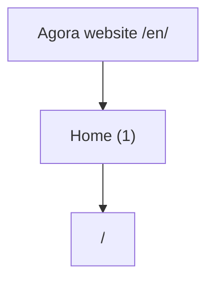

```mermaid
flowchart TD
  root["Agora website /en/"]
  root --> group_static_pages["Other Static Pages (49)"]
  group_static_pages --> page_1["/about-us"]
  click page_1 "https://prod.agora.io/en/about-us" "Open /en/about-us"
  group_static_pages --> page_2["/agora-content-standards-and-community-guidelines"]
  click page_2 "https://prod.agora.io/en/agora-content-standards-and-community-guidelines" "Open /en/agora-content-standards-and-community-guidelines"
  group_static_pages --> page_3["/agora-for-startups-program"]
  click page_3 "https://prod.agora.io/en/agora-for-startups-program" "Open /en/agora-for-startups-program"
  group_static_pages --> page_4["/agora-management"]
  click page_4 "https://prod.agora.io/en/agora-management" "Open /en/agora-management"
  group_static_pages --> page_5["/amazon-ivs-real-time-streaming-vs-agora-table"]
  click page_5 "https://prod.agora.io/en/amazon-ivs-real-time-streaming-vs-agora-table" "Open /en/amazon-ivs-real-time-streaming-vs-agora-table"
  group_static_pages --> page_6["/become-a-partner"]
  click page_6 "https://prod.agora.io/en/become-a-partner" "Open /en/become-a-partner"
  group_static_pages --> page_7["/boost-in-app-engagement-with-chat-and-messaging"]
  click page_7 "https://prod.agora.io/en/boost-in-app-engagement-with-chat-and-messaging" "Open /en/boost-in-app-engagement-with-chat-and-messaging"
  group_static_pages --> page_8["/careers"]
  click page_8 "https://prod.agora.io/en/careers" "Open /en/careers"
  group_static_pages --> page_9["/careers/open-positions"]
  click page_9 "https://prod.agora.io/en/careers/open-positions" "Open /en/careers/open-positions"
  group_static_pages --> page_10["/ccpa"]
  click page_10 "https://prod.agora.io/en/ccpa" "Open /en/ccpa"
  group_static_pages --> page_11["/cee2024-call-for-speakers"]
  click page_11 "https://prod.agora.io/en/cee2024-call-for-speakers" "Open /en/cee2024-call-for-speakers"
  group_static_pages --> page_12["/conversational-ai"]
  click page_12 "https://prod.agora.io/en/conversational-ai" "Open /en/conversational-ai"
  group_static_pages --> page_13["/conversational-ai-benchmark"]
  click page_13 "https://prod.agora.io/en/conversational-ai-benchmark" "Open /en/conversational-ai-benchmark"
  group_static_pages --> page_14["/convo-ai-microsoft-marketplace"]
  click page_14 "https://prod.agora.io/en/convo-ai-microsoft-marketplace" "Open /en/convo-ai-microsoft-marketplace"
  group_static_pages --> page_15["/customer-support"]
  click page_15 "https://prod.agora.io/en/customer-support" "Open /en/customer-support"
  group_static_pages --> page_16["/enable-in-game-chat-to-connect-players-and-boost-engagement"]
  click page_16 "https://prod.agora.io/en/enable-in-game-chat-to-connect-players-and-boost-engagement" "Open /en/enable-in-game-chat-to-connect-players-and-boost-engagement"
  group_static_pages --> page_17["/essential-elements-of-successful-telehealth-implementation"]
  click page_17 "https://prod.agora.io/en/essential-elements-of-successful-telehealth-implementation" "Open /en/essential-elements-of-successful-telehealth-implementation"
  group_static_pages --> page_18["/gartner-live-commerce-in-retail-market-guide"]
  click page_18 "https://prod.agora.io/en/gartner-live-commerce-in-retail-market-guide" "Open /en/gartner-live-commerce-in-retail-market-guide"
  group_static_pages --> page_19["/gartner-market-guide-for-live-commerce-in-retail"]
  click page_19 "https://prod.agora.io/en/gartner-market-guide-for-live-commerce-in-retail" "Open /en/gartner-market-guide-for-live-commerce-in-retail"
  group_static_pages --> page_20["/harness-the-power-of-social-interactions-to-deliver-captivating-gaming-experiences"]
  click page_20 "https://prod.agora.io/en/harness-the-power-of-social-interactions-to-deliver-captivating-gaming-experiences" "Open /en/harness-the-power-of-social-interactions-to-deliver-captivating-gaming-experiences"
  group_static_pages --> page_21["/how-agoras-edtech-customers-achieved-scalability-using-real-time-voice-and-video"]
  click page_21 "https://prod.agora.io/en/how-agoras-edtech-customers-achieved-scalability-using-real-time-voice-and-video" "Open /en/how-agoras-edtech-customers-achieved-scalability-using-real-time-voice-and-video"
  group_static_pages --> page_22["/how-real-time-engagement-drives-retention-in-gaming"]
  click page_22 "https://prod.agora.io/en/how-real-time-engagement-drives-retention-in-gaming" "Open /en/how-real-time-engagement-drives-retention-in-gaming"
  group_static_pages --> page_23["/how-real-time-engagement-is-reshaping-the-future-of-work"]
  click page_23 "https://prod.agora.io/en/how-real-time-engagement-is-reshaping-the-future-of-work" "Open /en/how-real-time-engagement-is-reshaping-the-future-of-work"
  group_static_pages --> page_24["/improve-user-experience-and-drive-monetization-for-social-apps"]
  click page_24 "https://prod.agora.io/en/improve-user-experience-and-drive-monetization-for-social-apps" "Open /en/improve-user-experience-and-drive-monetization-for-social-apps"
  group_static_pages --> page_25["/live-commerce-insights"]
  click page_25 "https://prod.agora.io/en/live-commerce-insights" "Open /en/live-commerce-insights"
  group_static_pages --> page_26["/media-coverage"]
  click page_26 "https://prod.agora.io/en/media-coverage" "Open /en/media-coverage"
  group_static_pages --> page_27["/open-source/ten-framework"]
  click page_27 "https://prod.agora.io/en/open-source/ten-framework" "Open /en/open-source/ten-framework"
  group_static_pages --> page_28["/rte2024/content-and-community-guidelines"]
  click page_28 "https://prod.agora.io/en/rte2024/content-and-community-guidelines" "Open /en/rte2024/content-and-community-guidelines"
  group_static_pages --> page_29["/sanitiaztion-check-cms/albertos"]
  click page_29 "https://prod.agora.io/en/sanitiaztion-check-cms/albertos" "Open /en/sanitiaztion-check-cms/albertos"
  group_static_pages --> page_30["/sanitiaztion-check-cms/albertos-1e27e"]
  click page_30 "https://prod.agora.io/en/sanitiaztion-check-cms/albertos-1e27e" "Open /en/sanitiaztion-check-cms/albertos-1e27e"
  group_static_pages --> page_31["/sanitiaztion-check-cms/albertos-28854"]
  click page_31 "https://prod.agora.io/en/sanitiaztion-check-cms/albertos-28854" "Open /en/sanitiaztion-check-cms/albertos-28854"
  group_static_pages --> page_32["/sdk-licence-agreement"]
  click page_32 "https://prod.agora.io/en/sdk-licence-agreement" "Open /en/sdk-licence-agreement"
  group_static_pages --> page_33["/sitemap"]
  click page_33 "https://prod.agora.io/en/sitemap" "Open /en/sitemap"
  group_static_pages --> page_34["/support-plans"]
  click page_34 "https://prod.agora.io/en/support-plans" "Open /en/support-plans"
  group_static_pages --> page_35["/talk-to-us"]
  click page_35 "https://prod.agora.io/en/talk-to-us" "Open /en/talk-to-us"
  group_static_pages --> page_36["/test-agora-2"]
  click page_36 "https://prod.agora.io/en/test-agora-2" "Open /en/test-agora-2"
  group_static_pages --> page_37["/test-agora-3"]
  click page_37 "https://prod.agora.io/en/test-agora-3" "Open /en/test-agora-3"
  group_static_pages --> page_38["/the-retail-revolution"]
  click page_38 "https://prod.agora.io/en/the-retail-revolution" "Open /en/the-retail-revolution"
  group_static_pages --> page_39["/the-secret-ingredient-for-online-human-interaction"]
  click page_39 "https://prod.agora.io/en/the-secret-ingredient-for-online-human-interaction" "Open /en/the-secret-ingredient-for-online-human-interaction"
  group_static_pages --> page_40["/tools/app-builder"]
  click page_40 "https://prod.agora.io/en/tools/app-builder" "Open /en/tools/app-builder"
  group_static_pages --> page_41["/tools/flexible-classroom"]
  click page_41 "https://prod.agora.io/en/tools/flexible-classroom" "Open /en/tools/flexible-classroom"
  group_static_pages --> page_42["/tools/ui-kits"]
  click page_42 "https://prod.agora.io/en/tools/ui-kits" "Open /en/tools/ui-kits"
  group_static_pages --> page_43["/trust-safety-with-agora"]
  click page_43 "https://prod.agora.io/en/trust-safety-with-agora" "Open /en/trust-safety-with-agora"
  group_static_pages --> page_44["/twilio-video-migration"]
  click page_44 "https://prod.agora.io/en/twilio-video-migration" "Open /en/twilio-video-migration"
  group_static_pages --> page_45["/twilio-zoom-agora-feature-comparison-table"]
  click page_45 "https://prod.agora.io/en/twilio-zoom-agora-feature-comparison-table" "Open /en/twilio-zoom-agora-feature-comparison-table"
  group_static_pages --> page_46["/unity"]
  click page_46 "https://prod.agora.io/en/unity" "Open /en/unity"
  group_static_pages --> page_47["/unlock-the-potential-of-the-metaverse"]
  click page_47 "https://prod.agora.io/en/unlock-the-potential-of-the-metaverse" "Open /en/unlock-the-potential-of-the-metaverse"
  group_static_pages --> page_48["/using-chat-to-power-social-games-engage-player-communities"]
  click page_48 "https://prod.agora.io/en/using-chat-to-power-social-games-engage-player-communities" "Open /en/using-chat-to-power-social-games-engage-player-communities"
  group_static_pages --> page_49["/webrtc"]
  click page_49 "https://prod.agora.io/en/webrtc" "Open /en/webrtc"
```

```mermaid
flowchart TD
  root["Agora website /en/"]
  root --> group_legal["Legal (12)"]
  group_legal --> page_1["/acceptable-use-policy"]
  click page_1 "https://prod.agora.io/en/acceptable-use-policy" "Open /en/acceptable-use-policy"
  group_legal --> page_2["/agora-certificate-program-terms-and-conditions"]
  click page_2 "https://prod.agora.io/en/agora-certificate-program-terms-and-conditions" "Open /en/agora-certificate-program-terms-and-conditions"
  group_legal --> page_3["/agora-infringement-policy"]
  click page_3 "https://prod.agora.io/en/agora-infringement-policy" "Open /en/agora-infringement-policy"
  group_legal --> page_4["/agora-processor-privacy-statement"]
  click page_4 "https://prod.agora.io/en/agora-processor-privacy-statement" "Open /en/agora-processor-privacy-statement"
  group_legal --> page_5["/compliance"]
  click page_5 "https://prod.agora.io/en/compliance" "Open /en/compliance"
  group_legal --> page_6["/cookie-policy"]
  click page_6 "https://prod.agora.io/en/cookie-policy" "Open /en/cookie-policy"
  group_legal --> page_7["/data-privacy-framework-notice"]
  click page_7 "https://prod.agora.io/en/data-privacy-framework-notice" "Open /en/data-privacy-framework-notice"
  group_legal --> page_8["/privacy-policy"]
  click page_8 "https://prod.agora.io/en/privacy-policy" "Open /en/privacy-policy"
  group_legal --> page_9["/rte2024/infringement-policy"]
  click page_9 "https://prod.agora.io/en/rte2024/infringement-policy" "Open /en/rte2024/infringement-policy"
  group_legal --> page_10["/rte2024/terms-and-conditions"]
  click page_10 "https://prod.agora.io/en/rte2024/terms-and-conditions" "Open /en/rte2024/terms-and-conditions"
  group_legal --> page_11["/terms-of-service"]
  click page_11 "https://prod.agora.io/en/terms-of-service" "Open /en/terms-of-service"
  group_legal --> page_12["/third-party-licenses"]
  click page_12 "https://prod.agora.io/en/third-party-licenses" "Open /en/third-party-licenses"
```

```mermaid
flowchart TD
  root["Agora website /en/"]
  root --> group_events["Events (11)"]
  group_events --> page_1["/event-category/on-demand"]
  click page_1 "https://prod.agora.io/en/event-category/on-demand" "Open /en/event-category/on-demand"
  group_events --> page_2["/event-category/online-virtual-event"]
  click page_2 "https://prod.agora.io/en/event-category/online-virtual-event" "Open /en/event-category/online-virtual-event"
  group_events --> page_3["/event-category/product"]
  click page_3 "https://prod.agora.io/en/event-category/product" "Open /en/event-category/product"
  group_events --> page_4["/event-category/upcoming"]
  click page_4 "https://prod.agora.io/en/event-category/upcoming" "Open /en/event-category/upcoming"
  group_events --> page_5["/events"]
  click page_5 "https://prod.agora.io/en/events" "Open /en/events"
  group_events --> page_6["/events/colombia-tech-week"]
  click page_6 "https://prod.agora.io/en/events/colombia-tech-week" "Open /en/events/colombia-tech-week"
  group_events --> page_7["/events/ibc-convention"]
  click page_7 "https://prod.agora.io/en/events/ibc-convention" "Open /en/events/ibc-convention"
  group_events --> page_8["/events/ieee-rtc-conference"]
  click page_8 "https://prod.agora.io/en/events/ieee-rtc-conference" "Open /en/events/ieee-rtc-conference"
  group_events --> page_9["/events/mexico-tech-week"]
  click page_9 "https://prod.agora.io/en/events/mexico-tech-week" "Open /en/events/mexico-tech-week"
  group_events --> page_10["/events/social-commerce-conference"]
  click page_10 "https://prod.agora.io/en/events/social-commerce-conference" "Open /en/events/social-commerce-conference"
  group_events --> page_11["/events/test-event"]
  click page_11 "https://prod.agora.io/en/events/test-event" "Open /en/events/test-event"
```

```mermaid
flowchart TD
  root["Agora website /en/"]
  root --> group_extensions["Extensions (14)"]
  group_extensions --> page_1["/extensions/activefence-video-moderation"]
  click page_1 "https://prod.agora.io/en/extensions/activefence-video-moderation" "Open /en/extensions/activefence-video-moderation"
  group_extensions --> page_2["/extensions/agora-noise-suppression"]
  click page_2 "https://prod.agora.io/en/extensions/agora-noise-suppression" "Open /en/extensions/agora-noise-suppression"
  group_extensions --> page_3["/extensions/agora-spatial-audio"]
  click page_3 "https://prod.agora.io/en/extensions/agora-spatial-audio" "Open /en/extensions/agora-spatial-audio"
  group_extensions --> page_4["/extensions/banuba"]
  click page_4 "https://prod.agora.io/en/extensions/banuba" "Open /en/extensions/banuba"
  group_extensions --> page_5["/extensions/deepar"]
  click page_5 "https://prod.agora.io/en/extensions/deepar" "Open /en/extensions/deepar"
  group_extensions --> page_6["/extensions/faceunity-ar-en"]
  click page_6 "https://prod.agora.io/en/extensions/faceunity-ar-en" "Open /en/extensions/faceunity-ar-en"
  group_extensions --> page_7["/extensions/palabra-ai"]
  click page_7 "https://prod.agora.io/en/extensions/palabra-ai" "Open /en/extensions/palabra-ai"
  group_extensions --> page_8["/extensions-marketplace"]
  click page_8 "https://prod.agora.io/en/extensions-marketplace" "Open /en/extensions-marketplace"
  group_extensions --> page_9["/extensions-marketplace/copyright-trademark-infringement-policy"]
  click page_9 "https://prod.agora.io/en/extensions-marketplace/copyright-trademark-infringement-policy" "Open /en/extensions-marketplace/copyright-trademark-infringement-policy"
  group_extensions --> page_10["/extensions-marketplace/end-user-license-agreement"]
  click page_10 "https://prod.agora.io/en/extensions-marketplace/end-user-license-agreement" "Open /en/extensions-marketplace/end-user-license-agreement"
  group_extensions --> page_11["/extensions-marketplace/frequently-asked-questions"]
  click page_11 "https://prod.agora.io/en/extensions-marketplace/frequently-asked-questions" "Open /en/extensions-marketplace/frequently-asked-questions"
  group_extensions --> page_12["/extensions-marketplace/terms-of-use"]
  click page_12 "https://prod.agora.io/en/extensions-marketplace/terms-of-use" "Open /en/extensions-marketplace/terms-of-use"
  group_extensions --> page_13["/extensions-marketplace/thank-you"]
  click page_13 "https://prod.agora.io/en/extensions-marketplace/thank-you" "Open /en/extensions-marketplace/thank-you"
  group_extensions --> page_14["/extensions-marketplace/vendor-application"]
  click page_14 "https://prod.agora.io/en/extensions-marketplace/vendor-application" "Open /en/extensions-marketplace/vendor-application"
```

```mermaid
flowchart TD
  root["Agora website /en/"]
  root --> group_pricing["Pricing (26)"]
  group_pricing --> page_1["/pricing"]
  click page_1 "https://prod.agora.io/en/pricing" "Open /en/pricing"
  group_pricing --> page_2["/pricing/3d-spatial-audio"]
  click page_2 "https://prod.agora.io/en/pricing/3d-spatial-audio" "Open /en/pricing/3d-spatial-audio"
  group_pricing --> page_3["/pricing/agora-conversational-ai-platform"]
  click page_3 "https://prod.agora.io/en/pricing/agora-conversational-ai-platform" "Open /en/pricing/agora-conversational-ai-platform"
  group_pricing --> page_4["/pricing/agora-rtc"]
  click page_4 "https://prod.agora.io/en/pricing/agora-rtc" "Open /en/pricing/agora-rtc"
  group_pricing --> page_5["/pricing/ai-noise-suppression"]
  click page_5 "https://prod.agora.io/en/pricing/ai-noise-suppression" "Open /en/pricing/ai-noise-suppression"
  group_pricing --> page_6["/pricing/analytics"]
  click page_6 "https://prod.agora.io/en/pricing/analytics" "Open /en/pricing/analytics"
  group_pricing --> page_7["/pricing/broadcast-streaming"]
  click page_7 "https://prod.agora.io/en/pricing/broadcast-streaming" "Open /en/pricing/broadcast-streaming"
  group_pricing --> page_8["/pricing/chat"]
  click page_8 "https://prod.agora.io/en/pricing/chat" "Open /en/pricing/chat"
  group_pricing --> page_9["/pricing/cloud-proxy"]
  click page_9 "https://prod.agora.io/en/pricing/cloud-proxy" "Open /en/pricing/cloud-proxy"
  group_pricing --> page_10["/pricing/cloud-transcoding"]
  click page_10 "https://prod.agora.io/en/pricing/cloud-transcoding" "Open /en/pricing/cloud-transcoding"
  group_pricing --> page_11["/pricing/conversational-ai-engine"]
  click page_11 "https://prod.agora.io/en/pricing/conversational-ai-engine" "Open /en/pricing/conversational-ai-engine"
  group_pricing --> page_12["/pricing/convo-ai-call-center"]
  click page_12 "https://prod.agora.io/en/pricing/convo-ai-call-center" "Open /en/pricing/convo-ai-call-center"
  group_pricing --> page_13["/pricing/convoai-device-kit"]
  click page_13 "https://prod.agora.io/en/pricing/convoai-device-kit" "Open /en/pricing/convoai-device-kit"
  group_pricing --> page_14["/pricing/flexible-classroom"]
  click page_14 "https://prod.agora.io/en/pricing/flexible-classroom" "Open /en/pricing/flexible-classroom"
  group_pricing --> page_15["/pricing/interactive-live-streaming"]
  click page_15 "https://prod.agora.io/en/pricing/interactive-live-streaming" "Open /en/pricing/interactive-live-streaming"
  group_pricing --> page_16["/pricing/interactive-whiteboard"]
  click page_16 "https://prod.agora.io/en/pricing/interactive-whiteboard" "Open /en/pricing/interactive-whiteboard"
  group_pricing --> page_17["/pricing/iot-sdk"]
  click page_17 "https://prod.agora.io/en/pricing/iot-sdk" "Open /en/pricing/iot-sdk"
  group_pricing --> page_18["/pricing/media-gateway"]
  click page_18 "https://prod.agora.io/en/pricing/media-gateway" "Open /en/pricing/media-gateway"
  group_pricing --> page_19["/pricing/media-pull"]
  click page_19 "https://prod.agora.io/en/pricing/media-pull" "Open /en/pricing/media-pull"
  group_pricing --> page_20["/pricing/media-push"]
  click page_20 "https://prod.agora.io/en/pricing/media-push" "Open /en/pricing/media-push"
  group_pricing --> page_21["/pricing/real-time-translation"]
  click page_21 "https://prod.agora.io/en/pricing/real-time-translation" "Open /en/pricing/real-time-translation"
  group_pricing --> page_22["/pricing/recording"]
  click page_22 "https://prod.agora.io/en/pricing/recording" "Open /en/pricing/recording"
  group_pricing --> page_23["/pricing/signaling"]
  click page_23 "https://prod.agora.io/en/pricing/signaling" "Open /en/pricing/signaling"
  group_pricing --> page_24["/pricing/speech-to-text"]
  click page_24 "https://prod.agora.io/en/pricing/speech-to-text" "Open /en/pricing/speech-to-text"
  group_pricing --> page_25["/pricing/video-calling"]
  click page_25 "https://prod.agora.io/en/pricing/video-calling" "Open /en/pricing/video-calling"
  group_pricing --> page_26["/pricing/voice-calling"]
  click page_26 "https://prod.agora.io/en/pricing/voice-calling" "Open /en/pricing/voice-calling"
```

# Detailed Website Route Chart

Detailed route map with one node for every included page in `WEBSITE_PAGES.md`.

**Included pages:** 712

**Excluded:** `/en/products/*`, `/en/use-cases/*`, and legacy `/en/solutions/*` routes, including their index pages.

The category-specific charts in `route-charts/` are the recommended way to view the map.

## Category Index

| Category | Pages |
| --- | ---: |
| Home | 1 |
| Other Static Pages | 49 |
| Legal | 12 |
| Forms and Campaigns | 46 |
| Blog and Categories | 319 |
| Events | 11 |
| Extensions | 14 |
| News and Newsroom | 101 |
| Partners | 70 |
| Pricing | 26 |
| Customers and Success Stories | 63 |

## Category Charts

Each category below has its own independent clickable Mermaid diagram.

# Home Route Chart

Detailed clickable route map for 1 home page.

Products, Use Cases, and legacy `/solutions` routes are excluded. For page entry points and navigation sources, see the separate entry-point reports.

## Route Map



## Complete Route List

| # | Route family | Page path | Full URL |
| ---: | --- | --- | --- |
| 1 | Home | [/en](https://prod.agora.io/en) | https://prod.agora.io/en |
# Other Static Pages Route Chart

Detailed clickable route map for 49 other static pages pages.

Products, Use Cases, and legacy `/solutions` routes are excluded. For page entry points and navigation sources, see the separate entry-point reports.

## Route Map



## Complete Route List

| # | Route family | Page path | Full URL |
| ---: | --- | --- | --- |
| 1 | Other Static Pages | [/en/about-us](https://prod.agora.io/en/about-us) | https://prod.agora.io/en/about-us |
| 2 | Other Static Pages | [/en/agora-content-standards-and-community-guidelines](https://prod.agora.io/en/agora-content-standards-and-community-guidelines) | https://prod.agora.io/en/agora-content-standards-and-community-guidelines |
| 3 | Other Static Pages | [/en/agora-for-startups-program](https://prod.agora.io/en/agora-for-startups-program) | https://prod.agora.io/en/agora-for-startups-program |
| 4 | Other Static Pages | [/en/agora-management](https://prod.agora.io/en/agora-management) | https://prod.agora.io/en/agora-management |
| 5 | Other Static Pages | [/en/amazon-ivs-real-time-streaming-vs-agora-table](https://prod.agora.io/en/amazon-ivs-real-time-streaming-vs-agora-table) | https://prod.agora.io/en/amazon-ivs-real-time-streaming-vs-agora-table |
| 6 | Other Static Pages | [/en/become-a-partner](https://prod.agora.io/en/become-a-partner) | https://prod.agora.io/en/become-a-partner |
| 7 | Other Static Pages | [/en/boost-in-app-engagement-with-chat-and-messaging](https://prod.agora.io/en/boost-in-app-engagement-with-chat-and-messaging) | https://prod.agora.io/en/boost-in-app-engagement-with-chat-and-messaging |
| 8 | Other Static Pages | [/en/careers](https://prod.agora.io/en/careers) | https://prod.agora.io/en/careers |
| 9 | Other Static Pages | [/en/careers/open-positions](https://prod.agora.io/en/careers/open-positions) | https://prod.agora.io/en/careers/open-positions |
| 10 | Other Static Pages | [/en/ccpa](https://prod.agora.io/en/ccpa) | https://prod.agora.io/en/ccpa |
| 11 | Other Static Pages | [/en/cee2024-call-for-speakers](https://prod.agora.io/en/cee2024-call-for-speakers) | https://prod.agora.io/en/cee2024-call-for-speakers |
| 12 | Other Static Pages | [/en/conversational-ai](https://prod.agora.io/en/conversational-ai) | https://prod.agora.io/en/conversational-ai |
| 13 | Other Static Pages | [/en/conversational-ai-benchmark](https://prod.agora.io/en/conversational-ai-benchmark) | https://prod.agora.io/en/conversational-ai-benchmark |
| 14 | Other Static Pages | [/en/convo-ai-microsoft-marketplace](https://prod.agora.io/en/convo-ai-microsoft-marketplace) | https://prod.agora.io/en/convo-ai-microsoft-marketplace |
| 15 | Other Static Pages | [/en/customer-support](https://prod.agora.io/en/customer-support) | https://prod.agora.io/en/customer-support |
| 16 | Other Static Pages | [/en/enable-in-game-chat-to-connect-players-and-boost-engagement](https://prod.agora.io/en/enable-in-game-chat-to-connect-players-and-boost-engagement) | https://prod.agora.io/en/enable-in-game-chat-to-connect-players-and-boost-engagement |
| 17 | Other Static Pages | [/en/essential-elements-of-successful-telehealth-implementation](https://prod.agora.io/en/essential-elements-of-successful-telehealth-implementation) | https://prod.agora.io/en/essential-elements-of-successful-telehealth-implementation |
| 18 | Other Static Pages | [/en/gartner-live-commerce-in-retail-market-guide](https://prod.agora.io/en/gartner-live-commerce-in-retail-market-guide) | https://prod.agora.io/en/gartner-live-commerce-in-retail-market-guide |
| 19 | Other Static Pages | [/en/gartner-market-guide-for-live-commerce-in-retail](https://prod.agora.io/en/gartner-market-guide-for-live-commerce-in-retail) | https://prod.agora.io/en/gartner-market-guide-for-live-commerce-in-retail |
| 20 | Other Static Pages | [/en/harness-the-power-of-social-interactions-to-deliver-captivating-gaming-experiences](https://prod.agora.io/en/harness-the-power-of-social-interactions-to-deliver-captivating-gaming-experiences) | https://prod.agora.io/en/harness-the-power-of-social-interactions-to-deliver-captivating-gaming-experiences |
| 21 | Other Static Pages | [/en/how-agoras-edtech-customers-achieved-scalability-using-real-time-voice-and-video](https://prod.agora.io/en/how-agoras-edtech-customers-achieved-scalability-using-real-time-voice-and-video) | https://prod.agora.io/en/how-agoras-edtech-customers-achieved-scalability-using-real-time-voice-and-video |
| 22 | Other Static Pages | [/en/how-real-time-engagement-drives-retention-in-gaming](https://prod.agora.io/en/how-real-time-engagement-drives-retention-in-gaming) | https://prod.agora.io/en/how-real-time-engagement-drives-retention-in-gaming |
| 23 | Other Static Pages | [/en/how-real-time-engagement-is-reshaping-the-future-of-work](https://prod.agora.io/en/how-real-time-engagement-is-reshaping-the-future-of-work) | https://prod.agora.io/en/how-real-time-engagement-is-reshaping-the-future-of-work |
| 24 | Other Static Pages | [/en/improve-user-experience-and-drive-monetization-for-social-apps](https://prod.agora.io/en/improve-user-experience-and-drive-monetization-for-social-apps) | https://prod.agora.io/en/improve-user-experience-and-drive-monetization-for-social-apps |
| 25 | Other Static Pages | [/en/live-commerce-insights](https://prod.agora.io/en/live-commerce-insights) | https://prod.agora.io/en/live-commerce-insights |
| 26 | Other Static Pages | [/en/media-coverage](https://prod.agora.io/en/media-coverage) | https://prod.agora.io/en/media-coverage |
| 27 | Other Static Pages | [/en/open-source/ten-framework](https://prod.agora.io/en/open-source/ten-framework) | https://prod.agora.io/en/open-source/ten-framework |
| 28 | Other Static Pages | [/en/rte2024/content-and-community-guidelines](https://prod.agora.io/en/rte2024/content-and-community-guidelines) | https://prod.agora.io/en/rte2024/content-and-community-guidelines |
| 29 | Other Static Pages | [/en/sanitiaztion-check-cms/albertos](https://prod.agora.io/en/sanitiaztion-check-cms/albertos) | https://prod.agora.io/en/sanitiaztion-check-cms/albertos |
| 30 | Other Static Pages | [/en/sanitiaztion-check-cms/albertos-1e27e](https://prod.agora.io/en/sanitiaztion-check-cms/albertos-1e27e) | https://prod.agora.io/en/sanitiaztion-check-cms/albertos-1e27e |
| 31 | Other Static Pages | [/en/sanitiaztion-check-cms/albertos-28854](https://prod.agora.io/en/sanitiaztion-check-cms/albertos-28854) | https://prod.agora.io/en/sanitiaztion-check-cms/albertos-28854 |
| 32 | Other Static Pages | [/en/sdk-licence-agreement](https://prod.agora.io/en/sdk-licence-agreement) | https://prod.agora.io/en/sdk-licence-agreement |
| 33 | Other Static Pages | [/en/sitemap](https://prod.agora.io/en/sitemap) | https://prod.agora.io/en/sitemap |
| 34 | Other Static Pages | [/en/support-plans](https://prod.agora.io/en/support-plans) | https://prod.agora.io/en/support-plans |
| 35 | Other Static Pages | [/en/talk-to-us](https://prod.agora.io/en/talk-to-us) | https://prod.agora.io/en/talk-to-us |
| 36 | Other Static Pages | [/en/test-agora-2](https://prod.agora.io/en/test-agora-2) | https://prod.agora.io/en/test-agora-2 |
| 37 | Other Static Pages | [/en/test-agora-3](https://prod.agora.io/en/test-agora-3) | https://prod.agora.io/en/test-agora-3 |
| 38 | Other Static Pages | [/en/the-retail-revolution](https://prod.agora.io/en/the-retail-revolution) | https://prod.agora.io/en/the-retail-revolution |
| 39 | Other Static Pages | [/en/the-secret-ingredient-for-online-human-interaction](https://prod.agora.io/en/the-secret-ingredient-for-online-human-interaction) | https://prod.agora.io/en/the-secret-ingredient-for-online-human-interaction |
| 40 | Other Static Pages | [/en/tools/app-builder](https://prod.agora.io/en/tools/app-builder) | https://prod.agora.io/en/tools/app-builder |
| 41 | Other Static Pages | [/en/tools/flexible-classroom](https://prod.agora.io/en/tools/flexible-classroom) | https://prod.agora.io/en/tools/flexible-classroom |
| 42 | Other Static Pages | [/en/tools/ui-kits](https://prod.agora.io/en/tools/ui-kits) | https://prod.agora.io/en/tools/ui-kits |
| 43 | Other Static Pages | [/en/trust-safety-with-agora](https://prod.agora.io/en/trust-safety-with-agora) | https://prod.agora.io/en/trust-safety-with-agora |
| 44 | Other Static Pages | [/en/twilio-video-migration](https://prod.agora.io/en/twilio-video-migration) | https://prod.agora.io/en/twilio-video-migration |
| 45 | Other Static Pages | [/en/twilio-zoom-agora-feature-comparison-table](https://prod.agora.io/en/twilio-zoom-agora-feature-comparison-table) | https://prod.agora.io/en/twilio-zoom-agora-feature-comparison-table |
| 46 | Other Static Pages | [/en/unity](https://prod.agora.io/en/unity) | https://prod.agora.io/en/unity |
| 47 | Other Static Pages | [/en/unlock-the-potential-of-the-metaverse](https://prod.agora.io/en/unlock-the-potential-of-the-metaverse) | https://prod.agora.io/en/unlock-the-potential-of-the-metaverse |
| 48 | Other Static Pages | [/en/using-chat-to-power-social-games-engage-player-communities](https://prod.agora.io/en/using-chat-to-power-social-games-engage-player-communities) | https://prod.agora.io/en/using-chat-to-power-social-games-engage-player-communities |
| 49 | Other Static Pages | [/en/webrtc](https://prod.agora.io/en/webrtc) | https://prod.agora.io/en/webrtc |
# Legal Route Chart

Detailed clickable route map for 12 legal pages.

Products, Use Cases, and legacy `/solutions` routes are excluded. For page entry points and navigation sources, see the separate entry-point reports.

## Route Map



## Complete Route List

| # | Route family | Page path | Full URL |
| ---: | --- | --- | --- |
| 1 | Legal | [/en/acceptable-use-policy](https://prod.agora.io/en/acceptable-use-policy) | https://prod.agora.io/en/acceptable-use-policy |
| 2 | Legal | [/en/agora-certificate-program-terms-and-conditions](https://prod.agora.io/en/agora-certificate-program-terms-and-conditions) | https://prod.agora.io/en/agora-certificate-program-terms-and-conditions |
| 3 | Legal | [/en/agora-infringement-policy](https://prod.agora.io/en/agora-infringement-policy) | https://prod.agora.io/en/agora-infringement-policy |
| 4 | Legal | [/en/agora-processor-privacy-statement](https://prod.agora.io/en/agora-processor-privacy-statement) | https://prod.agora.io/en/agora-processor-privacy-statement |
| 5 | Legal | [/en/compliance](https://prod.agora.io/en/compliance) | https://prod.agora.io/en/compliance |
| 6 | Legal | [/en/cookie-policy](https://prod.agora.io/en/cookie-policy) | https://prod.agora.io/en/cookie-policy |
| 7 | Legal | [/en/data-privacy-framework-notice](https://prod.agora.io/en/data-privacy-framework-notice) | https://prod.agora.io/en/data-privacy-framework-notice |
| 8 | Legal | [/en/privacy-policy](https://prod.agora.io/en/privacy-policy) | https://prod.agora.io/en/privacy-policy |
| 9 | Legal | [/en/rte2024/infringement-policy](https://prod.agora.io/en/rte2024/infringement-policy) | https://prod.agora.io/en/rte2024/infringement-policy |
| 10 | Legal | [/en/rte2024/terms-and-conditions](https://prod.agora.io/en/rte2024/terms-and-conditions) | https://prod.agora.io/en/rte2024/terms-and-conditions |
| 11 | Legal | [/en/terms-of-service](https://prod.agora.io/en/terms-of-service) | https://prod.agora.io/en/terms-of-service |
| 12 | Legal | [/en/third-party-licenses](https://prod.agora.io/en/third-party-licenses) | https://prod.agora.io/en/third-party-licenses |
# Forms and Campaigns Route Chart

Detailed clickable route map for 46 forms and campaigns pages.

Products, Use Cases, and legacy `/solutions` routes are excluded. For page entry points and navigation sources, see the separate entry-point reports.

## Route Map


## Complete Route List

| # | Route family | Page path | Full URL |
| ---: | --- | --- | --- |
| 1 | Forms and Campaigns | [/en/advances-in-ai-for-telehealth-webinar](https://prod.agora.io/en/advances-in-ai-for-telehealth-webinar) | https://prod.agora.io/en/advances-in-ai-for-telehealth-webinar |
| 2 | Forms and Campaigns | [/en/advances-in-ai-for-telehealth-webinar/thank-you](https://prod.agora.io/en/advances-in-ai-for-telehealth-webinar/thank-you) | https://prod.agora.io/en/advances-in-ai-for-telehealth-webinar/thank-you |
| 3 | Forms and Campaigns | [/en/advances-in-ar-vr-for-telehealth-webinar](https://prod.agora.io/en/advances-in-ar-vr-for-telehealth-webinar) | https://prod.agora.io/en/advances-in-ar-vr-for-telehealth-webinar |
| 4 | Forms and Campaigns | [/en/advances-in-ar-vr-for-telehealth-webinar/thank-you](https://prod.agora.io/en/advances-in-ar-vr-for-telehealth-webinar/thank-you) | https://prod.agora.io/en/advances-in-ar-vr-for-telehealth-webinar/thank-you |
| 5 | Forms and Campaigns | [/en/agent-studio-pricing-request-form](https://prod.agora.io/en/agent-studio-pricing-request-form) | https://prod.agora.io/en/agent-studio-pricing-request-form |
| 6 | Forms and Campaigns | [/en/animation-demo](https://prod.agora.io/en/animation-demo) | https://prod.agora.io/en/animation-demo |
| 7 | Forms and Campaigns | [/en/boost-in-app-engagement-with-chat-and-messaging/thank-you](https://prod.agora.io/en/boost-in-app-engagement-with-chat-and-messaging/thank-you) | https://prod.agora.io/en/boost-in-app-engagement-with-chat-and-messaging/thank-you |
| 8 | Forms and Campaigns | [/en/convoai-device-kit-information-request-form](https://prod.agora.io/en/convoai-device-kit-information-request-form) | https://prod.agora.io/en/convoai-device-kit-information-request-form |
| 9 | Forms and Campaigns | [/en/convoai-engine-information-request-form](https://prod.agora.io/en/convoai-engine-information-request-form) | https://prod.agora.io/en/convoai-engine-information-request-form |
| 10 | Forms and Campaigns | [/en/deliver-customized-online-tutoring-experiences-ebook](https://prod.agora.io/en/deliver-customized-online-tutoring-experiences-ebook) | https://prod.agora.io/en/deliver-customized-online-tutoring-experiences-ebook |
| 11 | Forms and Campaigns | [/en/deliver-customized-online-tutoring-experiences-ebook/thank-you](https://prod.agora.io/en/deliver-customized-online-tutoring-experiences-ebook/thank-you) | https://prod.agora.io/en/deliver-customized-online-tutoring-experiences-ebook/thank-you |
| 12 | Forms and Campaigns | [/en/development-partner-form](https://prod.agora.io/en/development-partner-form) | https://prod.agora.io/en/development-partner-form |
| 13 | Forms and Campaigns | [/en/ebook/thank-you](https://prod.agora.io/en/ebook/thank-you) | https://prod.agora.io/en/ebook/thank-you |
| 14 | Forms and Campaigns | [/en/ebook-enhancing-professional-training-with-rte](https://prod.agora.io/en/ebook-enhancing-professional-training-with-rte) | https://prod.agora.io/en/ebook-enhancing-professional-training-with-rte |
| 15 | Forms and Campaigns | [/en/ebook-enhancing-professional-training-with-rte/thank-you](https://prod.agora.io/en/ebook-enhancing-professional-training-with-rte/thank-you) | https://prod.agora.io/en/ebook-enhancing-professional-training-with-rte/thank-you |
| 16 | Forms and Campaigns | [/en/embedded-reseller-distributor-form](https://prod.agora.io/en/embedded-reseller-distributor-form) | https://prod.agora.io/en/embedded-reseller-distributor-form |
| 17 | Forms and Campaigns | [/en/essential-elements-of-successful-telehealth-implementation/thank-you](https://prod.agora.io/en/essential-elements-of-successful-telehealth-implementation/thank-you) | https://prod.agora.io/en/essential-elements-of-successful-telehealth-implementation/thank-you |
| 18 | Forms and Campaigns | [/en/gartner-market-guide-for-live-commerce-in-retail/thank-you](https://prod.agora.io/en/gartner-market-guide-for-live-commerce-in-retail/thank-you) | https://prod.agora.io/en/gartner-market-guide-for-live-commerce-in-retail/thank-you |
| 19 | Forms and Campaigns | [/en/harness-the-power-of-social-interactions-to-deliver-captivating-gaming-experiences/thank-you](https://prod.agora.io/en/harness-the-power-of-social-interactions-to-deliver-captivating-gaming-experiences/thank-you) | https://prod.agora.io/en/harness-the-power-of-social-interactions-to-deliver-captivating-gaming-experiences/thank-you |
| 20 | Forms and Campaigns | [/en/how-agoras-edtech-customers-achieved-scalability-using-real-time-voice-and-video/thank-you](https://prod.agora.io/en/how-agoras-edtech-customers-achieved-scalability-using-real-time-voice-and-video/thank-you) | https://prod.agora.io/en/how-agoras-edtech-customers-achieved-scalability-using-real-time-voice-and-video/thank-you |
| 21 | Forms and Campaigns | [/en/how-innovative-games-are-engaging-players-ebook](https://prod.agora.io/en/how-innovative-games-are-engaging-players-ebook) | https://prod.agora.io/en/how-innovative-games-are-engaging-players-ebook |
| 22 | Forms and Campaigns | [/en/how-innovative-games-are-engaging-players-ebook/thank-you](https://prod.agora.io/en/how-innovative-games-are-engaging-players-ebook/thank-you) | https://prod.agora.io/en/how-innovative-games-are-engaging-players-ebook/thank-you |
| 23 | Forms and Campaigns | [/en/how-real-time-engagement-drives-retention-in-gaming/thank-you](https://prod.agora.io/en/how-real-time-engagement-drives-retention-in-gaming/thank-you) | https://prod.agora.io/en/how-real-time-engagement-drives-retention-in-gaming/thank-you |
| 24 | Forms and Campaigns | [/en/how-to-enable-in-game-chat-to-connect-players-and-boost-engagement/thank-you](https://prod.agora.io/en/how-to-enable-in-game-chat-to-connect-players-and-boost-engagement/thank-you) | https://prod.agora.io/en/how-to-enable-in-game-chat-to-connect-players-and-boost-engagement/thank-you |
| 25 | Forms and Campaigns | [/en/ia-conversacional-agora-demonstracoes](https://prod.agora.io/en/ia-conversacional-agora-demonstracoes) | https://prod.agora.io/en/ia-conversacional-agora-demonstracoes |
| 26 | Forms and Campaigns | [/en/improve-user-experience-and-drive-monetization-for-social-apps/thank-you](https://prod.agora.io/en/improve-user-experience-and-drive-monetization-for-social-apps/thank-you) | https://prod.agora.io/en/improve-user-experience-and-drive-monetization-for-social-apps/thank-you |
| 27 | Forms and Campaigns | [/en/iot-sdk-information-request-form](https://prod.agora.io/en/iot-sdk-information-request-form) | https://prod.agora.io/en/iot-sdk-information-request-form |
| 28 | Forms and Campaigns | [/en/live-commerce-insights/thank-you](https://prod.agora.io/en/live-commerce-insights/thank-you) | https://prod.agora.io/en/live-commerce-insights/thank-you |
| 29 | Forms and Campaigns | [/en/real-time-engagement-reshaping-the-future-of-work/thank-you](https://prod.agora.io/en/real-time-engagement-reshaping-the-future-of-work/thank-you) | https://prod.agora.io/en/real-time-engagement-reshaping-the-future-of-work/thank-you |
| 30 | Forms and Campaigns | [/en/reseller-partner-form](https://prod.agora.io/en/reseller-partner-form) | https://prod.agora.io/en/reseller-partner-form |
| 31 | Forms and Campaigns | [/en/schedule-a-demo](https://prod.agora.io/en/schedule-a-demo) | https://prod.agora.io/en/schedule-a-demo |
| 32 | Forms and Campaigns | [/en/schedule-a-demo/thank-you](https://prod.agora.io/en/schedule-a-demo/thank-you) | https://prod.agora.io/en/schedule-a-demo/thank-you |
| 33 | Forms and Campaigns | [/en/solution-brief/thank-you](https://prod.agora.io/en/solution-brief/thank-you) | https://prod.agora.io/en/solution-brief/thank-you |
| 34 | Forms and Campaigns | [/en/talk-to-us/thank-you](https://prod.agora.io/en/talk-to-us/thank-you) | https://prod.agora.io/en/talk-to-us/thank-you |
| 35 | Forms and Campaigns | [/en/technology-partner-form](https://prod.agora.io/en/technology-partner-form) | https://prod.agora.io/en/technology-partner-form |
| 36 | Forms and Campaigns | [/en/thankyou](https://prod.agora.io/en/thankyou) | https://prod.agora.io/en/thankyou |
| 37 | Forms and Campaigns | [/en/the-agora-platform-advantage](https://prod.agora.io/en/the-agora-platform-advantage) | https://prod.agora.io/en/the-agora-platform-advantage |
| 38 | Forms and Campaigns | [/en/the-retail-revolution/thank-you](https://prod.agora.io/en/the-retail-revolution/thank-you) | https://prod.agora.io/en/the-retail-revolution/thank-you |
| 39 | Forms and Campaigns | [/en/the-secret-ingredient-for-online-human-interaction/thank-you](https://prod.agora.io/en/the-secret-ingredient-for-online-human-interaction/thank-you) | https://prod.agora.io/en/the-secret-ingredient-for-online-human-interaction/thank-you |
| 40 | Forms and Campaigns | [/en/trust-safety-with-agora/thank-you](https://prod.agora.io/en/trust-safety-with-agora/thank-you) | https://prod.agora.io/en/trust-safety-with-agora/thank-you |
| 41 | Forms and Campaigns | [/en/unlock-the-potential-of-the-metaverse/thank-you](https://prod.agora.io/en/unlock-the-potential-of-the-metaverse/thank-you) | https://prod.agora.io/en/unlock-the-potential-of-the-metaverse/thank-you |
| 42 | Forms and Campaigns | [/en/unlock-the-potential-of-the-metaverse-a-webinar-on-enabling-ubiquitous-availability](https://prod.agora.io/en/unlock-the-potential-of-the-metaverse-a-webinar-on-enabling-ubiquitous-availability) | https://prod.agora.io/en/unlock-the-potential-of-the-metaverse-a-webinar-on-enabling-ubiquitous-availability |
| 43 | Forms and Campaigns | [/en/unlock-the-potential-of-the-metaverse-webinar/thank-you](https://prod.agora.io/en/unlock-the-potential-of-the-metaverse-webinar/thank-you) | https://prod.agora.io/en/unlock-the-potential-of-the-metaverse-webinar/thank-you |
| 44 | Forms and Campaigns | [/en/using-chat-to-power-social-games-engage-player-communities/thank-you](https://prod.agora.io/en/using-chat-to-power-social-games-engage-player-communities/thank-you) | https://prod.agora.io/en/using-chat-to-power-social-games-engage-player-communities/thank-you |
| 45 | Forms and Campaigns | [/en/webinar-how-social-app-engagement-retention-enables-monetization](https://prod.agora.io/en/webinar-how-social-app-engagement-retention-enables-monetization) | https://prod.agora.io/en/webinar-how-social-app-engagement-retention-enables-monetization |
| 46 | Forms and Campaigns | [/en/webinar-how-social-app-engagement-retention-enables-monetization/thank-you](https://prod.agora.io/en/webinar-how-social-app-engagement-retention-enables-monetization/thank-you) | https://prod.agora.io/en/webinar-how-social-app-engagement-retention-enables-monetization/thank-you |
# Blog and Categories Route Chart

Detailed clickable route map for 319 blog and categories pages.

Products, Use Cases, and legacy `/solutions` routes are excluded. For page entry points and navigation sources, see the separate entry-point reports.

## Route Map

```mermaid
flowchart TD
  root["Agora website /en/"]
  root --> group_blog["Blog and Categories (319)"]
  group_blog --> page_1["/blog"]
  click page_1 "https://prod.agora.io/en/blog" "Open /en/blog"
  group_blog --> page_2["/blog/1-to-1-video-chat-app-on-android-using-agora"]
  click page_2 "https://prod.agora.io/en/blog/1-to-1-video-chat-app-on-android-using-agora" "Open /en/blog/1-to-1-video-chat-app-on-android-using-agora"
  group_blog --> page_3["/blog/2024-the-year-ahead-in-gaming-metaverse-innovations"]
  click page_3 "https://prod.agora.io/en/blog/2024-the-year-ahead-in-gaming-metaverse-innovations" "Open /en/blog/2024-the-year-ahead-in-gaming-metaverse-innovations"
  group_blog --> page_4["/blog/2-click-setup-testing-token-server"]
  click page_4 "https://prod.agora.io/en/blog/2-click-setup-testing-token-server" "Open /en/blog/2-click-setup-testing-token-server"
  group_blog --> page_5["/blog/3-benefits-of-interactive-online-education"]
  click page_5 "https://prod.agora.io/en/blog/3-benefits-of-interactive-online-education" "Open /en/blog/3-benefits-of-interactive-online-education"
  group_blog --> page_6["/blog/4-big-shifts-that-will-shake-up-social-media-in-2023"]
  click page_6 "https://prod.agora.io/en/blog/4-big-shifts-that-will-shake-up-social-media-in-2023" "Open /en/blog/4-big-shifts-that-will-shake-up-social-media-in-2023"
  group_blog --> page_7["/blog/4-ways-healthcare-providers-can-improve-the-telemedicine-experience"]
  click page_7 "https://prod.agora.io/en/blog/4-ways-healthcare-providers-can-improve-the-telemedicine-experience" "Open /en/blog/4-ways-healthcare-providers-can-improve-the-telemedicine-experience"
  group_blog --> page_8["/blog/active-passive-participation-in-the-metaverse"]
  click page_8 "https://prod.agora.io/en/blog/active-passive-participation-in-the-metaverse" "Open /en/blog/active-passive-participation-in-the-metaverse"
  group_blog --> page_9["/blog/add-ai-denoising-to-your-video-calls-using-the-agora-react-native-uikit"]
  click page_9 "https://prod.agora.io/en/blog/add-ai-denoising-to-your-video-calls-using-the-agora-react-native-uikit" "Open /en/blog/add-ai-denoising-to-your-video-calls-using-the-agora-react-native-uikit"
  group_blog --> page_10["/blog/add-custom-backgrounds-to-your-live-video-calling-application-using-the-agora-android-uikit"]
  click page_10 "https://prod.agora.io/en/blog/add-custom-backgrounds-to-your-live-video-calling-application-using-the-agora-android-uikit" "Open /en/blog/add-custom-backgrounds-to-your-live-video-calling-application-using-the-agora-android-uikit"
  group_blog --> page_11["/blog/add-custom-backgrounds-to-your-live-video-calling-application-using-the-agora-flutter-uikit"]
  click page_11 "https://prod.agora.io/en/blog/add-custom-backgrounds-to-your-live-video-calling-application-using-the-agora-flutter-uikit" "Open /en/blog/add-custom-backgrounds-to-your-live-video-calling-application-using-the-agora-flutter-uikit"
  group_blog --> page_12["/blog/adding-admin-functionality-for-group-video-call-apps-in-react-js-and-agora"]
  click page_12 "https://prod.agora.io/en/blog/adding-admin-functionality-for-group-video-call-apps-in-react-js-and-agora" "Open /en/blog/adding-admin-functionality-for-group-video-call-apps-in-react-js-and-agora"
  group_blog --> page_13["/blog/adding-live-interactive-video-streaming-using-the-agora-flutter-sdk"]
  click page_13 "https://prod.agora.io/en/blog/adding-live-interactive-video-streaming-using-the-agora-flutter-sdk" "Open /en/blog/adding-live-interactive-video-streaming-using-the-agora-flutter-sdk"
  group_blog --> page_14["/blog/adding-meeting-urls-to-your-agora-live-video-call-using-the-flutteruikit"]
  click page_14 "https://prod.agora.io/en/blog/adding-meeting-urls-to-your-agora-live-video-call-using-the-flutteruikit" "Open /en/blog/adding-meeting-urls-to-your-agora-live-video-call-using-the-flutteruikit"
  group_blog --> page_15["/blog/adding-video-calling-to-a-remix-app-using-the-agora-web-uikit"]
  click page_15 "https://prod.agora.io/en/blog/adding-video-calling-to-a-remix-app-using-the-agora-web-uikit" "Open /en/blog/adding-video-calling-to-a-remix-app-using-the-agora-web-uikit"
  group_blog --> page_16["/blog/adding-video-chat-or-live-streaming-to-your-website-in-5-lines-of-code-using-the-agora-web-uikit"]
  click page_16 "https://prod.agora.io/en/blog/adding-video-chat-or-live-streaming-to-your-website-in-5-lines-of-code-using-the-agora-web-uikit" "Open /en/blog/adding-video-chat-or-live-streaming-to-your-website-in-5-lines-of-code-using-the-agora-web-uikit"
  group_blog --> page_17["/blog/adding-video-communication-to-a-multiplayer-mobile-unity-game"]
  click page_17 "https://prod.agora.io/en/blog/adding-video-communication-to-a-multiplayer-mobile-unity-game" "Open /en/blog/adding-video-communication-to-a-multiplayer-mobile-unity-game"
  group_blog --> page_18["/blog/adding-voice-chat-to-a-multiplayer-cross-platform-unity-game"]
  click page_18 "https://prod.agora.io/en/blog/adding-voice-chat-to-a-multiplayer-cross-platform-unity-game" "Open /en/blog/adding-voice-chat-to-a-multiplayer-cross-platform-unity-game"
  group_blog --> page_19["/blog/add-live-streaming-to-your-android-app-using-agora"]
  click page_19 "https://prod.agora.io/en/blog/add-live-streaming-to-your-android-app-using-agora" "Open /en/blog/add-live-streaming-to-your-android-app-using-agora"
  group_blog --> page_20["/blog/add-rag-to-agora-conversational-ai-with-pinecone"]
  click page_20 "https://prod.agora.io/en/blog/add-rag-to-agora-conversational-ai-with-pinecone" "Open /en/blog/add-rag-to-agora-conversational-ai-with-pinecone"
  group_blog --> page_21["/blog/add-real-time-3d-avatars-to-agora-live-video-streams"]
  click page_21 "https://prod.agora.io/en/blog/add-real-time-3d-avatars-to-agora-live-video-streams" "Open /en/blog/add-real-time-3d-avatars-to-agora-live-video-streams"
  group_blog --> page_22["/blog/add-streaming-transcriptions-in-your-conversational-ai-app"]
  click page_22 "https://prod.agora.io/en/blog/add-streaming-transcriptions-in-your-conversational-ai-app" "Open /en/blog/add-streaming-transcriptions-in-your-conversational-ai-app"
  group_blog --> page_23["/blog/add-video-calling-in-your-web-app-using-agora-web-sdk"]
  click page_23 "https://prod.agora.io/en/blog/add-video-calling-in-your-web-app-using-agora-web-sdk" "Open /en/blog/add-video-calling-in-your-web-app-using-agora-web-sdk"
  group_blog --> page_24["/blog/add-video-calling-in-your-web-app-using-the-agora-web-ng-sdk"]
  click page_24 "https://prod.agora.io/en/blog/add-video-calling-in-your-web-app-using-the-agora-web-ng-sdk" "Open /en/blog/add-video-calling-in-your-web-app-using-the-agora-web-ng-sdk"
  group_blog --> page_25["/blog/add-video-calling-to-your-flutter-app-using-agora"]
  click page_25 "https://prod.agora.io/en/blog/add-video-calling-to-your-flutter-app-using-agora" "Open /en/blog/add-video-calling-to-your-flutter-app-using-agora"
  group_blog --> page_26["/blog/add-voice-chat-to-your-unity-game"]
  click page_26 "https://prod.agora.io/en/blog/add-voice-chat-to-your-unity-game" "Open /en/blog/add-voice-chat-to-your-unity-game"
  group_blog --> page_27["/blog/agora-agents-sdk-build-voice-agents-in-minutes"]
  click page_27 "https://prod.agora.io/en/blog/agora-agents-sdk-build-voice-agents-in-minutes" "Open /en/blog/agora-agents-sdk-build-voice-agents-in-minutes"
  group_blog --> page_28["/blog/agora-and-openai-enabling-natural-real-time-conversational-ai"]
  click page_28 "https://prod.agora.io/en/blog/agora-and-openai-enabling-natural-real-time-conversational-ai" "Open /en/blog/agora-and-openai-enabling-natural-real-time-conversational-ai"
  group_blog --> page_29["/blog/agora-infrastructure-for-the-metaverse"]
  click page_29 "https://prod.agora.io/en/blog/agora-infrastructure-for-the-metaverse" "Open /en/blog/agora-infrastructure-for-the-metaverse"
  group_blog --> page_30["/blog/agora-react-sdk-build-a-video-conferencing-app-in-minutes"]
  click page_30 "https://prod.agora.io/en/blog/agora-react-sdk-build-a-video-conferencing-app-in-minutes" "Open /en/blog/agora-react-sdk-build-a-video-conferencing-app-in-minutes"
  group_blog --> page_31["/blog/agora-releases-flutter-sdk-v-5-0-0"]
  click page_31 "https://prod.agora.io/en/blog/agora-releases-flutter-sdk-v-5-0-0" "Open /en/blog/agora-releases-flutter-sdk-v-5-0-0"
  group_blog --> page_32["/blog/agora-releases-native-sdk-v362"]
  click page_32 "https://prod.agora.io/en/blog/agora-releases-native-sdk-v362" "Open /en/blog/agora-releases-native-sdk-v362"
  group_blog --> page_33["/blog/agora-releases-vp9-video-support-for-safari"]
  click page_33 "https://prod.agora.io/en/blog/agora-releases-vp9-video-support-for-safari" "Open /en/blog/agora-releases-vp9-video-support-for-safari"
  group_blog --> page_34["/blog/agoras-conversational-ai-extension-lands-on-dify-marketplace"]
  click page_34 "https://prod.agora.io/en/blog/agoras-conversational-ai-extension-lands-on-dify-marketplace" "Open /en/blog/agoras-conversational-ai-extension-lands-on-dify-marketplace"
  group_blog --> page_35["/blog/agora-sdk-version-301-voice-enhancement-face-detection-and-more"]
  click page_35 "https://prod.agora.io/en/blog/agora-sdk-version-301-voice-enhancement-face-detection-and-more" "Open /en/blog/agora-sdk-version-301-voice-enhancement-face-detection-and-more"
  group_blog --> page_36["/blog/agora-skills-build-voice-ai-with-your-coding-agent"]
  click page_36 "https://prod.agora.io/en/blog/agora-skills-build-voice-ai-with-your-coding-agent" "Open /en/blog/agora-skills-build-voice-ai-with-your-coding-agent"
  group_blog --> page_37["/blog/agora-survey-gen-z-interest-in-real-time-engagement-soars"]
  click page_37 "https://prod.agora.io/en/blog/agora-survey-gen-z-interest-in-real-time-engagement-soars" "Open /en/blog/agora-survey-gen-z-interest-in-real-time-engagement-soars"
  group_blog --> page_38["/blog/agora-survey-majority-of-developers-are-all-in-on-the-metaverse"]
  click page_38 "https://prod.agora.io/en/blog/agora-survey-majority-of-developers-are-all-in-on-the-metaverse" "Open /en/blog/agora-survey-majority-of-developers-are-all-in-on-the-metaverse"
  group_blog --> page_39["/blog/agora-video-for-wordpress-plugin-quickstart-guide"]
  click page_39 "https://prod.agora.io/en/blog/agora-video-for-wordpress-plugin-quickstart-guide" "Open /en/blog/agora-video-for-wordpress-plugin-quickstart-guide"
  group_blog --> page_40["/blog/agora-video-sdk-for-unity-quick-start-programming-guide"]
  click page_40 "https://prod.agora.io/en/blog/agora-video-sdk-for-unity-quick-start-programming-guide" "Open /en/blog/agora-video-sdk-for-unity-quick-start-programming-guide"
  group_blog --> page_41["/blog/agora-vs-zoom-look-at-the-big-picture"]
  click page_41 "https://prod.agora.io/en/blog/agora-vs-zoom-look-at-the-big-picture" "Open /en/blog/agora-vs-zoom-look-at-the-big-picture"
  group_blog --> page_42["/blog/agora-vs-zoom-multi-party-mobile-video-testing"]
  click page_42 "https://prod.agora.io/en/blog/agora-vs-zoom-multi-party-mobile-video-testing" "Open /en/blog/agora-vs-zoom-multi-party-mobile-video-testing"
  group_blog --> page_43["/blog/agora-vs-zoom-multi-party-web-video-testing"]
  click page_43 "https://prod.agora.io/en/blog/agora-vs-zoom-multi-party-web-video-testing" "Open /en/blog/agora-vs-zoom-multi-party-web-video-testing"
  group_blog --> page_44["/blog/agora-web-uikit-add-video-calling-or-live-streaming-to-your-website-in-minutes"]
  click page_44 "https://prod.agora.io/en/blog/agora-web-uikit-add-video-calling-or-live-streaming-to-your-website-in-minutes" "Open /en/blog/agora-web-uikit-add-video-calling-or-live-streaming-to-your-website-in-minutes"
  group_blog --> page_45["/blog/agora-with-swift-package-manager-support"]
  click page_45 "https://prod.agora.io/en/blog/agora-with-swift-package-manager-support" "Open /en/blog/agora-with-swift-package-manager-support"
  group_blog --> page_46["/blog/ai-driven-innovation-takes-center-stage-at-cee-2024"]
  click page_46 "https://prod.agora.io/en/blog/ai-driven-innovation-takes-center-stage-at-cee-2024" "Open /en/blog/ai-driven-innovation-takes-center-stage-at-cee-2024"
  group_blog --> page_47["/blog/ai-in-telehealth-boosting-accuracy-and-accessibility"]
  click page_47 "https://prod.agora.io/en/blog/ai-in-telehealth-boosting-accuracy-and-accessibility" "Open /en/blog/ai-in-telehealth-boosting-accuracy-and-accessibility"
  group_blog --> page_48["/blog/aiot-2023-event-recap"]
  click page_48 "https://prod.agora.io/en/blog/aiot-2023-event-recap" "Open /en/blog/aiot-2023-event-recap"
  group_blog --> page_49["/blog/ai-powered-fan-engagement-from-celebrity-avatars-to-ip-based-characters"]
  click page_49 "https://prod.agora.io/en/blog/ai-powered-fan-engagement-from-celebrity-avatars-to-ip-based-characters" "Open /en/blog/ai-powered-fan-engagement-from-celebrity-avatars-to-ip-based-characters"
  group_blog --> page_50["/blog/ai-with-a-face-interactive-avatars-that-feel-human"]
  click page_50 "https://prod.agora.io/en/blog/ai-with-a-face-interactive-avatars-that-feel-human" "Open /en/blog/ai-with-a-face-interactive-avatars-that-feel-human"
  group_blog --> page_51["/blog/amazon-ivs-real-time-streaming-vs-agora"]
  click page_51 "https://prod.agora.io/en/blog/amazon-ivs-real-time-streaming-vs-agora" "Open /en/blog/amazon-ivs-real-time-streaming-vs-agora"
  group_blog --> page_52["/blog/a-playground-for-testing-voice-ai-agents"]
  click page_52 "https://prod.agora.io/en/blog/a-playground-for-testing-voice-ai-agents" "Open /en/blog/a-playground-for-testing-voice-ai-agents"
  group_blog --> page_53["/blog/a-swiftui-solution-to-video-streaming"]
  click page_53 "https://prod.agora.io/en/blog/a-swiftui-solution-to-video-streaming" "Open /en/blog/a-swiftui-solution-to-video-streaming"
  group_blog --> page_54["/blog/augmented-reality-video-comes-to-life-with-banuba-and-the-agora-platform"]
  click page_54 "https://prod.agora.io/en/blog/augmented-reality-video-comes-to-life-with-banuba-and-the-agora-platform" "Open /en/blog/augmented-reality-video-comes-to-life-with-banuba-and-the-agora-platform"
  group_blog --> page_55["/blog/blueprint-a-video-call-app-inside-unreal-engine"]
  click page_55 "https://prod.agora.io/en/blog/blueprint-a-video-call-app-inside-unreal-engine" "Open /en/blog/blueprint-a-video-call-app-inside-unreal-engine"
  group_blog --> page_56["/blog/boosting-live-stream-engagement-with-ar-effects-and-multi-call-functionality"]
  click page_56 "https://prod.agora.io/en/blog/boosting-live-stream-engagement-with-ar-effects-and-multi-call-functionality" "Open /en/blog/boosting-live-stream-engagement-with-ar-effects-and-multi-call-functionality"
  group_blog --> page_57["/blog/breaking-language-barriers-in-real-time-with-voice-ai"]
  click page_57 "https://prod.agora.io/en/blog/breaking-language-barriers-in-real-time-with-voice-ai" "Open /en/blog/breaking-language-barriers-in-real-time-with-voice-ai"
  group_blog --> page_58["/blog/build-a-cloud-recording-backend-with-astro"]
  click page_58 "https://prod.agora.io/en/blog/build-a-cloud-recording-backend-with-astro" "Open /en/blog/build-a-cloud-recording-backend-with-astro"
  group_blog --> page_59["/blog/build-a-conversational-ai-app-with-nextjs-and-agora"]
  click page_59 "https://prod.agora.io/en/blog/build-a-conversational-ai-app-with-nextjs-and-agora" "Open /en/blog/build-a-conversational-ai-app-with-nextjs-and-agora"
  group_blog --> page_60["/blog/build-a-conversational-ai-backend-with-python-and-agora"]
  click page_60 "https://prod.agora.io/en/blog/build-a-conversational-ai-backend-with-python-and-agora" "Open /en/blog/build-a-conversational-ai-backend-with-python-and-agora"
  group_blog --> page_61["/blog/build-a-deeply-immersive-game-and-engage-players-with-3d-spatial-audio"]
  click page_61 "https://prod.agora.io/en/blog/build-a-deeply-immersive-game-and-engage-players-with-3d-spatial-audio" "Open /en/blog/build-a-deeply-immersive-game-and-engage-players-with-3d-spatial-audio"
  group_blog --> page_62["/blog/build-a-live-ai-voice-agent-with-gemini-3-1-flash-preview-and-agora"]
  click page_62 "https://prod.agora.io/en/blog/build-a-live-ai-voice-agent-with-gemini-3-1-flash-preview-and-agora" "Open /en/blog/build-a-live-ai-voice-agent-with-gemini-3-1-flash-preview-and-agora"
  group_blog --> page_63["/blog/build-a-live-streaming-application-with-face-filters-on-android"]
  click page_63 "https://prod.agora.io/en/blog/build-a-live-streaming-application-with-face-filters-on-android" "Open /en/blog/build-a-live-streaming-application-with-face-filters-on-android"
  group_blog --> page_64["/blog/build-a-live-streaming-social-media-app-on-flutter"]
  click page_64 "https://prod.agora.io/en/blog/build-a-live-streaming-social-media-app-on-flutter" "Open /en/blog/build-a-live-streaming-social-media-app-on-flutter"
  group_blog --> page_65["/blog/build-a-live-translated-transcriptions-service-in-your-video-call-web-app"]
  click page_65 "https://prod.agora.io/en/blog/build-a-live-translated-transcriptions-service-in-your-video-call-web-app" "Open /en/blog/build-a-live-translated-transcriptions-service-in-your-video-call-web-app"
  group_blog --> page_66["/blog/build-an-agora-conversational-ai-backend-with-express"]
  click page_66 "https://prod.agora.io/en/blog/build-an-agora-conversational-ai-backend-with-express" "Open /en/blog/build-an-agora-conversational-ai-backend-with-express"
  group_blog --> page_67["/blog/build-an-agora-conversational-ai-service-using-golang"]
  click page_67 "https://prod.agora.io/en/blog/build-an-agora-conversational-ai-service-using-golang" "Open /en/blog/build-an-agora-conversational-ai-service-using-golang"
  group_blog --> page_68["/blog/build-an-augmented-reality-remote-assistance-app-in-android"]
  click page_68 "https://prod.agora.io/en/blog/build-an-augmented-reality-remote-assistance-app-in-android" "Open /en/blog/build-an-augmented-reality-remote-assistance-app-in-android"
  group_blog --> page_69["/blog/build-a-next-js-video-call-app"]
  click page_69 "https://prod.agora.io/en/blog/build-a-next-js-video-call-app" "Open /en/blog/build-a-next-js-video-call-app"
  group_blog --> page_70["/blog/build-app-with-chat-and-video-calling-android"]
  click page_70 "https://prod.agora.io/en/blog/build-app-with-chat-and-video-calling-android" "Open /en/blog/build-app-with-chat-and-video-calling-android"
  group_blog --> page_71["/blog/build-a-real-time-speech-to-text-backend-with-astro"]
  click page_71 "https://prod.agora.io/en/blog/build-a-real-time-speech-to-text-backend-with-astro" "Open /en/blog/build-a-real-time-speech-to-text-backend-with-astro"
  group_blog --> page_72["/blog/build-a-scalable-video-chat-app-with-agora-in-django"]
  click page_72 "https://prod.agora.io/en/blog/build-a-scalable-video-chat-app-with-agora-in-django" "Open /en/blog/build-a-scalable-video-chat-app-with-agora-in-django"
  group_blog --> page_73["/blog/build-a-scalable-video-chat-app-with-agora-in-flask"]
  click page_73 "https://prod.agora.io/en/blog/build-a-scalable-video-chat-app-with-agora-in-flask" "Open /en/blog/build-a-scalable-video-chat-app-with-agora-in-flask"
  group_blog --> page_74["/blog/build-a-scalable-video-chat-app-with-agora-laravel"]
  click page_74 "https://prod.agora.io/en/blog/build-a-scalable-video-chat-app-with-agora-laravel" "Open /en/blog/build-a-scalable-video-chat-app-with-agora-laravel"
  group_blog --> page_75["/blog/build-a-speed-dating-app-using-the-agora-flutter-sdk"]
  click page_75 "https://prod.agora.io/en/blog/build-a-speed-dating-app-using-the-agora-flutter-sdk" "Open /en/blog/build-a-speed-dating-app-using-the-agora-flutter-sdk"
  group_blog --> page_76["/blog/build-a-token-generator-with-astro"]
  click page_76 "https://prod.agora.io/en/blog/build-a-token-generator-with-astro" "Open /en/blog/build-a-token-generator-with-astro"
  group_blog --> page_77["/blog/build-a-video-call-app-with-astro"]
  click page_77 "https://prod.agora.io/en/blog/build-a-video-call-app-with-astro" "Open /en/blog/build-a-video-call-app-with-astro"
  group_blog --> page_78["/blog/build-a-video-call-app-with-astro-and-reactjs"]
  click page_78 "https://prod.agora.io/en/blog/build-a-video-call-app-with-astro-and-reactjs" "Open /en/blog/build-a-video-call-app-with-astro-and-reactjs"
  group_blog --> page_79["/blog/build-a-video-call-app-with-gemini-ai-summarization"]
  click page_79 "https://prod.agora.io/en/blog/build-a-video-call-app-with-gemini-ai-summarization" "Open /en/blog/build-a-video-call-app-with-gemini-ai-summarization"
  group_blog --> page_80["/blog/build-a-video-call-app-with-subtitles"]
  click page_80 "https://prod.agora.io/en/blog/build-a-video-call-app-with-subtitles" "Open /en/blog/build-a-video-call-app-with-subtitles"
  group_blog --> page_81["/blog/build-a-video-calling-app-using-agora-in-a-react-project"]
  click page_81 "https://prod.agora.io/en/blog/build-a-video-calling-app-using-agora-in-a-react-project" "Open /en/blog/build-a-video-calling-app-using-agora-in-a-react-project"
  group_blog --> page_82["/blog/build-a-voice-ai-coding-assistant-with-agora-conversational-ai"]
  click page_82 "https://prod.agora.io/en/blog/build-a-voice-ai-coding-assistant-with-agora-conversational-ai" "Open /en/blog/build-a-voice-ai-coding-assistant-with-agora-conversational-ai"
  group_blog --> page_83["/blog/build-a-voice-chat-app-with-live-transcriptions-using-react-native"]
  click page_83 "https://prod.agora.io/en/blog/build-a-voice-chat-app-with-live-transcriptions-using-react-native" "Open /en/blog/build-a-voice-chat-app-with-live-transcriptions-using-react-native"
  group_blog --> page_84["/blog/build-a-webar-live-video-streaming-web-app"]
  click page_84 "https://prod.agora.io/en/blog/build-a-webar-live-video-streaming-web-app" "Open /en/blog/build-a-webar-live-video-streaming-web-app"
  group_blog --> page_85["/blog/building-a-1-to-many-ios-video-app-with-agora-4x-sdk-preview"]
  click page_85 "https://prod.agora.io/en/blog/building-a-1-to-many-ios-video-app-with-agora-4x-sdk-preview" "Open /en/blog/building-a-1-to-many-ios-video-app-with-agora-4x-sdk-preview"
  group_blog --> page_86["/blog/building-a-flutter-video-call-app-with-in-call-statistics"]
  click page_86 "https://prod.agora.io/en/blog/building-a-flutter-video-call-app-with-in-call-statistics" "Open /en/blog/building-a-flutter-video-call-app-with-in-call-statistics"
  group_blog --> page_87["/blog/building-a-group-video-chat-web-app"]
  click page_87 "https://prod.agora.io/en/blog/building-a-group-video-chat-web-app" "Open /en/blog/building-a-group-video-chat-web-app"
  group_blog --> page_88["/blog/building-a-live-audio-streaming-react-native-app-with-agora"]
  click page_88 "https://prod.agora.io/en/blog/building-a-live-audio-streaming-react-native-app-with-agora" "Open /en/blog/building-a-live-audio-streaming-react-native-app-with-agora"
  group_blog --> page_89["/blog/building-a-multiplayer-turn-based-game-with-agora-rtc-and-ai-voice-agents"]
  click page_89 "https://prod.agora.io/en/blog/building-a-multiplayer-turn-based-game-with-agora-rtc-and-ai-voice-agents" "Open /en/blog/building-a-multiplayer-turn-based-game-with-agora-rtc-and-ai-voice-agents"
  group_blog --> page_90["/blog/building-an-agora-conversational-ai-backend-with-fastify"]
  click page_90 "https://prod.agora.io/en/blog/building-an-agora-conversational-ai-backend-with-fastify" "Open /en/blog/building-an-agora-conversational-ai-backend-with-fastify"
  group_blog --> page_91["/blog/building-an-agora-token-server-using-java"]
  click page_91 "https://prod.agora.io/en/blog/building-an-agora-token-server-using-java" "Open /en/blog/building-an-agora-token-server-using-java"
  group_blog --> page_92["/blog/building-a-one-to-many-ios-video-app-with-agora"]
  click page_92 "https://prod.agora.io/en/blog/building-a-one-to-many-ios-video-app-with-agora" "Open /en/blog/building-a-one-to-many-ios-video-app-with-agora"
  group_blog --> page_93["/blog/building-a-raise-your-hand-feature-for-live-streams-using-the-agora-web-sdk"]
  click page_93 "https://prod.agora.io/en/blog/building-a-raise-your-hand-feature-for-live-streams-using-the-agora-web-sdk" "Open /en/blog/building-a-raise-your-hand-feature-for-live-streams-using-the-agora-web-sdk"
  group_blog --> page_94["/blog/building-a-react-native-live-video-broadcasting-app-using-agora"]
  click page_94 "https://prod.agora.io/en/blog/building-a-react-native-live-video-broadcasting-app-using-agora" "Open /en/blog/building-a-react-native-live-video-broadcasting-app-using-agora"
  group_blog --> page_95["/blog/building-a-react-native-video-chat-app-using-agora"]
  click page_95 "https://prod.agora.io/en/blog/building-a-react-native-video-chat-app-using-agora" "Open /en/blog/building-a-react-native-video-chat-app-using-agora"
  group_blog --> page_96["/blog/building-a-real-time-synchronized-ui-using-javascript-and-signaling"]
  click page_96 "https://prod.agora.io/en/blog/building-a-real-time-synchronized-ui-using-javascript-and-signaling" "Open /en/blog/building-a-real-time-synchronized-ui-using-javascript-and-signaling"
  group_blog --> page_97["/blog/building-a-scalable-ui-for-your-flutter-application-using-agora"]
  click page_97 "https://prod.agora.io/en/blog/building-a-scalable-ui-for-your-flutter-application-using-agora" "Open /en/blog/building-a-scalable-ui-for-your-flutter-application-using-agora"
  group_blog --> page_98["/blog/building-a-video-calling-app-using-the-agora-sdk-on-expo-react-native"]
  click page_98 "https://prod.agora.io/en/blog/building-a-video-calling-app-using-the-agora-sdk-on-expo-react-native" "Open /en/blog/building-a-video-calling-app-using-the-agora-sdk-on-expo-react-native"
  group_blog --> page_99["/blog/building-a-video-chat-app-using-react-hooks-and-agora"]
  click page_99 "https://prod.agora.io/en/blog/building-a-video-chat-app-using-react-hooks-and-agora" "Open /en/blog/building-a-video-chat-app-using-react-hooks-and-agora"
  group_blog --> page_100["/blog/building-a-voice-ai-agent-on-android"]
  click page_100 "https://prod.agora.io/en/blog/building-a-voice-ai-agent-on-android" "Open /en/blog/building-a-voice-ai-agent-on-android"
  group_blog --> page_101["/blog/building-a-voice-chat-app-using-react-and-the-agora-sdk"]
  click page_101 "https://prod.agora.io/en/blog/building-a-voice-chat-app-using-react-and-the-agora-sdk" "Open /en/blog/building-a-voice-chat-app-using-react-and-the-agora-sdk"
  group_blog --> page_102["/blog/building-community-around-single-player-games"]
  click page_102 "https://prod.agora.io/en/blog/building-community-around-single-player-games" "Open /en/blog/building-community-around-single-player-games"
  group_blog --> page_103["/blog/building-conversational-ai-interfaces-with-agora-agent-ui-kit-complete-beginner-to-pro-guide"]
  click page_103 "https://prod.agora.io/en/blog/building-conversational-ai-interfaces-with-agora-agent-ui-kit-complete-beginner-to-pro-guide" "Open /en/blog/building-conversational-ai-interfaces-with-agora-agent-ui-kit-complete-beginner-to-pro-guide"
  group_blog --> page_104["/blog/building-live-video-streaming-into-your-ar-experience-on-magic-leap-2"]
  click page_104 "https://prod.agora.io/en/blog/building-live-video-streaming-into-your-ar-experience-on-magic-leap-2" "Open /en/blog/building-live-video-streaming-into-your-ar-experience-on-magic-leap-2"
  group_blog --> page_105["/blog/building-real-time-voice-ai-with-agora-openai"]
  click page_105 "https://prod.agora.io/en/blog/building-real-time-voice-ai-with-agora-openai" "Open /en/blog/building-real-time-voice-ai-with-agora-openai"
  group_blog --> page_106["/blog/building-scalable-ui-for-android-using-agora"]
  click page_106 "https://prod.agora.io/en/blog/building-scalable-ui-for-android-using-agora" "Open /en/blog/building-scalable-ui-for-android-using-agora"
  group_blog --> page_107["/blog/building-your-own-audio-streaming-application-using-the-agora-flutter-sdk"]
  click page_107 "https://prod.agora.io/en/blog/building-your-own-audio-streaming-application-using-the-agora-flutter-sdk" "Open /en/blog/building-your-own-audio-streaming-application-using-the-agora-flutter-sdk"
  group_blog --> page_108["/blog/building-your-own-group-voice-calling-application-using-the-agora-web-sdk"]
  click page_108 "https://prod.agora.io/en/blog/building-your-own-group-voice-calling-application-using-the-agora-web-sdk" "Open /en/blog/building-your-own-group-voice-calling-application-using-the-agora-web-sdk"
  group_blog --> page_109["/blog/building-your-own-transcription-service-within-a-video-call-web-app"]
  click page_109 "https://prod.agora.io/en/blog/building-your-own-transcription-service-within-a-video-call-web-app" "Open /en/blog/building-your-own-transcription-service-within-a-video-call-web-app"
  group_blog --> page_110["/blog/build-intelligent-npcs-with-agoras-conversational-ai-engine-in-unity"]
  click page_110 "https://prod.agora.io/en/blog/build-intelligent-npcs-with-agoras-conversational-ai-engine-in-unity" "Open /en/blog/build-intelligent-npcs-with-agoras-conversational-ai-engine-in-unity"
  group_blog --> page_111["/blog/build-real-time-ai-avatars-with-lip-sync-using-agora-convoai-rpm"]
  click page_111 "https://prod.agora.io/en/blog/build-real-time-ai-avatars-with-lip-sync-using-agora-convoai-rpm" "Open /en/blog/build-real-time-ai-avatars-with-lip-sync-using-agora-convoai-rpm"
  group_blog --> page_112["/blog/build-real-time-speech-to-text-with-translation"]
  click page_112 "https://prod.agora.io/en/blog/build-real-time-speech-to-text-with-translation" "Open /en/blog/build-real-time-speech-to-text-with-translation"
  group_blog --> page_113["/blog/build-sign-language-recognition-app-using-agora-video-sdk"]
  click page_113 "https://prod.agora.io/en/blog/build-sign-language-recognition-app-using-agora-video-sdk" "Open /en/blog/build-sign-language-recognition-app-using-agora-video-sdk"
  group_blog --> page_114["/blog/build-your-own-many-to-many-live-video-streaming-using-the-agora-web-sdk"]
  click page_114 "https://prod.agora.io/en/blog/build-your-own-many-to-many-live-video-streaming-using-the-agora-web-sdk" "Open /en/blog/build-your-own-many-to-many-live-video-streaming-using-the-agora-web-sdk"
  group_blog --> page_115["/blog/build-your-own-tutoring-application-with-agora"]
  click page_115 "https://prod.agora.io/en/blog/build-your-own-tutoring-application-with-agora" "Open /en/blog/build-your-own-tutoring-application-with-agora"
  group_blog --> page_116["/blog/carrier-grade-reliability-how-agoras-network-withstands-major-internet-outages"]
  click page_116 "https://prod.agora.io/en/blog/carrier-grade-reliability-how-agoras-network-withstands-major-internet-outages" "Open /en/blog/carrier-grade-reliability-how-agoras-network-withstands-major-internet-outages"
  group_blog --> page_117["/blog/ces-2025-microsoft-ai-award-and-conversational-ai-powered-robots"]
  click page_117 "https://prod.agora.io/en/blog/ces-2025-microsoft-ai-award-and-conversational-ai-powered-robots" "Open /en/blog/ces-2025-microsoft-ai-award-and-conversational-ai-powered-robots"
  group_blog --> page_118["/blog/changing-the-role-of-a-remote-host-in-a-live-streaming-web-app"]
  click page_118 "https://prod.agora.io/en/blog/changing-the-role-of-a-remote-host-in-a-live-streaming-web-app" "Open /en/blog/changing-the-role-of-a-remote-host-in-a-live-streaming-web-app"
  group_blog --> page_119["/blog/choosing-the-right-path-in-the-wake-of-twilio-video-exit"]
  click page_119 "https://prod.agora.io/en/blog/choosing-the-right-path-in-the-wake-of-twilio-video-exit" "Open /en/blog/choosing-the-right-path-in-the-wake-of-twilio-video-exit"
  group_blog --> page_120["/blog/cloud-recording-for-flutter-video-chat"]
  click page_120 "https://prod.agora.io/en/blog/cloud-recording-for-flutter-video-chat" "Open /en/blog/cloud-recording-for-flutter-video-chat"
  group_blog --> page_121["/blog/cloud-recording-for-react-native-video-chat-using-agora"]
  click page_121 "https://prod.agora.io/en/blog/cloud-recording-for-react-native-video-chat-using-agora" "Open /en/blog/cloud-recording-for-react-native-video-chat-using-agora"
  group_blog --> page_122["/blog/cloud-recording-for-your-ios-agora-video-chat"]
  click page_122 "https://prod.agora.io/en/blog/cloud-recording-for-your-ios-agora-video-chat" "Open /en/blog/cloud-recording-for-your-ios-agora-video-chat"
  group_blog --> page_123["/blog/common-misconceptions-about-real-time-communication"]
  click page_123 "https://prod.agora.io/en/blog/common-misconceptions-about-real-time-communication" "Open /en/blog/common-misconceptions-about-real-time-communication"
  group_blog --> page_124["/blog/comparing-web-ar-vs-native-ar"]
  click page_124 "https://prod.agora.io/en/blog/comparing-web-ar-vs-native-ar" "Open /en/blog/comparing-web-ar-vs-native-ar"
  group_blog --> page_125["/blog/connecting-through-games-and-playing-apart-together-with-geoff-van-den-ouden-from-total-mayhem-games"]
  click page_125 "https://prod.agora.io/en/blog/connecting-through-games-and-playing-apart-together-with-geoff-van-den-ouden-from-total-mayhem-games" "Open /en/blog/connecting-through-games-and-playing-apart-together-with-geoff-van-den-ouden-from-total-mayhem-games"
  group_blog --> page_126["/blog/connecting-to-agora-with-tokens-android"]
  click page_126 "https://prod.agora.io/en/blog/connecting-to-agora-with-tokens-android" "Open /en/blog/connecting-to-agora-with-tokens-android"
  group_blog --> page_127["/blog/connecting-to-agora-with-tokens-flutter"]
  click page_127 "https://prod.agora.io/en/blog/connecting-to-agora-with-tokens-flutter" "Open /en/blog/connecting-to-agora-with-tokens-flutter"
  group_blog --> page_128["/blog/connecting-to-agora-with-tokens-on-web-react"]
  click page_128 "https://prod.agora.io/en/blog/connecting-to-agora-with-tokens-on-web-react" "Open /en/blog/connecting-to-agora-with-tokens-on-web-react"
  group_blog --> page_129["/blog/connecting-to-agora-with-tokens-react-native"]
  click page_129 "https://prod.agora.io/en/blog/connecting-to-agora-with-tokens-react-native" "Open /en/blog/connecting-to-agora-with-tokens-react-native"
  group_blog --> page_130["/blog/connecting-to-agora-with-tokens-using-swift"]
  click page_130 "https://prod.agora.io/en/blog/connecting-to-agora-with-tokens-using-swift" "Open /en/blog/connecting-to-agora-with-tokens-using-swift"
  group_blog --> page_131["/blog/connecting-to-agora-with-tokens-using-unity"]
  click page_131 "https://prod.agora.io/en/blog/connecting-to-agora-with-tokens-using-unity" "Open /en/blog/connecting-to-agora-with-tokens-using-unity"
  group_blog --> page_132["/blog/connecting-to-multiple-channels-with-agora-on-react-native"]
  click page_132 "https://prod.agora.io/en/blog/connecting-to-multiple-channels-with-agora-on-react-native" "Open /en/blog/connecting-to-multiple-channels-with-agora-on-react-native"
  group_blog --> page_133["/blog/connecting-to-multiple-channels-with-the-agora-web-sdk"]
  click page_133 "https://prod.agora.io/en/blog/connecting-to-multiple-channels-with-the-agora-web-sdk" "Open /en/blog/connecting-to-multiple-channels-with-the-agora-web-sdk"
  group_blog --> page_134["/blog/conversational-ai-for-faith-tech-enhancing-engagement-and-reach"]
  click page_134 "https://prod.agora.io/en/blog/conversational-ai-for-faith-tech-enhancing-engagement-and-reach" "Open /en/blog/conversational-ai-for-faith-tech-enhancing-engagement-and-reach"
  group_blog --> page_135["/blog/conversational-ai-igaming-powering-real-time-player-engagement"]
  click page_135 "https://prod.agora.io/en/blog/conversational-ai-igaming-powering-real-time-player-engagement" "Open /en/blog/conversational-ai-igaming-powering-real-time-player-engagement"
  group_blog --> page_136["/blog/convo-ai-singapore-reimagining-enterprise-engagement"]
  click page_136 "https://prod.agora.io/en/blog/convo-ai-singapore-reimagining-enterprise-engagement" "Open /en/blog/convo-ai-singapore-reimagining-enterprise-engagement"
  group_blog --> page_137["/blog/create-a-voice-changing-video-call-app-with-swiftui"]
  click page_137 "https://prod.agora.io/en/blog/create-a-voice-changing-video-call-app-with-swiftui" "Open /en/blog/create-a-voice-changing-video-call-app-with-swiftui"
  group_blog --> page_138["/blog/create-a-voice-isolating-video-call-app-with-swiftui"]
  click page_138 "https://prod.agora.io/en/blog/create-a-voice-isolating-video-call-app-with-swiftui" "Open /en/blog/create-a-voice-isolating-video-call-app-with-swiftui"
  group_blog --> page_139["/blog/create-meeting-urls-for-an-agora-video-call-with-the-web-uikit"]
  click page_139 "https://prod.agora.io/en/blog/create-meeting-urls-for-an-agora-video-call-with-the-web-uikit" "Open /en/blog/create-meeting-urls-for-an-agora-video-call-with-the-web-uikit"
  group_blog --> page_140["/blog/create-real-time-messaging-app-for-ios"]
  click page_140 "https://prod.agora.io/en/blog/create-real-time-messaging-app-for-ios" "Open /en/blog/create-real-time-messaging-app-for-ios"
  group_blog --> page_141["/blog/creating-a-flutter-video-streaming-app-with-three-lines-of-code"]
  click page_141 "https://prod.agora.io/en/blog/creating-a-flutter-video-streaming-app-with-three-lines-of-code" "Open /en/blog/creating-a-flutter-video-streaming-app-with-three-lines-of-code"
  group_blog --> page_142["/blog/creating-an-android-video-streaming-application-with-three-lines-of-code"]
  click page_142 "https://prod.agora.io/en/blog/creating-an-android-video-streaming-application-with-three-lines-of-code" "Open /en/blog/creating-an-android-video-streaming-application-with-three-lines-of-code"
  group_blog --> page_143["/blog/creating-a-one-on-one-interactive-video-meeting-web-tool-using-agora"]
  click page_143 "https://prod.agora.io/en/blog/creating-a-one-on-one-interactive-video-meeting-web-tool-using-agora" "Open /en/blog/creating-a-one-on-one-interactive-video-meeting-web-tool-using-agora"
  group_blog --> page_144["/blog/creating-a-react-native-video-chat-app-in-a-few-lines-of-code-using-agora-uikit"]
  click page_144 "https://prod.agora.io/en/blog/creating-a-react-native-video-chat-app-in-a-few-lines-of-code-using-agora-uikit" "Open /en/blog/creating-a-react-native-video-chat-app-in-a-few-lines-of-code-using-agora-uikit"
  group_blog --> page_145["/blog/creating-composite-ar-and-video-experiences-with-arvideokit-and-agora"]
  click page_145 "https://prod.agora.io/en/blog/creating-composite-ar-and-video-experiences-with-arvideokit-and-agora" "Open /en/blog/creating-composite-ar-and-video-experiences-with-arvideokit-and-agora"
  group_blog --> page_146["/blog/creating-live-audio-chat-rooms-with-swiftui"]
  click page_146 "https://prod.agora.io/en/blog/creating-live-audio-chat-rooms-with-swiftui" "Open /en/blog/creating-live-audio-chat-rooms-with-swiftui"
  group_blog --> page_147["/blog/custom-video-elements-with-javascript-and-agora-web-sdk"]
  click page_147 "https://prod.agora.io/en/blog/custom-video-elements-with-javascript-and-agora-web-sdk" "Open /en/blog/custom-video-elements-with-javascript-and-agora-web-sdk"
  group_blog --> page_148["/blog/cutting-edge-audio-technologies-are-enabling-a-new-wave-of-app-development"]
  click page_148 "https://prod.agora.io/en/blog/cutting-edge-audio-technologies-are-enabling-a-new-wave-of-app-development" "Open /en/blog/cutting-edge-audio-technologies-are-enabling-a-new-wave-of-app-development"
  group_blog --> page_149["/blog/difference-between-bandwidth-and-latency"]
  click page_149 "https://prod.agora.io/en/blog/difference-between-bandwidth-and-latency" "Open /en/blog/difference-between-bandwidth-and-latency"
  group_blog --> page_150["/blog/dynamic-channels-for-video-chat-using-agora-rtm-on-react-native"]
  click page_150 "https://prod.agora.io/en/blog/dynamic-channels-for-video-chat-using-agora-rtm-on-react-native" "Open /en/blog/dynamic-channels-for-video-chat-using-agora-rtm-on-react-native"
  group_blog --> page_151["/blog/elevate-your-global-live-streaming-with-agora-rtc-and-bytesun-mini-games"]
  click page_151 "https://prod.agora.io/en/blog/elevate-your-global-live-streaming-with-agora-rtc-and-bytesun-mini-games" "Open /en/blog/elevate-your-global-live-streaming-with-agora-rtc-and-bytesun-mini-games"
  group_blog --> page_152["/blog/elevating-remote-patient-care-with-continuous-monitoring"]
  click page_152 "https://prod.agora.io/en/blog/elevating-remote-patient-care-with-continuous-monitoring" "Open /en/blog/elevating-remote-patient-care-with-continuous-monitoring"
  group_blog --> page_153["/blog/empowering-real-time-status-synchronization"]
  click page_153 "https://prod.agora.io/en/blog/empowering-real-time-status-synchronization" "Open /en/blog/empowering-real-time-status-synchronization"
  group_blog --> page_154["/blog/enabling-real-time-telehealth-collaboration-with-augmented-reality"]
  click page_154 "https://prod.agora.io/en/blog/enabling-real-time-telehealth-collaboration-with-augmented-reality" "Open /en/blog/enabling-real-time-telehealth-collaboration-with-augmented-reality"
  group_blog --> page_155["/blog/enhancing-quality-of-life-for-seniors-through-remote-care"]
  click page_155 "https://prod.agora.io/en/blog/enhancing-quality-of-life-for-seniors-through-remote-care" "Open /en/blog/enhancing-quality-of-life-for-seniors-through-remote-care"
  group_blog --> page_156["/blog/epitek-bridges-the-gap-in-education-with-accessible-digital-edtech-platform"]
  click page_156 "https://prod.agora.io/en/blog/epitek-bridges-the-gap-in-education-with-accessible-digital-edtech-platform" "Open /en/blog/epitek-bridges-the-gap-in-education-with-accessible-digital-edtech-platform"
  group_blog --> page_157["/blog/everything-you-need-to-know-about-agora-video-sdk-v4-5"]
  click page_157 "https://prod.agora.io/en/blog/everything-you-need-to-know-about-agora-video-sdk-v4-5" "Open /en/blog/everything-you-need-to-know-about-agora-video-sdk-v4-5"
  group_blog --> page_158["/blog/extension-marketplace-how-to-remove-background-noise-android-app"]
  click page_158 "https://prod.agora.io/en/blog/extension-marketplace-how-to-remove-background-noise-android-app" "Open /en/blog/extension-marketplace-how-to-remove-background-noise-android-app"
  group_blog --> page_159["/blog/extensions-marketplace-how-to-add-conversation-intelligence-to-your-android-application-using-agora-and-symblai"]
  click page_159 "https://prod.agora.io/en/blog/extensions-marketplace-how-to-add-conversation-intelligence-to-your-android-application-using-agora-and-symblai" "Open /en/blog/extensions-marketplace-how-to-add-conversation-intelligence-to-your-android-application-using-agora-and-symblai"
  group_blog --> page_160["/blog/extensions-marketplace-how-to-add-face-ar-to-your-android-application-using-agora-and-banuba"]
  click page_160 "https://prod.agora.io/en/blog/extensions-marketplace-how-to-add-face-ar-to-your-android-application-using-agora-and-banuba" "Open /en/blog/extensions-marketplace-how-to-add-face-ar-to-your-android-application-using-agora-and-banuba"
  group_blog --> page_161["/blog/extensions-marketplace-how-to-add-voice-fx-to-your-android-application-using-agora-and-synervoz"]
  click page_161 "https://prod.agora.io/en/blog/extensions-marketplace-how-to-add-voice-fx-to-your-android-application-using-agora-and-synervoz" "Open /en/blog/extensions-marketplace-how-to-add-voice-fx-to-your-android-application-using-agora-and-synervoz"
  group_blog --> page_162["/blog/fast-companys-world-changing-ideas-2022-agoras-real-time-engagement-platform"]
  click page_162 "https://prod.agora.io/en/blog/fast-companys-world-changing-ideas-2022-agoras-real-time-engagement-platform" "Open /en/blog/fast-companys-world-changing-ideas-2022-agoras-real-time-engagement-platform"
  group_blog --> page_163["/blog/flexible-simple-powerful-introducing-sdk-4-0-for-voice-and-video"]
  click page_163 "https://prod.agora.io/en/blog/flexible-simple-powerful-introducing-sdk-4-0-for-voice-and-video" "Open /en/blog/flexible-simple-powerful-introducing-sdk-4-0-for-voice-and-video"
  group_blog --> page_164["/blog/from-dark-matter-to-voice-ai-deepgrams-journey-to-speech-recognition"]
  click page_164 "https://prod.agora.io/en/blog/from-dark-matter-to-voice-ai-deepgrams-journey-to-speech-recognition" "Open /en/blog/from-dark-matter-to-voice-ai-deepgrams-journey-to-speech-recognition"
  group_blog --> page_165["/blog/from-idea-to-ai-app-how-dify-simplifies-ai-development"]
  click page_165 "https://prod.agora.io/en/blog/from-idea-to-ai-app-how-dify-simplifies-ai-development" "Open /en/blog/from-idea-to-ai-app-how-dify-simplifies-ai-development"
  group_blog --> page_166["/blog/from-live-captions-to-llm-integration-use-cases-for-real-time-speech-to-text"]
  click page_166 "https://prod.agora.io/en/blog/from-live-captions-to-llm-integration-use-cases-for-real-time-speech-to-text" "Open /en/blog/from-live-captions-to-llm-integration-use-cases-for-real-time-speech-to-text"
  group_blog --> page_167["/blog/get-started-with-agora-restful-apis"]
  click page_167 "https://prod.agora.io/en/blog/get-started-with-agora-restful-apis" "Open /en/blog/get-started-with-agora-restful-apis"
  group_blog --> page_168["/blog/getting-started-with-agora-engine-and-magic-leap-2"]
  click page_168 "https://prod.agora.io/en/blog/getting-started-with-agora-engine-and-magic-leap-2" "Open /en/blog/getting-started-with-agora-engine-and-magic-leap-2"
  group_blog --> page_169["/blog/gpt-realtime-2-is-here-and-preambles-change-how-voice-agents-feel"]
  click page_169 "https://prod.agora.io/en/blog/gpt-realtime-2-is-here-and-preambles-change-how-voice-agents-feel" "Open /en/blog/gpt-realtime-2-is-here-and-preambles-change-how-voice-agents-feel"
  group_blog --> page_170["/blog/group-video-calling-using-the-agora-flutter-sdk"]
  click page_170 "https://prod.agora.io/en/blog/group-video-calling-using-the-agora-flutter-sdk" "Open /en/blog/group-video-calling-using-the-agora-flutter-sdk"
  group_blog --> page_171["/blog/highlighting-the-active-speakers-during-a-group-video-call"]
  click page_171 "https://prod.agora.io/en/blog/highlighting-the-active-speakers-during-a-group-video-call" "Open /en/blog/highlighting-the-active-speakers-during-a-group-video-call"
  group_blog --> page_172["/blog/highlighting-the-active-speaker-using-the-agora-flutter-sdk"]
  click page_172 "https://prod.agora.io/en/blog/highlighting-the-active-speaker-using-the-agora-flutter-sdk" "Open /en/blog/highlighting-the-active-speaker-using-the-agora-flutter-sdk"
  group_blog --> page_173["/blog/how-agora-helps-drive-engagement-and-retention-with-in-game-chat-features"]
  click page_173 "https://prod.agora.io/en/blog/how-agora-helps-drive-engagement-and-retention-with-in-game-chat-features" "Open /en/blog/how-agora-helps-drive-engagement-and-retention-with-in-game-chat-features"
  group_blog --> page_174["/blog/how-ai-and-immersive-technology-are-transforming-healthcare"]
  click page_174 "https://prod.agora.io/en/blog/how-ai-and-immersive-technology-are-transforming-healthcare" "Open /en/blog/how-ai-and-immersive-technology-are-transforming-healthcare"
  group_blog --> page_175["/blog/how-does-agora-network-compare-to-a-content-delivery-network"]
  click page_175 "https://prod.agora.io/en/blog/how-does-agora-network-compare-to-a-content-delivery-network" "Open /en/blog/how-does-agora-network-compare-to-a-content-delivery-network"
  group_blog --> page_176["/blog/how-does-webrtc-work"]
  click page_176 "https://prod.agora.io/en/blog/how-does-webrtc-work" "Open /en/blog/how-does-webrtc-work"
  group_blog --> page_177["/blog/how-live-shopping-can-unlock-new-revenue-streams-for-ecommerce"]
  click page_177 "https://prod.agora.io/en/blog/how-live-shopping-can-unlock-new-revenue-streams-for-ecommerce" "Open /en/blog/how-live-shopping-can-unlock-new-revenue-streams-for-ecommerce"
  group_blog --> page_178["/blog/how-parent-involvement-leads-to-student-success-and-business-growth"]
  click page_178 "https://prod.agora.io/en/blog/how-parent-involvement-leads-to-student-success-and-business-growth" "Open /en/blog/how-parent-involvement-leads-to-student-success-and-business-growth"
  group_blog --> page_179["/blog/how-real-time-engagement-is-transforming-faith-tech"]
  click page_179 "https://prod.agora.io/en/blog/how-real-time-engagement-is-transforming-faith-tech" "Open /en/blog/how-real-time-engagement-is-transforming-faith-tech"
  group_blog --> page_180["/blog/how-social-language-learning-apps-like-tandem-help-students-via-real-time-engagement"]
  click page_180 "https://prod.agora.io/en/blog/how-social-language-learning-apps-like-tandem-help-students-via-real-time-engagement" "Open /en/blog/how-social-language-learning-apps-like-tandem-help-students-via-real-time-engagement"
  group_blog --> page_181["/blog/how-to-attract-and-engage-superfans-with-real-time-experiences"]
  click page_181 "https://prod.agora.io/en/blog/how-to-attract-and-engage-superfans-with-real-time-experiences" "Open /en/blog/how-to-attract-and-engage-superfans-with-real-time-experiences"
  group_blog --> page_182["/blog/how-to-boost-user-engagement-with-better-conversations"]
  click page_182 "https://prod.agora.io/en/blog/how-to-boost-user-engagement-with-better-conversations" "Open /en/blog/how-to-boost-user-engagement-with-better-conversations"
  group_blog --> page_183["/blog/how-to-broadcast-your-screen-with-unity3d-and-agora"]
  click page_183 "https://prod.agora.io/en/blog/how-to-broadcast-your-screen-with-unity3d-and-agora" "Open /en/blog/how-to-broadcast-your-screen-with-unity3d-and-agora"
  group_blog --> page_184["/blog/how-to-build-a-live-broadcasting-web-app"]
  click page_184 "https://prod.agora.io/en/blog/how-to-build-a-live-broadcasting-web-app" "Open /en/blog/how-to-build-a-live-broadcasting-web-app"
  group_blog --> page_185["/blog/how-to-build-a-live-video-streaming-ios-app-with-agora"]
  click page_185 "https://prod.agora.io/en/blog/how-to-build-a-live-video-streaming-ios-app-with-agora" "Open /en/blog/how-to-build-a-live-video-streaming-ios-app-with-agora"
  group_blog --> page_186["/blog/how-to-build-a-live-video-streaming-ios-app-with-agora-4x-sdk-preview"]
  click page_186 "https://prod.agora.io/en/blog/how-to-build-a-live-video-streaming-ios-app-with-agora-4x-sdk-preview" "Open /en/blog/how-to-build-a-live-video-streaming-ios-app-with-agora-4x-sdk-preview"
  group_blog --> page_187["/blog/how-to-build-a-live-voice-shopping-assistant-with-agora-conversational-ai"]
  click page_187 "https://prod.agora.io/en/blog/how-to-build-a-live-voice-shopping-assistant-with-agora-conversational-ai" "Open /en/blog/how-to-build-a-live-voice-shopping-assistant-with-agora-conversational-ai"
  group_blog --> page_188["/blog/how-to-build-a-react-native-video-calling-app-using-agora"]
  click page_188 "https://prod.agora.io/en/blog/how-to-build-a-react-native-video-calling-app-using-agora" "Open /en/blog/how-to-build-a-react-native-video-calling-app-using-agora"
  group_blog --> page_189["/blog/how-to-build-a-token-server-for-agora-applications-using-golang"]
  click page_189 "https://prod.agora.io/en/blog/how-to-build-a-token-server-for-agora-applications-using-golang" "Open /en/blog/how-to-build-a-token-server-for-agora-applications-using-golang"
  group_blog --> page_190["/blog/how-to-build-a-token-server-for-agora-applications-using-nodejs"]
  click page_190 "https://prod.agora.io/en/blog/how-to-build-a-token-server-for-agora-applications-using-nodejs" "Open /en/blog/how-to-build-a-token-server-for-agora-applications-using-nodejs"
  group_blog --> page_191["/blog/how-to-build-a-token-server-using-golang"]
  click page_191 "https://prod.agora.io/en/blog/how-to-build-a-token-server-using-golang" "Open /en/blog/how-to-build-a-token-server-using-golang"
  group_blog --> page_192["/blog/how-to-build-a-vr-video-chat-app-using-unitys-xr-framework"]
  click page_192 "https://prod.agora.io/en/blog/how-to-build-a-vr-video-chat-app-using-unitys-xr-framework" "Open /en/blog/how-to-build-a-vr-video-chat-app-using-unitys-xr-framework"
  group_blog --> page_193["/blog/how-to-build-a-vr-video-chat-app-with-spatial-audio-on-oculus"]
  click page_193 "https://prod.agora.io/en/blog/how-to-build-a-vr-video-chat-app-with-spatial-audio-on-oculus" "Open /en/blog/how-to-build-a-vr-video-chat-app-with-spatial-audio-on-oculus"
  group_blog --> page_194["/blog/how-to-build-chatgpt-messaging-application-with-flutter"]
  click page_194 "https://prod.agora.io/en/blog/how-to-build-chatgpt-messaging-application-with-flutter" "Open /en/blog/how-to-build-chatgpt-messaging-application-with-flutter"
  group_blog --> page_195["/blog/how-to-choose-the-right-tools-to-work-remote"]
  click page_195 "https://prod.agora.io/en/blog/how-to-choose-the-right-tools-to-work-remote" "Open /en/blog/how-to-choose-the-right-tools-to-work-remote"
  group_blog --> page_196["/blog/how-to-combine-video-streams-using-agora-web-sdk"]
  click page_196 "https://prod.agora.io/en/blog/how-to-combine-video-streams-using-agora-web-sdk" "Open /en/blog/how-to-combine-video-streams-using-agora-web-sdk"
  group_blog --> page_197["/blog/how-to-create-a-cutting-edge-voice-tuning-swiftui-video-call-app"]
  click page_197 "https://prod.agora.io/en/blog/how-to-create-a-cutting-edge-voice-tuning-swiftui-video-call-app" "Open /en/blog/how-to-create-a-cutting-edge-voice-tuning-swiftui-video-call-app"
  group_blog --> page_198["/blog/how-to-create-an-online-karaoke-app-using-agora-sdk"]
  click page_198 "https://prod.agora.io/en/blog/how-to-create-an-online-karaoke-app-using-agora-sdk" "Open /en/blog/how-to-create-an-online-karaoke-app-using-agora-sdk"
  group_blog --> page_199["/blog/how-to-create-a-video-chat-app-in-unity"]
  click page_199 "https://prod.agora.io/en/blog/how-to-create-a-video-chat-app-in-unity" "Open /en/blog/how-to-create-a-video-chat-app-in-unity"
  group_blog --> page_200["/blog/how-to-create-ios-mac-os-video-streaming-app-3-lines-of-code"]
  click page_200 "https://prod.agora.io/en/blog/how-to-create-ios-mac-os-video-streaming-app-3-lines-of-code" "Open /en/blog/how-to-create-ios-mac-os-video-streaming-app-3-lines-of-code"
  group_blog --> page_201["/blog/how-to-embed-group-video-chat-in-your-unity-games"]
  click page_201 "https://prod.agora.io/en/blog/how-to-embed-group-video-chat-in-your-unity-games" "Open /en/blog/how-to-embed-group-video-chat-in-your-unity-games"
  group_blog --> page_202["/blog/how-to-get-started-with-agora"]
  click page_202 "https://prod.agora.io/en/blog/how-to-get-started-with-agora" "Open /en/blog/how-to-get-started-with-agora"
  group_blog --> page_203["/blog/how-to-grow-sales-and-cultivate-community-with-live-shopping"]
  click page_203 "https://prod.agora.io/en/blog/how-to-grow-sales-and-cultivate-community-with-live-shopping" "Open /en/blog/how-to-grow-sales-and-cultivate-community-with-live-shopping"
  group_blog --> page_204["/blog/how-to-implement-live-streaming-in-your-social-app"]
  click page_204 "https://prod.agora.io/en/blog/how-to-implement-live-streaming-in-your-social-app" "Open /en/blog/how-to-implement-live-streaming-in-your-social-app"
  group_blog --> page_205["/blog/how-to-make-your-media-social-to-compete-with-social-media"]
  click page_205 "https://prod.agora.io/en/blog/how-to-make-your-media-social-to-compete-with-social-media" "Open /en/blog/how-to-make-your-media-social-to-compete-with-social-media"
  group_blog --> page_206["/blog/how-to-mute-audio-and-adjust-volume-during-a-video-call-in-android-using-the-agora-sdk"]
  click page_206 "https://prod.agora.io/en/blog/how-to-mute-audio-and-adjust-volume-during-a-video-call-in-android-using-the-agora-sdk" "Open /en/blog/how-to-mute-audio-and-adjust-volume-during-a-video-call-in-android-using-the-agora-sdk"
  group_blog --> page_207["/blog/how-to-play-audio-using-the-agora-sdk-in-android"]
  click page_207 "https://prod.agora.io/en/blog/how-to-play-audio-using-the-agora-sdk-in-android" "Open /en/blog/how-to-play-audio-using-the-agora-sdk-in-android"
  group_blog --> page_208["/blog/how-to-record-streaming-video"]
  click page_208 "https://prod.agora.io/en/blog/how-to-record-streaming-video" "Open /en/blog/how-to-record-streaming-video"
  group_blog --> page_209["/blog/implementing-real-time-engagement-into-unreal-engine-experiences"]
  click page_209 "https://prod.agora.io/en/blog/implementing-real-time-engagement-into-unreal-engine-experiences" "Open /en/blog/implementing-real-time-engagement-into-unreal-engine-experiences"
  group_blog --> page_210["/blog/implementing-spatial-audio-chat-in-unity-using-agora"]
  click page_210 "https://prod.agora.io/en/blog/implementing-spatial-audio-chat-in-unity-using-agora" "Open /en/blog/implementing-spatial-audio-chat-in-unity-using-agora"
  group_blog --> page_211["/blog/inside-convo-ai-world-japan-the-future-of-conversational-ai"]
  click page_211 "https://prod.agora.io/en/blog/inside-convo-ai-world-japan-the-future-of-conversational-ai" "Open /en/blog/inside-convo-ai-world-japan-the-future-of-conversational-ai"
  group_blog --> page_212["/blog/integrating-agora-web-sdk-with-angular-17"]
  click page_212 "https://prod.agora.io/en/blog/integrating-agora-web-sdk-with-angular-17" "Open /en/blog/integrating-agora-web-sdk-with-angular-17"
  group_blog --> page_213["/blog/introducing-agora-react-sdk-for-web-video-voice"]
  click page_213 "https://prod.agora.io/en/blog/introducing-agora-react-sdk-for-web-video-voice" "Open /en/blog/introducing-agora-react-sdk-for-web-video-voice"
  group_blog --> page_214["/blog/introducing-the-agora-cli"]
  click page_214 "https://prod.agora.io/en/blog/introducing-the-agora-cli" "Open /en/blog/introducing-the-agora-cli"
  group_blog --> page_215["/blog/jitter-vs-latency"]
  click page_215 "https://prod.agora.io/en/blog/jitter-vs-latency" "Open /en/blog/jitter-vs-latency"
  group_blog --> page_216["/blog/joining-multiple-agora-channels-in-unity"]
  click page_216 "https://prod.agora.io/en/blog/joining-multiple-agora-channels-in-unity" "Open /en/blog/joining-multiple-agora-channels-in-unity"
  group_blog --> page_217["/blog/joining-multiple-channels-using-the-agora-android-sdk"]
  click page_217 "https://prod.agora.io/en/blog/joining-multiple-channels-using-the-agora-android-sdk" "Open /en/blog/joining-multiple-channels-using-the-agora-android-sdk"
  group_blog --> page_218["/blog/joining-multiple-channels-using-the-agora-flutter-sdk"]
  click page_218 "https://prod.agora.io/en/blog/joining-multiple-channels-using-the-agora-flutter-sdk" "Open /en/blog/joining-multiple-channels-using-the-agora-flutter-sdk"
  group_blog --> page_219["/blog/large-webrtc-video-grids-managing-cpu-and-network-constraints"]
  click page_219 "https://prod.agora.io/en/blog/large-webrtc-video-grids-managing-cpu-and-network-constraints" "Open /en/blog/large-webrtc-video-grids-managing-cpu-and-network-constraints"
  group_blog --> page_220["/blog/learn-svelte-by-building-a-video-chat-app-with-the-agora-sdk"]
  click page_220 "https://prod.agora.io/en/blog/learn-svelte-by-building-a-video-chat-app-with-the-agora-sdk" "Open /en/blog/learn-svelte-by-building-a-video-chat-app-with-the-agora-sdk"
  group_blog --> page_221["/blog/lessons-learned-building-voice-ai-agents"]
  click page_221 "https://prod.agora.io/en/blog/lessons-learned-building-voice-ai-agents" "Open /en/blog/lessons-learned-building-voice-ai-agents"
  group_blog --> page_222["/blog/live-commerce-the-future-of-online-shopping-has-arrived"]
  click page_222 "https://prod.agora.io/en/blog/live-commerce-the-future-of-online-shopping-has-arrived" "Open /en/blog/live-commerce-the-future-of-online-shopping-has-arrived"
  group_blog --> page_223["/blog/live-shopping-event-checklist-best-practices"]
  click page_223 "https://prod.agora.io/en/blog/live-shopping-event-checklist-best-practices" "Open /en/blog/live-shopping-event-checklist-best-practices"
  group_blog --> page_224["/blog/live-streaming-to-multiple-platforms-with-multiple-users"]
  click page_224 "https://prod.agora.io/en/blog/live-streaming-to-multiple-platforms-with-multiple-users" "Open /en/blog/live-streaming-to-multiple-platforms-with-multiple-users"
  group_blog --> page_225["/blog/live-video-streaming-with-jetpack-compose-and-the-agora-android-video-sdk"]
  click page_225 "https://prod.agora.io/en/blog/live-video-streaming-with-jetpack-compose-and-the-agora-android-video-sdk" "Open /en/blog/live-video-streaming-with-jetpack-compose-and-the-agora-android-video-sdk"
  group_blog --> page_226["/blog/live-video-the-new-way-to-educate"]
  click page_226 "https://prod.agora.io/en/blog/live-video-the-new-way-to-educate" "Open /en/blog/live-video-the-new-way-to-educate"
  group_blog --> page_227["/blog/low-latency-the-millisecond-advantage-of-agoras-conversational-ai"]
  click page_227 "https://prod.agora.io/en/blog/low-latency-the-millisecond-advantage-of-agoras-conversational-ai" "Open /en/blog/low-latency-the-millisecond-advantage-of-agoras-conversational-ai"
  group_blog --> page_228["/blog/making-voice-ai-agents-more-human-with-ten-vad-and-turn-detection"]
  click page_228 "https://prod.agora.io/en/blog/making-voice-ai-agents-more-human-with-ten-vad-and-turn-detection" "Open /en/blog/making-voice-ai-agents-more-human-with-ten-vad-and-turn-detection"
  group_blog --> page_229["/blog/migrating-from-twilio-video-to-agora-react-js-sdk"]
  click page_229 "https://prod.agora.io/en/blog/migrating-from-twilio-video-to-agora-react-js-sdk" "Open /en/blog/migrating-from-twilio-video-to-agora-react-js-sdk"
  group_blog --> page_230["/blog/migration-guide-from-twilio-to-agora-android-edition"]
  click page_230 "https://prod.agora.io/en/blog/migration-guide-from-twilio-to-agora-android-edition" "Open /en/blog/migration-guide-from-twilio-to-agora-android-edition"
  group_blog --> page_231["/blog/migration-guide-from-twilio-to-agora-ios-edition"]
  click page_231 "https://prod.agora.io/en/blog/migration-guide-from-twilio-to-agora-ios-edition" "Open /en/blog/migration-guide-from-twilio-to-agora-ios-edition"
  group_blog --> page_232["/blog/migration-guide-from-twilio-to-agora-web-edition"]
  click page_232 "https://prod.agora.io/en/blog/migration-guide-from-twilio-to-agora-web-edition" "Open /en/blog/migration-guide-from-twilio-to-agora-web-edition"
  group_blog --> page_233["/blog/multilingual-speech-to-text-achieving-native-level-accuracy-in-60-languages"]
  click page_233 "https://prod.agora.io/en/blog/multilingual-speech-to-text-achieving-native-level-accuracy-in-60-languages" "Open /en/blog/multilingual-speech-to-text-achieving-native-level-accuracy-in-60-languages"
  group_blog --> page_234["/blog/multimodal-communications-in-the-metaverse"]
  click page_234 "https://prod.agora.io/en/blog/multimodal-communications-in-the-metaverse" "Open /en/blog/multimodal-communications-in-the-metaverse"
  group_blog --> page_235["/blog/multi-user-collaborative-ios-ar-experiences-with-agora-part-1"]
  click page_235 "https://prod.agora.io/en/blog/multi-user-collaborative-ios-ar-experiences-with-agora-part-1" "Open /en/blog/multi-user-collaborative-ios-ar-experiences-with-agora-part-1"
  group_blog --> page_236["/blog/muting-and-unmuting-a-remote-user-in-a-video-call-web"]
  click page_236 "https://prod.agora.io/en/blog/muting-and-unmuting-a-remote-user-in-a-video-call-web" "Open /en/blog/muting-and-unmuting-a-remote-user-in-a-video-call-web"
  group_blog --> page_237["/blog/openai-didnt-publish-gpt-lives-latency-so-we-measured-it"]
  click page_237 "https://prod.agora.io/en/blog/openai-didnt-publish-gpt-lives-latency-so-we-measured-it" "Open /en/blog/openai-didnt-publish-gpt-lives-latency-so-we-measured-it"
  group_blog --> page_238["/blog/optimizing-the-live-video-user-experience"]
  click page_238 "https://prod.agora.io/en/blog/optimizing-the-live-video-user-experience" "Open /en/blog/optimizing-the-live-video-user-experience"
  group_blog --> page_239["/blog/overcoming-rural-telehealth-challenges"]
  click page_239 "https://prod.agora.io/en/blog/overcoming-rural-telehealth-challenges" "Open /en/blog/overcoming-rural-telehealth-challenges"
  group_blog --> page_240["/blog/packet-loss-runtime-comparisons-for-ios-video-sdks-with-apples-network-link-conditioner-agora-v-twilio-tokbox-facetime"]
  click page_240 "https://prod.agora.io/en/blog/packet-loss-runtime-comparisons-for-ios-video-sdks-with-apples-network-link-conditioner-agora-v-twilio-tokbox-facetime" "Open /en/blog/packet-loss-runtime-comparisons-for-ios-video-sdks-with-apples-network-link-conditioner-agora-v-twilio-tokbox-facetime"
  group_blog --> page_241["/blog/past-present-future-of-webrtc"]
  click page_241 "https://prod.agora.io/en/blog/past-present-future-of-webrtc" "Open /en/blog/past-present-future-of-webrtc"
  group_blog --> page_242["/blog/pokerface-gets-a-live-video-chat-upgrade"]
  click page_242 "https://prod.agora.io/en/blog/pokerface-gets-a-live-video-chat-upgrade" "Open /en/blog/pokerface-gets-a-live-video-chat-upgrade"
  group_blog --> page_243["/blog/publish-your-agora-livestream-to-youtube-facebook-or-twitch-using-the-web-uikit-media-push"]
  click page_243 "https://prod.agora.io/en/blog/publish-your-agora-livestream-to-youtube-facebook-or-twitch-using-the-web-uikit-media-push" "Open /en/blog/publish-your-agora-livestream-to-youtube-facebook-or-twitch-using-the-web-uikit-media-push"
  group_blog --> page_244["/blog/quality-of-service-and-quality-of-experience-for-rtc"]
  click page_244 "https://prod.agora.io/en/blog/quality-of-service-and-quality-of-experience-for-rtc" "Open /en/blog/quality-of-service-and-quality-of-experience-for-rtc"
  group_blog --> page_245["/blog/quickstart-with-agora-uikit-for-ios"]
  click page_245 "https://prod.agora.io/en/blog/quickstart-with-agora-uikit-for-ios" "Open /en/blog/quickstart-with-agora-uikit-for-ios"
  group_blog --> page_246["/blog/react-native-streaming-agora-cloud-recording-videos-from-an-s3-bucket"]
  click page_246 "https://prod.agora.io/en/blog/react-native-streaming-agora-cloud-recording-videos-from-an-s3-bucket" "Open /en/blog/react-native-streaming-agora-cloud-recording-videos-from-an-s3-bucket"
  group_blog --> page_247["/blog/real-time-communication-tools-for-online-messaging"]
  click page_247 "https://prod.agora.io/en/blog/real-time-communication-tools-for-online-messaging" "Open /en/blog/real-time-communication-tools-for-online-messaging"
  group_blog --> page_248["/blog/real-time-messaging-and-video-with-dynamic-channels"]
  click page_248 "https://prod.agora.io/en/blog/real-time-messaging-and-video-with-dynamic-channels" "Open /en/blog/real-time-messaging-and-video-with-dynamic-channels"
  group_blog --> page_249["/blog/real-time-messaging-and-video-with-dynamic-channels-using-the-agora-flutter-sdk"]
  click page_249 "https://prod.agora.io/en/blog/real-time-messaging-and-video-with-dynamic-channels-using-the-agora-flutter-sdk" "Open /en/blog/real-time-messaging-and-video-with-dynamic-channels-using-the-agora-flutter-sdk"
  group_blog --> page_250["/blog/real-time-messaging-protocol-explained"]
  click page_250 "https://prod.agora.io/en/blog/real-time-messaging-protocol-explained" "Open /en/blog/real-time-messaging-protocol-explained"
  group_blog --> page_251["/blog/real-time-video-resolution-making-the-best-choice-for-your-use-case"]
  click page_251 "https://prod.agora.io/en/blog/real-time-video-resolution-making-the-best-choice-for-your-use-case" "Open /en/blog/real-time-video-resolution-making-the-best-choice-for-your-use-case"
  group_blog --> page_252["/blog/reinvent-iot-with-real-time-multimodal-agents-powered-by-conversational-ai-and-rtc"]
  click page_252 "https://prod.agora.io/en/blog/reinvent-iot-with-real-time-multimodal-agents-powered-by-conversational-ai-and-rtc" "Open /en/blog/reinvent-iot-with-real-time-multimodal-agents-powered-by-conversational-ai-and-rtc"
  group_blog --> page_253["/blog/revolutionizing-human-ai-voice-interaction"]
  click page_253 "https://prod.agora.io/en/blog/revolutionizing-human-ai-voice-interaction" "Open /en/blog/revolutionizing-human-ai-voice-interaction"
  group_blog --> page_254["/blog/revolutionizing-live-video-quality-agora-unveils-next-gen-enhancements"]
  click page_254 "https://prod.agora.io/en/blog/revolutionizing-live-video-quality-agora-unveils-next-gen-enhancements" "Open /en/blog/revolutionizing-live-video-quality-agora-unveils-next-gen-enhancements"
  group_blog --> page_255["/blog/run-video-chat-within-your-unity-application-mac"]
  click page_255 "https://prod.agora.io/en/blog/run-video-chat-within-your-unity-application-mac" "Open /en/blog/run-video-chat-within-your-unity-application-mac"
  group_blog --> page_256["/blog/scalability"]
  click page_256 "https://prod.agora.io/en/blog/scalability" "Open /en/blog/scalability"
  group_blog --> page_257["/blog/separating-speech-from-structure-a-guide-to-skip-patterns-in-agora-conversational-ai"]
  click page_257 "https://prod.agora.io/en/blog/separating-speech-from-structure-a-guide-to-skip-patterns-in-agora-conversational-ai" "Open /en/blog/separating-speech-from-structure-a-guide-to-skip-patterns-in-agora-conversational-ai"
  group_blog --> page_258["/blog/six-security-considerations-for-selecting-an-rte-paas-provider"]
  click page_258 "https://prod.agora.io/en/blog/six-security-considerations-for-selecting-an-rte-paas-provider" "Open /en/blog/six-security-considerations-for-selecting-an-rte-paas-provider"
  group_blog --> page_259["/blog/software-echo-cancellation"]
  click page_259 "https://prod.agora.io/en/blog/software-echo-cancellation" "Open /en/blog/software-echo-cancellation"
  group_blog --> page_260["/blog/speaking-with-machines-the-art-of-prompting-voice-ai"]
  click page_260 "https://prod.agora.io/en/blog/speaking-with-machines-the-art-of-prompting-voice-ai" "Open /en/blog/speaking-with-machines-the-art-of-prompting-voice-ai"
  group_blog --> page_261["/blog/streaming-video-bitrate-what-it-is-and-why-it-is-important"]
  click page_261 "https://prod.agora.io/en/blog/streaming-video-bitrate-what-it-is-and-why-it-is-important" "Open /en/blog/streaming-video-bitrate-what-it-is-and-why-it-is-important"
  group_blog --> page_262["/blog/streaming-videos-in-your-livestream-using-the-agora-cloud-player"]
  click page_262 "https://prod.agora.io/en/blog/streaming-videos-in-your-livestream-using-the-agora-cloud-player" "Open /en/blog/streaming-videos-in-your-livestream-using-the-agora-cloud-player"
  group_blog --> page_263["/blog/supercharge-your-app-with-agoras-chat-sdk"]
  click page_263 "https://prod.agora.io/en/blog/supercharge-your-app-with-agoras-chat-sdk" "Open /en/blog/supercharge-your-app-with-agoras-chat-sdk"
  group_blog --> page_264["/blog/switching-the-live-streaming-client-role-using-the-agora-rtm-sdk-on-flutter"]
  click page_264 "https://prod.agora.io/en/blog/switching-the-live-streaming-client-role-using-the-agora-rtm-sdk-on-flutter" "Open /en/blog/switching-the-live-streaming-client-role-using-the-agora-rtm-sdk-on-flutter"
  group_blog --> page_265["/blog/synchronous-learning-the-key-for-maximizing-engagement-in-professional-training"]
  click page_265 "https://prod.agora.io/en/blog/synchronous-learning-the-key-for-maximizing-engagement-in-professional-training" "Open /en/blog/synchronous-learning-the-key-for-maximizing-engagement-in-professional-training"
  group_blog --> page_266["/blog/telehealth-call-quality-how-agora-ensures-reliability-and-performance"]
  click page_266 "https://prod.agora.io/en/blog/telehealth-call-quality-how-agora-ensures-reliability-and-performance" "Open /en/blog/telehealth-call-quality-how-agora-ensures-reliability-and-performance"
  group_blog --> page_267["/blog/testing-agora-vs-twilio-for-1-to-1-web-video-calls"]
  click page_267 "https://prod.agora.io/en/blog/testing-agora-vs-twilio-for-1-to-1-web-video-calls" "Open /en/blog/testing-agora-vs-twilio-for-1-to-1-web-video-calls"
  group_blog --> page_268["/blog/testing-agora-vs-twilio-for-multi-party-web-video-calls"]
  click page_268 "https://prod.agora.io/en/blog/testing-agora-vs-twilio-for-multi-party-web-video-calls" "Open /en/blog/testing-agora-vs-twilio-for-multi-party-web-video-calls"
  group_blog --> page_269["/blog/testing-agora-vs-twilio-for-one-to-one-mobile-video-calls"]
  click page_269 "https://prod.agora.io/en/blog/testing-agora-vs-twilio-for-one-to-one-mobile-video-calls" "Open /en/blog/testing-agora-vs-twilio-for-one-to-one-mobile-video-calls"
  group_blog --> page_270["/blog/testing-agora-vs-vonage-for-1-to-1-mobile-video-calls"]
  click page_270 "https://prod.agora.io/en/blog/testing-agora-vs-vonage-for-1-to-1-mobile-video-calls" "Open /en/blog/testing-agora-vs-vonage-for-1-to-1-mobile-video-calls"
  group_blog --> page_271["/blog/testing-agora-vs-vonage-for-1-to-1-web-video-calls"]
  click page_271 "https://prod.agora.io/en/blog/testing-agora-vs-vonage-for-1-to-1-web-video-calls" "Open /en/blog/testing-agora-vs-vonage-for-1-to-1-web-video-calls"
  group_blog --> page_272["/blog/testing-agora-vs-vonage-for-multi-party-web-video-calls"]
  click page_272 "https://prod.agora.io/en/blog/testing-agora-vs-vonage-for-multi-party-web-video-calls" "Open /en/blog/testing-agora-vs-vonage-for-multi-party-web-video-calls"
  group_blog --> page_273["/blog/the-anatomy-of-voice-ai-agents"]
  click page_273 "https://prod.agora.io/en/blog/the-anatomy-of-voice-ai-agents" "Open /en/blog/the-anatomy-of-voice-ai-agents"
  group_blog --> page_274["/blog/the-critical-elements-of-high-quality-live-video"]
  click page_274 "https://prod.agora.io/en/blog/the-critical-elements-of-high-quality-live-video" "Open /en/blog/the-critical-elements-of-high-quality-live-video"
  group_blog --> page_275["/blog/the-day-the-internet-stumbled-again"]
  click page_275 "https://prod.agora.io/en/blog/the-day-the-internet-stumbled-again" "Open /en/blog/the-day-the-internet-stumbled-again"
  group_blog --> page_276["/blog/the-evolution-to-real-time-engagement"]
  click page_276 "https://prod.agora.io/en/blog/the-evolution-to-real-time-engagement" "Open /en/blog/the-evolution-to-real-time-engagement"
  group_blog --> page_277["/blog/the-foundation-for-conversational-ai-real-time-communication-infrastructure"]
  click page_277 "https://prod.agora.io/en/blog/the-foundation-for-conversational-ai-real-time-communication-infrastructure" "Open /en/blog/the-foundation-for-conversational-ai-real-time-communication-infrastructure"
  group_blog --> page_278["/blog/the-future-of-ar-and-vr-in-telehealth"]
  click page_278 "https://prod.agora.io/en/blog/the-future-of-ar-and-vr-in-telehealth" "Open /en/blog/the-future-of-ar-and-vr-in-telehealth"
  group_blog --> page_279["/blog/the-future-of-higher-education-current-trends-in-college-education"]
  click page_279 "https://prod.agora.io/en/blog/the-future-of-higher-education-current-trends-in-college-education" "Open /en/blog/the-future-of-higher-education-current-trends-in-college-education"
  group_blog --> page_280["/blog/the-impact-of-latency-in-speech-driven-conversational-ai-applications"]
  click page_280 "https://prod.agora.io/en/blog/the-impact-of-latency-in-speech-driven-conversational-ai-applications" "Open /en/blog/the-impact-of-latency-in-speech-driven-conversational-ai-applications"
  group_blog --> page_281["/blog/the-last-mile-challenge-making-conversational-ai-reliable-in-the-wild"]
  click page_281 "https://prod.agora.io/en/blog/the-last-mile-challenge-making-conversational-ai-reliable-in-the-wild" "Open /en/blog/the-last-mile-challenge-making-conversational-ai-reliable-in-the-wild"
  group_blog --> page_282["/blog/the-open-source-vad-upgrade-that-benefits-billions-of-live-stream-viewers"]
  click page_282 "https://prod.agora.io/en/blog/the-open-source-vad-upgrade-that-benefits-billions-of-live-stream-viewers" "Open /en/blog/the-open-source-vad-upgrade-that-benefits-billions-of-live-stream-viewers"
  group_blog --> page_283["/blog/the-rise-of-real-time-transcription-and-how-its-transforming-communication"]
  click page_283 "https://prod.agora.io/en/blog/the-rise-of-real-time-transcription-and-how-its-transforming-communication" "Open /en/blog/the-rise-of-real-time-transcription-and-how-its-transforming-communication"
  group_blog --> page_284["/blog/the-social-casino-revolution-in-igaming"]
  click page_284 "https://prod.agora.io/en/blog/the-social-casino-revolution-in-igaming" "Open /en/blog/the-social-casino-revolution-in-igaming"
  group_blog --> page_285["/blog/top-5-must-have-video-call-characteristics"]
  click page_285 "https://prod.agora.io/en/blog/top-5-must-have-video-call-characteristics" "Open /en/blog/top-5-must-have-video-call-characteristics"
  group_blog --> page_286["/blog/top-three-challenges-facing-the-future-of-work"]
  click page_286 "https://prod.agora.io/en/blog/top-three-challenges-facing-the-future-of-work" "Open /en/blog/top-three-challenges-facing-the-future-of-work"
  group_blog --> page_287["/blog/transforming-edtech-with-conversational-ai-teaching-assistants"]
  click page_287 "https://prod.agora.io/en/blog/transforming-edtech-with-conversational-ai-teaching-assistants" "Open /en/blog/transforming-edtech-with-conversational-ai-teaching-assistants"
  group_blog --> page_288["/blog/universal-links-and-swiftui-video-calls"]
  click page_288 "https://prod.agora.io/en/blog/universal-links-and-swiftui-video-calls" "Open /en/blog/universal-links-and-swiftui-video-calls"
  group_blog --> page_289["/blog/unlocking-the-interactive-future-of-live-media-entertainment"]
  click page_289 "https://prod.agora.io/en/blog/unlocking-the-interactive-future-of-live-media-entertainment" "Open /en/blog/unlocking-the-interactive-future-of-live-media-entertainment"
  group_blog --> page_290["/blog/use-meeting-urls-for-an-agora-video-call-with-the-react-native-uikit"]
  click page_290 "https://prod.agora.io/en/blog/use-meeting-urls-for-an-agora-video-call-with-the-react-native-uikit" "Open /en/blog/use-meeting-urls-for-an-agora-video-call-with-the-react-native-uikit"
  group_blog --> page_291["/blog/use-virtual-backgrounds-in-your-video-chat-website-with-the-agora-web-uikit"]
  click page_291 "https://prod.agora.io/en/blog/use-virtual-backgrounds-in-your-video-chat-website-with-the-agora-web-uikit" "Open /en/blog/use-virtual-backgrounds-in-your-video-chat-website-with-the-agora-web-uikit"
  group_blog --> page_292["/blog/use-virtual-backgrounds-with-the-agora-react-native-sdk"]
  click page_292 "https://prod.agora.io/en/blog/use-virtual-backgrounds-with-the-agora-react-native-sdk" "Open /en/blog/use-virtual-backgrounds-with-the-agora-react-native-sdk"
  group_blog --> page_293["/blog/using-agora-cloud-recording-for-a-video-chat-web-app"]
  click page_293 "https://prod.agora.io/en/blog/using-agora-cloud-recording-for-a-video-chat-web-app" "Open /en/blog/using-agora-cloud-recording-for-a-video-chat-web-app"
  group_blog --> page_294["/blog/using-the-agora-web-uikit-with-next-js-build-a-video-chat-app"]
  click page_294 "https://prod.agora.io/en/blog/using-the-agora-web-uikit-with-next-js-build-a-video-chat-app" "Open /en/blog/using-the-agora-web-uikit-with-next-js-build-a-video-chat-app"
  group_blog --> page_295["/blog/video-call-invitations-with-agora-rtm-and-rtc-using-vue-js-and-flask"]
  click page_295 "https://prod.agora.io/en/blog/video-call-invitations-with-agora-rtm-and-rtc-using-vue-js-and-flask" "Open /en/blog/video-call-invitations-with-agora-rtm-and-rtc-using-vue-js-and-flask"
  group_blog --> page_296["/blog/video-chat-with-unity3d-ar-foundation-pt3-remote-assistance-app"]
  click page_296 "https://prod.agora.io/en/blog/video-chat-with-unity3d-ar-foundation-pt3-remote-assistance-app" "Open /en/blog/video-chat-with-unity3d-ar-foundation-pt3-remote-assistance-app"
  group_blog --> page_297["/blog/video-course-building-a-complex-livestream-flutter-app"]
  click page_297 "https://prod.agora.io/en/blog/video-course-building-a-complex-livestream-flutter-app" "Open /en/blog/video-course-building-a-complex-livestream-flutter-app"
  group_blog --> page_298["/blog/vision-pro-unity-quickstart-with-agora-sdk"]
  click page_298 "https://prod.agora.io/en/blog/vision-pro-unity-quickstart-with-agora-sdk" "Open /en/blog/vision-pro-unity-quickstart-with-agora-sdk"
  group_blog --> page_299["/blog/voice-ai-on-android-beyond-speech-to-text"]
  click page_299 "https://prod.agora.io/en/blog/voice-ai-on-android-beyond-speech-to-text" "Open /en/blog/voice-ai-on-android-beyond-speech-to-text"
  group_blog --> page_300["/blog/voice-calls-with-swiftui-and-agora"]
  click page_300 "https://prod.agora.io/en/blog/voice-calls-with-swiftui-and-agora" "Open /en/blog/voice-calls-with-swiftui-and-agora"
  group_blog --> page_301["/blog/volume-controls-using-agora-rtc-in-a-react-js-app"]
  click page_301 "https://prod.agora.io/en/blog/volume-controls-using-agora-rtc-in-a-react-js-app" "Open /en/blog/volume-controls-using-agora-rtc-in-a-react-js-app"
  group_blog --> page_302["/blog/watch-out-siri-and-alexa-voice-is-the-latest-ai-battleground"]
  click page_302 "https://prod.agora.io/en/blog/watch-out-siri-and-alexa-voice-is-the-latest-ai-battleground" "Open /en/blog/watch-out-siri-and-alexa-voice-is-the-latest-ai-battleground"
  group_blog --> page_303["/blog/what-40-years-in-ai-teaches-us-about-ai-governance-and-safety"]
  click page_303 "https://prod.agora.io/en/blog/what-40-years-in-ai-teaches-us-about-ai-governance-and-safety" "Open /en/blog/what-40-years-in-ai-teaches-us-about-ai-governance-and-safety"
  group_blog --> page_304["/blog/what-does-noise-reduction-do"]
  click page_304 "https://prod.agora.io/en/blog/what-does-noise-reduction-do" "Open /en/blog/what-does-noise-reduction-do"
  group_blog --> page_305["/blog/what-is-internet-bandwidth-meaning-and-measurement"]
  click page_305 "https://prod.agora.io/en/blog/what-is-internet-bandwidth-meaning-and-measurement" "Open /en/blog/what-is-internet-bandwidth-meaning-and-measurement"
  group_blog --> page_306["/blog/what-is-jitter-meaning-causes-and-solutions"]
  click page_306 "https://prod.agora.io/en/blog/what-is-jitter-meaning-causes-and-solutions" "Open /en/blog/what-is-jitter-meaning-causes-and-solutions"
  group_blog --> page_307["/blog/what-is-latency"]
  click page_307 "https://prod.agora.io/en/blog/what-is-latency" "Open /en/blog/what-is-latency"
  group_blog --> page_308["/blog/what-is-low-latency"]
  click page_308 "https://prod.agora.io/en/blog/what-is-low-latency" "Open /en/blog/what-is-low-latency"
  group_blog --> page_309["/blog/what-is-packet-loss"]
  click page_309 "https://prod.agora.io/en/blog/what-is-packet-loss" "Open /en/blog/what-is-packet-loss"
  group_blog --> page_310["/blog/what-is-video-bandwidth"]
  click page_310 "https://prod.agora.io/en/blog/what-is-video-bandwidth" "Open /en/blog/what-is-video-bandwidth"
  group_blog --> page_311["/blog/what-it-takes-to-build-a-real-time-voice-and-video-infrastructure"]
  click page_311 "https://prod.agora.io/en/blog/what-it-takes-to-build-a-real-time-voice-and-video-infrastructure" "Open /en/blog/what-it-takes-to-build-a-real-time-voice-and-video-infrastructure"
  group_blog --> page_312["/blog/why-speech-recognition-isnt-solved"]
  click page_312 "https://prod.agora.io/en/blog/why-speech-recognition-isnt-solved" "Open /en/blog/why-speech-recognition-isnt-solved"
  group_blog --> page_313["/blog/why-ultra-low-latency-matters-for-ott-streaming-performance"]
  click page_313 "https://prod.agora.io/en/blog/why-ultra-low-latency-matters-for-ott-streaming-performance" "Open /en/blog/why-ultra-low-latency-matters-for-ott-streaming-performance"
  group_blog --> page_314["/blog/world-class-support-for-building-real-time-communication-rtc-experiences"]
  click page_314 "https://prod.agora.io/en/blog/world-class-support-for-building-real-time-communication-rtc-experiences" "Open /en/blog/world-class-support-for-building-real-time-communication-rtc-experiences"
  group_blog --> page_315["/blog/zoom-out-and-look-at-the-big-picture-when-evaluating-real-time-engagement-solutions"]
  click page_315 "https://prod.agora.io/en/blog/zoom-out-and-look-at-the-big-picture-when-evaluating-real-time-engagement-solutions" "Open /en/blog/zoom-out-and-look-at-the-big-picture-when-evaluating-real-time-engagement-solutions"
  group_blog --> page_316["/blog/zoom-vs-agora-comparison-of-video-sdks"]
  click page_316 "https://prod.agora.io/en/blog/zoom-vs-agora-comparison-of-video-sdks" "Open /en/blog/zoom-vs-agora-comparison-of-video-sdks"
  group_blog --> page_317["/category/business"]
  click page_317 "https://prod.agora.io/en/category/business" "Open /en/category/business"
  group_blog --> page_318["/category/developer"]
  click page_318 "https://prod.agora.io/en/category/developer" "Open /en/category/developer"
  group_blog --> page_319["/category/product"]
  click page_319 "https://prod.agora.io/en/category/product" "Open /en/category/product"
```

## Complete Route List

| # | Route family | Page path | Full URL |
| ---: | --- | --- | --- |
| 1 | Blog and Categories | [/en/blog](https://prod.agora.io/en/blog) | https://prod.agora.io/en/blog |
| 2 | Blog and Categories | [/en/blog/1-to-1-video-chat-app-on-android-using-agora](https://prod.agora.io/en/blog/1-to-1-video-chat-app-on-android-using-agora) | https://prod.agora.io/en/blog/1-to-1-video-chat-app-on-android-using-agora |
| 3 | Blog and Categories | [/en/blog/2024-the-year-ahead-in-gaming-metaverse-innovations](https://prod.agora.io/en/blog/2024-the-year-ahead-in-gaming-metaverse-innovations) | https://prod.agora.io/en/blog/2024-the-year-ahead-in-gaming-metaverse-innovations |
| 4 | Blog and Categories | [/en/blog/2-click-setup-testing-token-server](https://prod.agora.io/en/blog/2-click-setup-testing-token-server) | https://prod.agora.io/en/blog/2-click-setup-testing-token-server |
| 5 | Blog and Categories | [/en/blog/3-benefits-of-interactive-online-education](https://prod.agora.io/en/blog/3-benefits-of-interactive-online-education) | https://prod.agora.io/en/blog/3-benefits-of-interactive-online-education |
| 6 | Blog and Categories | [/en/blog/4-big-shifts-that-will-shake-up-social-media-in-2023](https://prod.agora.io/en/blog/4-big-shifts-that-will-shake-up-social-media-in-2023) | https://prod.agora.io/en/blog/4-big-shifts-that-will-shake-up-social-media-in-2023 |
| 7 | Blog and Categories | [/en/blog/4-ways-healthcare-providers-can-improve-the-telemedicine-experience](https://prod.agora.io/en/blog/4-ways-healthcare-providers-can-improve-the-telemedicine-experience) | https://prod.agora.io/en/blog/4-ways-healthcare-providers-can-improve-the-telemedicine-experience |
| 8 | Blog and Categories | [/en/blog/active-passive-participation-in-the-metaverse](https://prod.agora.io/en/blog/active-passive-participation-in-the-metaverse) | https://prod.agora.io/en/blog/active-passive-participation-in-the-metaverse |
| 9 | Blog and Categories | [/en/blog/add-ai-denoising-to-your-video-calls-using-the-agora-react-native-uikit](https://prod.agora.io/en/blog/add-ai-denoising-to-your-video-calls-using-the-agora-react-native-uikit) | https://prod.agora.io/en/blog/add-ai-denoising-to-your-video-calls-using-the-agora-react-native-uikit |
| 10 | Blog and Categories | [/en/blog/add-custom-backgrounds-to-your-live-video-calling-application-using-the-agora-android-uikit](https://prod.agora.io/en/blog/add-custom-backgrounds-to-your-live-video-calling-application-using-the-agora-android-uikit) | https://prod.agora.io/en/blog/add-custom-backgrounds-to-your-live-video-calling-application-using-the-agora-android-uikit |
| 11 | Blog and Categories | [/en/blog/add-custom-backgrounds-to-your-live-video-calling-application-using-the-agora-flutter-uikit](https://prod.agora.io/en/blog/add-custom-backgrounds-to-your-live-video-calling-application-using-the-agora-flutter-uikit) | https://prod.agora.io/en/blog/add-custom-backgrounds-to-your-live-video-calling-application-using-the-agora-flutter-uikit |
| 12 | Blog and Categories | [/en/blog/adding-admin-functionality-for-group-video-call-apps-in-react-js-and-agora](https://prod.agora.io/en/blog/adding-admin-functionality-for-group-video-call-apps-in-react-js-and-agora) | https://prod.agora.io/en/blog/adding-admin-functionality-for-group-video-call-apps-in-react-js-and-agora |
| 13 | Blog and Categories | [/en/blog/adding-live-interactive-video-streaming-using-the-agora-flutter-sdk](https://prod.agora.io/en/blog/adding-live-interactive-video-streaming-using-the-agora-flutter-sdk) | https://prod.agora.io/en/blog/adding-live-interactive-video-streaming-using-the-agora-flutter-sdk |
| 14 | Blog and Categories | [/en/blog/adding-meeting-urls-to-your-agora-live-video-call-using-the-flutteruikit](https://prod.agora.io/en/blog/adding-meeting-urls-to-your-agora-live-video-call-using-the-flutteruikit) | https://prod.agora.io/en/blog/adding-meeting-urls-to-your-agora-live-video-call-using-the-flutteruikit |
| 15 | Blog and Categories | [/en/blog/adding-video-calling-to-a-remix-app-using-the-agora-web-uikit](https://prod.agora.io/en/blog/adding-video-calling-to-a-remix-app-using-the-agora-web-uikit) | https://prod.agora.io/en/blog/adding-video-calling-to-a-remix-app-using-the-agora-web-uikit |
| 16 | Blog and Categories | [/en/blog/adding-video-chat-or-live-streaming-to-your-website-in-5-lines-of-code-using-the-agora-web-uikit](https://prod.agora.io/en/blog/adding-video-chat-or-live-streaming-to-your-website-in-5-lines-of-code-using-the-agora-web-uikit) | https://prod.agora.io/en/blog/adding-video-chat-or-live-streaming-to-your-website-in-5-lines-of-code-using-the-agora-web-uikit |
| 17 | Blog and Categories | [/en/blog/adding-video-communication-to-a-multiplayer-mobile-unity-game](https://prod.agora.io/en/blog/adding-video-communication-to-a-multiplayer-mobile-unity-game) | https://prod.agora.io/en/blog/adding-video-communication-to-a-multiplayer-mobile-unity-game |
| 18 | Blog and Categories | [/en/blog/adding-voice-chat-to-a-multiplayer-cross-platform-unity-game](https://prod.agora.io/en/blog/adding-voice-chat-to-a-multiplayer-cross-platform-unity-game) | https://prod.agora.io/en/blog/adding-voice-chat-to-a-multiplayer-cross-platform-unity-game |
| 19 | Blog and Categories | [/en/blog/add-live-streaming-to-your-android-app-using-agora](https://prod.agora.io/en/blog/add-live-streaming-to-your-android-app-using-agora) | https://prod.agora.io/en/blog/add-live-streaming-to-your-android-app-using-agora |
| 20 | Blog and Categories | [/en/blog/add-rag-to-agora-conversational-ai-with-pinecone](https://prod.agora.io/en/blog/add-rag-to-agora-conversational-ai-with-pinecone) | https://prod.agora.io/en/blog/add-rag-to-agora-conversational-ai-with-pinecone |
| 21 | Blog and Categories | [/en/blog/add-real-time-3d-avatars-to-agora-live-video-streams](https://prod.agora.io/en/blog/add-real-time-3d-avatars-to-agora-live-video-streams) | https://prod.agora.io/en/blog/add-real-time-3d-avatars-to-agora-live-video-streams |
| 22 | Blog and Categories | [/en/blog/add-streaming-transcriptions-in-your-conversational-ai-app](https://prod.agora.io/en/blog/add-streaming-transcriptions-in-your-conversational-ai-app) | https://prod.agora.io/en/blog/add-streaming-transcriptions-in-your-conversational-ai-app |
| 23 | Blog and Categories | [/en/blog/add-video-calling-in-your-web-app-using-agora-web-sdk](https://prod.agora.io/en/blog/add-video-calling-in-your-web-app-using-agora-web-sdk) | https://prod.agora.io/en/blog/add-video-calling-in-your-web-app-using-agora-web-sdk |
| 24 | Blog and Categories | [/en/blog/add-video-calling-in-your-web-app-using-the-agora-web-ng-sdk](https://prod.agora.io/en/blog/add-video-calling-in-your-web-app-using-the-agora-web-ng-sdk) | https://prod.agora.io/en/blog/add-video-calling-in-your-web-app-using-the-agora-web-ng-sdk |
| 25 | Blog and Categories | [/en/blog/add-video-calling-to-your-flutter-app-using-agora](https://prod.agora.io/en/blog/add-video-calling-to-your-flutter-app-using-agora) | https://prod.agora.io/en/blog/add-video-calling-to-your-flutter-app-using-agora |
| 26 | Blog and Categories | [/en/blog/add-voice-chat-to-your-unity-game](https://prod.agora.io/en/blog/add-voice-chat-to-your-unity-game) | https://prod.agora.io/en/blog/add-voice-chat-to-your-unity-game |
| 27 | Blog and Categories | [/en/blog/agora-agents-sdk-build-voice-agents-in-minutes](https://prod.agora.io/en/blog/agora-agents-sdk-build-voice-agents-in-minutes) | https://prod.agora.io/en/blog/agora-agents-sdk-build-voice-agents-in-minutes |
| 28 | Blog and Categories | [/en/blog/agora-and-openai-enabling-natural-real-time-conversational-ai](https://prod.agora.io/en/blog/agora-and-openai-enabling-natural-real-time-conversational-ai) | https://prod.agora.io/en/blog/agora-and-openai-enabling-natural-real-time-conversational-ai |
| 29 | Blog and Categories | [/en/blog/agora-infrastructure-for-the-metaverse](https://prod.agora.io/en/blog/agora-infrastructure-for-the-metaverse) | https://prod.agora.io/en/blog/agora-infrastructure-for-the-metaverse |
| 30 | Blog and Categories | [/en/blog/agora-react-sdk-build-a-video-conferencing-app-in-minutes](https://prod.agora.io/en/blog/agora-react-sdk-build-a-video-conferencing-app-in-minutes) | https://prod.agora.io/en/blog/agora-react-sdk-build-a-video-conferencing-app-in-minutes |
| 31 | Blog and Categories | [/en/blog/agora-releases-flutter-sdk-v-5-0-0](https://prod.agora.io/en/blog/agora-releases-flutter-sdk-v-5-0-0) | https://prod.agora.io/en/blog/agora-releases-flutter-sdk-v-5-0-0 |
| 32 | Blog and Categories | [/en/blog/agora-releases-native-sdk-v362](https://prod.agora.io/en/blog/agora-releases-native-sdk-v362) | https://prod.agora.io/en/blog/agora-releases-native-sdk-v362 |
| 33 | Blog and Categories | [/en/blog/agora-releases-vp9-video-support-for-safari](https://prod.agora.io/en/blog/agora-releases-vp9-video-support-for-safari) | https://prod.agora.io/en/blog/agora-releases-vp9-video-support-for-safari |
| 34 | Blog and Categories | [/en/blog/agoras-conversational-ai-extension-lands-on-dify-marketplace](https://prod.agora.io/en/blog/agoras-conversational-ai-extension-lands-on-dify-marketplace) | https://prod.agora.io/en/blog/agoras-conversational-ai-extension-lands-on-dify-marketplace |
| 35 | Blog and Categories | [/en/blog/agora-sdk-version-301-voice-enhancement-face-detection-and-more](https://prod.agora.io/en/blog/agora-sdk-version-301-voice-enhancement-face-detection-and-more) | https://prod.agora.io/en/blog/agora-sdk-version-301-voice-enhancement-face-detection-and-more |
| 36 | Blog and Categories | [/en/blog/agora-skills-build-voice-ai-with-your-coding-agent](https://prod.agora.io/en/blog/agora-skills-build-voice-ai-with-your-coding-agent) | https://prod.agora.io/en/blog/agora-skills-build-voice-ai-with-your-coding-agent |
| 37 | Blog and Categories | [/en/blog/agora-survey-gen-z-interest-in-real-time-engagement-soars](https://prod.agora.io/en/blog/agora-survey-gen-z-interest-in-real-time-engagement-soars) | https://prod.agora.io/en/blog/agora-survey-gen-z-interest-in-real-time-engagement-soars |
| 38 | Blog and Categories | [/en/blog/agora-survey-majority-of-developers-are-all-in-on-the-metaverse](https://prod.agora.io/en/blog/agora-survey-majority-of-developers-are-all-in-on-the-metaverse) | https://prod.agora.io/en/blog/agora-survey-majority-of-developers-are-all-in-on-the-metaverse |
| 39 | Blog and Categories | [/en/blog/agora-video-for-wordpress-plugin-quickstart-guide](https://prod.agora.io/en/blog/agora-video-for-wordpress-plugin-quickstart-guide) | https://prod.agora.io/en/blog/agora-video-for-wordpress-plugin-quickstart-guide |
| 40 | Blog and Categories | [/en/blog/agora-video-sdk-for-unity-quick-start-programming-guide](https://prod.agora.io/en/blog/agora-video-sdk-for-unity-quick-start-programming-guide) | https://prod.agora.io/en/blog/agora-video-sdk-for-unity-quick-start-programming-guide |
| 41 | Blog and Categories | [/en/blog/agora-vs-zoom-look-at-the-big-picture](https://prod.agora.io/en/blog/agora-vs-zoom-look-at-the-big-picture) | https://prod.agora.io/en/blog/agora-vs-zoom-look-at-the-big-picture |
| 42 | Blog and Categories | [/en/blog/agora-vs-zoom-multi-party-mobile-video-testing](https://prod.agora.io/en/blog/agora-vs-zoom-multi-party-mobile-video-testing) | https://prod.agora.io/en/blog/agora-vs-zoom-multi-party-mobile-video-testing |
| 43 | Blog and Categories | [/en/blog/agora-vs-zoom-multi-party-web-video-testing](https://prod.agora.io/en/blog/agora-vs-zoom-multi-party-web-video-testing) | https://prod.agora.io/en/blog/agora-vs-zoom-multi-party-web-video-testing |
| 44 | Blog and Categories | [/en/blog/agora-web-uikit-add-video-calling-or-live-streaming-to-your-website-in-minutes](https://prod.agora.io/en/blog/agora-web-uikit-add-video-calling-or-live-streaming-to-your-website-in-minutes) | https://prod.agora.io/en/blog/agora-web-uikit-add-video-calling-or-live-streaming-to-your-website-in-minutes |
| 45 | Blog and Categories | [/en/blog/agora-with-swift-package-manager-support](https://prod.agora.io/en/blog/agora-with-swift-package-manager-support) | https://prod.agora.io/en/blog/agora-with-swift-package-manager-support |
| 46 | Blog and Categories | [/en/blog/ai-driven-innovation-takes-center-stage-at-cee-2024](https://prod.agora.io/en/blog/ai-driven-innovation-takes-center-stage-at-cee-2024) | https://prod.agora.io/en/blog/ai-driven-innovation-takes-center-stage-at-cee-2024 |
| 47 | Blog and Categories | [/en/blog/ai-in-telehealth-boosting-accuracy-and-accessibility](https://prod.agora.io/en/blog/ai-in-telehealth-boosting-accuracy-and-accessibility) | https://prod.agora.io/en/blog/ai-in-telehealth-boosting-accuracy-and-accessibility |
| 48 | Blog and Categories | [/en/blog/aiot-2023-event-recap](https://prod.agora.io/en/blog/aiot-2023-event-recap) | https://prod.agora.io/en/blog/aiot-2023-event-recap |
| 49 | Blog and Categories | [/en/blog/ai-powered-fan-engagement-from-celebrity-avatars-to-ip-based-characters](https://prod.agora.io/en/blog/ai-powered-fan-engagement-from-celebrity-avatars-to-ip-based-characters) | https://prod.agora.io/en/blog/ai-powered-fan-engagement-from-celebrity-avatars-to-ip-based-characters |
| 50 | Blog and Categories | [/en/blog/ai-with-a-face-interactive-avatars-that-feel-human](https://prod.agora.io/en/blog/ai-with-a-face-interactive-avatars-that-feel-human) | https://prod.agora.io/en/blog/ai-with-a-face-interactive-avatars-that-feel-human |
| 51 | Blog and Categories | [/en/blog/amazon-ivs-real-time-streaming-vs-agora](https://prod.agora.io/en/blog/amazon-ivs-real-time-streaming-vs-agora) | https://prod.agora.io/en/blog/amazon-ivs-real-time-streaming-vs-agora |
| 52 | Blog and Categories | [/en/blog/a-playground-for-testing-voice-ai-agents](https://prod.agora.io/en/blog/a-playground-for-testing-voice-ai-agents) | https://prod.agora.io/en/blog/a-playground-for-testing-voice-ai-agents |
| 53 | Blog and Categories | [/en/blog/a-swiftui-solution-to-video-streaming](https://prod.agora.io/en/blog/a-swiftui-solution-to-video-streaming) | https://prod.agora.io/en/blog/a-swiftui-solution-to-video-streaming |
| 54 | Blog and Categories | [/en/blog/augmented-reality-video-comes-to-life-with-banuba-and-the-agora-platform](https://prod.agora.io/en/blog/augmented-reality-video-comes-to-life-with-banuba-and-the-agora-platform) | https://prod.agora.io/en/blog/augmented-reality-video-comes-to-life-with-banuba-and-the-agora-platform |
| 55 | Blog and Categories | [/en/blog/blueprint-a-video-call-app-inside-unreal-engine](https://prod.agora.io/en/blog/blueprint-a-video-call-app-inside-unreal-engine) | https://prod.agora.io/en/blog/blueprint-a-video-call-app-inside-unreal-engine |
| 56 | Blog and Categories | [/en/blog/boosting-live-stream-engagement-with-ar-effects-and-multi-call-functionality](https://prod.agora.io/en/blog/boosting-live-stream-engagement-with-ar-effects-and-multi-call-functionality) | https://prod.agora.io/en/blog/boosting-live-stream-engagement-with-ar-effects-and-multi-call-functionality |
| 57 | Blog and Categories | [/en/blog/breaking-language-barriers-in-real-time-with-voice-ai](https://prod.agora.io/en/blog/breaking-language-barriers-in-real-time-with-voice-ai) | https://prod.agora.io/en/blog/breaking-language-barriers-in-real-time-with-voice-ai |
| 58 | Blog and Categories | [/en/blog/build-a-cloud-recording-backend-with-astro](https://prod.agora.io/en/blog/build-a-cloud-recording-backend-with-astro) | https://prod.agora.io/en/blog/build-a-cloud-recording-backend-with-astro |
| 59 | Blog and Categories | [/en/blog/build-a-conversational-ai-app-with-nextjs-and-agora](https://prod.agora.io/en/blog/build-a-conversational-ai-app-with-nextjs-and-agora) | https://prod.agora.io/en/blog/build-a-conversational-ai-app-with-nextjs-and-agora |
| 60 | Blog and Categories | [/en/blog/build-a-conversational-ai-backend-with-python-and-agora](https://prod.agora.io/en/blog/build-a-conversational-ai-backend-with-python-and-agora) | https://prod.agora.io/en/blog/build-a-conversational-ai-backend-with-python-and-agora |
| 61 | Blog and Categories | [/en/blog/build-a-deeply-immersive-game-and-engage-players-with-3d-spatial-audio](https://prod.agora.io/en/blog/build-a-deeply-immersive-game-and-engage-players-with-3d-spatial-audio) | https://prod.agora.io/en/blog/build-a-deeply-immersive-game-and-engage-players-with-3d-spatial-audio |
| 62 | Blog and Categories | [/en/blog/build-a-live-ai-voice-agent-with-gemini-3-1-flash-preview-and-agora](https://prod.agora.io/en/blog/build-a-live-ai-voice-agent-with-gemini-3-1-flash-preview-and-agora) | https://prod.agora.io/en/blog/build-a-live-ai-voice-agent-with-gemini-3-1-flash-preview-and-agora |
| 63 | Blog and Categories | [/en/blog/build-a-live-streaming-application-with-face-filters-on-android](https://prod.agora.io/en/blog/build-a-live-streaming-application-with-face-filters-on-android) | https://prod.agora.io/en/blog/build-a-live-streaming-application-with-face-filters-on-android |
| 64 | Blog and Categories | [/en/blog/build-a-live-streaming-social-media-app-on-flutter](https://prod.agora.io/en/blog/build-a-live-streaming-social-media-app-on-flutter) | https://prod.agora.io/en/blog/build-a-live-streaming-social-media-app-on-flutter |
| 65 | Blog and Categories | [/en/blog/build-a-live-translated-transcriptions-service-in-your-video-call-web-app](https://prod.agora.io/en/blog/build-a-live-translated-transcriptions-service-in-your-video-call-web-app) | https://prod.agora.io/en/blog/build-a-live-translated-transcriptions-service-in-your-video-call-web-app |
| 66 | Blog and Categories | [/en/blog/build-an-agora-conversational-ai-backend-with-express](https://prod.agora.io/en/blog/build-an-agora-conversational-ai-backend-with-express) | https://prod.agora.io/en/blog/build-an-agora-conversational-ai-backend-with-express |
| 67 | Blog and Categories | [/en/blog/build-an-agora-conversational-ai-service-using-golang](https://prod.agora.io/en/blog/build-an-agora-conversational-ai-service-using-golang) | https://prod.agora.io/en/blog/build-an-agora-conversational-ai-service-using-golang |
| 68 | Blog and Categories | [/en/blog/build-an-augmented-reality-remote-assistance-app-in-android](https://prod.agora.io/en/blog/build-an-augmented-reality-remote-assistance-app-in-android) | https://prod.agora.io/en/blog/build-an-augmented-reality-remote-assistance-app-in-android |
| 69 | Blog and Categories | [/en/blog/build-a-next-js-video-call-app](https://prod.agora.io/en/blog/build-a-next-js-video-call-app) | https://prod.agora.io/en/blog/build-a-next-js-video-call-app |
| 70 | Blog and Categories | [/en/blog/build-app-with-chat-and-video-calling-android](https://prod.agora.io/en/blog/build-app-with-chat-and-video-calling-android) | https://prod.agora.io/en/blog/build-app-with-chat-and-video-calling-android |
| 71 | Blog and Categories | [/en/blog/build-a-real-time-speech-to-text-backend-with-astro](https://prod.agora.io/en/blog/build-a-real-time-speech-to-text-backend-with-astro) | https://prod.agora.io/en/blog/build-a-real-time-speech-to-text-backend-with-astro |
| 72 | Blog and Categories | [/en/blog/build-a-scalable-video-chat-app-with-agora-in-django](https://prod.agora.io/en/blog/build-a-scalable-video-chat-app-with-agora-in-django) | https://prod.agora.io/en/blog/build-a-scalable-video-chat-app-with-agora-in-django |
| 73 | Blog and Categories | [/en/blog/build-a-scalable-video-chat-app-with-agora-in-flask](https://prod.agora.io/en/blog/build-a-scalable-video-chat-app-with-agora-in-flask) | https://prod.agora.io/en/blog/build-a-scalable-video-chat-app-with-agora-in-flask |
| 74 | Blog and Categories | [/en/blog/build-a-scalable-video-chat-app-with-agora-laravel](https://prod.agora.io/en/blog/build-a-scalable-video-chat-app-with-agora-laravel) | https://prod.agora.io/en/blog/build-a-scalable-video-chat-app-with-agora-laravel |
| 75 | Blog and Categories | [/en/blog/build-a-speed-dating-app-using-the-agora-flutter-sdk](https://prod.agora.io/en/blog/build-a-speed-dating-app-using-the-agora-flutter-sdk) | https://prod.agora.io/en/blog/build-a-speed-dating-app-using-the-agora-flutter-sdk |
| 76 | Blog and Categories | [/en/blog/build-a-token-generator-with-astro](https://prod.agora.io/en/blog/build-a-token-generator-with-astro) | https://prod.agora.io/en/blog/build-a-token-generator-with-astro |
| 77 | Blog and Categories | [/en/blog/build-a-video-call-app-with-astro](https://prod.agora.io/en/blog/build-a-video-call-app-with-astro) | https://prod.agora.io/en/blog/build-a-video-call-app-with-astro |
| 78 | Blog and Categories | [/en/blog/build-a-video-call-app-with-astro-and-reactjs](https://prod.agora.io/en/blog/build-a-video-call-app-with-astro-and-reactjs) | https://prod.agora.io/en/blog/build-a-video-call-app-with-astro-and-reactjs |
| 79 | Blog and Categories | [/en/blog/build-a-video-call-app-with-gemini-ai-summarization](https://prod.agora.io/en/blog/build-a-video-call-app-with-gemini-ai-summarization) | https://prod.agora.io/en/blog/build-a-video-call-app-with-gemini-ai-summarization |
| 80 | Blog and Categories | [/en/blog/build-a-video-call-app-with-subtitles](https://prod.agora.io/en/blog/build-a-video-call-app-with-subtitles) | https://prod.agora.io/en/blog/build-a-video-call-app-with-subtitles |
| 81 | Blog and Categories | [/en/blog/build-a-video-calling-app-using-agora-in-a-react-project](https://prod.agora.io/en/blog/build-a-video-calling-app-using-agora-in-a-react-project) | https://prod.agora.io/en/blog/build-a-video-calling-app-using-agora-in-a-react-project |
| 82 | Blog and Categories | [/en/blog/build-a-voice-ai-coding-assistant-with-agora-conversational-ai](https://prod.agora.io/en/blog/build-a-voice-ai-coding-assistant-with-agora-conversational-ai) | https://prod.agora.io/en/blog/build-a-voice-ai-coding-assistant-with-agora-conversational-ai |
| 83 | Blog and Categories | [/en/blog/build-a-voice-chat-app-with-live-transcriptions-using-react-native](https://prod.agora.io/en/blog/build-a-voice-chat-app-with-live-transcriptions-using-react-native) | https://prod.agora.io/en/blog/build-a-voice-chat-app-with-live-transcriptions-using-react-native |
| 84 | Blog and Categories | [/en/blog/build-a-webar-live-video-streaming-web-app](https://prod.agora.io/en/blog/build-a-webar-live-video-streaming-web-app) | https://prod.agora.io/en/blog/build-a-webar-live-video-streaming-web-app |
| 85 | Blog and Categories | [/en/blog/building-a-1-to-many-ios-video-app-with-agora-4x-sdk-preview](https://prod.agora.io/en/blog/building-a-1-to-many-ios-video-app-with-agora-4x-sdk-preview) | https://prod.agora.io/en/blog/building-a-1-to-many-ios-video-app-with-agora-4x-sdk-preview |
| 86 | Blog and Categories | [/en/blog/building-a-flutter-video-call-app-with-in-call-statistics](https://prod.agora.io/en/blog/building-a-flutter-video-call-app-with-in-call-statistics) | https://prod.agora.io/en/blog/building-a-flutter-video-call-app-with-in-call-statistics |
| 87 | Blog and Categories | [/en/blog/building-a-group-video-chat-web-app](https://prod.agora.io/en/blog/building-a-group-video-chat-web-app) | https://prod.agora.io/en/blog/building-a-group-video-chat-web-app |
| 88 | Blog and Categories | [/en/blog/building-a-live-audio-streaming-react-native-app-with-agora](https://prod.agora.io/en/blog/building-a-live-audio-streaming-react-native-app-with-agora) | https://prod.agora.io/en/blog/building-a-live-audio-streaming-react-native-app-with-agora |
| 89 | Blog and Categories | [/en/blog/building-a-multiplayer-turn-based-game-with-agora-rtc-and-ai-voice-agents](https://prod.agora.io/en/blog/building-a-multiplayer-turn-based-game-with-agora-rtc-and-ai-voice-agents) | https://prod.agora.io/en/blog/building-a-multiplayer-turn-based-game-with-agora-rtc-and-ai-voice-agents |
| 90 | Blog and Categories | [/en/blog/building-an-agora-conversational-ai-backend-with-fastify](https://prod.agora.io/en/blog/building-an-agora-conversational-ai-backend-with-fastify) | https://prod.agora.io/en/blog/building-an-agora-conversational-ai-backend-with-fastify |
| 91 | Blog and Categories | [/en/blog/building-an-agora-token-server-using-java](https://prod.agora.io/en/blog/building-an-agora-token-server-using-java) | https://prod.agora.io/en/blog/building-an-agora-token-server-using-java |
| 92 | Blog and Categories | [/en/blog/building-a-one-to-many-ios-video-app-with-agora](https://prod.agora.io/en/blog/building-a-one-to-many-ios-video-app-with-agora) | https://prod.agora.io/en/blog/building-a-one-to-many-ios-video-app-with-agora |
| 93 | Blog and Categories | [/en/blog/building-a-raise-your-hand-feature-for-live-streams-using-the-agora-web-sdk](https://prod.agora.io/en/blog/building-a-raise-your-hand-feature-for-live-streams-using-the-agora-web-sdk) | https://prod.agora.io/en/blog/building-a-raise-your-hand-feature-for-live-streams-using-the-agora-web-sdk |
| 94 | Blog and Categories | [/en/blog/building-a-react-native-live-video-broadcasting-app-using-agora](https://prod.agora.io/en/blog/building-a-react-native-live-video-broadcasting-app-using-agora) | https://prod.agora.io/en/blog/building-a-react-native-live-video-broadcasting-app-using-agora |
| 95 | Blog and Categories | [/en/blog/building-a-react-native-video-chat-app-using-agora](https://prod.agora.io/en/blog/building-a-react-native-video-chat-app-using-agora) | https://prod.agora.io/en/blog/building-a-react-native-video-chat-app-using-agora |
| 96 | Blog and Categories | [/en/blog/building-a-real-time-synchronized-ui-using-javascript-and-signaling](https://prod.agora.io/en/blog/building-a-real-time-synchronized-ui-using-javascript-and-signaling) | https://prod.agora.io/en/blog/building-a-real-time-synchronized-ui-using-javascript-and-signaling |
| 97 | Blog and Categories | [/en/blog/building-a-scalable-ui-for-your-flutter-application-using-agora](https://prod.agora.io/en/blog/building-a-scalable-ui-for-your-flutter-application-using-agora) | https://prod.agora.io/en/blog/building-a-scalable-ui-for-your-flutter-application-using-agora |
| 98 | Blog and Categories | [/en/blog/building-a-video-calling-app-using-the-agora-sdk-on-expo-react-native](https://prod.agora.io/en/blog/building-a-video-calling-app-using-the-agora-sdk-on-expo-react-native) | https://prod.agora.io/en/blog/building-a-video-calling-app-using-the-agora-sdk-on-expo-react-native |
| 99 | Blog and Categories | [/en/blog/building-a-video-chat-app-using-react-hooks-and-agora](https://prod.agora.io/en/blog/building-a-video-chat-app-using-react-hooks-and-agora) | https://prod.agora.io/en/blog/building-a-video-chat-app-using-react-hooks-and-agora |
| 100 | Blog and Categories | [/en/blog/building-a-voice-ai-agent-on-android](https://prod.agora.io/en/blog/building-a-voice-ai-agent-on-android) | https://prod.agora.io/en/blog/building-a-voice-ai-agent-on-android |
| 101 | Blog and Categories | [/en/blog/building-a-voice-chat-app-using-react-and-the-agora-sdk](https://prod.agora.io/en/blog/building-a-voice-chat-app-using-react-and-the-agora-sdk) | https://prod.agora.io/en/blog/building-a-voice-chat-app-using-react-and-the-agora-sdk |
| 102 | Blog and Categories | [/en/blog/building-community-around-single-player-games](https://prod.agora.io/en/blog/building-community-around-single-player-games) | https://prod.agora.io/en/blog/building-community-around-single-player-games |
| 103 | Blog and Categories | [/en/blog/building-conversational-ai-interfaces-with-agora-agent-ui-kit-complete-beginner-to-pro-guide](https://prod.agora.io/en/blog/building-conversational-ai-interfaces-with-agora-agent-ui-kit-complete-beginner-to-pro-guide) | https://prod.agora.io/en/blog/building-conversational-ai-interfaces-with-agora-agent-ui-kit-complete-beginner-to-pro-guide |
| 104 | Blog and Categories | [/en/blog/building-live-video-streaming-into-your-ar-experience-on-magic-leap-2](https://prod.agora.io/en/blog/building-live-video-streaming-into-your-ar-experience-on-magic-leap-2) | https://prod.agora.io/en/blog/building-live-video-streaming-into-your-ar-experience-on-magic-leap-2 |
| 105 | Blog and Categories | [/en/blog/building-real-time-voice-ai-with-agora-openai](https://prod.agora.io/en/blog/building-real-time-voice-ai-with-agora-openai) | https://prod.agora.io/en/blog/building-real-time-voice-ai-with-agora-openai |
| 106 | Blog and Categories | [/en/blog/building-scalable-ui-for-android-using-agora](https://prod.agora.io/en/blog/building-scalable-ui-for-android-using-agora) | https://prod.agora.io/en/blog/building-scalable-ui-for-android-using-agora |
| 107 | Blog and Categories | [/en/blog/building-your-own-audio-streaming-application-using-the-agora-flutter-sdk](https://prod.agora.io/en/blog/building-your-own-audio-streaming-application-using-the-agora-flutter-sdk) | https://prod.agora.io/en/blog/building-your-own-audio-streaming-application-using-the-agora-flutter-sdk |
| 108 | Blog and Categories | [/en/blog/building-your-own-group-voice-calling-application-using-the-agora-web-sdk](https://prod.agora.io/en/blog/building-your-own-group-voice-calling-application-using-the-agora-web-sdk) | https://prod.agora.io/en/blog/building-your-own-group-voice-calling-application-using-the-agora-web-sdk |
| 109 | Blog and Categories | [/en/blog/building-your-own-transcription-service-within-a-video-call-web-app](https://prod.agora.io/en/blog/building-your-own-transcription-service-within-a-video-call-web-app) | https://prod.agora.io/en/blog/building-your-own-transcription-service-within-a-video-call-web-app |
| 110 | Blog and Categories | [/en/blog/build-intelligent-npcs-with-agoras-conversational-ai-engine-in-unity](https://prod.agora.io/en/blog/build-intelligent-npcs-with-agoras-conversational-ai-engine-in-unity) | https://prod.agora.io/en/blog/build-intelligent-npcs-with-agoras-conversational-ai-engine-in-unity |
| 111 | Blog and Categories | [/en/blog/build-real-time-ai-avatars-with-lip-sync-using-agora-convoai-rpm](https://prod.agora.io/en/blog/build-real-time-ai-avatars-with-lip-sync-using-agora-convoai-rpm) | https://prod.agora.io/en/blog/build-real-time-ai-avatars-with-lip-sync-using-agora-convoai-rpm |
| 112 | Blog and Categories | [/en/blog/build-real-time-speech-to-text-with-translation](https://prod.agora.io/en/blog/build-real-time-speech-to-text-with-translation) | https://prod.agora.io/en/blog/build-real-time-speech-to-text-with-translation |
| 113 | Blog and Categories | [/en/blog/build-sign-language-recognition-app-using-agora-video-sdk](https://prod.agora.io/en/blog/build-sign-language-recognition-app-using-agora-video-sdk) | https://prod.agora.io/en/blog/build-sign-language-recognition-app-using-agora-video-sdk |
| 114 | Blog and Categories | [/en/blog/build-your-own-many-to-many-live-video-streaming-using-the-agora-web-sdk](https://prod.agora.io/en/blog/build-your-own-many-to-many-live-video-streaming-using-the-agora-web-sdk) | https://prod.agora.io/en/blog/build-your-own-many-to-many-live-video-streaming-using-the-agora-web-sdk |
| 115 | Blog and Categories | [/en/blog/build-your-own-tutoring-application-with-agora](https://prod.agora.io/en/blog/build-your-own-tutoring-application-with-agora) | https://prod.agora.io/en/blog/build-your-own-tutoring-application-with-agora |
| 116 | Blog and Categories | [/en/blog/carrier-grade-reliability-how-agoras-network-withstands-major-internet-outages](https://prod.agora.io/en/blog/carrier-grade-reliability-how-agoras-network-withstands-major-internet-outages) | https://prod.agora.io/en/blog/carrier-grade-reliability-how-agoras-network-withstands-major-internet-outages |
| 117 | Blog and Categories | [/en/blog/ces-2025-microsoft-ai-award-and-conversational-ai-powered-robots](https://prod.agora.io/en/blog/ces-2025-microsoft-ai-award-and-conversational-ai-powered-robots) | https://prod.agora.io/en/blog/ces-2025-microsoft-ai-award-and-conversational-ai-powered-robots |
| 118 | Blog and Categories | [/en/blog/changing-the-role-of-a-remote-host-in-a-live-streaming-web-app](https://prod.agora.io/en/blog/changing-the-role-of-a-remote-host-in-a-live-streaming-web-app) | https://prod.agora.io/en/blog/changing-the-role-of-a-remote-host-in-a-live-streaming-web-app |
| 119 | Blog and Categories | [/en/blog/choosing-the-right-path-in-the-wake-of-twilio-video-exit](https://prod.agora.io/en/blog/choosing-the-right-path-in-the-wake-of-twilio-video-exit) | https://prod.agora.io/en/blog/choosing-the-right-path-in-the-wake-of-twilio-video-exit |
| 120 | Blog and Categories | [/en/blog/cloud-recording-for-flutter-video-chat](https://prod.agora.io/en/blog/cloud-recording-for-flutter-video-chat) | https://prod.agora.io/en/blog/cloud-recording-for-flutter-video-chat |
| 121 | Blog and Categories | [/en/blog/cloud-recording-for-react-native-video-chat-using-agora](https://prod.agora.io/en/blog/cloud-recording-for-react-native-video-chat-using-agora) | https://prod.agora.io/en/blog/cloud-recording-for-react-native-video-chat-using-agora |
| 122 | Blog and Categories | [/en/blog/cloud-recording-for-your-ios-agora-video-chat](https://prod.agora.io/en/blog/cloud-recording-for-your-ios-agora-video-chat) | https://prod.agora.io/en/blog/cloud-recording-for-your-ios-agora-video-chat |
| 123 | Blog and Categories | [/en/blog/common-misconceptions-about-real-time-communication](https://prod.agora.io/en/blog/common-misconceptions-about-real-time-communication) | https://prod.agora.io/en/blog/common-misconceptions-about-real-time-communication |
| 124 | Blog and Categories | [/en/blog/comparing-web-ar-vs-native-ar](https://prod.agora.io/en/blog/comparing-web-ar-vs-native-ar) | https://prod.agora.io/en/blog/comparing-web-ar-vs-native-ar |
| 125 | Blog and Categories | [/en/blog/connecting-through-games-and-playing-apart-together-with-geoff-van-den-ouden-from-total-mayhem-games](https://prod.agora.io/en/blog/connecting-through-games-and-playing-apart-together-with-geoff-van-den-ouden-from-total-mayhem-games) | https://prod.agora.io/en/blog/connecting-through-games-and-playing-apart-together-with-geoff-van-den-ouden-from-total-mayhem-games |
| 126 | Blog and Categories | [/en/blog/connecting-to-agora-with-tokens-android](https://prod.agora.io/en/blog/connecting-to-agora-with-tokens-android) | https://prod.agora.io/en/blog/connecting-to-agora-with-tokens-android |
| 127 | Blog and Categories | [/en/blog/connecting-to-agora-with-tokens-flutter](https://prod.agora.io/en/blog/connecting-to-agora-with-tokens-flutter) | https://prod.agora.io/en/blog/connecting-to-agora-with-tokens-flutter |
| 128 | Blog and Categories | [/en/blog/connecting-to-agora-with-tokens-on-web-react](https://prod.agora.io/en/blog/connecting-to-agora-with-tokens-on-web-react) | https://prod.agora.io/en/blog/connecting-to-agora-with-tokens-on-web-react |
| 129 | Blog and Categories | [/en/blog/connecting-to-agora-with-tokens-react-native](https://prod.agora.io/en/blog/connecting-to-agora-with-tokens-react-native) | https://prod.agora.io/en/blog/connecting-to-agora-with-tokens-react-native |
| 130 | Blog and Categories | [/en/blog/connecting-to-agora-with-tokens-using-swift](https://prod.agora.io/en/blog/connecting-to-agora-with-tokens-using-swift) | https://prod.agora.io/en/blog/connecting-to-agora-with-tokens-using-swift |
| 131 | Blog and Categories | [/en/blog/connecting-to-agora-with-tokens-using-unity](https://prod.agora.io/en/blog/connecting-to-agora-with-tokens-using-unity) | https://prod.agora.io/en/blog/connecting-to-agora-with-tokens-using-unity |
| 132 | Blog and Categories | [/en/blog/connecting-to-multiple-channels-with-agora-on-react-native](https://prod.agora.io/en/blog/connecting-to-multiple-channels-with-agora-on-react-native) | https://prod.agora.io/en/blog/connecting-to-multiple-channels-with-agora-on-react-native |
| 133 | Blog and Categories | [/en/blog/connecting-to-multiple-channels-with-the-agora-web-sdk](https://prod.agora.io/en/blog/connecting-to-multiple-channels-with-the-agora-web-sdk) | https://prod.agora.io/en/blog/connecting-to-multiple-channels-with-the-agora-web-sdk |
| 134 | Blog and Categories | [/en/blog/conversational-ai-for-faith-tech-enhancing-engagement-and-reach](https://prod.agora.io/en/blog/conversational-ai-for-faith-tech-enhancing-engagement-and-reach) | https://prod.agora.io/en/blog/conversational-ai-for-faith-tech-enhancing-engagement-and-reach |
| 135 | Blog and Categories | [/en/blog/conversational-ai-igaming-powering-real-time-player-engagement](https://prod.agora.io/en/blog/conversational-ai-igaming-powering-real-time-player-engagement) | https://prod.agora.io/en/blog/conversational-ai-igaming-powering-real-time-player-engagement |
| 136 | Blog and Categories | [/en/blog/convo-ai-singapore-reimagining-enterprise-engagement](https://prod.agora.io/en/blog/convo-ai-singapore-reimagining-enterprise-engagement) | https://prod.agora.io/en/blog/convo-ai-singapore-reimagining-enterprise-engagement |
| 137 | Blog and Categories | [/en/blog/create-a-voice-changing-video-call-app-with-swiftui](https://prod.agora.io/en/blog/create-a-voice-changing-video-call-app-with-swiftui) | https://prod.agora.io/en/blog/create-a-voice-changing-video-call-app-with-swiftui |
| 138 | Blog and Categories | [/en/blog/create-a-voice-isolating-video-call-app-with-swiftui](https://prod.agora.io/en/blog/create-a-voice-isolating-video-call-app-with-swiftui) | https://prod.agora.io/en/blog/create-a-voice-isolating-video-call-app-with-swiftui |
| 139 | Blog and Categories | [/en/blog/create-meeting-urls-for-an-agora-video-call-with-the-web-uikit](https://prod.agora.io/en/blog/create-meeting-urls-for-an-agora-video-call-with-the-web-uikit) | https://prod.agora.io/en/blog/create-meeting-urls-for-an-agora-video-call-with-the-web-uikit |
| 140 | Blog and Categories | [/en/blog/create-real-time-messaging-app-for-ios](https://prod.agora.io/en/blog/create-real-time-messaging-app-for-ios) | https://prod.agora.io/en/blog/create-real-time-messaging-app-for-ios |
| 141 | Blog and Categories | [/en/blog/creating-a-flutter-video-streaming-app-with-three-lines-of-code](https://prod.agora.io/en/blog/creating-a-flutter-video-streaming-app-with-three-lines-of-code) | https://prod.agora.io/en/blog/creating-a-flutter-video-streaming-app-with-three-lines-of-code |
| 142 | Blog and Categories | [/en/blog/creating-an-android-video-streaming-application-with-three-lines-of-code](https://prod.agora.io/en/blog/creating-an-android-video-streaming-application-with-three-lines-of-code) | https://prod.agora.io/en/blog/creating-an-android-video-streaming-application-with-three-lines-of-code |
| 143 | Blog and Categories | [/en/blog/creating-a-one-on-one-interactive-video-meeting-web-tool-using-agora](https://prod.agora.io/en/blog/creating-a-one-on-one-interactive-video-meeting-web-tool-using-agora) | https://prod.agora.io/en/blog/creating-a-one-on-one-interactive-video-meeting-web-tool-using-agora |
| 144 | Blog and Categories | [/en/blog/creating-a-react-native-video-chat-app-in-a-few-lines-of-code-using-agora-uikit](https://prod.agora.io/en/blog/creating-a-react-native-video-chat-app-in-a-few-lines-of-code-using-agora-uikit) | https://prod.agora.io/en/blog/creating-a-react-native-video-chat-app-in-a-few-lines-of-code-using-agora-uikit |
| 145 | Blog and Categories | [/en/blog/creating-composite-ar-and-video-experiences-with-arvideokit-and-agora](https://prod.agora.io/en/blog/creating-composite-ar-and-video-experiences-with-arvideokit-and-agora) | https://prod.agora.io/en/blog/creating-composite-ar-and-video-experiences-with-arvideokit-and-agora |
| 146 | Blog and Categories | [/en/blog/creating-live-audio-chat-rooms-with-swiftui](https://prod.agora.io/en/blog/creating-live-audio-chat-rooms-with-swiftui) | https://prod.agora.io/en/blog/creating-live-audio-chat-rooms-with-swiftui |
| 147 | Blog and Categories | [/en/blog/custom-video-elements-with-javascript-and-agora-web-sdk](https://prod.agora.io/en/blog/custom-video-elements-with-javascript-and-agora-web-sdk) | https://prod.agora.io/en/blog/custom-video-elements-with-javascript-and-agora-web-sdk |
| 148 | Blog and Categories | [/en/blog/cutting-edge-audio-technologies-are-enabling-a-new-wave-of-app-development](https://prod.agora.io/en/blog/cutting-edge-audio-technologies-are-enabling-a-new-wave-of-app-development) | https://prod.agora.io/en/blog/cutting-edge-audio-technologies-are-enabling-a-new-wave-of-app-development |
| 149 | Blog and Categories | [/en/blog/difference-between-bandwidth-and-latency](https://prod.agora.io/en/blog/difference-between-bandwidth-and-latency) | https://prod.agora.io/en/blog/difference-between-bandwidth-and-latency |
| 150 | Blog and Categories | [/en/blog/dynamic-channels-for-video-chat-using-agora-rtm-on-react-native](https://prod.agora.io/en/blog/dynamic-channels-for-video-chat-using-agora-rtm-on-react-native) | https://prod.agora.io/en/blog/dynamic-channels-for-video-chat-using-agora-rtm-on-react-native |
| 151 | Blog and Categories | [/en/blog/elevate-your-global-live-streaming-with-agora-rtc-and-bytesun-mini-games](https://prod.agora.io/en/blog/elevate-your-global-live-streaming-with-agora-rtc-and-bytesun-mini-games) | https://prod.agora.io/en/blog/elevate-your-global-live-streaming-with-agora-rtc-and-bytesun-mini-games |
| 152 | Blog and Categories | [/en/blog/elevating-remote-patient-care-with-continuous-monitoring](https://prod.agora.io/en/blog/elevating-remote-patient-care-with-continuous-monitoring) | https://prod.agora.io/en/blog/elevating-remote-patient-care-with-continuous-monitoring |
| 153 | Blog and Categories | [/en/blog/empowering-real-time-status-synchronization](https://prod.agora.io/en/blog/empowering-real-time-status-synchronization) | https://prod.agora.io/en/blog/empowering-real-time-status-synchronization |
| 154 | Blog and Categories | [/en/blog/enabling-real-time-telehealth-collaboration-with-augmented-reality](https://prod.agora.io/en/blog/enabling-real-time-telehealth-collaboration-with-augmented-reality) | https://prod.agora.io/en/blog/enabling-real-time-telehealth-collaboration-with-augmented-reality |
| 155 | Blog and Categories | [/en/blog/enhancing-quality-of-life-for-seniors-through-remote-care](https://prod.agora.io/en/blog/enhancing-quality-of-life-for-seniors-through-remote-care) | https://prod.agora.io/en/blog/enhancing-quality-of-life-for-seniors-through-remote-care |
| 156 | Blog and Categories | [/en/blog/epitek-bridges-the-gap-in-education-with-accessible-digital-edtech-platform](https://prod.agora.io/en/blog/epitek-bridges-the-gap-in-education-with-accessible-digital-edtech-platform) | https://prod.agora.io/en/blog/epitek-bridges-the-gap-in-education-with-accessible-digital-edtech-platform |
| 157 | Blog and Categories | [/en/blog/everything-you-need-to-know-about-agora-video-sdk-v4-5](https://prod.agora.io/en/blog/everything-you-need-to-know-about-agora-video-sdk-v4-5) | https://prod.agora.io/en/blog/everything-you-need-to-know-about-agora-video-sdk-v4-5 |
| 158 | Blog and Categories | [/en/blog/extension-marketplace-how-to-remove-background-noise-android-app](https://prod.agora.io/en/blog/extension-marketplace-how-to-remove-background-noise-android-app) | https://prod.agora.io/en/blog/extension-marketplace-how-to-remove-background-noise-android-app |
| 159 | Blog and Categories | [/en/blog/extensions-marketplace-how-to-add-conversation-intelligence-to-your-android-application-using-agora-and-symblai](https://prod.agora.io/en/blog/extensions-marketplace-how-to-add-conversation-intelligence-to-your-android-application-using-agora-and-symblai) | https://prod.agora.io/en/blog/extensions-marketplace-how-to-add-conversation-intelligence-to-your-android-application-using-agora-and-symblai |
| 160 | Blog and Categories | [/en/blog/extensions-marketplace-how-to-add-face-ar-to-your-android-application-using-agora-and-banuba](https://prod.agora.io/en/blog/extensions-marketplace-how-to-add-face-ar-to-your-android-application-using-agora-and-banuba) | https://prod.agora.io/en/blog/extensions-marketplace-how-to-add-face-ar-to-your-android-application-using-agora-and-banuba |
| 161 | Blog and Categories | [/en/blog/extensions-marketplace-how-to-add-voice-fx-to-your-android-application-using-agora-and-synervoz](https://prod.agora.io/en/blog/extensions-marketplace-how-to-add-voice-fx-to-your-android-application-using-agora-and-synervoz) | https://prod.agora.io/en/blog/extensions-marketplace-how-to-add-voice-fx-to-your-android-application-using-agora-and-synervoz |
| 162 | Blog and Categories | [/en/blog/fast-companys-world-changing-ideas-2022-agoras-real-time-engagement-platform](https://prod.agora.io/en/blog/fast-companys-world-changing-ideas-2022-agoras-real-time-engagement-platform) | https://prod.agora.io/en/blog/fast-companys-world-changing-ideas-2022-agoras-real-time-engagement-platform |
| 163 | Blog and Categories | [/en/blog/flexible-simple-powerful-introducing-sdk-4-0-for-voice-and-video](https://prod.agora.io/en/blog/flexible-simple-powerful-introducing-sdk-4-0-for-voice-and-video) | https://prod.agora.io/en/blog/flexible-simple-powerful-introducing-sdk-4-0-for-voice-and-video |
| 164 | Blog and Categories | [/en/blog/from-dark-matter-to-voice-ai-deepgrams-journey-to-speech-recognition](https://prod.agora.io/en/blog/from-dark-matter-to-voice-ai-deepgrams-journey-to-speech-recognition) | https://prod.agora.io/en/blog/from-dark-matter-to-voice-ai-deepgrams-journey-to-speech-recognition |
| 165 | Blog and Categories | [/en/blog/from-idea-to-ai-app-how-dify-simplifies-ai-development](https://prod.agora.io/en/blog/from-idea-to-ai-app-how-dify-simplifies-ai-development) | https://prod.agora.io/en/blog/from-idea-to-ai-app-how-dify-simplifies-ai-development |
| 166 | Blog and Categories | [/en/blog/from-live-captions-to-llm-integration-use-cases-for-real-time-speech-to-text](https://prod.agora.io/en/blog/from-live-captions-to-llm-integration-use-cases-for-real-time-speech-to-text) | https://prod.agora.io/en/blog/from-live-captions-to-llm-integration-use-cases-for-real-time-speech-to-text |
| 167 | Blog and Categories | [/en/blog/get-started-with-agora-restful-apis](https://prod.agora.io/en/blog/get-started-with-agora-restful-apis) | https://prod.agora.io/en/blog/get-started-with-agora-restful-apis |
| 168 | Blog and Categories | [/en/blog/getting-started-with-agora-engine-and-magic-leap-2](https://prod.agora.io/en/blog/getting-started-with-agora-engine-and-magic-leap-2) | https://prod.agora.io/en/blog/getting-started-with-agora-engine-and-magic-leap-2 |
| 169 | Blog and Categories | [/en/blog/gpt-realtime-2-is-here-and-preambles-change-how-voice-agents-feel](https://prod.agora.io/en/blog/gpt-realtime-2-is-here-and-preambles-change-how-voice-agents-feel) | https://prod.agora.io/en/blog/gpt-realtime-2-is-here-and-preambles-change-how-voice-agents-feel |
| 170 | Blog and Categories | [/en/blog/group-video-calling-using-the-agora-flutter-sdk](https://prod.agora.io/en/blog/group-video-calling-using-the-agora-flutter-sdk) | https://prod.agora.io/en/blog/group-video-calling-using-the-agora-flutter-sdk |
| 171 | Blog and Categories | [/en/blog/highlighting-the-active-speakers-during-a-group-video-call](https://prod.agora.io/en/blog/highlighting-the-active-speakers-during-a-group-video-call) | https://prod.agora.io/en/blog/highlighting-the-active-speakers-during-a-group-video-call |
| 172 | Blog and Categories | [/en/blog/highlighting-the-active-speaker-using-the-agora-flutter-sdk](https://prod.agora.io/en/blog/highlighting-the-active-speaker-using-the-agora-flutter-sdk) | https://prod.agora.io/en/blog/highlighting-the-active-speaker-using-the-agora-flutter-sdk |
| 173 | Blog and Categories | [/en/blog/how-agora-helps-drive-engagement-and-retention-with-in-game-chat-features](https://prod.agora.io/en/blog/how-agora-helps-drive-engagement-and-retention-with-in-game-chat-features) | https://prod.agora.io/en/blog/how-agora-helps-drive-engagement-and-retention-with-in-game-chat-features |
| 174 | Blog and Categories | [/en/blog/how-ai-and-immersive-technology-are-transforming-healthcare](https://prod.agora.io/en/blog/how-ai-and-immersive-technology-are-transforming-healthcare) | https://prod.agora.io/en/blog/how-ai-and-immersive-technology-are-transforming-healthcare |
| 175 | Blog and Categories | [/en/blog/how-does-agora-network-compare-to-a-content-delivery-network](https://prod.agora.io/en/blog/how-does-agora-network-compare-to-a-content-delivery-network) | https://prod.agora.io/en/blog/how-does-agora-network-compare-to-a-content-delivery-network |
| 176 | Blog and Categories | [/en/blog/how-does-webrtc-work](https://prod.agora.io/en/blog/how-does-webrtc-work) | https://prod.agora.io/en/blog/how-does-webrtc-work |
| 177 | Blog and Categories | [/en/blog/how-live-shopping-can-unlock-new-revenue-streams-for-ecommerce](https://prod.agora.io/en/blog/how-live-shopping-can-unlock-new-revenue-streams-for-ecommerce) | https://prod.agora.io/en/blog/how-live-shopping-can-unlock-new-revenue-streams-for-ecommerce |
| 178 | Blog and Categories | [/en/blog/how-parent-involvement-leads-to-student-success-and-business-growth](https://prod.agora.io/en/blog/how-parent-involvement-leads-to-student-success-and-business-growth) | https://prod.agora.io/en/blog/how-parent-involvement-leads-to-student-success-and-business-growth |
| 179 | Blog and Categories | [/en/blog/how-real-time-engagement-is-transforming-faith-tech](https://prod.agora.io/en/blog/how-real-time-engagement-is-transforming-faith-tech) | https://prod.agora.io/en/blog/how-real-time-engagement-is-transforming-faith-tech |
| 180 | Blog and Categories | [/en/blog/how-social-language-learning-apps-like-tandem-help-students-via-real-time-engagement](https://prod.agora.io/en/blog/how-social-language-learning-apps-like-tandem-help-students-via-real-time-engagement) | https://prod.agora.io/en/blog/how-social-language-learning-apps-like-tandem-help-students-via-real-time-engagement |
| 181 | Blog and Categories | [/en/blog/how-to-attract-and-engage-superfans-with-real-time-experiences](https://prod.agora.io/en/blog/how-to-attract-and-engage-superfans-with-real-time-experiences) | https://prod.agora.io/en/blog/how-to-attract-and-engage-superfans-with-real-time-experiences |
| 182 | Blog and Categories | [/en/blog/how-to-boost-user-engagement-with-better-conversations](https://prod.agora.io/en/blog/how-to-boost-user-engagement-with-better-conversations) | https://prod.agora.io/en/blog/how-to-boost-user-engagement-with-better-conversations |
| 183 | Blog and Categories | [/en/blog/how-to-broadcast-your-screen-with-unity3d-and-agora](https://prod.agora.io/en/blog/how-to-broadcast-your-screen-with-unity3d-and-agora) | https://prod.agora.io/en/blog/how-to-broadcast-your-screen-with-unity3d-and-agora |
| 184 | Blog and Categories | [/en/blog/how-to-build-a-live-broadcasting-web-app](https://prod.agora.io/en/blog/how-to-build-a-live-broadcasting-web-app) | https://prod.agora.io/en/blog/how-to-build-a-live-broadcasting-web-app |
| 185 | Blog and Categories | [/en/blog/how-to-build-a-live-video-streaming-ios-app-with-agora](https://prod.agora.io/en/blog/how-to-build-a-live-video-streaming-ios-app-with-agora) | https://prod.agora.io/en/blog/how-to-build-a-live-video-streaming-ios-app-with-agora |
| 186 | Blog and Categories | [/en/blog/how-to-build-a-live-video-streaming-ios-app-with-agora-4x-sdk-preview](https://prod.agora.io/en/blog/how-to-build-a-live-video-streaming-ios-app-with-agora-4x-sdk-preview) | https://prod.agora.io/en/blog/how-to-build-a-live-video-streaming-ios-app-with-agora-4x-sdk-preview |
| 187 | Blog and Categories | [/en/blog/how-to-build-a-live-voice-shopping-assistant-with-agora-conversational-ai](https://prod.agora.io/en/blog/how-to-build-a-live-voice-shopping-assistant-with-agora-conversational-ai) | https://prod.agora.io/en/blog/how-to-build-a-live-voice-shopping-assistant-with-agora-conversational-ai |
| 188 | Blog and Categories | [/en/blog/how-to-build-a-react-native-video-calling-app-using-agora](https://prod.agora.io/en/blog/how-to-build-a-react-native-video-calling-app-using-agora) | https://prod.agora.io/en/blog/how-to-build-a-react-native-video-calling-app-using-agora |
| 189 | Blog and Categories | [/en/blog/how-to-build-a-token-server-for-agora-applications-using-golang](https://prod.agora.io/en/blog/how-to-build-a-token-server-for-agora-applications-using-golang) | https://prod.agora.io/en/blog/how-to-build-a-token-server-for-agora-applications-using-golang |
| 190 | Blog and Categories | [/en/blog/how-to-build-a-token-server-for-agora-applications-using-nodejs](https://prod.agora.io/en/blog/how-to-build-a-token-server-for-agora-applications-using-nodejs) | https://prod.agora.io/en/blog/how-to-build-a-token-server-for-agora-applications-using-nodejs |
| 191 | Blog and Categories | [/en/blog/how-to-build-a-token-server-using-golang](https://prod.agora.io/en/blog/how-to-build-a-token-server-using-golang) | https://prod.agora.io/en/blog/how-to-build-a-token-server-using-golang |
| 192 | Blog and Categories | [/en/blog/how-to-build-a-vr-video-chat-app-using-unitys-xr-framework](https://prod.agora.io/en/blog/how-to-build-a-vr-video-chat-app-using-unitys-xr-framework) | https://prod.agora.io/en/blog/how-to-build-a-vr-video-chat-app-using-unitys-xr-framework |
| 193 | Blog and Categories | [/en/blog/how-to-build-a-vr-video-chat-app-with-spatial-audio-on-oculus](https://prod.agora.io/en/blog/how-to-build-a-vr-video-chat-app-with-spatial-audio-on-oculus) | https://prod.agora.io/en/blog/how-to-build-a-vr-video-chat-app-with-spatial-audio-on-oculus |
| 194 | Blog and Categories | [/en/blog/how-to-build-chatgpt-messaging-application-with-flutter](https://prod.agora.io/en/blog/how-to-build-chatgpt-messaging-application-with-flutter) | https://prod.agora.io/en/blog/how-to-build-chatgpt-messaging-application-with-flutter |
| 195 | Blog and Categories | [/en/blog/how-to-choose-the-right-tools-to-work-remote](https://prod.agora.io/en/blog/how-to-choose-the-right-tools-to-work-remote) | https://prod.agora.io/en/blog/how-to-choose-the-right-tools-to-work-remote |
| 196 | Blog and Categories | [/en/blog/how-to-combine-video-streams-using-agora-web-sdk](https://prod.agora.io/en/blog/how-to-combine-video-streams-using-agora-web-sdk) | https://prod.agora.io/en/blog/how-to-combine-video-streams-using-agora-web-sdk |
| 197 | Blog and Categories | [/en/blog/how-to-create-a-cutting-edge-voice-tuning-swiftui-video-call-app](https://prod.agora.io/en/blog/how-to-create-a-cutting-edge-voice-tuning-swiftui-video-call-app) | https://prod.agora.io/en/blog/how-to-create-a-cutting-edge-voice-tuning-swiftui-video-call-app |
| 198 | Blog and Categories | [/en/blog/how-to-create-an-online-karaoke-app-using-agora-sdk](https://prod.agora.io/en/blog/how-to-create-an-online-karaoke-app-using-agora-sdk) | https://prod.agora.io/en/blog/how-to-create-an-online-karaoke-app-using-agora-sdk |
| 199 | Blog and Categories | [/en/blog/how-to-create-a-video-chat-app-in-unity](https://prod.agora.io/en/blog/how-to-create-a-video-chat-app-in-unity) | https://prod.agora.io/en/blog/how-to-create-a-video-chat-app-in-unity |
| 200 | Blog and Categories | [/en/blog/how-to-create-ios-mac-os-video-streaming-app-3-lines-of-code](https://prod.agora.io/en/blog/how-to-create-ios-mac-os-video-streaming-app-3-lines-of-code) | https://prod.agora.io/en/blog/how-to-create-ios-mac-os-video-streaming-app-3-lines-of-code |
| 201 | Blog and Categories | [/en/blog/how-to-embed-group-video-chat-in-your-unity-games](https://prod.agora.io/en/blog/how-to-embed-group-video-chat-in-your-unity-games) | https://prod.agora.io/en/blog/how-to-embed-group-video-chat-in-your-unity-games |
| 202 | Blog and Categories | [/en/blog/how-to-get-started-with-agora](https://prod.agora.io/en/blog/how-to-get-started-with-agora) | https://prod.agora.io/en/blog/how-to-get-started-with-agora |
| 203 | Blog and Categories | [/en/blog/how-to-grow-sales-and-cultivate-community-with-live-shopping](https://prod.agora.io/en/blog/how-to-grow-sales-and-cultivate-community-with-live-shopping) | https://prod.agora.io/en/blog/how-to-grow-sales-and-cultivate-community-with-live-shopping |
| 204 | Blog and Categories | [/en/blog/how-to-implement-live-streaming-in-your-social-app](https://prod.agora.io/en/blog/how-to-implement-live-streaming-in-your-social-app) | https://prod.agora.io/en/blog/how-to-implement-live-streaming-in-your-social-app |
| 205 | Blog and Categories | [/en/blog/how-to-make-your-media-social-to-compete-with-social-media](https://prod.agora.io/en/blog/how-to-make-your-media-social-to-compete-with-social-media) | https://prod.agora.io/en/blog/how-to-make-your-media-social-to-compete-with-social-media |
| 206 | Blog and Categories | [/en/blog/how-to-mute-audio-and-adjust-volume-during-a-video-call-in-android-using-the-agora-sdk](https://prod.agora.io/en/blog/how-to-mute-audio-and-adjust-volume-during-a-video-call-in-android-using-the-agora-sdk) | https://prod.agora.io/en/blog/how-to-mute-audio-and-adjust-volume-during-a-video-call-in-android-using-the-agora-sdk |
| 207 | Blog and Categories | [/en/blog/how-to-play-audio-using-the-agora-sdk-in-android](https://prod.agora.io/en/blog/how-to-play-audio-using-the-agora-sdk-in-android) | https://prod.agora.io/en/blog/how-to-play-audio-using-the-agora-sdk-in-android |
| 208 | Blog and Categories | [/en/blog/how-to-record-streaming-video](https://prod.agora.io/en/blog/how-to-record-streaming-video) | https://prod.agora.io/en/blog/how-to-record-streaming-video |
| 209 | Blog and Categories | [/en/blog/implementing-real-time-engagement-into-unreal-engine-experiences](https://prod.agora.io/en/blog/implementing-real-time-engagement-into-unreal-engine-experiences) | https://prod.agora.io/en/blog/implementing-real-time-engagement-into-unreal-engine-experiences |
| 210 | Blog and Categories | [/en/blog/implementing-spatial-audio-chat-in-unity-using-agora](https://prod.agora.io/en/blog/implementing-spatial-audio-chat-in-unity-using-agora) | https://prod.agora.io/en/blog/implementing-spatial-audio-chat-in-unity-using-agora |
| 211 | Blog and Categories | [/en/blog/inside-convo-ai-world-japan-the-future-of-conversational-ai](https://prod.agora.io/en/blog/inside-convo-ai-world-japan-the-future-of-conversational-ai) | https://prod.agora.io/en/blog/inside-convo-ai-world-japan-the-future-of-conversational-ai |
| 212 | Blog and Categories | [/en/blog/integrating-agora-web-sdk-with-angular-17](https://prod.agora.io/en/blog/integrating-agora-web-sdk-with-angular-17) | https://prod.agora.io/en/blog/integrating-agora-web-sdk-with-angular-17 |
| 213 | Blog and Categories | [/en/blog/introducing-agora-react-sdk-for-web-video-voice](https://prod.agora.io/en/blog/introducing-agora-react-sdk-for-web-video-voice) | https://prod.agora.io/en/blog/introducing-agora-react-sdk-for-web-video-voice |
| 214 | Blog and Categories | [/en/blog/introducing-the-agora-cli](https://prod.agora.io/en/blog/introducing-the-agora-cli) | https://prod.agora.io/en/blog/introducing-the-agora-cli |
| 215 | Blog and Categories | [/en/blog/jitter-vs-latency](https://prod.agora.io/en/blog/jitter-vs-latency) | https://prod.agora.io/en/blog/jitter-vs-latency |
| 216 | Blog and Categories | [/en/blog/joining-multiple-agora-channels-in-unity](https://prod.agora.io/en/blog/joining-multiple-agora-channels-in-unity) | https://prod.agora.io/en/blog/joining-multiple-agora-channels-in-unity |
| 217 | Blog and Categories | [/en/blog/joining-multiple-channels-using-the-agora-android-sdk](https://prod.agora.io/en/blog/joining-multiple-channels-using-the-agora-android-sdk) | https://prod.agora.io/en/blog/joining-multiple-channels-using-the-agora-android-sdk |
| 218 | Blog and Categories | [/en/blog/joining-multiple-channels-using-the-agora-flutter-sdk](https://prod.agora.io/en/blog/joining-multiple-channels-using-the-agora-flutter-sdk) | https://prod.agora.io/en/blog/joining-multiple-channels-using-the-agora-flutter-sdk |
| 219 | Blog and Categories | [/en/blog/large-webrtc-video-grids-managing-cpu-and-network-constraints](https://prod.agora.io/en/blog/large-webrtc-video-grids-managing-cpu-and-network-constraints) | https://prod.agora.io/en/blog/large-webrtc-video-grids-managing-cpu-and-network-constraints |
| 220 | Blog and Categories | [/en/blog/learn-svelte-by-building-a-video-chat-app-with-the-agora-sdk](https://prod.agora.io/en/blog/learn-svelte-by-building-a-video-chat-app-with-the-agora-sdk) | https://prod.agora.io/en/blog/learn-svelte-by-building-a-video-chat-app-with-the-agora-sdk |
| 221 | Blog and Categories | [/en/blog/lessons-learned-building-voice-ai-agents](https://prod.agora.io/en/blog/lessons-learned-building-voice-ai-agents) | https://prod.agora.io/en/blog/lessons-learned-building-voice-ai-agents |
| 222 | Blog and Categories | [/en/blog/live-commerce-the-future-of-online-shopping-has-arrived](https://prod.agora.io/en/blog/live-commerce-the-future-of-online-shopping-has-arrived) | https://prod.agora.io/en/blog/live-commerce-the-future-of-online-shopping-has-arrived |
| 223 | Blog and Categories | [/en/blog/live-shopping-event-checklist-best-practices](https://prod.agora.io/en/blog/live-shopping-event-checklist-best-practices) | https://prod.agora.io/en/blog/live-shopping-event-checklist-best-practices |
| 224 | Blog and Categories | [/en/blog/live-streaming-to-multiple-platforms-with-multiple-users](https://prod.agora.io/en/blog/live-streaming-to-multiple-platforms-with-multiple-users) | https://prod.agora.io/en/blog/live-streaming-to-multiple-platforms-with-multiple-users |
| 225 | Blog and Categories | [/en/blog/live-video-streaming-with-jetpack-compose-and-the-agora-android-video-sdk](https://prod.agora.io/en/blog/live-video-streaming-with-jetpack-compose-and-the-agora-android-video-sdk) | https://prod.agora.io/en/blog/live-video-streaming-with-jetpack-compose-and-the-agora-android-video-sdk |
| 226 | Blog and Categories | [/en/blog/live-video-the-new-way-to-educate](https://prod.agora.io/en/blog/live-video-the-new-way-to-educate) | https://prod.agora.io/en/blog/live-video-the-new-way-to-educate |
| 227 | Blog and Categories | [/en/blog/low-latency-the-millisecond-advantage-of-agoras-conversational-ai](https://prod.agora.io/en/blog/low-latency-the-millisecond-advantage-of-agoras-conversational-ai) | https://prod.agora.io/en/blog/low-latency-the-millisecond-advantage-of-agoras-conversational-ai |
| 228 | Blog and Categories | [/en/blog/making-voice-ai-agents-more-human-with-ten-vad-and-turn-detection](https://prod.agora.io/en/blog/making-voice-ai-agents-more-human-with-ten-vad-and-turn-detection) | https://prod.agora.io/en/blog/making-voice-ai-agents-more-human-with-ten-vad-and-turn-detection |
| 229 | Blog and Categories | [/en/blog/migrating-from-twilio-video-to-agora-react-js-sdk](https://prod.agora.io/en/blog/migrating-from-twilio-video-to-agora-react-js-sdk) | https://prod.agora.io/en/blog/migrating-from-twilio-video-to-agora-react-js-sdk |
| 230 | Blog and Categories | [/en/blog/migration-guide-from-twilio-to-agora-android-edition](https://prod.agora.io/en/blog/migration-guide-from-twilio-to-agora-android-edition) | https://prod.agora.io/en/blog/migration-guide-from-twilio-to-agora-android-edition |
| 231 | Blog and Categories | [/en/blog/migration-guide-from-twilio-to-agora-ios-edition](https://prod.agora.io/en/blog/migration-guide-from-twilio-to-agora-ios-edition) | https://prod.agora.io/en/blog/migration-guide-from-twilio-to-agora-ios-edition |
| 232 | Blog and Categories | [/en/blog/migration-guide-from-twilio-to-agora-web-edition](https://prod.agora.io/en/blog/migration-guide-from-twilio-to-agora-web-edition) | https://prod.agora.io/en/blog/migration-guide-from-twilio-to-agora-web-edition |
| 233 | Blog and Categories | [/en/blog/multilingual-speech-to-text-achieving-native-level-accuracy-in-60-languages](https://prod.agora.io/en/blog/multilingual-speech-to-text-achieving-native-level-accuracy-in-60-languages) | https://prod.agora.io/en/blog/multilingual-speech-to-text-achieving-native-level-accuracy-in-60-languages |
| 234 | Blog and Categories | [/en/blog/multimodal-communications-in-the-metaverse](https://prod.agora.io/en/blog/multimodal-communications-in-the-metaverse) | https://prod.agora.io/en/blog/multimodal-communications-in-the-metaverse |
| 235 | Blog and Categories | [/en/blog/multi-user-collaborative-ios-ar-experiences-with-agora-part-1](https://prod.agora.io/en/blog/multi-user-collaborative-ios-ar-experiences-with-agora-part-1) | https://prod.agora.io/en/blog/multi-user-collaborative-ios-ar-experiences-with-agora-part-1 |
| 236 | Blog and Categories | [/en/blog/muting-and-unmuting-a-remote-user-in-a-video-call-web](https://prod.agora.io/en/blog/muting-and-unmuting-a-remote-user-in-a-video-call-web) | https://prod.agora.io/en/blog/muting-and-unmuting-a-remote-user-in-a-video-call-web |
| 237 | Blog and Categories | [/en/blog/openai-didnt-publish-gpt-lives-latency-so-we-measured-it](https://prod.agora.io/en/blog/openai-didnt-publish-gpt-lives-latency-so-we-measured-it) | https://prod.agora.io/en/blog/openai-didnt-publish-gpt-lives-latency-so-we-measured-it |
| 238 | Blog and Categories | [/en/blog/optimizing-the-live-video-user-experience](https://prod.agora.io/en/blog/optimizing-the-live-video-user-experience) | https://prod.agora.io/en/blog/optimizing-the-live-video-user-experience |
| 239 | Blog and Categories | [/en/blog/overcoming-rural-telehealth-challenges](https://prod.agora.io/en/blog/overcoming-rural-telehealth-challenges) | https://prod.agora.io/en/blog/overcoming-rural-telehealth-challenges |
| 240 | Blog and Categories | [/en/blog/packet-loss-runtime-comparisons-for-ios-video-sdks-with-apples-network-link-conditioner-agora-v-twilio-tokbox-facetime](https://prod.agora.io/en/blog/packet-loss-runtime-comparisons-for-ios-video-sdks-with-apples-network-link-conditioner-agora-v-twilio-tokbox-facetime) | https://prod.agora.io/en/blog/packet-loss-runtime-comparisons-for-ios-video-sdks-with-apples-network-link-conditioner-agora-v-twilio-tokbox-facetime |
| 241 | Blog and Categories | [/en/blog/past-present-future-of-webrtc](https://prod.agora.io/en/blog/past-present-future-of-webrtc) | https://prod.agora.io/en/blog/past-present-future-of-webrtc |
| 242 | Blog and Categories | [/en/blog/pokerface-gets-a-live-video-chat-upgrade](https://prod.agora.io/en/blog/pokerface-gets-a-live-video-chat-upgrade) | https://prod.agora.io/en/blog/pokerface-gets-a-live-video-chat-upgrade |
| 243 | Blog and Categories | [/en/blog/publish-your-agora-livestream-to-youtube-facebook-or-twitch-using-the-web-uikit-media-push](https://prod.agora.io/en/blog/publish-your-agora-livestream-to-youtube-facebook-or-twitch-using-the-web-uikit-media-push) | https://prod.agora.io/en/blog/publish-your-agora-livestream-to-youtube-facebook-or-twitch-using-the-web-uikit-media-push |
| 244 | Blog and Categories | [/en/blog/quality-of-service-and-quality-of-experience-for-rtc](https://prod.agora.io/en/blog/quality-of-service-and-quality-of-experience-for-rtc) | https://prod.agora.io/en/blog/quality-of-service-and-quality-of-experience-for-rtc |
| 245 | Blog and Categories | [/en/blog/quickstart-with-agora-uikit-for-ios](https://prod.agora.io/en/blog/quickstart-with-agora-uikit-for-ios) | https://prod.agora.io/en/blog/quickstart-with-agora-uikit-for-ios |
| 246 | Blog and Categories | [/en/blog/react-native-streaming-agora-cloud-recording-videos-from-an-s3-bucket](https://prod.agora.io/en/blog/react-native-streaming-agora-cloud-recording-videos-from-an-s3-bucket) | https://prod.agora.io/en/blog/react-native-streaming-agora-cloud-recording-videos-from-an-s3-bucket |
| 247 | Blog and Categories | [/en/blog/real-time-communication-tools-for-online-messaging](https://prod.agora.io/en/blog/real-time-communication-tools-for-online-messaging) | https://prod.agora.io/en/blog/real-time-communication-tools-for-online-messaging |
| 248 | Blog and Categories | [/en/blog/real-time-messaging-and-video-with-dynamic-channels](https://prod.agora.io/en/blog/real-time-messaging-and-video-with-dynamic-channels) | https://prod.agora.io/en/blog/real-time-messaging-and-video-with-dynamic-channels |
| 249 | Blog and Categories | [/en/blog/real-time-messaging-and-video-with-dynamic-channels-using-the-agora-flutter-sdk](https://prod.agora.io/en/blog/real-time-messaging-and-video-with-dynamic-channels-using-the-agora-flutter-sdk) | https://prod.agora.io/en/blog/real-time-messaging-and-video-with-dynamic-channels-using-the-agora-flutter-sdk |
| 250 | Blog and Categories | [/en/blog/real-time-messaging-protocol-explained](https://prod.agora.io/en/blog/real-time-messaging-protocol-explained) | https://prod.agora.io/en/blog/real-time-messaging-protocol-explained |
| 251 | Blog and Categories | [/en/blog/real-time-video-resolution-making-the-best-choice-for-your-use-case](https://prod.agora.io/en/blog/real-time-video-resolution-making-the-best-choice-for-your-use-case) | https://prod.agora.io/en/blog/real-time-video-resolution-making-the-best-choice-for-your-use-case |
| 252 | Blog and Categories | [/en/blog/reinvent-iot-with-real-time-multimodal-agents-powered-by-conversational-ai-and-rtc](https://prod.agora.io/en/blog/reinvent-iot-with-real-time-multimodal-agents-powered-by-conversational-ai-and-rtc) | https://prod.agora.io/en/blog/reinvent-iot-with-real-time-multimodal-agents-powered-by-conversational-ai-and-rtc |
| 253 | Blog and Categories | [/en/blog/revolutionizing-human-ai-voice-interaction](https://prod.agora.io/en/blog/revolutionizing-human-ai-voice-interaction) | https://prod.agora.io/en/blog/revolutionizing-human-ai-voice-interaction |
| 254 | Blog and Categories | [/en/blog/revolutionizing-live-video-quality-agora-unveils-next-gen-enhancements](https://prod.agora.io/en/blog/revolutionizing-live-video-quality-agora-unveils-next-gen-enhancements) | https://prod.agora.io/en/blog/revolutionizing-live-video-quality-agora-unveils-next-gen-enhancements |
| 255 | Blog and Categories | [/en/blog/run-video-chat-within-your-unity-application-mac](https://prod.agora.io/en/blog/run-video-chat-within-your-unity-application-mac) | https://prod.agora.io/en/blog/run-video-chat-within-your-unity-application-mac |
| 256 | Blog and Categories | [/en/blog/scalability](https://prod.agora.io/en/blog/scalability) | https://prod.agora.io/en/blog/scalability |
| 257 | Blog and Categories | [/en/blog/separating-speech-from-structure-a-guide-to-skip-patterns-in-agora-conversational-ai](https://prod.agora.io/en/blog/separating-speech-from-structure-a-guide-to-skip-patterns-in-agora-conversational-ai) | https://prod.agora.io/en/blog/separating-speech-from-structure-a-guide-to-skip-patterns-in-agora-conversational-ai |
| 258 | Blog and Categories | [/en/blog/six-security-considerations-for-selecting-an-rte-paas-provider](https://prod.agora.io/en/blog/six-security-considerations-for-selecting-an-rte-paas-provider) | https://prod.agora.io/en/blog/six-security-considerations-for-selecting-an-rte-paas-provider |
| 259 | Blog and Categories | [/en/blog/software-echo-cancellation](https://prod.agora.io/en/blog/software-echo-cancellation) | https://prod.agora.io/en/blog/software-echo-cancellation |
| 260 | Blog and Categories | [/en/blog/speaking-with-machines-the-art-of-prompting-voice-ai](https://prod.agora.io/en/blog/speaking-with-machines-the-art-of-prompting-voice-ai) | https://prod.agora.io/en/blog/speaking-with-machines-the-art-of-prompting-voice-ai |
| 261 | Blog and Categories | [/en/blog/streaming-video-bitrate-what-it-is-and-why-it-is-important](https://prod.agora.io/en/blog/streaming-video-bitrate-what-it-is-and-why-it-is-important) | https://prod.agora.io/en/blog/streaming-video-bitrate-what-it-is-and-why-it-is-important |
| 262 | Blog and Categories | [/en/blog/streaming-videos-in-your-livestream-using-the-agora-cloud-player](https://prod.agora.io/en/blog/streaming-videos-in-your-livestream-using-the-agora-cloud-player) | https://prod.agora.io/en/blog/streaming-videos-in-your-livestream-using-the-agora-cloud-player |
| 263 | Blog and Categories | [/en/blog/supercharge-your-app-with-agoras-chat-sdk](https://prod.agora.io/en/blog/supercharge-your-app-with-agoras-chat-sdk) | https://prod.agora.io/en/blog/supercharge-your-app-with-agoras-chat-sdk |
| 264 | Blog and Categories | [/en/blog/switching-the-live-streaming-client-role-using-the-agora-rtm-sdk-on-flutter](https://prod.agora.io/en/blog/switching-the-live-streaming-client-role-using-the-agora-rtm-sdk-on-flutter) | https://prod.agora.io/en/blog/switching-the-live-streaming-client-role-using-the-agora-rtm-sdk-on-flutter |
| 265 | Blog and Categories | [/en/blog/synchronous-learning-the-key-for-maximizing-engagement-in-professional-training](https://prod.agora.io/en/blog/synchronous-learning-the-key-for-maximizing-engagement-in-professional-training) | https://prod.agora.io/en/blog/synchronous-learning-the-key-for-maximizing-engagement-in-professional-training |
| 266 | Blog and Categories | [/en/blog/telehealth-call-quality-how-agora-ensures-reliability-and-performance](https://prod.agora.io/en/blog/telehealth-call-quality-how-agora-ensures-reliability-and-performance) | https://prod.agora.io/en/blog/telehealth-call-quality-how-agora-ensures-reliability-and-performance |
| 267 | Blog and Categories | [/en/blog/testing-agora-vs-twilio-for-1-to-1-web-video-calls](https://prod.agora.io/en/blog/testing-agora-vs-twilio-for-1-to-1-web-video-calls) | https://prod.agora.io/en/blog/testing-agora-vs-twilio-for-1-to-1-web-video-calls |
| 268 | Blog and Categories | [/en/blog/testing-agora-vs-twilio-for-multi-party-web-video-calls](https://prod.agora.io/en/blog/testing-agora-vs-twilio-for-multi-party-web-video-calls) | https://prod.agora.io/en/blog/testing-agora-vs-twilio-for-multi-party-web-video-calls |
| 269 | Blog and Categories | [/en/blog/testing-agora-vs-twilio-for-one-to-one-mobile-video-calls](https://prod.agora.io/en/blog/testing-agora-vs-twilio-for-one-to-one-mobile-video-calls) | https://prod.agora.io/en/blog/testing-agora-vs-twilio-for-one-to-one-mobile-video-calls |
| 270 | Blog and Categories | [/en/blog/testing-agora-vs-vonage-for-1-to-1-mobile-video-calls](https://prod.agora.io/en/blog/testing-agora-vs-vonage-for-1-to-1-mobile-video-calls) | https://prod.agora.io/en/blog/testing-agora-vs-vonage-for-1-to-1-mobile-video-calls |
| 271 | Blog and Categories | [/en/blog/testing-agora-vs-vonage-for-1-to-1-web-video-calls](https://prod.agora.io/en/blog/testing-agora-vs-vonage-for-1-to-1-web-video-calls) | https://prod.agora.io/en/blog/testing-agora-vs-vonage-for-1-to-1-web-video-calls |
| 272 | Blog and Categories | [/en/blog/testing-agora-vs-vonage-for-multi-party-web-video-calls](https://prod.agora.io/en/blog/testing-agora-vs-vonage-for-multi-party-web-video-calls) | https://prod.agora.io/en/blog/testing-agora-vs-vonage-for-multi-party-web-video-calls |
| 273 | Blog and Categories | [/en/blog/the-anatomy-of-voice-ai-agents](https://prod.agora.io/en/blog/the-anatomy-of-voice-ai-agents) | https://prod.agora.io/en/blog/the-anatomy-of-voice-ai-agents |
| 274 | Blog and Categories | [/en/blog/the-critical-elements-of-high-quality-live-video](https://prod.agora.io/en/blog/the-critical-elements-of-high-quality-live-video) | https://prod.agora.io/en/blog/the-critical-elements-of-high-quality-live-video |
| 275 | Blog and Categories | [/en/blog/the-day-the-internet-stumbled-again](https://prod.agora.io/en/blog/the-day-the-internet-stumbled-again) | https://prod.agora.io/en/blog/the-day-the-internet-stumbled-again |
| 276 | Blog and Categories | [/en/blog/the-evolution-to-real-time-engagement](https://prod.agora.io/en/blog/the-evolution-to-real-time-engagement) | https://prod.agora.io/en/blog/the-evolution-to-real-time-engagement |
| 277 | Blog and Categories | [/en/blog/the-foundation-for-conversational-ai-real-time-communication-infrastructure](https://prod.agora.io/en/blog/the-foundation-for-conversational-ai-real-time-communication-infrastructure) | https://prod.agora.io/en/blog/the-foundation-for-conversational-ai-real-time-communication-infrastructure |
| 278 | Blog and Categories | [/en/blog/the-future-of-ar-and-vr-in-telehealth](https://prod.agora.io/en/blog/the-future-of-ar-and-vr-in-telehealth) | https://prod.agora.io/en/blog/the-future-of-ar-and-vr-in-telehealth |
| 279 | Blog and Categories | [/en/blog/the-future-of-higher-education-current-trends-in-college-education](https://prod.agora.io/en/blog/the-future-of-higher-education-current-trends-in-college-education) | https://prod.agora.io/en/blog/the-future-of-higher-education-current-trends-in-college-education |
| 280 | Blog and Categories | [/en/blog/the-impact-of-latency-in-speech-driven-conversational-ai-applications](https://prod.agora.io/en/blog/the-impact-of-latency-in-speech-driven-conversational-ai-applications) | https://prod.agora.io/en/blog/the-impact-of-latency-in-speech-driven-conversational-ai-applications |
| 281 | Blog and Categories | [/en/blog/the-last-mile-challenge-making-conversational-ai-reliable-in-the-wild](https://prod.agora.io/en/blog/the-last-mile-challenge-making-conversational-ai-reliable-in-the-wild) | https://prod.agora.io/en/blog/the-last-mile-challenge-making-conversational-ai-reliable-in-the-wild |
| 282 | Blog and Categories | [/en/blog/the-open-source-vad-upgrade-that-benefits-billions-of-live-stream-viewers](https://prod.agora.io/en/blog/the-open-source-vad-upgrade-that-benefits-billions-of-live-stream-viewers) | https://prod.agora.io/en/blog/the-open-source-vad-upgrade-that-benefits-billions-of-live-stream-viewers |
| 283 | Blog and Categories | [/en/blog/the-rise-of-real-time-transcription-and-how-its-transforming-communication](https://prod.agora.io/en/blog/the-rise-of-real-time-transcription-and-how-its-transforming-communication) | https://prod.agora.io/en/blog/the-rise-of-real-time-transcription-and-how-its-transforming-communication |
| 284 | Blog and Categories | [/en/blog/the-social-casino-revolution-in-igaming](https://prod.agora.io/en/blog/the-social-casino-revolution-in-igaming) | https://prod.agora.io/en/blog/the-social-casino-revolution-in-igaming |
| 285 | Blog and Categories | [/en/blog/top-5-must-have-video-call-characteristics](https://prod.agora.io/en/blog/top-5-must-have-video-call-characteristics) | https://prod.agora.io/en/blog/top-5-must-have-video-call-characteristics |
| 286 | Blog and Categories | [/en/blog/top-three-challenges-facing-the-future-of-work](https://prod.agora.io/en/blog/top-three-challenges-facing-the-future-of-work) | https://prod.agora.io/en/blog/top-three-challenges-facing-the-future-of-work |
| 287 | Blog and Categories | [/en/blog/transforming-edtech-with-conversational-ai-teaching-assistants](https://prod.agora.io/en/blog/transforming-edtech-with-conversational-ai-teaching-assistants) | https://prod.agora.io/en/blog/transforming-edtech-with-conversational-ai-teaching-assistants |
| 288 | Blog and Categories | [/en/blog/universal-links-and-swiftui-video-calls](https://prod.agora.io/en/blog/universal-links-and-swiftui-video-calls) | https://prod.agora.io/en/blog/universal-links-and-swiftui-video-calls |
| 289 | Blog and Categories | [/en/blog/unlocking-the-interactive-future-of-live-media-entertainment](https://prod.agora.io/en/blog/unlocking-the-interactive-future-of-live-media-entertainment) | https://prod.agora.io/en/blog/unlocking-the-interactive-future-of-live-media-entertainment |
| 290 | Blog and Categories | [/en/blog/use-meeting-urls-for-an-agora-video-call-with-the-react-native-uikit](https://prod.agora.io/en/blog/use-meeting-urls-for-an-agora-video-call-with-the-react-native-uikit) | https://prod.agora.io/en/blog/use-meeting-urls-for-an-agora-video-call-with-the-react-native-uikit |
| 291 | Blog and Categories | [/en/blog/use-virtual-backgrounds-in-your-video-chat-website-with-the-agora-web-uikit](https://prod.agora.io/en/blog/use-virtual-backgrounds-in-your-video-chat-website-with-the-agora-web-uikit) | https://prod.agora.io/en/blog/use-virtual-backgrounds-in-your-video-chat-website-with-the-agora-web-uikit |
| 292 | Blog and Categories | [/en/blog/use-virtual-backgrounds-with-the-agora-react-native-sdk](https://prod.agora.io/en/blog/use-virtual-backgrounds-with-the-agora-react-native-sdk) | https://prod.agora.io/en/blog/use-virtual-backgrounds-with-the-agora-react-native-sdk |
| 293 | Blog and Categories | [/en/blog/using-agora-cloud-recording-for-a-video-chat-web-app](https://prod.agora.io/en/blog/using-agora-cloud-recording-for-a-video-chat-web-app) | https://prod.agora.io/en/blog/using-agora-cloud-recording-for-a-video-chat-web-app |
| 294 | Blog and Categories | [/en/blog/using-the-agora-web-uikit-with-next-js-build-a-video-chat-app](https://prod.agora.io/en/blog/using-the-agora-web-uikit-with-next-js-build-a-video-chat-app) | https://prod.agora.io/en/blog/using-the-agora-web-uikit-with-next-js-build-a-video-chat-app |
| 295 | Blog and Categories | [/en/blog/video-call-invitations-with-agora-rtm-and-rtc-using-vue-js-and-flask](https://prod.agora.io/en/blog/video-call-invitations-with-agora-rtm-and-rtc-using-vue-js-and-flask) | https://prod.agora.io/en/blog/video-call-invitations-with-agora-rtm-and-rtc-using-vue-js-and-flask |
| 296 | Blog and Categories | [/en/blog/video-chat-with-unity3d-ar-foundation-pt3-remote-assistance-app](https://prod.agora.io/en/blog/video-chat-with-unity3d-ar-foundation-pt3-remote-assistance-app) | https://prod.agora.io/en/blog/video-chat-with-unity3d-ar-foundation-pt3-remote-assistance-app |
| 297 | Blog and Categories | [/en/blog/video-course-building-a-complex-livestream-flutter-app](https://prod.agora.io/en/blog/video-course-building-a-complex-livestream-flutter-app) | https://prod.agora.io/en/blog/video-course-building-a-complex-livestream-flutter-app |
| 298 | Blog and Categories | [/en/blog/vision-pro-unity-quickstart-with-agora-sdk](https://prod.agora.io/en/blog/vision-pro-unity-quickstart-with-agora-sdk) | https://prod.agora.io/en/blog/vision-pro-unity-quickstart-with-agora-sdk |
| 299 | Blog and Categories | [/en/blog/voice-ai-on-android-beyond-speech-to-text](https://prod.agora.io/en/blog/voice-ai-on-android-beyond-speech-to-text) | https://prod.agora.io/en/blog/voice-ai-on-android-beyond-speech-to-text |
| 300 | Blog and Categories | [/en/blog/voice-calls-with-swiftui-and-agora](https://prod.agora.io/en/blog/voice-calls-with-swiftui-and-agora) | https://prod.agora.io/en/blog/voice-calls-with-swiftui-and-agora |
| 301 | Blog and Categories | [/en/blog/volume-controls-using-agora-rtc-in-a-react-js-app](https://prod.agora.io/en/blog/volume-controls-using-agora-rtc-in-a-react-js-app) | https://prod.agora.io/en/blog/volume-controls-using-agora-rtc-in-a-react-js-app |
| 302 | Blog and Categories | [/en/blog/watch-out-siri-and-alexa-voice-is-the-latest-ai-battleground](https://prod.agora.io/en/blog/watch-out-siri-and-alexa-voice-is-the-latest-ai-battleground) | https://prod.agora.io/en/blog/watch-out-siri-and-alexa-voice-is-the-latest-ai-battleground |
| 303 | Blog and Categories | [/en/blog/what-40-years-in-ai-teaches-us-about-ai-governance-and-safety](https://prod.agora.io/en/blog/what-40-years-in-ai-teaches-us-about-ai-governance-and-safety) | https://prod.agora.io/en/blog/what-40-years-in-ai-teaches-us-about-ai-governance-and-safety |
| 304 | Blog and Categories | [/en/blog/what-does-noise-reduction-do](https://prod.agora.io/en/blog/what-does-noise-reduction-do) | https://prod.agora.io/en/blog/what-does-noise-reduction-do |
| 305 | Blog and Categories | [/en/blog/what-is-internet-bandwidth-meaning-and-measurement](https://prod.agora.io/en/blog/what-is-internet-bandwidth-meaning-and-measurement) | https://prod.agora.io/en/blog/what-is-internet-bandwidth-meaning-and-measurement |
| 306 | Blog and Categories | [/en/blog/what-is-jitter-meaning-causes-and-solutions](https://prod.agora.io/en/blog/what-is-jitter-meaning-causes-and-solutions) | https://prod.agora.io/en/blog/what-is-jitter-meaning-causes-and-solutions |
| 307 | Blog and Categories | [/en/blog/what-is-latency](https://prod.agora.io/en/blog/what-is-latency) | https://prod.agora.io/en/blog/what-is-latency |
| 308 | Blog and Categories | [/en/blog/what-is-low-latency](https://prod.agora.io/en/blog/what-is-low-latency) | https://prod.agora.io/en/blog/what-is-low-latency |
| 309 | Blog and Categories | [/en/blog/what-is-packet-loss](https://prod.agora.io/en/blog/what-is-packet-loss) | https://prod.agora.io/en/blog/what-is-packet-loss |
| 310 | Blog and Categories | [/en/blog/what-is-video-bandwidth](https://prod.agora.io/en/blog/what-is-video-bandwidth) | https://prod.agora.io/en/blog/what-is-video-bandwidth |
| 311 | Blog and Categories | [/en/blog/what-it-takes-to-build-a-real-time-voice-and-video-infrastructure](https://prod.agora.io/en/blog/what-it-takes-to-build-a-real-time-voice-and-video-infrastructure) | https://prod.agora.io/en/blog/what-it-takes-to-build-a-real-time-voice-and-video-infrastructure |
| 312 | Blog and Categories | [/en/blog/why-speech-recognition-isnt-solved](https://prod.agora.io/en/blog/why-speech-recognition-isnt-solved) | https://prod.agora.io/en/blog/why-speech-recognition-isnt-solved |
| 313 | Blog and Categories | [/en/blog/why-ultra-low-latency-matters-for-ott-streaming-performance](https://prod.agora.io/en/blog/why-ultra-low-latency-matters-for-ott-streaming-performance) | https://prod.agora.io/en/blog/why-ultra-low-latency-matters-for-ott-streaming-performance |
| 314 | Blog and Categories | [/en/blog/world-class-support-for-building-real-time-communication-rtc-experiences](https://prod.agora.io/en/blog/world-class-support-for-building-real-time-communication-rtc-experiences) | https://prod.agora.io/en/blog/world-class-support-for-building-real-time-communication-rtc-experiences |
| 315 | Blog and Categories | [/en/blog/zoom-out-and-look-at-the-big-picture-when-evaluating-real-time-engagement-solutions](https://prod.agora.io/en/blog/zoom-out-and-look-at-the-big-picture-when-evaluating-real-time-engagement-solutions) | https://prod.agora.io/en/blog/zoom-out-and-look-at-the-big-picture-when-evaluating-real-time-engagement-solutions |
| 316 | Blog and Categories | [/en/blog/zoom-vs-agora-comparison-of-video-sdks](https://prod.agora.io/en/blog/zoom-vs-agora-comparison-of-video-sdks) | https://prod.agora.io/en/blog/zoom-vs-agora-comparison-of-video-sdks |
| 317 | Blog and Categories | [/en/category/business](https://prod.agora.io/en/category/business) | https://prod.agora.io/en/category/business |
| 318 | Blog and Categories | [/en/category/developer](https://prod.agora.io/en/category/developer) | https://prod.agora.io/en/category/developer |
| 319 | Blog and Categories | [/en/category/product](https://prod.agora.io/en/category/product) | https://prod.agora.io/en/category/product |
# Events Route Chart

Detailed clickable route map for 11 events pages.

Products, Use Cases, and legacy `/solutions` routes are excluded. For page entry points and navigation sources, see the separate entry-point reports.

## Route Map



## Complete Route List

| # | Route family | Page path | Full URL |
| ---: | --- | --- | --- |
| 1 | Events | [/en/event-category/on-demand](https://prod.agora.io/en/event-category/on-demand) | https://prod.agora.io/en/event-category/on-demand |
| 2 | Events | [/en/event-category/online-virtual-event](https://prod.agora.io/en/event-category/online-virtual-event) | https://prod.agora.io/en/event-category/online-virtual-event |
| 3 | Events | [/en/event-category/product](https://prod.agora.io/en/event-category/product) | https://prod.agora.io/en/event-category/product |
| 4 | Events | [/en/event-category/upcoming](https://prod.agora.io/en/event-category/upcoming) | https://prod.agora.io/en/event-category/upcoming |
| 5 | Events | [/en/events](https://prod.agora.io/en/events) | https://prod.agora.io/en/events |
| 6 | Events | [/en/events/colombia-tech-week](https://prod.agora.io/en/events/colombia-tech-week) | https://prod.agora.io/en/events/colombia-tech-week |
| 7 | Events | [/en/events/ibc-convention](https://prod.agora.io/en/events/ibc-convention) | https://prod.agora.io/en/events/ibc-convention |
| 8 | Events | [/en/events/ieee-rtc-conference](https://prod.agora.io/en/events/ieee-rtc-conference) | https://prod.agora.io/en/events/ieee-rtc-conference |
| 9 | Events | [/en/events/mexico-tech-week](https://prod.agora.io/en/events/mexico-tech-week) | https://prod.agora.io/en/events/mexico-tech-week |
| 10 | Events | [/en/events/social-commerce-conference](https://prod.agora.io/en/events/social-commerce-conference) | https://prod.agora.io/en/events/social-commerce-conference |
| 11 | Events | [/en/events/test-event](https://prod.agora.io/en/events/test-event) | https://prod.agora.io/en/events/test-event |
# Extensions Route Chart

Detailed clickable route map for 14 extensions pages.

Products, Use Cases, and legacy `/solutions` routes are excluded. For page entry points and navigation sources, see the separate entry-point reports.

## Route Map



## Complete Route List

| # | Route family | Page path | Full URL |
| ---: | --- | --- | --- |
| 1 | Extensions | [/en/extensions/activefence-video-moderation](https://prod.agora.io/en/extensions/activefence-video-moderation) | https://prod.agora.io/en/extensions/activefence-video-moderation |
| 2 | Extensions | [/en/extensions/agora-noise-suppression](https://prod.agora.io/en/extensions/agora-noise-suppression) | https://prod.agora.io/en/extensions/agora-noise-suppression |
| 3 | Extensions | [/en/extensions/agora-spatial-audio](https://prod.agora.io/en/extensions/agora-spatial-audio) | https://prod.agora.io/en/extensions/agora-spatial-audio |
| 4 | Extensions | [/en/extensions/banuba](https://prod.agora.io/en/extensions/banuba) | https://prod.agora.io/en/extensions/banuba |
| 5 | Extensions | [/en/extensions/deepar](https://prod.agora.io/en/extensions/deepar) | https://prod.agora.io/en/extensions/deepar |
| 6 | Extensions | [/en/extensions/faceunity-ar-en](https://prod.agora.io/en/extensions/faceunity-ar-en) | https://prod.agora.io/en/extensions/faceunity-ar-en |
| 7 | Extensions | [/en/extensions/palabra-ai](https://prod.agora.io/en/extensions/palabra-ai) | https://prod.agora.io/en/extensions/palabra-ai |
| 8 | Extensions | [/en/extensions-marketplace](https://prod.agora.io/en/extensions-marketplace) | https://prod.agora.io/en/extensions-marketplace |
| 9 | Extensions | [/en/extensions-marketplace/copyright-trademark-infringement-policy](https://prod.agora.io/en/extensions-marketplace/copyright-trademark-infringement-policy) | https://prod.agora.io/en/extensions-marketplace/copyright-trademark-infringement-policy |
| 10 | Extensions | [/en/extensions-marketplace/end-user-license-agreement](https://prod.agora.io/en/extensions-marketplace/end-user-license-agreement) | https://prod.agora.io/en/extensions-marketplace/end-user-license-agreement |
| 11 | Extensions | [/en/extensions-marketplace/frequently-asked-questions](https://prod.agora.io/en/extensions-marketplace/frequently-asked-questions) | https://prod.agora.io/en/extensions-marketplace/frequently-asked-questions |
| 12 | Extensions | [/en/extensions-marketplace/terms-of-use](https://prod.agora.io/en/extensions-marketplace/terms-of-use) | https://prod.agora.io/en/extensions-marketplace/terms-of-use |
| 13 | Extensions | [/en/extensions-marketplace/thank-you](https://prod.agora.io/en/extensions-marketplace/thank-you) | https://prod.agora.io/en/extensions-marketplace/thank-you |
| 14 | Extensions | [/en/extensions-marketplace/vendor-application](https://prod.agora.io/en/extensions-marketplace/vendor-application) | https://prod.agora.io/en/extensions-marketplace/vendor-application |
# News and Newsroom Route Chart

Detailed clickable route map for 101 news and newsroom pages.

Products, Use Cases, and legacy `/solutions` routes are excluded. For page entry points and navigation sources, see the separate entry-point reports.

## Route Map

```mermaid
flowchart TD
  root["Agora website /en/"]
  root --> group_news["News and Newsroom (101)"]
  group_news --> page_1["/news/40-billion-minutes-streamed-monthly-agora-q1"]
  click page_1 "https://prod.agora.io/en/news/40-billion-minutes-streamed-monthly-agora-q1" "Open /en/news/40-billion-minutes-streamed-monthly-agora-q1"
  group_news --> page_2["/news/agora-and-akool-launch-conversational-ai-streaming-avatar-collaboration"]
  click page_2 "https://prod.agora.io/en/news/agora-and-akool-launch-conversational-ai-streaming-avatar-collaboration" "Open /en/news/agora-and-akool-launch-conversational-ai-streaming-avatar-collaboration"
  group_news --> page_3["/news/agora-and-banuba-bring-ar-powered-engagement-to-live-video-at-ibc-2025"]
  click page_3 "https://prod.agora.io/en/news/agora-and-banuba-bring-ar-powered-engagement-to-live-video-at-ibc-2025" "Open /en/news/agora-and-banuba-bring-ar-powered-engagement-to-live-video-at-ibc-2025"
  group_news --> page_4["/news/agora-and-expertise-ai-partner-to-transform-conversational-marketing-with-real-time-voice-ai"]
  click page_4 "https://prod.agora.io/en/news/agora-and-expertise-ai-partner-to-transform-conversational-marketing-with-real-time-voice-ai" "Open /en/news/agora-and-expertise-ai-partner-to-transform-conversational-marketing-with-real-time-voice-ai"
  group_news --> page_5["/news/agora-and-fpt-launch-regional-ai-partnership-targeting-southeast-asias-banking-and-financial-institutions"]
  click page_5 "https://prod.agora.io/en/news/agora-and-fpt-launch-regional-ai-partnership-targeting-southeast-asias-banking-and-financial-institutions" "Open /en/news/agora-and-fpt-launch-regional-ai-partnership-targeting-southeast-asias-banking-and-financial-institutions"
  group_news --> page_6["/news/agora-and-gradium-announce-strategic-partnership-to-bring-ultra-low-latency-text-to-speech-to-conversational-ai-engine"]
  click page_6 "https://prod.agora.io/en/news/agora-and-gradium-announce-strategic-partnership-to-bring-ultra-low-latency-text-to-speech-to-conversational-ai-engine" "Open /en/news/agora-and-gradium-announce-strategic-partnership-to-bring-ultra-low-latency-text-to-speech-to-conversational-ai-engine"
  group_news --> page_7["/news/agora-and-minimax-deepen-global-collaboration-following-minimax-ipo-to-power-real-time-conversational-ai-at-scale"]
  click page_7 "https://prod.agora.io/en/news/agora-and-minimax-deepen-global-collaboration-following-minimax-ipo-to-power-real-time-conversational-ai-at-scale" "Open /en/news/agora-and-minimax-deepen-global-collaboration-following-minimax-ipo-to-power-real-time-conversational-ai-at-scale"
  group_news --> page_8["/news/agora-and-openai-realtime-api-power-multimodal-ai-agents"]
  click page_8 "https://prod.agora.io/en/news/agora-and-openai-realtime-api-power-multimodal-ai-agents" "Open /en/news/agora-and-openai-realtime-api-power-multimodal-ai-agents"
  group_news --> page_9["/news/agora-and-seeed-studio-partner-to-power-voice-native-embodied-ai-with-reachy-mini-at-nvidia-gtc-2026"]
  click page_9 "https://prod.agora.io/en/news/agora-and-seeed-studio-partner-to-power-voice-native-embodied-ai-with-reachy-mini-at-nvidia-gtc-2026" "Open /en/news/agora-and-seeed-studio-partner-to-power-voice-native-embodied-ai-with-reachy-mini-at-nvidia-gtc-2026"
  group_news --> page_10["/news/agora-and-thymia-partner-to-enable-real-time-health-and-safety-intelligence-across-voice-communications"]
  click page_10 "https://prod.agora.io/en/news/agora-and-thymia-partner-to-enable-real-time-health-and-safety-intelligence-across-voice-communications" "Open /en/news/agora-and-thymia-partner-to-enable-real-time-health-and-safety-intelligence-across-voice-communications"
  group_news --> page_11["/news/agora-and-wipro-announce-partnership-to-power-real-time-engagement"]
  click page_11 "https://prod.agora.io/en/news/agora-and-wipro-announce-partnership-to-power-real-time-engagement" "Open /en/news/agora-and-wipro-announce-partnership-to-power-real-time-engagement"
  group_news --> page_12["/news/agora-and-wiz-ai-partner-to-deliver-enterprise-ready-ai-agent-solutions"]
  click page_12 "https://prod.agora.io/en/news/agora-and-wiz-ai-partner-to-deliver-enterprise-ready-ai-agent-solutions" "Open /en/news/agora-and-wiz-ai-partner-to-deliver-enterprise-ready-ai-agent-solutions"
  group_news --> page_13["/news/agora-announces-rte2021-virtual-conference-agenda"]
  click page_13 "https://prod.agora.io/en/news/agora-announces-rte2021-virtual-conference-agenda" "Open /en/news/agora-announces-rte2021-virtual-conference-agenda"
  group_news --> page_14["/news/agora-announces-rte2022-virtual-conference"]
  click page_14 "https://prod.agora.io/en/news/agora-announces-rte2022-virtual-conference" "Open /en/news/agora-announces-rte2022-virtual-conference"
  group_news --> page_15["/news/agora-announces-rte-telehealth"]
  click page_15 "https://prod.agora.io/en/news/agora-announces-rte-telehealth" "Open /en/news/agora-announces-rte-telehealth"
  group_news --> page_16["/news/agora-announces-schedule-and-speaker-lineup-for-rte2020"]
  click page_16 "https://prod.agora.io/en/news/agora-announces-schedule-and-speaker-lineup-for-rte2020" "Open /en/news/agora-announces-schedule-and-speaker-lineup-for-rte2020"
  group_news --> page_17["/news/agora-announces-smule-as-new-customer-to-live-stream-holiday-carols"]
  click page_17 "https://prod.agora.io/en/news/agora-announces-smule-as-new-customer-to-live-stream-holiday-carols" "Open /en/news/agora-announces-smule-as-new-customer-to-live-stream-holiday-carols"
  group_news --> page_18["/news/agora-announces-speaker-lineup-for-annual-rte2022-conference"]
  click page_18 "https://prod.agora.io/en/news/agora-announces-speaker-lineup-for-annual-rte2022-conference" "Open /en/news/agora-announces-speaker-lineup-for-annual-rte2022-conference"
  group_news --> page_19["/news/agora-announces-steep-customer-growth-in-q2"]
  click page_19 "https://prod.agora.io/en/news/agora-announces-steep-customer-growth-in-q2" "Open /en/news/agora-announces-steep-customer-growth-in-q2"
  group_news --> page_20["/news/agora-brings-4g-connectivity-visual-intelligence-and-faster-prototyping-to-smart-hardware-kit"]
  click page_20 "https://prod.agora.io/en/news/agora-brings-4g-connectivity-visual-intelligence-and-faster-prototyping-to-smart-hardware-kit" "Open /en/news/agora-brings-4g-connectivity-visual-intelligence-and-faster-prototyping-to-smart-hardware-kit"
  group_news --> page_21["/news/agora-brings-live-video-chat-to-game-developers-through-the-unity-asset-store"]
  click page_21 "https://prod.agora.io/en/news/agora-brings-live-video-chat-to-game-developers-through-the-unity-asset-store" "Open /en/news/agora-brings-live-video-chat-to-game-developers-through-the-unity-asset-store"
  group_news --> page_22["/news/agora-brought-together-leading-global-voices-at-the-worlds-largest-real-time-engagement-conference-rte2021"]
  click page_22 "https://prod.agora.io/en/news/agora-brought-together-leading-global-voices-at-the-worlds-largest-real-time-engagement-conference-rte2021" "Open /en/news/agora-brought-together-leading-global-voices-at-the-worlds-largest-real-time-engagement-conference-rte2021"
  group_news --> page_23["/news/agora-builds-on-exotels-agentstream-to-deliver-real-time-ai-voice-bots"]
  click page_23 "https://prod.agora.io/en/news/agora-builds-on-exotels-agentstream-to-deliver-real-time-ai-voice-bots" "Open /en/news/agora-builds-on-exotels-agentstream-to-deliver-real-time-ai-voice-bots"
  group_news --> page_24["/news/agora-debuts-program-to-help-startups-accelerate-time-to-market"]
  click page_24 "https://prod.agora.io/en/news/agora-debuts-program-to-help-startups-accelerate-time-to-market" "Open /en/news/agora-debuts-program-to-help-startups-accelerate-time-to-market"
  group_news --> page_25["/news/agora-doki-doki-partnership-accessible-experiences"]
  click page_25 "https://prod.agora.io/en/news/agora-doki-doki-partnership-accessible-experiences" "Open /en/news/agora-doki-doki-partnership-accessible-experiences"
  group_news --> page_26["/news/agora-expands-conversational-ai-ecosystem-with-murf-ai-integration-to-power-real-time-voice-agents"]
  click page_26 "https://prod.agora.io/en/news/agora-expands-conversational-ai-ecosystem-with-murf-ai-integration-to-power-real-time-voice-agents" "Open /en/news/agora-expands-conversational-ai-ecosystem-with-murf-ai-integration-to-power-real-time-voice-agents"
  group_news --> page_27["/news/agora-expands-exclusive-reseller-partnership-with-v-cube-after-rapid-q1-growth"]
  click page_27 "https://prod.agora.io/en/news/agora-expands-exclusive-reseller-partnership-with-v-cube-after-rapid-q1-growth" "Open /en/news/agora-expands-exclusive-reseller-partnership-with-v-cube-after-rapid-q1-growth"
  group_news --> page_28["/news/agora-expands-with-a-new-startup-program"]
  click page_28 "https://prod.agora.io/en/news/agora-expands-with-a-new-startup-program" "Open /en/news/agora-expands-with-a-new-startup-program"
  group_news --> page_29["/news/agora-flexibile-classroom-wins-edtech-breakthrough-award"]
  click page_29 "https://prod.agora.io/en/news/agora-flexibile-classroom-wins-edtech-breakthrough-award" "Open /en/news/agora-flexibile-classroom-wins-edtech-breakthrough-award"
  group_news --> page_30["/news/agora-inc-introduces-new-developer-tools-and-resources-to-accelerate-the-adoption-of-real-time-engagement"]
  click page_30 "https://prod.agora.io/en/news/agora-inc-introduces-new-developer-tools-and-resources-to-accelerate-the-adoption-of-real-time-engagement" "Open /en/news/agora-inc-introduces-new-developer-tools-and-resources-to-accelerate-the-adoption-of-real-time-engagement"
  group_news --> page_31["/news/agora-integrates-with-openai-to-enable-real-time-conversational-ai"]
  click page_31 "https://prod.agora.io/en/news/agora-integrates-with-openai-to-enable-real-time-conversational-ai" "Open /en/news/agora-integrates-with-openai-to-enable-real-time-conversational-ai"
  group_news --> page_32["/news/agora-introduces-new-agora-chat-sdk-for-developers"]
  click page_32 "https://prod.agora.io/en/news/agora-introduces-new-agora-chat-sdk-for-developers" "Open /en/news/agora-introduces-new-agora-chat-sdk-for-developers"
  group_news --> page_33["/news/agora-io-announces-allthingsrtc-the-premier-real-time-communications-conference"]
  click page_33 "https://prod.agora.io/en/news/agora-io-announces-allthingsrtc-the-premier-real-time-communications-conference" "Open /en/news/agora-io-announces-allthingsrtc-the-premier-real-time-communications-conference"
  group_news --> page_34["/news/agora-io-announces-new-leadership-hires-on-the-heels-of-its-series-c-funding"]
  click page_34 "https://prod.agora.io/en/news/agora-io-announces-new-leadership-hires-on-the-heels-of-its-series-c-funding" "Open /en/news/agora-io-announces-new-leadership-hires-on-the-heels-of-its-series-c-funding"
  group_news --> page_35["/news/agora-io-announces-new-leadership-hires-on-the-heels-of-its-series-c-funding-c48fa"]
  click page_35 "https://prod.agora.io/en/news/agora-io-announces-new-leadership-hires-on-the-heels-of-its-series-c-funding-c48fa" "Open /en/news/agora-io-announces-new-leadership-hires-on-the-heels-of-its-series-c-funding-c48fa"
  group_news --> page_36["/news/agora-io-enables-live-streaming-for-mental-health-applications-across-mobile-web-and-desktop"]
  click page_36 "https://prod.agora.io/en/news/agora-io-enables-live-streaming-for-mental-health-applications-across-mobile-web-and-desktop" "Open /en/news/agora-io-enables-live-streaming-for-mental-health-applications-across-mobile-web-and-desktop"
  group_news --> page_37["/news/agora-is-a-sponsor-at-2022-wellchild-awards"]
  click page_37 "https://prod.agora.io/en/news/agora-is-a-sponsor-at-2022-wellchild-awards" "Open /en/news/agora-is-a-sponsor-at-2022-wellchild-awards"
  group_news --> page_38["/news/agora-launches-3d-spatial-audio"]
  click page_38 "https://prod.agora.io/en/news/agora-launches-3d-spatial-audio" "Open /en/news/agora-launches-3d-spatial-audio"
  group_news --> page_39["/news/agora-launches-advanced-video-technology-to-enhance-live-stream-quality"]
  click page_39 "https://prod.agora.io/en/news/agora-launches-advanced-video-technology-to-enhance-live-stream-quality" "Open /en/news/agora-launches-advanced-video-technology-to-enhance-live-stream-quality"
  group_news --> page_40["/news/agora-launches-agora-app-builder"]
  click page_40 "https://prod.agora.io/en/news/agora-launches-agora-app-builder" "Open /en/news/agora-launches-agora-app-builder"
  group_news --> page_41["/news/agora-launches-ai-noise-suppression"]
  click page_41 "https://prod.agora.io/en/news/agora-launches-ai-noise-suppression" "Open /en/news/agora-launches-ai-noise-suppression"
  group_news --> page_42["/news/agora-launches-conversational-ai-engine-for-seamless-voice-ai-experiences"]
  click page_42 "https://prod.agora.io/en/news/agora-launches-conversational-ai-engine-for-seamless-voice-ai-experiences" "Open /en/news/agora-launches-conversational-ai-engine-for-seamless-voice-ai-experiences"
  group_news --> page_43["/news/agora-launches-conversational-ai-toolkit-for-iot-devices"]
  click page_43 "https://prod.agora.io/en/news/agora-launches-conversational-ai-toolkit-for-iot-devices" "Open /en/news/agora-launches-conversational-ai-toolkit-for-iot-devices"
  group_news --> page_44["/news/agora-launches-real-time-transcription-solution"]
  click page_44 "https://prod.agora.io/en/news/agora-launches-real-time-transcription-solution" "Open /en/news/agora-launches-real-time-transcription-solution"
  group_news --> page_45["/news/agora-launches-virtual-conference-rte2020-to-talk-real-time-engagement"]
  click page_45 "https://prod.agora.io/en/news/agora-launches-virtual-conference-rte2020-to-talk-real-time-engagement" "Open /en/news/agora-launches-virtual-conference-rte2020-to-talk-real-time-engagement"
  group_news --> page_46["/news/agora-makes-livestream-shopping-technology-widely-available"]
  click page_46 "https://prod.agora.io/en/news/agora-makes-livestream-shopping-technology-widely-available" "Open /en/news/agora-makes-livestream-shopping-technology-widely-available"
  group_news --> page_47["/news/agora-named-a-webby-award-honoree-for-best-realtime-experience-technology"]
  click page_47 "https://prod.agora.io/en/news/agora-named-a-webby-award-honoree-for-best-realtime-experience-technology" "Open /en/news/agora-named-a-webby-award-honoree-for-best-realtime-experience-technology"
  group_news --> page_48["/news/agora-new-oriental-education-provide-remote-classrooms"]
  click page_48 "https://prod.agora.io/en/news/agora-new-oriental-education-provide-remote-classrooms" "Open /en/news/agora-new-oriental-education-provide-remote-classrooms"
  group_news --> page_49["/news/agora-partners-with-activefence-for-real-time-content-moderation"]
  click page_49 "https://prod.agora.io/en/news/agora-partners-with-activefence-for-real-time-content-moderation" "Open /en/news/agora-partners-with-activefence-for-real-time-content-moderation"
  group_news --> page_50["/news/agora-partners-with-bishop-fox-to-set-the-highest-security-standard-for-real-time-engagement"]
  click page_50 "https://prod.agora.io/en/news/agora-partners-with-bishop-fox-to-set-the-highest-security-standard-for-real-time-engagement" "Open /en/news/agora-partners-with-bishop-fox-to-set-the-highest-security-standard-for-real-time-engagement"
  group_news --> page_51["/news/agora-partners-with-ezdrm-to-bring-content-protection-to-live-broadcasting"]
  click page_51 "https://prod.agora.io/en/news/agora-partners-with-ezdrm-to-bring-content-protection-to-live-broadcasting" "Open /en/news/agora-partners-with-ezdrm-to-bring-content-protection-to-live-broadcasting"
  group_news --> page_52["/news/agora-partners-with-htc-to-power-next-generation-of-ar-and-xr-innovation"]
  click page_52 "https://prod.agora.io/en/news/agora-partners-with-htc-to-power-next-generation-of-ar-and-xr-innovation" "Open /en/news/agora-partners-with-htc-to-power-next-generation-of-ar-and-xr-innovation"
  group_news --> page_53["/news/agora-partners-with-kent-cameye-to-power-live-streaming-car-security-in-india"]
  click page_53 "https://prod.agora.io/en/news/agora-partners-with-kent-cameye-to-power-live-streaming-car-security-in-india" "Open /en/news/agora-partners-with-kent-cameye-to-power-live-streaming-car-security-in-india"
  group_news --> page_54["/news/agora-partners-with-mech-mocha-to-power-live-interactive-mobile-experiences-for-indian-users"]
  click page_54 "https://prod.agora.io/en/news/agora-partners-with-mech-mocha-to-power-live-interactive-mobile-experiences-for-indian-users" "Open /en/news/agora-partners-with-mech-mocha-to-power-live-interactive-mobile-experiences-for-indian-users"
  group_news --> page_55["/news/agora-partners-with-sentino-to-advance-physical-ai-through-customizable-retentive-ai-agent-experiences"]
  click page_55 "https://prod.agora.io/en/news/agora-partners-with-sentino-to-advance-physical-ai-through-customizable-retentive-ai-agent-experiences" "Open /en/news/agora-partners-with-sentino-to-advance-physical-ai-through-customizable-retentive-ai-agent-experiences"
  group_news --> page_56["/news/agora-powers-agnes-ai-to-launch-next-generation-ai-group-chat-and-multi-agent-collaboration-system"]
  click page_56 "https://prod.agora.io/en/news/agora-powers-agnes-ai-to-launch-next-generation-ai-group-chat-and-multi-agent-collaboration-system" "Open /en/news/agora-powers-agnes-ai-to-launch-next-generation-ai-group-chat-and-multi-agent-collaboration-system"
  group_news --> page_57["/news/agora-powers-coinmarketcaps-real-time-crypto-experiences-as-vietnam-leads-global-adoption-of-digital-assets"]
  click page_57 "https://prod.agora.io/en/news/agora-powers-coinmarketcaps-real-time-crypto-experiences-as-vietnam-leads-global-adoption-of-digital-assets" "Open /en/news/agora-powers-coinmarketcaps-real-time-crypto-experiences-as-vietnam-leads-global-adoption-of-digital-assets"
  group_news --> page_58["/news/agora-powers-innovative-virtual-experiences-beyond-video-conferencing"]
  click page_58 "https://prod.agora.io/en/news/agora-powers-innovative-virtual-experiences-beyond-video-conferencing" "Open /en/news/agora-powers-innovative-virtual-experiences-beyond-video-conferencing"
  group_news --> page_59["/news/agora-powers-real-time-ai-translation-for-hanyang-universitys-china-mba-program-in-korea"]
  click page_59 "https://prod.agora.io/en/news/agora-powers-real-time-ai-translation-for-hanyang-universitys-china-mba-program-in-korea" "Open /en/news/agora-powers-real-time-ai-translation-for-hanyang-universitys-china-mba-program-in-korea"
  group_news --> page_60["/news/agora-powers-smules-sing-live-to-bring-holiday-cheer-with-no-lag-live-caroling"]
  click page_60 "https://prod.agora.io/en/news/agora-powers-smules-sing-live-to-bring-holiday-cheer-with-no-lag-live-caroling" "Open /en/news/agora-powers-smules-sing-live-to-bring-holiday-cheer-with-no-lag-live-caroling"
  group_news --> page_61["/news/agora-prasentiert-flexible-classrooms-auf-der-learntec-2022-in-karlsruhe"]
  click page_61 "https://prod.agora.io/en/news/agora-prasentiert-flexible-classrooms-auf-der-learntec-2022-in-karlsruhe" "Open /en/news/agora-prasentiert-flexible-classrooms-auf-der-learntec-2022-in-karlsruhe"
  group_news --> page_62["/news/agora-real-time-engagement-platform-sees-rapid-growth-with-400-new-customers-in-2022"]
  click page_62 "https://prod.agora.io/en/news/agora-real-time-engagement-platform-sees-rapid-growth-with-400-new-customers-in-2022" "Open /en/news/agora-real-time-engagement-platform-sees-rapid-growth-with-400-new-customers-in-2022"
  group_news --> page_63["/news/agora-removes-barriers-to-scalable-voice-ai-agents"]
  click page_63 "https://prod.agora.io/en/news/agora-removes-barriers-to-scalable-voice-ai-agents" "Open /en/news/agora-removes-barriers-to-scalable-voice-ai-agents"
  group_news --> page_64["/news/agora-showcases-conversational-ai-solutions-at-the-world-artificial-intelligence-conference"]
  click page_64 "https://prod.agora.io/en/news/agora-showcases-conversational-ai-solutions-at-the-world-artificial-intelligence-conference" "Open /en/news/agora-showcases-conversational-ai-solutions-at-the-world-artificial-intelligence-conference"
  group_news --> page_65["/news/agoras-real-time-engagement-platform-named-finalist-in-fast-companys-2022-world-changing-ideas-awards"]
  click page_65 "https://prod.agora.io/en/news/agoras-real-time-engagement-platform-named-finalist-in-fast-companys-2022-world-changing-ideas-awards" "Open /en/news/agoras-real-time-engagement-platform-named-finalist-in-fast-companys-2022-world-changing-ideas-awards"
  group_news --> page_66["/news/agoras-real-time-engagement-platform-now-embedded-into-htc-vive-sync-app"]
  click page_66 "https://prod.agora.io/en/news/agoras-real-time-engagement-platform-now-embedded-into-htc-vive-sync-app" "Open /en/news/agoras-real-time-engagement-platform-now-embedded-into-htc-vive-sync-app"
  group_news --> page_67["/news/agoras-vanessa-mullin-featured-in-top-100-women-of-the-future"]
  click page_67 "https://prod.agora.io/en/news/agoras-vanessa-mullin-featured-in-top-100-women-of-the-future" "Open /en/news/agoras-vanessa-mullin-featured-in-top-100-women-of-the-future"
  group_news --> page_68["/news/agoras-wyatt-oren-to-moderate-panel-on-hybrid-learning-models-at-asu-gsv-summit-2023"]
  click page_68 "https://prod.agora.io/en/news/agoras-wyatt-oren-to-moderate-panel-on-hybrid-learning-models-at-asu-gsv-summit-2023" "Open /en/news/agoras-wyatt-oren-to-moderate-panel-on-hybrid-learning-models-at-asu-gsv-summit-2023"
  group_news --> page_69["/news/agora-teams-with-htc-and-magic-leap-ahead-of-immerse-global-summit"]
  click page_69 "https://prod.agora.io/en/news/agora-teams-with-htc-and-magic-leap-ahead-of-immerse-global-summit" "Open /en/news/agora-teams-with-htc-and-magic-leap-ahead-of-immerse-global-summit"
  group_news --> page_70["/news/agora-thinks-inside-the-box-with-new-integrated-video-capabilities"]
  click page_70 "https://prod.agora.io/en/news/agora-thinks-inside-the-box-with-new-integrated-video-capabilities" "Open /en/news/agora-thinks-inside-the-box-with-new-integrated-video-capabilities"
  group_news --> page_71["/news/agora-to-launch-extensions-marketplace-today-at-the-worlds-largest-real-time-engagement-conference"]
  click page_71 "https://prod.agora.io/en/news/agora-to-launch-extensions-marketplace-today-at-the-worlds-largest-real-time-engagement-conference" "Open /en/news/agora-to-launch-extensions-marketplace-today-at-the-worlds-largest-real-time-engagement-conference"
  group_news --> page_72["/news/agora-to-showcase-live-audio-and-video-technology-for-gaming-at-gamer-developer-conference-2022"]
  click page_72 "https://prod.agora.io/en/news/agora-to-showcase-live-audio-and-video-technology-for-gaming-at-gamer-developer-conference-2022" "Open /en/news/agora-to-showcase-live-audio-and-video-technology-for-gaming-at-gamer-developer-conference-2022"
  group_news --> page_73["/news/agora-to-showcase-live-audio-and-video-technology-for-gaming-in-the-metaverse-at-pocket-gamer-connects-in-helsinki"]
  click page_73 "https://prod.agora.io/en/news/agora-to-showcase-live-audio-and-video-technology-for-gaming-in-the-metaverse-at-pocket-gamer-connects-in-helsinki" "Open /en/news/agora-to-showcase-live-audio-and-video-technology-for-gaming-in-the-metaverse-at-pocket-gamer-connects-in-helsinki"
  group_news --> page_74["/news/agora-to-showcase-real-time-engagement-solutions-at-mwc-2019-amid-continued-europe-and-middle-east-expansion"]
  click page_74 "https://prod.agora.io/en/news/agora-to-showcase-real-time-engagement-solutions-at-mwc-2019-amid-continued-europe-and-middle-east-expansion" "Open /en/news/agora-to-showcase-real-time-engagement-solutions-at-mwc-2019-amid-continued-europe-and-middle-east-expansion"
  group_news --> page_75["/news/agora-to-showcase-real-time-future-of-work-at-mwcs-four-years-from-now-event-in-barcelona"]
  click page_75 "https://prod.agora.io/en/news/agora-to-showcase-real-time-future-of-work-at-mwcs-four-years-from-now-event-in-barcelona" "Open /en/news/agora-to-showcase-real-time-future-of-work-at-mwcs-four-years-from-now-event-in-barcelona"
  group_news --> page_76["/news/agora-to-showcase-the-power-of-real-time-engagement-at-the-nab-show-this-year"]
  click page_76 "https://prod.agora.io/en/news/agora-to-showcase-the-power-of-real-time-engagement-at-the-nab-show-this-year" "Open /en/news/agora-to-showcase-the-power-of-real-time-engagement-at-the-nab-show-this-year"
  group_news --> page_77["/news/agora-to-work-with-hp-to-power-real-time-engagement-in-omen-oasis"]
  click page_77 "https://prod.agora.io/en/news/agora-to-work-with-hp-to-power-real-time-engagement-in-omen-oasis" "Open /en/news/agora-to-work-with-hp-to-power-real-time-engagement-in-omen-oasis"
  group_news --> page_78["/news/agora-transforms-live-gaming-with-real-time-engagement-through-partnership-with-de-kabeza"]
  click page_78 "https://prod.agora.io/en/news/agora-transforms-live-gaming-with-real-time-engagement-through-partnership-with-de-kabeza" "Open /en/news/agora-transforms-live-gaming-with-real-time-engagement-through-partnership-with-de-kabeza"
  group_news --> page_79["/news/agora-unveils-next-generation-ai-agent-based-telephone-survey-solution-at-smart-tech-korea"]
  click page_79 "https://prod.agora.io/en/news/agora-unveils-next-generation-ai-agent-based-telephone-survey-solution-at-smart-tech-korea" "Open /en/news/agora-unveils-next-generation-ai-agent-based-telephone-survey-solution-at-smart-tech-korea"
  group_news --> page_80["/news/agora-will-demonstrate-how-to-build-a-virtual-reality-application-that-lets-users-live-stream-their-perspective-at-awe-2021"]
  click page_80 "https://prod.agora.io/en/news/agora-will-demonstrate-how-to-build-a-virtual-reality-application-that-lets-users-live-stream-their-perspective-at-awe-2021" "Open /en/news/agora-will-demonstrate-how-to-build-a-virtual-reality-application-that-lets-users-live-stream-their-perspective-at-awe-2021"
  group_news --> page_81["/news/agora-wins-best-communications-api-at-2025-api-world-conference"]
  click page_81 "https://prod.agora.io/en/news/agora-wins-best-communications-api-at-2025-api-world-conference" "Open /en/news/agora-wins-best-communications-api-at-2025-api-world-conference"
  group_news --> page_82["/news/agora-x-tripoai-unveil-voice-driven-ai-toy-innovation-in-tokyo"]
  click page_82 "https://prod.agora.io/en/news/agora-x-tripoai-unveil-voice-driven-ai-toy-innovation-in-tokyo" "Open /en/news/agora-x-tripoai-unveil-voice-driven-ai-toy-innovation-in-tokyo"
  group_news --> page_83["/news/as-the-metaverse-ramps-up-demand-for-real-time-engagement-rte-technology-surges-over-60-globally-in-q2"]
  click page_83 "https://prod.agora.io/en/news/as-the-metaverse-ramps-up-demand-for-real-time-engagement-rte-technology-surges-over-60-globally-in-q2" "Open /en/news/as-the-metaverse-ramps-up-demand-for-real-time-engagement-rte-technology-surges-over-60-globally-in-q2"
  group_news --> page_84["/news/bett-2022-meet-agora-rte-powered-robot-buddy-from-blue-frog-robotics"]
  click page_84 "https://prod.agora.io/en/news/bett-2022-meet-agora-rte-powered-robot-buddy-from-blue-frog-robotics" "Open /en/news/bett-2022-meet-agora-rte-powered-robot-buddy-from-blue-frog-robotics"
  group_news --> page_85["/news/finalists-and-winners-announced-for-edtech-awards-2023"]
  click page_85 "https://prod.agora.io/en/news/finalists-and-winners-announced-for-edtech-awards-2023" "Open /en/news/finalists-and-winners-announced-for-edtech-awards-2023"
  group_news --> page_86["/news/harnessing-the-power-of-live-shopping"]
  click page_86 "https://prod.agora.io/en/news/harnessing-the-power-of-live-shopping" "Open /en/news/harnessing-the-power-of-live-shopping"
  group_news --> page_87["/news/la-plateforme-rte-dagora-alimente-la-solution-de-metaverse-dentreprise-de-la-societe-francaise-teemew"]
  click page_87 "https://prod.agora.io/en/news/la-plateforme-rte-dagora-alimente-la-solution-de-metaverse-dentreprise-de-la-societe-francaise-teemew" "Open /en/news/la-plateforme-rte-dagora-alimente-la-solution-de-metaverse-dentreprise-de-la-societe-francaise-teemew"
  group_news --> page_88["/news/new-telehealth-capability-helps-healthcare-providers-connect-with-patients-and-other-clinicians-in-novel-ways"]
  click page_88 "https://prod.agora.io/en/news/new-telehealth-capability-helps-healthcare-providers-connect-with-patients-and-other-clinicians-in-novel-ways" "Open /en/news/new-telehealth-capability-helps-healthcare-providers-connect-with-patients-and-other-clinicians-in-novel-ways"
  group_news --> page_89["/news/passover-plans-go-virtual-with-agoraio-and-jewish-heritage-network-partnership"]
  click page_89 "https://prod.agora.io/en/news/passover-plans-go-virtual-with-agoraio-and-jewish-heritage-network-partnership" "Open /en/news/passover-plans-go-virtual-with-agoraio-and-jewish-heritage-network-partnership"
  group_news --> page_90["/news/salon-learning-technologies-agora-presentera-des-solutions-deducation-virtuelle"]
  click page_90 "https://prod.agora.io/en/news/salon-learning-technologies-agora-presentera-des-solutions-deducation-virtuelle" "Open /en/news/salon-learning-technologies-agora-presentera-des-solutions-deducation-virtuelle"
  group_news --> page_91["/news/scener-and-agora-partner-to-scale-watch-party-platform-after-seeing-100x-growth"]
  click page_91 "https://prod.agora.io/en/news/scener-and-agora-partner-to-scale-watch-party-platform-after-seeing-100x-growth" "Open /en/news/scener-and-agora-partner-to-scale-watch-party-platform-after-seeing-100x-growth"
  group_news --> page_92["/news/startup-battleground-submissions-are-open-for-agoras-rte2022-conference"]
  click page_92 "https://prod.agora.io/en/news/startup-battleground-submissions-are-open-for-agoras-rte2022-conference" "Open /en/news/startup-battleground-submissions-are-open-for-agoras-rte2022-conference"
  group_news --> page_93["/news/study-demand-for-real-time-interactive-digital-video-audio-has-exploded-in-2021"]
  click page_93 "https://prod.agora.io/en/news/study-demand-for-real-time-interactive-digital-video-audio-has-exploded-in-2021" "Open /en/news/study-demand-for-real-time-interactive-digital-video-audio-has-exploded-in-2021"
  group_news --> page_94["/news/survey-almost-80-of-gen-z-consumers-will-pay-to-experience-spatial-audio"]
  click page_94 "https://prod.agora.io/en/news/survey-almost-80-of-gen-z-consumers-will-pay-to-experience-spatial-audio" "Open /en/news/survey-almost-80-of-gen-z-consumers-will-pay-to-experience-spatial-audio"
  group_news --> page_95["/news/survey-consumers-want-more-live-interactive-shopping-events"]
  click page_95 "https://prod.agora.io/en/news/survey-consumers-want-more-live-interactive-shopping-events" "Open /en/news/survey-consumers-want-more-live-interactive-shopping-events"
  group_news --> page_96["/news/survey-developers-cite-data-privacy-and-security-and-disinformation-and-hate-speech-as-top-metaverse-challenges"]
  click page_96 "https://prod.agora.io/en/news/survey-developers-cite-data-privacy-and-security-and-disinformation-and-hate-speech-as-top-metaverse-challenges" "Open /en/news/survey-developers-cite-data-privacy-and-security-and-disinformation-and-hate-speech-as-top-metaverse-challenges"
  group_news --> page_97["/news/survey-gen-z-wants-brands-to-deliver-more-interactive-live-video-experiences"]
  click page_97 "https://prod.agora.io/en/news/survey-gen-z-wants-brands-to-deliver-more-interactive-live-video-experiences" "Open /en/news/survey-gen-z-wants-brands-to-deliver-more-interactive-live-video-experiences"
  group_news --> page_98["/news/survey-gen-z-wants-more-apps-to-include-interactive-live-video"]
  click page_98 "https://prod.agora.io/en/news/survey-gen-z-wants-more-apps-to-include-interactive-live-video" "Open /en/news/survey-gen-z-wants-more-apps-to-include-interactive-live-video"
  group_news --> page_99["/news/the-sandbox-partners-with-agora-to-power-next-gen-social-interactions"]
  click page_99 "https://prod.agora.io/en/news/the-sandbox-partners-with-agora-to-power-next-gen-social-interactions" "Open /en/news/the-sandbox-partners-with-agora-to-power-next-gen-social-interactions"
  group_news --> page_100["/newsroom"]
  click page_100 "https://prod.agora.io/en/newsroom" "Open /en/newsroom"
  group_news --> page_101["/press-releases"]
  click page_101 "https://prod.agora.io/en/press-releases" "Open /en/press-releases"
```

## Complete Route List

| # | Route family | Page path | Full URL |
| ---: | --- | --- | --- |
| 1 | News and Newsroom | [/en/news/40-billion-minutes-streamed-monthly-agora-q1](https://prod.agora.io/en/news/40-billion-minutes-streamed-monthly-agora-q1) | https://prod.agora.io/en/news/40-billion-minutes-streamed-monthly-agora-q1 |
| 2 | News and Newsroom | [/en/news/agora-and-akool-launch-conversational-ai-streaming-avatar-collaboration](https://prod.agora.io/en/news/agora-and-akool-launch-conversational-ai-streaming-avatar-collaboration) | https://prod.agora.io/en/news/agora-and-akool-launch-conversational-ai-streaming-avatar-collaboration |
| 3 | News and Newsroom | [/en/news/agora-and-banuba-bring-ar-powered-engagement-to-live-video-at-ibc-2025](https://prod.agora.io/en/news/agora-and-banuba-bring-ar-powered-engagement-to-live-video-at-ibc-2025) | https://prod.agora.io/en/news/agora-and-banuba-bring-ar-powered-engagement-to-live-video-at-ibc-2025 |
| 4 | News and Newsroom | [/en/news/agora-and-expertise-ai-partner-to-transform-conversational-marketing-with-real-time-voice-ai](https://prod.agora.io/en/news/agora-and-expertise-ai-partner-to-transform-conversational-marketing-with-real-time-voice-ai) | https://prod.agora.io/en/news/agora-and-expertise-ai-partner-to-transform-conversational-marketing-with-real-time-voice-ai |
| 5 | News and Newsroom | [/en/news/agora-and-fpt-launch-regional-ai-partnership-targeting-southeast-asias-banking-and-financial-institutions](https://prod.agora.io/en/news/agora-and-fpt-launch-regional-ai-partnership-targeting-southeast-asias-banking-and-financial-institutions) | https://prod.agora.io/en/news/agora-and-fpt-launch-regional-ai-partnership-targeting-southeast-asias-banking-and-financial-institutions |
| 6 | News and Newsroom | [/en/news/agora-and-gradium-announce-strategic-partnership-to-bring-ultra-low-latency-text-to-speech-to-conversational-ai-engine](https://prod.agora.io/en/news/agora-and-gradium-announce-strategic-partnership-to-bring-ultra-low-latency-text-to-speech-to-conversational-ai-engine) | https://prod.agora.io/en/news/agora-and-gradium-announce-strategic-partnership-to-bring-ultra-low-latency-text-to-speech-to-conversational-ai-engine |
| 7 | News and Newsroom | [/en/news/agora-and-minimax-deepen-global-collaboration-following-minimax-ipo-to-power-real-time-conversational-ai-at-scale](https://prod.agora.io/en/news/agora-and-minimax-deepen-global-collaboration-following-minimax-ipo-to-power-real-time-conversational-ai-at-scale) | https://prod.agora.io/en/news/agora-and-minimax-deepen-global-collaboration-following-minimax-ipo-to-power-real-time-conversational-ai-at-scale |
| 8 | News and Newsroom | [/en/news/agora-and-openai-realtime-api-power-multimodal-ai-agents](https://prod.agora.io/en/news/agora-and-openai-realtime-api-power-multimodal-ai-agents) | https://prod.agora.io/en/news/agora-and-openai-realtime-api-power-multimodal-ai-agents |
| 9 | News and Newsroom | [/en/news/agora-and-seeed-studio-partner-to-power-voice-native-embodied-ai-with-reachy-mini-at-nvidia-gtc-2026](https://prod.agora.io/en/news/agora-and-seeed-studio-partner-to-power-voice-native-embodied-ai-with-reachy-mini-at-nvidia-gtc-2026) | https://prod.agora.io/en/news/agora-and-seeed-studio-partner-to-power-voice-native-embodied-ai-with-reachy-mini-at-nvidia-gtc-2026 |
| 10 | News and Newsroom | [/en/news/agora-and-thymia-partner-to-enable-real-time-health-and-safety-intelligence-across-voice-communications](https://prod.agora.io/en/news/agora-and-thymia-partner-to-enable-real-time-health-and-safety-intelligence-across-voice-communications) | https://prod.agora.io/en/news/agora-and-thymia-partner-to-enable-real-time-health-and-safety-intelligence-across-voice-communications |
| 11 | News and Newsroom | [/en/news/agora-and-wipro-announce-partnership-to-power-real-time-engagement](https://prod.agora.io/en/news/agora-and-wipro-announce-partnership-to-power-real-time-engagement) | https://prod.agora.io/en/news/agora-and-wipro-announce-partnership-to-power-real-time-engagement |
| 12 | News and Newsroom | [/en/news/agora-and-wiz-ai-partner-to-deliver-enterprise-ready-ai-agent-solutions](https://prod.agora.io/en/news/agora-and-wiz-ai-partner-to-deliver-enterprise-ready-ai-agent-solutions) | https://prod.agora.io/en/news/agora-and-wiz-ai-partner-to-deliver-enterprise-ready-ai-agent-solutions |
| 13 | News and Newsroom | [/en/news/agora-announces-rte2021-virtual-conference-agenda](https://prod.agora.io/en/news/agora-announces-rte2021-virtual-conference-agenda) | https://prod.agora.io/en/news/agora-announces-rte2021-virtual-conference-agenda |
| 14 | News and Newsroom | [/en/news/agora-announces-rte2022-virtual-conference](https://prod.agora.io/en/news/agora-announces-rte2022-virtual-conference) | https://prod.agora.io/en/news/agora-announces-rte2022-virtual-conference |
| 15 | News and Newsroom | [/en/news/agora-announces-rte-telehealth](https://prod.agora.io/en/news/agora-announces-rte-telehealth) | https://prod.agora.io/en/news/agora-announces-rte-telehealth |
| 16 | News and Newsroom | [/en/news/agora-announces-schedule-and-speaker-lineup-for-rte2020](https://prod.agora.io/en/news/agora-announces-schedule-and-speaker-lineup-for-rte2020) | https://prod.agora.io/en/news/agora-announces-schedule-and-speaker-lineup-for-rte2020 |
| 17 | News and Newsroom | [/en/news/agora-announces-smule-as-new-customer-to-live-stream-holiday-carols](https://prod.agora.io/en/news/agora-announces-smule-as-new-customer-to-live-stream-holiday-carols) | https://prod.agora.io/en/news/agora-announces-smule-as-new-customer-to-live-stream-holiday-carols |
| 18 | News and Newsroom | [/en/news/agora-announces-speaker-lineup-for-annual-rte2022-conference](https://prod.agora.io/en/news/agora-announces-speaker-lineup-for-annual-rte2022-conference) | https://prod.agora.io/en/news/agora-announces-speaker-lineup-for-annual-rte2022-conference |
| 19 | News and Newsroom | [/en/news/agora-announces-steep-customer-growth-in-q2](https://prod.agora.io/en/news/agora-announces-steep-customer-growth-in-q2) | https://prod.agora.io/en/news/agora-announces-steep-customer-growth-in-q2 |
| 20 | News and Newsroom | [/en/news/agora-brings-4g-connectivity-visual-intelligence-and-faster-prototyping-to-smart-hardware-kit](https://prod.agora.io/en/news/agora-brings-4g-connectivity-visual-intelligence-and-faster-prototyping-to-smart-hardware-kit) | https://prod.agora.io/en/news/agora-brings-4g-connectivity-visual-intelligence-and-faster-prototyping-to-smart-hardware-kit |
| 21 | News and Newsroom | [/en/news/agora-brings-live-video-chat-to-game-developers-through-the-unity-asset-store](https://prod.agora.io/en/news/agora-brings-live-video-chat-to-game-developers-through-the-unity-asset-store) | https://prod.agora.io/en/news/agora-brings-live-video-chat-to-game-developers-through-the-unity-asset-store |
| 22 | News and Newsroom | [/en/news/agora-brought-together-leading-global-voices-at-the-worlds-largest-real-time-engagement-conference-rte2021](https://prod.agora.io/en/news/agora-brought-together-leading-global-voices-at-the-worlds-largest-real-time-engagement-conference-rte2021) | https://prod.agora.io/en/news/agora-brought-together-leading-global-voices-at-the-worlds-largest-real-time-engagement-conference-rte2021 |
| 23 | News and Newsroom | [/en/news/agora-builds-on-exotels-agentstream-to-deliver-real-time-ai-voice-bots](https://prod.agora.io/en/news/agora-builds-on-exotels-agentstream-to-deliver-real-time-ai-voice-bots) | https://prod.agora.io/en/news/agora-builds-on-exotels-agentstream-to-deliver-real-time-ai-voice-bots |
| 24 | News and Newsroom | [/en/news/agora-debuts-program-to-help-startups-accelerate-time-to-market](https://prod.agora.io/en/news/agora-debuts-program-to-help-startups-accelerate-time-to-market) | https://prod.agora.io/en/news/agora-debuts-program-to-help-startups-accelerate-time-to-market |
| 25 | News and Newsroom | [/en/news/agora-doki-doki-partnership-accessible-experiences](https://prod.agora.io/en/news/agora-doki-doki-partnership-accessible-experiences) | https://prod.agora.io/en/news/agora-doki-doki-partnership-accessible-experiences |
| 26 | News and Newsroom | [/en/news/agora-expands-conversational-ai-ecosystem-with-murf-ai-integration-to-power-real-time-voice-agents](https://prod.agora.io/en/news/agora-expands-conversational-ai-ecosystem-with-murf-ai-integration-to-power-real-time-voice-agents) | https://prod.agora.io/en/news/agora-expands-conversational-ai-ecosystem-with-murf-ai-integration-to-power-real-time-voice-agents |
| 27 | News and Newsroom | [/en/news/agora-expands-exclusive-reseller-partnership-with-v-cube-after-rapid-q1-growth](https://prod.agora.io/en/news/agora-expands-exclusive-reseller-partnership-with-v-cube-after-rapid-q1-growth) | https://prod.agora.io/en/news/agora-expands-exclusive-reseller-partnership-with-v-cube-after-rapid-q1-growth |
| 28 | News and Newsroom | [/en/news/agora-expands-with-a-new-startup-program](https://prod.agora.io/en/news/agora-expands-with-a-new-startup-program) | https://prod.agora.io/en/news/agora-expands-with-a-new-startup-program |
| 29 | News and Newsroom | [/en/news/agora-flexibile-classroom-wins-edtech-breakthrough-award](https://prod.agora.io/en/news/agora-flexibile-classroom-wins-edtech-breakthrough-award) | https://prod.agora.io/en/news/agora-flexibile-classroom-wins-edtech-breakthrough-award |
| 30 | News and Newsroom | [/en/news/agora-inc-introduces-new-developer-tools-and-resources-to-accelerate-the-adoption-of-real-time-engagement](https://prod.agora.io/en/news/agora-inc-introduces-new-developer-tools-and-resources-to-accelerate-the-adoption-of-real-time-engagement) | https://prod.agora.io/en/news/agora-inc-introduces-new-developer-tools-and-resources-to-accelerate-the-adoption-of-real-time-engagement |
| 31 | News and Newsroom | [/en/news/agora-integrates-with-openai-to-enable-real-time-conversational-ai](https://prod.agora.io/en/news/agora-integrates-with-openai-to-enable-real-time-conversational-ai) | https://prod.agora.io/en/news/agora-integrates-with-openai-to-enable-real-time-conversational-ai |
| 32 | News and Newsroom | [/en/news/agora-introduces-new-agora-chat-sdk-for-developers](https://prod.agora.io/en/news/agora-introduces-new-agora-chat-sdk-for-developers) | https://prod.agora.io/en/news/agora-introduces-new-agora-chat-sdk-for-developers |
| 33 | News and Newsroom | [/en/news/agora-io-announces-allthingsrtc-the-premier-real-time-communications-conference](https://prod.agora.io/en/news/agora-io-announces-allthingsrtc-the-premier-real-time-communications-conference) | https://prod.agora.io/en/news/agora-io-announces-allthingsrtc-the-premier-real-time-communications-conference |
| 34 | News and Newsroom | [/en/news/agora-io-announces-new-leadership-hires-on-the-heels-of-its-series-c-funding](https://prod.agora.io/en/news/agora-io-announces-new-leadership-hires-on-the-heels-of-its-series-c-funding) | https://prod.agora.io/en/news/agora-io-announces-new-leadership-hires-on-the-heels-of-its-series-c-funding |
| 35 | News and Newsroom | [/en/news/agora-io-announces-new-leadership-hires-on-the-heels-of-its-series-c-funding-c48fa](https://prod.agora.io/en/news/agora-io-announces-new-leadership-hires-on-the-heels-of-its-series-c-funding-c48fa) | https://prod.agora.io/en/news/agora-io-announces-new-leadership-hires-on-the-heels-of-its-series-c-funding-c48fa |
| 36 | News and Newsroom | [/en/news/agora-io-enables-live-streaming-for-mental-health-applications-across-mobile-web-and-desktop](https://prod.agora.io/en/news/agora-io-enables-live-streaming-for-mental-health-applications-across-mobile-web-and-desktop) | https://prod.agora.io/en/news/agora-io-enables-live-streaming-for-mental-health-applications-across-mobile-web-and-desktop |
| 37 | News and Newsroom | [/en/news/agora-is-a-sponsor-at-2022-wellchild-awards](https://prod.agora.io/en/news/agora-is-a-sponsor-at-2022-wellchild-awards) | https://prod.agora.io/en/news/agora-is-a-sponsor-at-2022-wellchild-awards |
| 38 | News and Newsroom | [/en/news/agora-launches-3d-spatial-audio](https://prod.agora.io/en/news/agora-launches-3d-spatial-audio) | https://prod.agora.io/en/news/agora-launches-3d-spatial-audio |
| 39 | News and Newsroom | [/en/news/agora-launches-advanced-video-technology-to-enhance-live-stream-quality](https://prod.agora.io/en/news/agora-launches-advanced-video-technology-to-enhance-live-stream-quality) | https://prod.agora.io/en/news/agora-launches-advanced-video-technology-to-enhance-live-stream-quality |
| 40 | News and Newsroom | [/en/news/agora-launches-agora-app-builder](https://prod.agora.io/en/news/agora-launches-agora-app-builder) | https://prod.agora.io/en/news/agora-launches-agora-app-builder |
| 41 | News and Newsroom | [/en/news/agora-launches-ai-noise-suppression](https://prod.agora.io/en/news/agora-launches-ai-noise-suppression) | https://prod.agora.io/en/news/agora-launches-ai-noise-suppression |
| 42 | News and Newsroom | [/en/news/agora-launches-conversational-ai-engine-for-seamless-voice-ai-experiences](https://prod.agora.io/en/news/agora-launches-conversational-ai-engine-for-seamless-voice-ai-experiences) | https://prod.agora.io/en/news/agora-launches-conversational-ai-engine-for-seamless-voice-ai-experiences |
| 43 | News and Newsroom | [/en/news/agora-launches-conversational-ai-toolkit-for-iot-devices](https://prod.agora.io/en/news/agora-launches-conversational-ai-toolkit-for-iot-devices) | https://prod.agora.io/en/news/agora-launches-conversational-ai-toolkit-for-iot-devices |
| 44 | News and Newsroom | [/en/news/agora-launches-real-time-transcription-solution](https://prod.agora.io/en/news/agora-launches-real-time-transcription-solution) | https://prod.agora.io/en/news/agora-launches-real-time-transcription-solution |
| 45 | News and Newsroom | [/en/news/agora-launches-virtual-conference-rte2020-to-talk-real-time-engagement](https://prod.agora.io/en/news/agora-launches-virtual-conference-rte2020-to-talk-real-time-engagement) | https://prod.agora.io/en/news/agora-launches-virtual-conference-rte2020-to-talk-real-time-engagement |
| 46 | News and Newsroom | [/en/news/agora-makes-livestream-shopping-technology-widely-available](https://prod.agora.io/en/news/agora-makes-livestream-shopping-technology-widely-available) | https://prod.agora.io/en/news/agora-makes-livestream-shopping-technology-widely-available |
| 47 | News and Newsroom | [/en/news/agora-named-a-webby-award-honoree-for-best-realtime-experience-technology](https://prod.agora.io/en/news/agora-named-a-webby-award-honoree-for-best-realtime-experience-technology) | https://prod.agora.io/en/news/agora-named-a-webby-award-honoree-for-best-realtime-experience-technology |
| 48 | News and Newsroom | [/en/news/agora-new-oriental-education-provide-remote-classrooms](https://prod.agora.io/en/news/agora-new-oriental-education-provide-remote-classrooms) | https://prod.agora.io/en/news/agora-new-oriental-education-provide-remote-classrooms |
| 49 | News and Newsroom | [/en/news/agora-partners-with-activefence-for-real-time-content-moderation](https://prod.agora.io/en/news/agora-partners-with-activefence-for-real-time-content-moderation) | https://prod.agora.io/en/news/agora-partners-with-activefence-for-real-time-content-moderation |
| 50 | News and Newsroom | [/en/news/agora-partners-with-bishop-fox-to-set-the-highest-security-standard-for-real-time-engagement](https://prod.agora.io/en/news/agora-partners-with-bishop-fox-to-set-the-highest-security-standard-for-real-time-engagement) | https://prod.agora.io/en/news/agora-partners-with-bishop-fox-to-set-the-highest-security-standard-for-real-time-engagement |
| 51 | News and Newsroom | [/en/news/agora-partners-with-ezdrm-to-bring-content-protection-to-live-broadcasting](https://prod.agora.io/en/news/agora-partners-with-ezdrm-to-bring-content-protection-to-live-broadcasting) | https://prod.agora.io/en/news/agora-partners-with-ezdrm-to-bring-content-protection-to-live-broadcasting |
| 52 | News and Newsroom | [/en/news/agora-partners-with-htc-to-power-next-generation-of-ar-and-xr-innovation](https://prod.agora.io/en/news/agora-partners-with-htc-to-power-next-generation-of-ar-and-xr-innovation) | https://prod.agora.io/en/news/agora-partners-with-htc-to-power-next-generation-of-ar-and-xr-innovation |
| 53 | News and Newsroom | [/en/news/agora-partners-with-kent-cameye-to-power-live-streaming-car-security-in-india](https://prod.agora.io/en/news/agora-partners-with-kent-cameye-to-power-live-streaming-car-security-in-india) | https://prod.agora.io/en/news/agora-partners-with-kent-cameye-to-power-live-streaming-car-security-in-india |
| 54 | News and Newsroom | [/en/news/agora-partners-with-mech-mocha-to-power-live-interactive-mobile-experiences-for-indian-users](https://prod.agora.io/en/news/agora-partners-with-mech-mocha-to-power-live-interactive-mobile-experiences-for-indian-users) | https://prod.agora.io/en/news/agora-partners-with-mech-mocha-to-power-live-interactive-mobile-experiences-for-indian-users |
| 55 | News and Newsroom | [/en/news/agora-partners-with-sentino-to-advance-physical-ai-through-customizable-retentive-ai-agent-experiences](https://prod.agora.io/en/news/agora-partners-with-sentino-to-advance-physical-ai-through-customizable-retentive-ai-agent-experiences) | https://prod.agora.io/en/news/agora-partners-with-sentino-to-advance-physical-ai-through-customizable-retentive-ai-agent-experiences |
| 56 | News and Newsroom | [/en/news/agora-powers-agnes-ai-to-launch-next-generation-ai-group-chat-and-multi-agent-collaboration-system](https://prod.agora.io/en/news/agora-powers-agnes-ai-to-launch-next-generation-ai-group-chat-and-multi-agent-collaboration-system) | https://prod.agora.io/en/news/agora-powers-agnes-ai-to-launch-next-generation-ai-group-chat-and-multi-agent-collaboration-system |
| 57 | News and Newsroom | [/en/news/agora-powers-coinmarketcaps-real-time-crypto-experiences-as-vietnam-leads-global-adoption-of-digital-assets](https://prod.agora.io/en/news/agora-powers-coinmarketcaps-real-time-crypto-experiences-as-vietnam-leads-global-adoption-of-digital-assets) | https://prod.agora.io/en/news/agora-powers-coinmarketcaps-real-time-crypto-experiences-as-vietnam-leads-global-adoption-of-digital-assets |
| 58 | News and Newsroom | [/en/news/agora-powers-innovative-virtual-experiences-beyond-video-conferencing](https://prod.agora.io/en/news/agora-powers-innovative-virtual-experiences-beyond-video-conferencing) | https://prod.agora.io/en/news/agora-powers-innovative-virtual-experiences-beyond-video-conferencing |
| 59 | News and Newsroom | [/en/news/agora-powers-real-time-ai-translation-for-hanyang-universitys-china-mba-program-in-korea](https://prod.agora.io/en/news/agora-powers-real-time-ai-translation-for-hanyang-universitys-china-mba-program-in-korea) | https://prod.agora.io/en/news/agora-powers-real-time-ai-translation-for-hanyang-universitys-china-mba-program-in-korea |
| 60 | News and Newsroom | [/en/news/agora-powers-smules-sing-live-to-bring-holiday-cheer-with-no-lag-live-caroling](https://prod.agora.io/en/news/agora-powers-smules-sing-live-to-bring-holiday-cheer-with-no-lag-live-caroling) | https://prod.agora.io/en/news/agora-powers-smules-sing-live-to-bring-holiday-cheer-with-no-lag-live-caroling |
| 61 | News and Newsroom | [/en/news/agora-prasentiert-flexible-classrooms-auf-der-learntec-2022-in-karlsruhe](https://prod.agora.io/en/news/agora-prasentiert-flexible-classrooms-auf-der-learntec-2022-in-karlsruhe) | https://prod.agora.io/en/news/agora-prasentiert-flexible-classrooms-auf-der-learntec-2022-in-karlsruhe |
| 62 | News and Newsroom | [/en/news/agora-real-time-engagement-platform-sees-rapid-growth-with-400-new-customers-in-2022](https://prod.agora.io/en/news/agora-real-time-engagement-platform-sees-rapid-growth-with-400-new-customers-in-2022) | https://prod.agora.io/en/news/agora-real-time-engagement-platform-sees-rapid-growth-with-400-new-customers-in-2022 |
| 63 | News and Newsroom | [/en/news/agora-removes-barriers-to-scalable-voice-ai-agents](https://prod.agora.io/en/news/agora-removes-barriers-to-scalable-voice-ai-agents) | https://prod.agora.io/en/news/agora-removes-barriers-to-scalable-voice-ai-agents |
| 64 | News and Newsroom | [/en/news/agora-showcases-conversational-ai-solutions-at-the-world-artificial-intelligence-conference](https://prod.agora.io/en/news/agora-showcases-conversational-ai-solutions-at-the-world-artificial-intelligence-conference) | https://prod.agora.io/en/news/agora-showcases-conversational-ai-solutions-at-the-world-artificial-intelligence-conference |
| 65 | News and Newsroom | [/en/news/agoras-real-time-engagement-platform-named-finalist-in-fast-companys-2022-world-changing-ideas-awards](https://prod.agora.io/en/news/agoras-real-time-engagement-platform-named-finalist-in-fast-companys-2022-world-changing-ideas-awards) | https://prod.agora.io/en/news/agoras-real-time-engagement-platform-named-finalist-in-fast-companys-2022-world-changing-ideas-awards |
| 66 | News and Newsroom | [/en/news/agoras-real-time-engagement-platform-now-embedded-into-htc-vive-sync-app](https://prod.agora.io/en/news/agoras-real-time-engagement-platform-now-embedded-into-htc-vive-sync-app) | https://prod.agora.io/en/news/agoras-real-time-engagement-platform-now-embedded-into-htc-vive-sync-app |
| 67 | News and Newsroom | [/en/news/agoras-vanessa-mullin-featured-in-top-100-women-of-the-future](https://prod.agora.io/en/news/agoras-vanessa-mullin-featured-in-top-100-women-of-the-future) | https://prod.agora.io/en/news/agoras-vanessa-mullin-featured-in-top-100-women-of-the-future |
| 68 | News and Newsroom | [/en/news/agoras-wyatt-oren-to-moderate-panel-on-hybrid-learning-models-at-asu-gsv-summit-2023](https://prod.agora.io/en/news/agoras-wyatt-oren-to-moderate-panel-on-hybrid-learning-models-at-asu-gsv-summit-2023) | https://prod.agora.io/en/news/agoras-wyatt-oren-to-moderate-panel-on-hybrid-learning-models-at-asu-gsv-summit-2023 |
| 69 | News and Newsroom | [/en/news/agora-teams-with-htc-and-magic-leap-ahead-of-immerse-global-summit](https://prod.agora.io/en/news/agora-teams-with-htc-and-magic-leap-ahead-of-immerse-global-summit) | https://prod.agora.io/en/news/agora-teams-with-htc-and-magic-leap-ahead-of-immerse-global-summit |
| 70 | News and Newsroom | [/en/news/agora-thinks-inside-the-box-with-new-integrated-video-capabilities](https://prod.agora.io/en/news/agora-thinks-inside-the-box-with-new-integrated-video-capabilities) | https://prod.agora.io/en/news/agora-thinks-inside-the-box-with-new-integrated-video-capabilities |
| 71 | News and Newsroom | [/en/news/agora-to-launch-extensions-marketplace-today-at-the-worlds-largest-real-time-engagement-conference](https://prod.agora.io/en/news/agora-to-launch-extensions-marketplace-today-at-the-worlds-largest-real-time-engagement-conference) | https://prod.agora.io/en/news/agora-to-launch-extensions-marketplace-today-at-the-worlds-largest-real-time-engagement-conference |
| 72 | News and Newsroom | [/en/news/agora-to-showcase-live-audio-and-video-technology-for-gaming-at-gamer-developer-conference-2022](https://prod.agora.io/en/news/agora-to-showcase-live-audio-and-video-technology-for-gaming-at-gamer-developer-conference-2022) | https://prod.agora.io/en/news/agora-to-showcase-live-audio-and-video-technology-for-gaming-at-gamer-developer-conference-2022 |
| 73 | News and Newsroom | [/en/news/agora-to-showcase-live-audio-and-video-technology-for-gaming-in-the-metaverse-at-pocket-gamer-connects-in-helsinki](https://prod.agora.io/en/news/agora-to-showcase-live-audio-and-video-technology-for-gaming-in-the-metaverse-at-pocket-gamer-connects-in-helsinki) | https://prod.agora.io/en/news/agora-to-showcase-live-audio-and-video-technology-for-gaming-in-the-metaverse-at-pocket-gamer-connects-in-helsinki |
| 74 | News and Newsroom | [/en/news/agora-to-showcase-real-time-engagement-solutions-at-mwc-2019-amid-continued-europe-and-middle-east-expansion](https://prod.agora.io/en/news/agora-to-showcase-real-time-engagement-solutions-at-mwc-2019-amid-continued-europe-and-middle-east-expansion) | https://prod.agora.io/en/news/agora-to-showcase-real-time-engagement-solutions-at-mwc-2019-amid-continued-europe-and-middle-east-expansion |
| 75 | News and Newsroom | [/en/news/agora-to-showcase-real-time-future-of-work-at-mwcs-four-years-from-now-event-in-barcelona](https://prod.agora.io/en/news/agora-to-showcase-real-time-future-of-work-at-mwcs-four-years-from-now-event-in-barcelona) | https://prod.agora.io/en/news/agora-to-showcase-real-time-future-of-work-at-mwcs-four-years-from-now-event-in-barcelona |
| 76 | News and Newsroom | [/en/news/agora-to-showcase-the-power-of-real-time-engagement-at-the-nab-show-this-year](https://prod.agora.io/en/news/agora-to-showcase-the-power-of-real-time-engagement-at-the-nab-show-this-year) | https://prod.agora.io/en/news/agora-to-showcase-the-power-of-real-time-engagement-at-the-nab-show-this-year |
| 77 | News and Newsroom | [/en/news/agora-to-work-with-hp-to-power-real-time-engagement-in-omen-oasis](https://prod.agora.io/en/news/agora-to-work-with-hp-to-power-real-time-engagement-in-omen-oasis) | https://prod.agora.io/en/news/agora-to-work-with-hp-to-power-real-time-engagement-in-omen-oasis |
| 78 | News and Newsroom | [/en/news/agora-transforms-live-gaming-with-real-time-engagement-through-partnership-with-de-kabeza](https://prod.agora.io/en/news/agora-transforms-live-gaming-with-real-time-engagement-through-partnership-with-de-kabeza) | https://prod.agora.io/en/news/agora-transforms-live-gaming-with-real-time-engagement-through-partnership-with-de-kabeza |
| 79 | News and Newsroom | [/en/news/agora-unveils-next-generation-ai-agent-based-telephone-survey-solution-at-smart-tech-korea](https://prod.agora.io/en/news/agora-unveils-next-generation-ai-agent-based-telephone-survey-solution-at-smart-tech-korea) | https://prod.agora.io/en/news/agora-unveils-next-generation-ai-agent-based-telephone-survey-solution-at-smart-tech-korea |
| 80 | News and Newsroom | [/en/news/agora-will-demonstrate-how-to-build-a-virtual-reality-application-that-lets-users-live-stream-their-perspective-at-awe-2021](https://prod.agora.io/en/news/agora-will-demonstrate-how-to-build-a-virtual-reality-application-that-lets-users-live-stream-their-perspective-at-awe-2021) | https://prod.agora.io/en/news/agora-will-demonstrate-how-to-build-a-virtual-reality-application-that-lets-users-live-stream-their-perspective-at-awe-2021 |
| 81 | News and Newsroom | [/en/news/agora-wins-best-communications-api-at-2025-api-world-conference](https://prod.agora.io/en/news/agora-wins-best-communications-api-at-2025-api-world-conference) | https://prod.agora.io/en/news/agora-wins-best-communications-api-at-2025-api-world-conference |
| 82 | News and Newsroom | [/en/news/agora-x-tripoai-unveil-voice-driven-ai-toy-innovation-in-tokyo](https://prod.agora.io/en/news/agora-x-tripoai-unveil-voice-driven-ai-toy-innovation-in-tokyo) | https://prod.agora.io/en/news/agora-x-tripoai-unveil-voice-driven-ai-toy-innovation-in-tokyo |
| 83 | News and Newsroom | [/en/news/as-the-metaverse-ramps-up-demand-for-real-time-engagement-rte-technology-surges-over-60-globally-in-q2](https://prod.agora.io/en/news/as-the-metaverse-ramps-up-demand-for-real-time-engagement-rte-technology-surges-over-60-globally-in-q2) | https://prod.agora.io/en/news/as-the-metaverse-ramps-up-demand-for-real-time-engagement-rte-technology-surges-over-60-globally-in-q2 |
| 84 | News and Newsroom | [/en/news/bett-2022-meet-agora-rte-powered-robot-buddy-from-blue-frog-robotics](https://prod.agora.io/en/news/bett-2022-meet-agora-rte-powered-robot-buddy-from-blue-frog-robotics) | https://prod.agora.io/en/news/bett-2022-meet-agora-rte-powered-robot-buddy-from-blue-frog-robotics |
| 85 | News and Newsroom | [/en/news/finalists-and-winners-announced-for-edtech-awards-2023](https://prod.agora.io/en/news/finalists-and-winners-announced-for-edtech-awards-2023) | https://prod.agora.io/en/news/finalists-and-winners-announced-for-edtech-awards-2023 |
| 86 | News and Newsroom | [/en/news/harnessing-the-power-of-live-shopping](https://prod.agora.io/en/news/harnessing-the-power-of-live-shopping) | https://prod.agora.io/en/news/harnessing-the-power-of-live-shopping |
| 87 | News and Newsroom | [/en/news/la-plateforme-rte-dagora-alimente-la-solution-de-metaverse-dentreprise-de-la-societe-francaise-teemew](https://prod.agora.io/en/news/la-plateforme-rte-dagora-alimente-la-solution-de-metaverse-dentreprise-de-la-societe-francaise-teemew) | https://prod.agora.io/en/news/la-plateforme-rte-dagora-alimente-la-solution-de-metaverse-dentreprise-de-la-societe-francaise-teemew |
| 88 | News and Newsroom | [/en/news/new-telehealth-capability-helps-healthcare-providers-connect-with-patients-and-other-clinicians-in-novel-ways](https://prod.agora.io/en/news/new-telehealth-capability-helps-healthcare-providers-connect-with-patients-and-other-clinicians-in-novel-ways) | https://prod.agora.io/en/news/new-telehealth-capability-helps-healthcare-providers-connect-with-patients-and-other-clinicians-in-novel-ways |
| 89 | News and Newsroom | [/en/news/passover-plans-go-virtual-with-agoraio-and-jewish-heritage-network-partnership](https://prod.agora.io/en/news/passover-plans-go-virtual-with-agoraio-and-jewish-heritage-network-partnership) | https://prod.agora.io/en/news/passover-plans-go-virtual-with-agoraio-and-jewish-heritage-network-partnership |
| 90 | News and Newsroom | [/en/news/salon-learning-technologies-agora-presentera-des-solutions-deducation-virtuelle](https://prod.agora.io/en/news/salon-learning-technologies-agora-presentera-des-solutions-deducation-virtuelle) | https://prod.agora.io/en/news/salon-learning-technologies-agora-presentera-des-solutions-deducation-virtuelle |
| 91 | News and Newsroom | [/en/news/scener-and-agora-partner-to-scale-watch-party-platform-after-seeing-100x-growth](https://prod.agora.io/en/news/scener-and-agora-partner-to-scale-watch-party-platform-after-seeing-100x-growth) | https://prod.agora.io/en/news/scener-and-agora-partner-to-scale-watch-party-platform-after-seeing-100x-growth |
| 92 | News and Newsroom | [/en/news/startup-battleground-submissions-are-open-for-agoras-rte2022-conference](https://prod.agora.io/en/news/startup-battleground-submissions-are-open-for-agoras-rte2022-conference) | https://prod.agora.io/en/news/startup-battleground-submissions-are-open-for-agoras-rte2022-conference |
| 93 | News and Newsroom | [/en/news/study-demand-for-real-time-interactive-digital-video-audio-has-exploded-in-2021](https://prod.agora.io/en/news/study-demand-for-real-time-interactive-digital-video-audio-has-exploded-in-2021) | https://prod.agora.io/en/news/study-demand-for-real-time-interactive-digital-video-audio-has-exploded-in-2021 |
| 94 | News and Newsroom | [/en/news/survey-almost-80-of-gen-z-consumers-will-pay-to-experience-spatial-audio](https://prod.agora.io/en/news/survey-almost-80-of-gen-z-consumers-will-pay-to-experience-spatial-audio) | https://prod.agora.io/en/news/survey-almost-80-of-gen-z-consumers-will-pay-to-experience-spatial-audio |
| 95 | News and Newsroom | [/en/news/survey-consumers-want-more-live-interactive-shopping-events](https://prod.agora.io/en/news/survey-consumers-want-more-live-interactive-shopping-events) | https://prod.agora.io/en/news/survey-consumers-want-more-live-interactive-shopping-events |
| 96 | News and Newsroom | [/en/news/survey-developers-cite-data-privacy-and-security-and-disinformation-and-hate-speech-as-top-metaverse-challenges](https://prod.agora.io/en/news/survey-developers-cite-data-privacy-and-security-and-disinformation-and-hate-speech-as-top-metaverse-challenges) | https://prod.agora.io/en/news/survey-developers-cite-data-privacy-and-security-and-disinformation-and-hate-speech-as-top-metaverse-challenges |
| 97 | News and Newsroom | [/en/news/survey-gen-z-wants-brands-to-deliver-more-interactive-live-video-experiences](https://prod.agora.io/en/news/survey-gen-z-wants-brands-to-deliver-more-interactive-live-video-experiences) | https://prod.agora.io/en/news/survey-gen-z-wants-brands-to-deliver-more-interactive-live-video-experiences |
| 98 | News and Newsroom | [/en/news/survey-gen-z-wants-more-apps-to-include-interactive-live-video](https://prod.agora.io/en/news/survey-gen-z-wants-more-apps-to-include-interactive-live-video) | https://prod.agora.io/en/news/survey-gen-z-wants-more-apps-to-include-interactive-live-video |
| 99 | News and Newsroom | [/en/news/the-sandbox-partners-with-agora-to-power-next-gen-social-interactions](https://prod.agora.io/en/news/the-sandbox-partners-with-agora-to-power-next-gen-social-interactions) | https://prod.agora.io/en/news/the-sandbox-partners-with-agora-to-power-next-gen-social-interactions |
| 100 | News and Newsroom | [/en/newsroom](https://prod.agora.io/en/newsroom) | https://prod.agora.io/en/newsroom |
| 101 | News and Newsroom | [/en/press-releases](https://prod.agora.io/en/press-releases) | https://prod.agora.io/en/press-releases |
# Partners Route Chart

Detailed clickable route map for 70 partners pages.

Products, Use Cases, and legacy `/solutions` routes are excluded. For page entry points and navigation sources, see the separate entry-point reports.

## Route Map


## Complete Route List

| # | Route family | Page path | Full URL |
| ---: | --- | --- | --- |
| 1 | Partners | [/en/partner-category/development](https://prod.agora.io/en/partner-category/development) | https://prod.agora.io/en/partner-category/development |
| 2 | Partners | [/en/partner-category/enterprise-integration](https://prod.agora.io/en/partner-category/enterprise-integration) | https://prod.agora.io/en/partner-category/enterprise-integration |
| 3 | Partners | [/en/partner-category/platform](https://prod.agora.io/en/partner-category/platform) | https://prod.agora.io/en/partner-category/platform |
| 4 | Partners | [/en/partner-category/reseller](https://prod.agora.io/en/partner-category/reseller) | https://prod.agora.io/en/partner-category/reseller |
| 5 | Partners | [/en/partner-category/saas](https://prod.agora.io/en/partner-category/saas) | https://prod.agora.io/en/partner-category/saas |
| 6 | Partners | [/en/partner-category/technology](https://prod.agora.io/en/partner-category/technology) | https://prod.agora.io/en/partner-category/technology |
| 7 | Partners | [/en/partner-gallery](https://prod.agora.io/en/partner-gallery) | https://prod.agora.io/en/partner-gallery |
| 8 | Partners | [/en/partners/airmeet](https://prod.agora.io/en/partners/airmeet) | https://prod.agora.io/en/partners/airmeet |
| 9 | Partners | [/en/partners/ajnalens](https://prod.agora.io/en/partners/ajnalens) | https://prod.agora.io/en/partners/ajnalens |
| 10 | Partners | [/en/partners/arimars](https://prod.agora.io/en/partners/arimars) | https://prod.agora.io/en/partners/arimars |
| 11 | Partners | [/en/partners/banuba](https://prod.agora.io/en/partners/banuba) | https://prod.agora.io/en/partners/banuba |
| 12 | Partners | [/en/partners/belive](https://prod.agora.io/en/partners/belive) | https://prod.agora.io/en/partners/belive |
| 13 | Partners | [/en/partners/bigstep-technologies](https://prod.agora.io/en/partners/bigstep-technologies) | https://prod.agora.io/en/partners/bigstep-technologies |
| 14 | Partners | [/en/partners/box](https://prod.agora.io/en/partners/box) | https://prod.agora.io/en/partners/box |
| 15 | Partners | [/en/partners/bunch](https://prod.agora.io/en/partners/bunch) | https://prod.agora.io/en/partners/bunch |
| 16 | Partners | [/en/partners/byteplus](https://prod.agora.io/en/partners/byteplus) | https://prod.agora.io/en/partners/byteplus |
| 17 | Partners | [/en/partners/datadog](https://prod.agora.io/en/partners/datadog) | https://prod.agora.io/en/partners/datadog |
| 18 | Partners | [/en/partners/deepar](https://prod.agora.io/en/partners/deepar) | https://prod.agora.io/en/partners/deepar |
| 19 | Partners | [/en/partners/dreamteam-mobile](https://prod.agora.io/en/partners/dreamteam-mobile) | https://prod.agora.io/en/partners/dreamteam-mobile |
| 20 | Partners | [/en/partners/elsner-technologies](https://prod.agora.io/en/partners/elsner-technologies) | https://prod.agora.io/en/partners/elsner-technologies |
| 21 | Partners | [/en/partners/epitek](https://prod.agora.io/en/partners/epitek) | https://prod.agora.io/en/partners/epitek |
| 22 | Partners | [/en/partners/ezdrm](https://prod.agora.io/en/partners/ezdrm) | https://prod.agora.io/en/partners/ezdrm |
| 23 | Partners | [/en/partners/faceunity](https://prod.agora.io/en/partners/faceunity) | https://prod.agora.io/en/partners/faceunity |
| 24 | Partners | [/en/partners/fairvi](https://prod.agora.io/en/partners/fairvi) | https://prod.agora.io/en/partners/fairvi |
| 25 | Partners | [/en/partners/fizz](https://prod.agora.io/en/partners/fizz) | https://prod.agora.io/en/partners/fizz |
| 26 | Partners | [/en/partners/high-fidelity](https://prod.agora.io/en/partners/high-fidelity) | https://prod.agora.io/en/partners/high-fidelity |
| 27 | Partners | [/en/partners/htc-vive](https://prod.agora.io/en/partners/htc-vive) | https://prod.agora.io/en/partners/htc-vive |
| 28 | Partners | [/en/partners/human-soft](https://prod.agora.io/en/partners/human-soft) | https://prod.agora.io/en/partners/human-soft |
| 29 | Partners | [/en/partners/learncube](https://prod.agora.io/en/partners/learncube) | https://prod.agora.io/en/partners/learncube |
| 30 | Partners | [/en/partners/lisa](https://prod.agora.io/en/partners/lisa) | https://prod.agora.io/en/partners/lisa |
| 31 | Partners | [/en/partners/livelike](https://prod.agora.io/en/partners/livelike) | https://prod.agora.io/en/partners/livelike |
| 32 | Partners | [/en/partners/loop-team](https://prod.agora.io/en/partners/loop-team) | https://prod.agora.io/en/partners/loop-team |
| 33 | Partners | [/en/partners/magic-leap](https://prod.agora.io/en/partners/magic-leap) | https://prod.agora.io/en/partners/magic-leap |
| 34 | Partners | [/en/partners/mobilefirst-applications](https://prod.agora.io/en/partners/mobilefirst-applications) | https://prod.agora.io/en/partners/mobilefirst-applications |
| 35 | Partners | [/en/partners/nexplayer](https://prod.agora.io/en/partners/nexplayer) | https://prod.agora.io/en/partners/nexplayer |
| 36 | Partners | [/en/partners/nix](https://prod.agora.io/en/partners/nix) | https://prod.agora.io/en/partners/nix |
| 37 | Partners | [/en/partners/nyartech](https://prod.agora.io/en/partners/nyartech) | https://prod.agora.io/en/partners/nyartech |
| 38 | Partners | [/en/partners/offsureit](https://prod.agora.io/en/partners/offsureit) | https://prod.agora.io/en/partners/offsureit |
| 39 | Partners | [/en/partners/okta](https://prod.agora.io/en/partners/okta) | https://prod.agora.io/en/partners/okta |
| 40 | Partners | [/en/partners/pubnub](https://prod.agora.io/en/partners/pubnub) | https://prod.agora.io/en/partners/pubnub |
| 41 | Partners | [/en/partners/raftlabs](https://prod.agora.io/en/partners/raftlabs) | https://prod.agora.io/en/partners/raftlabs |
| 42 | Partners | [/en/partners/relinns](https://prod.agora.io/en/partners/relinns) | https://prod.agora.io/en/partners/relinns |
| 43 | Partners | [/en/partners/rokid](https://prod.agora.io/en/partners/rokid) | https://prod.agora.io/en/partners/rokid |
| 44 | Partners | [/en/partners/shakuniya-solutions](https://prod.agora.io/en/partners/shakuniya-solutions) | https://prod.agora.io/en/partners/shakuniya-solutions |
| 45 | Partners | [/en/partners/shoutem](https://prod.agora.io/en/partners/shoutem) | https://prod.agora.io/en/partners/shoutem |
| 46 | Partners | [/en/partners/signalwire](https://prod.agora.io/en/partners/signalwire) | https://prod.agora.io/en/partners/signalwire |
| 47 | Partners | [/en/partners/siliconprime-labs](https://prod.agora.io/en/partners/siliconprime-labs) | https://prod.agora.io/en/partners/siliconprime-labs |
| 48 | Partners | [/en/partners/solarflare-studio](https://prod.agora.io/en/partners/solarflare-studio) | https://prod.agora.io/en/partners/solarflare-studio |
| 49 | Partners | [/en/partners/spectrum-labs](https://prod.agora.io/en/partners/spectrum-labs) | https://prod.agora.io/en/partners/spectrum-labs |
| 50 | Partners | [/en/partners/springct](https://prod.agora.io/en/partners/springct) | https://prod.agora.io/en/partners/springct |
| 51 | Partners | [/en/partners/stageme](https://prod.agora.io/en/partners/stageme) | https://prod.agora.io/en/partners/stageme |
| 52 | Partners | [/en/partners/swarm](https://prod.agora.io/en/partners/swarm) | https://prod.agora.io/en/partners/swarm |
| 53 | Partners | [/en/partners/symbl-ai](https://prod.agora.io/en/partners/symbl-ai) | https://prod.agora.io/en/partners/symbl-ai |
| 54 | Partners | [/en/partners/synervoz](https://prod.agora.io/en/partners/synervoz) | https://prod.agora.io/en/partners/synervoz |
| 55 | Partners | [/en/partners/turbobridge](https://prod.agora.io/en/partners/turbobridge) | https://prod.agora.io/en/partners/turbobridge |
| 56 | Partners | [/en/partners/uhp-software](https://prod.agora.io/en/partners/uhp-software) | https://prod.agora.io/en/partners/uhp-software |
| 57 | Partners | [/en/partners/unity](https://prod.agora.io/en/partners/unity) | https://prod.agora.io/en/partners/unity |
| 58 | Partners | [/en/partners/v-cube](https://prod.agora.io/en/partners/v-cube) | https://prod.agora.io/en/partners/v-cube |
| 59 | Partners | [/en/partners/verbit](https://prod.agora.io/en/partners/verbit) | https://prod.agora.io/en/partners/verbit |
| 60 | Partners | [/en/partners/virbela](https://prod.agora.io/en/partners/virbela) | https://prod.agora.io/en/partners/virbela |
| 61 | Partners | [/en/partners/virtual-tours-experts](https://prod.agora.io/en/partners/virtual-tours-experts) | https://prod.agora.io/en/partners/virtual-tours-experts |
| 62 | Partners | [/en/partners/vishleshan](https://prod.agora.io/en/partners/vishleshan) | https://prod.agora.io/en/partners/vishleshan |
| 63 | Partners | [/en/partners/visionlab](https://prod.agora.io/en/partners/visionlab) | https://prod.agora.io/en/partners/visionlab |
| 64 | Partners | [/en/partners/voctro-labs](https://prod.agora.io/en/partners/voctro-labs) | https://prod.agora.io/en/partners/voctro-labs |
| 65 | Partners | [/en/partners/voicemod](https://prod.agora.io/en/partners/voicemod) | https://prod.agora.io/en/partners/voicemod |
| 66 | Partners | [/en/partners/vrjam](https://prod.agora.io/en/partners/vrjam) | https://prod.agora.io/en/partners/vrjam |
| 67 | Partners | [/en/partners/webrtc-ventures](https://prod.agora.io/en/partners/webrtc-ventures) | https://prod.agora.io/en/partners/webrtc-ventures |
| 68 | Partners | [/en/partners/we-make-apps](https://prod.agora.io/en/partners/we-make-apps) | https://prod.agora.io/en/partners/we-make-apps |
| 69 | Partners | [/en/partners/wipro](https://prod.agora.io/en/partners/wipro) | https://prod.agora.io/en/partners/wipro |
| 70 | Partners | [/en/partners/xr-central](https://prod.agora.io/en/partners/xr-central) | https://prod.agora.io/en/partners/xr-central |
# Pricing Route Chart

Detailed clickable route map for 26 pricing pages.

Products, Use Cases, and legacy `/solutions` routes are excluded. For page entry points and navigation sources, see the separate entry-point reports.

## Route Map



## Complete Route List

| # | Route family | Page path | Full URL |
| ---: | --- | --- | --- |
| 1 | Pricing | [/en/pricing](https://prod.agora.io/en/pricing) | https://prod.agora.io/en/pricing |
| 2 | Pricing | [/en/pricing/3d-spatial-audio](https://prod.agora.io/en/pricing/3d-spatial-audio) | https://prod.agora.io/en/pricing/3d-spatial-audio |
| 3 | Pricing | [/en/pricing/agora-conversational-ai-platform](https://prod.agora.io/en/pricing/agora-conversational-ai-platform) | https://prod.agora.io/en/pricing/agora-conversational-ai-platform |
| 4 | Pricing | [/en/pricing/agora-rtc](https://prod.agora.io/en/pricing/agora-rtc) | https://prod.agora.io/en/pricing/agora-rtc |
| 5 | Pricing | [/en/pricing/ai-noise-suppression](https://prod.agora.io/en/pricing/ai-noise-suppression) | https://prod.agora.io/en/pricing/ai-noise-suppression |
| 6 | Pricing | [/en/pricing/analytics](https://prod.agora.io/en/pricing/analytics) | https://prod.agora.io/en/pricing/analytics |
| 7 | Pricing | [/en/pricing/broadcast-streaming](https://prod.agora.io/en/pricing/broadcast-streaming) | https://prod.agora.io/en/pricing/broadcast-streaming |
| 8 | Pricing | [/en/pricing/chat](https://prod.agora.io/en/pricing/chat) | https://prod.agora.io/en/pricing/chat |
| 9 | Pricing | [/en/pricing/cloud-proxy](https://prod.agora.io/en/pricing/cloud-proxy) | https://prod.agora.io/en/pricing/cloud-proxy |
| 10 | Pricing | [/en/pricing/cloud-transcoding](https://prod.agora.io/en/pricing/cloud-transcoding) | https://prod.agora.io/en/pricing/cloud-transcoding |
| 11 | Pricing | [/en/pricing/conversational-ai-engine](https://prod.agora.io/en/pricing/conversational-ai-engine) | https://prod.agora.io/en/pricing/conversational-ai-engine |
| 12 | Pricing | [/en/pricing/convo-ai-call-center](https://prod.agora.io/en/pricing/convo-ai-call-center) | https://prod.agora.io/en/pricing/convo-ai-call-center |
| 13 | Pricing | [/en/pricing/convoai-device-kit](https://prod.agora.io/en/pricing/convoai-device-kit) | https://prod.agora.io/en/pricing/convoai-device-kit |
| 14 | Pricing | [/en/pricing/flexible-classroom](https://prod.agora.io/en/pricing/flexible-classroom) | https://prod.agora.io/en/pricing/flexible-classroom |
| 15 | Pricing | [/en/pricing/interactive-live-streaming](https://prod.agora.io/en/pricing/interactive-live-streaming) | https://prod.agora.io/en/pricing/interactive-live-streaming |
| 16 | Pricing | [/en/pricing/interactive-whiteboard](https://prod.agora.io/en/pricing/interactive-whiteboard) | https://prod.agora.io/en/pricing/interactive-whiteboard |
| 17 | Pricing | [/en/pricing/iot-sdk](https://prod.agora.io/en/pricing/iot-sdk) | https://prod.agora.io/en/pricing/iot-sdk |
| 18 | Pricing | [/en/pricing/media-gateway](https://prod.agora.io/en/pricing/media-gateway) | https://prod.agora.io/en/pricing/media-gateway |
| 19 | Pricing | [/en/pricing/media-pull](https://prod.agora.io/en/pricing/media-pull) | https://prod.agora.io/en/pricing/media-pull |
| 20 | Pricing | [/en/pricing/media-push](https://prod.agora.io/en/pricing/media-push) | https://prod.agora.io/en/pricing/media-push |
| 21 | Pricing | [/en/pricing/real-time-translation](https://prod.agora.io/en/pricing/real-time-translation) | https://prod.agora.io/en/pricing/real-time-translation |
| 22 | Pricing | [/en/pricing/recording](https://prod.agora.io/en/pricing/recording) | https://prod.agora.io/en/pricing/recording |
| 23 | Pricing | [/en/pricing/signaling](https://prod.agora.io/en/pricing/signaling) | https://prod.agora.io/en/pricing/signaling |
| 24 | Pricing | [/en/pricing/speech-to-text](https://prod.agora.io/en/pricing/speech-to-text) | https://prod.agora.io/en/pricing/speech-to-text |
| 25 | Pricing | [/en/pricing/video-calling](https://prod.agora.io/en/pricing/video-calling) | https://prod.agora.io/en/pricing/video-calling |
| 26 | Pricing | [/en/pricing/voice-calling](https://prod.agora.io/en/pricing/voice-calling) | https://prod.agora.io/en/pricing/voice-calling |
# Customers and Success Stories Route Chart

Detailed clickable route map for 63 customers and success stories pages.

Products, Use Cases, and legacy `/solutions` routes are excluded. For page entry points and navigation sources, see the separate entry-point reports.

## Route Map


## Complete Route List

| # | Route family | Page path | Full URL |
| ---: | --- | --- | --- |
| 1 | Customers and Success Stories | [/en/success-stories](https://prod.agora.io/en/success-stories) | https://prod.agora.io/en/success-stories |
| 2 | Customers and Success Stories | [/en/success-stories/abby](https://prod.agora.io/en/success-stories/abby) | https://prod.agora.io/en/success-stories/abby |
| 3 | Customers and Success Stories | [/en/success-stories/airmeet](https://prod.agora.io/en/success-stories/airmeet) | https://prod.agora.io/en/success-stories/airmeet |
| 4 | Customers and Success Stories | [/en/success-stories/artium-academy](https://prod.agora.io/en/success-stories/artium-academy) | https://prod.agora.io/en/success-stories/artium-academy |
| 5 | Customers and Success Stories | [/en/success-stories/arutility](https://prod.agora.io/en/success-stories/arutility) | https://prod.agora.io/en/success-stories/arutility |
| 6 | Customers and Success Stories | [/en/success-stories/astrotalk](https://prod.agora.io/en/success-stories/astrotalk) | https://prod.agora.io/en/success-stories/astrotalk |
| 7 | Customers and Success Stories | [/en/success-stories/astroyogi](https://prod.agora.io/en/success-stories/astroyogi) | https://prod.agora.io/en/success-stories/astroyogi |
| 8 | Customers and Success Stories | [/en/success-stories/beem](https://prod.agora.io/en/success-stories/beem) | https://prod.agora.io/en/success-stories/beem |
| 9 | Customers and Success Stories | [/en/success-stories/blabla-live](https://prod.agora.io/en/success-stories/blabla-live) | https://prod.agora.io/en/success-stories/blabla-live |
| 10 | Customers and Success Stories | [/en/success-stories/blue-frog](https://prod.agora.io/en/success-stories/blue-frog) | https://prod.agora.io/en/success-stories/blue-frog |
| 11 | Customers and Success Stories | [/en/success-stories/bunch](https://prod.agora.io/en/success-stories/bunch) | https://prod.agora.io/en/success-stories/bunch |
| 12 | Customers and Success Stories | [/en/success-stories/clawcrazy](https://prod.agora.io/en/success-stories/clawcrazy) | https://prod.agora.io/en/success-stories/clawcrazy |
| 13 | Customers and Success Stories | [/en/success-stories/conference-compass](https://prod.agora.io/en/success-stories/conference-compass) | https://prod.agora.io/en/success-stories/conference-compass |
| 14 | Customers and Success Stories | [/en/success-stories/craftjam](https://prod.agora.io/en/success-stories/craftjam) | https://prod.agora.io/en/success-stories/craftjam |
| 15 | Customers and Success Stories | [/en/success-stories/de-kabeza](https://prod.agora.io/en/success-stories/de-kabeza) | https://prod.agora.io/en/success-stories/de-kabeza |
| 16 | Customers and Success Stories | [/en/success-stories/ellie](https://prod.agora.io/en/success-stories/ellie) | https://prod.agora.io/en/success-stories/ellie |
| 17 | Customers and Success Stories | [/en/success-stories/englishcentral](https://prod.agora.io/en/success-stories/englishcentral) | https://prod.agora.io/en/success-stories/englishcentral |
| 18 | Customers and Success Stories | [/en/success-stories/everywhere-id](https://prod.agora.io/en/success-stories/everywhere-id) | https://prod.agora.io/en/success-stories/everywhere-id |
| 19 | Customers and Success Stories | [/en/success-stories/ezai](https://prod.agora.io/en/success-stories/ezai) | https://prod.agora.io/en/success-stories/ezai |
| 20 | Customers and Success Stories | [/en/success-stories/fanory](https://prod.agora.io/en/success-stories/fanory) | https://prod.agora.io/en/success-stories/fanory |
| 21 | Customers and Success Stories | [/en/success-stories/feelins](https://prod.agora.io/en/success-stories/feelins) | https://prod.agora.io/en/success-stories/feelins |
| 22 | Customers and Success Stories | [/en/success-stories/fuzozo](https://prod.agora.io/en/success-stories/fuzozo) | https://prod.agora.io/en/success-stories/fuzozo |
| 23 | Customers and Success Stories | [/en/success-stories/gabb](https://prod.agora.io/en/success-stories/gabb) | https://prod.agora.io/en/success-stories/gabb |
| 24 | Customers and Success Stories | [/en/success-stories/hellotalk](https://prod.agora.io/en/success-stories/hellotalk) | https://prod.agora.io/en/success-stories/hellotalk |
| 25 | Customers and Success Stories | [/en/success-stories/htc-vive](https://prod.agora.io/en/success-stories/htc-vive) | https://prod.agora.io/en/success-stories/htc-vive |
| 26 | Customers and Success Stories | [/en/success-stories/hubilo](https://prod.agora.io/en/success-stories/hubilo) | https://prod.agora.io/en/success-stories/hubilo |
| 27 | Customers and Success Stories | [/en/success-stories/inevent](https://prod.agora.io/en/success-stories/inevent) | https://prod.agora.io/en/success-stories/inevent |
| 28 | Customers and Success Stories | [/en/success-stories/infinity-learn](https://prod.agora.io/en/success-stories/infinity-learn) | https://prod.agora.io/en/success-stories/infinity-learn |
| 29 | Customers and Success Stories | [/en/success-stories/instaastro](https://prod.agora.io/en/success-stories/instaastro) | https://prod.agora.io/en/success-stories/instaastro |
| 30 | Customers and Success Stories | [/en/success-stories/kriyam](https://prod.agora.io/en/success-stories/kriyam) | https://prod.agora.io/en/success-stories/kriyam |
| 31 | Customers and Success Stories | [/en/success-stories/kumu](https://prod.agora.io/en/success-stories/kumu) | https://prod.agora.io/en/success-stories/kumu |
| 32 | Customers and Success Stories | [/en/success-stories/lgenie](https://prod.agora.io/en/success-stories/lgenie) | https://prod.agora.io/en/success-stories/lgenie |
| 33 | Customers and Success Stories | [/en/success-stories/lisa](https://prod.agora.io/en/success-stories/lisa) | https://prod.agora.io/en/success-stories/lisa |
| 34 | Customers and Success Stories | [/en/success-stories/livelike](https://prod.agora.io/en/success-stories/livelike) | https://prod.agora.io/en/success-stories/livelike |
| 35 | Customers and Success Stories | [/en/success-stories/loop-team](https://prod.agora.io/en/success-stories/loop-team) | https://prod.agora.io/en/success-stories/loop-team |
| 36 | Customers and Success Stories | [/en/success-stories/mbc-group](https://prod.agora.io/en/success-stories/mbc-group) | https://prod.agora.io/en/success-stories/mbc-group |
| 37 | Customers and Success Stories | [/en/success-stories/miko](https://prod.agora.io/en/success-stories/miko) | https://prod.agora.io/en/success-stories/miko |
| 38 | Customers and Success Stories | [/en/success-stories/mixpose](https://prod.agora.io/en/success-stories/mixpose) | https://prod.agora.io/en/success-stories/mixpose |
| 39 | Customers and Success Stories | [/en/success-stories/mixtroz](https://prod.agora.io/en/success-stories/mixtroz) | https://prod.agora.io/en/success-stories/mixtroz |
| 40 | Customers and Success Stories | [/en/success-stories/mysivi](https://prod.agora.io/en/success-stories/mysivi) | https://prod.agora.io/en/success-stories/mysivi |
| 41 | Customers and Success Stories | [/en/success-stories/nei](https://prod.agora.io/en/success-stories/nei) | https://prod.agora.io/en/success-stories/nei |
| 42 | Customers and Success Stories | [/en/success-stories/noon-academy](https://prod.agora.io/en/success-stories/noon-academy) | https://prod.agora.io/en/success-stories/noon-academy |
| 43 | Customers and Success Stories | [/en/success-stories/open-english](https://prod.agora.io/en/success-stories/open-english) | https://prod.agora.io/en/success-stories/open-english |
| 44 | Customers and Success Stories | [/en/success-stories/pandatree](https://prod.agora.io/en/success-stories/pandatree) | https://prod.agora.io/en/success-stories/pandatree |
| 45 | Customers and Success Stories | [/en/success-stories/picslo](https://prod.agora.io/en/success-stories/picslo) | https://prod.agora.io/en/success-stories/picslo |
| 46 | Customers and Success Stories | [/en/success-stories/pophie](https://prod.agora.io/en/success-stories/pophie) | https://prod.agora.io/en/success-stories/pophie |
| 47 | Customers and Success Stories | [/en/success-stories/pragli](https://prod.agora.io/en/success-stories/pragli) | https://prod.agora.io/en/success-stories/pragli |
| 48 | Customers and Success Stories | [/en/success-stories/preply](https://prod.agora.io/en/success-stories/preply) | https://prod.agora.io/en/success-stories/preply |
| 49 | Customers and Success Stories | [/en/success-stories/realfrnd](https://prod.agora.io/en/success-stories/realfrnd) | https://prod.agora.io/en/success-stories/realfrnd |
| 50 | Customers and Success Stories | [/en/success-stories/run-the-world](https://prod.agora.io/en/success-stories/run-the-world) | https://prod.agora.io/en/success-stories/run-the-world |
| 51 | Customers and Success Stories | [/en/success-stories/salesroom](https://prod.agora.io/en/success-stories/salesroom) | https://prod.agora.io/en/success-stories/salesroom |
| 52 | Customers and Success Stories | [/en/success-stories/scener](https://prod.agora.io/en/success-stories/scener) | https://prod.agora.io/en/success-stories/scener |
| 53 | Customers and Success Stories | [/en/success-stories/sine-wave](https://prod.agora.io/en/success-stories/sine-wave) | https://prod.agora.io/en/success-stories/sine-wave |
| 54 | Customers and Success Stories | [/en/success-stories/soma](https://prod.agora.io/en/success-stories/soma) | https://prod.agora.io/en/success-stories/soma |
| 55 | Customers and Success Stories | [/en/success-stories/symbl-ai](https://prod.agora.io/en/success-stories/symbl-ai) | https://prod.agora.io/en/success-stories/symbl-ai |
| 56 | Customers and Success Stories | [/en/success-stories/talkspace](https://prod.agora.io/en/success-stories/talkspace) | https://prod.agora.io/en/success-stories/talkspace |
| 57 | Customers and Success Stories | [/en/success-stories/tandem](https://prod.agora.io/en/success-stories/tandem) | https://prod.agora.io/en/success-stories/tandem |
| 58 | Customers and Success Stories | [/en/success-stories/tevi](https://prod.agora.io/en/success-stories/tevi) | https://prod.agora.io/en/success-stories/tevi |
| 59 | Customers and Success Stories | [/en/success-stories/the-meet-group](https://prod.agora.io/en/success-stories/the-meet-group) | https://prod.agora.io/en/success-stories/the-meet-group |
| 60 | Customers and Success Stories | [/en/success-stories/tvu-networks](https://prod.agora.io/en/success-stories/tvu-networks) | https://prod.agora.io/en/success-stories/tvu-networks |
| 61 | Customers and Success Stories | [/en/success-stories/upduo](https://prod.agora.io/en/success-stories/upduo) | https://prod.agora.io/en/success-stories/upduo |
| 62 | Customers and Success Stories | [/en/success-stories/vlmedia](https://prod.agora.io/en/success-stories/vlmedia) | https://prod.agora.io/en/success-stories/vlmedia |
| 63 | Customers and Success Stories | [/en/success-stories/welcome](https://prod.agora.io/en/success-stories/welcome) | https://prod.agora.io/en/success-stories/welcome |
