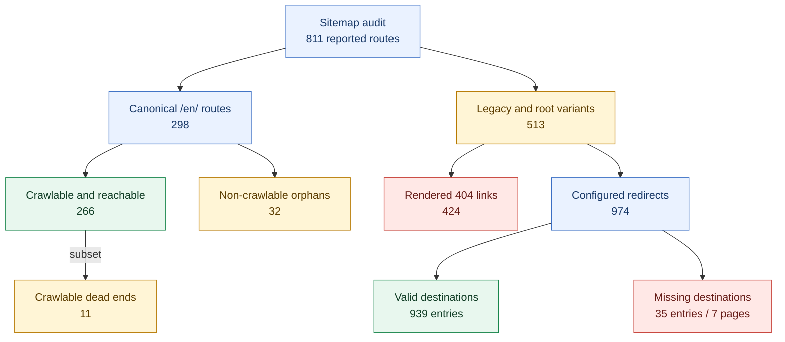
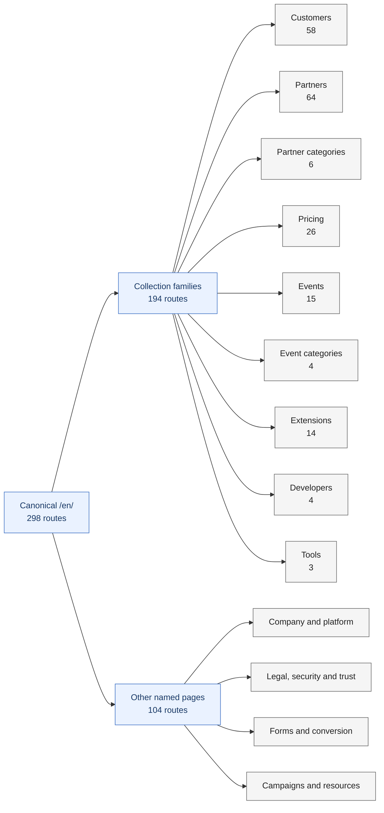
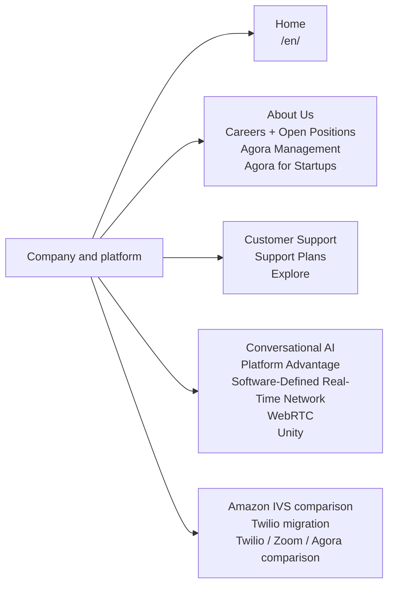
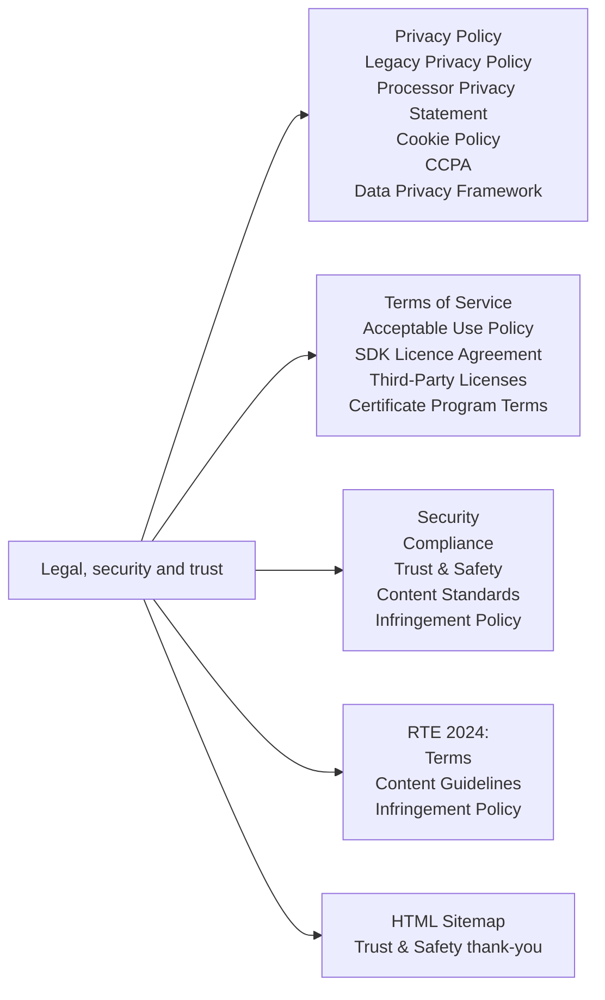
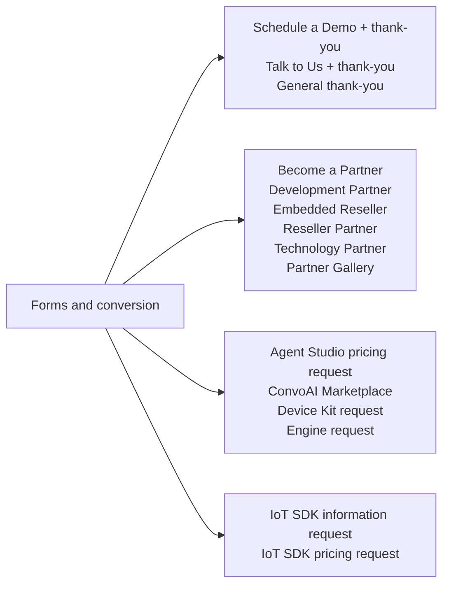
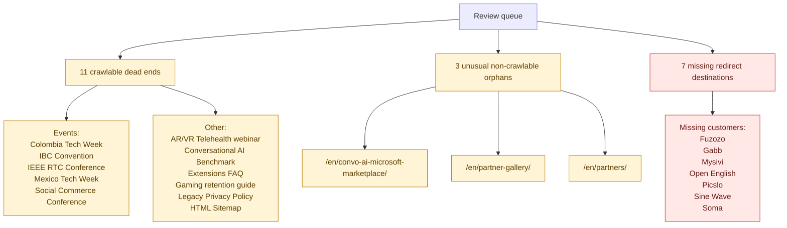
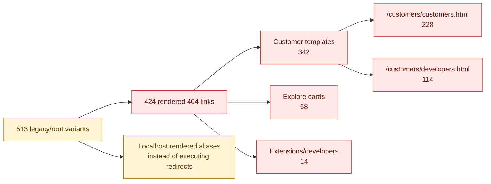

# Sitemap Graph

This Markdown file contains smaller Mermaid diagrams so the sitemap can be viewed directly in a Markdown preview. Every canonical route is represented either by name below or inside a counted collection family.

## 1. Audit Overview

## 2. Canonical Page Families

The 298 canonical routes consist of 194 routes in repeatable collections and 104 other routes detailed in the next section.

### Collection Family Contents

| Family | Routes represented |
| --- | --- |
| Customers | `/en/customers/` plus 57 customer stories |
| Partners | `/en/partners/` plus 63 partner profiles |
| Partner categories | Development, enterprise integration, platform, reseller, SaaS, technology |
| Pricing | `/en/pricing/` plus 25 pricing detail pages |
| Events | `/en/events/` plus 14 event pages |
| Event categories | On demand, online virtual event, product, upcoming |
| Extensions | `/en/extensions/` plus 13 extension, policy, FAQ, application, and thank-you pages |
| Developers | `/en/developers/`, AI Builder Tools, Integrate with TEN, Partner Gallery |
| Tools | App Builder, Flexible Classroom, UI Kits |

## 3. Other Canonical Pages

### Company And Platform

### Legal, Security And Trust

### Forms And Conversion Pages

### Campaigns And Resources

Each item ending in `+ TY` includes its separate thank-you route.

```mermaid
flowchart TB
  group["Campaigns and resources"]
  group --> webinars["Webinars"]
  group --> guides["Guides and ebooks"]
  group --> commerce["Commerce and social"]
  group --> misc["Other campaigns"]

  webinars --> w1["Advances in AI for Telehealth + TY"]
  webinars --> w2["Advances in AR/VR for Telehealth + TY"]
  webinars --> w3["EdTech scalability + TY"]
  webinars --> w4["Metaverse webinar + TY"]
  webinars --> w5["Social app engagement webinar + TY"]

  guides --> g1["Conversational AI Benchmark"]
  guides --> g2["Customized Online Tutoring + TY"]
  guides --> g3["Professional Training with RTE + TY"]
  guides --> g4["Successful Telehealth + TY"]
  guides --> g5["Innovative Games ebook + TY"]
  guides --> g6["Gaming retention + TY"]
  guides --> g7["Gartner Live Commerce guide"]
  guides --> g8["Gartner Market Guide + TY"]

  commerce --> c1["Boost In-App Engagement + TY"]
  commerce --> c2["Enable In-Game Chat"]
  commerce --> c3["Social Gaming Experiences + TY"]
  commerce --> c4["Social App Monetization + TY"]
  commerce --> c5["Live Commerce Insights + TY"]
  commerce --> c6["Scaling Digital Commerce + TY"]
  commerce --> c7["Retail Revolution + TY"]

  misc --> m1["CEE 2024 Call for Speakers"]
  misc --> m2["Harness Social Interactions + TY"]
  misc --> m3["Future of Work + TY"]
  misc --> m4["Secret Ingredient for Human Interaction + TY"]
  misc --> m5["Metaverse availability webinar"]
  misc --> m6["Unlock the Metaverse + TY"]
  misc --> m7["Chat-Powered Social Games + TY"]
  misc --> m8["Solution Brief thank-you"]
  misc --> m9["Standalone ebook thank-you"]
```

Additional standalone completion routes represented above:

- `/en/how-to-enable-in-game-chat-to-connect-players-and-boost-engagement/thank-you/`
- `/en/real-time-engagement-reshaping-the-future-of-work/thank-you/`

## 4. Pages Requiring Review

## 5. Legacy Link Problems

For full URL-level evidence, use [`sitemap.json`](./sitemap.json). For findings and recommended actions, use [`sitemap-report.md`](./sitemap-report.md).
