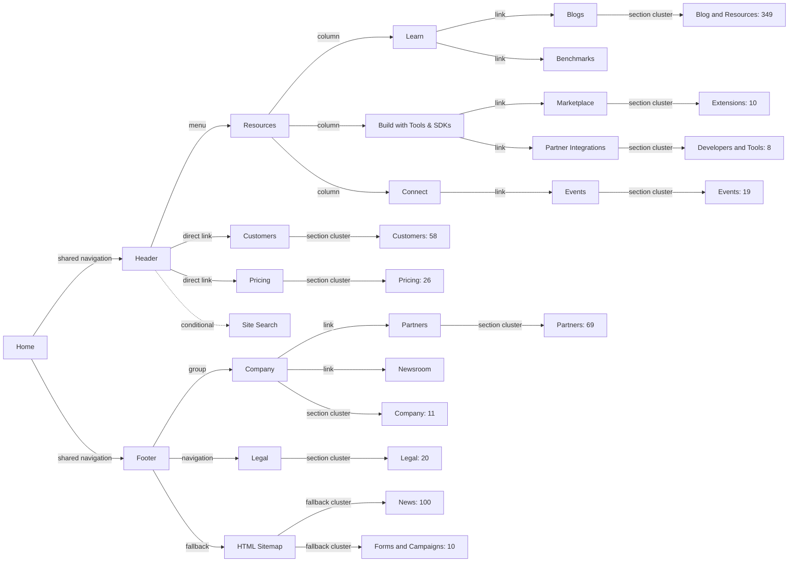
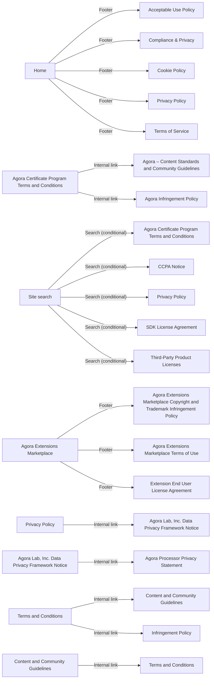
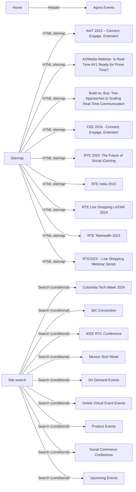
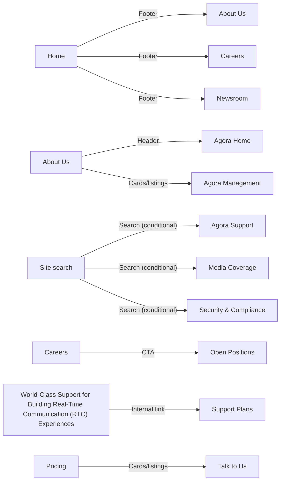
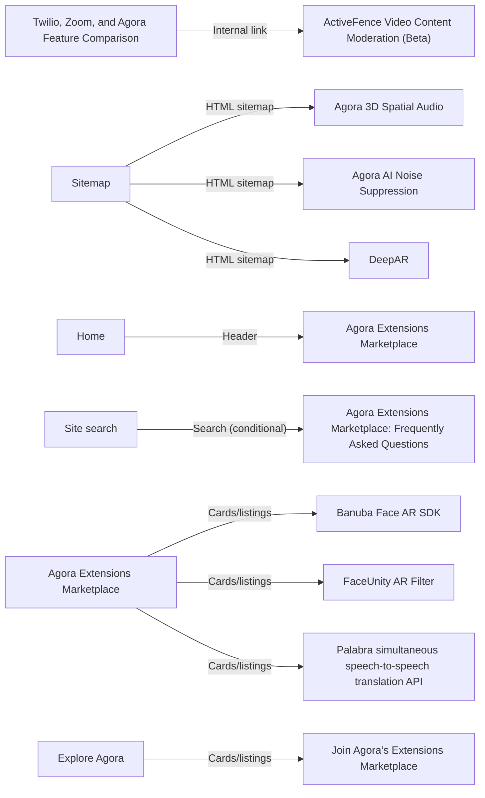
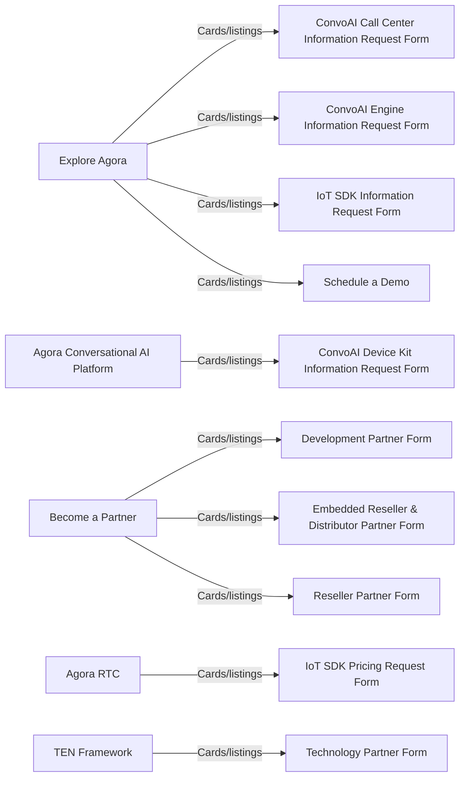
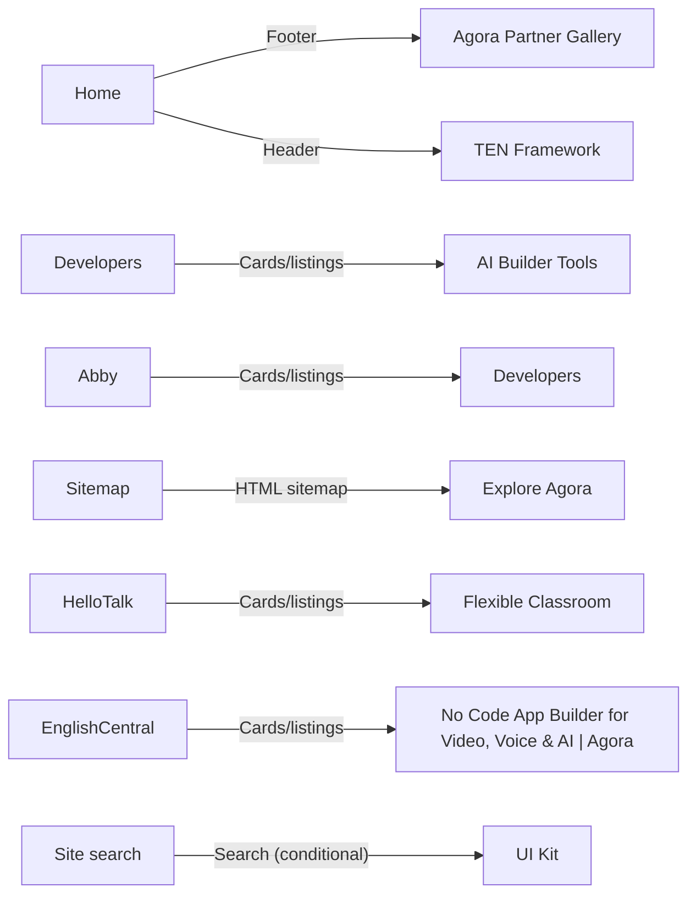

# Page Entry-Point Sitemap

## Scope and methodology

This reproducible audit evaluates all 680 canonical pages in `docs/public-page-inventory.md`. Product, Use Case, legacy Solutions, and SDRTN family routes are excluded as targets, but all 750 sitemap-backed built pages, including excluded families and pagination pages, are eligible inbound sources and path waypoints.

The generator parses built HTML with `parse5`, resolves built canonicals and redirect aliases, and classifies anchors as Header, Mobile navigation, Footer, Cards/listings, Breadcrumb, CTA, Internal link, HTML sitemap, or Template. Site/blog/newsroom search indexes are conditional entry points. Primary precedence is Header/Mobile navigation, Footer, Cards/listings, Breadcrumb/CTA/Internal link, excluded-family inbound, Template/Search, then HTML sitemap. Paths are deterministic breadth-first searches from `/en/` over direct HTML anchors excluding HTML sitemap, search, and template edges. Friendly labels expand verified shared-header hierarchy from `siteNavigation`; they do not invent route edges. Search and HTML sitemap do not qualify a page as editorially discoverable.

A targeted hydrated-browser reconciliation confirmed shared header/footer links, global site-search results, Blog search result links, and Newsroom search result links against the generated build.

Status meanings: **Discoverable** has an in-scope editorial link; **Chrome only** has only shared header/footer links; **Editorial orphan** has only template or excluded-family editorial inbound; **Search only** and **Sitemap only** have only those fallback mechanisms; **Orphan** has none.

## Summary

| Discovery Status | Pages |
| --- | ---: |
| Discoverable | 634 |
| Sitemap only | 13 |
| Search only | 30 |
| Chrome only | 2 |
| Editorial orphan | 0 |
| Orphan | 1 |
| **Total** | **680** |

## Page audit

| Section | Page Name | URL | Primary Entry Point | Navigation Path | Other Entry Points | Discovery Status |
| --- | --- | --- | --- | --- | --- | --- |
| Blog and Resources | 1-to-1 Video Chat App on Android Using Agora | https://www.agora.io/en/blog/1-to-1-video-chat-app-on-android-using-agora/ | Cards/listings from Ideas for the real-time world [page 12] (/en/blog/page/12/) | Home -> Resources -> Learn -> Blogs -> Ideas for the real-time world [page 13] -> Ideas for the real-time world [page 12] -> 1-to-1 Video Chat App on Android Using Agora | Cards/listings: Developer in focus [page 10] (/en/category/developer/page/10/); HTML sitemap: Sitemap (/en/sitemap/); Search (conditional): Blog (/en/blog/), Ideas for the real-time world [page 10] (/en/blog/page/10/), Ideas for the real-time world [page 11] (/en/blog/page/11/) +22 more | Discoverable |
| Blog and Resources | 10 Lessons Learned Building Voice AI Agents | https://www.agora.io/en/blog/lessons-learned-building-voice-ai-agents/ | Cards/listings from Ideas for the real-time world [page 2] (/en/blog/page/2/) | Home -> Resources -> Learn -> Blogs -> Ideas for the real-time world [page 2] -> 10 Lessons Learned Building Voice AI Agents | Cards/listings: Developer Articles (/en/category/developer/); HTML sitemap: Sitemap (/en/sitemap/); Search (conditional): Blog (/en/blog/), Ideas for the real-time world [page 10] (/en/blog/page/10/), Ideas for the real-time world [page 11] (/en/blog/page/11/) +22 more | Discoverable |
| Blog and Resources | 2-Click Setup: Testing Token Server | https://www.agora.io/en/blog/2-click-setup-testing-token-server/ | Cards/listings from Ideas for the real-time world [page 13] (/en/blog/page/13/) | Home -> Resources -> Learn -> Blogs -> Ideas for the real-time world [page 13] -> 2-Click Setup: Testing Token Server | Cards/listings: Developer in focus [page 11] (/en/category/developer/page/11/); HTML sitemap: Sitemap (/en/sitemap/); Search (conditional): Blog (/en/blog/), Ideas for the real-time world [page 10] (/en/blog/page/10/), Ideas for the real-time world [page 11] (/en/blog/page/11/) +22 more | Discoverable |
| Blog and Resources | 2024: The Year Ahead in Gaming and Metaverse Innovations | https://www.agora.io/en/blog/2024-the-year-ahead-in-gaming-metaverse-innovations/ | Cards/listings from Business in focus [page 2] (/en/category/business/page/2/) | Home -> Resources -> Learn -> Blogs -> Business Articles -> Business in focus [page 2] -> 2024: The Year Ahead in Gaming and Metaverse Innovations | Cards/listings: Ideas for the real-time world [page 4] (/en/blog/page/4/); HTML sitemap: Sitemap (/en/sitemap/); Search (conditional): Blog (/en/blog/), Ideas for the real-time world [page 10] (/en/blog/page/10/), Ideas for the real-time world [page 11] (/en/blog/page/11/) +15 more | Discoverable |
| Blog and Resources | 3 Benefits of Interactive Online Education | https://www.agora.io/en/blog/3-benefits-of-interactive-online-education/ | Cards/listings from Business in focus [page 4] (/en/category/business/page/4/) | Home -> Resources -> Learn -> Blogs -> Business Articles -> Business in focus [page 4] -> 3 Benefits of Interactive Online Education | Cards/listings: Ideas for the real-time world [page 9] (/en/blog/page/9/); HTML sitemap: Sitemap (/en/sitemap/); Search (conditional): Blog (/en/blog/), Ideas for the real-time world [page 10] (/en/blog/page/10/), Ideas for the real-time world [page 11] (/en/blog/page/11/) +15 more | Discoverable |
| Blog and Resources | 4 Big Shifts That Will Shake Up Social Media in 2023 | https://www.agora.io/en/blog/4-big-shifts-that-will-shake-up-social-media-in-2023/ | Cards/listings from Business in focus [page 3] (/en/category/business/page/3/) | Home -> Resources -> Learn -> Blogs -> Business Articles -> Business in focus [page 2] -> Business in focus [page 3] -> 4 Big Shifts That Will Shake Up Social Media in 2023 | Cards/listings: Ideas for the real-time world [page 6] (/en/blog/page/6/); HTML sitemap: Sitemap (/en/sitemap/); Search (conditional): Blog (/en/blog/), Ideas for the real-time world [page 10] (/en/blog/page/10/), Ideas for the real-time world [page 11] (/en/blog/page/11/) +15 more | Discoverable |
| Blog and Resources | 4 Ways Healthcare Providers Can Improve the Telemedicine Experience | https://www.agora.io/en/blog/4-ways-healthcare-providers-can-improve-the-telemedicine-experience/ | Cards/listings from Business in focus [page 3] (/en/category/business/page/3/) | Home -> Resources -> Learn -> Blogs -> Business Articles -> Business in focus [page 2] -> Business in focus [page 3] -> 4 Ways Healthcare Providers Can Improve the Telemedicine Experience | Cards/listings: Ideas for the real-time world [page 5] (/en/blog/page/5/), Developer in focus [page 4] (/en/category/developer/page/4/); HTML sitemap: Sitemap (/en/sitemap/); Search (conditional): Blog (/en/blog/), Ideas for the real-time world [page 10] (/en/blog/page/10/), Ideas for the real-time world [page 11] (/en/blog/page/11/) +26 more | Discoverable |
| Blog and Resources | A SwiftUI Solution to Video Streaming | https://www.agora.io/en/blog/a-swiftui-solution-to-video-streaming/ | Cards/listings from Ideas for the real-time world [page 5] (/en/blog/page/5/) | Home -> Resources -> Learn -> Blogs -> Ideas for the real-time world [page 2] -> Ideas for the real-time world [page 3] -> Ideas for the real-time world [page 4] -> Ideas for the real-time world [page 5] -> A SwiftUI Solution to Video Streaming | Cards/listings: Developer in focus [page 4] (/en/category/developer/page/4/); HTML sitemap: Sitemap (/en/sitemap/); Search (conditional): Blog (/en/blog/), Ideas for the real-time world [page 10] (/en/blog/page/10/), Ideas for the real-time world [page 11] (/en/blog/page/11/) +22 more | Discoverable |
| Blog and Resources | Add AI Denoising to your Video Calls using the Agora React Native UIKit | https://www.agora.io/en/blog/add-ai-denoising-to-your-video-calls-using-the-agora-react-native-uikit/ | Cards/listings from Ideas for the real-time world [page 7] (/en/blog/page/7/) | Home -> Resources -> Learn -> Blogs -> Ideas for the real-time world [page 2] -> Ideas for the real-time world [page 3] -> Ideas for the real-time world [page 4] -> Ideas for the real-time world [page 5] -> Ideas for the real-time world [page 6] -> Ideas for the real-time world [page 7] -> Add AI Denoising to your Video Calls using the Agora React Native UIKit | Cards/listings: Developer in focus [page 6] (/en/category/developer/page/6/); HTML sitemap: Sitemap (/en/sitemap/); Search (conditional): Blog (/en/blog/), Ideas for the real-time world [page 10] (/en/blog/page/10/), Ideas for the real-time world [page 11] (/en/blog/page/11/) +22 more | Discoverable |
| Blog and Resources | Add Custom Backgrounds to your Live Video Calling application using the Agora Android UIKit | https://www.agora.io/en/blog/add-custom-backgrounds-to-your-live-video-calling-application-using-the-agora-android-uikit/ | Cards/listings from Developer in focus [page 5] (/en/category/developer/page/5/) | Home -> Resources -> Learn -> Blogs -> Developer Articles -> Developer in focus [page 2] -> Developer in focus [page 3] -> Developer in focus [page 4] -> Developer in focus [page 5] -> Add Custom Backgrounds to your Live Video Calling application using the Agora Android UIKit | Cards/listings: Ideas for the real-time world [page 7] (/en/blog/page/7/); HTML sitemap: Sitemap (/en/sitemap/); Search (conditional): Blog (/en/blog/), Ideas for the real-time world [page 10] (/en/blog/page/10/), Ideas for the real-time world [page 11] (/en/blog/page/11/) +22 more | Discoverable |
| Blog and Resources | Add Custom Backgrounds to your Live Video Calling application using the Agora Flutter UIKit | https://www.agora.io/en/blog/add-custom-backgrounds-to-your-live-video-calling-application-using-the-agora-flutter-uikit/ | Cards/listings from Developer in focus [page 5] (/en/category/developer/page/5/) | Home -> Resources -> Learn -> Blogs -> Developer Articles -> Developer in focus [page 2] -> Developer in focus [page 3] -> Developer in focus [page 4] -> Developer in focus [page 5] -> Add Custom Backgrounds to your Live Video Calling application using the Agora Flutter UIKit | Cards/listings: Ideas for the real-time world [page 7] (/en/blog/page/7/); HTML sitemap: Sitemap (/en/sitemap/); Search (conditional): Blog (/en/blog/), Ideas for the real-time world [page 10] (/en/blog/page/10/), Ideas for the real-time world [page 11] (/en/blog/page/11/) +22 more | Discoverable |
| Blog and Resources | Add RAG to Agora Conversational AI with Pinecone | https://www.agora.io/en/blog/add-rag-to-agora-conversational-ai-with-pinecone/ | Cards/listings from Ideas for the real-time world [page 2] (/en/blog/page/2/) | Home -> Resources -> Learn -> Blogs -> Ideas for the real-time world [page 2] -> Add RAG to Agora Conversational AI with Pinecone | Cards/listings: Developer Articles (/en/category/developer/); HTML sitemap: Sitemap (/en/sitemap/); Search (conditional): Blog (/en/blog/), Ideas for the real-time world [page 10] (/en/blog/page/10/), Ideas for the real-time world [page 11] (/en/blog/page/11/) +22 more | Discoverable |
| Blog and Resources | Add Real-Time 3D Avatars to Agora Live Video Streams | https://www.agora.io/en/blog/add-real-time-3d-avatars-to-agora-live-video-streams/ | Cards/listings from Ideas for the real-time world [page 3] (/en/blog/page/3/) | Home -> Resources -> Learn -> Blogs -> Ideas for the real-time world [page 2] -> Ideas for the real-time world [page 3] -> Add Real-Time 3D Avatars to Agora Live Video Streams | Cards/listings: Developer in focus [page 2] (/en/category/developer/page/2/); HTML sitemap: Sitemap (/en/sitemap/); Search (conditional): Blog (/en/blog/), Ideas for the real-time world [page 10] (/en/blog/page/10/), Ideas for the real-time world [page 11] (/en/blog/page/11/) +22 more | Discoverable |
| Blog and Resources | Add Streaming Transcriptions in Your Conversational AI App | https://www.agora.io/en/blog/add-streaming-transcriptions-in-your-conversational-ai-app/ | Cards/listings from Ideas for the real-time world [page 2] (/en/blog/page/2/) | Home -> Resources -> Learn -> Blogs -> Ideas for the real-time world [page 2] -> Add Streaming Transcriptions in Your Conversational AI App | Cards/listings: 4 Ways Healthcare Providers Can Improve the Telemedicine Experience (/en/blog/4-ways-healthcare-providers-can-improve-the-telemedicine-experience/), Bridging Realities: Active and Passive Participation in the Metaverse (/en/blog/active-passive-participation-in-the-metaverse/), Agora and OpenAI: Enabling Natural Real-Time Conversational AI (/en/blog/agora-and-openai-enabling-natural-real-time-conversational-ai/) +33 more; HTML sitemap: Sitemap (/en/sitemap/); Search (conditional): Blog (/en/blog/), Ideas for the real-time world [page 10] (/en/blog/page/10/), Ideas for the real-time world [page 11] (/en/blog/page/11/) +26 more | Discoverable |
| Blog and Resources | Add Video Calling in Your Web App Using the Agora Web NG SDK | https://www.agora.io/en/blog/add-video-calling-in-your-web-app-using-the-agora-web-ng-sdk/ | Cards/listings from Ideas for the real-time world [page 10] (/en/blog/page/10/) | Home -> Resources -> Learn -> Blogs -> Ideas for the real-time world [page 13] -> Ideas for the real-time world [page 12] -> Ideas for the real-time world [page 11] -> Ideas for the real-time world [page 10] -> Add Video Calling in Your Web App Using the Agora Web NG SDK | Cards/listings: Developer in focus [page 9] (/en/category/developer/page/9/); HTML sitemap: Sitemap (/en/sitemap/); Internal link: Building Your Own Transcription Service Within a Video Call Web App (/en/blog/building-your-own-transcription-service-within-a-video-call-web-app/); Search (conditional): Blog (/en/blog/), Ideas for the real-time world [page 10] (/en/blog/page/10/), Ideas for the real-time world [page 11] (/en/blog/page/11/) +22 more | Discoverable |
| Blog and Resources | Add Voice Chat to your Unity Game | https://www.agora.io/en/blog/add-voice-chat-to-your-unity-game/ | Cards/listings from Ideas for the real-time world [page 13] (/en/blog/page/13/) | Home -> Resources -> Learn -> Blogs -> Ideas for the real-time world [page 13] -> Add Voice Chat to your Unity Game | Cards/listings: Developer in focus [page 11] (/en/category/developer/page/11/); HTML sitemap: Sitemap (/en/sitemap/); Search (conditional): Blog (/en/blog/), Ideas for the real-time world [page 10] (/en/blog/page/10/), Ideas for the real-time world [page 11] (/en/blog/page/11/) +22 more | Discoverable |
| Blog and Resources | Adding Admin Functionality for Group Video Call Apps in React JS and Agora | https://www.agora.io/en/blog/adding-admin-functionality-for-group-video-call-apps-in-react-js-and-agora/ | Cards/listings from Ideas for the real-time world [page 8] (/en/blog/page/8/) | Home -> Resources -> Learn -> Blogs -> Ideas for the real-time world [page 13] -> Ideas for the real-time world [page 12] -> Ideas for the real-time world [page 11] -> Ideas for the real-time world [page 10] -> Ideas for the real-time world [page 9] -> Ideas for the real-time world [page 8] -> Adding Admin Functionality for Group Video Call Apps in React JS and Agora | Cards/listings: Developer in focus [page 7] (/en/category/developer/page/7/); HTML sitemap: Sitemap (/en/sitemap/); Search (conditional): Blog (/en/blog/), Ideas for the real-time world [page 10] (/en/blog/page/10/), Ideas for the real-time world [page 11] (/en/blog/page/11/) +22 more | Discoverable |
| Blog and Resources | Adding Live Interactive Video Streaming using the Agora Flutter SDK | https://www.agora.io/en/blog/adding-live-interactive-video-streaming-using-the-agora-flutter-sdk/ | Cards/listings from Ideas for the real-time world [page 11] (/en/blog/page/11/) | Home -> Resources -> Learn -> Blogs -> Ideas for the real-time world [page 13] -> Ideas for the real-time world [page 12] -> Ideas for the real-time world [page 11] -> Adding Live Interactive Video Streaming using the Agora Flutter SDK | Cards/listings: Developer in focus [page 9] (/en/category/developer/page/9/); HTML sitemap: Sitemap (/en/sitemap/); Search (conditional): Blog (/en/blog/), Ideas for the real-time world [page 10] (/en/blog/page/10/), Ideas for the real-time world [page 11] (/en/blog/page/11/) +22 more | Discoverable |
| Blog and Resources | Adding Meeting URLs to your Agora Live Video Call using the Flutter UIKit | https://www.agora.io/en/blog/adding-meeting-urls-to-your-agora-live-video-call-using-the-flutteruikit/ | Cards/listings from Ideas for the real-time world [page 7] (/en/blog/page/7/) | Home -> Resources -> Learn -> Blogs -> Ideas for the real-time world [page 2] -> Ideas for the real-time world [page 3] -> Ideas for the real-time world [page 4] -> Ideas for the real-time world [page 5] -> Ideas for the real-time world [page 6] -> Ideas for the real-time world [page 7] -> Adding Meeting URLs to your Agora Live Video Call using the Flutter UIKit | Cards/listings: Developer in focus [page 6] (/en/category/developer/page/6/); HTML sitemap: Sitemap (/en/sitemap/); Search (conditional): Blog (/en/blog/), Ideas for the real-time world [page 10] (/en/blog/page/10/), Ideas for the real-time world [page 11] (/en/blog/page/11/) +22 more | Discoverable |
| Blog and Resources | Adding Unity Voice Chat to a Multiplayer Cross-Platform Game | https://www.agora.io/en/blog/adding-voice-chat-to-a-multiplayer-cross-platform-unity-game/ | Cards/listings from Ideas for the real-time world [page 13] (/en/blog/page/13/) | Home -> Resources -> Learn -> Blogs -> Ideas for the real-time world [page 13] -> Adding Unity Voice Chat to a Multiplayer Cross-Platform Game | Cards/listings: Developer in focus [page 11] (/en/category/developer/page/11/); HTML sitemap: Sitemap (/en/sitemap/); Internal link: Adding Video Communication to A Multiplayer Mobile Unity Game (/en/blog/adding-video-communication-to-a-multiplayer-mobile-unity-game/); Search (conditional): Blog (/en/blog/), Ideas for the real-time world [page 10] (/en/blog/page/10/), Ideas for the real-time world [page 11] (/en/blog/page/11/) +22 more | Discoverable |
| Blog and Resources | Adding Video Calling in Your Web App Using the Agora Web SDK | https://www.agora.io/en/blog/add-video-calling-in-your-web-app-using-agora-web-sdk/ | Cards/listings from Ideas for the real-time world [page 9] (/en/blog/page/9/) | Home -> Resources -> Learn -> Blogs -> Ideas for the real-time world [page 13] -> Ideas for the real-time world [page 12] -> Ideas for the real-time world [page 11] -> Ideas for the real-time world [page 10] -> Ideas for the real-time world [page 9] -> Adding Video Calling in Your Web App Using the Agora Web SDK | Cards/listings: Developer in focus [page 8] (/en/category/developer/page/8/); HTML sitemap: Sitemap (/en/sitemap/); Search (conditional): Blog (/en/blog/), Ideas for the real-time world [page 10] (/en/blog/page/10/), Ideas for the real-time world [page 11] (/en/blog/page/11/) +22 more | Discoverable |
| Blog and Resources | Adding Video Calling to a Remix App Using the Agora Web UIKit | https://www.agora.io/en/blog/adding-video-calling-to-a-remix-app-using-the-agora-web-uikit/ | Cards/listings from Ideas for the real-time world [page 6] (/en/blog/page/6/) | Home -> Resources -> Learn -> Blogs -> Ideas for the real-time world [page 2] -> Ideas for the real-time world [page 3] -> Ideas for the real-time world [page 4] -> Ideas for the real-time world [page 5] -> Ideas for the real-time world [page 6] -> Adding Video Calling to a Remix App Using the Agora Web UIKit | Cards/listings: Developer in focus [page 5] (/en/category/developer/page/5/); HTML sitemap: Sitemap (/en/sitemap/); Search (conditional): Blog (/en/blog/), Ideas for the real-time world [page 10] (/en/blog/page/10/), Ideas for the real-time world [page 11] (/en/blog/page/11/) +22 more | Discoverable |
| Blog and Resources | Adding Video Chat or Live Streaming to Your Website in 5 lines of Code Using the Agora Web UIKit | https://www.agora.io/en/blog/adding-video-chat-or-live-streaming-to-your-website-in-5-lines-of-code-using-the-agora-web-uikit/ | Cards/listings from Ideas for the real-time world [page 8] (/en/blog/page/8/) | Home -> Resources -> Learn -> Blogs -> Ideas for the real-time world [page 13] -> Ideas for the real-time world [page 12] -> Ideas for the real-time world [page 11] -> Ideas for the real-time world [page 10] -> Ideas for the real-time world [page 9] -> Ideas for the real-time world [page 8] -> Adding Video Chat or Live Streaming to Your Website in 5 lines of Code Using the Agora Web UIKit | Cards/listings: Developer in focus [page 6] (/en/category/developer/page/6/); HTML sitemap: Sitemap (/en/sitemap/); Internal link: Adding Video Calling to a Remix App Using the Agora Web UIKit (/en/blog/adding-video-calling-to-a-remix-app-using-the-agora-web-uikit/), Agora Web UIKit: Add Video Calling or Live Streaming to Your Website in Minutes (/en/blog/agora-web-uikit-add-video-calling-or-live-streaming-to-your-website-in-minutes/), Publish Your Agora Livestream to YouTube, Facebook, or Twitch Using the Web UIKit & Media Push (/en/blog/publish-your-agora-livestream-to-youtube-facebook-or-twitch-using-the-web-uikit-media-push/) +2 more; Search (conditional): Blog (/en/blog/), Ideas for the real-time world [page 10] (/en/blog/page/10/), Ideas for the real-time world [page 11] (/en/blog/page/11/) +22 more | Discoverable |
| Blog and Resources | Adding Video Communication to A Multiplayer Mobile Unity Game | https://www.agora.io/en/blog/adding-video-communication-to-a-multiplayer-mobile-unity-game/ | Cards/listings from Ideas for the real-time world [page 13] (/en/blog/page/13/) | Home -> Resources -> Learn -> Blogs -> Ideas for the real-time world [page 13] -> Adding Video Communication to A Multiplayer Mobile Unity Game | Cards/listings: Developer in focus [page 11] (/en/category/developer/page/11/); HTML sitemap: Sitemap (/en/sitemap/); Search (conditional): Blog (/en/blog/), Ideas for the real-time world [page 10] (/en/blog/page/10/), Ideas for the real-time world [page 11] (/en/blog/page/11/) +22 more | Discoverable |
| Blog and Resources | Advances in AR/VR for Telehealth: The Future of Healthcare Delivery | https://www.agora.io/en/advances-in-ar-vr-for-telehealth-webinar/ | Cards/listings from Agora Events (/en/events/) | Home -> Resources -> Connect -> Events -> Advances in AR/VR for Telehealth: The Future of Healthcare Delivery | Cards/listings: On Demand Events (/en/event-category/on-demand/), Online Virtual Event Events (/en/event-category/online-virtual-event/), Explore Agora (/en/explore/); CTA: RTE Telehealth 2023 (/en/events/rte-telehealth-2023/); HTML sitemap: Sitemap (/en/sitemap/); Search (conditional): Site search (site-search) | Discoverable |
| Blog and Resources | Agora Agents SDK: Build Voice Agents in Minutes | https://www.agora.io/en/blog/agora-agents-sdk-build-voice-agents-in-minutes/ | Cards/listings from Blog (/en/blog/) | Home -> Resources -> Learn -> Blogs -> Agora Agents SDK: Build Voice Agents in Minutes | Cards/listings: Introducing the Agora CLI (/en/blog/introducing-the-agora-cli/), Using Gemini 3.5 Transcribe with Agora Conversational AI (/en/blog/using-gemini-3-5-transcribe-with-agora-conversational-ai/), Developer Articles (/en/category/developer/); HTML sitemap: Sitemap (/en/sitemap/); Search (conditional): Blog (/en/blog/), Ideas for the real-time world [page 10] (/en/blog/page/10/), Ideas for the real-time world [page 11] (/en/blog/page/11/) +22 more | Discoverable |
| Blog and Resources | Agora and OpenAI: Enabling Natural Real-Time Conversational AI | https://www.agora.io/en/blog/agora-and-openai-enabling-natural-real-time-conversational-ai/ | Cards/listings from Business Articles (/en/category/business/) | Home -> Resources -> Learn -> Blogs -> Business Articles -> Agora and OpenAI: Enabling Natural Real-Time Conversational AI | Cards/listings: Ideas for the real-time world [page 3] (/en/blog/page/3/), Developer in focus [page 2] (/en/category/developer/page/2/); HTML sitemap: Sitemap (/en/sitemap/); Search (conditional): Blog (/en/blog/), Ideas for the real-time world [page 10] (/en/blog/page/10/), Ideas for the real-time world [page 11] (/en/blog/page/11/) +26 more | Discoverable |
| Blog and Resources | Agora Conversational AI Benchmark | https://www.agora.io/en/conversational-ai-benchmark/ | Header from Home (/en/) | Home -> Resources -> Learn -> Benchmarks | Footer (sitewide); Header (sitewide); HTML sitemap: Sitemap (/en/sitemap/); Internal link: Speaking with Machines: The Art of Prompting Voice AI (/en/blog/speaking-with-machines-the-art-of-prompting-voice-ai/); Mobile navigation (sitewide); Search (conditional): Site search (site-search) | Discoverable |
| Blog and Resources | Agora React SDK: Build a Video Conferencing App in Minutes | https://www.agora.io/en/blog/agora-react-sdk-build-a-video-conferencing-app-in-minutes/ | Cards/listings from Ideas for the real-time world [page 5] (/en/blog/page/5/) | Home -> Resources -> Learn -> Blogs -> Ideas for the real-time world [page 2] -> Ideas for the real-time world [page 3] -> Ideas for the real-time world [page 4] -> Ideas for the real-time world [page 5] -> Agora React SDK: Build a Video Conferencing App in Minutes | Cards/listings: Developer in focus [page 4] (/en/category/developer/page/4/); HTML sitemap: Sitemap (/en/sitemap/); Search (conditional): Blog (/en/blog/), Ideas for the real-time world [page 10] (/en/blog/page/10/), Ideas for the real-time world [page 11] (/en/blog/page/11/) +22 more | Discoverable |
| Blog and Resources | Agora Releases Flutter SDK v5.0.0 | https://www.agora.io/en/blog/agora-releases-flutter-sdk-v-5-0-0/ | Cards/listings from Ideas for the real-time world [page 7] (/en/blog/page/7/) | Home -> Resources -> Learn -> Blogs -> Ideas for the real-time world [page 2] -> Ideas for the real-time world [page 3] -> Ideas for the real-time world [page 4] -> Ideas for the real-time world [page 5] -> Ideas for the real-time world [page 6] -> Ideas for the real-time world [page 7] -> Agora Releases Flutter SDK v5.0.0 | Cards/listings: Developer in focus [page 6] (/en/category/developer/page/6/); HTML sitemap: Sitemap (/en/sitemap/); Search (conditional): Blog (/en/blog/), Ideas for the real-time world [page 10] (/en/blog/page/10/), Ideas for the real-time world [page 11] (/en/blog/page/11/) +22 more | Discoverable |
| Blog and Resources | Agora Releases Native SDK v3.6.2 | https://www.agora.io/en/blog/agora-releases-native-sdk-v362/ | Cards/listings from Ideas for the real-time world [page 8] (/en/blog/page/8/) | Home -> Resources -> Learn -> Blogs -> Ideas for the real-time world [page 13] -> Ideas for the real-time world [page 12] -> Ideas for the real-time world [page 11] -> Ideas for the real-time world [page 10] -> Ideas for the real-time world [page 9] -> Ideas for the real-time world [page 8] -> Agora Releases Native SDK v3.6.2 | Cards/listings: Developer in focus [page 6] (/en/category/developer/page/6/); HTML sitemap: Sitemap (/en/sitemap/); Search (conditional): Blog (/en/blog/), Ideas for the real-time world [page 10] (/en/blog/page/10/), Ideas for the real-time world [page 11] (/en/blog/page/11/) +22 more | Discoverable |
| Blog and Resources | Agora Releases VP9 Video Support for Safari | https://www.agora.io/en/blog/agora-releases-vp9-video-support-for-safari/ | Cards/listings from Product Articles (/en/category/product/) | Home -> Resources -> Learn -> Blogs -> Product Articles -> Agora Releases VP9 Video Support for Safari | Cards/listings: Ideas for the real-time world [page 5] (/en/blog/page/5/), Business in focus [page 2] (/en/category/business/page/2/), Developer in focus [page 4] (/en/category/developer/page/4/); HTML sitemap: Sitemap (/en/sitemap/); Search (conditional): Blog (/en/blog/), Ideas for the real-time world [page 10] (/en/blog/page/10/), Ideas for the real-time world [page 11] (/en/blog/page/11/) +27 more | Discoverable |
| Blog and Resources | Agora SDK version 3.0.1: Voice enhancement, face detection, and more in this release! | https://www.agora.io/en/blog/agora-sdk-version-301-voice-enhancement-face-detection-and-more/ | Cards/listings from Ideas for the real-time world [page 12] (/en/blog/page/12/) | Home -> Resources -> Learn -> Blogs -> Ideas for the real-time world [page 13] -> Ideas for the real-time world [page 12] -> Agora SDK version 3.0.1: Voice enhancement, face detection, and more in this release! | Cards/listings: Developer in focus [page 10] (/en/category/developer/page/10/); HTML sitemap: Sitemap (/en/sitemap/); Search (conditional): Blog (/en/blog/), Ideas for the real-time world [page 10] (/en/blog/page/10/), Ideas for the real-time world [page 11] (/en/blog/page/11/) +22 more | Discoverable |
| Blog and Resources | Agora Skills: Build Voice AI with Your Coding Agent | https://www.agora.io/en/blog/agora-skills-build-voice-ai-with-your-coding-agent/ | Cards/listings from Blog (/en/blog/) | Home -> Resources -> Learn -> Blogs -> Agora Skills: Build Voice AI with Your Coding Agent | Cards/listings: Developer Articles (/en/category/developer/); HTML sitemap: Sitemap (/en/sitemap/); Internal link: Introducing the Agora CLI (/en/blog/introducing-the-agora-cli/); Search (conditional): Blog (/en/blog/), Ideas for the real-time world [page 10] (/en/blog/page/10/), Ideas for the real-time world [page 11] (/en/blog/page/11/) +22 more | Discoverable |
| Blog and Resources | Agora Survey: Gen Z Interest in Real-Time Engagement Soars | https://www.agora.io/en/blog/agora-survey-gen-z-interest-in-real-time-engagement-soars/ | Cards/listings from Business in focus [page 4] (/en/category/business/page/4/) | Home -> Resources -> Learn -> Blogs -> Business Articles -> Business in focus [page 4] -> Agora Survey: Gen Z Interest in Real-Time Engagement Soars | Cards/listings: Ideas for the real-time world [page 9] (/en/blog/page/9/); HTML sitemap: Sitemap (/en/sitemap/); Search (conditional): Blog (/en/blog/), Ideas for the real-time world [page 10] (/en/blog/page/10/), Ideas for the real-time world [page 11] (/en/blog/page/11/) +15 more | Discoverable |
| Blog and Resources | Agora Survey: Majority of Developers are All-In on the Metaverse | https://www.agora.io/en/blog/agora-survey-majority-of-developers-are-all-in-on-the-metaverse/ | Cards/listings from Ideas for the real-time world [page 7] (/en/blog/page/7/) | Home -> Resources -> Learn -> Blogs -> Ideas for the real-time world [page 2] -> Ideas for the real-time world [page 3] -> Ideas for the real-time world [page 4] -> Ideas for the real-time world [page 5] -> Ideas for the real-time world [page 6] -> Ideas for the real-time world [page 7] -> Agora Survey: Majority of Developers are All-In on the Metaverse | Cards/listings: Developer in focus [page 6] (/en/category/developer/page/6/); HTML sitemap: Sitemap (/en/sitemap/); Search (conditional): Blog (/en/blog/), Ideas for the real-time world [page 10] (/en/blog/page/10/), Ideas for the real-time world [page 11] (/en/blog/page/11/) +22 more | Discoverable |
| Blog and Resources | Agora Video for WordPress Plugin - QuickStart Guide | https://www.agora.io/en/blog/agora-video-for-wordpress-plugin-quickstart-guide/ | Cards/listings from Ideas for the real-time world [page 12] (/en/blog/page/12/) | Home -> Resources -> Learn -> Blogs -> Ideas for the real-time world [page 13] -> Ideas for the real-time world [page 12] -> Agora Video for WordPress Plugin - QuickStart Guide | Cards/listings: Developer in focus [page 10] (/en/category/developer/page/10/); HTML sitemap: Sitemap (/en/sitemap/); Search (conditional): Blog (/en/blog/), Ideas for the real-time world [page 10] (/en/blog/page/10/), Ideas for the real-time world [page 11] (/en/blog/page/11/) +22 more | Discoverable |
| Blog and Resources | Agora Video SDK for Unity Quick Start Programming Guide | https://www.agora.io/en/blog/agora-video-sdk-for-unity-quick-start-programming-guide/ | Cards/listings from Ideas for the real-time world [page 12] (/en/blog/page/12/) | Home -> Resources -> Learn -> Blogs -> Ideas for the real-time world [page 13] -> Ideas for the real-time world [page 12] -> Agora Video SDK for Unity Quick Start Programming Guide | Cards/listings: Developer in focus [page 10] (/en/category/developer/page/10/); HTML sitemap: Sitemap (/en/sitemap/); Internal link: How to Build a VR Video Chat App Using Unity’s XR Framework (/en/blog/how-to-build-a-vr-video-chat-app-using-unitys-xr-framework/), How to Build a VR Video Chat App with Spatial Audio on Oculus (/en/blog/how-to-build-a-vr-video-chat-app-with-spatial-audio-on-oculus/), Run Video Chat within your Unity application (Mac) (/en/blog/run-video-chat-within-your-unity-application-mac/); Search (conditional): Blog (/en/blog/), Ideas for the real-time world [page 10] (/en/blog/page/10/), Ideas for the real-time world [page 11] (/en/blog/page/11/) +22 more | Discoverable |
| Blog and Resources | Agora vs Zoom: Look at the Big Picture When Evaluating Real-time Engagement Solutions | https://www.agora.io/en/blog/agora-vs-zoom-look-at-the-big-picture/ | Cards/listings from Business in focus [page 3] (/en/category/business/page/3/) | Home -> Resources -> Learn -> Blogs -> Product Articles -> Agora vs. Zoom: A Comprehensive Comparison of Video SDKs -> Agora vs Zoom: Look at the Big Picture When Evaluating Real-time Engagement Solutions | Cards/listings: Ideas for the real-time world [page 6] (/en/blog/page/6/), Developer in focus [page 5] (/en/category/developer/page/5/); HTML sitemap: Sitemap (/en/sitemap/); Internal link: Going Mobile: Agora vs. Zoom Testing for Multi-Party Mobile Video Calls (/en/blog/agora-vs-zoom-multi-party-mobile-video-testing/), Testing Agora vs Zoom for Multi-Party Web Video Calls: A Comparative Analysis of Video SDKs (/en/blog/agora-vs-zoom-multi-party-web-video-testing/), Zoom Out and Look at the Big Picture When Evaluating Real-time Engagement Solutions (/en/blog/zoom-out-and-look-at-the-big-picture-when-evaluating-real-time-engagement-solutions/) +1 more; Search (conditional): Blog (/en/blog/), Ideas for the real-time world [page 10] (/en/blog/page/10/), Ideas for the real-time world [page 11] (/en/blog/page/11/) +26 more | Discoverable |
| Blog and Resources | Agora vs. Zoom: A Comprehensive Comparison of Video SDKs | https://www.agora.io/en/blog/zoom-vs-agora-comparison-of-video-sdks/ | Cards/listings from Product Articles (/en/category/product/) | Home -> Resources -> Learn -> Blogs -> Product Articles -> Agora vs. Zoom: A Comprehensive Comparison of Video SDKs | Cards/listings: Ideas for the real-time world [page 4] (/en/blog/page/4/), Business in focus [page 2] (/en/category/business/page/2/), Developer in focus [page 3] (/en/category/developer/page/3/); HTML sitemap: Sitemap (/en/sitemap/); Internal link: Agora vs Zoom: Look at the Big Picture When Evaluating Real-time Engagement Solutions (/en/blog/agora-vs-zoom-look-at-the-big-picture/), Choosing the Right Path in the Wake of Twilio's Video Exit (/en/blog/choosing-the-right-path-in-the-wake-of-twilio-video-exit/), Zoom Out and Look at the Big Picture When Evaluating Real-time Engagement Solutions (/en/blog/zoom-out-and-look-at-the-big-picture-when-evaluating-real-time-engagement-solutions/); Search (conditional): Blog (/en/blog/), Ideas for the real-time world [page 10] (/en/blog/page/10/), Ideas for the real-time world [page 11] (/en/blog/page/11/) +27 more | Discoverable |
| Blog and Resources | Agora Web UIKit: Add Video Calling or Live Streaming to Your Website in Minutes | https://www.agora.io/en/blog/agora-web-uikit-add-video-calling-or-live-streaming-to-your-website-in-minutes/ | Cards/listings from Ideas for the real-time world [page 8] (/en/blog/page/8/) | Home -> Resources -> Learn -> Blogs -> Ideas for the real-time world [page 13] -> Ideas for the real-time world [page 12] -> Ideas for the real-time world [page 11] -> Ideas for the real-time world [page 10] -> Ideas for the real-time world [page 9] -> Ideas for the real-time world [page 8] -> Agora Web UIKit: Add Video Calling or Live Streaming to Your Website in Minutes | Cards/listings: Developer in focus [page 6] (/en/category/developer/page/6/); HTML sitemap: Sitemap (/en/sitemap/); Internal link: Adding Video Chat or Live Streaming to Your Website in 5 lines of Code Using the Agora Web UIKit (/en/blog/adding-video-chat-or-live-streaming-to-your-website-in-5-lines-of-code-using-the-agora-web-uikit/), Create Meeting URLs for an Agora Video Call with the Web UIKit (/en/blog/create-meeting-urls-for-an-agora-video-call-with-the-web-uikit/), Publish Your Agora Livestream to YouTube, Facebook, or Twitch Using the Web UIKit & Media Push (/en/blog/publish-your-agora-livestream-to-youtube-facebook-or-twitch-using-the-web-uikit-media-push/) +1 more; Search (conditional): Blog (/en/blog/), Ideas for the real-time world [page 10] (/en/blog/page/10/), Ideas for the real-time world [page 11] (/en/blog/page/11/) +22 more | Discoverable |
| Blog and Resources | Agora with Swift Package Manager Support | https://www.agora.io/en/blog/agora-with-swift-package-manager-support/ | Cards/listings from Ideas for the real-time world [page 9] (/en/blog/page/9/) | Home -> Resources -> Learn -> Blogs -> Ideas for the real-time world [page 13] -> How to Get Started with Agora -> Agora with Swift Package Manager Support | Cards/listings: Developer in focus [page 8] (/en/category/developer/page/8/); HTML sitemap: Sitemap (/en/sitemap/); Internal link: How to Get Started with Agora (/en/blog/how-to-get-started-with-agora/); Search (conditional): Blog (/en/blog/), Ideas for the real-time world [page 10] (/en/blog/page/10/), Ideas for the real-time world [page 11] (/en/blog/page/11/) +22 more | Discoverable |
| Blog and Resources | Agora: Infrastructure for the Metaverse | https://www.agora.io/en/blog/agora-infrastructure-for-the-metaverse/ | Cards/listings from Business in focus [page 4] (/en/category/business/page/4/) | Home -> Resources -> Learn -> Blogs -> Business Articles -> Business in focus [page 4] -> Agora: Infrastructure for the Metaverse | Cards/listings: Ideas for the real-time world [page 6] (/en/blog/page/6/); HTML sitemap: Sitemap (/en/sitemap/); Internal link: Bridging Realities: Active and Passive Participation in the Metaverse (/en/blog/active-passive-participation-in-the-metaverse/), Multimodal Communications in the Metaverse (/en/blog/multimodal-communications-in-the-metaverse/); Search (conditional): Blog (/en/blog/), Ideas for the real-time world [page 10] (/en/blog/page/10/), Ideas for the real-time world [page 11] (/en/blog/page/11/) +15 more | Discoverable |
| Blog and Resources | Agora’s Conversational AI Extension Lands on Dify Marketplace | https://www.agora.io/en/blog/agoras-conversational-ai-extension-lands-on-dify-marketplace/ | Cards/listings from Ideas for the real-time world [page 2] (/en/blog/page/2/) | Home -> Resources -> Learn -> Blogs -> Ideas for the real-time world [page 2] -> Agora’s Conversational AI Extension Lands on Dify Marketplace | Cards/listings: Developer in focus [page 2] (/en/category/developer/page/2/), Product Articles (/en/category/product/); HTML sitemap: Sitemap (/en/sitemap/); Search (conditional): Blog (/en/blog/), Ideas for the real-time world [page 10] (/en/blog/page/10/), Ideas for the real-time world [page 11] (/en/blog/page/11/) +23 more | Discoverable |
| Blog and Resources | AI in Telehealth: Boosting Accuracy and Accessibility | https://www.agora.io/en/blog/ai-in-telehealth-boosting-accuracy-and-accessibility/ | Cards/listings from Business in focus [page 3] (/en/category/business/page/3/) | Home -> Resources -> Learn -> Blogs -> Business Articles -> Business in focus [page 2] -> The Future of AR and VR in Telehealth -> AI in Telehealth: Boosting Accuracy and Accessibility | Cards/listings: Ideas for the real-time world [page 5] (/en/blog/page/5/), Developer in focus [page 4] (/en/category/developer/page/4/); HTML sitemap: Sitemap (/en/sitemap/); Internal link: The Future of AR and VR in Telehealth (/en/blog/the-future-of-ar-and-vr-in-telehealth/); Search (conditional): Blog (/en/blog/), Ideas for the real-time world [page 10] (/en/blog/page/10/), Ideas for the real-time world [page 11] (/en/blog/page/11/) +26 more | Discoverable |
| Blog and Resources | AI in Telehealth: The Future of Healthcare Delivery | https://www.agora.io/en/advances-in-ai-for-telehealth-webinar/ | Cards/listings from Explore Agora (/en/explore/) | No direct HTML path from Home | HTML sitemap: Sitemap (/en/sitemap/); Search (conditional): Site search (site-search) | Discoverable |
| Blog and Resources | AI With a Face: Interactive Avatars That Feel Human | https://www.agora.io/en/blog/ai-with-a-face-interactive-avatars-that-feel-human/ | Cards/listings from Blog (/en/blog/) | Home -> Resources -> Learn -> Blogs -> AI With a Face: Interactive Avatars That Feel Human | Cards/listings: Developer Articles (/en/category/developer/); HTML sitemap: Sitemap (/en/sitemap/); Search (conditional): Blog (/en/blog/), Ideas for the real-time world [page 10] (/en/blog/page/10/), Ideas for the real-time world [page 11] (/en/blog/page/11/) +22 more | Discoverable |
| Blog and Resources | AI-Driven Innovation Takes Center Stage at CEE 2024 | https://www.agora.io/en/blog/ai-driven-innovation-takes-center-stage-at-cee-2024/ | Cards/listings from Ideas for the real-time world [page 2] (/en/blog/page/2/) | Home -> Resources -> Learn -> Blogs -> Ideas for the real-time world [page 2] -> AI-Driven Innovation Takes Center Stage at CEE 2024 | Cards/listings: Business Articles (/en/category/business/), Product Articles (/en/category/product/); HTML sitemap: Sitemap (/en/sitemap/); Search (conditional): Blog (/en/blog/), Ideas for the real-time world [page 10] (/en/blog/page/10/), Ideas for the real-time world [page 11] (/en/blog/page/11/) +16 more | Discoverable |
| Blog and Resources | AI-Powered Fan Engagement: From Celebrity Avatars to IP-Based Characters | https://www.agora.io/en/blog/ai-powered-fan-engagement-from-celebrity-avatars-to-ip-based-characters/ | Cards/listings from Ideas for the real-time world [page 2] (/en/blog/page/2/) | Home -> Resources -> Learn -> Blogs -> Ideas for the real-time world [page 2] -> AI-Powered Fan Engagement: From Celebrity Avatars to IP-Based Characters | Cards/listings: Business Articles (/en/category/business/); HTML sitemap: Sitemap (/en/sitemap/); Search (conditional): Blog (/en/blog/), Ideas for the real-time world [page 10] (/en/blog/page/10/), Ideas for the real-time world [page 11] (/en/blog/page/11/) +15 more | Discoverable |
| Blog and Resources | Amazon IVS Real-Time Streaming vs. Agora | https://www.agora.io/en/amazon-ivs-real-time-streaming-vs-agora-table/ | Internal link from Amazon IVS Real-Time Streaming vs. Agora: Comparison of Real-Time Engagement Performance (/en/blog/amazon-ivs-real-time-streaming-vs-agora/) | Home -> Resources -> Learn -> Blogs -> Product Articles -> Amazon IVS Real-Time Streaming vs. Agora: Comparison of Real-Time Engagement Performance -> Amazon IVS Real-Time Streaming vs. Agora | HTML sitemap: Sitemap (/en/sitemap/); Search (conditional): Site search (site-search) | Discoverable |
| Blog and Resources | Amazon IVS Real-Time Streaming vs. Agora: Comparison of Real-Time Engagement Performance | https://www.agora.io/en/blog/amazon-ivs-real-time-streaming-vs-agora/ | Cards/listings from Product Articles (/en/category/product/) | Home -> Resources -> Learn -> Blogs -> Product Articles -> Amazon IVS Real-Time Streaming vs. Agora: Comparison of Real-Time Engagement Performance | Cards/listings: Ideas for the real-time world [page 5] (/en/blog/page/5/), Business in focus [page 2] (/en/category/business/page/2/), Developer in focus [page 3] (/en/category/developer/page/3/); HTML sitemap: Sitemap (/en/sitemap/); Search (conditional): Blog (/en/blog/), Ideas for the real-time world [page 10] (/en/blog/page/10/), Ideas for the real-time world [page 11] (/en/blog/page/11/) +27 more | Discoverable |
| Blog and Resources | Android Video Calling: How to Build a Video Chat Communication App | https://www.agora.io/en/blog/build-app-with-chat-and-video-calling-android/ | Cards/listings from Ideas for the real-time world [page 12] (/en/blog/page/12/) | Home -> Resources -> Learn -> Blogs -> Ideas for the real-time world [page 13] -> Ideas for the real-time world [page 12] -> Android Video Calling: How to Build a Video Chat Communication App | Cards/listings: Developer in focus [page 10] (/en/category/developer/page/10/); HTML sitemap: Sitemap (/en/sitemap/); Search (conditional): Blog (/en/blog/), Ideas for the real-time world [page 10] (/en/blog/page/10/), Ideas for the real-time world [page 11] (/en/blog/page/11/) +22 more | Discoverable |
| Blog and Resources | Android Video Streaming: Add Live Streaming to Your Android App with Agora | https://www.agora.io/en/blog/add-live-streaming-to-your-android-app-using-agora/ | Cards/listings from Ideas for the real-time world [page 11] (/en/blog/page/11/) | Home -> Resources -> Learn -> Blogs -> Ideas for the real-time world [page 13] -> Ideas for the real-time world [page 12] -> Ideas for the real-time world [page 11] -> Android Video Streaming: Add Live Streaming to Your Android App with Agora | Cards/listings: Developer in focus [page 9] (/en/category/developer/page/9/); HTML sitemap: Sitemap (/en/sitemap/); Search (conditional): Blog (/en/blog/), Ideas for the real-time world [page 10] (/en/blog/page/10/), Ideas for the real-time world [page 11] (/en/blog/page/11/) +22 more | Discoverable |
| Blog and Resources | Augmented Reality Video Comes to Life with Banuba and the Agora Platform | https://www.agora.io/en/blog/augmented-reality-video-comes-to-life-with-banuba-and-the-agora-platform/ | Cards/listings from Ideas for the real-time world [page 12] (/en/blog/page/12/) | Home -> Resources -> Learn -> Blogs -> Ideas for the real-time world [page 13] -> Ideas for the real-time world [page 12] -> Augmented Reality Video Comes to Life with Banuba and the Agora Platform | Cards/listings: Business in focus [page 4] (/en/category/business/page/4/); CTA: Banuba (/en/partners/banuba/); HTML sitemap: Sitemap (/en/sitemap/); Search (conditional): Blog (/en/blog/), Ideas for the real-time world [page 10] (/en/blog/page/10/), Ideas for the real-time world [page 11] (/en/blog/page/11/) +15 more | Discoverable |
| Blog and Resources | Become a Partner | https://www.agora.io/en/become-a-partner/ | Cards/listings from Explore Agora (/en/explore/) | No direct HTML path from Home | HTML sitemap: Sitemap (/en/sitemap/); Search (conditional): Site search (site-search) | Discoverable |
| Blog and Resources | Blog | https://www.agora.io/en/blog/ | Header from Home (/en/) | Home -> Resources -> Learn -> Blogs | Breadcrumb: 1-to-1 Video Chat App on Android Using Agora (/en/blog/1-to-1-video-chat-app-on-android-using-agora/), 2-Click Setup: Testing Token Server (/en/blog/2-click-setup-testing-token-server/), 2024: The Year Ahead in Gaming and Metaverse Innovations (/en/blog/2024-the-year-ahead-in-gaming-metaverse-innovations/) +321 more; Cards/listings: Ideas for the real-time world [page 10] (/en/blog/page/10/), Ideas for the real-time world [page 11] (/en/blog/page/11/), Ideas for the real-time world [page 12] (/en/blog/page/12/) +25 more; Header (sitewide); HTML sitemap: Sitemap (/en/sitemap/); Mobile navigation (sitewide); Search (conditional): Site search (site-search) | Discoverable |
| Blog and Resources | Blueprint a Video Call App Inside Unreal Engine | https://www.agora.io/en/blog/blueprint-a-video-call-app-inside-unreal-engine/ | Cards/listings from Ideas for the real-time world [page 5] (/en/blog/page/5/) | Home -> Build experiences that feel real [excluded family] -> Simplifying access to the metaverse [excluded family] -> Bridging Realities: Active and Passive Participation in the Metaverse -> Blueprint a Video Call App Inside Unreal Engine | Cards/listings: Developer in focus [page 4] (/en/category/developer/page/4/); HTML sitemap: Sitemap (/en/sitemap/); Internal link: Bridging Realities: Active and Passive Participation in the Metaverse (/en/blog/active-passive-participation-in-the-metaverse/); Search (conditional): Blog (/en/blog/), Ideas for the real-time world [page 10] (/en/blog/page/10/), Ideas for the real-time world [page 11] (/en/blog/page/11/) +22 more | Discoverable |
| Blog and Resources | Boost In-app Engagement with Chat and Messaging | https://www.agora.io/en/boost-in-app-engagement-with-chat-and-messaging/ | Cards/listings from Explore Agora (/en/explore/) | No direct HTML path from Home | HTML sitemap: Sitemap (/en/sitemap/); Search (conditional): Site search (site-search) | Discoverable |
| Blog and Resources | Boosting Live Stream Engagement with AR Effects and Multi-Call Functionality | https://www.agora.io/en/blog/boosting-live-stream-engagement-with-ar-effects-and-multi-call-functionality/ | Cards/listings from Business in focus [page 2] (/en/category/business/page/2/) | Home -> Resources -> Learn -> Blogs -> Business Articles -> Business in focus [page 2] -> Boosting Live Stream Engagement with AR Effects and Multi-Call Functionality | Cards/listings: Ideas for the real-time world [page 4] (/en/blog/page/4/), Developer in focus [page 3] (/en/category/developer/page/3/); HTML sitemap: Sitemap (/en/sitemap/); Search (conditional): Blog (/en/blog/), Ideas for the real-time world [page 10] (/en/blog/page/10/), Ideas for the real-time world [page 11] (/en/blog/page/11/) +26 more | Discoverable |
| Blog and Resources | Bridging Realities: Active and Passive Participation in the Metaverse | https://www.agora.io/en/blog/active-passive-participation-in-the-metaverse/ | Cards/listings from Business in focus [page 2] (/en/category/business/page/2/) | Home -> Build experiences that feel real [excluded family] -> Simplifying access to the metaverse [excluded family] -> Bridging Realities: Active and Passive Participation in the Metaverse | Cards/listings: Ideas for the real-time world [page 4] (/en/blog/page/4/), Developer in focus [page 3] (/en/category/developer/page/3/); Excluded-family inbound Cards/listings: Simplifying access to the metaverse [excluded family] (/en/use-cases/metaverse/); HTML sitemap: Sitemap (/en/sitemap/); Search (conditional): Blog (/en/blog/), Ideas for the real-time world [page 10] (/en/blog/page/10/), Ideas for the real-time world [page 11] (/en/blog/page/11/) +26 more | Discoverable |
| Blog and Resources | Build a Cloud Recording Backend with Astro | https://www.agora.io/en/blog/build-a-cloud-recording-backend-with-astro/ | Cards/listings from Ideas for the real-time world [page 3] (/en/blog/page/3/) | Home -> Resources -> Learn -> Blogs -> Ideas for the real-time world [page 2] -> Ideas for the real-time world [page 3] -> Build a Cloud Recording Backend with Astro | Cards/listings: Developer in focus [page 2] (/en/category/developer/page/2/); HTML sitemap: Sitemap (/en/sitemap/); Internal link: Build a Real-Time Speech-To-Text Backend with Astro (/en/blog/build-a-real-time-speech-to-text-backend-with-astro/); Search (conditional): Blog (/en/blog/), Ideas for the real-time world [page 10] (/en/blog/page/10/), Ideas for the real-time world [page 11] (/en/blog/page/11/) +22 more | Discoverable |
| Blog and Resources | Build a Conversational AI App with Next.js and Agora | https://www.agora.io/en/blog/build-a-conversational-ai-app-with-nextjs-and-agora/ | Cards/listings from Ideas for the real-time world [page 2] (/en/blog/page/2/) | Home -> Resources -> Learn -> Blogs -> Ideas for the real-time world [page 2] -> Build a Conversational AI App with Next.js and Agora | Cards/listings: Developer in focus [page 2] (/en/category/developer/page/2/); HTML sitemap: Sitemap (/en/sitemap/); Search (conditional): Blog (/en/blog/), Ideas for the real-time world [page 10] (/en/blog/page/10/), Ideas for the real-time world [page 11] (/en/blog/page/11/) +22 more | Discoverable |
| Blog and Resources | Build a Conversational AI Backend with Python and Agora | https://www.agora.io/en/blog/build-a-conversational-ai-backend-with-python-and-agora/ | Cards/listings from Ideas for the real-time world [page 2] (/en/blog/page/2/) | Home -> Resources -> Learn -> Blogs -> Ideas for the real-time world [page 2] -> Build a Conversational AI Backend with Python and Agora | Cards/listings: Developer in focus [page 2] (/en/category/developer/page/2/); HTML sitemap: Sitemap (/en/sitemap/); Search (conditional): Blog (/en/blog/), Ideas for the real-time world [page 10] (/en/blog/page/10/), Ideas for the real-time world [page 11] (/en/blog/page/11/) +22 more | Discoverable |
| Blog and Resources | Build a Deeply Immersive Game and Engage Players with 3D Spatial Audio | https://www.agora.io/en/blog/build-a-deeply-immersive-game-and-engage-players-with-3d-spatial-audio/ | Cards/listings from Business in focus [page 4] (/en/category/business/page/4/) | Home -> Resources -> Learn -> Blogs -> Business Articles -> Business in focus [page 4] -> Build a Deeply Immersive Game and Engage Players with 3D Spatial Audio | Cards/listings: Ideas for the real-time world [page 7] (/en/blog/page/7/); HTML sitemap: Sitemap (/en/sitemap/); Internal link: Multimodal Communications in the Metaverse (/en/blog/multimodal-communications-in-the-metaverse/); Search (conditional): Blog (/en/blog/), Ideas for the real-time world [page 10] (/en/blog/page/10/), Ideas for the real-time world [page 11] (/en/blog/page/11/) +15 more | Discoverable |
| Blog and Resources | Build a Live Streaming Application with Face Filters on Android | https://www.agora.io/en/blog/build-a-live-streaming-application-with-face-filters-on-android/ | Cards/listings from Ideas for the real-time world [page 11] (/en/blog/page/11/) | Home -> Resources -> Learn -> Blogs -> Ideas for the real-time world [page 13] -> Ideas for the real-time world [page 12] -> Ideas for the real-time world [page 11] -> Build a Live Streaming Application with Face Filters on Android | Cards/listings: Developer in focus [page 9] (/en/category/developer/page/9/); HTML sitemap: Sitemap (/en/sitemap/); Search (conditional): Blog (/en/blog/), Ideas for the real-time world [page 10] (/en/blog/page/10/), Ideas for the real-time world [page 11] (/en/blog/page/11/) +22 more | Discoverable |
| Blog and Resources | Build a Live Translated Transcriptions Service in Your Video Call Web App | https://www.agora.io/en/blog/build-a-live-translated-transcriptions-service-in-your-video-call-web-app/ | Cards/listings from Ideas for the real-time world [page 8] (/en/blog/page/8/) | Home -> Resources -> Learn -> Blogs -> Ideas for the real-time world [page 13] -> Ideas for the real-time world [page 12] -> Ideas for the real-time world [page 11] -> Ideas for the real-time world [page 10] -> Ideas for the real-time world [page 9] -> Ideas for the real-time world [page 8] -> Build a Live Translated Transcriptions Service in Your Video Call Web App | Cards/listings: Developer in focus [page 7] (/en/category/developer/page/7/); HTML sitemap: Sitemap (/en/sitemap/); Search (conditional): Blog (/en/blog/), Ideas for the real-time world [page 10] (/en/blog/page/10/), Ideas for the real-time world [page 11] (/en/blog/page/11/) +22 more | Discoverable |
| Blog and Resources | Build a NextJS Video Call App | https://www.agora.io/en/blog/build-a-next-js-video-call-app/ | Cards/listings from Ideas for the real-time world [page 4] (/en/blog/page/4/) | Home -> Resources -> Learn -> Blogs -> Ideas for the real-time world [page 2] -> Ideas for the real-time world [page 3] -> Ideas for the real-time world [page 4] -> Build a NextJS Video Call App | Cards/listings: Developer in focus [page 3] (/en/category/developer/page/3/); HTML sitemap: Sitemap (/en/sitemap/); Search (conditional): Blog (/en/blog/), Ideas for the real-time world [page 10] (/en/blog/page/10/), Ideas for the real-time world [page 11] (/en/blog/page/11/) +22 more | Discoverable |
| Blog and Resources | Build a Real-Time Speech-To-Text Backend with Astro | https://www.agora.io/en/blog/build-a-real-time-speech-to-text-backend-with-astro/ | Cards/listings from Ideas for the real-time world [page 3] (/en/blog/page/3/) | Home -> Resources -> Learn -> Blogs -> Ideas for the real-time world [page 2] -> Ideas for the real-time world [page 3] -> Build a Real-Time Speech-To-Text Backend with Astro | Cards/listings: Developer in focus [page 2] (/en/category/developer/page/2/); HTML sitemap: Sitemap (/en/sitemap/); Search (conditional): Blog (/en/blog/), Ideas for the real-time world [page 10] (/en/blog/page/10/), Ideas for the real-time world [page 11] (/en/blog/page/11/) +22 more | Discoverable |
| Blog and Resources | Build a Scalable Laravel Video Chat App with Agora | https://www.agora.io/en/blog/build-a-scalable-video-chat-app-with-agora-laravel/ | Cards/listings from Ideas for the real-time world [page 11] (/en/blog/page/11/) | Home -> Resources -> Learn -> Blogs -> Ideas for the real-time world [page 13] -> Ideas for the real-time world [page 12] -> Ideas for the real-time world [page 11] -> Build a Scalable Laravel Video Chat App with Agora | Cards/listings: Developer in focus [page 9] (/en/category/developer/page/9/); HTML sitemap: Sitemap (/en/sitemap/); Search (conditional): Blog (/en/blog/), Ideas for the real-time world [page 10] (/en/blog/page/10/), Ideas for the real-time world [page 11] (/en/blog/page/11/) +22 more | Discoverable |
| Blog and Resources | Build a Scalable Video Chat App with Agora in Django | https://www.agora.io/en/blog/build-a-scalable-video-chat-app-with-agora-in-django/ | Cards/listings from Ideas for the real-time world [page 9] (/en/blog/page/9/) | Home -> Resources -> Learn -> Blogs -> Ideas for the real-time world [page 13] -> Ideas for the real-time world [page 12] -> Ideas for the real-time world [page 11] -> Ideas for the real-time world [page 10] -> Ideas for the real-time world [page 9] -> Build a Scalable Video Chat App with Agora in Django | Cards/listings: Developer in focus [page 7] (/en/category/developer/page/7/); HTML sitemap: Sitemap (/en/sitemap/); Search (conditional): Blog (/en/blog/), Ideas for the real-time world [page 10] (/en/blog/page/10/), Ideas for the real-time world [page 11] (/en/blog/page/11/) +22 more | Discoverable |
| Blog and Resources | Build a Scalable Video Chat App with Agora in Flask | https://www.agora.io/en/blog/build-a-scalable-video-chat-app-with-agora-in-flask/ | Cards/listings from Ideas for the real-time world [page 8] (/en/blog/page/8/) | Home -> Resources -> Learn -> Blogs -> Ideas for the real-time world [page 13] -> Ideas for the real-time world [page 12] -> Ideas for the real-time world [page 11] -> Ideas for the real-time world [page 10] -> Ideas for the real-time world [page 9] -> Ideas for the real-time world [page 8] -> Build a Scalable Video Chat App with Agora in Flask | Cards/listings: Developer in focus [page 7] (/en/category/developer/page/7/); HTML sitemap: Sitemap (/en/sitemap/); Search (conditional): Blog (/en/blog/), Ideas for the real-time world [page 10] (/en/blog/page/10/), Ideas for the real-time world [page 11] (/en/blog/page/11/) +22 more | Discoverable |
| Blog and Resources | Build a Sign Language Recognition App Using the Agora Video SDK | https://www.agora.io/en/blog/build-sign-language-recognition-app-using-agora-video-sdk/ | Cards/listings from Ideas for the real-time world [page 13] (/en/blog/page/13/) | Home -> Resources -> Learn -> Blogs -> Ideas for the real-time world [page 13] -> Build a Sign Language Recognition App Using the Agora Video SDK | Cards/listings: Developer in focus [page 10] (/en/category/developer/page/10/); HTML sitemap: Sitemap (/en/sitemap/); Internal link: Agora.io Enables Application Developers to Create Inclusive and Accessible Online Experiences for Everyone (/en/news/agora-doki-doki-partnership-accessible-experiences/); Search (conditional): Blog (/en/blog/), Ideas for the real-time world [page 10] (/en/blog/page/10/), Ideas for the real-time world [page 11] (/en/blog/page/11/) +22 more | Discoverable |
| Blog and Resources | Build a Speed Dating App using the Agora Flutter SDK | https://www.agora.io/en/blog/build-a-speed-dating-app-using-the-agora-flutter-sdk/ | Cards/listings from Ideas for the real-time world [page 9] (/en/blog/page/9/) | Home -> Resources -> Learn -> Blogs -> Ideas for the real-time world [page 13] -> Ideas for the real-time world [page 12] -> Ideas for the real-time world [page 11] -> Ideas for the real-time world [page 10] -> Ideas for the real-time world [page 9] -> Build a Speed Dating App using the Agora Flutter SDK | Cards/listings: Developer in focus [page 7] (/en/category/developer/page/7/); HTML sitemap: Sitemap (/en/sitemap/); Search (conditional): Blog (/en/blog/), Ideas for the real-time world [page 10] (/en/blog/page/10/), Ideas for the real-time world [page 11] (/en/blog/page/11/) +22 more | Discoverable |
| Blog and Resources | Build a Token Generator with Astro | https://www.agora.io/en/blog/build-a-token-generator-with-astro/ | Cards/listings from Ideas for the real-time world [page 3] (/en/blog/page/3/) | Home -> Resources -> Learn -> Blogs -> Ideas for the real-time world [page 2] -> Ideas for the real-time world [page 3] -> Build a Token Generator with Astro | Cards/listings: Developer in focus [page 2] (/en/category/developer/page/2/); HTML sitemap: Sitemap (/en/sitemap/); Search (conditional): Blog (/en/blog/), Ideas for the real-time world [page 10] (/en/blog/page/10/), Ideas for the real-time world [page 11] (/en/blog/page/11/) +22 more | Discoverable |
| Blog and Resources | Build a Video Call App with Astro | https://www.agora.io/en/blog/build-a-video-call-app-with-astro/ | Cards/listings from Business in focus [page 3] (/en/category/business/page/3/) | Home -> Resources -> Learn -> Blogs -> Business Articles -> Business in focus [page 2] -> Business in focus [page 3] -> Build a Video Call App with Astro | Cards/listings: Ideas for the real-time world [page 5] (/en/blog/page/5/), Developer in focus [page 4] (/en/category/developer/page/4/); HTML sitemap: Sitemap (/en/sitemap/); Search (conditional): Blog (/en/blog/), Ideas for the real-time world [page 10] (/en/blog/page/10/), Ideas for the real-time world [page 11] (/en/blog/page/11/) +26 more | Discoverable |
| Blog and Resources | Build a Video Call App with Astro and ReactJS | https://www.agora.io/en/blog/build-a-video-call-app-with-astro-and-reactjs/ | Cards/listings from Ideas for the real-time world [page 5] (/en/blog/page/5/) | Home -> Resources -> Learn -> Blogs -> Ideas for the real-time world [page 2] -> Ideas for the real-time world [page 3] -> Build a Cloud Recording Backend with Astro -> Build a Video Call App with Astro and ReactJS | Cards/listings: Developer in focus [page 4] (/en/category/developer/page/4/); HTML sitemap: Sitemap (/en/sitemap/); Internal link: Build a Cloud Recording Backend with Astro (/en/blog/build-a-cloud-recording-backend-with-astro/), Build a Real-Time Speech-To-Text Backend with Astro (/en/blog/build-a-real-time-speech-to-text-backend-with-astro/), Build a Token Generator with Astro (/en/blog/build-a-token-generator-with-astro/); Search (conditional): Blog (/en/blog/), Ideas for the real-time world [page 10] (/en/blog/page/10/), Ideas for the real-time world [page 11] (/en/blog/page/11/) +22 more | Discoverable |
| Blog and Resources | Build a Video Call App with Gemini AI Summarization | https://www.agora.io/en/blog/build-a-video-call-app-with-gemini-ai-summarization/ | Cards/listings from Ideas for the real-time world [page 3] (/en/blog/page/3/) | Home -> Resources -> Learn -> Blogs -> Ideas for the real-time world [page 2] -> Ideas for the real-time world [page 3] -> Build a Video Call App with Gemini AI Summarization | Cards/listings: Developer in focus [page 2] (/en/category/developer/page/2/); HTML sitemap: Sitemap (/en/sitemap/); Search (conditional): Blog (/en/blog/), Ideas for the real-time world [page 10] (/en/blog/page/10/), Ideas for the real-time world [page 11] (/en/blog/page/11/) +22 more | Discoverable |
| Blog and Resources | Build a Video Call App with Subtitles | https://www.agora.io/en/blog/build-a-video-call-app-with-subtitles/ | Cards/listings from Ideas for the real-time world [page 3] (/en/blog/page/3/) | Home -> Resources -> Learn -> Blogs -> Ideas for the real-time world [page 2] -> Ideas for the real-time world [page 3] -> Build a Video Call App with Subtitles | Cards/listings: Developer in focus [page 2] (/en/category/developer/page/2/); HTML sitemap: Sitemap (/en/sitemap/); Search (conditional): Blog (/en/blog/), Ideas for the real-time world [page 10] (/en/blog/page/10/), Ideas for the real-time world [page 11] (/en/blog/page/11/) +22 more | Discoverable |
| Blog and Resources | Build a Video Calling App Using Agora in a React Project | https://www.agora.io/en/blog/build-a-video-calling-app-using-agora-in-a-react-project/ | Cards/listings from Ideas for the real-time world [page 9] (/en/blog/page/9/) | Home -> Resources -> Learn -> Blogs -> Ideas for the real-time world [page 13] -> Ideas for the real-time world [page 12] -> Ideas for the real-time world [page 11] -> Ideas for the real-time world [page 10] -> Ideas for the real-time world [page 9] -> Build a Video Calling App Using Agora in a React Project | Cards/listings: Developer in focus [page 8] (/en/category/developer/page/8/); HTML sitemap: Sitemap (/en/sitemap/); Internal link: Connecting to Agora with Tokens on Web — React (/en/blog/connecting-to-agora-with-tokens-on-web-react/), Volume Controls using Agora RTC in a React JS App (/en/blog/volume-controls-using-agora-rtc-in-a-react-js-app/); Search (conditional): Blog (/en/blog/), Ideas for the real-time world [page 10] (/en/blog/page/10/), Ideas for the real-time world [page 11] (/en/blog/page/11/) +22 more | Discoverable |
| Blog and Resources | Build a Voice Chat App with Live Transcriptions Using React Native and Agora SDK | https://www.agora.io/en/blog/build-a-voice-chat-app-with-live-transcriptions-using-react-native/ | Cards/listings from Ideas for the real-time world [page 5] (/en/blog/page/5/) | Home -> Resources -> Learn -> Blogs -> Ideas for the real-time world [page 2] -> Ideas for the real-time world [page 3] -> Ideas for the real-time world [page 4] -> Ideas for the real-time world [page 5] -> Build a Voice Chat App with Live Transcriptions Using React Native and Agora SDK | Cards/listings: Developer in focus [page 4] (/en/category/developer/page/4/); HTML sitemap: Sitemap (/en/sitemap/); Search (conditional): Blog (/en/blog/), Ideas for the real-time world [page 10] (/en/blog/page/10/), Ideas for the real-time world [page 11] (/en/blog/page/11/) +22 more | Discoverable |
| Blog and Resources | Build a Voice-AI Coding Assistant with Agora Conversational AI | https://www.agora.io/en/blog/build-a-voice-ai-coding-assistant-with-agora-conversational-ai/ | Cards/listings from Blog (/en/blog/) | Home -> Resources -> Learn -> Blogs -> Build a Voice-AI Coding Assistant with Agora Conversational AI | Cards/listings: Developer Articles (/en/category/developer/); HTML sitemap: Sitemap (/en/sitemap/); Search (conditional): Blog (/en/blog/), Ideas for the real-time world [page 10] (/en/blog/page/10/), Ideas for the real-time world [page 11] (/en/blog/page/11/) +22 more | Discoverable |
| Blog and Resources | Build a WebAR Live Video Streaming Web App | https://www.agora.io/en/blog/build-a-webar-live-video-streaming-web-app/ | Cards/listings from Ideas for the real-time world [page 12] (/en/blog/page/12/) | Home -> Resources -> Learn -> Blogs -> Ideas for the real-time world [page 13] -> Ideas for the real-time world [page 12] -> Build a WebAR Live Video Streaming Web App | Cards/listings: Developer in focus [page 10] (/en/category/developer/page/10/); HTML sitemap: Sitemap (/en/sitemap/); Search (conditional): Blog (/en/blog/), Ideas for the real-time world [page 10] (/en/blog/page/10/), Ideas for the real-time world [page 11] (/en/blog/page/11/) +22 more | Discoverable |
| Blog and Resources | Build an Agora Conversational AI Backend with Express | https://www.agora.io/en/blog/build-an-agora-conversational-ai-backend-with-express/ | Cards/listings from Ideas for the real-time world [page 2] (/en/blog/page/2/) | Home -> Resources -> Learn -> Blogs -> Ideas for the real-time world [page 2] -> Build an Agora Conversational AI Backend with Express | Cards/listings: Developer in focus [page 2] (/en/category/developer/page/2/); HTML sitemap: Sitemap (/en/sitemap/); Search (conditional): Blog (/en/blog/), Ideas for the real-time world [page 10] (/en/blog/page/10/), Ideas for the real-time world [page 11] (/en/blog/page/11/) +22 more | Discoverable |
| Blog and Resources | Build an Agora Conversational AI Service using Golang | https://www.agora.io/en/blog/build-an-agora-conversational-ai-service-using-golang/ | Cards/listings from Ideas for the real-time world [page 2] (/en/blog/page/2/) | Home -> Resources -> Learn -> Blogs -> Ideas for the real-time world [page 2] -> Build an Agora Conversational AI Service using Golang | Cards/listings: Developer in focus [page 2] (/en/category/developer/page/2/); HTML sitemap: Sitemap (/en/sitemap/); Search (conditional): Blog (/en/blog/), Ideas for the real-time world [page 10] (/en/blog/page/10/), Ideas for the real-time world [page 11] (/en/blog/page/11/) +22 more | Discoverable |
| Blog and Resources | Build an Agora Token Server Using Java | https://www.agora.io/en/blog/building-an-agora-token-server-using-java/ | Cards/listings from Ideas for the real-time world [page 11] (/en/blog/page/11/) | Home -> Resources -> Learn -> Blogs -> Ideas for the real-time world [page 13] -> Ideas for the real-time world [page 12] -> Ideas for the real-time world [page 11] -> Build an Agora Token Server Using Java | Cards/listings: Developer in focus [page 9] (/en/category/developer/page/9/); HTML sitemap: Sitemap (/en/sitemap/); Search (conditional): Blog (/en/blog/), Ideas for the real-time world [page 10] (/en/blog/page/10/), Ideas for the real-time world [page 11] (/en/blog/page/11/) +22 more | Discoverable |
| Blog and Resources | Build Real-Time AI Avatars with Lip Sync Using Agora ConvoAI & RPM | https://www.agora.io/en/blog/build-real-time-ai-avatars-with-lip-sync-using-agora-convoai-rpm/ | Cards/listings from Ideas for the real-time world [page 2] (/en/blog/page/2/) | Home -> Resources -> Learn -> Blogs -> Ideas for the real-time world [page 2] -> Build Real-Time AI Avatars with Lip Sync Using Agora ConvoAI & RPM | Cards/listings: Developer Articles (/en/category/developer/); HTML sitemap: Sitemap (/en/sitemap/); Search (conditional): Blog (/en/blog/), Ideas for the real-time world [page 10] (/en/blog/page/10/), Ideas for the real-time world [page 11] (/en/blog/page/11/) +22 more | Discoverable |
| Blog and Resources | Build Real-Time Speech-to-Text with Translation | https://www.agora.io/en/blog/build-real-time-speech-to-text-with-translation/ | Cards/listings from Blog (/en/blog/) | Home -> Resources -> Learn -> Blogs -> Build Real-Time Speech-to-Text with Translation | Cards/listings: Developer Articles (/en/category/developer/); HTML sitemap: Sitemap (/en/sitemap/); Search (conditional): Blog (/en/blog/), Ideas for the real-time world [page 10] (/en/blog/page/10/), Ideas for the real-time world [page 11] (/en/blog/page/11/) +22 more | Discoverable |
| Blog and Resources | Build Your Own Many To Many, Live Video Streaming Using the Agora Web SDK | https://www.agora.io/en/blog/build-your-own-many-to-many-live-video-streaming-using-the-agora-web-sdk/ | Cards/listings from Ideas for the real-time world [page 10] (/en/blog/page/10/) | Home -> Resources -> Learn -> Blogs -> Ideas for the real-time world [page 13] -> Ideas for the real-time world [page 12] -> Ideas for the real-time world [page 11] -> Ideas for the real-time world [page 10] -> Build Your Own Many To Many, Live Video Streaming Using the Agora Web SDK | Cards/listings: Developer in focus [page 8] (/en/category/developer/page/8/); CTA: Building a Raise-Your-Hand Feature for Live Streams Using the Agora Web SDK (/en/blog/building-a-raise-your-hand-feature-for-live-streams-using-the-agora-web-sdk/); HTML sitemap: Sitemap (/en/sitemap/); Internal link: Building a Raise-Your-Hand Feature for Live Streams Using the Agora Web SDK (/en/blog/building-a-raise-your-hand-feature-for-live-streams-using-the-agora-web-sdk/); Search (conditional): Blog (/en/blog/), Ideas for the real-time world [page 10] (/en/blog/page/10/), Ideas for the real-time world [page 11] (/en/blog/page/11/) +22 more | Discoverable |
| Blog and Resources | Build Your Own Tutoring Application with Agora | https://www.agora.io/en/blog/build-your-own-tutoring-application-with-agora/ | Cards/listings from Ideas for the real-time world [page 3] (/en/blog/page/3/) | Home -> Resources -> Learn -> Blogs -> Ideas for the real-time world [page 2] -> Ideas for the real-time world [page 3] -> Build Your Own Tutoring Application with Agora | Cards/listings: Developer in focus [page 2] (/en/category/developer/page/2/); HTML sitemap: Sitemap (/en/sitemap/); Search (conditional): Blog (/en/blog/), Ideas for the real-time world [page 10] (/en/blog/page/10/), Ideas for the real-time world [page 11] (/en/blog/page/11/) +22 more | Discoverable |
| Blog and Resources | Building a 1-to-many iOS Video App with Agora 4.x SDK Preview | https://www.agora.io/en/blog/building-a-1-to-many-ios-video-app-with-agora-4x-sdk-preview/ | Cards/listings from Ideas for the real-time world [page 9] (/en/blog/page/9/) | Home -> Resources -> Learn -> Blogs -> Ideas for the real-time world [page 13] -> Ideas for the real-time world [page 12] -> Ideas for the real-time world [page 11] -> Ideas for the real-time world [page 10] -> Ideas for the real-time world [page 9] -> Building a 1-to-many iOS Video App with Agora 4.x SDK Preview | Cards/listings: Developer in focus [page 7] (/en/category/developer/page/7/); HTML sitemap: Sitemap (/en/sitemap/); Search (conditional): Blog (/en/blog/), Ideas for the real-time world [page 10] (/en/blog/page/10/), Ideas for the real-time world [page 11] (/en/blog/page/11/) +22 more | Discoverable |
| Blog and Resources | Building a Flutter Video Call App with in-Call Statistics | https://www.agora.io/en/blog/building-a-flutter-video-call-app-with-in-call-statistics/ | Cards/listings from Ideas for the real-time world [page 7] (/en/blog/page/7/) | Home -> Resources -> Learn -> Blogs -> Ideas for the real-time world [page 2] -> Ideas for the real-time world [page 3] -> Ideas for the real-time world [page 4] -> Ideas for the real-time world [page 5] -> Ideas for the real-time world [page 6] -> Ideas for the real-time world [page 7] -> Building a Flutter Video Call App with in-Call Statistics | Cards/listings: Developer in focus [page 6] (/en/category/developer/page/6/); HTML sitemap: Sitemap (/en/sitemap/); Search (conditional): Blog (/en/blog/), Ideas for the real-time world [page 10] (/en/blog/page/10/), Ideas for the real-time world [page 11] (/en/blog/page/11/) +22 more | Discoverable |
| Blog and Resources | Building a Group Video Chat Web App | https://www.agora.io/en/blog/building-a-group-video-chat-web-app/ | Cards/listings from Ideas for the real-time world [page 4] (/en/blog/page/4/) | Home -> Resources -> Learn -> Blogs -> Ideas for the real-time world [page 13] -> How To: Build a Live Broadcasting Web App -> How to Combine Video Streams Using Agora Web SDK -> Building a Group Video Chat Web App | Cards/listings: Developer in focus [page 3] (/en/category/developer/page/3/); HTML sitemap: Sitemap (/en/sitemap/); Internal link: How to Combine Video Streams Using Agora Web SDK (/en/blog/how-to-combine-video-streams-using-agora-web-sdk/); Search (conditional): Blog (/en/blog/), Ideas for the real-time world [page 10] (/en/blog/page/10/), Ideas for the real-time world [page 11] (/en/blog/page/11/) +22 more | Discoverable |
| Blog and Resources | Building a Live Streaming React Native Audio App with Agora | https://www.agora.io/en/blog/building-a-live-audio-streaming-react-native-app-with-agora/ | Cards/listings from Ideas for the real-time world [page 11] (/en/blog/page/11/) | Home -> Resources -> Learn -> Blogs -> Ideas for the real-time world [page 13] -> Ideas for the real-time world [page 12] -> Ideas for the real-time world [page 11] -> Building a Live Streaming React Native Audio App with Agora | Cards/listings: Developer in focus [page 9] (/en/category/developer/page/9/); HTML sitemap: Sitemap (/en/sitemap/); Search (conditional): Blog (/en/blog/), Ideas for the real-time world [page 10] (/en/blog/page/10/), Ideas for the real-time world [page 11] (/en/blog/page/11/) +22 more | Discoverable |
| Blog and Resources | Building a Multiplayer Turn-Based Game with Agora RTC and AI Voice Agents | https://www.agora.io/en/blog/building-a-multiplayer-turn-based-game-with-agora-rtc-and-ai-voice-agents/ | Cards/listings from Blog (/en/blog/) | Home -> Resources -> Learn -> Blogs -> Building a Multiplayer Turn-Based Game with Agora RTC and AI Voice Agents | Cards/listings: Developer Articles (/en/category/developer/); HTML sitemap: Sitemap (/en/sitemap/); Search (conditional): Blog (/en/blog/), Ideas for the real-time world [page 10] (/en/blog/page/10/), Ideas for the real-time world [page 11] (/en/blog/page/11/) +22 more | Discoverable |
| Blog and Resources | Building a Raise-Your-Hand Feature for Live Streams Using the Agora Web SDK | https://www.agora.io/en/blog/building-a-raise-your-hand-feature-for-live-streams-using-the-agora-web-sdk/ | Cards/listings from Ideas for the real-time world [page 8] (/en/blog/page/8/) | Home -> Resources -> Learn -> Blogs -> Ideas for the real-time world [page 13] -> Ideas for the real-time world [page 12] -> Ideas for the real-time world [page 11] -> Ideas for the real-time world [page 10] -> Ideas for the real-time world [page 9] -> Ideas for the real-time world [page 8] -> Building a Raise-Your-Hand Feature for Live Streams Using the Agora Web SDK | Cards/listings: Developer in focus [page 7] (/en/category/developer/page/7/); HTML sitemap: Sitemap (/en/sitemap/); Search (conditional): Blog (/en/blog/), Ideas for the real-time world [page 10] (/en/blog/page/10/), Ideas for the real-time world [page 11] (/en/blog/page/11/) +22 more | Discoverable |
| Blog and Resources | Building a React Native Live Video Broadcasting App using Agora | https://www.agora.io/en/blog/building-a-react-native-live-video-broadcasting-app-using-agora/ | Cards/listings from Ideas for the real-time world [page 9] (/en/blog/page/9/) | Home -> Resources -> Learn -> Blogs -> Ideas for the real-time world [page 13] -> Ideas for the real-time world [page 12] -> Ideas for the real-time world [page 11] -> Ideas for the real-time world [page 10] -> Ideas for the real-time world [page 9] -> Building a React Native Live Video Broadcasting App using Agora | Cards/listings: Developer in focus [page 7] (/en/category/developer/page/7/); HTML sitemap: Sitemap (/en/sitemap/); Search (conditional): Blog (/en/blog/), Ideas for the real-time world [page 10] (/en/blog/page/10/), Ideas for the real-time world [page 11] (/en/blog/page/11/) +22 more | Discoverable |
| Blog and Resources | Building a React Native Video Chat App Using Agora | https://www.agora.io/en/blog/building-a-react-native-video-chat-app-using-agora/ | Cards/listings from Ideas for the real-time world [page 11] (/en/blog/page/11/) | Home -> Resources -> Learn -> Blogs -> Ideas for the real-time world [page 13] -> Ideas for the real-time world [page 12] -> Ideas for the real-time world [page 11] -> Building a React Native Video Chat App Using Agora | Cards/listings: Developer in focus [page 9] (/en/category/developer/page/9/); HTML sitemap: Sitemap (/en/sitemap/); Internal link: Connecting to Agora with Tokens — React Native (/en/blog/connecting-to-agora-with-tokens-react-native/); Search (conditional): Blog (/en/blog/), Ideas for the real-time world [page 10] (/en/blog/page/10/), Ideas for the real-time world [page 11] (/en/blog/page/11/) +22 more | Discoverable |
| Blog and Resources | Building a React Native Video Chat App Using Agora | https://www.agora.io/en/blog/how-to-build-a-react-native-video-calling-app-using-agora/ | Cards/listings from Ideas for the real-time world [page 13] (/en/blog/page/13/) | Home -> Resources -> Learn -> Blogs -> Ideas for the real-time world [page 13] -> Building a React Native Video Chat App Using Agora | Cards/listings: Developer in focus [page 11] (/en/category/developer/page/11/); HTML sitemap: Sitemap (/en/sitemap/); Internal link: Cloud Recording for React Native Video Chat Using Agora (/en/blog/cloud-recording-for-react-native-video-chat-using-agora/), React Native: Streaming Agora Cloud-Recording Videos from an S3 Bucket (/en/blog/react-native-streaming-agora-cloud-recording-videos-from-an-s3-bucket/); Search (conditional): Blog (/en/blog/), Ideas for the real-time world [page 10] (/en/blog/page/10/), Ideas for the real-time world [page 11] (/en/blog/page/11/) +22 more | Discoverable |
| Blog and Resources | Building a Real-Time Synchronized UI using Javascript and Signaling | https://www.agora.io/en/blog/building-a-real-time-synchronized-ui-using-javascript-and-signaling/ | Cards/listings from Ideas for the real-time world [page 3] (/en/blog/page/3/) | Home -> Resources -> Learn -> Blogs -> Ideas for the real-time world [page 2] -> Ideas for the real-time world [page 3] -> Building a Real-Time Synchronized UI using Javascript and Signaling | Cards/listings: Developer in focus [page 2] (/en/category/developer/page/2/); HTML sitemap: Sitemap (/en/sitemap/); Search (conditional): Blog (/en/blog/), Ideas for the real-time world [page 10] (/en/blog/page/10/), Ideas for the real-time world [page 11] (/en/blog/page/11/) +22 more | Discoverable |
| Blog and Resources | Building a Scalable UI for Your Flutter Application Using Agora | https://www.agora.io/en/blog/building-a-scalable-ui-for-your-flutter-application-using-agora/ | Cards/listings from Ideas for the real-time world [page 9] (/en/blog/page/9/) | Home -> Resources -> Learn -> Blogs -> Ideas for the real-time world [page 13] -> Ideas for the real-time world [page 12] -> Ideas for the real-time world [page 11] -> Ideas for the real-time world [page 10] -> Ideas for the real-time world [page 9] -> Building a Scalable UI for Your Flutter Application Using Agora | Cards/listings: Developer in focus [page 7] (/en/category/developer/page/7/); HTML sitemap: Sitemap (/en/sitemap/); Search (conditional): Blog (/en/blog/), Ideas for the real-time world [page 10] (/en/blog/page/10/), Ideas for the real-time world [page 11] (/en/blog/page/11/) +22 more | Discoverable |
| Blog and Resources | Building a Token Server for Agora Applications using Node.js | https://www.agora.io/en/blog/how-to-build-a-token-server-for-agora-applications-using-nodejs/ | Cards/listings from Ideas for the real-time world [page 12] (/en/blog/page/12/) | Home -> Resources -> Learn -> Blogs -> Ideas for the real-time world [page 13] -> How to Get Started with Agora -> Building a Token Server for Agora Applications using Node.js | Cards/listings: Developer in focus [page 10] (/en/category/developer/page/10/); HTML sitemap: Sitemap (/en/sitemap/); Internal link: Build a Conversational AI Backend with Python and Agora (/en/blog/build-a-conversational-ai-backend-with-python-and-agora/), Build an Agora Conversational AI Backend with Express (/en/blog/build-an-agora-conversational-ai-backend-with-express/), Building an Agora Conversational AI Backend with Fastify (/en/blog/building-an-agora-conversational-ai-backend-with-fastify/) +1 more; Search (conditional): Blog (/en/blog/), Ideas for the real-time world [page 10] (/en/blog/page/10/), Ideas for the real-time world [page 11] (/en/blog/page/11/) +22 more | Discoverable |
| Blog and Resources | Building a Video Calling App Using the Agora SDK on Expo (React Native) | https://www.agora.io/en/blog/building-a-video-calling-app-using-the-agora-sdk-on-expo-react-native/ | Cards/listings from Ideas for the real-time world [page 9] (/en/blog/page/9/) | Home -> Resources -> Learn -> Blogs -> Ideas for the real-time world [page 13] -> Ideas for the real-time world [page 12] -> Ideas for the real-time world [page 11] -> Ideas for the real-time world [page 10] -> Ideas for the real-time world [page 9] -> Building a Video Calling App Using the Agora SDK on Expo (React Native) | Cards/listings: Developer in focus [page 7] (/en/category/developer/page/7/); HTML sitemap: Sitemap (/en/sitemap/); Search (conditional): Blog (/en/blog/), Ideas for the real-time world [page 10] (/en/blog/page/10/), Ideas for the real-time world [page 11] (/en/blog/page/11/) +22 more | Discoverable |
| Blog and Resources | Building a Video Chat App Using React Hooks and Agora | https://www.agora.io/en/blog/building-a-video-chat-app-using-react-hooks-and-agora/ | Cards/listings from Ideas for the real-time world [page 4] (/en/blog/page/4/) | Home -> Resources -> Learn -> Blogs -> Ideas for the real-time world [page 2] -> Ideas for the real-time world [page 3] -> Ideas for the real-time world [page 4] -> Building a Video Chat App Using React Hooks and Agora | Cards/listings: Developer in focus [page 3] (/en/category/developer/page/3/); HTML sitemap: Sitemap (/en/sitemap/); Internal link: Learn Svelte by Building a Video Chat App with the Agora SDK (/en/blog/learn-svelte-by-building-a-video-chat-app-with-the-agora-sdk/); Search (conditional): Blog (/en/blog/), Ideas for the real-time world [page 10] (/en/blog/page/10/), Ideas for the real-time world [page 11] (/en/blog/page/11/) +22 more | Discoverable |
| Blog and Resources | Building a Voice AI Agent on Android | https://www.agora.io/en/blog/building-a-voice-ai-agent-on-android/ | Cards/listings from Blog (/en/blog/) | Home -> Resources -> Learn -> Blogs -> Building a Voice AI Agent on Android | Cards/listings: Developer Articles (/en/category/developer/); HTML sitemap: Sitemap (/en/sitemap/); Search (conditional): Blog (/en/blog/), Ideas for the real-time world [page 10] (/en/blog/page/10/), Ideas for the real-time world [page 11] (/en/blog/page/11/) +22 more | Discoverable |
| Blog and Resources | Building a Voice Chat App Using React and the Agora SDK | https://www.agora.io/en/blog/building-a-voice-chat-app-using-react-and-the-agora-sdk/ | Cards/listings from Ideas for the real-time world [page 8] (/en/blog/page/8/) | Home -> Resources -> Learn -> Blogs -> Ideas for the real-time world [page 13] -> Ideas for the real-time world [page 12] -> Ideas for the real-time world [page 11] -> Ideas for the real-time world [page 10] -> Ideas for the real-time world [page 9] -> Ideas for the real-time world [page 8] -> Building a Voice Chat App Using React and the Agora SDK | Cards/listings: Developer in focus [page 7] (/en/category/developer/page/7/); HTML sitemap: Sitemap (/en/sitemap/); Search (conditional): Blog (/en/blog/), Ideas for the real-time world [page 10] (/en/blog/page/10/), Ideas for the real-time world [page 11] (/en/blog/page/11/) +22 more | Discoverable |
| Blog and Resources | Building an Agora Conversational AI Backend with Fastify | https://www.agora.io/en/blog/building-an-agora-conversational-ai-backend-with-fastify/ | Cards/listings from Ideas for the real-time world [page 2] (/en/blog/page/2/) | Home -> Resources -> Learn -> Blogs -> Ideas for the real-time world [page 2] -> Building an Agora Conversational AI Backend with Fastify | Cards/listings: Developer in focus [page 2] (/en/category/developer/page/2/); HTML sitemap: Sitemap (/en/sitemap/); Search (conditional): Blog (/en/blog/), Ideas for the real-time world [page 10] (/en/blog/page/10/), Ideas for the real-time world [page 11] (/en/blog/page/11/) +22 more | Discoverable |
| Blog and Resources | Building Community Around Single-Player Games with Real-Time Voice, Video, and Chat | https://www.agora.io/en/blog/building-community-around-single-player-games/ | Cards/listings from Business Articles (/en/category/business/) | Home -> Resources -> Learn -> Blogs -> Business Articles -> Building Community Around Single-Player Games with Real-Time Voice, Video, and Chat | Cards/listings: Ideas for the real-time world [page 3] (/en/blog/page/3/); HTML sitemap: Sitemap (/en/sitemap/); Search (conditional): Blog (/en/blog/), Ideas for the real-time world [page 10] (/en/blog/page/10/), Ideas for the real-time world [page 11] (/en/blog/page/11/) +15 more | Discoverable |
| Blog and Resources | Building Conversational AI Interfaces with Agora Agent UI Kit (Complete Beginner-to-Pro Guide) | https://www.agora.io/en/blog/building-conversational-ai-interfaces-with-agora-agent-ui-kit-complete-beginner-to-pro-guide/ | Cards/listings from Blog (/en/blog/) | Home -> Resources -> Learn -> Blogs -> Building Conversational AI Interfaces with Agora Agent UI Kit (Complete Beginner-to-Pro Guide) | Cards/listings: Developer Articles (/en/category/developer/); HTML sitemap: Sitemap (/en/sitemap/); Search (conditional): Blog (/en/blog/), Ideas for the real-time world [page 10] (/en/blog/page/10/), Ideas for the real-time world [page 11] (/en/blog/page/11/) +22 more | Discoverable |
| Blog and Resources | Building Live Video Streaming into your AR Experience on Magic Leap 2 | https://www.agora.io/en/blog/building-live-video-streaming-into-your-ar-experience-on-magic-leap-2/ | Cards/listings from Developer in focus [page 5] (/en/category/developer/page/5/) | Home -> Build experiences that feel real [excluded family] -> Simplifying access to the metaverse [excluded family] -> VirBELA -> Platform Partners -> Magic Leap -> Building Live Video Streaming into your AR Experience on Magic Leap 2 | Cards/listings: Ideas for the real-time world [page 7] (/en/blog/page/7/); CTA: Magic Leap (/en/partners/magic-leap/); HTML sitemap: Sitemap (/en/sitemap/); Search (conditional): Blog (/en/blog/), Ideas for the real-time world [page 10] (/en/blog/page/10/), Ideas for the real-time world [page 11] (/en/blog/page/11/) +22 more | Discoverable |
| Blog and Resources | Building Scalable UI for Android Using Agora | https://www.agora.io/en/blog/building-scalable-ui-for-android-using-agora/ | Cards/listings from Ideas for the real-time world [page 11] (/en/blog/page/11/) | Home -> Resources -> Learn -> Blogs -> Ideas for the real-time world [page 13] -> Ideas for the real-time world [page 12] -> Ideas for the real-time world [page 11] -> Building Scalable UI for Android Using Agora | Cards/listings: Developer in focus [page 9] (/en/category/developer/page/9/); HTML sitemap: Sitemap (/en/sitemap/); Search (conditional): Blog (/en/blog/), Ideas for the real-time world [page 10] (/en/blog/page/10/), Ideas for the real-time world [page 11] (/en/blog/page/11/) +22 more | Discoverable |
| Blog and Resources | Building Your Own Audio Streaming Application Using the Agora Flutter SDK | https://www.agora.io/en/blog/building-your-own-audio-streaming-application-using-the-agora-flutter-sdk/ | Cards/listings from Ideas for the real-time world [page 11] (/en/blog/page/11/) | Home -> Resources -> Learn -> Blogs -> Ideas for the real-time world [page 13] -> Ideas for the real-time world [page 12] -> Ideas for the real-time world [page 11] -> Building Your Own Audio Streaming Application Using the Agora Flutter SDK | Cards/listings: Developer in focus [page 9] (/en/category/developer/page/9/); HTML sitemap: Sitemap (/en/sitemap/); Search (conditional): Blog (/en/blog/), Ideas for the real-time world [page 10] (/en/blog/page/10/), Ideas for the real-time world [page 11] (/en/blog/page/11/) +22 more | Discoverable |
| Blog and Resources | Building Your Own Group Voice Calling Application Using the Agora Web SDK | https://www.agora.io/en/blog/building-your-own-group-voice-calling-application-using-the-agora-web-sdk/ | Cards/listings from Ideas for the real-time world [page 10] (/en/blog/page/10/) | Home -> Resources -> Learn -> Blogs -> Ideas for the real-time world [page 13] -> Ideas for the real-time world [page 12] -> Ideas for the real-time world [page 11] -> Ideas for the real-time world [page 10] -> Building Your Own Group Voice Calling Application Using the Agora Web SDK | Cards/listings: Developer in focus [page 8] (/en/category/developer/page/8/); HTML sitemap: Sitemap (/en/sitemap/); Search (conditional): Blog (/en/blog/), Ideas for the real-time world [page 10] (/en/blog/page/10/), Ideas for the real-time world [page 11] (/en/blog/page/11/) +22 more | Discoverable |
| Blog and Resources | Building Your Own Transcription Service Within a Video Call Web App | https://www.agora.io/en/blog/building-your-own-transcription-service-within-a-video-call-web-app/ | Cards/listings from Ideas for the real-time world [page 10] (/en/blog/page/10/) | Home -> Resources -> Learn -> Blogs -> Ideas for the real-time world [page 13] -> Ideas for the real-time world [page 12] -> Ideas for the real-time world [page 11] -> Ideas for the real-time world [page 10] -> Building Your Own Transcription Service Within a Video Call Web App | Cards/listings: Developer in focus [page 8] (/en/category/developer/page/8/); HTML sitemap: Sitemap (/en/sitemap/); Internal link: Build a Live Translated Transcriptions Service in Your Video Call Web App (/en/blog/build-a-live-translated-transcriptions-service-in-your-video-call-web-app/); Search (conditional): Blog (/en/blog/), Ideas for the real-time world [page 10] (/en/blog/page/10/), Ideas for the real-time world [page 11] (/en/blog/page/11/) +22 more | Discoverable |
| Blog and Resources | Business Articles | https://www.agora.io/en/category/business/ | Cards/listings from Blog (/en/blog/) | Home -> Resources -> Learn -> Blogs -> Business Articles | Cards/listings: 2024: The Year Ahead in Gaming and Metaverse Innovations (/en/blog/2024-the-year-ahead-in-gaming-metaverse-innovations/), 3 Benefits of Interactive Online Education (/en/blog/3-benefits-of-interactive-online-education/), 4 Big Shifts That Will Shake Up Social Media in 2023 (/en/blog/4-big-shifts-that-will-shake-up-social-media-in-2023/) +119 more; HTML sitemap: Sitemap (/en/sitemap/); Search (conditional): Site search (site-search) | Discoverable |
| Blog and Resources | Carrier-Grade Reliability: How Agora's Network Withstands Major Internet Outages | https://www.agora.io/en/blog/carrier-grade-reliability-how-agoras-network-withstands-major-internet-outages/ | Cards/listings from Gemini Transcribe Is Getting Better at Hearing What Actually Matters (/en/blog/gemini-transcribe-is-getting-better-at-hearing-what-actually-matters/) | Home -> Resources -> Learn -> Blogs -> Gemini Transcribe Is Getting Better at Hearing What Actually Matters -> Carrier-Grade Reliability: How Agora's Network Withstands Major Internet Outages | Cards/listings: 4 Ways Healthcare Providers Can Improve the Telemedicine Experience (/en/blog/4-ways-healthcare-providers-can-improve-the-telemedicine-experience/), Bridging Realities: Active and Passive Participation in the Metaverse (/en/blog/active-passive-participation-in-the-metaverse/), Add Streaming Transcriptions in Your Conversational AI App (/en/blog/add-streaming-transcriptions-in-your-conversational-ai-app/) +52 more; HTML sitemap: Sitemap (/en/sitemap/); Search (conditional): Blog (/en/blog/), Ideas for the real-time world [page 10] (/en/blog/page/10/), Ideas for the real-time world [page 11] (/en/blog/page/11/) +27 more | Discoverable |
| Blog and Resources | CEE 2024 - Call for Speakers | https://www.agora.io/en/cee2024-call-for-speakers/ | Cards/listings from Explore Agora (/en/explore/) | No direct HTML path from Home | HTML sitemap: Sitemap (/en/sitemap/); Search (conditional): Site search (site-search) | Discoverable |
| Blog and Resources | CES 2025: Microsoft AI Award and Conversational AI Powered Robots | https://www.agora.io/en/blog/ces-2025-microsoft-ai-award-and-conversational-ai-powered-robots/ | Cards/listings from Ideas for the real-time world [page 2] (/en/blog/page/2/) | Home -> Resources -> Learn -> Blogs -> Ideas for the real-time world [page 2] -> CES 2025: Microsoft AI Award and Conversational AI Powered Robots | Cards/listings: Business Articles (/en/category/business/), Product Articles (/en/category/product/); HTML sitemap: Sitemap (/en/sitemap/); Search (conditional): Blog (/en/blog/), Ideas for the real-time world [page 10] (/en/blog/page/10/), Ideas for the real-time world [page 11] (/en/blog/page/11/) +16 more | Discoverable |
| Blog and Resources | Changing the Role of a Remote Host in a Live Streaming Web App | https://www.agora.io/en/blog/changing-the-role-of-a-remote-host-in-a-live-streaming-web-app/ | Cards/listings from Ideas for the real-time world [page 9] (/en/blog/page/9/) | Home -> Resources -> Learn -> Blogs -> Ideas for the real-time world [page 13] -> Ideas for the real-time world [page 12] -> Ideas for the real-time world [page 11] -> Ideas for the real-time world [page 10] -> Ideas for the real-time world [page 9] -> Changing the Role of a Remote Host in a Live Streaming Web App | Cards/listings: Developer in focus [page 7] (/en/category/developer/page/7/); HTML sitemap: Sitemap (/en/sitemap/); Search (conditional): Blog (/en/blog/), Ideas for the real-time world [page 10] (/en/blog/page/10/), Ideas for the real-time world [page 11] (/en/blog/page/11/) +22 more | Discoverable |
| Blog and Resources | Choosing the Right Path in the Wake of Twilio's Video Exit | https://www.agora.io/en/blog/choosing-the-right-path-in-the-wake-of-twilio-video-exit/ | Cards/listings from Business in focus [page 2] (/en/category/business/page/2/) | Home -> Resources -> Learn -> Blogs -> Business Articles -> Business in focus [page 2] -> Choosing the Right Path in the Wake of Twilio's Video Exit | Cards/listings: Ideas for the real-time world [page 4] (/en/blog/page/4/), Developer in focus [page 3] (/en/category/developer/page/3/); HTML sitemap: Sitemap (/en/sitemap/); Search (conditional): Blog (/en/blog/), Ideas for the real-time world [page 10] (/en/blog/page/10/), Ideas for the real-time world [page 11] (/en/blog/page/11/) +26 more | Discoverable |
| Blog and Resources | Cloud Recording for Flutter Video Chat | https://www.agora.io/en/blog/cloud-recording-for-flutter-video-chat/ | Cards/listings from Ideas for the real-time world [page 10] (/en/blog/page/10/) | Home -> Resources -> Learn -> Blogs -> Ideas for the real-time world [page 13] -> Ideas for the real-time world [page 12] -> Ideas for the real-time world [page 11] -> Ideas for the real-time world [page 10] -> Cloud Recording for Flutter Video Chat | Cards/listings: Developer in focus [page 8] (/en/category/developer/page/8/); HTML sitemap: Sitemap (/en/sitemap/); Search (conditional): Blog (/en/blog/), Ideas for the real-time world [page 10] (/en/blog/page/10/), Ideas for the real-time world [page 11] (/en/blog/page/11/) +22 more | Discoverable |
| Blog and Resources | Cloud Recording for React Native Video Chat Using Agora | https://www.agora.io/en/blog/cloud-recording-for-react-native-video-chat-using-agora/ | Cards/listings from Ideas for the real-time world [page 10] (/en/blog/page/10/) | Home -> Resources -> Learn -> Blogs -> Ideas for the real-time world [page 13] -> Ideas for the real-time world [page 12] -> Ideas for the real-time world [page 11] -> Ideas for the real-time world [page 10] -> Cloud Recording for React Native Video Chat Using Agora | Cards/listings: Developer in focus [page 9] (/en/category/developer/page/9/); HTML sitemap: Sitemap (/en/sitemap/); Search (conditional): Blog (/en/blog/), Ideas for the real-time world [page 10] (/en/blog/page/10/), Ideas for the real-time world [page 11] (/en/blog/page/11/) +22 more | Discoverable |
| Blog and Resources | Cloud Recording for Your iOS Agora Video Chat | https://www.agora.io/en/blog/cloud-recording-for-your-ios-agora-video-chat/ | Cards/listings from Ideas for the real-time world [page 10] (/en/blog/page/10/) | Home -> Resources -> Learn -> Blogs -> Ideas for the real-time world [page 13] -> Ideas for the real-time world [page 12] -> Ideas for the real-time world [page 11] -> Ideas for the real-time world [page 10] -> Cloud Recording for Your iOS Agora Video Chat | Cards/listings: Developer in focus [page 8] (/en/category/developer/page/8/); HTML sitemap: Sitemap (/en/sitemap/); Search (conditional): Blog (/en/blog/), Ideas for the real-time world [page 10] (/en/blog/page/10/), Ideas for the real-time world [page 11] (/en/blog/page/11/) +22 more | Discoverable |
| Blog and Resources | Common Misconceptions About Real-Time Communication | https://www.agora.io/en/blog/common-misconceptions-about-real-time-communication/ | Cards/listings from Ideas for the real-time world [page 10] (/en/blog/page/10/) | Home -> Resources -> Learn -> Blogs -> Ideas for the real-time world [page 13] -> Ideas for the real-time world [page 12] -> Ideas for the real-time world [page 11] -> Ideas for the real-time world [page 10] -> Common Misconceptions About Real-Time Communication | Cards/listings: Developer in focus [page 8] (/en/category/developer/page/8/); HTML sitemap: Sitemap (/en/sitemap/); Search (conditional): Blog (/en/blog/), Ideas for the real-time world [page 10] (/en/blog/page/10/), Ideas for the real-time world [page 11] (/en/blog/page/11/) +22 more | Discoverable |
| Blog and Resources | Comparing Web AR vs Native AR | https://www.agora.io/en/blog/comparing-web-ar-vs-native-ar/ | Cards/listings from Ideas for the real-time world [page 13] (/en/blog/page/13/) | Home -> Resources -> Learn -> Blogs -> Ideas for the real-time world [page 13] -> Comparing Web AR vs Native AR | Cards/listings: Developer in focus [page 11] (/en/category/developer/page/11/); HTML sitemap: Sitemap (/en/sitemap/); Search (conditional): Blog (/en/blog/), Ideas for the real-time world [page 10] (/en/blog/page/10/), Ideas for the real-time world [page 11] (/en/blog/page/11/) +22 more | Discoverable |
| Blog and Resources | Connecting Through Games and Playing Apart Together with Geoff van den Ouden from Total Mayhem Games | https://www.agora.io/en/blog/connecting-through-games-and-playing-apart-together-with-geoff-van-den-ouden-from-total-mayhem-games/ | Cards/listings from Ideas for the real-time world [page 12] (/en/blog/page/12/) | Home -> Resources -> Learn -> Blogs -> Ideas for the real-time world [page 13] -> Ideas for the real-time world [page 12] -> Connecting Through Games and Playing Apart Together with Geoff van den Ouden from Total Mayhem Games | Cards/listings: Business in focus [page 4] (/en/category/business/page/4/); HTML sitemap: Sitemap (/en/sitemap/); Internal link: More Than 40 Billion Minutes of Live Interactive Video and Voice Content Streamed Monthly on Agora.io’s Network in Q1 (/en/news/40-billion-minutes-streamed-monthly-agora-q1/); Search (conditional): Blog (/en/blog/), Ideas for the real-time world [page 10] (/en/blog/page/10/), Ideas for the real-time world [page 11] (/en/blog/page/11/) +15 more | Discoverable |
| Blog and Resources | Connecting to Agora with Tokens — Android | https://www.agora.io/en/blog/connecting-to-agora-with-tokens-android/ | Cards/listings from Ideas for the real-time world [page 11] (/en/blog/page/11/) | Home -> Resources -> Learn -> Blogs -> Ideas for the real-time world [page 13] -> Ideas for the real-time world [page 12] -> Ideas for the real-time world [page 11] -> Connecting to Agora with Tokens — Android | Cards/listings: Developer in focus [page 9] (/en/category/developer/page/9/); HTML sitemap: Sitemap (/en/sitemap/); Search (conditional): Blog (/en/blog/), Ideas for the real-time world [page 10] (/en/blog/page/10/), Ideas for the real-time world [page 11] (/en/blog/page/11/) +22 more | Discoverable |
| Blog and Resources | Connecting to Agora with Tokens — Flutter | https://www.agora.io/en/blog/connecting-to-agora-with-tokens-flutter/ | Cards/listings from Ideas for the real-time world [page 10] (/en/blog/page/10/) | Home -> Resources -> Learn -> Blogs -> Ideas for the real-time world [page 13] -> Ideas for the real-time world [page 12] -> Ideas for the real-time world [page 11] -> Ideas for the real-time world [page 10] -> Connecting to Agora with Tokens — Flutter | Cards/listings: Developer in focus [page 8] (/en/category/developer/page/8/); HTML sitemap: Sitemap (/en/sitemap/); Search (conditional): Blog (/en/blog/), Ideas for the real-time world [page 10] (/en/blog/page/10/), Ideas for the real-time world [page 11] (/en/blog/page/11/) +22 more | Discoverable |
| Blog and Resources | Connecting to Agora with Tokens — React Native | https://www.agora.io/en/blog/connecting-to-agora-with-tokens-react-native/ | Cards/listings from Ideas for the real-time world [page 10] (/en/blog/page/10/) | Home -> Resources -> Learn -> Blogs -> Ideas for the real-time world [page 13] -> Ideas for the real-time world [page 12] -> Ideas for the real-time world [page 11] -> Ideas for the real-time world [page 10] -> Connecting to Agora with Tokens — React Native | Cards/listings: Developer in focus [page 9] (/en/category/developer/page/9/); HTML sitemap: Sitemap (/en/sitemap/); Internal link: Build a Voice Chat App with Live Transcriptions Using React Native and Agora SDK (/en/blog/build-a-voice-chat-app-with-live-transcriptions-using-react-native/), Building a React Native Live Video Broadcasting App using Agora (/en/blog/building-a-react-native-live-video-broadcasting-app-using-agora/); Search (conditional): Blog (/en/blog/), Ideas for the real-time world [page 10] (/en/blog/page/10/), Ideas for the real-time world [page 11] (/en/blog/page/11/) +22 more | Discoverable |
| Blog and Resources | Connecting to Agora with Tokens — Using Swift | https://www.agora.io/en/blog/connecting-to-agora-with-tokens-using-swift/ | Cards/listings from Ideas for the real-time world [page 11] (/en/blog/page/11/) | Home -> Resources -> Learn -> Blogs -> Ideas for the real-time world [page 13] -> Part 1: Building a 1-to-many iOS video app with Agora -> Connecting to Agora with Tokens — Using Swift | Cards/listings: Developer in focus [page 10] (/en/category/developer/page/10/); HTML sitemap: Sitemap (/en/sitemap/); Internal link: Building a 1-to-many iOS Video App with Agora 4.x SDK Preview (/en/blog/building-a-1-to-many-ios-video-app-with-agora-4x-sdk-preview/), Part 1: Building a 1-to-many iOS video app with Agora (/en/blog/building-a-one-to-many-ios-video-app-with-agora/), Quickstart with Agora UIKit for iOS (/en/blog/quickstart-with-agora-uikit-for-ios/) +2 more; Search (conditional): Blog (/en/blog/), Ideas for the real-time world [page 10] (/en/blog/page/10/), Ideas for the real-time world [page 11] (/en/blog/page/11/) +22 more | Discoverable |
| Blog and Resources | Connecting to Agora with Tokens — Using Unity | https://www.agora.io/en/blog/connecting-to-agora-with-tokens-using-unity/ | Cards/listings from Ideas for the real-time world [page 11] (/en/blog/page/11/) | Home -> Resources -> Learn -> Blogs -> Ideas for the real-time world [page 13] -> Ideas for the real-time world [page 12] -> Ideas for the real-time world [page 11] -> Connecting to Agora with Tokens — Using Unity | Cards/listings: Developer in focus [page 10] (/en/category/developer/page/10/); HTML sitemap: Sitemap (/en/sitemap/); Search (conditional): Blog (/en/blog/), Ideas for the real-time world [page 10] (/en/blog/page/10/), Ideas for the real-time world [page 11] (/en/blog/page/11/) +22 more | Discoverable |
| Blog and Resources | Connecting to Agora with Tokens on Web — React | https://www.agora.io/en/blog/connecting-to-agora-with-tokens-on-web-react/ | Cards/listings from Ideas for the real-time world [page 8] (/en/blog/page/8/) | Home -> Resources -> Learn -> Blogs -> Ideas for the real-time world [page 13] -> Ideas for the real-time world [page 12] -> Ideas for the real-time world [page 11] -> Ideas for the real-time world [page 10] -> Ideas for the real-time world [page 9] -> Ideas for the real-time world [page 8] -> Connecting to Agora with Tokens on Web — React | Cards/listings: Developer in focus [page 7] (/en/category/developer/page/7/); HTML sitemap: Sitemap (/en/sitemap/); Search (conditional): Blog (/en/blog/), Ideas for the real-time world [page 10] (/en/blog/page/10/), Ideas for the real-time world [page 11] (/en/blog/page/11/) +22 more | Discoverable |
| Blog and Resources | Connecting to Multiple Channels with Agora on React-Native | https://www.agora.io/en/blog/connecting-to-multiple-channels-with-agora-on-react-native/ | Cards/listings from Ideas for the real-time world [page 11] (/en/blog/page/11/) | Home -> Resources -> Learn -> Blogs -> Ideas for the real-time world [page 13] -> Ideas for the real-time world [page 12] -> Ideas for the real-time world [page 11] -> Connecting to Multiple Channels with Agora on React-Native | Cards/listings: Developer in focus [page 9] (/en/category/developer/page/9/); HTML sitemap: Sitemap (/en/sitemap/); Search (conditional): Blog (/en/blog/), Ideas for the real-time world [page 10] (/en/blog/page/10/), Ideas for the real-time world [page 11] (/en/blog/page/11/) +22 more | Discoverable |
| Blog and Resources | Connecting to Multiple Channels with the Agora Web SDK | https://www.agora.io/en/blog/connecting-to-multiple-channels-with-the-agora-web-sdk/ | Cards/listings from Ideas for the real-time world [page 10] (/en/blog/page/10/) | Home -> Resources -> Learn -> Blogs -> Ideas for the real-time world [page 13] -> Ideas for the real-time world [page 12] -> Ideas for the real-time world [page 11] -> Ideas for the real-time world [page 10] -> Connecting to Multiple Channels with the Agora Web SDK | Cards/listings: Developer in focus [page 9] (/en/category/developer/page/9/); HTML sitemap: Sitemap (/en/sitemap/); Search (conditional): Blog (/en/blog/), Ideas for the real-time world [page 10] (/en/blog/page/10/), Ideas for the real-time world [page 11] (/en/blog/page/11/) +22 more | Discoverable |
| Blog and Resources | Conversational AI for Faith Tech: Enhancing Engagement and Reach | https://www.agora.io/en/blog/conversational-ai-for-faith-tech-enhancing-engagement-and-reach/ | Cards/listings from Ideas for the real-time world [page 2] (/en/blog/page/2/) | Home -> Resources -> Learn -> Blogs -> Ideas for the real-time world [page 2] -> Conversational AI for Faith Tech: Enhancing Engagement and Reach | Cards/listings: Business Articles (/en/category/business/); HTML sitemap: Sitemap (/en/sitemap/); Search (conditional): Blog (/en/blog/), Ideas for the real-time world [page 10] (/en/blog/page/10/), Ideas for the real-time world [page 11] (/en/blog/page/11/) +15 more | Discoverable |
| Blog and Resources | Convo AI Singapore: Reimagining Enterprise Engagement | https://www.agora.io/en/blog/convo-ai-singapore-reimagining-enterprise-engagement/ | Cards/listings from Blog (/en/blog/) | Home -> Resources -> Learn -> Blogs -> Convo AI Singapore: Reimagining Enterprise Engagement | Cards/listings: 2024: The Year Ahead in Gaming and Metaverse Innovations (/en/blog/2024-the-year-ahead-in-gaming-metaverse-innovations/), 3 Benefits of Interactive Online Education (/en/blog/3-benefits-of-interactive-online-education/), 4 Big Shifts That Will Shake Up Social Media in 2023 (/en/blog/4-big-shifts-that-will-shake-up-social-media-in-2023/) +41 more; HTML sitemap: Sitemap (/en/sitemap/); Search (conditional): Blog (/en/blog/), Ideas for the real-time world [page 10] (/en/blog/page/10/), Ideas for the real-time world [page 11] (/en/blog/page/11/) +15 more | Discoverable |
| Blog and Resources | Create a Real-time Messaging App for iOS | https://www.agora.io/en/blog/create-real-time-messaging-app-for-ios/ | Cards/listings from Ideas for the real-time world [page 10] (/en/blog/page/10/) | Home -> Resources -> Learn -> Blogs -> Ideas for the real-time world [page 13] -> Ideas for the real-time world [page 12] -> Ideas for the real-time world [page 11] -> Ideas for the real-time world [page 10] -> Create a Real-time Messaging App for iOS | Cards/listings: Developer in focus [page 9] (/en/category/developer/page/9/); HTML sitemap: Sitemap (/en/sitemap/); Search (conditional): Blog (/en/blog/), Ideas for the real-time world [page 10] (/en/blog/page/10/), Ideas for the real-time world [page 11] (/en/blog/page/11/) +22 more | Discoverable |
| Blog and Resources | Create a Voice Changing Video Call app with SwiftUI | https://www.agora.io/en/blog/create-a-voice-changing-video-call-app-with-swiftui/ | Cards/listings from Ideas for the real-time world [page 8] (/en/blog/page/8/) | Home -> Resources -> Learn -> Blogs -> Ideas for the real-time world [page 13] -> Ideas for the real-time world [page 12] -> Ideas for the real-time world [page 11] -> Ideas for the real-time world [page 10] -> Ideas for the real-time world [page 9] -> Ideas for the real-time world [page 8] -> Create a Voice Changing Video Call app with SwiftUI | Cards/listings: Developer in focus [page 7] (/en/category/developer/page/7/); HTML sitemap: Sitemap (/en/sitemap/); Search (conditional): Blog (/en/blog/), Ideas for the real-time world [page 10] (/en/blog/page/10/), Ideas for the real-time world [page 11] (/en/blog/page/11/) +22 more | Discoverable |
| Blog and Resources | Create a Voice-Isolating Video Call App with SwiftUI | https://www.agora.io/en/blog/create-a-voice-isolating-video-call-app-with-swiftui/ | Cards/listings from Ideas for the real-time world [page 8] (/en/blog/page/8/) | Home -> Resources -> Learn -> Blogs -> Ideas for the real-time world [page 13] -> Ideas for the real-time world [page 12] -> Ideas for the real-time world [page 11] -> Ideas for the real-time world [page 10] -> Ideas for the real-time world [page 9] -> Ideas for the real-time world [page 8] -> Create a Voice-Isolating Video Call App with SwiftUI | Cards/listings: Developer in focus [page 6] (/en/category/developer/page/6/); HTML sitemap: Sitemap (/en/sitemap/); Search (conditional): Blog (/en/blog/), Ideas for the real-time world [page 10] (/en/blog/page/10/), Ideas for the real-time world [page 11] (/en/blog/page/11/) +22 more | Discoverable |
| Blog and Resources | Create Meeting URLs for an Agora Video Call with the Web UIKit | https://www.agora.io/en/blog/create-meeting-urls-for-an-agora-video-call-with-the-web-uikit/ | Cards/listings from Ideas for the real-time world [page 8] (/en/blog/page/8/) | Home -> Resources -> Learn -> Blogs -> Ideas for the real-time world [page 13] -> Ideas for the real-time world [page 12] -> Ideas for the real-time world [page 11] -> Ideas for the real-time world [page 10] -> Ideas for the real-time world [page 9] -> Ideas for the real-time world [page 8] -> Create Meeting URLs for an Agora Video Call with the Web UIKit | Cards/listings: Developer in focus [page 6] (/en/category/developer/page/6/); HTML sitemap: Sitemap (/en/sitemap/); Search (conditional): Blog (/en/blog/), Ideas for the real-time world [page 10] (/en/blog/page/10/), Ideas for the real-time world [page 11] (/en/blog/page/11/) +22 more | Discoverable |
| Blog and Resources | Creating a Flutter Video Streaming App with Three Lines of Code | https://www.agora.io/en/blog/creating-a-flutter-video-streaming-app-with-three-lines-of-code/ | Cards/listings from Ideas for the real-time world [page 10] (/en/blog/page/10/) | Home -> Resources -> Learn -> Blogs -> Ideas for the real-time world [page 13] -> Ideas for the real-time world [page 12] -> Ideas for the real-time world [page 11] -> Ideas for the real-time world [page 10] -> Creating a Flutter Video Streaming App with Three Lines of Code | Cards/listings: Developer in focus [page 8] (/en/category/developer/page/8/); HTML sitemap: Sitemap (/en/sitemap/); Search (conditional): Blog (/en/blog/), Ideas for the real-time world [page 10] (/en/blog/page/10/), Ideas for the real-time world [page 11] (/en/blog/page/11/) +22 more | Discoverable |
| Blog and Resources | Creating a One-on-One Interactive Video Meeting Web Tool Using Agora | https://www.agora.io/en/blog/creating-a-one-on-one-interactive-video-meeting-web-tool-using-agora/ | Cards/listings from Ideas for the real-time world [page 10] (/en/blog/page/10/) | Home -> Resources -> Learn -> Blogs -> Ideas for the real-time world [page 13] -> Ideas for the real-time world [page 12] -> Ideas for the real-time world [page 11] -> Ideas for the real-time world [page 10] -> Creating a One-on-One Interactive Video Meeting Web Tool Using Agora | Cards/listings: Developer in focus [page 8] (/en/category/developer/page/8/); HTML sitemap: Sitemap (/en/sitemap/); Search (conditional): Blog (/en/blog/), Ideas for the real-time world [page 10] (/en/blog/page/10/), Ideas for the real-time world [page 11] (/en/blog/page/11/) +22 more | Discoverable |
| Blog and Resources | Creating a React Native Video Chat App in a Few Lines of Code Using Agora UIKit | https://www.agora.io/en/blog/creating-a-react-native-video-chat-app-in-a-few-lines-of-code-using-agora-uikit/ | Cards/listings from Ideas for the real-time world [page 10] (/en/blog/page/10/) | Home -> Resources -> Learn -> Blogs -> Ideas for the real-time world [page 13] -> Ideas for the real-time world [page 12] -> Ideas for the real-time world [page 11] -> Ideas for the real-time world [page 10] -> Creating a React Native Video Chat App in a Few Lines of Code Using Agora UIKit | Cards/listings: Developer in focus [page 8] (/en/category/developer/page/8/); HTML sitemap: Sitemap (/en/sitemap/); Search (conditional): Blog (/en/blog/), Ideas for the real-time world [page 10] (/en/blog/page/10/), Ideas for the real-time world [page 11] (/en/blog/page/11/) +22 more | Discoverable |
| Blog and Resources | Creating an Android Video Streaming Application with Three Lines of Code | https://www.agora.io/en/blog/creating-an-android-video-streaming-application-with-three-lines-of-code/ | Cards/listings from Ideas for the real-time world [page 10] (/en/blog/page/10/) | Home -> Resources -> Learn -> Blogs -> Ideas for the real-time world [page 13] -> Ideas for the real-time world [page 12] -> Ideas for the real-time world [page 11] -> Ideas for the real-time world [page 10] -> Creating an Android Video Streaming Application with Three Lines of Code | Cards/listings: Developer in focus [page 8] (/en/category/developer/page/8/); HTML sitemap: Sitemap (/en/sitemap/); Internal link: How to Mute Audio and Adjust Volume During a Video Call in Android Using the Agora SDK (/en/blog/how-to-mute-audio-and-adjust-volume-during-a-video-call-in-android-using-the-agora-sdk/), How to Play Audio Using the Agora SDK in Android (/en/blog/how-to-play-audio-using-the-agora-sdk-in-android/); Search (conditional): Blog (/en/blog/), Ideas for the real-time world [page 10] (/en/blog/page/10/), Ideas for the real-time world [page 11] (/en/blog/page/11/) +22 more | Discoverable |
| Blog and Resources | Creating Composite AR and Video Experiences with ARVideoKit and Agora | https://www.agora.io/en/blog/creating-composite-ar-and-video-experiences-with-arvideokit-and-agora/ | Cards/listings from Ideas for the real-time world [page 12] (/en/blog/page/12/) | Home -> Resources -> Learn -> Blogs -> Ideas for the real-time world [page 13] -> Ideas for the real-time world [page 12] -> Creating Composite AR and Video Experiences with ARVideoKit and Agora | Cards/listings: Developer in focus [page 10] (/en/category/developer/page/10/); HTML sitemap: Sitemap (/en/sitemap/); Search (conditional): Blog (/en/blog/), Ideas for the real-time world [page 10] (/en/blog/page/10/), Ideas for the real-time world [page 11] (/en/blog/page/11/) +22 more | Discoverable |
| Blog and Resources | Creating Live Audio Chat Rooms with SwiftUI | https://www.agora.io/en/blog/creating-live-audio-chat-rooms-with-swiftui/ | Cards/listings from Ideas for the real-time world [page 10] (/en/blog/page/10/) | Home -> Resources -> Learn -> Blogs -> Ideas for the real-time world [page 13] -> Ideas for the real-time world [page 12] -> Ideas for the real-time world [page 11] -> Ideas for the real-time world [page 10] -> Creating Live Audio Chat Rooms with SwiftUI | Cards/listings: Developer in focus [page 8] (/en/category/developer/page/8/); HTML sitemap: Sitemap (/en/sitemap/); Search (conditional): Blog (/en/blog/), Ideas for the real-time world [page 10] (/en/blog/page/10/), Ideas for the real-time world [page 11] (/en/blog/page/11/) +22 more | Discoverable |
| Blog and Resources | Custom Video Elements with Javascript and Agora Web SDK | https://www.agora.io/en/blog/custom-video-elements-with-javascript-and-agora-web-sdk/ | Cards/listings from Ideas for the real-time world [page 3] (/en/blog/page/3/) | Home -> Resources -> Learn -> Blogs -> Ideas for the real-time world [page 2] -> Ideas for the real-time world [page 3] -> Custom Video Elements with Javascript and Agora Web SDK | Cards/listings: Developer in focus [page 2] (/en/category/developer/page/2/); HTML sitemap: Sitemap (/en/sitemap/); Search (conditional): Blog (/en/blog/), Ideas for the real-time world [page 10] (/en/blog/page/10/), Ideas for the real-time world [page 11] (/en/blog/page/11/) +22 more | Discoverable |
| Blog and Resources | Cutting-Edge Audio Technologies Are Enabling a New Wave of App Development | https://www.agora.io/en/blog/cutting-edge-audio-technologies-are-enabling-a-new-wave-of-app-development/ | Cards/listings from Business in focus [page 4] (/en/category/business/page/4/) | Home -> Resources -> Learn -> Blogs -> Business Articles -> Business in focus [page 4] -> Cutting-Edge Audio Technologies Are Enabling a New Wave of App Development | Cards/listings: Ideas for the real-time world [page 9] (/en/blog/page/9/); HTML sitemap: Sitemap (/en/sitemap/); Search (conditional): Blog (/en/blog/), Ideas for the real-time world [page 10] (/en/blog/page/10/), Ideas for the real-time world [page 11] (/en/blog/page/11/) +15 more | Discoverable |
| Blog and Resources | Deliver Customized, Deeply Engaging Online Tutoring Experiences | https://www.agora.io/en/deliver-customized-online-tutoring-experiences-ebook/ | Cards/listings from Explore Agora (/en/explore/) | No direct HTML path from Home | HTML sitemap: Sitemap (/en/sitemap/); Search (conditional): Site search (site-search) | Discoverable |
| Blog and Resources | Delivering Excellence: The Critical Elements of High-Quality Live Video | https://www.agora.io/en/blog/the-critical-elements-of-high-quality-live-video/ | Cards/listings from Business Articles (/en/category/business/) | Home -> Resources -> Learn -> Blogs -> Business Articles -> Delivering Excellence: The Critical Elements of High-Quality Live Video | Cards/listings: Ideas for the real-time world [page 3] (/en/blog/page/3/); HTML sitemap: Sitemap (/en/sitemap/); Search (conditional): Blog (/en/blog/), Ideas for the real-time world [page 10] (/en/blog/page/10/), Ideas for the real-time world [page 11] (/en/blog/page/11/) +15 more | Discoverable |
| Blog and Resources | Developer Articles | https://www.agora.io/en/category/developer/ | Cards/listings from Blog (/en/blog/) | Home -> Resources -> Learn -> Blogs -> Developer Articles | Cards/listings: 1-to-1 Video Chat App on Android Using Agora (/en/blog/1-to-1-video-chat-app-on-android-using-agora/), 2-Click Setup: Testing Token Server (/en/blog/2-click-setup-testing-token-server/), 4 Ways Healthcare Providers Can Improve the Telemedicine Experience (/en/blog/4-ways-healthcare-providers-can-improve-the-telemedicine-experience/) +280 more; HTML sitemap: Sitemap (/en/sitemap/); Search (conditional): Site search (site-search) | Discoverable |
| Blog and Resources | Dynamic Channels for Video Chat Using Agora RTM on React Native | https://www.agora.io/en/blog/dynamic-channels-for-video-chat-using-agora-rtm-on-react-native/ | Cards/listings from Ideas for the real-time world [page 11] (/en/blog/page/11/) | Home -> Resources -> Learn -> Blogs -> Ideas for the real-time world [page 13] -> Ideas for the real-time world [page 12] -> Ideas for the real-time world [page 11] -> Dynamic Channels for Video Chat Using Agora RTM on React Native | Cards/listings: Developer in focus [page 9] (/en/category/developer/page/9/); HTML sitemap: Sitemap (/en/sitemap/); Search (conditional): Blog (/en/blog/), Ideas for the real-time world [page 10] (/en/blog/page/10/), Ideas for the real-time world [page 11] (/en/blog/page/11/) +22 more | Discoverable |
| Blog and Resources | Elevate Your Global Live Streaming with Agora RTC and ByteSun Mini Games | https://www.agora.io/en/blog/elevate-your-global-live-streaming-with-agora-rtc-and-bytesun-mini-games/ | Cards/listings from OpenAI Didn’t Publish GPT-Live’s Latency. So We Measured It. (/en/blog/openai-didnt-publish-gpt-lives-latency-so-we-measured-it/) | Home -> Resources -> Learn -> Blogs -> OpenAI Didn’t Publish GPT-Live’s Latency. So We Measured It. -> Elevate Your Global Live Streaming with Agora RTC and ByteSun Mini Games | Cards/listings: Agora’s Conversational AI Extension Lands on Dify Marketplace (/en/blog/agoras-conversational-ai-extension-lands-on-dify-marketplace/), Flexible, Simple, Powerful: Introducing SDK 4.0 for Voice and Video (/en/blog/flexible-simple-powerful-introducing-sdk-4-0-for-voice-and-video/), Making Voice AI Agents More Human with TEN VAD and Turn Detection (/en/blog/making-voice-ai-agents-more-human-with-ten-vad-and-turn-detection/) +3 more; HTML sitemap: Sitemap (/en/sitemap/); Search (conditional): Blog (/en/blog/), Ideas for the real-time world [page 10] (/en/blog/page/10/), Ideas for the real-time world [page 11] (/en/blog/page/11/) +23 more | Discoverable |
| Blog and Resources | Elevating Remote Patient Care with Continuous Monitoring | https://www.agora.io/en/blog/elevating-remote-patient-care-with-continuous-monitoring/ | Cards/listings from Ideas for the real-time world [page 2] (/en/blog/page/2/) | Home -> Resources -> Learn -> Blogs -> Ideas for the real-time world [page 2] -> Elevating Remote Patient Care with Continuous Monitoring | Cards/listings: Business Articles (/en/category/business/); HTML sitemap: Sitemap (/en/sitemap/); Search (conditional): Blog (/en/blog/), Ideas for the real-time world [page 10] (/en/blog/page/10/), Ideas for the real-time world [page 11] (/en/blog/page/11/) +15 more | Discoverable |
| Blog and Resources | Empowering Real-Time Status Synchronization: Introducing Agora Signaling 2.1 | https://www.agora.io/en/blog/empowering-real-time-status-synchronization/ | Cards/listings from Business in focus [page 2] (/en/category/business/page/2/) | Home -> Resources -> Learn -> Blogs -> Business Articles -> Business in focus [page 2] -> Empowering Real-Time Status Synchronization: Introducing Agora Signaling 2.1 | Cards/listings: Ideas for the real-time world [page 5] (/en/blog/page/5/), Developer in focus [page 4] (/en/category/developer/page/4/); HTML sitemap: Sitemap (/en/sitemap/); Search (conditional): Blog (/en/blog/), Ideas for the real-time world [page 10] (/en/blog/page/10/), Ideas for the real-time world [page 11] (/en/blog/page/11/) +26 more | Discoverable |
| Blog and Resources | Enable In-Game Chat to Connect Players and Boost Engagement | https://www.agora.io/en/enable-in-game-chat-to-connect-players-and-boost-engagement/ | Search (conditional) from Site search (site-search) | Home -> Header search -> Page | HTML sitemap: Sitemap (/en/sitemap/) | Search only |
| Blog and Resources | Enabling Real-time Telehealth Collaboration with Augmented Reality | https://www.agora.io/en/blog/enabling-real-time-telehealth-collaboration-with-augmented-reality/ | Cards/listings from Business Articles (/en/category/business/) | Home -> Resources -> Learn -> Blogs -> Business Articles -> Enabling Real-time Telehealth Collaboration with Augmented Reality | Cards/listings: Ideas for the real-time world [page 3] (/en/blog/page/3/); HTML sitemap: Sitemap (/en/sitemap/); Search (conditional): Blog (/en/blog/), Ideas for the real-time world [page 10] (/en/blog/page/10/), Ideas for the real-time world [page 11] (/en/blog/page/11/) +15 more | Discoverable |
| Blog and Resources | Enhancing Professional Training with Real-Time Interactive Experiences | https://www.agora.io/en/ebook-enhancing-professional-training-with-rte/ | Cards/listings from Explore Agora (/en/explore/) | Home -> Resources -> Learn -> Blogs -> Business Articles -> Business in focus [page 2] -> Business in focus [page 3] -> Synchronous Learning: The Key for Maximizing Engagement in Professional Training -> Enhancing Professional Training with Real-Time Interactive Experiences | CTA: Synchronous Learning: The Key for Maximizing Engagement in Professional Training (/en/blog/synchronous-learning-the-key-for-maximizing-engagement-in-professional-training/); HTML sitemap: Sitemap (/en/sitemap/); Search (conditional): Site search (site-search) | Discoverable |
| Blog and Resources | Enhancing Quality of Life for Seniors through Remote Care | https://www.agora.io/en/blog/enhancing-quality-of-life-for-seniors-through-remote-care/ | Cards/listings from Business Articles (/en/category/business/) | Home -> Resources -> Learn -> Blogs -> Business Articles -> Enhancing Quality of Life for Seniors through Remote Care | Cards/listings: Ideas for the real-time world [page 3] (/en/blog/page/3/); HTML sitemap: Sitemap (/en/sitemap/); Search (conditional): Blog (/en/blog/), Ideas for the real-time world [page 10] (/en/blog/page/10/), Ideas for the real-time world [page 11] (/en/blog/page/11/) +15 more | Discoverable |
| Blog and Resources | EpiTek Bridges Gap in Education with Accessible Digital Edtech Platform | https://www.agora.io/en/blog/epitek-bridges-the-gap-in-education-with-accessible-digital-edtech-platform/ | Cards/listings from Business in focus [page 4] (/en/category/business/page/4/) | Home -> Resources -> Learn -> Blogs -> Business Articles -> Business in focus [page 4] -> EpiTek Bridges Gap in Education with Accessible Digital Edtech Platform | Cards/listings: Ideas for the real-time world [page 6] (/en/blog/page/6/); HTML sitemap: Sitemap (/en/sitemap/); Search (conditional): Blog (/en/blog/), Ideas for the real-time world [page 10] (/en/blog/page/10/), Ideas for the real-time world [page 11] (/en/blog/page/11/) +15 more | Discoverable |
| Blog and Resources | Essential Elements of a Successful Telehealth Implementation | https://www.agora.io/en/essential-elements-of-successful-telehealth-implementation/ | Cards/listings from Explore Agora (/en/explore/) | No direct HTML path from Home | HTML sitemap: Sitemap (/en/sitemap/); Search (conditional): Site search (site-search) | Discoverable |
| Blog and Resources | Event Recap: AIoT 2023 – Connect, Engage, Entertain | https://www.agora.io/en/blog/aiot-2023-event-recap/ | Cards/listings from Business in focus [page 2] (/en/category/business/page/2/) | Home -> Resources -> Learn -> Blogs -> Business Articles -> Business in focus [page 2] -> Event Recap: AIoT 2023 – Connect, Engage, Entertain | Cards/listings: Ideas for the real-time world [page 4] (/en/blog/page/4/), Developer in focus [page 3] (/en/category/developer/page/3/); HTML sitemap: Sitemap (/en/sitemap/); Search (conditional): Blog (/en/blog/), Ideas for the real-time world [page 10] (/en/blog/page/10/), Ideas for the real-time world [page 11] (/en/blog/page/11/) +26 more | Discoverable |
| Blog and Resources | Everything You Need to Know about Agora Video SDK v4.5 | https://www.agora.io/en/blog/everything-you-need-to-know-about-agora-video-sdk-v4-5/ | Cards/listings from Ideas for the real-time world [page 2] (/en/blog/page/2/) | Home -> Resources -> Learn -> Blogs -> Ideas for the real-time world [page 2] -> Everything You Need to Know about Agora Video SDK v4.5 | Cards/listings: Developer in focus [page 2] (/en/category/developer/page/2/); HTML sitemap: Sitemap (/en/sitemap/); Search (conditional): Blog (/en/blog/), Ideas for the real-time world [page 10] (/en/blog/page/10/), Ideas for the real-time world [page 11] (/en/blog/page/11/) +22 more | Discoverable |
| Blog and Resources | Executive Fireside Chat: Scaling Digital Commerce Through Livestreaming | https://www.agora.io/en/scaling-digital-commerce/ | Cards/listings from Explore Agora (/en/explore/) | No direct HTML path from Home | HTML sitemap: Sitemap (/en/sitemap/); Search (conditional): Site search (site-search) | Discoverable |
| Blog and Resources | Extension Marketplace: How to remove background noise from your Android application using the Agora and Bose PinPoint SDKs | https://www.agora.io/en/blog/extension-marketplace-how-to-remove-background-noise-android-app/ | Cards/listings from Ideas for the real-time world [page 8] (/en/blog/page/8/) | Home -> Resources -> Learn -> Blogs -> Ideas for the real-time world [page 13] -> Ideas for the real-time world [page 12] -> Ideas for the real-time world [page 11] -> Ideas for the real-time world [page 10] -> Ideas for the real-time world [page 9] -> Ideas for the real-time world [page 8] -> Extension Marketplace: How to remove background noise from your Android application using the Agora and Bose PinPoint SDKs | Cards/listings: Developer in focus [page 6] (/en/category/developer/page/6/); HTML sitemap: Sitemap (/en/sitemap/); Search (conditional): Blog (/en/blog/), Ideas for the real-time world [page 10] (/en/blog/page/10/), Ideas for the real-time world [page 11] (/en/blog/page/11/) +22 more | Discoverable |
| Blog and Resources | Extensions Marketplace: How to Add Conversation Intelligence to Your Android Application Using Agora and Symbl.ai | https://www.agora.io/en/blog/extensions-marketplace-how-to-add-conversation-intelligence-to-your-android-application-using-agora-and-symblai/ | Cards/listings from Ideas for the real-time world [page 8] (/en/blog/page/8/) | Home -> Resources -> Learn -> Blogs -> Ideas for the real-time world [page 13] -> Ideas for the real-time world [page 12] -> Ideas for the real-time world [page 11] -> Ideas for the real-time world [page 10] -> Ideas for the real-time world [page 9] -> Ideas for the real-time world [page 8] -> Extensions Marketplace: How to Add Conversation Intelligence to Your Android Application Using Agora and Symbl.ai | Cards/listings: Developer in focus [page 6] (/en/category/developer/page/6/); HTML sitemap: Sitemap (/en/sitemap/); Search (conditional): Blog (/en/blog/), Ideas for the real-time world [page 10] (/en/blog/page/10/), Ideas for the real-time world [page 11] (/en/blog/page/11/) +22 more | Discoverable |
| Blog and Resources | Extensions Marketplace: How to Add Face AR to Your Android Application Using Agora and Banuba | https://www.agora.io/en/blog/extensions-marketplace-how-to-add-face-ar-to-your-android-application-using-agora-and-banuba/ | Cards/listings from Ideas for the real-time world [page 8] (/en/blog/page/8/) | Home -> Resources -> Learn -> Blogs -> Ideas for the real-time world [page 13] -> Ideas for the real-time world [page 12] -> Ideas for the real-time world [page 11] -> Ideas for the real-time world [page 10] -> Ideas for the real-time world [page 9] -> Ideas for the real-time world [page 8] -> Extensions Marketplace: How to Add Face AR to Your Android Application Using Agora and Banuba | Cards/listings: Developer in focus [page 6] (/en/category/developer/page/6/); HTML sitemap: Sitemap (/en/sitemap/); Search (conditional): Blog (/en/blog/), Ideas for the real-time world [page 10] (/en/blog/page/10/), Ideas for the real-time world [page 11] (/en/blog/page/11/) +22 more | Discoverable |
| Blog and Resources | Extensions Marketplace: How to Add Voice FX to Your Android Application Using Agora and Synervoz | https://www.agora.io/en/blog/extensions-marketplace-how-to-add-voice-fx-to-your-android-application-using-agora-and-synervoz/ | Cards/listings from Ideas for the real-time world [page 7] (/en/blog/page/7/) | Home -> Resources -> Learn -> Blogs -> Ideas for the real-time world [page 2] -> Ideas for the real-time world [page 3] -> Ideas for the real-time world [page 4] -> Ideas for the real-time world [page 5] -> Ideas for the real-time world [page 6] -> Ideas for the real-time world [page 7] -> Extensions Marketplace: How to Add Voice FX to Your Android Application Using Agora and Synervoz | Cards/listings: Developer in focus [page 6] (/en/category/developer/page/6/); HTML sitemap: Sitemap (/en/sitemap/); Search (conditional): Blog (/en/blog/), Ideas for the real-time world [page 10] (/en/blog/page/10/), Ideas for the real-time world [page 11] (/en/blog/page/11/) +22 more | Discoverable |
| Blog and Resources | Fast Company’s World Changing Ideas 2022 - Agora’s Real-Time Engagement Platform | https://www.agora.io/en/blog/fast-companys-world-changing-ideas-2022-agoras-real-time-engagement-platform/ | Cards/listings from Business in focus [page 4] (/en/category/business/page/4/) | Home -> Resources -> Learn -> Blogs -> Business Articles -> Business in focus [page 4] -> Fast Company’s World Changing Ideas 2022 - Agora’s Real-Time Engagement Platform | Cards/listings: Ideas for the real-time world [page 7] (/en/blog/page/7/); HTML sitemap: Sitemap (/en/sitemap/); Search (conditional): Blog (/en/blog/), Ideas for the real-time world [page 10] (/en/blog/page/10/), Ideas for the real-time world [page 11] (/en/blog/page/11/) +15 more | Discoverable |
| Blog and Resources | Flexible, Simple, Powerful: Introducing SDK 4.0 for Voice and Video | https://www.agora.io/en/blog/flexible-simple-powerful-introducing-sdk-4-0-for-voice-and-video/ | Cards/listings from Product Articles (/en/category/product/) | Home -> Resources -> Learn -> Blogs -> Product Articles -> Flexible, Simple, Powerful: Introducing SDK 4.0 for Voice and Video | Cards/listings: Ideas for the real-time world [page 7] (/en/blog/page/7/), Developer in focus [page 5] (/en/category/developer/page/5/); HTML sitemap: Sitemap (/en/sitemap/); Search (conditional): Blog (/en/blog/), Ideas for the real-time world [page 10] (/en/blog/page/10/), Ideas for the real-time world [page 11] (/en/blog/page/11/) +23 more | Discoverable |
| Blog and Resources | Flutter Video Call: Add Video Chat to Your App using Agora | https://www.agora.io/en/blog/add-video-calling-to-your-flutter-app-using-agora/ | Cards/listings from Ideas for the real-time world [page 12] (/en/blog/page/12/) | Home -> Resources -> Learn -> Blogs -> Ideas for the real-time world [page 13] -> Ideas for the real-time world [page 12] -> Flutter Video Call: Add Video Chat to Your App using Agora | Cards/listings: Developer in focus [page 10] (/en/category/developer/page/10/); HTML sitemap: Sitemap (/en/sitemap/); Search (conditional): Blog (/en/blog/), Ideas for the real-time world [page 10] (/en/blog/page/10/), Ideas for the real-time world [page 11] (/en/blog/page/11/) +22 more | Discoverable |
| Blog and Resources | Flutter Video Streaming: How to Build a Social Media App | https://www.agora.io/en/blog/build-a-live-streaming-social-media-app-on-flutter/ | Cards/listings from Ideas for the real-time world [page 12] (/en/blog/page/12/) | Home -> Resources -> Learn -> Blogs -> Ideas for the real-time world [page 13] -> Ideas for the real-time world [page 12] -> Flutter Video Streaming: How to Build a Social Media App | Cards/listings: Developer in focus [page 10] (/en/category/developer/page/10/); HTML sitemap: Sitemap (/en/sitemap/); Search (conditional): Blog (/en/blog/), Ideas for the real-time world [page 10] (/en/blog/page/10/), Ideas for the real-time world [page 11] (/en/blog/page/11/) +22 more | Discoverable |
| Blog and Resources | From Concept to Mobile Reality: Pokerface Gets a Live Video Chat Upgrade | https://www.agora.io/en/blog/pokerface-gets-a-live-video-chat-upgrade/ | Cards/listings from Business in focus [page 4] (/en/category/business/page/4/) | Home -> Resources -> Learn -> Blogs -> Business Articles -> Business in focus [page 4] -> From Concept to Mobile Reality: Pokerface Gets a Live Video Chat Upgrade | Cards/listings: Ideas for the real-time world [page 11] (/en/blog/page/11/); HTML sitemap: Sitemap (/en/sitemap/); Search (conditional): Blog (/en/blog/), Ideas for the real-time world [page 10] (/en/blog/page/10/), Ideas for the real-time world [page 11] (/en/blog/page/11/) +15 more | Discoverable |
| Blog and Resources | From Dark Matter to Voice AI: Deepgram’s Journey to Speech Recognition | https://www.agora.io/en/blog/from-dark-matter-to-voice-ai-deepgrams-journey-to-speech-recognition/ | Cards/listings from Blog (/en/blog/) | Home -> Resources -> Learn -> Blogs -> From Dark Matter to Voice AI: Deepgram’s Journey to Speech Recognition | Cards/listings: Developer Articles (/en/category/developer/); HTML sitemap: Sitemap (/en/sitemap/); Search (conditional): Blog (/en/blog/), Ideas for the real-time world [page 10] (/en/blog/page/10/), Ideas for the real-time world [page 11] (/en/blog/page/11/) +22 more | Discoverable |
| Blog and Resources | From Live Captions to LLM Integration: Use Cases for Real-Time Speech to Text | https://www.agora.io/en/blog/from-live-captions-to-llm-integration-use-cases-for-real-time-speech-to-text/ | Cards/listings from Business Articles (/en/category/business/) | Home -> Resources -> Learn -> Blogs -> Business Articles -> From Live Captions to LLM Integration: Use Cases for Real-Time Speech to Text | Cards/listings: Ideas for the real-time world [page 3] (/en/blog/page/3/); HTML sitemap: Sitemap (/en/sitemap/); Search (conditional): Blog (/en/blog/), Ideas for the real-time world [page 10] (/en/blog/page/10/), Ideas for the real-time world [page 11] (/en/blog/page/11/) +15 more | Discoverable |
| Blog and Resources | Gartner Market Guide for Live Commerce in Retail | https://www.agora.io/en/gartner-market-guide-for-live-commerce-in-retail/ | Cards/listings from Explore Agora (/en/explore/) | No direct HTML path from Home | HTML sitemap: Sitemap (/en/sitemap/); Internal link: Agora Makes Livestream Shopping Technology Widely Available (/en/news/agora-makes-livestream-shopping-technology-widely-available/); Search (conditional): Site search (site-search) | Discoverable |
| Blog and Resources | Gartner® Market Guide for Live Commerce in Retail - Read the Report | https://www.agora.io/en/gartner-live-commerce-in-retail-market-guide/ | Search (conditional) from Site search (site-search) | Home -> Header search -> Page | HTML sitemap: Sitemap (/en/sitemap/) | Search only |
| Blog and Resources | Gemini Transcribe Is Getting Better at Hearing What Actually Matters | https://www.agora.io/en/blog/gemini-transcribe-is-getting-better-at-hearing-what-actually-matters/ | Cards/listings from Blog (/en/blog/) | Home -> Resources -> Learn -> Blogs -> Gemini Transcribe Is Getting Better at Hearing What Actually Matters | Cards/listings: 2024: The Year Ahead in Gaming and Metaverse Innovations (/en/blog/2024-the-year-ahead-in-gaming-metaverse-innovations/), 3 Benefits of Interactive Online Education (/en/blog/3-benefits-of-interactive-online-education/), 4 Big Shifts That Will Shake Up Social Media in 2023 (/en/blog/4-big-shifts-that-will-shake-up-social-media-in-2023/) +50 more; HTML sitemap: Sitemap (/en/sitemap/); Search (conditional): Blog (/en/blog/), Ideas for the real-time world [page 10] (/en/blog/page/10/), Ideas for the real-time world [page 11] (/en/blog/page/11/) +16 more; Template (conditional): Blog (/en/blog/), Ideas for the real-time world [page 10] (/en/blog/page/10/), Ideas for the real-time world [page 11] (/en/blog/page/11/) +15 more | Discoverable |
| Blog and Resources | Get Started with Agora RESTful APIs | https://www.agora.io/en/blog/get-started-with-agora-restful-apis/ | Cards/listings from Ideas for the real-time world [page 3] (/en/blog/page/3/) | Home -> Resources -> Learn -> Blogs -> Ideas for the real-time world [page 2] -> Ideas for the real-time world [page 3] -> Get Started with Agora RESTful APIs | Cards/listings: Developer in focus [page 2] (/en/category/developer/page/2/); HTML sitemap: Sitemap (/en/sitemap/); Search (conditional): Blog (/en/blog/), Ideas for the real-time world [page 10] (/en/blog/page/10/), Ideas for the real-time world [page 11] (/en/blog/page/11/) +22 more | Discoverable |
| Blog and Resources | Getting Started with Agora Engine and Magic Leap 2 | https://www.agora.io/en/blog/getting-started-with-agora-engine-and-magic-leap-2/ | Cards/listings from Ideas for the real-time world [page 6] (/en/blog/page/6/) | Home -> Resources -> Learn -> Blogs -> Ideas for the real-time world [page 2] -> Ideas for the real-time world [page 3] -> Ideas for the real-time world [page 4] -> Ideas for the real-time world [page 5] -> Ideas for the real-time world [page 6] -> Getting Started with Agora Engine and Magic Leap 2 | Cards/listings: Developer in focus [page 5] (/en/category/developer/page/5/); HTML sitemap: Sitemap (/en/sitemap/); Search (conditional): Blog (/en/blog/), Ideas for the real-time world [page 10] (/en/blog/page/10/), Ideas for the real-time world [page 11] (/en/blog/page/11/) +22 more | Discoverable |
| Blog and Resources | Go Live! How to Implement Live Streaming in Your Social App | https://www.agora.io/en/blog/how-to-implement-live-streaming-in-your-social-app/ | Cards/listings from Ideas for the real-time world [page 13] (/en/blog/page/13/) | Home -> Resources -> Learn -> Blogs -> Ideas for the real-time world [page 13] -> Go Live! How to Implement Live Streaming in Your Social App | Cards/listings: Business in focus [page 4] (/en/category/business/page/4/); HTML sitemap: Sitemap (/en/sitemap/); Search (conditional): Blog (/en/blog/), Ideas for the real-time world [page 10] (/en/blog/page/10/), Ideas for the real-time world [page 11] (/en/blog/page/11/) +15 more | Discoverable |
| Blog and Resources | Going Mobile: Agora vs. Zoom Testing for Multi-Party Mobile Video Calls | https://www.agora.io/en/blog/agora-vs-zoom-multi-party-mobile-video-testing/ | Cards/listings from Business in focus [page 3] (/en/category/business/page/3/) | Home -> Resources -> Learn -> Blogs -> Product Articles -> Agora vs. Zoom: A Comprehensive Comparison of Video SDKs -> Going Mobile: Agora vs. Zoom Testing for Multi-Party Mobile Video Calls | Cards/listings: Ideas for the real-time world [page 6] (/en/blog/page/6/), Developer in focus [page 5] (/en/category/developer/page/5/); HTML sitemap: Sitemap (/en/sitemap/); Internal link: Agora vs Zoom: Look at the Big Picture When Evaluating Real-time Engagement Solutions (/en/blog/agora-vs-zoom-look-at-the-big-picture/), Testing Agora vs Zoom for Multi-Party Web Video Calls: A Comparative Analysis of Video SDKs (/en/blog/agora-vs-zoom-multi-party-web-video-testing/), Zoom Out and Look at the Big Picture When Evaluating Real-time Engagement Solutions (/en/blog/zoom-out-and-look-at-the-big-picture-when-evaluating-real-time-engagement-solutions/) +1 more; Search (conditional): Blog (/en/blog/), Ideas for the real-time world [page 10] (/en/blog/page/10/), Ideas for the real-time world [page 11] (/en/blog/page/11/) +26 more | Discoverable |
| Blog and Resources | Group Video Calling Using the Agora Flutter SDK | https://www.agora.io/en/blog/group-video-calling-using-the-agora-flutter-sdk/ | Cards/listings from Ideas for the real-time world [page 11] (/en/blog/page/11/) | Home -> Resources -> Learn -> Blogs -> Ideas for the real-time world [page 13] -> Ideas for the real-time world [page 12] -> Ideas for the real-time world [page 11] -> Group Video Calling Using the Agora Flutter SDK | Cards/listings: Developer in focus [page 9] (/en/category/developer/page/9/); HTML sitemap: Sitemap (/en/sitemap/); Internal link: Cloud Recording for Flutter Video Chat (/en/blog/cloud-recording-for-flutter-video-chat/), Connecting to Agora with Tokens — Flutter (/en/blog/connecting-to-agora-with-tokens-flutter/), Real-Time Messaging and Video with Dynamic Channels Using the Agora Flutter SDK (/en/blog/real-time-messaging-and-video-with-dynamic-channels-using-the-agora-flutter-sdk/); Search (conditional): Blog (/en/blog/), Ideas for the real-time world [page 10] (/en/blog/page/10/), Ideas for the real-time world [page 11] (/en/blog/page/11/) +22 more | Discoverable |
| Blog and Resources | Harness the Power of Social Interactions to Deliver Captivating Gaming Experience | https://www.agora.io/en/harness-the-power-of-social-interactions-to-deliver-captivating-gaming-experiences/ | Cards/listings from Explore Agora (/en/explore/) | No direct HTML path from Home | HTML sitemap: Sitemap (/en/sitemap/); Search (conditional): Site search (site-search) | Discoverable |
| Blog and Resources | Highlighting the Active Speaker using the Agora Flutter SDK | https://www.agora.io/en/blog/highlighting-the-active-speaker-using-the-agora-flutter-sdk/ | Cards/listings from Ideas for the real-time world [page 8] (/en/blog/page/8/) | Home -> Resources -> Learn -> Blogs -> Ideas for the real-time world [page 13] -> Ideas for the real-time world [page 12] -> Ideas for the real-time world [page 11] -> Ideas for the real-time world [page 10] -> Ideas for the real-time world [page 9] -> Ideas for the real-time world [page 8] -> Highlighting the Active Speaker using the Agora Flutter SDK | Cards/listings: Developer in focus [page 7] (/en/category/developer/page/7/); HTML sitemap: Sitemap (/en/sitemap/); Search (conditional): Blog (/en/blog/), Ideas for the real-time world [page 10] (/en/blog/page/10/), Ideas for the real-time world [page 11] (/en/blog/page/11/) +22 more | Discoverable |
| Blog and Resources | Highlighting The Active Speakers During A Group Video Call | https://www.agora.io/en/blog/highlighting-the-active-speakers-during-a-group-video-call/ | Cards/listings from Ideas for the real-time world [page 9] (/en/blog/page/9/) | Home -> Resources -> Learn -> Blogs -> Ideas for the real-time world [page 13] -> Ideas for the real-time world [page 12] -> Ideas for the real-time world [page 11] -> Ideas for the real-time world [page 10] -> Ideas for the real-time world [page 9] -> Highlighting The Active Speakers During A Group Video Call | Cards/listings: Developer in focus [page 8] (/en/category/developer/page/8/); HTML sitemap: Sitemap (/en/sitemap/); Search (conditional): Blog (/en/blog/), Ideas for the real-time world [page 10] (/en/blog/page/10/), Ideas for the real-time world [page 11] (/en/blog/page/11/) +22 more | Discoverable |
| Blog and Resources | How Agora Helps Drive Engagement and Retention with In-Game Chat Features | https://www.agora.io/en/blog/how-agora-helps-drive-engagement-and-retention-with-in-game-chat-features/ | Cards/listings from Ideas for the real-time world [page 3] (/en/blog/page/3/) | Home -> Resources -> Learn -> Blogs -> Ideas for the real-time world [page 2] -> Ideas for the real-time world [page 3] -> How Agora Helps Drive Engagement and Retention with In-Game Chat Features | Cards/listings: Business in focus [page 2] (/en/category/business/page/2/); HTML sitemap: Sitemap (/en/sitemap/); Search (conditional): Blog (/en/blog/), Ideas for the real-time world [page 10] (/en/blog/page/10/), Ideas for the real-time world [page 11] (/en/blog/page/11/) +15 more | Discoverable |
| Blog and Resources | How AI and Immersive Technology are Transforming Healthcare | https://www.agora.io/en/blog/how-ai-and-immersive-technology-are-transforming-healthcare/ | Cards/listings from Business in focus [page 2] (/en/category/business/page/2/) | Home -> Resources -> Learn -> Blogs -> Business Articles -> Business in focus [page 2] -> How AI and Immersive Technology are Transforming Healthcare | Cards/listings: Ideas for the real-time world [page 4] (/en/blog/page/4/), Developer in focus [page 3] (/en/category/developer/page/3/); HTML sitemap: Sitemap (/en/sitemap/); Search (conditional): Blog (/en/blog/), Ideas for the real-time world [page 10] (/en/blog/page/10/), Ideas for the real-time world [page 11] (/en/blog/page/11/) +26 more | Discoverable |
| Blog and Resources | How Does Agora’s Network Compare to a Content Delivery Network? | https://www.agora.io/en/blog/how-does-agora-network-compare-to-a-content-delivery-network/ | Cards/listings from Product Articles (/en/category/product/) | Home -> Software-Defined Real-Time Network (SDRTN®) [excluded family] -> How Does Agora’s Network Compare to a Content Delivery Network? | Cards/listings: Ideas for the real-time world [page 4] (/en/blog/page/4/), Business in focus [page 2] (/en/category/business/page/2/), Developer in focus [page 3] (/en/category/developer/page/3/) +1 more; Excluded-family inbound Cards/listings: Software-Defined Real-Time Network (SDRTN®) [excluded family] (/en/software-defined-real-time-network/); HTML sitemap: Sitemap (/en/sitemap/); Internal link: Unlocking the Interactive Future of Live Media & Entertainment (/en/blog/unlocking-the-interactive-future-of-live-media-entertainment/); Search (conditional): Blog (/en/blog/), Ideas for the real-time world [page 10] (/en/blog/page/10/), Ideas for the real-time world [page 11] (/en/blog/page/11/) +27 more | Discoverable |
| Blog and Resources | How does WebRTC work? | https://www.agora.io/en/blog/how-does-webrtc-work/ | Cards/listings from Developer in focus [page 5] (/en/category/developer/page/5/) | Home -> Resources -> Learn -> Blogs -> Developer Articles -> Developer in focus [page 2] -> Developer in focus [page 3] -> Developer in focus [page 4] -> Developer in focus [page 5] -> How does WebRTC work? | Cards/listings: Ideas for the real-time world [page 7] (/en/blog/page/7/); HTML sitemap: Sitemap (/en/sitemap/); Search (conditional): Blog (/en/blog/), Ideas for the real-time world [page 10] (/en/blog/page/10/), Ideas for the real-time world [page 11] (/en/blog/page/11/) +22 more | Discoverable |
| Blog and Resources | How Innovative Games are Engaging Players with Agora’s Real-time Engagement Solutions | https://www.agora.io/en/how-innovative-games-are-engaging-players-ebook/ | Cards/listings from Explore Agora (/en/explore/) | No direct HTML path from Home | HTML sitemap: Sitemap (/en/sitemap/); Search (conditional): Site search (site-search) | Discoverable |
| Blog and Resources | How Live Shopping Can Unlock New Revenue Streams for eCommerce | https://www.agora.io/en/blog/how-live-shopping-can-unlock-new-revenue-streams-for-ecommerce/ | Cards/listings from Business in focus [page 3] (/en/category/business/page/3/) | Home -> Resources -> Learn -> Blogs -> Business Articles -> Business in focus [page 2] -> Business in focus [page 3] -> How Live Shopping Can Unlock New Revenue Streams for eCommerce | Cards/listings: Ideas for the real-time world [page 6] (/en/blog/page/6/); HTML sitemap: Sitemap (/en/sitemap/); Search (conditional): Blog (/en/blog/), Ideas for the real-time world [page 10] (/en/blog/page/10/), Ideas for the real-time world [page 11] (/en/blog/page/11/) +15 more | Discoverable |
| Blog and Resources | How Parent Involvement Leads to Student Success and Business Growth | https://www.agora.io/en/blog/how-parent-involvement-leads-to-student-success-and-business-growth/ | Cards/listings from Business in focus [page 4] (/en/category/business/page/4/) | Home -> Resources -> Learn -> Blogs -> Business Articles -> Business in focus [page 4] -> How Parent Involvement Leads to Student Success and Business Growth | Cards/listings: Ideas for the real-time world [page 10] (/en/blog/page/10/); HTML sitemap: Sitemap (/en/sitemap/); Search (conditional): Blog (/en/blog/), Ideas for the real-time world [page 10] (/en/blog/page/10/), Ideas for the real-time world [page 11] (/en/blog/page/11/) +15 more | Discoverable |
| Blog and Resources | How Real-Time Engagement (RTE) Drives Retention in Gaming & Virtual Spaces | https://www.agora.io/en/how-real-time-engagement-drives-retention-in-gaming/ | Cards/listings from Explore Agora (/en/explore/) | No direct HTML path from Home | HTML sitemap: Sitemap (/en/sitemap/); Search (conditional): Site search (site-search) | Discoverable |
| Blog and Resources | How Real-Time Engagement is Reshaping the Future of Work | https://www.agora.io/en/how-real-time-engagement-is-reshaping-the-future-of-work/ | Search (conditional) from Site search (site-search) | Home -> Header search -> Page | HTML sitemap: Sitemap (/en/sitemap/) | Search only |
| Blog and Resources | How Real-Time Engagement is Transforming Faith-Tech | https://www.agora.io/en/blog/how-real-time-engagement-is-transforming-faith-tech/ | Cards/listings from Business in focus [page 2] (/en/category/business/page/2/) | Home -> Resources -> Learn -> Blogs -> Business Articles -> Business in focus [page 2] -> How Real-Time Engagement is Transforming Faith-Tech | Cards/listings: Ideas for the real-time world [page 5] (/en/blog/page/5/); HTML sitemap: Sitemap (/en/sitemap/); Search (conditional): Blog (/en/blog/), Ideas for the real-time world [page 10] (/en/blog/page/10/), Ideas for the real-time world [page 11] (/en/blog/page/11/) +15 more | Discoverable |
| Blog and Resources | How Social App Engagement & Retention enables Monetization | https://www.agora.io/en/webinar-how-social-app-engagement-retention-enables-monetization/ | Cards/listings from Explore Agora (/en/explore/) | No direct HTML path from Home | HTML sitemap: Sitemap (/en/sitemap/); Search (conditional): Site search (site-search) | Discoverable |
| Blog and Resources | How Social Language Learning Apps like Tandem Help Students Gain Fluency via Real-Time Engagement | https://www.agora.io/en/blog/how-social-language-learning-apps-like-tandem-help-students-via-real-time-engagement/ | Cards/listings from Business in focus [page 3] (/en/category/business/page/3/) | Home -> Resources -> Learn -> Blogs -> Business Articles -> Business in focus [page 2] -> Business in focus [page 3] -> How Social Language Learning Apps like Tandem Help Students Gain Fluency via Real-Time Engagement | Cards/listings: Ideas for the real-time world [page 5] (/en/blog/page/5/), Developer in focus [page 4] (/en/category/developer/page/4/); HTML sitemap: Sitemap (/en/sitemap/); Search (conditional): Blog (/en/blog/), Ideas for the real-time world [page 10] (/en/blog/page/10/), Ideas for the real-time world [page 11] (/en/blog/page/11/) +26 more | Discoverable |
| Blog and Resources | How to Attract and Engage Superfans with Real-Time Experiences | https://www.agora.io/en/blog/how-to-attract-and-engage-superfans-with-real-time-experiences/ | Cards/listings from Business in focus [page 2] (/en/category/business/page/2/) | Home -> Resources -> Learn -> Blogs -> Business Articles -> Business in focus [page 2] -> How to Attract and Engage Superfans with Real-Time Experiences | Cards/listings: Ideas for the real-time world [page 4] (/en/blog/page/4/), Developer in focus [page 3] (/en/category/developer/page/3/); HTML sitemap: Sitemap (/en/sitemap/); Search (conditional): Blog (/en/blog/), Ideas for the real-time world [page 10] (/en/blog/page/10/), Ideas for the real-time world [page 11] (/en/blog/page/11/) +26 more | Discoverable |
| Blog and Resources | How to Boost User Engagement with Better Conversations | https://www.agora.io/en/blog/how-to-boost-user-engagement-with-better-conversations/ | Cards/listings from Business in focus [page 4] (/en/category/business/page/4/) | Home -> Resources -> Learn -> Blogs -> Business Articles -> Business in focus [page 4] -> How to Boost User Engagement with Better Conversations | Cards/listings: Ideas for the real-time world [page 7] (/en/blog/page/7/); HTML sitemap: Sitemap (/en/sitemap/); Search (conditional): Blog (/en/blog/), Ideas for the real-time world [page 10] (/en/blog/page/10/), Ideas for the real-time world [page 11] (/en/blog/page/11/) +15 more | Discoverable |
| Blog and Resources | How to Broadcast Your Screen with Unity3D and Agora | https://www.agora.io/en/blog/how-to-broadcast-your-screen-with-unity3d-and-agora/ | Cards/listings from Ideas for the real-time world [page 13] (/en/blog/page/13/) | Home -> Resources -> Learn -> Blogs -> Ideas for the real-time world [page 13] -> How to Broadcast Your Screen with Unity3D and Agora | Cards/listings: Developer in focus [page 11] (/en/category/developer/page/11/); HTML sitemap: Sitemap (/en/sitemap/); Internal link: Video Chat with Unity3D and AR Foundation — Part 3: Remote Assistant App (/en/blog/video-chat-with-unity3d-ar-foundation-pt3-remote-assistance-app/); Search (conditional): Blog (/en/blog/), Ideas for the real-time world [page 10] (/en/blog/page/10/), Ideas for the real-time world [page 11] (/en/blog/page/11/) +22 more | Discoverable |
| Blog and Resources | How to Build a ChatGPT Messaging Application with Flutter | https://www.agora.io/en/blog/how-to-build-chatgpt-messaging-application-with-flutter/ | Cards/listings from Ideas for the real-time world [page 5] (/en/blog/page/5/) | Home -> Resources -> Learn -> Blogs -> Ideas for the real-time world [page 2] -> Ideas for the real-time world [page 3] -> Ideas for the real-time world [page 4] -> Ideas for the real-time world [page 5] -> How to Build a ChatGPT Messaging Application with Flutter | Cards/listings: Developer in focus [page 4] (/en/category/developer/page/4/); HTML sitemap: Sitemap (/en/sitemap/); Search (conditional): Blog (/en/blog/), Ideas for the real-time world [page 10] (/en/blog/page/10/), Ideas for the real-time world [page 11] (/en/blog/page/11/) +22 more | Discoverable |
| Blog and Resources | How to Build a Live Video Streaming iOS App with Agora | https://www.agora.io/en/blog/how-to-build-a-live-video-streaming-ios-app-with-agora/ | Cards/listings from Ideas for the real-time world [page 11] (/en/blog/page/11/) | Home -> Resources -> Learn -> Blogs -> Ideas for the real-time world [page 13] -> Ideas for the real-time world [page 12] -> Ideas for the real-time world [page 11] -> How to Build a Live Video Streaming iOS App with Agora | Cards/listings: Developer in focus [page 9] (/en/category/developer/page/9/); HTML sitemap: Sitemap (/en/sitemap/); Internal link: How to Create an iOS or macOS Video Streaming Application with 3 Lines of Code (/en/blog/how-to-create-ios-mac-os-video-streaming-app-3-lines-of-code/); Search (conditional): Blog (/en/blog/), Ideas for the real-time world [page 10] (/en/blog/page/10/), Ideas for the real-time world [page 11] (/en/blog/page/11/) +22 more | Discoverable |
| Blog and Resources | How to Build a Live Video Streaming iOS App with Agora 4.x SDK Preview | https://www.agora.io/en/blog/how-to-build-a-live-video-streaming-ios-app-with-agora-4x-sdk-preview/ | Cards/listings from Ideas for the real-time world [page 9] (/en/blog/page/9/) | Home -> Resources -> Learn -> Blogs -> Ideas for the real-time world [page 13] -> Ideas for the real-time world [page 12] -> Ideas for the real-time world [page 11] -> Ideas for the real-time world [page 10] -> Ideas for the real-time world [page 9] -> How to Build a Live Video Streaming iOS App with Agora 4.x SDK Preview | Cards/listings: Developer in focus [page 7] (/en/category/developer/page/7/); HTML sitemap: Sitemap (/en/sitemap/); Search (conditional): Blog (/en/blog/), Ideas for the real-time world [page 10] (/en/blog/page/10/), Ideas for the real-time world [page 11] (/en/blog/page/11/) +22 more | Discoverable |
| Blog and Resources | How to Build a Live Voice Shopping Assistant with Agora Conversational AI | https://www.agora.io/en/blog/how-to-build-a-live-voice-shopping-assistant-with-agora-conversational-ai/ | Cards/listings from Blog (/en/blog/) | Home -> Resources -> Learn -> Blogs -> How to Build a Live Voice Shopping Assistant with Agora Conversational AI | Cards/listings: Developer Articles (/en/category/developer/); HTML sitemap: Sitemap (/en/sitemap/); Search (conditional): Blog (/en/blog/), Ideas for the real-time world [page 10] (/en/blog/page/10/), Ideas for the real-time world [page 11] (/en/blog/page/11/) +22 more | Discoverable |
| Blog and Resources | How to Build a Token Server for Agora Applications using GoLang | https://www.agora.io/en/blog/how-to-build-a-token-server-for-agora-applications-using-golang/ | Cards/listings from Ideas for the real-time world [page 13] (/en/blog/page/13/) | Home -> Resources -> Learn -> Blogs -> Ideas for the real-time world [page 13] -> How to Build a Token Server for Agora Applications using GoLang | Cards/listings: Developer in focus [page 11] (/en/category/developer/page/11/); HTML sitemap: Sitemap (/en/sitemap/); Search (conditional): Blog (/en/blog/), Ideas for the real-time world [page 10] (/en/blog/page/10/), Ideas for the real-time world [page 11] (/en/blog/page/11/) +22 more | Discoverable |
| Blog and Resources | How to Build a Token Server for Agora Applications using GoLang | https://www.agora.io/en/blog/how-to-build-a-token-server-using-golang/ | Cards/listings from Ideas for the real-time world [page 12] (/en/blog/page/12/) | Home -> Resources -> Learn -> Blogs -> Ideas for the real-time world [page 13] -> How to Get Started with Agora -> How to Build a Token Server for Agora Applications using GoLang | Cards/listings: Developer in focus [page 10] (/en/category/developer/page/10/); CTA: Connecting to Agora with Tokens — Android (/en/blog/connecting-to-agora-with-tokens-android/); HTML sitemap: Sitemap (/en/sitemap/); Internal link: Build an Agora Conversational AI Service using Golang (/en/blog/build-an-agora-conversational-ai-service-using-golang/), Build Your Own Tutoring Application with Agora (/en/blog/build-your-own-tutoring-application-with-agora/), Connecting to Agora with Tokens — Using Swift (/en/blog/connecting-to-agora-with-tokens-using-swift/) +5 more; Search (conditional): Blog (/en/blog/), Ideas for the real-time world [page 10] (/en/blog/page/10/), Ideas for the real-time world [page 11] (/en/blog/page/11/) +22 more | Discoverable |
| Blog and Resources | How to Build a VR Video Chat App Using Unity’s XR Framework | https://www.agora.io/en/blog/how-to-build-a-vr-video-chat-app-using-unitys-xr-framework/ | Cards/listings from Ideas for the real-time world [page 10] (/en/blog/page/10/) | Home -> Resources -> Learn -> Blogs -> Ideas for the real-time world [page 13] -> Ideas for the real-time world [page 12] -> Ideas for the real-time world [page 11] -> Ideas for the real-time world [page 10] -> How to Build a VR Video Chat App Using Unity’s XR Framework | Cards/listings: Developer in focus [page 8] (/en/category/developer/page/8/); HTML sitemap: Sitemap (/en/sitemap/); Search (conditional): Blog (/en/blog/), Ideas for the real-time world [page 10] (/en/blog/page/10/), Ideas for the real-time world [page 11] (/en/blog/page/11/) +22 more | Discoverable |
| Blog and Resources | How to Build a VR Video Chat App with Spatial Audio on Oculus | https://www.agora.io/en/blog/how-to-build-a-vr-video-chat-app-with-spatial-audio-on-oculus/ | Cards/listings from Ideas for the real-time world [page 9] (/en/blog/page/9/) | Home -> Resources -> Learn -> Blogs -> Ideas for the real-time world [page 13] -> Ideas for the real-time world [page 12] -> Ideas for the real-time world [page 11] -> Ideas for the real-time world [page 10] -> Ideas for the real-time world [page 9] -> How to Build a VR Video Chat App with Spatial Audio on Oculus | Cards/listings: Developer in focus [page 7] (/en/category/developer/page/7/); HTML sitemap: Sitemap (/en/sitemap/); Search (conditional): Blog (/en/blog/), Ideas for the real-time world [page 10] (/en/blog/page/10/), Ideas for the real-time world [page 11] (/en/blog/page/11/) +22 more | Discoverable |
| Blog and Resources | How to Choose the Right Tools to Work Remote | https://www.agora.io/en/blog/how-to-choose-the-right-tools-to-work-remote/ | Cards/listings from Ideas for the real-time world [page 13] (/en/blog/page/13/) | Home -> Resources -> Learn -> Blogs -> Ideas for the real-time world [page 13] -> How to Choose the Right Tools to Work Remote | Cards/listings: Business in focus [page 4] (/en/category/business/page/4/); HTML sitemap: Sitemap (/en/sitemap/); Search (conditional): Blog (/en/blog/), Ideas for the real-time world [page 10] (/en/blog/page/10/), Ideas for the real-time world [page 11] (/en/blog/page/11/) +15 more | Discoverable |
| Blog and Resources | How to Combine Video Streams Using Agora Web SDK | https://www.agora.io/en/blog/how-to-combine-video-streams-using-agora-web-sdk/ | Cards/listings from Ideas for the real-time world [page 10] (/en/blog/page/10/) | Home -> Resources -> Learn -> Blogs -> Ideas for the real-time world [page 13] -> How To: Build a Live Broadcasting Web App -> How to Combine Video Streams Using Agora Web SDK | Cards/listings: Developer in focus [page 8] (/en/category/developer/page/8/); HTML sitemap: Sitemap (/en/sitemap/); Internal link: Build Your Own Many To Many, Live Video Streaming Using the Agora Web SDK (/en/blog/build-your-own-many-to-many-live-video-streaming-using-the-agora-web-sdk/), Connecting to Multiple Channels with the Agora Web SDK (/en/blog/connecting-to-multiple-channels-with-the-agora-web-sdk/), How To: Build a Live Broadcasting Web App (/en/blog/how-to-build-a-live-broadcasting-web-app/); Search (conditional): Blog (/en/blog/), Ideas for the real-time world [page 10] (/en/blog/page/10/), Ideas for the real-time world [page 11] (/en/blog/page/11/) +22 more | Discoverable |
| Blog and Resources | How to Create a Cutting-Edge Voice-Tuning SwiftUI Video Call App | https://www.agora.io/en/blog/how-to-create-a-cutting-edge-voice-tuning-swiftui-video-call-app/ | Cards/listings from Ideas for the real-time world [page 8] (/en/blog/page/8/) | Home -> Resources -> Learn -> Blogs -> Ideas for the real-time world [page 13] -> Ideas for the real-time world [page 12] -> Ideas for the real-time world [page 11] -> Ideas for the real-time world [page 10] -> Ideas for the real-time world [page 9] -> Ideas for the real-time world [page 8] -> How to Create a Cutting-Edge Voice-Tuning SwiftUI Video Call App | Cards/listings: Developer in focus [page 6] (/en/category/developer/page/6/); HTML sitemap: Sitemap (/en/sitemap/); Search (conditional): Blog (/en/blog/), Ideas for the real-time world [page 10] (/en/blog/page/10/), Ideas for the real-time world [page 11] (/en/blog/page/11/) +22 more | Discoverable |
| Blog and Resources | How to Create an iOS or macOS Video Streaming Application with 3 Lines of Code | https://www.agora.io/en/blog/how-to-create-ios-mac-os-video-streaming-app-3-lines-of-code/ | Cards/listings from Ideas for the real-time world [page 11] (/en/blog/page/11/) | Home -> Resources -> Learn -> Blogs -> Ideas for the real-time world [page 13] -> Ideas for the real-time world [page 12] -> Ideas for the real-time world [page 11] -> How to Create an iOS or macOS Video Streaming Application with 3 Lines of Code | Cards/listings: Developer in focus [page 9] (/en/category/developer/page/9/); HTML sitemap: Sitemap (/en/sitemap/); Internal link: Cloud Recording for Your iOS Agora Video Chat (/en/blog/cloud-recording-for-your-ios-agora-video-chat/), Quickstart with Agora UIKit for iOS (/en/blog/quickstart-with-agora-uikit-for-ios/); Search (conditional): Blog (/en/blog/), Ideas for the real-time world [page 10] (/en/blog/page/10/), Ideas for the real-time world [page 11] (/en/blog/page/11/) +22 more | Discoverable |
| Blog and Resources | How to Create an Online Karaoke App Using Agora SDK | https://www.agora.io/en/blog/how-to-create-an-online-karaoke-app-using-agora-sdk/ | Cards/listings from Ideas for the real-time world [page 13] (/en/blog/page/13/) | Home -> Resources -> Learn -> Blogs -> Ideas for the real-time world [page 13] -> How to Create an Online Karaoke App Using Agora SDK | Cards/listings: Developer in focus [page 11] (/en/category/developer/page/11/); HTML sitemap: Sitemap (/en/sitemap/); Search (conditional): Blog (/en/blog/), Ideas for the real-time world [page 10] (/en/blog/page/10/), Ideas for the real-time world [page 11] (/en/blog/page/11/) +22 more | Discoverable |
| Blog and Resources | How to Embed Group Video Chat in your Unity Games | https://www.agora.io/en/blog/how-to-embed-group-video-chat-in-your-unity-games/ | Cards/listings from Ideas for the real-time world [page 12] (/en/blog/page/12/) | Home -> Resources -> Learn -> Blogs -> Ideas for the real-time world [page 13] -> Ideas for the real-time world [page 12] -> How to Embed Group Video Chat in your Unity Games | Cards/listings: Developer in focus [page 10] (/en/category/developer/page/10/); HTML sitemap: Sitemap (/en/sitemap/); Search (conditional): Blog (/en/blog/), Ideas for the real-time world [page 10] (/en/blog/page/10/), Ideas for the real-time world [page 11] (/en/blog/page/11/) +22 more | Discoverable |
| Blog and Resources | How to Get Started with Agora | https://www.agora.io/en/blog/how-to-get-started-with-agora/ | Cards/listings from Ideas for the real-time world [page 13] (/en/blog/page/13/) | Home -> Resources -> Learn -> Blogs -> Ideas for the real-time world [page 13] -> How to Get Started with Agora | Cards/listings: Developer in focus [page 11] (/en/category/developer/page/11/); CTA: Blueprint a Video Call App Inside Unreal Engine (/en/blog/blueprint-a-video-call-app-inside-unreal-engine/), Build Real-Time AI Avatars with Lip Sync Using Agora ConvoAI & RPM (/en/blog/build-real-time-ai-avatars-with-lip-sync-using-agora-convoai-rpm/), Building a Token Server for Agora Applications using Node.js (/en/blog/how-to-build-a-token-server-for-agora-applications-using-nodejs/); HTML sitemap: Sitemap (/en/sitemap/); Internal link: 1-to-1 Video Chat App on Android Using Agora (/en/blog/1-to-1-video-chat-app-on-android-using-agora/), Android Video Streaming: Add Live Streaming to Your Android App with Agora (/en/blog/add-live-streaming-to-your-android-app-using-agora/), Adding Video Calling in Your Web App Using the Agora Web SDK (/en/blog/add-video-calling-in-your-web-app-using-agora-web-sdk/) +63 more; Search (conditional): Blog (/en/blog/), Ideas for the real-time world [page 10] (/en/blog/page/10/), Ideas for the real-time world [page 11] (/en/blog/page/11/) +22 more | Discoverable |
| Blog and Resources | How to Grow Sales and Cultivate Community with Live Shopping | https://www.agora.io/en/blog/how-to-grow-sales-and-cultivate-community-with-live-shopping/ | Cards/listings from Business in focus [page 3] (/en/category/business/page/3/) | Home -> Resources -> Learn -> Blogs -> Business Articles -> Business in focus [page 2] -> Business in focus [page 3] -> How to Grow Sales and Cultivate Community with Live Shopping | Cards/listings: Ideas for the real-time world [page 5] (/en/blog/page/5/); HTML sitemap: Sitemap (/en/sitemap/); Search (conditional): Blog (/en/blog/), Ideas for the real-time world [page 10] (/en/blog/page/10/), Ideas for the real-time world [page 11] (/en/blog/page/11/) +15 more | Discoverable |
| Blog and Resources | How to Make Your Media Social to Compete with Social Media | https://www.agora.io/en/blog/how-to-make-your-media-social-to-compete-with-social-media/ | Cards/listings from Business in focus [page 3] (/en/category/business/page/3/) | Home -> Resources -> Learn -> Blogs -> Business Articles -> Business in focus [page 2] -> Business in focus [page 3] -> How to Make Your Media Social to Compete with Social Media | Cards/listings: Ideas for the real-time world [page 5] (/en/blog/page/5/), Developer in focus [page 4] (/en/category/developer/page/4/); HTML sitemap: Sitemap (/en/sitemap/); Search (conditional): Blog (/en/blog/), Ideas for the real-time world [page 10] (/en/blog/page/10/), Ideas for the real-time world [page 11] (/en/blog/page/11/) +26 more | Discoverable |
| Blog and Resources | How to Mute Audio and Adjust Volume During a Video Call in Android Using the Agora SDK | https://www.agora.io/en/blog/how-to-mute-audio-and-adjust-volume-during-a-video-call-in-android-using-the-agora-sdk/ | Cards/listings from Ideas for the real-time world [page 8] (/en/blog/page/8/) | Home -> Resources -> Learn -> Blogs -> Ideas for the real-time world [page 13] -> Ideas for the real-time world [page 12] -> Ideas for the real-time world [page 11] -> Ideas for the real-time world [page 10] -> Ideas for the real-time world [page 9] -> Ideas for the real-time world [page 8] -> How to Mute Audio and Adjust Volume During a Video Call in Android Using the Agora SDK | Cards/listings: Developer in focus [page 7] (/en/category/developer/page/7/); HTML sitemap: Sitemap (/en/sitemap/); Search (conditional): Blog (/en/blog/), Ideas for the real-time world [page 10] (/en/blog/page/10/), Ideas for the real-time world [page 11] (/en/blog/page/11/) +22 more | Discoverable |
| Blog and Resources | How to Play Audio Using the Agora SDK in Android | https://www.agora.io/en/blog/how-to-play-audio-using-the-agora-sdk-in-android/ | Cards/listings from Ideas for the real-time world [page 8] (/en/blog/page/8/) | Home -> Resources -> Learn -> Blogs -> Ideas for the real-time world [page 13] -> Ideas for the real-time world [page 12] -> Ideas for the real-time world [page 11] -> Ideas for the real-time world [page 10] -> Ideas for the real-time world [page 9] -> Ideas for the real-time world [page 8] -> How to Play Audio Using the Agora SDK in Android | Cards/listings: Developer in focus [page 7] (/en/category/developer/page/7/); HTML sitemap: Sitemap (/en/sitemap/); Search (conditional): Blog (/en/blog/), Ideas for the real-time world [page 10] (/en/blog/page/10/), Ideas for the real-time world [page 11] (/en/blog/page/11/) +22 more | Discoverable |
| Blog and Resources | How to Record Streaming Video: Live Capture Walkthrough | https://www.agora.io/en/blog/how-to-record-streaming-video/ | Cards/listings from Ideas for the real-time world [page 12] (/en/blog/page/12/) | Home -> Resources -> Learn -> Blogs -> Ideas for the real-time world [page 13] -> Ideas for the real-time world [page 12] -> How to Record Streaming Video: Live Capture Walkthrough | Cards/listings: Developer in focus [page 10] (/en/category/developer/page/10/); HTML sitemap: Sitemap (/en/sitemap/); Search (conditional): Blog (/en/blog/), Ideas for the real-time world [page 10] (/en/blog/page/10/), Ideas for the real-time world [page 11] (/en/blog/page/11/) +22 more | Discoverable |
| Blog and Resources | How To: Build a Live Broadcasting Web App | https://www.agora.io/en/blog/how-to-build-a-live-broadcasting-web-app/ | Cards/listings from Ideas for the real-time world [page 13] (/en/blog/page/13/) | Home -> Resources -> Learn -> Blogs -> Ideas for the real-time world [page 13] -> How To: Build a Live Broadcasting Web App | Cards/listings: Developer in focus [page 11] (/en/category/developer/page/11/); HTML sitemap: Sitemap (/en/sitemap/); Internal link: How to Build a VR Video Chat App Using Unity’s XR Framework (/en/blog/how-to-build-a-vr-video-chat-app-using-unitys-xr-framework/); Search (conditional): Blog (/en/blog/), Ideas for the real-time world [page 10] (/en/blog/page/10/), Ideas for the real-time world [page 11] (/en/blog/page/11/) +22 more | Discoverable |
| Blog and Resources | How To: Build an Augmented Reality Remote Assistance App in Android | https://www.agora.io/en/blog/build-an-augmented-reality-remote-assistance-app-in-android/ | Cards/listings from Ideas for the real-time world [page 12] (/en/blog/page/12/) | Home -> Resources -> Learn -> Blogs -> Ideas for the real-time world [page 13] -> Ideas for the real-time world [page 12] -> How To: Build an Augmented Reality Remote Assistance App in Android | Cards/listings: Developer in focus [page 10] (/en/category/developer/page/10/); HTML sitemap: Sitemap (/en/sitemap/); Search (conditional): Blog (/en/blog/), Ideas for the real-time world [page 10] (/en/blog/page/10/), Ideas for the real-time world [page 11] (/en/blog/page/11/) +22 more | Discoverable |
| Blog and Resources | How To: Create a Unity Stream Video Chat App | https://www.agora.io/en/blog/how-to-create-a-video-chat-app-in-unity/ | Cards/listings from Ideas for the real-time world [page 13] (/en/blog/page/13/) | Home -> Resources -> Learn -> Blogs -> Ideas for the real-time world [page 13] -> How To: Create a Unity Stream Video Chat App | Cards/listings: Developer in focus [page 11] (/en/category/developer/page/11/); HTML sitemap: Sitemap (/en/sitemap/); Search (conditional): Blog (/en/blog/), Ideas for the real-time world [page 10] (/en/blog/page/10/), Ideas for the real-time world [page 11] (/en/blog/page/11/) +22 more | Discoverable |
| Blog and Resources | how-agoras-edtech-customers-achieved-scalability-using-real-time-voice-and-video/ | https://www.agora.io/en/how-agoras-edtech-customers-achieved-scalability-using-real-time-voice-and-video/ | Cards/listings from Explore Agora (/en/explore/) | No direct HTML path from Home | HTML sitemap: Sitemap (/en/sitemap/); Search (conditional): Site search (site-search) | Discoverable |
| Blog and Resources | Implementing Real Time Engagement into Unreal Engine Experiences | https://www.agora.io/en/blog/implementing-real-time-engagement-into-unreal-engine-experiences/ | Cards/listings from Ideas for the real-time world [page 12] (/en/blog/page/12/) | Home -> Resources -> Learn -> Blogs -> Ideas for the real-time world [page 13] -> Ideas for the real-time world [page 12] -> Implementing Real Time Engagement into Unreal Engine Experiences | Cards/listings: Developer in focus [page 10] (/en/category/developer/page/10/); HTML sitemap: Sitemap (/en/sitemap/); Search (conditional): Blog (/en/blog/), Ideas for the real-time world [page 10] (/en/blog/page/10/), Ideas for the real-time world [page 11] (/en/blog/page/11/) +22 more | Discoverable |
| Blog and Resources | Implementing Spatial Audio Chat in Unity Using Agora | https://www.agora.io/en/blog/implementing-spatial-audio-chat-in-unity-using-agora/ | Cards/listings from Ideas for the real-time world [page 12] (/en/blog/page/12/) | Home -> Resources -> Learn -> Blogs -> Ideas for the real-time world [page 13] -> Ideas for the real-time world [page 12] -> Implementing Spatial Audio Chat in Unity Using Agora | Cards/listings: Developer in focus [page 10] (/en/category/developer/page/10/); CTA: Unity (/en/unity/); HTML sitemap: Sitemap (/en/sitemap/); Search (conditional): Blog (/en/blog/), Ideas for the real-time world [page 10] (/en/blog/page/10/), Ideas for the real-time world [page 11] (/en/blog/page/11/) +22 more | Discoverable |
| Blog and Resources | Improve User Experience and Drive Monetization for Social Apps | https://www.agora.io/en/improve-user-experience-and-drive-monetization-for-social-apps/ | Cards/listings from Explore Agora (/en/explore/) | No direct HTML path from Home | HTML sitemap: Sitemap (/en/sitemap/); Search (conditional): Site search (site-search) | Discoverable |
| Blog and Resources | Improving End-User Experience through Analytics: Quality of Experience (QoE) and Quality of Service (QoS) for RTC | https://www.agora.io/en/blog/quality-of-service-and-quality-of-experience-for-rtc/ | Cards/listings from Business in focus [page 3] (/en/category/business/page/3/) | Home -> Software-Defined Real-Time Network (SDRTN®) [excluded family] -> How Does Agora’s Network Compare to a Content Delivery Network? -> Improving End-User Experience through Analytics: Quality of Experience (QoE) and Quality of Service (QoS) for RTC | Cards/listings: Ideas for the real-time world [page 6] (/en/blog/page/6/), Developer in focus [page 5] (/en/category/developer/page/5/); HTML sitemap: Sitemap (/en/sitemap/); Internal link: How Does Agora’s Network Compare to a Content Delivery Network? (/en/blog/how-does-agora-network-compare-to-a-content-delivery-network/), How to Attract and Engage Superfans with Real-Time Experiences (/en/blog/how-to-attract-and-engage-superfans-with-real-time-experiences/); Search (conditional): Blog (/en/blog/), Ideas for the real-time world [page 10] (/en/blog/page/10/), Ideas for the real-time world [page 11] (/en/blog/page/11/) +26 more | Discoverable |
| Blog and Resources | Innovate Startup Program | https://www.agora.io/en/agora-for-startups-program/ | Internal link from Agora Debuts Program to Help Startups Accelerate Time-to-Market and Create Engaging Experiences for Customers (/en/news/agora-debuts-program-to-help-startups-accelerate-time-to-market/) | No direct HTML path from Home | HTML sitemap: Sitemap (/en/sitemap/); Search (conditional): Site search (site-search) | Discoverable |
| Blog and Resources | Inside Convo AI World Japan: The Future of Conversational AI | https://www.agora.io/en/blog/inside-convo-ai-world-japan-the-future-of-conversational-ai/ | Cards/listings from Blog (/en/blog/) | Home -> Resources -> Learn -> Blogs -> Inside Convo AI World Japan: The Future of Conversational AI | Cards/listings: 2024: The Year Ahead in Gaming and Metaverse Innovations (/en/blog/2024-the-year-ahead-in-gaming-metaverse-innovations/), 3 Benefits of Interactive Online Education (/en/blog/3-benefits-of-interactive-online-education/), 4 Big Shifts That Will Shake Up Social Media in 2023 (/en/blog/4-big-shifts-that-will-shake-up-social-media-in-2023/) +41 more; HTML sitemap: Sitemap (/en/sitemap/); Search (conditional): Blog (/en/blog/), Ideas for the real-time world [page 10] (/en/blog/page/10/), Ideas for the real-time world [page 11] (/en/blog/page/11/) +15 more | Discoverable |
| Blog and Resources | Integrating Agora Web SDK with Angular 17: A Step-by-Step Guide | https://www.agora.io/en/blog/integrating-agora-web-sdk-with-angular-17/ | Cards/listings from Ideas for the real-time world [page 4] (/en/blog/page/4/) | Home -> Resources -> Learn -> Blogs -> Ideas for the real-time world [page 2] -> Ideas for the real-time world [page 3] -> Ideas for the real-time world [page 4] -> Integrating Agora Web SDK with Angular 17: A Step-by-Step Guide | Cards/listings: Developer in focus [page 3] (/en/category/developer/page/3/); HTML sitemap: Sitemap (/en/sitemap/); Search (conditional): Blog (/en/blog/), Ideas for the real-time world [page 10] (/en/blog/page/10/), Ideas for the real-time world [page 11] (/en/blog/page/11/) +22 more | Discoverable |
| Blog and Resources | Introducing Agora’s React SDK for Web Video and Voice | https://www.agora.io/en/blog/introducing-agora-react-sdk-for-web-video-voice/ | Cards/listings from Product Articles (/en/category/product/) | Home -> Resources -> Learn -> Blogs -> Product Articles -> Introducing Agora’s React SDK for Web Video and Voice | Cards/listings: Ideas for the real-time world [page 4] (/en/blog/page/4/), Business in focus [page 2] (/en/category/business/page/2/), Developer in focus [page 3] (/en/category/developer/page/3/); HTML sitemap: Sitemap (/en/sitemap/); Internal link: Building a Video Chat App Using React Hooks and Agora (/en/blog/building-a-video-chat-app-using-react-hooks-and-agora/); Search (conditional): Blog (/en/blog/), Ideas for the real-time world [page 10] (/en/blog/page/10/), Ideas for the real-time world [page 11] (/en/blog/page/11/) +27 more | Discoverable |
| Blog and Resources | Introducing the Agora CLI | https://www.agora.io/en/blog/introducing-the-agora-cli/ | Cards/listings from Blog (/en/blog/) | Home -> Resources -> Learn -> Blogs -> Introducing the Agora CLI | Cards/listings: 1-to-1 Video Chat App on Android Using Agora (/en/blog/1-to-1-video-chat-app-on-android-using-agora/), 2-Click Setup: Testing Token Server (/en/blog/2-click-setup-testing-token-server/), A SwiftUI Solution to Video Streaming (/en/blog/a-swiftui-solution-to-video-streaming/) +203 more; HTML sitemap: Sitemap (/en/sitemap/); Search (conditional): Blog (/en/blog/), Ideas for the real-time world [page 10] (/en/blog/page/10/), Ideas for the real-time world [page 11] (/en/blog/page/11/) +22 more | Discoverable |
| Blog and Resources | Introducing the New Agora Console: Build Voice Agents with a Built-in AI Assistant | https://www.agora.io/en/blog/introducing-the-new-agora-console-build-voice-agents-with-a-built-in-ai-assistant/ | Cards/listings from Blog (/en/blog/) | Home -> Resources -> Learn -> Blogs -> Introducing the New Agora Console: Build Voice Agents with a Built-in AI Assistant | Cards/listings: Why Enterprise Voice AI Is Harder Than It Looks (/en/blog/why-enterprise-voice-ai-is-harder-than-it-looks/), Product Articles (/en/category/product/); HTML sitemap: Sitemap (/en/sitemap/); Search (conditional): Blog (/en/blog/), Ideas for the real-time world [page 10] (/en/blog/page/10/), Ideas for the real-time world [page 11] (/en/blog/page/11/) +12 more | Discoverable |
| Blog and Resources | Joining Multiple Agora Channels in Unity | https://www.agora.io/en/blog/joining-multiple-agora-channels-in-unity/ | Cards/listings from Ideas for the real-time world [page 11] (/en/blog/page/11/) | Home -> Resources -> Learn -> Blogs -> Ideas for the real-time world [page 13] -> Ideas for the real-time world [page 12] -> Ideas for the real-time world [page 11] -> Joining Multiple Agora Channels in Unity | Cards/listings: Developer in focus [page 9] (/en/category/developer/page/9/); HTML sitemap: Sitemap (/en/sitemap/); Search (conditional): Blog (/en/blog/), Ideas for the real-time world [page 10] (/en/blog/page/10/), Ideas for the real-time world [page 11] (/en/blog/page/11/) +22 more | Discoverable |
| Blog and Resources | Joining Multiple Channels Using the Agora Android SDK | https://www.agora.io/en/blog/joining-multiple-channels-using-the-agora-android-sdk/ | Cards/listings from Ideas for the real-time world [page 11] (/en/blog/page/11/) | Home -> Resources -> Learn -> Blogs -> Ideas for the real-time world [page 13] -> Ideas for the real-time world [page 12] -> Ideas for the real-time world [page 11] -> Joining Multiple Channels Using the Agora Android SDK | Cards/listings: Developer in focus [page 9] (/en/category/developer/page/9/); HTML sitemap: Sitemap (/en/sitemap/); Search (conditional): Blog (/en/blog/), Ideas for the real-time world [page 10] (/en/blog/page/10/), Ideas for the real-time world [page 11] (/en/blog/page/11/) +22 more | Discoverable |
| Blog and Resources | Joining Multiple Channels using the Agora Flutter SDK | https://www.agora.io/en/blog/joining-multiple-channels-using-the-agora-flutter-sdk/ | Cards/listings from Ideas for the real-time world [page 11] (/en/blog/page/11/) | Home -> Resources -> Learn -> Blogs -> Ideas for the real-time world [page 13] -> Ideas for the real-time world [page 12] -> Ideas for the real-time world [page 11] -> Joining Multiple Channels using the Agora Flutter SDK | Cards/listings: Developer in focus [page 9] (/en/category/developer/page/9/); HTML sitemap: Sitemap (/en/sitemap/); Search (conditional): Blog (/en/blog/), Ideas for the real-time world [page 10] (/en/blog/page/10/), Ideas for the real-time world [page 11] (/en/blog/page/11/) +22 more | Discoverable |
| Blog and Resources | Large WebRTC Video Grids: Managing CPU and Network Constraints | https://www.agora.io/en/blog/large-webrtc-video-grids-managing-cpu-and-network-constraints/ | Cards/listings from Ideas for the real-time world [page 8] (/en/blog/page/8/) | Home -> Resources -> Learn -> Blogs -> Ideas for the real-time world [page 13] -> Ideas for the real-time world [page 12] -> Ideas for the real-time world [page 11] -> Ideas for the real-time world [page 10] -> Ideas for the real-time world [page 9] -> Ideas for the real-time world [page 8] -> Large WebRTC Video Grids: Managing CPU and Network Constraints | Cards/listings: Developer in focus [page 7] (/en/category/developer/page/7/); HTML sitemap: Sitemap (/en/sitemap/); Search (conditional): Blog (/en/blog/), Ideas for the real-time world [page 10] (/en/blog/page/10/), Ideas for the real-time world [page 11] (/en/blog/page/11/) +22 more | Discoverable |
| Blog and Resources | Latency vs. Jitter: Differences, Causes, and Solutions | https://www.agora.io/en/blog/jitter-vs-latency/ | Cards/listings from Business in focus [page 3] (/en/category/business/page/3/) | Home -> Resources -> Learn -> Blogs -> Business Articles -> Business in focus [page 2] -> Business in focus [page 3] -> Latency vs. Jitter: Differences, Causes, and Solutions | Cards/listings: Ideas for the real-time world [page 6] (/en/blog/page/6/), Developer in focus [page 5] (/en/category/developer/page/5/); HTML sitemap: Sitemap (/en/sitemap/); Search (conditional): Blog (/en/blog/), Ideas for the real-time world [page 10] (/en/blog/page/10/), Ideas for the real-time world [page 11] (/en/blog/page/11/) +26 more | Discoverable |
| Blog and Resources | Learn Svelte by Building a Video Chat App with the Agora SDK | https://www.agora.io/en/blog/learn-svelte-by-building-a-video-chat-app-with-the-agora-sdk/ | Cards/listings from Developer in focus [page 4] (/en/category/developer/page/4/) | Home -> Resources -> Learn -> Blogs -> Developer Articles -> Developer in focus [page 2] -> Developer in focus [page 3] -> Developer in focus [page 4] -> Learn Svelte by Building a Video Chat App with the Agora SDK | Cards/listings: Ideas for the real-time world [page 6] (/en/blog/page/6/); HTML sitemap: Sitemap (/en/sitemap/); Search (conditional): Blog (/en/blog/), Ideas for the real-time world [page 10] (/en/blog/page/10/), Ideas for the real-time world [page 11] (/en/blog/page/11/) +22 more | Discoverable |
| Blog and Resources | Live Commerce: The Future of Online Shopping Has Arrived | https://www.agora.io/en/blog/live-commerce-the-future-of-online-shopping-has-arrived/ | Cards/listings from Business in focus [page 4] (/en/category/business/page/4/) | Home -> Resources -> Learn -> Blogs -> Business Articles -> Business in focus [page 4] -> Live Commerce: The Future of Online Shopping Has Arrived | Cards/listings: Ideas for the real-time world [page 11] (/en/blog/page/11/); HTML sitemap: Sitemap (/en/sitemap/); Search (conditional): Blog (/en/blog/), Ideas for the real-time world [page 10] (/en/blog/page/10/), Ideas for the real-time world [page 11] (/en/blog/page/11/) +15 more | Discoverable |
| Blog and Resources | Live Shopping Event Checklist: Best Practices for Live Commerce | https://www.agora.io/en/blog/live-shopping-event-checklist-best-practices/ | Cards/listings from Business in focus [page 2] (/en/category/business/page/2/) | Home -> Resources -> Learn -> Blogs -> Business Articles -> Business in focus [page 2] -> Live Shopping Event Checklist: Best Practices for Live Commerce | Cards/listings: Ideas for the real-time world [page 5] (/en/blog/page/5/), Developer in focus [page 4] (/en/category/developer/page/4/); HTML sitemap: Sitemap (/en/sitemap/); Search (conditional): Blog (/en/blog/), Ideas for the real-time world [page 10] (/en/blog/page/10/), Ideas for the real-time world [page 11] (/en/blog/page/11/) +26 more | Discoverable |
| Blog and Resources | Live Streaming to Multiple Platforms with Multiple Users | https://www.agora.io/en/blog/live-streaming-to-multiple-platforms-with-multiple-users/ | Cards/listings from Ideas for the real-time world [page 9] (/en/blog/page/9/) | Home -> Resources -> Learn -> Blogs -> Ideas for the real-time world [page 13] -> Ideas for the real-time world [page 12] -> Ideas for the real-time world [page 11] -> Ideas for the real-time world [page 10] -> Ideas for the real-time world [page 9] -> Live Streaming to Multiple Platforms with Multiple Users | Cards/listings: Developer in focus [page 7] (/en/category/developer/page/7/); HTML sitemap: Sitemap (/en/sitemap/); Search (conditional): Blog (/en/blog/), Ideas for the real-time world [page 10] (/en/blog/page/10/), Ideas for the real-time world [page 11] (/en/blog/page/11/) +22 more | Discoverable |
| Blog and Resources | Live Video - The New Way to Educate | https://www.agora.io/en/blog/live-video-the-new-way-to-educate/ | Cards/listings from Ideas for the real-time world [page 13] (/en/blog/page/13/) | Home -> Resources -> Learn -> Blogs -> Ideas for the real-time world [page 13] -> Live Video - The New Way to Educate | Cards/listings: Business in focus [page 4] (/en/category/business/page/4/); HTML sitemap: Sitemap (/en/sitemap/); Search (conditional): Blog (/en/blog/), Ideas for the real-time world [page 10] (/en/blog/page/10/), Ideas for the real-time world [page 11] (/en/blog/page/11/) +15 more | Discoverable |
| Blog and Resources | Live Video Streaming with Jetpack Compose and the Agora Android Video SDK | https://www.agora.io/en/blog/live-video-streaming-with-jetpack-compose-and-the-agora-android-video-sdk/ | Cards/listings from Ideas for the real-time world [page 8] (/en/blog/page/8/) | Home -> Resources -> Learn -> Blogs -> Ideas for the real-time world [page 13] -> Ideas for the real-time world [page 12] -> Ideas for the real-time world [page 11] -> Ideas for the real-time world [page 10] -> Ideas for the real-time world [page 9] -> Ideas for the real-time world [page 8] -> Live Video Streaming with Jetpack Compose and the Agora Android Video SDK | Cards/listings: Developer in focus [page 6] (/en/category/developer/page/6/); HTML sitemap: Sitemap (/en/sitemap/); Search (conditional): Blog (/en/blog/), Ideas for the real-time world [page 10] (/en/blog/page/10/), Ideas for the real-time world [page 11] (/en/blog/page/11/) +22 more | Discoverable |
| Blog and Resources | Low Latency: The Millisecond Advantage of Agora’s Conversational AI | https://www.agora.io/en/blog/low-latency-the-millisecond-advantage-of-agoras-conversational-ai/ | Cards/listings from Blog (/en/blog/) | Home -> Resources -> Learn -> Blogs -> Low Latency: The Millisecond Advantage of Agora’s Conversational AI | Cards/listings: Developer Articles (/en/category/developer/); HTML sitemap: Sitemap (/en/sitemap/); Search (conditional): Blog (/en/blog/), Ideas for the real-time world [page 10] (/en/blog/page/10/), Ideas for the real-time world [page 11] (/en/blog/page/11/) +22 more | Discoverable |
| Blog and Resources | Making Voice AI Agents More Human with TEN VAD and Turn Detection | https://www.agora.io/en/blog/making-voice-ai-agents-more-human-with-ten-vad-and-turn-detection/ | Cards/listings from Ideas for the real-time world [page 2] (/en/blog/page/2/) | Home -> Resources -> Learn -> Blogs -> Ideas for the real-time world [page 2] -> Making Voice AI Agents More Human with TEN VAD and Turn Detection | Cards/listings: Developer in focus [page 2] (/en/category/developer/page/2/), Product Articles (/en/category/product/); HTML sitemap: Sitemap (/en/sitemap/); Search (conditional): Blog (/en/blog/), Ideas for the real-time world [page 10] (/en/blog/page/10/), Ideas for the real-time world [page 11] (/en/blog/page/11/) +23 more | Discoverable |
| Blog and Resources | Migrating from Twilio Video to Agora’s React JS SDK | https://www.agora.io/en/blog/migrating-from-twilio-video-to-agora-react-js-sdk/ | Cards/listings from Ideas for the real-time world [page 4] (/en/blog/page/4/) | Home -> Resources -> Learn -> Blogs -> Ideas for the real-time world [page 2] -> Ideas for the real-time world [page 3] -> Ideas for the real-time world [page 4] -> Migrating from Twilio Video to Agora’s React JS SDK | Cards/listings: Developer in focus [page 3] (/en/category/developer/page/3/), Twilio Video Migration (/en/twilio-video-migration/); HTML sitemap: Sitemap (/en/sitemap/); Search (conditional): Blog (/en/blog/), Ideas for the real-time world [page 10] (/en/blog/page/10/), Ideas for the real-time world [page 11] (/en/blog/page/11/) +22 more | Discoverable |
| Blog and Resources | Migration Guide from Twilio to Agora: Android Edition | https://www.agora.io/en/blog/migration-guide-from-twilio-to-agora-android-edition/ | Cards/listings from Ideas for the real-time world [page 4] (/en/blog/page/4/) | Home -> Resources -> Learn -> Blogs -> Ideas for the real-time world [page 2] -> Ideas for the real-time world [page 3] -> Ideas for the real-time world [page 4] -> Migration Guide from Twilio to Agora: Android Edition | Cards/listings: Developer in focus [page 3] (/en/category/developer/page/3/), Twilio Video Migration (/en/twilio-video-migration/); HTML sitemap: Sitemap (/en/sitemap/); Search (conditional): Blog (/en/blog/), Ideas for the real-time world [page 10] (/en/blog/page/10/), Ideas for the real-time world [page 11] (/en/blog/page/11/) +22 more | Discoverable |
| Blog and Resources | Migration Guide from Twilio to Agora: iOS Edition | https://www.agora.io/en/blog/migration-guide-from-twilio-to-agora-ios-edition/ | Cards/listings from Ideas for the real-time world [page 4] (/en/blog/page/4/) | Home -> Resources -> Learn -> Blogs -> Ideas for the real-time world [page 2] -> Ideas for the real-time world [page 3] -> Ideas for the real-time world [page 4] -> Migration Guide from Twilio to Agora: iOS Edition | Cards/listings: Developer in focus [page 3] (/en/category/developer/page/3/), Twilio Video Migration (/en/twilio-video-migration/); HTML sitemap: Sitemap (/en/sitemap/); Search (conditional): Blog (/en/blog/), Ideas for the real-time world [page 10] (/en/blog/page/10/), Ideas for the real-time world [page 11] (/en/blog/page/11/) +22 more | Discoverable |
| Blog and Resources | Migration Guide from Twilio to Agora: Web Edition | https://www.agora.io/en/blog/migration-guide-from-twilio-to-agora-web-edition/ | Cards/listings from Ideas for the real-time world [page 4] (/en/blog/page/4/) | Home -> Resources -> Learn -> Blogs -> Ideas for the real-time world [page 2] -> Ideas for the real-time world [page 3] -> Ideas for the real-time world [page 4] -> Migration Guide from Twilio to Agora: Web Edition | Cards/listings: Developer in focus [page 3] (/en/category/developer/page/3/), Twilio Video Migration (/en/twilio-video-migration/); HTML sitemap: Sitemap (/en/sitemap/); Search (conditional): Blog (/en/blog/), Ideas for the real-time world [page 10] (/en/blog/page/10/), Ideas for the real-time world [page 11] (/en/blog/page/11/) +22 more | Discoverable |
| Blog and Resources | Multi-User Collaborative iOS AR Experiences with Agora (Part 1 of 2) | https://www.agora.io/en/blog/multi-user-collaborative-ios-ar-experiences-with-agora-part-1/ | Cards/listings from Ideas for the real-time world [page 9] (/en/blog/page/9/) | Home -> Resources -> Learn -> Blogs -> Ideas for the real-time world [page 13] -> Ideas for the real-time world [page 12] -> Ideas for the real-time world [page 11] -> Ideas for the real-time world [page 10] -> Ideas for the real-time world [page 9] -> Multi-User Collaborative iOS AR Experiences with Agora (Part 1 of 2) | Cards/listings: Developer in focus [page 7] (/en/category/developer/page/7/); HTML sitemap: Sitemap (/en/sitemap/); Search (conditional): Blog (/en/blog/), Ideas for the real-time world [page 10] (/en/blog/page/10/), Ideas for the real-time world [page 11] (/en/blog/page/11/) +22 more | Discoverable |
| Blog and Resources | Multilingual Speech-to-Text: Achieving Native-Level Accuracy in 60+ Languages | https://www.agora.io/en/blog/multilingual-speech-to-text-achieving-native-level-accuracy-in-60-languages/ | Cards/listings from Blog (/en/blog/) | Home -> Resources -> Learn -> Blogs -> Multilingual Speech-to-Text: Achieving Native-Level Accuracy in 60+ Languages | Cards/listings: Developer Articles (/en/category/developer/); HTML sitemap: Sitemap (/en/sitemap/); Search (conditional): Blog (/en/blog/), Ideas for the real-time world [page 10] (/en/blog/page/10/), Ideas for the real-time world [page 11] (/en/blog/page/11/) +22 more | Discoverable |
| Blog and Resources | Multimodal Communications in the Metaverse | https://www.agora.io/en/blog/multimodal-communications-in-the-metaverse/ | Cards/listings from Business in focus [page 3] (/en/category/business/page/3/) | Home -> Build experiences that feel real [excluded family] -> Simplifying access to the metaverse [excluded family] -> Bridging Realities: Active and Passive Participation in the Metaverse -> Multimodal Communications in the Metaverse | Cards/listings: Ideas for the real-time world [page 6] (/en/blog/page/6/), Developer in focus [page 5] (/en/category/developer/page/5/); HTML sitemap: Sitemap (/en/sitemap/); Internal link: Bridging Realities: Active and Passive Participation in the Metaverse (/en/blog/active-passive-participation-in-the-metaverse/); Search (conditional): Blog (/en/blog/), Ideas for the real-time world [page 10] (/en/blog/page/10/), Ideas for the real-time world [page 11] (/en/blog/page/11/) +26 more | Discoverable |
| Blog and Resources | Muting And Unmuting A Remote User In A Video Call Web | https://www.agora.io/en/blog/muting-and-unmuting-a-remote-user-in-a-video-call-web/ | Cards/listings from Ideas for the real-time world [page 9] (/en/blog/page/9/) | Home -> Resources -> Learn -> Blogs -> Ideas for the real-time world [page 13] -> Ideas for the real-time world [page 12] -> Ideas for the real-time world [page 11] -> Ideas for the real-time world [page 10] -> Ideas for the real-time world [page 9] -> Muting And Unmuting A Remote User In A Video Call Web | Cards/listings: Developer in focus [page 8] (/en/category/developer/page/8/); HTML sitemap: Sitemap (/en/sitemap/); Search (conditional): Blog (/en/blog/), Ideas for the real-time world [page 10] (/en/blog/page/10/), Ideas for the real-time world [page 11] (/en/blog/page/11/) +22 more | Discoverable |
| Blog and Resources | OpenAI Didn’t Publish GPT-Live’s Latency. So We Measured It. | https://www.agora.io/en/blog/openai-didnt-publish-gpt-lives-latency-so-we-measured-it/ | Cards/listings from Blog (/en/blog/) | Home -> Resources -> Learn -> Blogs -> OpenAI Didn’t Publish GPT-Live’s Latency. So We Measured It. | Cards/listings: 1-to-1 Video Chat App on Android Using Agora (/en/blog/1-to-1-video-chat-app-on-android-using-agora/), 2-Click Setup: Testing Token Server (/en/blog/2-click-setup-testing-token-server/), A SwiftUI Solution to Video Streaming (/en/blog/a-swiftui-solution-to-video-streaming/) +211 more; HTML sitemap: Sitemap (/en/sitemap/); Search (conditional): Blog (/en/blog/), Ideas for the real-time world [page 10] (/en/blog/page/10/), Ideas for the real-time world [page 11] (/en/blog/page/11/) +23 more | Discoverable |
| Blog and Resources | Optimizing the Live Video User Experience | https://www.agora.io/en/blog/optimizing-the-live-video-user-experience/ | Cards/listings from Product Articles (/en/category/product/) | Home -> Resources -> Learn -> Blogs -> Product Articles -> Optimizing the Live Video User Experience | Cards/listings: Carrier-Grade Reliability: How Agora's Network Withstands Major Internet Outages (/en/blog/carrier-grade-reliability-how-agoras-network-withstands-major-internet-outages/), Ideas for the real-time world [page 4] (/en/blog/page/4/), Telehealth Call Quality: How Agora Ensures Reliability and Performance (/en/blog/telehealth-call-quality-how-agora-ensures-reliability-and-performance/) +3 more; HTML sitemap: Sitemap (/en/sitemap/); Internal link: Agora Launches Advanced Video Technology to Enhance Live Stream Quality (/en/news/agora-launches-advanced-video-technology-to-enhance-live-stream-quality/); Search (conditional): Blog (/en/blog/), Ideas for the real-time world [page 10] (/en/blog/page/10/), Ideas for the real-time world [page 11] (/en/blog/page/11/) +27 more | Discoverable |
| Blog and Resources | Overcoming Rural Telehealth Challenges | https://www.agora.io/en/blog/overcoming-rural-telehealth-challenges/ | Cards/listings from Business in focus [page 2] (/en/category/business/page/2/) | Home -> Resources -> Learn -> Blogs -> Business Articles -> Business in focus [page 2] -> Overcoming Rural Telehealth Challenges | Cards/listings: Ideas for the real-time world [page 4] (/en/blog/page/4/); HTML sitemap: Sitemap (/en/sitemap/); Search (conditional): Blog (/en/blog/), Ideas for the real-time world [page 10] (/en/blog/page/10/), Ideas for the real-time world [page 11] (/en/blog/page/11/) +15 more | Discoverable |
| Blog and Resources | Packet Loss Runtime Comparisons for iOS Video SDKs with Apple’s Network Link Conditioner: Agora v. Twilio, TokBox, & Facetime | https://www.agora.io/en/blog/packet-loss-runtime-comparisons-for-ios-video-sdks-with-apples-network-link-conditioner-agora-v-twilio-tokbox-facetime/ | Cards/listings from Ideas for the real-time world [page 13] (/en/blog/page/13/) | Home -> Resources -> Learn -> Blogs -> Ideas for the real-time world [page 13] -> Packet Loss Runtime Comparisons for iOS Video SDKs with Apple’s Network Link Conditioner: Agora v. Twilio, TokBox, & Facetime | Cards/listings: Developer in focus [page 11] (/en/category/developer/page/11/); HTML sitemap: Sitemap (/en/sitemap/); Search (conditional): Blog (/en/blog/), Ideas for the real-time world [page 10] (/en/blog/page/10/), Ideas for the real-time world [page 11] (/en/blog/page/11/) +22 more | Discoverable |
| Blog and Resources | Part 1: Building a 1-to-many iOS video app with Agora | https://www.agora.io/en/blog/building-a-one-to-many-ios-video-app-with-agora/ | Cards/listings from Ideas for the real-time world [page 13] (/en/blog/page/13/) | Home -> Resources -> Learn -> Blogs -> Ideas for the real-time world [page 13] -> Part 1: Building a 1-to-many iOS video app with Agora | Cards/listings: Developer in focus [page 11] (/en/category/developer/page/11/); HTML sitemap: Sitemap (/en/sitemap/); Search (conditional): Blog (/en/blog/), Ideas for the real-time world [page 10] (/en/blog/page/10/), Ideas for the real-time world [page 11] (/en/blog/page/11/) +22 more | Discoverable |
| Blog and Resources | Press Releases | https://www.agora.io/en/press-releases/ | Search (conditional) from Site search (site-search) | Home -> Header search -> Page | HTML sitemap: Sitemap (/en/sitemap/) | Search only |
| Blog and Resources | Product Articles | https://www.agora.io/en/category/product/ | Cards/listings from Blog (/en/blog/) | Home -> Resources -> Learn -> Blogs -> Product Articles | Cards/listings: Agora Releases VP9 Video Support for Safari (/en/blog/agora-releases-vp9-video-support-for-safari/), Agora’s Conversational AI Extension Lands on Dify Marketplace (/en/blog/agoras-conversational-ai-extension-lands-on-dify-marketplace/), AI-Driven Innovation Takes Center Stage at CEE 2024 (/en/blog/ai-driven-innovation-takes-center-stage-at-cee-2024/) +47 more; HTML sitemap: Sitemap (/en/sitemap/); Search (conditional): Site search (site-search) | Discoverable |
| Blog and Resources | Publish Your Agora Livestream to YouTube, Facebook, or Twitch Using the Web UIKit & Media Push | https://www.agora.io/en/blog/publish-your-agora-livestream-to-youtube-facebook-or-twitch-using-the-web-uikit-media-push/ | Cards/listings from Ideas for the real-time world [page 8] (/en/blog/page/8/) | Home -> Resources -> Learn -> Blogs -> Ideas for the real-time world [page 13] -> Ideas for the real-time world [page 12] -> Ideas for the real-time world [page 11] -> Ideas for the real-time world [page 10] -> Ideas for the real-time world [page 9] -> Ideas for the real-time world [page 8] -> Publish Your Agora Livestream to YouTube, Facebook, or Twitch Using the Web UIKit & Media Push | Cards/listings: Developer in focus [page 6] (/en/category/developer/page/6/); HTML sitemap: Sitemap (/en/sitemap/); Search (conditional): Blog (/en/blog/), Ideas for the real-time world [page 10] (/en/blog/page/10/), Ideas for the real-time world [page 11] (/en/blog/page/11/) +22 more | Discoverable |
| Blog and Resources | Quickstart with Agora UIKit for iOS | https://www.agora.io/en/blog/quickstart-with-agora-uikit-for-ios/ | Cards/listings from Ideas for the real-time world [page 10] (/en/blog/page/10/) | Home -> Resources -> Learn -> Blogs -> Ideas for the real-time world [page 13] -> Ideas for the real-time world [page 12] -> Ideas for the real-time world [page 11] -> Ideas for the real-time world [page 10] -> Quickstart with Agora UIKit for iOS | Cards/listings: Developer in focus [page 8] (/en/category/developer/page/8/); HTML sitemap: Sitemap (/en/sitemap/); Search (conditional): Blog (/en/blog/), Ideas for the real-time world [page 10] (/en/blog/page/10/), Ideas for the real-time world [page 11] (/en/blog/page/11/) +22 more | Discoverable |
| Blog and Resources | React Native: Streaming Agora Cloud-Recording Videos from an S3 Bucket | https://www.agora.io/en/blog/react-native-streaming-agora-cloud-recording-videos-from-an-s3-bucket/ | Cards/listings from Ideas for the real-time world [page 9] (/en/blog/page/9/) | Home -> Resources -> Learn -> Blogs -> Ideas for the real-time world [page 13] -> Ideas for the real-time world [page 12] -> Ideas for the real-time world [page 11] -> Ideas for the real-time world [page 10] -> Ideas for the real-time world [page 9] -> React Native: Streaming Agora Cloud-Recording Videos from an S3 Bucket | Cards/listings: Developer in focus [page 8] (/en/category/developer/page/8/); HTML sitemap: Sitemap (/en/sitemap/); Search (conditional): Blog (/en/blog/), Ideas for the real-time world [page 10] (/en/blog/page/10/), Ideas for the real-time world [page 11] (/en/blog/page/11/) +22 more | Discoverable |
| Blog and Resources | Real-Time Communication (RTC): The Ultimate Guide | https://www.agora.io/en/blog/real-time-communication-tools-for-online-messaging/ | Cards/listings from ARUtlity (/en/customers/arutility/) | Home -> Customers -> ARUtlity -> Real-Time Communication (RTC): The Ultimate Guide | Cards/listings: Ideas for the real-time world [page 12] (/en/blog/page/12/), Developer in focus [page 10] (/en/category/developer/page/10/); HTML sitemap: Sitemap (/en/sitemap/); Internal link: What’s the Difference Between Bandwidth and Latency in Real-Time Communication? (/en/blog/difference-between-bandwidth-and-latency/), Latency vs. Jitter: Differences, Causes, and Solutions (/en/blog/jitter-vs-latency/), The Complete Guide to Scalability Testing (/en/blog/scalability/) +2 more; Search (conditional): Blog (/en/blog/), Ideas for the real-time world [page 10] (/en/blog/page/10/), Ideas for the real-time world [page 11] (/en/blog/page/11/) +22 more | Discoverable |
| Blog and Resources | Real-Time Conversational AI \| Agora | https://www.agora.io/en/conversational-ai/ | Internal link from Agora Builds on Exotel’s AgentStream to Deliver Real-Time AI Voice Bots (/en/news/agora-builds-on-exotels-agentstream-to-deliver-real-time-ai-voice-bots/) | No direct HTML path from Home | HTML sitemap: Sitemap (/en/sitemap/); Search (conditional): Site search (site-search) | Discoverable |
| Blog and Resources | Real-Time Messaging and Video with Dynamic Channels | https://www.agora.io/en/blog/real-time-messaging-and-video-with-dynamic-channels/ | Cards/listings from Ideas for the real-time world [page 13] (/en/blog/page/13/) | Home -> Resources -> Learn -> Blogs -> Ideas for the real-time world [page 13] -> Real-Time Messaging and Video with Dynamic Channels | Cards/listings: Developer in focus [page 11] (/en/category/developer/page/11/); HTML sitemap: Sitemap (/en/sitemap/); Search (conditional): Blog (/en/blog/), Ideas for the real-time world [page 10] (/en/blog/page/10/), Ideas for the real-time world [page 11] (/en/blog/page/11/) +22 more | Discoverable |
| Blog and Resources | Real-Time Messaging and Video with Dynamic Channels Using the Agora Flutter SDK | https://www.agora.io/en/blog/real-time-messaging-and-video-with-dynamic-channels-using-the-agora-flutter-sdk/ | Cards/listings from Ideas for the real-time world [page 10] (/en/blog/page/10/) | Home -> Resources -> Learn -> Blogs -> Ideas for the real-time world [page 13] -> Ideas for the real-time world [page 12] -> Ideas for the real-time world [page 11] -> Ideas for the real-time world [page 10] -> Real-Time Messaging and Video with Dynamic Channels Using the Agora Flutter SDK | Cards/listings: Developer in focus [page 9] (/en/category/developer/page/9/); HTML sitemap: Sitemap (/en/sitemap/); Search (conditional): Blog (/en/blog/), Ideas for the real-time world [page 10] (/en/blog/page/10/), Ideas for the real-time world [page 11] (/en/blog/page/11/) +22 more | Discoverable |
| Blog and Resources | Real-Time Video Resolution: Making the Best Choice for Your Use Case | https://www.agora.io/en/blog/real-time-video-resolution-making-the-best-choice-for-your-use-case/ | Cards/listings from Ideas for the real-time world [page 9] (/en/blog/page/9/) | Home -> Resources -> Learn -> Blogs -> Business Articles -> Business in focus [page 2] -> Business in focus [page 3] -> Why Ultra-Low Latency Matters for OTT Streaming Performance -> Real-Time Video Resolution: Making the Best Choice for Your Use Case | Cards/listings: Developer in focus [page 8] (/en/category/developer/page/8/); HTML sitemap: Sitemap (/en/sitemap/); Internal link: Why Ultra-Low Latency Matters for OTT Streaming Performance (/en/blog/why-ultra-low-latency-matters-for-ott-streaming-performance/); Search (conditional): Blog (/en/blog/), Ideas for the real-time world [page 10] (/en/blog/page/10/), Ideas for the real-time world [page 11] (/en/blog/page/11/) +22 more | Discoverable |
| Blog and Resources | Reinvent IoT with Real-Time Multimodal Agents Powered by Conversational AI and RTC | https://www.agora.io/en/blog/reinvent-iot-with-real-time-multimodal-agents-powered-by-conversational-ai-and-rtc/ | Cards/listings from Business Articles (/en/category/business/) | Home -> Resources -> Learn -> Blogs -> Business Articles -> Reinvent IoT with Real-Time Multimodal Agents Powered by Conversational AI and RTC | Cards/listings: Ideas for the real-time world [page 3] (/en/blog/page/3/), Developer in focus [page 2] (/en/category/developer/page/2/); HTML sitemap: Sitemap (/en/sitemap/); Search (conditional): Blog (/en/blog/), Ideas for the real-time world [page 10] (/en/blog/page/10/), Ideas for the real-time world [page 11] (/en/blog/page/11/) +26 more | Discoverable |
| Blog and Resources | Revolutionizing Human-AI Voice Interaction | https://www.agora.io/en/blog/revolutionizing-human-ai-voice-interaction/ | Cards/listings from Ideas for the real-time world [page 2] (/en/blog/page/2/) | Home -> Resources -> Learn -> Blogs -> Ideas for the real-time world [page 2] -> Revolutionizing Human-AI Voice Interaction | Cards/listings: Business Articles (/en/category/business/), Product Articles (/en/category/product/); HTML sitemap: Sitemap (/en/sitemap/); Search (conditional): Blog (/en/blog/), Ideas for the real-time world [page 10] (/en/blog/page/10/), Ideas for the real-time world [page 11] (/en/blog/page/11/) +16 more | Discoverable |
| Blog and Resources | Revolutionizing Live Video Quality: Agora Unveils Next-Gen Enhancements | https://www.agora.io/en/blog/revolutionizing-live-video-quality-agora-unveils-next-gen-enhancements/ | Cards/listings from Product Articles (/en/category/product/) | Home -> Resources -> Learn -> Blogs -> Product Articles -> Revolutionizing Live Video Quality: Agora Unveils Next-Gen Enhancements | Cards/listings: Ideas for the real-time world [page 5] (/en/blog/page/5/), Business in focus [page 3] (/en/category/business/page/3/), Developer in focus [page 4] (/en/category/developer/page/4/); HTML sitemap: Sitemap (/en/sitemap/); Internal link: Agora Releases VP9 Video Support for Safari (/en/blog/agora-releases-vp9-video-support-for-safari/); Search (conditional): Blog (/en/blog/), Ideas for the real-time world [page 10] (/en/blog/page/10/), Ideas for the real-time world [page 11] (/en/blog/page/11/) +27 more | Discoverable |
| Blog and Resources | Run Video Chat within your Unity application (Mac) | https://www.agora.io/en/blog/run-video-chat-within-your-unity-application-mac/ | Cards/listings from Ideas for the real-time world [page 13] (/en/blog/page/13/) | Home -> Resources -> Learn -> Blogs -> Ideas for the real-time world [page 13] -> Run Video Chat within your Unity application (Mac) | Cards/listings: Developer in focus [page 11] (/en/category/developer/page/11/); HTML sitemap: Sitemap (/en/sitemap/); Internal link: How to Broadcast Your Screen with Unity3D and Agora (/en/blog/how-to-broadcast-your-screen-with-unity3d-and-agora/); Search (conditional): Blog (/en/blog/), Ideas for the real-time world [page 10] (/en/blog/page/10/), Ideas for the real-time world [page 11] (/en/blog/page/11/) +22 more | Discoverable |
| Blog and Resources | Separating Speech From Structure: A Guide to skip_patterns in Agora Conversational AI | https://www.agora.io/en/blog/separating-speech-from-structure-a-guide-to-skip-patterns-in-agora-conversational-ai/ | Cards/listings from Blog (/en/blog/) | Home -> Resources -> Learn -> Blogs -> Separating Speech From Structure: A Guide to skip_patterns in Agora Conversational AI | Cards/listings: Developer Articles (/en/category/developer/); HTML sitemap: Sitemap (/en/sitemap/); Search (conditional): Blog (/en/blog/), Ideas for the real-time world [page 10] (/en/blog/page/10/), Ideas for the real-time world [page 11] (/en/blog/page/11/) +22 more | Discoverable |
| Blog and Resources | Sitemap | https://www.agora.io/en/sitemap/ | Header from Home (/en/) | Home -> Sitemap | Footer (sitewide); Header (sitewide); Search (conditional): Site search (site-search) | Chrome only |
| Blog and Resources | Six Security Considerations for Selecting an RTE PaaS Provider | https://www.agora.io/en/blog/six-security-considerations-for-selecting-an-rte-paas-provider/ | Cards/listings from Business in focus [page 4] (/en/category/business/page/4/) | Home -> Resources -> Learn -> Blogs -> Business Articles -> Business in focus [page 4] -> Six Security Considerations for Selecting an RTE PaaS Provider | Cards/listings: Ideas for the real-time world [page 11] (/en/blog/page/11/); HTML sitemap: Sitemap (/en/sitemap/); Search (conditional): Blog (/en/blog/), Ideas for the real-time world [page 10] (/en/blog/page/10/), Ideas for the real-time world [page 11] (/en/blog/page/11/) +15 more | Discoverable |
| Blog and Resources | Software-Defined Real-Time Network (SDRTN®) | https://www.agora.io/en/the-agora-platform-advantage/ | None | No direct HTML path from Home | None | Orphan |
| Blog and Resources | Speaking with Machines: The Art of Prompting Voice AI | https://www.agora.io/en/blog/speaking-with-machines-the-art-of-prompting-voice-ai/ | Cards/listings from Blog (/en/blog/) | Home -> Resources -> Learn -> Blogs -> Speaking with Machines: The Art of Prompting Voice AI | Cards/listings: Developer Articles (/en/category/developer/); HTML sitemap: Sitemap (/en/sitemap/); Search (conditional): Blog (/en/blog/), Ideas for the real-time world [page 10] (/en/blog/page/10/), Ideas for the real-time world [page 11] (/en/blog/page/11/) +22 more | Discoverable |
| Blog and Resources | Streaming Video Bitrate: What It Is and Why It Is Important | https://www.agora.io/en/blog/streaming-video-bitrate-what-it-is-and-why-it-is-important/ | Cards/listings from Business in focus [page 4] (/en/category/business/page/4/) | Home -> Resources -> Learn -> Blogs -> Business Articles -> Delivering Excellence: The Critical Elements of High-Quality Live Video -> Streaming Video Bitrate: What It Is and Why It Is Important | Cards/listings: Ideas for the real-time world [page 9] (/en/blog/page/9/); HTML sitemap: Sitemap (/en/sitemap/); Internal link: Delivering Excellence: The Critical Elements of High-Quality Live Video (/en/blog/the-critical-elements-of-high-quality-live-video/); Search (conditional): Blog (/en/blog/), Ideas for the real-time world [page 10] (/en/blog/page/10/), Ideas for the real-time world [page 11] (/en/blog/page/11/) +15 more | Discoverable |
| Blog and Resources | Streaming Videos in Your Livestream Using the Agora Cloud Player | https://www.agora.io/en/blog/streaming-videos-in-your-livestream-using-the-agora-cloud-player/ | Cards/listings from Ideas for the real-time world [page 7] (/en/blog/page/7/) | Home -> Resources -> Learn -> Blogs -> Ideas for the real-time world [page 2] -> Ideas for the real-time world [page 3] -> Ideas for the real-time world [page 4] -> Ideas for the real-time world [page 5] -> Ideas for the real-time world [page 6] -> Ideas for the real-time world [page 7] -> Streaming Videos in Your Livestream Using the Agora Cloud Player | Cards/listings: Developer in focus [page 6] (/en/category/developer/page/6/); HTML sitemap: Sitemap (/en/sitemap/); Search (conditional): Blog (/en/blog/), Ideas for the real-time world [page 10] (/en/blog/page/10/), Ideas for the real-time world [page 11] (/en/blog/page/11/) +22 more | Discoverable |
| Blog and Resources | Supercharge Your App with Agora’s Chat SDK | https://www.agora.io/en/blog/supercharge-your-app-with-agoras-chat-sdk/ | Cards/listings from Ideas for the real-time world [page 3] (/en/blog/page/3/) | Home -> Resources -> Learn -> Blogs -> Ideas for the real-time world [page 2] -> Ideas for the real-time world [page 3] -> Supercharge Your App with Agora’s Chat SDK | Cards/listings: Developer in focus [page 2] (/en/category/developer/page/2/); HTML sitemap: Sitemap (/en/sitemap/); Search (conditional): Blog (/en/blog/), Ideas for the real-time world [page 10] (/en/blog/page/10/), Ideas for the real-time world [page 11] (/en/blog/page/11/) +22 more | Discoverable |
| Blog and Resources | Switching the Live Streaming Client Role Using the Agora RTM SDK on Flutter | https://www.agora.io/en/blog/switching-the-live-streaming-client-role-using-the-agora-rtm-sdk-on-flutter/ | Cards/listings from Ideas for the real-time world [page 9] (/en/blog/page/9/) | Home -> Resources -> Learn -> Blogs -> Ideas for the real-time world [page 13] -> Ideas for the real-time world [page 12] -> Ideas for the real-time world [page 11] -> Ideas for the real-time world [page 10] -> Ideas for the real-time world [page 9] -> Switching the Live Streaming Client Role Using the Agora RTM SDK on Flutter | Cards/listings: Developer in focus [page 7] (/en/category/developer/page/7/); HTML sitemap: Sitemap (/en/sitemap/); Search (conditional): Blog (/en/blog/), Ideas for the real-time world [page 10] (/en/blog/page/10/), Ideas for the real-time world [page 11] (/en/blog/page/11/) +22 more | Discoverable |
| Blog and Resources | Synchronous Learning: The Key for Maximizing Engagement in Professional Training | https://www.agora.io/en/blog/synchronous-learning-the-key-for-maximizing-engagement-in-professional-training/ | Cards/listings from Business in focus [page 3] (/en/category/business/page/3/) | Home -> Resources -> Learn -> Blogs -> Business Articles -> Business in focus [page 2] -> Business in focus [page 3] -> Synchronous Learning: The Key for Maximizing Engagement in Professional Training | Cards/listings: Ideas for the real-time world [page 6] (/en/blog/page/6/); HTML sitemap: Sitemap (/en/sitemap/); Search (conditional): Blog (/en/blog/), Ideas for the real-time world [page 10] (/en/blog/page/10/), Ideas for the real-time world [page 11] (/en/blog/page/11/) +15 more | Discoverable |
| Blog and Resources | Telehealth Call Quality: How Agora Ensures Reliability and Performance | https://www.agora.io/en/blog/telehealth-call-quality-how-agora-ensures-reliability-and-performance/ | Cards/listings from How Does Agora’s Network Compare to a Content Delivery Network? (/en/blog/how-does-agora-network-compare-to-a-content-delivery-network/) | Home -> Resources -> Learn -> Blogs -> Product Articles -> Telehealth Call Quality: How Agora Ensures Reliability and Performance | Cards/listings: Agora Releases VP9 Video Support for Safari (/en/blog/agora-releases-vp9-video-support-for-safari/), Amazon IVS Real-Time Streaming vs. Agora: Comparison of Real-Time Engagement Performance (/en/blog/amazon-ivs-real-time-streaming-vs-agora/), Carrier-Grade Reliability: How Agora's Network Withstands Major Internet Outages (/en/blog/carrier-grade-reliability-how-agoras-network-withstands-major-internet-outages/) +9 more; HTML sitemap: Sitemap (/en/sitemap/); Search (conditional): Blog (/en/blog/), Ideas for the real-time world [page 10] (/en/blog/page/10/), Ideas for the real-time world [page 11] (/en/blog/page/11/) +27 more | Discoverable |
| Blog and Resources | Testing Agora vs Zoom for Multi-Party Web Video Calls: A Comparative Analysis of Video SDKs | https://www.agora.io/en/blog/agora-vs-zoom-multi-party-web-video-testing/ | Cards/listings from Business in focus [page 3] (/en/category/business/page/3/) | Home -> Resources -> Learn -> Blogs -> Product Articles -> Agora vs. Zoom: A Comprehensive Comparison of Video SDKs -> Testing Agora vs Zoom for Multi-Party Web Video Calls: A Comparative Analysis of Video SDKs | Cards/listings: Ideas for the real-time world [page 6] (/en/blog/page/6/), Developer in focus [page 5] (/en/category/developer/page/5/); HTML sitemap: Sitemap (/en/sitemap/); Internal link: Agora vs Zoom: Look at the Big Picture When Evaluating Real-time Engagement Solutions (/en/blog/agora-vs-zoom-look-at-the-big-picture/), Zoom Out and Look at the Big Picture When Evaluating Real-time Engagement Solutions (/en/blog/zoom-out-and-look-at-the-big-picture-when-evaluating-real-time-engagement-solutions/), Agora vs. Zoom: A Comprehensive Comparison of Video SDKs (/en/blog/zoom-vs-agora-comparison-of-video-sdks/); Search (conditional): Blog (/en/blog/), Ideas for the real-time world [page 10] (/en/blog/page/10/), Ideas for the real-time world [page 11] (/en/blog/page/11/) +26 more | Discoverable |
| Blog and Resources | Testing Agora vs. Twilio for 1:1 Mobile Video Calls | https://www.agora.io/en/blog/testing-agora-vs-twilio-for-one-to-one-mobile-video-calls/ | Cards/listings from Business in focus [page 3] (/en/category/business/page/3/) | Home -> Resources -> Learn -> Blogs -> Business Articles -> Business in focus [page 2] -> Business in focus [page 3] -> Testing Agora vs. Twilio for 1:1 Mobile Video Calls | Cards/listings: Ideas for the real-time world [page 5] (/en/blog/page/5/), Developer in focus [page 4] (/en/category/developer/page/4/); HTML sitemap: Sitemap (/en/sitemap/); Search (conditional): Blog (/en/blog/), Ideas for the real-time world [page 10] (/en/blog/page/10/), Ideas for the real-time world [page 11] (/en/blog/page/11/) +26 more | Discoverable |
| Blog and Resources | Testing Agora vs. Twilio for 1:1 Web Video Calls | https://www.agora.io/en/blog/testing-agora-vs-twilio-for-1-to-1-web-video-calls/ | Cards/listings from Business in focus [page 3] (/en/category/business/page/3/) | Home -> Resources -> Learn -> Blogs -> Business Articles -> Business in focus [page 2] -> Business in focus [page 3] -> Testing Agora vs. Twilio for 1:1 Web Video Calls | Cards/listings: Ideas for the real-time world [page 6] (/en/blog/page/6/), Developer in focus [page 4] (/en/category/developer/page/4/); HTML sitemap: Sitemap (/en/sitemap/); Internal link: Testing Agora vs. Twilio for Multi-Party Web Video Calls (/en/blog/testing-agora-vs-twilio-for-multi-party-web-video-calls/), Testing Agora vs. Twilio for 1:1 Mobile Video Calls (/en/blog/testing-agora-vs-twilio-for-one-to-one-mobile-video-calls/); Search (conditional): Blog (/en/blog/), Ideas for the real-time world [page 10] (/en/blog/page/10/), Ideas for the real-time world [page 11] (/en/blog/page/11/) +26 more | Discoverable |
| Blog and Resources | Testing Agora vs. Twilio for Multi-Party Web Video Calls | https://www.agora.io/en/blog/testing-agora-vs-twilio-for-multi-party-web-video-calls/ | Cards/listings from Business in focus [page 3] (/en/category/business/page/3/) | Home -> Resources -> Learn -> Blogs -> Business Articles -> Business in focus [page 2] -> Business in focus [page 3] -> Testing Agora vs. Twilio for Multi-Party Web Video Calls | Cards/listings: Ideas for the real-time world [page 5] (/en/blog/page/5/), Developer in focus [page 4] (/en/category/developer/page/4/); HTML sitemap: Sitemap (/en/sitemap/); Internal link: Testing Agora vs. Twilio for 1:1 Mobile Video Calls (/en/blog/testing-agora-vs-twilio-for-one-to-one-mobile-video-calls/); Search (conditional): Blog (/en/blog/), Ideas for the real-time world [page 10] (/en/blog/page/10/), Ideas for the real-time world [page 11] (/en/blog/page/11/) +26 more | Discoverable |
| Blog and Resources | Testing Agora vs. Vonage for 1:1 Mobile Video Calls | https://www.agora.io/en/blog/testing-agora-vs-vonage-for-1-to-1-mobile-video-calls/ | Cards/listings from Business in focus [page 3] (/en/category/business/page/3/) | Home -> Resources -> Learn -> Blogs -> Business Articles -> Business in focus [page 2] -> Business in focus [page 3] -> Testing Agora vs. Vonage for 1:1 Mobile Video Calls | Cards/listings: Ideas for the real-time world [page 5] (/en/blog/page/5/), Developer in focus [page 4] (/en/category/developer/page/4/); HTML sitemap: Sitemap (/en/sitemap/); Search (conditional): Blog (/en/blog/), Ideas for the real-time world [page 10] (/en/blog/page/10/), Ideas for the real-time world [page 11] (/en/blog/page/11/) +26 more | Discoverable |
| Blog and Resources | Testing Agora vs. Vonage for 1:1 Web Video Calls | https://www.agora.io/en/blog/testing-agora-vs-vonage-for-1-to-1-web-video-calls/ | Cards/listings from Business in focus [page 3] (/en/category/business/page/3/) | Home -> Resources -> Learn -> Blogs -> Business Articles -> Business in focus [page 2] -> Business in focus [page 3] -> Testing Agora vs. Vonage for 1:1 Web Video Calls | Cards/listings: Ideas for the real-time world [page 6] (/en/blog/page/6/), Developer in focus [page 4] (/en/category/developer/page/4/); HTML sitemap: Sitemap (/en/sitemap/); Internal link: Testing Agora vs. Vonage for 1:1 Mobile Video Calls (/en/blog/testing-agora-vs-vonage-for-1-to-1-mobile-video-calls/); Search (conditional): Blog (/en/blog/), Ideas for the real-time world [page 10] (/en/blog/page/10/), Ideas for the real-time world [page 11] (/en/blog/page/11/) +26 more | Discoverable |
| Blog and Resources | Testing Agora vs. Vonage for Multi-Party Web Video Calls | https://www.agora.io/en/blog/testing-agora-vs-vonage-for-multi-party-web-video-calls/ | Cards/listings from Business in focus [page 3] (/en/category/business/page/3/) | Home -> Resources -> Learn -> Blogs -> Business Articles -> Business in focus [page 2] -> Business in focus [page 3] -> Testing Agora vs. Vonage for Multi-Party Web Video Calls | Cards/listings: Ideas for the real-time world [page 6] (/en/blog/page/6/), Developer in focus [page 4] (/en/category/developer/page/4/); HTML sitemap: Sitemap (/en/sitemap/); Internal link: Testing Agora vs. Vonage for 1:1 Mobile Video Calls (/en/blog/testing-agora-vs-vonage-for-1-to-1-mobile-video-calls/); Search (conditional): Blog (/en/blog/), Ideas for the real-time world [page 10] (/en/blog/page/10/), Ideas for the real-time world [page 11] (/en/blog/page/11/) +26 more | Discoverable |
| Blog and Resources | The Anatomy of Voice AI Agents | https://www.agora.io/en/blog/the-anatomy-of-voice-ai-agents/ | Cards/listings from Blog (/en/blog/) | Home -> Resources -> Learn -> Blogs -> The Anatomy of Voice AI Agents | Cards/listings: Developer Articles (/en/category/developer/); HTML sitemap: Sitemap (/en/sitemap/); Internal link: Multilingual Speech-to-Text: Achieving Native-Level Accuracy in 60+ Languages (/en/blog/multilingual-speech-to-text-achieving-native-level-accuracy-in-60-languages/), Why Enterprise Voice AI Is Harder Than It Looks (/en/blog/why-enterprise-voice-ai-is-harder-than-it-looks/); Search (conditional): Blog (/en/blog/), Ideas for the real-time world [page 10] (/en/blog/page/10/), Ideas for the real-time world [page 11] (/en/blog/page/11/) +22 more | Discoverable |
| Blog and Resources | The Complete Guide to Scalability Testing | https://www.agora.io/en/blog/scalability/ | Cards/listings from Ideas for the real-time world [page 6] (/en/blog/page/6/) | Home -> Resources -> Learn -> Blogs -> Ideas for the real-time world [page 2] -> Ideas for the real-time world [page 3] -> Ideas for the real-time world [page 4] -> Ideas for the real-time world [page 5] -> Ideas for the real-time world [page 6] -> The Complete Guide to Scalability Testing | Cards/listings: Developer in focus [page 5] (/en/category/developer/page/5/); HTML sitemap: Sitemap (/en/sitemap/); Search (conditional): Blog (/en/blog/), Ideas for the real-time world [page 10] (/en/blog/page/10/), Ideas for the real-time world [page 11] (/en/blog/page/11/) +22 more | Discoverable |
| Blog and Resources | The Day the Internet Stumbled…Again | https://www.agora.io/en/blog/the-day-the-internet-stumbled-again/ | Cards/listings from Convo AI Singapore: Reimagining Enterprise Engagement (/en/blog/convo-ai-singapore-reimagining-enterprise-engagement/) | Home -> Resources -> Learn -> Blogs -> Convo AI Singapore: Reimagining Enterprise Engagement -> The Day the Internet Stumbled…Again | Cards/listings: 4 Ways Healthcare Providers Can Improve the Telemedicine Experience (/en/blog/4-ways-healthcare-providers-can-improve-the-telemedicine-experience/), Bridging Realities: Active and Passive Participation in the Metaverse (/en/blog/active-passive-participation-in-the-metaverse/), Add Streaming Transcriptions in Your Conversational AI App (/en/blog/add-streaming-transcriptions-in-your-conversational-ai-app/) +57 more; HTML sitemap: Sitemap (/en/sitemap/); Search (conditional): Blog (/en/blog/), Ideas for the real-time world [page 10] (/en/blog/page/10/), Ideas for the real-time world [page 11] (/en/blog/page/11/) +27 more | Discoverable |
| Blog and Resources | The Evolution to Real-Time Engagement | https://www.agora.io/en/blog/the-evolution-to-real-time-engagement/ | Cards/listings from InEvent (/en/customers/inevent/) | Home -> Customers -> InEvent -> The Evolution to Real-Time Engagement | Cards/listings: Ideas for the real-time world [page 12] (/en/blog/page/12/), Business in focus [page 4] (/en/category/business/page/4/), PandaTree (/en/customers/pandatree/); CTA: PubNub (/en/partners/pubnub/); HTML sitemap: Sitemap (/en/sitemap/); Internal link: Agora SDK version 3.0.1: Voice enhancement, face detection, and more in this release! (/en/blog/agora-sdk-version-301-voice-enhancement-face-detection-and-more/), Building a Live Streaming React Native Audio App with Agora (/en/blog/building-a-live-audio-streaming-react-native-app-with-agora/), How to Embed Group Video Chat in your Unity Games (/en/blog/how-to-embed-group-video-chat-in-your-unity-games/) +2 more; Search (conditional): Blog (/en/blog/), Ideas for the real-time world [page 10] (/en/blog/page/10/), Ideas for the real-time world [page 11] (/en/blog/page/11/) +15 more | Discoverable |
| Blog and Resources | The Foundation for Conversational AI: Real-Time Communication Infrastructure | https://www.agora.io/en/blog/the-foundation-for-conversational-ai-real-time-communication-infrastructure/ | Cards/listings from Gemini Transcribe Is Getting Better at Hearing What Actually Matters (/en/blog/gemini-transcribe-is-getting-better-at-hearing-what-actually-matters/) | Home -> Resources -> Learn -> Blogs -> Gemini Transcribe Is Getting Better at Hearing What Actually Matters -> The Foundation for Conversational AI: Real-Time Communication Infrastructure | Cards/listings: Ideas for the real-time world [page 2] (/en/blog/page/2/), Business Articles (/en/category/business/), Product Articles (/en/category/product/); HTML sitemap: Sitemap (/en/sitemap/); Search (conditional): Blog (/en/blog/), Ideas for the real-time world [page 10] (/en/blog/page/10/), Ideas for the real-time world [page 11] (/en/blog/page/11/) +16 more | Discoverable |
| Blog and Resources | The Future of AR and VR in Telehealth | https://www.agora.io/en/blog/the-future-of-ar-and-vr-in-telehealth/ | Cards/listings from Business in focus [page 2] (/en/category/business/page/2/) | Home -> Resources -> Learn -> Blogs -> Business Articles -> Business in focus [page 2] -> The Future of AR and VR in Telehealth | Cards/listings: Ideas for the real-time world [page 5] (/en/blog/page/5/), Developer in focus [page 4] (/en/category/developer/page/4/); HTML sitemap: Sitemap (/en/sitemap/); Search (conditional): Blog (/en/blog/), Ideas for the real-time world [page 10] (/en/blog/page/10/), Ideas for the real-time world [page 11] (/en/blog/page/11/) +26 more | Discoverable |
| Blog and Resources | The Future of Higher Education: Current Trends in College Education | https://www.agora.io/en/blog/the-future-of-higher-education-current-trends-in-college-education/ | Cards/listings from Business in focus [page 4] (/en/category/business/page/4/) | Home -> Resources -> Learn -> Blogs -> Business Articles -> Business in focus [page 4] -> The Future of Higher Education: Current Trends in College Education | Cards/listings: Ideas for the real-time world [page 11] (/en/blog/page/11/); HTML sitemap: Sitemap (/en/sitemap/); Search (conditional): Blog (/en/blog/), Ideas for the real-time world [page 10] (/en/blog/page/10/), Ideas for the real-time world [page 11] (/en/blog/page/11/) +15 more | Discoverable |
| Blog and Resources | The Impact of Latency in Speech-Driven Conversational AI Applications | https://www.agora.io/en/blog/the-impact-of-latency-in-speech-driven-conversational-ai-applications/ | Cards/listings from Ideas for the real-time world [page 3] (/en/blog/page/3/) | Home -> Resources -> Learn -> Blogs -> Ideas for the real-time world [page 2] -> Ideas for the real-time world [page 3] -> The Impact of Latency in Speech-Driven Conversational AI Applications | Cards/listings: Business in focus [page 2] (/en/category/business/page/2/); HTML sitemap: Sitemap (/en/sitemap/); Search (conditional): Blog (/en/blog/), Ideas for the real-time world [page 10] (/en/blog/page/10/), Ideas for the real-time world [page 11] (/en/blog/page/11/) +15 more | Discoverable |
| Blog and Resources | The Last Mile Challenge: Making Conversational AI Reliable in the Wild | https://www.agora.io/en/blog/the-last-mile-challenge-making-conversational-ai-reliable-in-the-wild/ | Cards/listings from Ideas for the real-time world [page 3] (/en/blog/page/3/) | Home -> Resources -> Learn -> Blogs -> Ideas for the real-time world [page 2] -> Ideas for the real-time world [page 3] -> The Last Mile Challenge: Making Conversational AI Reliable in the Wild | Cards/listings: Business in focus [page 2] (/en/category/business/page/2/); HTML sitemap: Sitemap (/en/sitemap/); Internal link: The Impact of Latency in Speech-Driven Conversational AI Applications (/en/blog/the-impact-of-latency-in-speech-driven-conversational-ai-applications/); Search (conditional): Blog (/en/blog/), Ideas for the real-time world [page 10] (/en/blog/page/10/), Ideas for the real-time world [page 11] (/en/blog/page/11/) +15 more | Discoverable |
| Blog and Resources | The Past, Present, and Future of WebRTC | https://www.agora.io/en/blog/past-present-future-of-webrtc/ | Cards/listings from Ideas for the real-time world [page 12] (/en/blog/page/12/) | Home -> Resources -> Learn -> Blogs -> Ideas for the real-time world [page 13] -> Ideas for the real-time world [page 12] -> The Past, Present, and Future of WebRTC | Cards/listings: Developer in focus [page 10] (/en/category/developer/page/10/); HTML sitemap: Sitemap (/en/sitemap/); Search (conditional): Blog (/en/blog/), Ideas for the real-time world [page 10] (/en/blog/page/10/), Ideas for the real-time world [page 11] (/en/blog/page/11/) +22 more | Discoverable |
| Blog and Resources | The Retail Revolution: Experiential E-Commerce in the Physical and Digital World | https://www.agora.io/en/the-retail-revolution/ | Cards/listings from Explore Agora (/en/explore/) | No direct HTML path from Home | HTML sitemap: Sitemap (/en/sitemap/); Search (conditional): Site search (site-search) | Discoverable |
| Blog and Resources | The Rise of Real-Time Transcription and How It’s Transforming Communication | https://www.agora.io/en/blog/the-rise-of-real-time-transcription-and-how-its-transforming-communication/ | Cards/listings from Business in focus [page 3] (/en/category/business/page/3/) | Home -> Resources -> Learn -> Blogs -> Business Articles -> Business in focus [page 2] -> Business in focus [page 3] -> The Rise of Real-Time Transcription and How It’s Transforming Communication | Cards/listings: Ideas for the real-time world [page 5] (/en/blog/page/5/); HTML sitemap: Sitemap (/en/sitemap/); Search (conditional): Blog (/en/blog/), Ideas for the real-time world [page 10] (/en/blog/page/10/), Ideas for the real-time world [page 11] (/en/blog/page/11/) +15 more | Discoverable |
| Blog and Resources | The Secret Ingredient for Online Human Interaction | https://www.agora.io/en/the-secret-ingredient-for-online-human-interaction/ | Cards/listings from Explore Agora (/en/explore/) | No direct HTML path from Home | HTML sitemap: Sitemap (/en/sitemap/); Search (conditional): Site search (site-search) | Discoverable |
| Blog and Resources | The Social Revolution in iGaming: How Social Casino Experiences are Reshaping the Industry | https://www.agora.io/en/blog/the-social-casino-revolution-in-igaming/ | Cards/listings from Business Articles (/en/category/business/) | Home -> Resources -> Learn -> Blogs -> Business Articles -> The Social Revolution in iGaming: How Social Casino Experiences are Reshaping the Industry | Cards/listings: Ideas for the real-time world [page 3] (/en/blog/page/3/); HTML sitemap: Sitemap (/en/sitemap/); Search (conditional): Blog (/en/blog/), Ideas for the real-time world [page 10] (/en/blog/page/10/), Ideas for the real-time world [page 11] (/en/blog/page/11/) +15 more | Discoverable |
| Blog and Resources | Top 5 Must-Have Video Call Characteristics | https://www.agora.io/en/blog/top-5-must-have-video-call-characteristics/ | Cards/listings from Ideas for the real-time world [page 8] (/en/blog/page/8/) | Home -> Resources -> Learn -> Blogs -> Ideas for the real-time world [page 13] -> Ideas for the real-time world [page 12] -> Ideas for the real-time world [page 11] -> Ideas for the real-time world [page 10] -> Ideas for the real-time world [page 9] -> Ideas for the real-time world [page 8] -> Top 5 Must-Have Video Call Characteristics | Cards/listings: Developer in focus [page 6] (/en/category/developer/page/6/); HTML sitemap: Sitemap (/en/sitemap/); Search (conditional): Blog (/en/blog/), Ideas for the real-time world [page 10] (/en/blog/page/10/), Ideas for the real-time world [page 11] (/en/blog/page/11/) +22 more | Discoverable |
| Blog and Resources | Top Three Challenges Facing the Future of Work | https://www.agora.io/en/blog/top-three-challenges-facing-the-future-of-work/ | Cards/listings from Business in focus [page 4] (/en/category/business/page/4/) | Home -> Resources -> Learn -> Blogs -> Business Articles -> Business in focus [page 4] -> Top Three Challenges Facing the Future of Work | Cards/listings: Ideas for the real-time world [page 7] (/en/blog/page/7/); HTML sitemap: Sitemap (/en/sitemap/); Search (conditional): Blog (/en/blog/), Ideas for the real-time world [page 10] (/en/blog/page/10/), Ideas for the real-time world [page 11] (/en/blog/page/11/) +15 more | Discoverable |
| Blog and Resources | Transforming EdTech with Conversational AI Teaching Assistants | https://www.agora.io/en/blog/transforming-edtech-with-conversational-ai-teaching-assistants/ | Cards/listings from Ideas for the real-time world [page 2] (/en/blog/page/2/) | Home -> Resources -> Learn -> Blogs -> Ideas for the real-time world [page 2] -> Transforming EdTech with Conversational AI Teaching Assistants | Cards/listings: Business Articles (/en/category/business/), Product Articles (/en/category/product/); HTML sitemap: Sitemap (/en/sitemap/); Search (conditional): Blog (/en/blog/), Ideas for the real-time world [page 10] (/en/blog/page/10/), Ideas for the real-time world [page 11] (/en/blog/page/11/) +16 more | Discoverable |
| Blog and Resources | Trust & Safety with Agora | https://www.agora.io/en/trust-safety-with-agora/ | Footer from Home (/en/) | Home -> Trust & Safety with Agora | Cards/listings: Explore Agora (/en/explore/); Footer (sitewide); HTML sitemap: Sitemap (/en/sitemap/); Search (conditional): Site search (site-search) | Discoverable |
| Blog and Resources | Twilio Video Migration | https://www.agora.io/en/twilio-video-migration/ | CTA from Choosing the Right Path in the Wake of Twilio's Video Exit (/en/blog/choosing-the-right-path-in-the-wake-of-twilio-video-exit/) | Home -> Resources -> Learn -> Blogs -> Business Articles -> Business in focus [page 2] -> Choosing the Right Path in the Wake of Twilio's Video Exit -> Twilio Video Migration | CTA: Migration Guide from Twilio to Agora: Android Edition (/en/blog/migration-guide-from-twilio-to-agora-android-edition/), Migration Guide from Twilio to Agora: iOS Edition (/en/blog/migration-guide-from-twilio-to-agora-ios-edition/), Migration Guide from Twilio to Agora: Web Edition (/en/blog/migration-guide-from-twilio-to-agora-web-edition/); HTML sitemap: Sitemap (/en/sitemap/); Internal link: Choosing the Right Path in the Wake of Twilio's Video Exit (/en/blog/choosing-the-right-path-in-the-wake-of-twilio-video-exit/); Search (conditional): Site search (site-search) | Discoverable |
| Blog and Resources | Twilio, Zoom, and Agora Feature Comparison | https://www.agora.io/en/twilio-zoom-agora-feature-comparison-table/ | Cards/listings from Twilio Video Migration (/en/twilio-video-migration/) | Home -> Resources -> Learn -> Blogs -> Business Articles -> Business in focus [page 2] -> Choosing the Right Path in the Wake of Twilio's Video Exit -> Twilio Video Migration -> Twilio, Zoom, and Agora Feature Comparison | HTML sitemap: Sitemap (/en/sitemap/); Search (conditional): Site search (site-search) | Discoverable |
| Blog and Resources | Unity | https://www.agora.io/en/unity/ | Cards/listings from ARUtlity (/en/customers/arutility/) | Home -> Customers -> ARUtlity -> Unity | HTML sitemap: Sitemap (/en/sitemap/); Search (conditional): Site search (site-search) | Discoverable |
| Blog and Resources | Universal Links and SwiftUI Video Calls | https://www.agora.io/en/blog/universal-links-and-swiftui-video-calls/ | Cards/listings from Ideas for the real-time world [page 7] (/en/blog/page/7/) | Home -> Resources -> Learn -> Blogs -> Ideas for the real-time world [page 2] -> Ideas for the real-time world [page 3] -> Ideas for the real-time world [page 4] -> Ideas for the real-time world [page 5] -> Ideas for the real-time world [page 6] -> Ideas for the real-time world [page 7] -> Universal Links and SwiftUI Video Calls | Cards/listings: Developer in focus [page 6] (/en/category/developer/page/6/); HTML sitemap: Sitemap (/en/sitemap/); Search (conditional): Blog (/en/blog/), Ideas for the real-time world [page 10] (/en/blog/page/10/), Ideas for the real-time world [page 11] (/en/blog/page/11/) +22 more | Discoverable |
| Blog and Resources | Unlock the Potential of the Metaverse | https://www.agora.io/en/unlock-the-potential-of-the-metaverse-a-webinar-on-enabling-ubiquitous-availability/ | Search (conditional) from Site search (site-search) | Home -> Header search -> Page | HTML sitemap: Sitemap (/en/sitemap/) | Search only |
| Blog and Resources | Unlock the Potential of the Metaverse: A Webinar on Enabling Ubiquitous Availability | https://www.agora.io/en/unlock-the-potential-of-the-metaverse/ | Cards/listings from Explore Agora (/en/explore/) | No direct HTML path from Home | HTML sitemap: Sitemap (/en/sitemap/); Search (conditional): Site search (site-search) | Discoverable |
| Blog and Resources | Unlocking the Interactive Future of Live Media & Entertainment | https://www.agora.io/en/blog/unlocking-the-interactive-future-of-live-media-entertainment/ | Cards/listings from Business in focus [page 2] (/en/category/business/page/2/) | Home -> Build experiences that feel real [excluded family] -> Make your media experience social and interactive [excluded family] -> Unlocking the Interactive Future of Live Media & Entertainment | Cards/listings: Ideas for the real-time world [page 4] (/en/blog/page/4/), Developer in focus [page 3] (/en/category/developer/page/3/); Excluded-family inbound Cards/listings: Make your media experience social and interactive [excluded family] (/en/use-cases/media-and-entertainment/); HTML sitemap: Sitemap (/en/sitemap/); Search (conditional): Blog (/en/blog/), Ideas for the real-time world [page 10] (/en/blog/page/10/), Ideas for the real-time world [page 11] (/en/blog/page/11/) +26 more | Discoverable |
| Blog and Resources | Unpacking Live Shopping Trends | https://www.agora.io/en/live-commerce-insights/ | Cards/listings from Explore Agora (/en/explore/) | No direct HTML path from Home | HTML sitemap: Sitemap (/en/sitemap/); Search (conditional): Site search (site-search) | Discoverable |
| Blog and Resources | Use Meeting URLs for an Agora Video Call with the React Native UIKit | https://www.agora.io/en/blog/use-meeting-urls-for-an-agora-video-call-with-the-react-native-uikit/ | Cards/listings from Ideas for the real-time world [page 7] (/en/blog/page/7/) | Home -> Resources -> Learn -> Blogs -> Ideas for the real-time world [page 2] -> Ideas for the real-time world [page 3] -> Ideas for the real-time world [page 4] -> Ideas for the real-time world [page 5] -> Ideas for the real-time world [page 6] -> Ideas for the real-time world [page 7] -> Use Meeting URLs for an Agora Video Call with the React Native UIKit | Cards/listings: Developer in focus [page 6] (/en/category/developer/page/6/); HTML sitemap: Sitemap (/en/sitemap/); Search (conditional): Blog (/en/blog/), Ideas for the real-time world [page 10] (/en/blog/page/10/), Ideas for the real-time world [page 11] (/en/blog/page/11/) +22 more | Discoverable |
| Blog and Resources | Use Virtual Backgrounds in your Video Chat Website with the Agora Web UIKit | https://www.agora.io/en/blog/use-virtual-backgrounds-in-your-video-chat-website-with-the-agora-web-uikit/ | Cards/listings from Ideas for the real-time world [page 6] (/en/blog/page/6/) | Home -> Resources -> Learn -> Blogs -> Ideas for the real-time world [page 2] -> Ideas for the real-time world [page 3] -> Ideas for the real-time world [page 4] -> Ideas for the real-time world [page 5] -> Ideas for the real-time world [page 6] -> Use Virtual Backgrounds in your Video Chat Website with the Agora Web UIKit | Cards/listings: Developer in focus [page 5] (/en/category/developer/page/5/); HTML sitemap: Sitemap (/en/sitemap/); Search (conditional): Blog (/en/blog/), Ideas for the real-time world [page 10] (/en/blog/page/10/), Ideas for the real-time world [page 11] (/en/blog/page/11/) +22 more | Discoverable |
| Blog and Resources | Use Virtual Backgrounds with the Agora React Native SDK | https://www.agora.io/en/blog/use-virtual-backgrounds-with-the-agora-react-native-sdk/ | Cards/listings from Ideas for the real-time world [page 7] (/en/blog/page/7/) | Home -> Resources -> Learn -> Blogs -> Ideas for the real-time world [page 2] -> Ideas for the real-time world [page 3] -> Ideas for the real-time world [page 4] -> Ideas for the real-time world [page 5] -> Ideas for the real-time world [page 6] -> Ideas for the real-time world [page 7] -> Use Virtual Backgrounds with the Agora React Native SDK | Cards/listings: Developer in focus [page 6] (/en/category/developer/page/6/); HTML sitemap: Sitemap (/en/sitemap/); Search (conditional): Blog (/en/blog/), Ideas for the real-time world [page 10] (/en/blog/page/10/), Ideas for the real-time world [page 11] (/en/blog/page/11/) +22 more | Discoverable |
| Blog and Resources | Using Agora Cloud Recording for a Video Chat Web App | https://www.agora.io/en/blog/using-agora-cloud-recording-for-a-video-chat-web-app/ | Cards/listings from Ideas for the real-time world [page 10] (/en/blog/page/10/) | Home -> Resources -> Learn -> Blogs -> Ideas for the real-time world [page 13] -> Ideas for the real-time world [page 12] -> Ideas for the real-time world [page 11] -> Ideas for the real-time world [page 10] -> Using Agora Cloud Recording for a Video Chat Web App | Cards/listings: Developer in focus [page 8] (/en/category/developer/page/8/); HTML sitemap: Sitemap (/en/sitemap/); Search (conditional): Blog (/en/blog/), Ideas for the real-time world [page 10] (/en/blog/page/10/), Ideas for the real-time world [page 11] (/en/blog/page/11/) +22 more | Discoverable |
| Blog and Resources | Using Chat to Power Social Games & Engage Player Communities | https://www.agora.io/en/using-chat-to-power-social-games-engage-player-communities/ | Cards/listings from Explore Agora (/en/explore/) | No direct HTML path from Home | HTML sitemap: Sitemap (/en/sitemap/); Search (conditional): Site search (site-search) | Discoverable |
| Blog and Resources | Using Gemini 3.5 Transcribe with Agora Conversational AI | https://www.agora.io/en/blog/using-gemini-3-5-transcribe-with-agora-conversational-ai/ | Cards/listings from Blog (/en/blog/) | Home -> Resources -> Learn -> Blogs -> Using Gemini 3.5 Transcribe with Agora Conversational AI | Cards/listings: 1-to-1 Video Chat App on Android Using Agora (/en/blog/1-to-1-video-chat-app-on-android-using-agora/), 2-Click Setup: Testing Token Server (/en/blog/2-click-setup-testing-token-server/), A SwiftUI Solution to Video Streaming (/en/blog/a-swiftui-solution-to-video-streaming/) +203 more; HTML sitemap: Sitemap (/en/sitemap/); Search (conditional): Blog (/en/blog/), Ideas for the real-time world [page 10] (/en/blog/page/10/), Ideas for the real-time world [page 11] (/en/blog/page/11/) +22 more; Template (conditional): Developer Articles (/en/category/developer/), Developer in focus [page 10] (/en/category/developer/page/10/), Developer in focus [page 11] (/en/category/developer/page/11/) +8 more | Discoverable |
| Blog and Resources | Using the Agora Web UIKit with Next.js — Build a Video Chat App | https://www.agora.io/en/blog/using-the-agora-web-uikit-with-next-js-build-a-video-chat-app/ | Cards/listings from Developer in focus [page 5] (/en/category/developer/page/5/) | Home -> Resources -> Learn -> Blogs -> Developer Articles -> Developer in focus [page 2] -> Developer in focus [page 3] -> Developer in focus [page 4] -> Developer in focus [page 5] -> Using the Agora Web UIKit with Next.js — Build a Video Chat App | Cards/listings: Ideas for the real-time world [page 7] (/en/blog/page/7/); HTML sitemap: Sitemap (/en/sitemap/); Search (conditional): Blog (/en/blog/), Ideas for the real-time world [page 10] (/en/blog/page/10/), Ideas for the real-time world [page 11] (/en/blog/page/11/) +22 more | Discoverable |
| Blog and Resources | Video Call Invitations with Agora RTM and RTC Using Vue JS and Flask | https://www.agora.io/en/blog/video-call-invitations-with-agora-rtm-and-rtc-using-vue-js-and-flask/ | Cards/listings from Ideas for the real-time world [page 7] (/en/blog/page/7/) | Home -> Resources -> Learn -> Blogs -> Ideas for the real-time world [page 2] -> Ideas for the real-time world [page 3] -> Ideas for the real-time world [page 4] -> Ideas for the real-time world [page 5] -> Ideas for the real-time world [page 6] -> Ideas for the real-time world [page 7] -> Video Call Invitations with Agora RTM and RTC Using Vue JS and Flask | Cards/listings: Developer in focus [page 6] (/en/category/developer/page/6/); HTML sitemap: Sitemap (/en/sitemap/); Search (conditional): Blog (/en/blog/), Ideas for the real-time world [page 10] (/en/blog/page/10/), Ideas for the real-time world [page 11] (/en/blog/page/11/) +22 more | Discoverable |
| Blog and Resources | Video Chat with Unity3D and AR Foundation — Part 3: Remote Assistant App | https://www.agora.io/en/blog/video-chat-with-unity3d-ar-foundation-pt3-remote-assistance-app/ | Cards/listings from Ideas for the real-time world [page 12] (/en/blog/page/12/) | Home -> Resources -> Learn -> Blogs -> Ideas for the real-time world [page 13] -> Ideas for the real-time world [page 12] -> Video Chat with Unity3D and AR Foundation — Part 3: Remote Assistant App | Cards/listings: Developer in focus [page 10] (/en/category/developer/page/10/); HTML sitemap: Sitemap (/en/sitemap/); Search (conditional): Blog (/en/blog/), Ideas for the real-time world [page 10] (/en/blog/page/10/), Ideas for the real-time world [page 11] (/en/blog/page/11/) +22 more | Discoverable |
| Blog and Resources | Video Course: Building a Complex LiveStream Flutter App | https://www.agora.io/en/blog/video-course-building-a-complex-livestream-flutter-app/ | Cards/listings from Developer in focus [page 5] (/en/category/developer/page/5/) | Home -> Resources -> Learn -> Blogs -> Developer Articles -> Developer in focus [page 2] -> Developer in focus [page 3] -> Developer in focus [page 4] -> Developer in focus [page 5] -> Video Course: Building a Complex LiveStream Flutter App | Cards/listings: Ideas for the real-time world [page 7] (/en/blog/page/7/); HTML sitemap: Sitemap (/en/sitemap/); Search (conditional): Blog (/en/blog/), Ideas for the real-time world [page 10] (/en/blog/page/10/), Ideas for the real-time world [page 11] (/en/blog/page/11/) +22 more | Discoverable |
| Blog and Resources | Vision Pro Unity Quickstart with Agora SDK | https://www.agora.io/en/blog/vision-pro-unity-quickstart-with-agora-sdk/ | Cards/listings from Ideas for the real-time world [page 4] (/en/blog/page/4/) | Home -> Resources -> Learn -> Blogs -> Ideas for the real-time world [page 2] -> Ideas for the real-time world [page 3] -> Ideas for the real-time world [page 4] -> Vision Pro Unity Quickstart with Agora SDK | Cards/listings: Developer in focus [page 3] (/en/category/developer/page/3/); HTML sitemap: Sitemap (/en/sitemap/); Search (conditional): Blog (/en/blog/), Ideas for the real-time world [page 10] (/en/blog/page/10/), Ideas for the real-time world [page 11] (/en/blog/page/11/) +22 more | Discoverable |
| Blog and Resources | Voice AI on Android: Beyond Speech-to-Text | https://www.agora.io/en/blog/voice-ai-on-android-beyond-speech-to-text/ | Cards/listings from Blog (/en/blog/) | Home -> Resources -> Learn -> Blogs -> Voice AI on Android: Beyond Speech-to-Text | Cards/listings: Developer Articles (/en/category/developer/); HTML sitemap: Sitemap (/en/sitemap/); Search (conditional): Blog (/en/blog/), Ideas for the real-time world [page 10] (/en/blog/page/10/), Ideas for the real-time world [page 11] (/en/blog/page/11/) +22 more | Discoverable |
| Blog and Resources | Voice Calls with SwiftUI and Agora | https://www.agora.io/en/blog/voice-calls-with-swiftui-and-agora/ | Cards/listings from Ideas for the real-time world [page 10] (/en/blog/page/10/) | Home -> Resources -> Learn -> Blogs -> Ideas for the real-time world [page 13] -> Ideas for the real-time world [page 12] -> Ideas for the real-time world [page 11] -> Ideas for the real-time world [page 10] -> Voice Calls with SwiftUI and Agora | Cards/listings: Developer in focus [page 8] (/en/category/developer/page/8/); HTML sitemap: Sitemap (/en/sitemap/); Search (conditional): Blog (/en/blog/), Ideas for the real-time world [page 10] (/en/blog/page/10/), Ideas for the real-time world [page 11] (/en/blog/page/11/) +22 more | Discoverable |
| Blog and Resources | Volume Controls using Agora RTC in a React JS App | https://www.agora.io/en/blog/volume-controls-using-agora-rtc-in-a-react-js-app/ | Cards/listings from Ideas for the real-time world [page 8] (/en/blog/page/8/) | Home -> Resources -> Learn -> Blogs -> Ideas for the real-time world [page 13] -> Ideas for the real-time world [page 12] -> Ideas for the real-time world [page 11] -> Ideas for the real-time world [page 10] -> Ideas for the real-time world [page 9] -> Ideas for the real-time world [page 8] -> Volume Controls using Agora RTC in a React JS App | Cards/listings: Developer in focus [page 6] (/en/category/developer/page/6/); HTML sitemap: Sitemap (/en/sitemap/); Search (conditional): Blog (/en/blog/), Ideas for the real-time world [page 10] (/en/blog/page/10/), Ideas for the real-time world [page 11] (/en/blog/page/11/) +22 more | Discoverable |
| Blog and Resources | Watch-Out Siri and Alexa: Voice is the latest AI Battleground | https://www.agora.io/en/blog/watch-out-siri-and-alexa-voice-is-the-latest-ai-battleground/ | Cards/listings from Ideas for the real-time world [page 2] (/en/blog/page/2/) | Home -> Resources -> Learn -> Blogs -> Ideas for the real-time world [page 2] -> Watch-Out Siri and Alexa: Voice is the latest AI Battleground | Cards/listings: Add Streaming Transcriptions in Your Conversational AI App (/en/blog/add-streaming-transcriptions-in-your-conversational-ai-app/), Business Articles (/en/category/business/), Developer in focus [page 2] (/en/category/developer/page/2/); HTML sitemap: Sitemap (/en/sitemap/); Search (conditional): Blog (/en/blog/), Ideas for the real-time world [page 10] (/en/blog/page/10/), Ideas for the real-time world [page 11] (/en/blog/page/11/) +26 more | Discoverable |
| Blog and Resources | WebRTC | https://www.agora.io/en/webrtc/ | Search (conditional) from Site search (site-search) | Home -> Header search -> Page | HTML sitemap: Sitemap (/en/sitemap/) | Search only |
| Blog and Resources | What Does Noise Reduction Do? | https://www.agora.io/en/blog/what-does-noise-reduction-do/ | Cards/listings from Ideas for the real-time world [page 6] (/en/blog/page/6/) | Home -> Build experiences that feel real [excluded family] -> Simplifying access to the metaverse [excluded family] -> Bridging Realities: Active and Passive Participation in the Metaverse -> Multimodal Communications in the Metaverse -> What Does Noise Reduction Do? | Cards/listings: Developer in focus [page 5] (/en/category/developer/page/5/); HTML sitemap: Sitemap (/en/sitemap/); Internal link: Multimodal Communications in the Metaverse (/en/blog/multimodal-communications-in-the-metaverse/); Search (conditional): Blog (/en/blog/), Ideas for the real-time world [page 10] (/en/blog/page/10/), Ideas for the real-time world [page 11] (/en/blog/page/11/) +22 more | Discoverable |
| Blog and Resources | What is Echo Cancellation and Why is it Critical? | https://www.agora.io/en/blog/software-echo-cancellation/ | Cards/listings from Ideas for the real-time world [page 6] (/en/blog/page/6/) | Home -> Resources -> Learn -> Blogs -> Ideas for the real-time world [page 2] -> Ideas for the real-time world [page 3] -> Ideas for the real-time world [page 4] -> Ideas for the real-time world [page 5] -> Ideas for the real-time world [page 6] -> What is Echo Cancellation and Why is it Critical? | Cards/listings: Developer in focus [page 5] (/en/category/developer/page/5/); HTML sitemap: Sitemap (/en/sitemap/); Search (conditional): Blog (/en/blog/), Ideas for the real-time world [page 10] (/en/blog/page/10/), Ideas for the real-time world [page 11] (/en/blog/page/11/) +22 more | Discoverable |
| Blog and Resources | What is Internet Bandwidth? Meaning and Measurement | https://www.agora.io/en/blog/what-is-internet-bandwidth-meaning-and-measurement/ | Cards/listings from Business in focus [page 4] (/en/category/business/page/4/) | Home -> Resources -> Learn -> Blogs -> Business Articles -> Business in focus [page 4] -> What is Internet Bandwidth? Meaning and Measurement | Cards/listings: Ideas for the real-time world [page 6] (/en/blog/page/6/), Developer in focus [page 5] (/en/category/developer/page/5/); HTML sitemap: Sitemap (/en/sitemap/); Search (conditional): Blog (/en/blog/), Ideas for the real-time world [page 10] (/en/blog/page/10/), Ideas for the real-time world [page 11] (/en/blog/page/11/) +26 more | Discoverable |
| Blog and Resources | What is Jitter? Meaning, Causes, and Solutions | https://www.agora.io/en/blog/what-is-jitter-meaning-causes-and-solutions/ | Cards/listings from Developer in focus [page 5] (/en/category/developer/page/5/) | Home -> Resources -> Learn -> Blogs -> Business Articles -> Business in focus [page 2] -> Business in focus [page 3] -> Testing Agora vs. Twilio for 1:1 Web Video Calls -> What is Jitter? Meaning, Causes, and Solutions | Cards/listings: Ideas for the real-time world [page 7] (/en/blog/page/7/); HTML sitemap: Sitemap (/en/sitemap/); Internal link: Testing Agora vs. Twilio for 1:1 Web Video Calls (/en/blog/testing-agora-vs-twilio-for-1-to-1-web-video-calls/); Search (conditional): Blog (/en/blog/), Ideas for the real-time world [page 10] (/en/blog/page/10/), Ideas for the real-time world [page 11] (/en/blog/page/11/) +22 more | Discoverable |
| Blog and Resources | What is Latency? - Network Meaning & Reduction Techniques | https://www.agora.io/en/blog/what-is-latency/ | Cards/listings from Ideas for the real-time world [page 12] (/en/blog/page/12/) | Home -> Resources -> Learn -> Blogs -> Ideas for the real-time world [page 13] -> Building a React Native Video Chat App Using Agora -> What is Latency? - Network Meaning & Reduction Techniques | Cards/listings: Developer in focus [page 10] (/en/category/developer/page/10/); CTA: Box (/en/partners/box/), Unity (/en/partners/unity/), Unity (/en/unity/); HTML sitemap: Sitemap (/en/sitemap/); Internal link: Android Video Streaming: Add Live Streaming to Your Android App with Agora (/en/blog/add-live-streaming-to-your-android-app-using-agora/), Add Video Calling in Your Web App Using the Agora Web NG SDK (/en/blog/add-video-calling-in-your-web-app-using-the-agora-web-ng-sdk/), Flutter Video Call: Add Video Chat to Your App using Agora (/en/blog/add-video-calling-to-your-flutter-app-using-agora/) +25 more; Search (conditional): Blog (/en/blog/), Ideas for the real-time world [page 10] (/en/blog/page/10/), Ideas for the real-time world [page 11] (/en/blog/page/11/) +22 more | Discoverable |
| Blog and Resources | What Is Low Latency? | https://www.agora.io/en/blog/what-is-low-latency/ | Cards/listings from Ideas for the real-time world [page 9] (/en/blog/page/9/) | Home -> Software-Defined Real-Time Network (SDRTN®) [excluded family] -> How Does Agora’s Network Compare to a Content Delivery Network? -> What Is Low Latency? | Cards/listings: Developer in focus [page 7] (/en/category/developer/page/7/); HTML sitemap: Sitemap (/en/sitemap/); Internal link: What’s the Difference Between Bandwidth and Latency in Real-Time Communication? (/en/blog/difference-between-bandwidth-and-latency/), How Does Agora’s Network Compare to a Content Delivery Network? (/en/blog/how-does-agora-network-compare-to-a-content-delivery-network/), Why Ultra-Low Latency Matters for OTT Streaming Performance (/en/blog/why-ultra-low-latency-matters-for-ott-streaming-performance/); Search (conditional): Blog (/en/blog/), Ideas for the real-time world [page 10] (/en/blog/page/10/), Ideas for the real-time world [page 11] (/en/blog/page/11/) +22 more | Discoverable |
| Blog and Resources | What is Packet Loss? | https://www.agora.io/en/blog/what-is-packet-loss/ | Cards/listings from Developer in focus [page 5] (/en/category/developer/page/5/) | Home -> Resources -> Learn -> Blogs -> Business Articles -> Business in focus [page 4] -> Zoom Out and Look at the Big Picture When Evaluating Real-time Engagement Solutions -> What is Packet Loss? | Cards/listings: Ideas for the real-time world [page 7] (/en/blog/page/7/); HTML sitemap: Sitemap (/en/sitemap/); Internal link: Agora vs Zoom: Look at the Big Picture When Evaluating Real-time Engagement Solutions (/en/blog/agora-vs-zoom-look-at-the-big-picture/), Going Mobile: Agora vs. Zoom Testing for Multi-Party Mobile Video Calls (/en/blog/agora-vs-zoom-multi-party-mobile-video-testing/), Testing Agora vs Zoom for Multi-Party Web Video Calls: A Comparative Analysis of Video SDKs (/en/blog/agora-vs-zoom-multi-party-web-video-testing/) +7 more; Search (conditional): Blog (/en/blog/), Ideas for the real-time world [page 10] (/en/blog/page/10/), Ideas for the real-time world [page 11] (/en/blog/page/11/) +22 more | Discoverable |
| Blog and Resources | What is RTMP? - Real-Time Messaging Protocol Explained | https://www.agora.io/en/blog/real-time-messaging-protocol-explained/ | Cards/listings from Ideas for the real-time world [page 12] (/en/blog/page/12/) | Home -> Resources -> Learn -> Blogs -> Ideas for the real-time world [page 13] -> Ideas for the real-time world [page 12] -> What is RTMP? - Real-Time Messaging Protocol Explained | Cards/listings: Developer in focus [page 10] (/en/category/developer/page/10/); HTML sitemap: Sitemap (/en/sitemap/); Search (conditional): Blog (/en/blog/), Ideas for the real-time world [page 10] (/en/blog/page/10/), Ideas for the real-time world [page 11] (/en/blog/page/11/) +22 more | Discoverable |
| Blog and Resources | What is Video Bandwidth? Streaming Bandwidth Explained | https://www.agora.io/en/blog/what-is-video-bandwidth/ | Cards/listings from Ideas for the real-time world [page 6] (/en/blog/page/6/) | Home -> Resources -> Learn -> Blogs -> Business Articles -> Business in focus [page 2] -> Business in focus [page 3] -> Testing Agora vs. Twilio for 1:1 Web Video Calls -> What is Video Bandwidth? Streaming Bandwidth Explained | Cards/listings: Developer in focus [page 5] (/en/category/developer/page/5/); HTML sitemap: Sitemap (/en/sitemap/); Internal link: Testing Agora vs. Twilio for 1:1 Web Video Calls (/en/blog/testing-agora-vs-twilio-for-1-to-1-web-video-calls/); Search (conditional): Blog (/en/blog/), Ideas for the real-time world [page 10] (/en/blog/page/10/), Ideas for the real-time world [page 11] (/en/blog/page/11/) +22 more | Discoverable |
| Blog and Resources | What It Takes to Build a Real-time Voice and Video Infrastructure | https://www.agora.io/en/blog/what-it-takes-to-build-a-real-time-voice-and-video-infrastructure/ | Cards/listings from Ideas for the real-time world [page 3] (/en/blog/page/3/) | Home -> Resources -> Learn -> Blogs -> Ideas for the real-time world [page 2] -> Ideas for the real-time world [page 3] -> What It Takes to Build a Real-time Voice and Video Infrastructure | Cards/listings: Business in focus [page 2] (/en/category/business/page/2/), Developer in focus [page 3] (/en/category/developer/page/3/); HTML sitemap: Sitemap (/en/sitemap/); Search (conditional): Blog (/en/blog/), Ideas for the real-time world [page 10] (/en/blog/page/10/), Ideas for the real-time world [page 11] (/en/blog/page/11/) +26 more | Discoverable |
| Blog and Resources | What’s the Difference Between Bandwidth and Latency in Real-Time Communication? | https://www.agora.io/en/blog/difference-between-bandwidth-and-latency/ | Cards/listings from Ideas for the real-time world [page 4] (/en/blog/page/4/) | Home -> Resources -> Learn -> Blogs -> Ideas for the real-time world [page 2] -> Ideas for the real-time world [page 3] -> Ideas for the real-time world [page 4] -> What’s the Difference Between Bandwidth and Latency in Real-Time Communication? | Cards/listings: Developer in focus [page 3] (/en/category/developer/page/3/); HTML sitemap: Sitemap (/en/sitemap/); Search (conditional): Blog (/en/blog/), Ideas for the real-time world [page 10] (/en/blog/page/10/), Ideas for the real-time world [page 11] (/en/blog/page/11/) +22 more | Discoverable |
| Blog and Resources | Why Enterprise Voice AI Is Harder Than It Looks | https://www.agora.io/en/blog/why-enterprise-voice-ai-is-harder-than-it-looks/ | Cards/listings from Blog (/en/blog/) | Home -> Resources -> Learn -> Blogs -> Why Enterprise Voice AI Is Harder Than It Looks | Cards/listings: Introducing the New Agora Console: Build Voice Agents with a Built-in AI Assistant (/en/blog/introducing-the-new-agora-console-build-voice-agents-with-a-built-in-ai-assistant/), Product Articles (/en/category/product/); HTML sitemap: Sitemap (/en/sitemap/); Search (conditional): Blog (/en/blog/), Ideas for the real-time world [page 10] (/en/blog/page/10/), Ideas for the real-time world [page 11] (/en/blog/page/11/) +12 more | Discoverable |
| Blog and Resources | Why Ultra-Low Latency Matters for OTT Streaming Performance | https://www.agora.io/en/blog/why-ultra-low-latency-matters-for-ott-streaming-performance/ | Cards/listings from Business in focus [page 3] (/en/category/business/page/3/) | Home -> Resources -> Learn -> Blogs -> Business Articles -> Business in focus [page 2] -> Business in focus [page 3] -> Why Ultra-Low Latency Matters for OTT Streaming Performance | Cards/listings: Ideas for the real-time world [page 5] (/en/blog/page/5/), Developer in focus [page 4] (/en/category/developer/page/4/); HTML sitemap: Sitemap (/en/sitemap/); Search (conditional): Blog (/en/blog/), Ideas for the real-time world [page 10] (/en/blog/page/10/), Ideas for the real-time world [page 11] (/en/blog/page/11/) +26 more | Discoverable |
| Blog and Resources | World-Class Support for Building Real-Time Communication (RTC) Experiences | https://www.agora.io/en/blog/world-class-support-for-building-real-time-communication-rtc-experiences/ | Cards/listings from Business Articles (/en/category/business/) | Home -> Resources -> Learn -> Blogs -> Business Articles -> World-Class Support for Building Real-Time Communication (RTC) Experiences | Cards/listings: Ideas for the real-time world [page 3] (/en/blog/page/3/); HTML sitemap: Sitemap (/en/sitemap/); Search (conditional): Blog (/en/blog/), Ideas for the real-time world [page 10] (/en/blog/page/10/), Ideas for the real-time world [page 11] (/en/blog/page/11/) +15 more | Discoverable |
| Blog and Resources | Zoom Out and Look at the Big Picture When Evaluating Real-time Engagement Solutions | https://www.agora.io/en/blog/zoom-out-and-look-at-the-big-picture-when-evaluating-real-time-engagement-solutions/ | Cards/listings from Business in focus [page 4] (/en/category/business/page/4/) | Home -> Resources -> Learn -> Blogs -> Business Articles -> Business in focus [page 4] -> Zoom Out and Look at the Big Picture When Evaluating Real-time Engagement Solutions | Cards/listings: Ideas for the real-time world [page 6] (/en/blog/page/6/), Developer in focus [page 5] (/en/category/developer/page/5/); HTML sitemap: Sitemap (/en/sitemap/); Internal link: Agora vs Zoom: Look at the Big Picture When Evaluating Real-time Engagement Solutions (/en/blog/agora-vs-zoom-look-at-the-big-picture/), Going Mobile: Agora vs. Zoom Testing for Multi-Party Mobile Video Calls (/en/blog/agora-vs-zoom-multi-party-mobile-video-testing/), Testing Agora vs Zoom for Multi-Party Web Video Calls: A Comparative Analysis of Video SDKs (/en/blog/agora-vs-zoom-multi-party-web-video-testing/) +1 more; Search (conditional): Blog (/en/blog/), Ideas for the real-time world [page 10] (/en/blog/page/10/), Ideas for the real-time world [page 11] (/en/blog/page/11/) +26 more | Discoverable |
| News | Agora × TripoAI Unveil Voice-Driven AI Toy Innovation in Tokyo | https://www.agora.io/en/news/agora-x-tripoai-unveil-voice-driven-ai-toy-innovation-in-tokyo/ | Cards/listings from Press Releases (/en/news/) | No direct HTML path from Home | HTML sitemap: Sitemap (/en/sitemap/); Search (conditional): Site search (site-search) | Discoverable |
| News | Agora and Akool Launch Conversational AI + Streaming Avatar Collaboration | https://www.agora.io/en/news/agora-and-akool-launch-conversational-ai-streaming-avatar-collaboration/ | Cards/listings from Press Releases (/en/news/) | No direct HTML path from Home | HTML sitemap: Sitemap (/en/sitemap/); Search (conditional): Site search (site-search) | Discoverable |
| News | Agora and Banuba Bring AR-Powered Engagement to Live Video at IBC 2025 | https://www.agora.io/en/news/agora-and-banuba-bring-ar-powered-engagement-to-live-video-at-ibc-2025/ | Cards/listings from Press Releases (/en/news/) | No direct HTML path from Home | HTML sitemap: Sitemap (/en/sitemap/); Search (conditional): Site search (site-search) | Discoverable |
| News | Agora and Expertise AI Partner to Transform Conversational Marketing with Real-Time Voice AI | https://www.agora.io/en/news/agora-and-expertise-ai-partner-to-transform-conversational-marketing-with-real-time-voice-ai/ | Cards/listings from Press Releases (/en/news/) | No direct HTML path from Home | Cards/listings: Press Releases (/en/press-releases/); HTML sitemap: Sitemap (/en/sitemap/); Search (conditional): Site search (site-search) | Discoverable |
| News | Agora and FPT Launch Regional AI Partnership Targeting Southeast Asia’s Banking and Financial Institutions | https://www.agora.io/en/news/agora-and-fpt-launch-regional-ai-partnership-targeting-southeast-asias-banking-and-financial-institutions/ | Cards/listings from Press Releases (/en/news/) | No direct HTML path from Home | HTML sitemap: Sitemap (/en/sitemap/); Search (conditional): Site search (site-search) | Discoverable |
| News | Agora and Gradium Announce Strategic Partnership to Bring Ultra-Low Latency Text-to-Speech to Conversational AI Engine | https://www.agora.io/en/news/agora-and-gradium-announce-strategic-partnership-to-bring-ultra-low-latency-text-to-speech-to-conversational-ai-engine/ | Cards/listings from Press Releases (/en/news/) | No direct HTML path from Home | Cards/listings: Press Releases (/en/press-releases/); HTML sitemap: Sitemap (/en/sitemap/); Search (conditional): Site search (site-search) | Discoverable |
| News | Agora and MiniMax Deepen Global Collaboration Following MiniMax IPO to Power Real-Time Conversational AI at Scale | https://www.agora.io/en/news/agora-and-minimax-deepen-global-collaboration-following-minimax-ipo-to-power-real-time-conversational-ai-at-scale/ | Cards/listings from Press Releases (/en/news/) | No direct HTML path from Home | Cards/listings: Press Releases (/en/press-releases/); HTML sitemap: Sitemap (/en/sitemap/); Search (conditional): Site search (site-search) | Discoverable |
| News | Agora and New Oriental Education & Technology Group Inc. Provide Access to Remote Classrooms Amidst Coronavirus Outbreak | https://www.agora.io/en/news/agora-new-oriental-education-provide-remote-classrooms/ | Cards/listings from Press Releases (/en/news/) | No direct HTML path from Home | HTML sitemap: Sitemap (/en/sitemap/); Internal link: More Than 40 Billion Minutes of Live Interactive Video and Voice Content Streamed Monthly on Agora.io’s Network in Q1 (/en/news/40-billion-minutes-streamed-monthly-agora-q1/); Search (conditional): Site search (site-search) | Discoverable |
| News | Agora and OpenAI’s Realtime API Power Seamless Interaction with Multimodal AI Agents | https://www.agora.io/en/news/agora-and-openai-realtime-api-power-multimodal-ai-agents/ | Cards/listings from Press Releases (/en/news/) | No direct HTML path from Home | HTML sitemap: Sitemap (/en/sitemap/); Search (conditional): Site search (site-search) | Discoverable |
| News | Agora and Seeed Studio Partner to Power Voice-Native Embodied AI with Reachy Mini at NVIDIA GTC 2026 | https://www.agora.io/en/news/agora-and-seeed-studio-partner-to-power-voice-native-embodied-ai-with-reachy-mini-at-nvidia-gtc-2026/ | Cards/listings from Press Releases (/en/news/) | No direct HTML path from Home | Cards/listings: Press Releases (/en/press-releases/); HTML sitemap: Sitemap (/en/sitemap/); Search (conditional): Site search (site-search) | Discoverable |
| News | Agora and thymia Partner to Enable Real-Time Health and Safety Intelligence Across Voice Communications | https://www.agora.io/en/news/agora-and-thymia-partner-to-enable-real-time-health-and-safety-intelligence-across-voice-communications/ | Cards/listings from Press Releases (/en/news/) | No direct HTML path from Home | Cards/listings: Press Releases (/en/press-releases/); HTML sitemap: Sitemap (/en/sitemap/); Search (conditional): Site search (site-search) | Discoverable |
| News | Agora and Wipro Announce Partnership to Power Real-Time Engagement Through Voice and Video Services | https://www.agora.io/en/news/agora-and-wipro-announce-partnership-to-power-real-time-engagement/ | Cards/listings from Press Releases (/en/news/) | No direct HTML path from Home | HTML sitemap: Sitemap (/en/sitemap/); Search (conditional): Site search (site-search) | Discoverable |
| News | Agora and WIZ.AI Partner to Deliver Enterprise-Ready AI Agent Solutions | https://www.agora.io/en/news/agora-and-wiz-ai-partner-to-deliver-enterprise-ready-ai-agent-solutions/ | Cards/listings from Press Releases (/en/news/) | No direct HTML path from Home | HTML sitemap: Sitemap (/en/sitemap/); Search (conditional): Site search (site-search) | Discoverable |
| News | Agora Announces AllThingsRTC, The Premier Real-Time Communications Conference | https://www.agora.io/en/news/agora-io-announces-allthingsrtc-the-premier-real-time-communications-conference/ | Cards/listings from Press Releases (/en/news/) | No direct HTML path from Home | HTML sitemap: Sitemap (/en/sitemap/); Search (conditional): Site search (site-search) | Discoverable |
| News | Agora Announces RTE Telehealth, A Webinar Exploring the Impact of AI and AR/VR in Virtual Healthcare | https://www.agora.io/en/news/agora-announces-rte-telehealth/ | Cards/listings from Press Releases (/en/news/) | No direct HTML path from Home | HTML sitemap: Sitemap (/en/sitemap/); Search (conditional): Site search (site-search) | Discoverable |
| News | Agora Announces RTE2021 Virtual Conference Agenda, Curated to Provide Insights on Video, Voice and Streaming Innovations | https://www.agora.io/en/news/agora-announces-rte2021-virtual-conference-agenda/ | Cards/listings from Press Releases (/en/news/) | No direct HTML path from Home | HTML sitemap: Sitemap (/en/sitemap/); Search (conditional): Site search (site-search) | Discoverable |
| News | Agora Announces RTE2022 Virtual Conference | https://www.agora.io/en/news/agora-announces-rte2022-virtual-conference/ | Cards/listings from Press Releases (/en/news/) | No direct HTML path from Home | HTML sitemap: Sitemap (/en/sitemap/); Search (conditional): Site search (site-search) | Discoverable |
| News | Agora Announces Schedule and Speaker Lineup for RTE2020 | https://www.agora.io/en/news/agora-announces-schedule-and-speaker-lineup-for-rte2020/ | Cards/listings from Press Releases (/en/news/) | No direct HTML path from Home | HTML sitemap: Sitemap (/en/sitemap/); Search (conditional): Site search (site-search) | Discoverable |
| News | Agora Announces Smule as New Customer to Live Stream Holiday Carols | https://www.agora.io/en/news/agora-announces-smule-as-new-customer-to-live-stream-holiday-carols/ | Cards/listings from Press Releases (/en/news/) | No direct HTML path from Home | HTML sitemap: Sitemap (/en/sitemap/); Search (conditional): Site search (site-search) | Discoverable |
| News | Agora Announces Speaker Lineup for Annual RTE2022 Conference | https://www.agora.io/en/news/agora-announces-speaker-lineup-for-annual-rte2022-conference/ | Cards/listings from Press Releases (/en/news/) | No direct HTML path from Home | HTML sitemap: Sitemap (/en/sitemap/); Search (conditional): Site search (site-search) | Discoverable |
| News | Agora Announces Steep Customer Growth in Q2 | https://www.agora.io/en/news/agora-announces-steep-customer-growth-in-q2/ | Cards/listings from Press Releases (/en/news/) | No direct HTML path from Home | HTML sitemap: Sitemap (/en/sitemap/); Search (conditional): Site search (site-search) | Discoverable |
| News | Agora Brings 4G Connectivity, Visual Intelligence, and Faster Prototyping to Smart Hardware Kit | https://www.agora.io/en/news/agora-brings-4g-connectivity-visual-intelligence-and-faster-prototyping-to-smart-hardware-kit/ | Cards/listings from Press Releases (/en/news/) | No direct HTML path from Home | HTML sitemap: Sitemap (/en/sitemap/); Search (conditional): Site search (site-search) | Discoverable |
| News | Agora Brings Live Video Chat To Game Developers Through The Unity Asset Store | https://www.agora.io/en/news/agora-brings-live-video-chat-to-game-developers-through-the-unity-asset-store/ | Cards/listings from Press Releases (/en/news/) | No direct HTML path from Home | HTML sitemap: Sitemap (/en/sitemap/); Search (conditional): Site search (site-search) | Discoverable |
| News | Agora Brought Together Leading Global Voices at the World’s Largest Real-Time Engagement Conference, RTE2021 | https://www.agora.io/en/news/agora-brought-together-leading-global-voices-at-the-worlds-largest-real-time-engagement-conference-rte2021/ | Cards/listings from Press Releases (/en/news/) | No direct HTML path from Home | HTML sitemap: Sitemap (/en/sitemap/); Search (conditional): Site search (site-search) | Discoverable |
| News | Agora Builds on Exotel’s AgentStream to Deliver Real-Time AI Voice Bots | https://www.agora.io/en/news/agora-builds-on-exotels-agentstream-to-deliver-real-time-ai-voice-bots/ | Cards/listings from Press Releases (/en/news/) | No direct HTML path from Home | HTML sitemap: Sitemap (/en/sitemap/); Search (conditional): Site search (site-search) | Discoverable |
| News | Agora Debuts Program to Help Startups Accelerate Time-to-Market and Create Engaging Experiences for Customers | https://www.agora.io/en/news/agora-debuts-program-to-help-startups-accelerate-time-to-market/ | Cards/listings from Press Releases (/en/news/) | No direct HTML path from Home | HTML sitemap: Sitemap (/en/sitemap/); Search (conditional): Site search (site-search) | Discoverable |
| News | Agora Expands Conversational AI Ecosystem with Murf AI Integration to Power Real-Time Voice Agents | https://www.agora.io/en/news/agora-expands-conversational-ai-ecosystem-with-murf-ai-integration-to-power-real-time-voice-agents/ | Cards/listings from Press Releases (/en/news/) | No direct HTML path from Home | Cards/listings: Press Releases (/en/press-releases/); HTML sitemap: Sitemap (/en/sitemap/); Search (conditional): Site search (site-search) | Discoverable |
| News | Agora Expands with a New Startup Program | https://www.agora.io/en/news/agora-expands-with-a-new-startup-program/ | Cards/listings from Press Releases (/en/news/) | No direct HTML path from Home | HTML sitemap: Sitemap (/en/sitemap/); Search (conditional): Site search (site-search) | Discoverable |
| News | Agora Inc. Introduces New Developer Tools and Resources to Accelerate the Adoption of Real-Time Engagement | https://www.agora.io/en/news/agora-inc-introduces-new-developer-tools-and-resources-to-accelerate-the-adoption-of-real-time-engagement/ | Cards/listings from Press Releases (/en/news/) | No direct HTML path from Home | HTML sitemap: Sitemap (/en/sitemap/); Search (conditional): Site search (site-search) | Discoverable |
| News | Agora Integrates with OpenAI to Enable Real-Time Conversational AI | https://www.agora.io/en/news/agora-integrates-with-openai-to-enable-real-time-conversational-ai/ | Cards/listings from Press Releases (/en/news/) | No direct HTML path from Home | HTML sitemap: Sitemap (/en/sitemap/); Search (conditional): Site search (site-search) | Discoverable |
| News | Agora Introduces New Agora Chat SDK For Developers | https://www.agora.io/en/news/agora-introduces-new-agora-chat-sdk-for-developers/ | Cards/listings from Press Releases (/en/news/) | No direct HTML path from Home | HTML sitemap: Sitemap (/en/sitemap/); Search (conditional): Site search (site-search) | Discoverable |
| News | Agora is a sponsor at the 2022 WellChild Awards to honour remarkable children and young people with exceptional health needs | https://www.agora.io/en/news/agora-is-a-sponsor-at-2022-wellchild-awards/ | Cards/listings from Press Releases (/en/news/) | No direct HTML path from Home | HTML sitemap: Sitemap (/en/sitemap/); Search (conditional): Site search (site-search) | Discoverable |
| News | Agora Launches 3D Spatial Audio | https://www.agora.io/en/news/agora-launches-3d-spatial-audio/ | Cards/listings from Press Releases (/en/news/) | No direct HTML path from Home | HTML sitemap: Sitemap (/en/sitemap/); Search (conditional): Site search (site-search) | Discoverable |
| News | Agora Launches Advanced Video Technology to Enhance Live Stream Quality | https://www.agora.io/en/news/agora-launches-advanced-video-technology-to-enhance-live-stream-quality/ | Cards/listings from Press Releases (/en/news/) | No direct HTML path from Home | HTML sitemap: Sitemap (/en/sitemap/); Search (conditional): Site search (site-search) | Discoverable |
| News | Agora Launches Agora App Builder for Highly Customized Video Chat and Live Streaming Apps for Creators and Companies - No Coding Required | https://www.agora.io/en/news/agora-launches-agora-app-builder/ | Cards/listings from Press Releases (/en/news/) | No direct HTML path from Home | HTML sitemap: Sitemap (/en/sitemap/); Search (conditional): Site search (site-search) | Discoverable |
| News | Agora Launches AI Noise Suppression | https://www.agora.io/en/news/agora-launches-ai-noise-suppression/ | Cards/listings from Press Releases (/en/news/) | No direct HTML path from Home | HTML sitemap: Sitemap (/en/sitemap/); Search (conditional): Site search (site-search) | Discoverable |
| News | Agora Launches Conversational AI Engine for Seamless Voice AI Experiences | https://www.agora.io/en/news/agora-launches-conversational-ai-engine-for-seamless-voice-ai-experiences/ | Cards/listings from Press Releases (/en/news/) | No direct HTML path from Home | HTML sitemap: Sitemap (/en/sitemap/); Search (conditional): Site search (site-search) | Discoverable |
| News | Agora Launches Conversational AI Toolkit for IoT Devices | https://www.agora.io/en/news/agora-launches-conversational-ai-toolkit-for-iot-devices/ | Cards/listings from Press Releases (/en/news/) | No direct HTML path from Home | HTML sitemap: Sitemap (/en/sitemap/); Search (conditional): Site search (site-search) | Discoverable |
| News | Agora Launches Real-Time Transcription Solution | https://www.agora.io/en/news/agora-launches-real-time-transcription-solution/ | Cards/listings from Press Releases (/en/news/) | No direct HTML path from Home | HTML sitemap: Sitemap (/en/sitemap/); Search (conditional): Site search (site-search) | Discoverable |
| News | Agora Launches Virtual Conference RTE2020 to Talk Real-Time Engagement | https://www.agora.io/en/news/agora-launches-virtual-conference-rte2020-to-talk-real-time-engagement/ | Cards/listings from Press Releases (/en/news/) | No direct HTML path from Home | HTML sitemap: Sitemap (/en/sitemap/); Search (conditional): Site search (site-search) | Discoverable |
| News | Agora Makes Livestream Shopping Technology Widely Available | https://www.agora.io/en/news/agora-makes-livestream-shopping-technology-widely-available/ | Cards/listings from Press Releases (/en/news/) | No direct HTML path from Home | HTML sitemap: Sitemap (/en/sitemap/); Search (conditional): Site search (site-search) | Discoverable |
| News | Agora Named a Webby Award Honoree for Best Realtime Experience Technology | https://www.agora.io/en/news/agora-named-a-webby-award-honoree-for-best-realtime-experience-technology/ | Cards/listings from Press Releases (/en/news/) | No direct HTML path from Home | HTML sitemap: Sitemap (/en/sitemap/); Search (conditional): Site search (site-search) | Discoverable |
| News | Agora Partners with ActiveFence for Content Moderation to Ensure Trust and Safety for Real-Time Engagement Apps | https://www.agora.io/en/news/agora-partners-with-activefence-for-real-time-content-moderation/ | Cards/listings from Press Releases (/en/news/) | No direct HTML path from Home | HTML sitemap: Sitemap (/en/sitemap/); Search (conditional): Site search (site-search) | Discoverable |
| News | Agora Partners with Bishop Fox to Set the Highest Security Standard for Real-Time Engagement | https://www.agora.io/en/news/agora-partners-with-bishop-fox-to-set-the-highest-security-standard-for-real-time-engagement/ | Cards/listings from Press Releases (/en/news/) | No direct HTML path from Home | HTML sitemap: Sitemap (/en/sitemap/); Search (conditional): Site search (site-search) | Discoverable |
| News | Agora Partners With EZDRM To Bring Content Protection To Live Broadcasting | https://www.agora.io/en/news/agora-partners-with-ezdrm-to-bring-content-protection-to-live-broadcasting/ | Cards/listings from Press Releases (/en/news/) | No direct HTML path from Home | HTML sitemap: Sitemap (/en/sitemap/); Search (conditional): Site search (site-search) | Discoverable |
| News | Agora Partners with HTC to Power Next Generation of AR and XR Innovation | https://www.agora.io/en/news/agora-partners-with-htc-to-power-next-generation-of-ar-and-xr-innovation/ | Cards/listings from Press Releases (/en/news/) | No direct HTML path from Home | HTML sitemap: Sitemap (/en/sitemap/); Search (conditional): Site search (site-search) | Discoverable |
| News | Agora Partners with KENT CamEye to Power Live Streaming Car Security in India | https://www.agora.io/en/news/agora-partners-with-kent-cameye-to-power-live-streaming-car-security-in-india/ | Cards/listings from Press Releases (/en/news/) | No direct HTML path from Home | HTML sitemap: Sitemap (/en/sitemap/); Search (conditional): Site search (site-search) | Discoverable |
| News | Agora Partners with Mech Mocha to Power Live Interactive Mobile Experiences for Indian Users | https://www.agora.io/en/news/agora-partners-with-mech-mocha-to-power-live-interactive-mobile-experiences-for-indian-users/ | Cards/listings from Press Releases (/en/news/) | No direct HTML path from Home | HTML sitemap: Sitemap (/en/sitemap/); Search (conditional): Site search (site-search) | Discoverable |
| News | Agora Partners with Sentino to Advance Physical AI Through Customizable, Retentive AI Agent Experiences | https://www.agora.io/en/news/agora-partners-with-sentino-to-advance-physical-ai-through-customizable-retentive-ai-agent-experiences/ | Cards/listings from Press Releases (/en/news/) | No direct HTML path from Home | Cards/listings: Press Releases (/en/press-releases/); HTML sitemap: Sitemap (/en/sitemap/); Search (conditional): Site search (site-search) | Discoverable |
| News | Agora Powers Agnes AI to Launch Next-Generation AI Group Chat and Multi-Agent Collaboration System | https://www.agora.io/en/news/agora-powers-agnes-ai-to-launch-next-generation-ai-group-chat-and-multi-agent-collaboration-system/ | Cards/listings from Press Releases (/en/news/) | No direct HTML path from Home | HTML sitemap: Sitemap (/en/sitemap/); Search (conditional): Site search (site-search) | Discoverable |
| News | Agora powers CoinMarketCap’s real-time crypto experiences as Vietnam leads global adoption of digital assets | https://www.agora.io/en/news/agora-powers-coinmarketcaps-real-time-crypto-experiences-as-vietnam-leads-global-adoption-of-digital-assets/ | Cards/listings from Press Releases (/en/news/) | No direct HTML path from Home | HTML sitemap: Sitemap (/en/sitemap/); Search (conditional): Site search (site-search) | Discoverable |
| News | Agora Powers Innovative Virtual Experiences Beyond Video Conferencing | https://www.agora.io/en/news/agora-powers-innovative-virtual-experiences-beyond-video-conferencing/ | Cards/listings from Press Releases (/en/news/) | No direct HTML path from Home | HTML sitemap: Sitemap (/en/sitemap/); Search (conditional): Site search (site-search) | Discoverable |
| News | Agora Powers Real-Time AI Translation for Hanyang University’s China MBA Program in Korea | https://www.agora.io/en/news/agora-powers-real-time-ai-translation-for-hanyang-universitys-china-mba-program-in-korea/ | Cards/listings from Press Releases (/en/news/) | No direct HTML path from Home | Cards/listings: Press Releases (/en/press-releases/); HTML sitemap: Sitemap (/en/sitemap/); Search (conditional): Site search (site-search) | Discoverable |
| News | Agora Powers Smule’s Sing Live to Bring Holiday Cheer with No-Lag Live Caroling | https://www.agora.io/en/news/agora-powers-smules-sing-live-to-bring-holiday-cheer-with-no-lag-live-caroling/ | Cards/listings from Press Releases (/en/news/) | No direct HTML path from Home | HTML sitemap: Sitemap (/en/sitemap/); Search (conditional): Site search (site-search) | Discoverable |
| News | Agora präsentiert Flexible Classrooms auf der Learntec 2022 in Karlsruhe | https://www.agora.io/en/news/agora-prasentiert-flexible-classrooms-auf-der-learntec-2022-in-karlsruhe/ | Cards/listings from Press Releases (/en/news/) | No direct HTML path from Home | HTML sitemap: Sitemap (/en/sitemap/); Search (conditional): Site search (site-search) | Discoverable |
| News | Agora Removes Barriers to Scalable Voice AI Agents | https://www.agora.io/en/news/agora-removes-barriers-to-scalable-voice-ai-agents/ | Cards/listings from Press Releases (/en/news/) | No direct HTML path from Home | Cards/listings: Press Releases (/en/press-releases/); HTML sitemap: Sitemap (/en/sitemap/); Search (conditional): Site search (site-search) | Discoverable |
| News | Agora Showcases Conversational AI Solutions at the World Artificial Intelligence Conference | https://www.agora.io/en/news/agora-showcases-conversational-ai-solutions-at-the-world-artificial-intelligence-conference/ | Cards/listings from Press Releases (/en/news/) | No direct HTML path from Home | HTML sitemap: Sitemap (/en/sitemap/); Search (conditional): Site search (site-search) | Discoverable |
| News | Agora Teams with HTC and Magic Leap Ahead of Immerse Global Summit | https://www.agora.io/en/news/agora-teams-with-htc-and-magic-leap-ahead-of-immerse-global-summit/ | Cards/listings from Press Releases (/en/news/) | No direct HTML path from Home | HTML sitemap: Sitemap (/en/sitemap/); Search (conditional): Site search (site-search) | Discoverable |
| News | Agora Thinks Inside the Box with New Integrated Video Capabilities | https://www.agora.io/en/news/agora-thinks-inside-the-box-with-new-integrated-video-capabilities/ | Cards/listings from Press Releases (/en/news/) | No direct HTML path from Home | HTML sitemap: Sitemap (/en/sitemap/); Search (conditional): Site search (site-search) | Discoverable |
| News | Agora to Launch Extensions Marketplace Today at the World’s Largest Real-Time Engagement Conference, RTE2021 | https://www.agora.io/en/news/agora-to-launch-extensions-marketplace-today-at-the-worlds-largest-real-time-engagement-conference/ | Cards/listings from Press Releases (/en/news/) | No direct HTML path from Home | HTML sitemap: Sitemap (/en/sitemap/); Search (conditional): Site search (site-search) | Discoverable |
| News | Agora to Showcase Live Audio and Video Technology For Gaming at Game Developers Conference 2022 | https://www.agora.io/en/news/agora-to-showcase-live-audio-and-video-technology-for-gaming-at-gamer-developer-conference-2022/ | Cards/listings from Press Releases (/en/news/) | No direct HTML path from Home | HTML sitemap: Sitemap (/en/sitemap/); Search (conditional): Site search (site-search) | Discoverable |
| News | Agora to Showcase Live Audio and Video Technology for Gaming in the Metaverse at Pocket Gamer Connects in Helsinki | https://www.agora.io/en/news/agora-to-showcase-live-audio-and-video-technology-for-gaming-in-the-metaverse-at-pocket-gamer-connects-in-helsinki/ | Cards/listings from Press Releases (/en/news/) | No direct HTML path from Home | HTML sitemap: Sitemap (/en/sitemap/); Search (conditional): Site search (site-search) | Discoverable |
| News | Agora to Showcase Real-Time Future of Work at MWC’s Four Years From Now Event in Barcelona | https://www.agora.io/en/news/agora-to-showcase-real-time-future-of-work-at-mwcs-four-years-from-now-event-in-barcelona/ | Cards/listings from Press Releases (/en/news/) | No direct HTML path from Home | HTML sitemap: Sitemap (/en/sitemap/); Search (conditional): Site search (site-search) | Discoverable |
| News | Agora To Showcase The Power of Real-Time-Engagement at the NAB Show This Year | https://www.agora.io/en/news/agora-to-showcase-the-power-of-real-time-engagement-at-the-nab-show-this-year/ | Cards/listings from Press Releases (/en/news/) | No direct HTML path from Home | HTML sitemap: Sitemap (/en/sitemap/); Search (conditional): Site search (site-search) | Discoverable |
| News | Agora to Work with HP to Power Real Time Engagement in OMEN Oasis | https://www.agora.io/en/news/agora-to-work-with-hp-to-power-real-time-engagement-in-omen-oasis/ | Cards/listings from Press Releases (/en/news/) | No direct HTML path from Home | HTML sitemap: Sitemap (/en/sitemap/); Search (conditional): Site search (site-search) | Discoverable |
| News | Agora Transforms Live Gaming with Real-Time Engagement Through Partnership with De Kabeza | https://www.agora.io/en/news/agora-transforms-live-gaming-with-real-time-engagement-through-partnership-with-de-kabeza/ | Cards/listings from Press Releases (/en/news/) | No direct HTML path from Home | HTML sitemap: Sitemap (/en/sitemap/); Search (conditional): Site search (site-search) | Discoverable |
| News | Agora Unveils Next-Generation AI Agent-Based Telephone Survey Solution at Smart Tech Korea | https://www.agora.io/en/news/agora-unveils-next-generation-ai-agent-based-telephone-survey-solution-at-smart-tech-korea/ | Cards/listings from Press Releases (/en/news/) | No direct HTML path from Home | Cards/listings: Press Releases (/en/press-releases/); HTML sitemap: Sitemap (/en/sitemap/); Search (conditional): Site search (site-search) | Discoverable |
| News | Agora Will Demonstrate How to Build a Virtual Reality Application that Lets Users Live Stream their Perspective at AWE 2021 | https://www.agora.io/en/news/agora-will-demonstrate-how-to-build-a-virtual-reality-application-that-lets-users-live-stream-their-perspective-at-awe-2021/ | Cards/listings from Press Releases (/en/news/) | No direct HTML path from Home | HTML sitemap: Sitemap (/en/sitemap/); Search (conditional): Site search (site-search) | Discoverable |
| News | Agora Wins Best Communications API at 2025 API World Conference | https://www.agora.io/en/news/agora-wins-best-communications-api-at-2025-api-world-conference/ | Cards/listings from Press Releases (/en/news/) | No direct HTML path from Home | HTML sitemap: Sitemap (/en/sitemap/); Search (conditional): Site search (site-search) | Discoverable |
| News | Agora, Inc. Deepens Leadership Bench Amid Record Company Growth | https://www.agora.io/en/news/agora-io-announces-new-leadership-hires-on-the-heels-of-its-series-c-funding-c48fa/ | Cards/listings from Press Releases (/en/news/) | No direct HTML path from Home | HTML sitemap: Sitemap (/en/sitemap/); Search (conditional): Site search (site-search) | Discoverable |
| News | Agora.io Announces New Leadership Hires On The Heels Of Its Series C Funding | https://www.agora.io/en/news/agora-io-announces-new-leadership-hires-on-the-heels-of-its-series-c-funding/ | Cards/listings from Press Releases (/en/news/) | No direct HTML path from Home | HTML sitemap: Sitemap (/en/sitemap/); Search (conditional): Site search (site-search) | Discoverable |
| News | Agora.io Enables Application Developers to Create Inclusive and Accessible Online Experiences for Everyone | https://www.agora.io/en/news/agora-doki-doki-partnership-accessible-experiences/ | Cards/listings from Press Releases (/en/news/) | No direct HTML path from Home | HTML sitemap: Sitemap (/en/sitemap/); Search (conditional): Site search (site-search) | Discoverable |
| News | Agora.io Enables Live Streaming for Mental Health Applications Across Mobile, Web and Desktop | https://www.agora.io/en/news/agora-io-enables-live-streaming-for-mental-health-applications-across-mobile-web-and-desktop/ | Cards/listings from Press Releases (/en/news/) | No direct HTML path from Home | HTML sitemap: Sitemap (/en/sitemap/); Search (conditional): Site search (site-search) | Discoverable |
| News | Agora.io Expands Exclusive Reseller Partnership with Leading Japanese Video Solution Provider V-cube After Rapid Q1 Growth | https://www.agora.io/en/news/agora-expands-exclusive-reseller-partnership-with-v-cube-after-rapid-q1-growth/ | Cards/listings from Press Releases (/en/news/) | No direct HTML path from Home | HTML sitemap: Sitemap (/en/sitemap/); Search (conditional): Site search (site-search) | Discoverable |
| News | Agora.io to Showcase Real-Time Engagement Solutions at MWC 2019 Amid Continued Europe and Middle East Expansion | https://www.agora.io/en/news/agora-to-showcase-real-time-engagement-solutions-at-mwc-2019-amid-continued-europe-and-middle-east-expansion/ | Cards/listings from Press Releases (/en/news/) | No direct HTML path from Home | HTML sitemap: Sitemap (/en/sitemap/); Search (conditional): Site search (site-search) | Discoverable |
| News | Agora’s Flexible Classroom Wins EdTech Breakthrough Award | https://www.agora.io/en/news/agora-flexibile-classroom-wins-edtech-breakthrough-award/ | Cards/listings from Press Releases (/en/news/) | No direct HTML path from Home | HTML sitemap: Sitemap (/en/sitemap/); Search (conditional): Site search (site-search) | Discoverable |
| News | Agora’s Real-Time Engagement Platform Named Finalist in Workplace Category of Fast Company’s 2022 World Changing Ideas Awards | https://www.agora.io/en/news/agoras-real-time-engagement-platform-named-finalist-in-fast-companys-2022-world-changing-ideas-awards/ | Cards/listings from Press Releases (/en/news/) | No direct HTML path from Home | HTML sitemap: Sitemap (/en/sitemap/); Search (conditional): Site search (site-search) | Discoverable |
| News | Agora’s Real-time Engagement Platform Now Embedded into HTC VIVE Sync App | https://www.agora.io/en/news/agoras-real-time-engagement-platform-now-embedded-into-htc-vive-sync-app/ | Cards/listings from Press Releases (/en/news/) | No direct HTML path from Home | HTML sitemap: Sitemap (/en/sitemap/); Search (conditional): Site search (site-search) | Discoverable |
| News | Agora's Real-Time Engagement Platform Sees Rapid Growth with 400 New Customers in 2022 | https://www.agora.io/en/news/agora-real-time-engagement-platform-sees-rapid-growth-with-400-new-customers-in-2022/ | Cards/listings from Press Releases (/en/news/) | No direct HTML path from Home | HTML sitemap: Sitemap (/en/sitemap/); Search (conditional): Site search (site-search) | Discoverable |
| News | Agora’s Vanessa Mullin Featured in Top 100 Women of the Future | https://www.agora.io/en/news/agoras-vanessa-mullin-featured-in-top-100-women-of-the-future/ | Cards/listings from Press Releases (/en/news/) | No direct HTML path from Home | HTML sitemap: Sitemap (/en/sitemap/); Search (conditional): Site search (site-search) | Discoverable |
| News | Agora's Wyatt Oren to Moderate Panel on Hybrid Learning Models at ASU+GSV Summit 2023 | https://www.agora.io/en/news/agoras-wyatt-oren-to-moderate-panel-on-hybrid-learning-models-at-asu-gsv-summit-2023/ | Cards/listings from Press Releases (/en/news/) | No direct HTML path from Home | HTML sitemap: Sitemap (/en/sitemap/); Search (conditional): Site search (site-search) | Discoverable |
| News | As the Metaverse Ramps Up, Demand for Real-Time Engagement (RTE) Technology Surges Over 60% Globally in Q2 | https://www.agora.io/en/news/as-the-metaverse-ramps-up-demand-for-real-time-engagement-rte-technology-surges-over-60-globally-in-q2/ | Cards/listings from Press Releases (/en/news/) | No direct HTML path from Home | HTML sitemap: Sitemap (/en/sitemap/); Search (conditional): Site search (site-search) | Discoverable |
| News | BETT 2022: Meet Agora RTE Powered Robot Buddy from Blue Frog Robotics | https://www.agora.io/en/news/bett-2022-meet-agora-rte-powered-robot-buddy-from-blue-frog-robotics/ | Cards/listings from Press Releases (/en/news/) | No direct HTML path from Home | HTML sitemap: Sitemap (/en/sitemap/); Search (conditional): Site search (site-search) | Discoverable |
| News | Finalists and Winners Announced for EdTech Awards 2023 | https://www.agora.io/en/news/finalists-and-winners-announced-for-edtech-awards-2023/ | Cards/listings from Press Releases (/en/news/) | No direct HTML path from Home | HTML sitemap: Sitemap (/en/sitemap/); Search (conditional): Site search (site-search) | Discoverable |
| News | Harnessing the Power of Live Shopping: Agora Announces Comprehensive Four-Part Webinar Series | https://www.agora.io/en/news/harnessing-the-power-of-live-shopping/ | Cards/listings from Press Releases (/en/news/) | No direct HTML path from Home | HTML sitemap: Sitemap (/en/sitemap/); Search (conditional): Site search (site-search) | Discoverable |
| News | La plateforme RTE d'Agora alimente la solution de metaverse d'entreprise de la société française Teemew | https://www.agora.io/en/news/la-plateforme-rte-dagora-alimente-la-solution-de-metaverse-dentreprise-de-la-societe-francaise-teemew/ | Cards/listings from Press Releases (/en/news/) | No direct HTML path from Home | HTML sitemap: Sitemap (/en/sitemap/); Search (conditional): Site search (site-search) | Discoverable |
| News | More Than 40 Billion Minutes of Live Interactive Video and Voice Content Streamed Monthly on Agora.io’s Network in Q1 | https://www.agora.io/en/news/40-billion-minutes-streamed-monthly-agora-q1/ | Cards/listings from Press Releases (/en/news/) | No direct HTML path from Home | HTML sitemap: Sitemap (/en/sitemap/); Search (conditional): Site search (site-search) | Discoverable |
| News | New Telehealth Capability Helps Healthcare Providers Connect with Patients and Other Clinicians in Novel Ways | https://www.agora.io/en/news/new-telehealth-capability-helps-healthcare-providers-connect-with-patients-and-other-clinicians-in-novel-ways/ | Cards/listings from Press Releases (/en/news/) | No direct HTML path from Home | HTML sitemap: Sitemap (/en/sitemap/); Search (conditional): Site search (site-search) | Discoverable |
| News | Passover Plans Go Virtual with Agora.io and Jewish Heritage Network Partnership | https://www.agora.io/en/news/passover-plans-go-virtual-with-agoraio-and-jewish-heritage-network-partnership/ | Cards/listings from Press Releases (/en/news/) | No direct HTML path from Home | HTML sitemap: Sitemap (/en/sitemap/); Search (conditional): Site search (site-search) | Discoverable |
| News | Press Releases | https://www.agora.io/en/news/ | Breadcrumb from More Than 40 Billion Minutes of Live Interactive Video and Voice Content Streamed Monthly on Agora.io’s Network in Q1 (/en/news/40-billion-minutes-streamed-monthly-agora-q1/) | No direct HTML path from Home | Breadcrumb: Agora and Akool Launch Conversational AI + Streaming Avatar Collaboration (/en/news/agora-and-akool-launch-conversational-ai-streaming-avatar-collaboration/), Agora and Banuba Bring AR-Powered Engagement to Live Video at IBC 2025 (/en/news/agora-and-banuba-bring-ar-powered-engagement-to-live-video-at-ibc-2025/), Agora and Expertise AI Partner to Transform Conversational Marketing with Real-Time Voice AI (/en/news/agora-and-expertise-ai-partner-to-transform-conversational-marketing-with-real-time-voice-ai/) +95 more; HTML sitemap: Sitemap (/en/sitemap/) | Discoverable |
| News | Salon Learning Technologies : Agora présentera des solutions d’éducation virtuelle | https://www.agora.io/en/news/salon-learning-technologies-agora-presentera-des-solutions-deducation-virtuelle/ | Cards/listings from Press Releases (/en/news/) | No direct HTML path from Home | HTML sitemap: Sitemap (/en/sitemap/); Search (conditional): Site search (site-search) | Discoverable |
| News | Scener and Agora Partner to Scale Watch Party Platform After Seeing 100x Growth | https://www.agora.io/en/news/scener-and-agora-partner-to-scale-watch-party-platform-after-seeing-100x-growth/ | Cards/listings from Press Releases (/en/news/) | No direct HTML path from Home | HTML sitemap: Sitemap (/en/sitemap/); Search (conditional): Site search (site-search) | Discoverable |
| News | Startup Battleground Submissions Are Open for Agora’s RTE2022 Conference | https://www.agora.io/en/news/startup-battleground-submissions-are-open-for-agoras-rte2022-conference/ | Cards/listings from Press Releases (/en/news/) | No direct HTML path from Home | HTML sitemap: Sitemap (/en/sitemap/); Search (conditional): Site search (site-search) | Discoverable |
| News | STUDY: Demand for Real-Time, Interactive Digital Video & Audio Has Exploded in 2021 | https://www.agora.io/en/news/study-demand-for-real-time-interactive-digital-video-audio-has-exploded-in-2021/ | Cards/listings from Press Releases (/en/news/) | No direct HTML path from Home | HTML sitemap: Sitemap (/en/sitemap/); Search (conditional): Site search (site-search) | Discoverable |
| News | SURVEY: Almost 80% of Gen Z Consumers Will Pay to Experience Spatial Audio | https://www.agora.io/en/news/survey-almost-80-of-gen-z-consumers-will-pay-to-experience-spatial-audio/ | Cards/listings from Press Releases (/en/news/) | No direct HTML path from Home | HTML sitemap: Sitemap (/en/sitemap/); Search (conditional): Site search (site-search) | Discoverable |
| News | SURVEY: Consumers Want More Live Interactive Shopping Events | https://www.agora.io/en/news/survey-consumers-want-more-live-interactive-shopping-events/ | Cards/listings from Press Releases (/en/news/) | No direct HTML path from Home | HTML sitemap: Sitemap (/en/sitemap/); Search (conditional): Site search (site-search) | Discoverable |
| News | SURVEY: Developers Cite Data Privacy and Security and Disinformation and Hate Speech as Top Metaverse Challenges | https://www.agora.io/en/news/survey-developers-cite-data-privacy-and-security-and-disinformation-and-hate-speech-as-top-metaverse-challenges/ | Cards/listings from Press Releases (/en/news/) | No direct HTML path from Home | HTML sitemap: Sitemap (/en/sitemap/); Search (conditional): Site search (site-search) | Discoverable |
| News | SURVEY: Gen Z Wants Brands to Deliver More Interactive Live Video Experiences | https://www.agora.io/en/news/survey-gen-z-wants-brands-to-deliver-more-interactive-live-video-experiences/ | Cards/listings from Press Releases (/en/news/) | No direct HTML path from Home | HTML sitemap: Sitemap (/en/sitemap/); Search (conditional): Site search (site-search) | Discoverable |
| News | SURVEY: Gen Z Wants More Apps to Include Interactive Live Video | https://www.agora.io/en/news/survey-gen-z-wants-more-apps-to-include-interactive-live-video/ | Cards/listings from Press Releases (/en/news/) | No direct HTML path from Home | HTML sitemap: Sitemap (/en/sitemap/); Search (conditional): Site search (site-search) | Discoverable |
| News | The Sandbox Partners with Agora to Power Next-Gen Social Interactions in the Metaverse | https://www.agora.io/en/news/the-sandbox-partners-with-agora-to-power-next-gen-social-interactions/ | Cards/listings from Press Releases (/en/news/) | No direct HTML path from Home | HTML sitemap: Sitemap (/en/sitemap/); Search (conditional): Site search (site-search) | Discoverable |
| Partners | Airmeet | https://www.agora.io/en/partners/airmeet/ | Cards/listings from SaaS Partners (/en/partner-category/saas/) | Home -> Resources -> Learn -> Blogs -> Ideas for the real-time world [page 13] -> Live Video - The New Way to Educate -> LearnCube -> SaaS Partners -> Airmeet | HTML sitemap: Sitemap (/en/sitemap/); Search (conditional): Site search (site-search) | Discoverable |
| Partners | AjnaLens | https://www.agora.io/en/partners/ajnalens/ | Cards/listings from Platform Partners (/en/partner-category/platform/) | Home -> Build experiences that feel real [excluded family] -> Simplifying access to the metaverse [excluded family] -> VirBELA -> Platform Partners -> AjnaLens | HTML sitemap: Sitemap (/en/sitemap/); Search (conditional): Site search (site-search) | Discoverable |
| Partners | Arimars | https://www.agora.io/en/partners/arimars/ | Cards/listings from Technology Partners (/en/partner-category/technology/) | Home -> Customers -> InEvent -> The Evolution to Real-Time Engagement -> VRJAM -> Technology Partners -> Arimars | HTML sitemap: Sitemap (/en/sitemap/); Search (conditional): Site search (site-search) | Discoverable |
| Partners | Banuba | https://www.agora.io/en/partners/banuba/ | Cards/listings from Technology Partners (/en/partner-category/technology/) | Home -> Resources -> Learn -> Blogs -> Ideas for the real-time world [page 13] -> Ideas for the real-time world [page 12] -> Augmented Reality Video Comes to Life with Banuba and the Agora Platform -> Banuba | HTML sitemap: Sitemap (/en/sitemap/); Internal link: Augmented Reality Video Comes to Life with Banuba and the Agora Platform (/en/blog/augmented-reality-video-comes-to-life-with-banuba-and-the-agora-platform/); Search (conditional): Site search (site-search) | Discoverable |
| Partners | BeLive | https://www.agora.io/en/partners/belive/ | Cards/listings from Development Partners (/en/partner-category/development/) | No direct HTML path from Home | HTML sitemap: Sitemap (/en/sitemap/); Search (conditional): Site search (site-search) | Discoverable |
| Partners | BigStep Technologies | https://www.agora.io/en/partners/bigstep-technologies/ | Cards/listings from Development Partners (/en/partner-category/development/) | No direct HTML path from Home | HTML sitemap: Sitemap (/en/sitemap/); Search (conditional): Site search (site-search) | Discoverable |
| Partners | Box | https://www.agora.io/en/partners/box/ | Cards/listings from Platform Partners (/en/partner-category/platform/) | Home -> Build experiences that feel real [excluded family] -> Simplifying access to the metaverse [excluded family] -> VirBELA -> Platform Partners -> Box | HTML sitemap: Sitemap (/en/sitemap/); Search (conditional): Site search (site-search) | Discoverable |
| Partners | Bunch | https://www.agora.io/en/partners/bunch/ | Cards/listings from Technology Partners (/en/partner-category/technology/) | Home -> Customers -> InEvent -> The Evolution to Real-Time Engagement -> VRJAM -> Technology Partners -> Bunch | HTML sitemap: Sitemap (/en/sitemap/); Search (conditional): Site search (site-search) | Discoverable |
| Partners | BytePlus | https://www.agora.io/en/partners/byteplus/ | Cards/listings from Technology Partners (/en/partner-category/technology/) | Home -> Customers -> InEvent -> The Evolution to Real-Time Engagement -> VRJAM -> Technology Partners -> BytePlus | HTML sitemap: Sitemap (/en/sitemap/); Search (conditional): Site search (site-search) | Discoverable |
| Partners | Datadog | https://www.agora.io/en/partners/datadog/ | Cards/listings from Enterprise Integration Partners (/en/partner-category/enterprise-integration/) | No direct HTML path from Home | HTML sitemap: Sitemap (/en/sitemap/); Search (conditional): Site search (site-search) | Discoverable |
| Partners | DeepAR | https://www.agora.io/en/partners/deepar/ | Cards/listings from Technology Partners (/en/partner-category/technology/) | Home -> Customers -> InEvent -> The Evolution to Real-Time Engagement -> VRJAM -> Technology Partners -> DeepAR | HTML sitemap: Sitemap (/en/sitemap/); Search (conditional): Site search (site-search) | Discoverable |
| Partners | Development Partners | https://www.agora.io/en/partner-category/development/ | CTA from BeLive (/en/partners/belive/) | No direct HTML path from Home | CTA: BigStep Technologies (/en/partners/bigstep-technologies/), DreamTeam Mobile (/en/partners/dreamteam-mobile/), FairVi (/en/partners/fairvi/) +13 more; HTML sitemap: Sitemap (/en/sitemap/); Search (conditional): Site search (site-search) | Discoverable |
| Partners | DreamTeam Mobile | https://www.agora.io/en/partners/dreamteam-mobile/ | Cards/listings from Development Partners (/en/partner-category/development/) | No direct HTML path from Home | HTML sitemap: Sitemap (/en/sitemap/); Search (conditional): Site search (site-search) | Discoverable |
| Partners | Elsner Technologies | https://www.agora.io/en/partners/elsner-technologies/ | Cards/listings from Technology Partners (/en/partner-category/technology/) | Home -> Customers -> InEvent -> The Evolution to Real-Time Engagement -> VRJAM -> Technology Partners -> Elsner Technologies | HTML sitemap: Sitemap (/en/sitemap/); Search (conditional): Site search (site-search) | Discoverable |
| Partners | Enterprise Integration Partners | https://www.agora.io/en/partner-category/enterprise-integration/ | CTA from Datadog (/en/partners/datadog/) | No direct HTML path from Home | CTA: Okta (/en/partners/okta/); HTML sitemap: Sitemap (/en/sitemap/); Search (conditional): Site search (site-search) | Discoverable |
| Partners | EpiTek | https://www.agora.io/en/partners/epitek/ | Cards/listings from SaaS Partners (/en/partner-category/saas/) | Home -> Resources -> Learn -> Blogs -> Ideas for the real-time world [page 13] -> Live Video - The New Way to Educate -> LearnCube -> SaaS Partners -> EpiTek | HTML sitemap: Sitemap (/en/sitemap/); Search (conditional): Site search (site-search) | Discoverable |
| Partners | EZDRM | https://www.agora.io/en/partners/ezdrm/ | Cards/listings from Technology Partners (/en/partner-category/technology/) | Home -> Customers -> InEvent -> The Evolution to Real-Time Engagement -> VRJAM -> Technology Partners -> EZDRM | HTML sitemap: Sitemap (/en/sitemap/); Internal link: Agora Partners With EZDRM To Bring Content Protection To Live Broadcasting (/en/news/agora-partners-with-ezdrm-to-bring-content-protection-to-live-broadcasting/); Search (conditional): Site search (site-search) | Discoverable |
| Partners | FaceUnity | https://www.agora.io/en/partners/faceunity/ | Cards/listings from Technology Partners (/en/partner-category/technology/) | Home -> Customers -> InEvent -> The Evolution to Real-Time Engagement -> VRJAM -> Technology Partners -> FaceUnity | HTML sitemap: Sitemap (/en/sitemap/); Search (conditional): Site search (site-search) | Discoverable |
| Partners | FairVi | https://www.agora.io/en/partners/fairvi/ | Cards/listings from Development Partners (/en/partner-category/development/) | No direct HTML path from Home | HTML sitemap: Sitemap (/en/sitemap/); Search (conditional): Site search (site-search) | Discoverable |
| Partners | Fizz | https://www.agora.io/en/partners/fizz/ | Cards/listings from Technology Partners (/en/partner-category/technology/) | Home -> Customers -> InEvent -> The Evolution to Real-Time Engagement -> VRJAM -> Technology Partners -> Fizz | HTML sitemap: Sitemap (/en/sitemap/); Search (conditional): Site search (site-search) | Discoverable |
| Partners | High Fidelity | https://www.agora.io/en/partners/high-fidelity/ | Cards/listings from Technology Partners (/en/partner-category/technology/) | Home -> Customers -> InEvent -> The Evolution to Real-Time Engagement -> VRJAM -> Technology Partners -> High Fidelity | HTML sitemap: Sitemap (/en/sitemap/); Search (conditional): Site search (site-search) | Discoverable |
| Partners | HTC VIVE | https://www.agora.io/en/partners/htc-vive/ | Cards/listings from Platform Partners (/en/partner-category/platform/) | Home -> Build experiences that feel real [excluded family] -> Simplifying access to the metaverse [excluded family] -> VirBELA -> Platform Partners -> HTC VIVE | HTML sitemap: Sitemap (/en/sitemap/); Search (conditional): Site search (site-search) | Discoverable |
| Partners | Human Soft | https://www.agora.io/en/partners/human-soft/ | Cards/listings from Development Partners (/en/partner-category/development/) | No direct HTML path from Home | HTML sitemap: Sitemap (/en/sitemap/); Search (conditional): Site search (site-search) | Discoverable |
| Partners | LearnCube | https://www.agora.io/en/partners/learncube/ | Cards/listings from SaaS Partners (/en/partner-category/saas/) | Home -> Resources -> Learn -> Blogs -> Ideas for the real-time world [page 13] -> Live Video - The New Way to Educate -> LearnCube | HTML sitemap: Sitemap (/en/sitemap/); Internal link: Live Video - The New Way to Educate (/en/blog/live-video-the-new-way-to-educate/), Agora Powers Innovative Virtual Experiences Beyond Video Conferencing (/en/news/agora-powers-innovative-virtual-experiences-beyond-video-conferencing/); Search (conditional): Site search (site-search) | Discoverable |
| Partners | LiSA | https://www.agora.io/en/partners/lisa/ | Cards/listings from SaaS Partners (/en/partner-category/saas/) | Home -> Resources -> Learn -> Blogs -> Ideas for the real-time world [page 13] -> Live Video - The New Way to Educate -> LearnCube -> SaaS Partners -> LiSA | HTML sitemap: Sitemap (/en/sitemap/); Search (conditional): Site search (site-search) | Discoverable |
| Partners | LiveLike | https://www.agora.io/en/partners/livelike/ | Cards/listings from SaaS Partners (/en/partner-category/saas/) | Home -> Resources -> Learn -> Blogs -> Ideas for the real-time world [page 13] -> Live Video - The New Way to Educate -> LearnCube -> SaaS Partners -> LiveLike | HTML sitemap: Sitemap (/en/sitemap/); Search (conditional): Site search (site-search) | Discoverable |
| Partners | Loop Team | https://www.agora.io/en/partners/loop-team/ | Cards/listings from SaaS Partners (/en/partner-category/saas/) | Home -> Resources -> Learn -> Blogs -> Ideas for the real-time world [page 13] -> Live Video - The New Way to Educate -> LearnCube -> SaaS Partners -> Loop Team | HTML sitemap: Sitemap (/en/sitemap/); Search (conditional): Site search (site-search) | Discoverable |
| Partners | Magic Leap | https://www.agora.io/en/partners/magic-leap/ | Cards/listings from Platform Partners (/en/partner-category/platform/) | Home -> Build experiences that feel real [excluded family] -> Simplifying access to the metaverse [excluded family] -> VirBELA -> Platform Partners -> Magic Leap | HTML sitemap: Sitemap (/en/sitemap/); Search (conditional): Site search (site-search) | Discoverable |
| Partners | MobileFirst Applications | https://www.agora.io/en/partners/mobilefirst-applications/ | Cards/listings from Development Partners (/en/partner-category/development/) | No direct HTML path from Home | HTML sitemap: Sitemap (/en/sitemap/); Search (conditional): Site search (site-search) | Discoverable |
| Partners | Nexplayer | https://www.agora.io/en/partners/nexplayer/ | Cards/listings from Technology Partners (/en/partner-category/technology/) | Home -> Customers -> InEvent -> The Evolution to Real-Time Engagement -> VRJAM -> Technology Partners -> Nexplayer | HTML sitemap: Sitemap (/en/sitemap/); Search (conditional): Site search (site-search) | Discoverable |
| Partners | Nix | https://www.agora.io/en/partners/nix/ | Cards/listings from Development Partners (/en/partner-category/development/) | No direct HTML path from Home | HTML sitemap: Sitemap (/en/sitemap/); Search (conditional): Site search (site-search) | Discoverable |
| Partners | NyarTech | https://www.agora.io/en/partners/nyartech/ | Cards/listings from Reseller Partners (/en/partner-category/reseller/) | No direct HTML path from Home | HTML sitemap: Sitemap (/en/sitemap/); Search (conditional): Site search (site-search) | Discoverable |
| Partners | OffsureIT | https://www.agora.io/en/partners/offsureit/ | Cards/listings from Development Partners (/en/partner-category/development/) | No direct HTML path from Home | HTML sitemap: Sitemap (/en/sitemap/); Search (conditional): Site search (site-search) | Discoverable |
| Partners | Okta | https://www.agora.io/en/partners/okta/ | Cards/listings from Enterprise Integration Partners (/en/partner-category/enterprise-integration/) | No direct HTML path from Home | HTML sitemap: Sitemap (/en/sitemap/); Search (conditional): Site search (site-search) | Discoverable |
| Partners | Platform Partners | https://www.agora.io/en/partner-category/platform/ | CTA from VirBELA (/en/partners/virbela/) | Home -> Build experiences that feel real [excluded family] -> Simplifying access to the metaverse [excluded family] -> VirBELA -> Platform Partners | CTA: AjnaLens (/en/partners/ajnalens/), Box (/en/partners/box/), HTC VIVE (/en/partners/htc-vive/) +4 more; HTML sitemap: Sitemap (/en/sitemap/); Search (conditional): Site search (site-search) | Discoverable |
| Partners | PubNub | https://www.agora.io/en/partners/pubnub/ | Cards/listings from Technology Partners (/en/partner-category/technology/) | Home -> Customers -> InEvent -> The Evolution to Real-Time Engagement -> VRJAM -> Technology Partners -> PubNub | HTML sitemap: Sitemap (/en/sitemap/); Search (conditional): Site search (site-search) | Discoverable |
| Partners | RaftLabs | https://www.agora.io/en/partners/raftlabs/ | Cards/listings from Development Partners (/en/partner-category/development/) | No direct HTML path from Home | HTML sitemap: Sitemap (/en/sitemap/); Search (conditional): Site search (site-search) | Discoverable |
| Partners | Relinns | https://www.agora.io/en/partners/relinns/ | Cards/listings from Development Partners (/en/partner-category/development/) | No direct HTML path from Home | HTML sitemap: Sitemap (/en/sitemap/); Search (conditional): Site search (site-search) | Discoverable |
| Partners | Reseller Partners | https://www.agora.io/en/partner-category/reseller/ | CTA from NyarTech (/en/partners/nyartech/) | No direct HTML path from Home | CTA: Shakuniya Solutions (/en/partners/shakuniya-solutions/), V-Cube (/en/partners/v-cube/); HTML sitemap: Sitemap (/en/sitemap/); Search (conditional): Site search (site-search) | Discoverable |
| Partners | Rokid | https://www.agora.io/en/partners/rokid/ | Cards/listings from Platform Partners (/en/partner-category/platform/) | Home -> Build experiences that feel real [excluded family] -> Simplifying access to the metaverse [excluded family] -> VirBELA -> Platform Partners -> Rokid | HTML sitemap: Sitemap (/en/sitemap/); Search (conditional): Site search (site-search) | Discoverable |
| Partners | SaaS Partners | https://www.agora.io/en/partner-category/saas/ | CTA from LearnCube (/en/partners/learncube/) | Home -> Resources -> Learn -> Blogs -> Ideas for the real-time world [page 13] -> Live Video - The New Way to Educate -> LearnCube -> SaaS Partners | CTA: Airmeet (/en/partners/airmeet/), EpiTek (/en/partners/epitek/), LiSA (/en/partners/lisa/) +5 more; HTML sitemap: Sitemap (/en/sitemap/); Search (conditional): Site search (site-search) | Discoverable |
| Partners | Shakuniya Solutions | https://www.agora.io/en/partners/shakuniya-solutions/ | Cards/listings from Reseller Partners (/en/partner-category/reseller/) | No direct HTML path from Home | HTML sitemap: Sitemap (/en/sitemap/); Search (conditional): Site search (site-search) | Discoverable |
| Partners | Shoutem | https://www.agora.io/en/partners/shoutem/ | Search (conditional) from Site search (site-search) | Home -> Header search -> Page | HTML sitemap: Sitemap (/en/sitemap/) | Search only |
| Partners | SignalWire | https://www.agora.io/en/partners/signalwire/ | Cards/listings from Technology Partners (/en/partner-category/technology/) | Home -> Customers -> InEvent -> The Evolution to Real-Time Engagement -> VRJAM -> Technology Partners -> SignalWire | HTML sitemap: Sitemap (/en/sitemap/); Search (conditional): Site search (site-search) | Discoverable |
| Partners | SiliconPrime Labs | https://www.agora.io/en/partners/siliconprime-labs/ | Cards/listings from Development Partners (/en/partner-category/development/) | No direct HTML path from Home | HTML sitemap: Sitemap (/en/sitemap/); Search (conditional): Site search (site-search) | Discoverable |
| Partners | Solarflare Studio | https://www.agora.io/en/partners/solarflare-studio/ | Cards/listings from Development Partners (/en/partner-category/development/) | No direct HTML path from Home | HTML sitemap: Sitemap (/en/sitemap/); Search (conditional): Site search (site-search) | Discoverable |
| Partners | Spectrum Labs | https://www.agora.io/en/partners/spectrum-labs/ | Cards/listings from Technology Partners (/en/partner-category/technology/) | Home -> Customers -> InEvent -> The Evolution to Real-Time Engagement -> VRJAM -> Technology Partners -> Spectrum Labs | HTML sitemap: Sitemap (/en/sitemap/); Search (conditional): Site search (site-search) | Discoverable |
| Partners | SpringCT | https://www.agora.io/en/partners/springct/ | Cards/listings from Development Partners (/en/partner-category/development/) | No direct HTML path from Home | HTML sitemap: Sitemap (/en/sitemap/); Search (conditional): Site search (site-search) | Discoverable |
| Partners | StageMe | https://www.agora.io/en/partners/stageme/ | Cards/listings from SaaS Partners (/en/partner-category/saas/) | Home -> Resources -> Learn -> Blogs -> Ideas for the real-time world [page 13] -> Live Video - The New Way to Educate -> LearnCube -> SaaS Partners -> StageMe | HTML sitemap: Sitemap (/en/sitemap/); Search (conditional): Site search (site-search) | Discoverable |
| Partners | Swarm | https://www.agora.io/en/partners/swarm/ | Cards/listings from Development Partners (/en/partner-category/development/) | No direct HTML path from Home | HTML sitemap: Sitemap (/en/sitemap/); Search (conditional): Site search (site-search) | Discoverable |
| Partners | Symbl.ai | https://www.agora.io/en/partners/symbl-ai/ | Cards/listings from Technology Partners (/en/partner-category/technology/) | Home -> Customers -> InEvent -> The Evolution to Real-Time Engagement -> VRJAM -> Technology Partners -> Symbl.ai | HTML sitemap: Sitemap (/en/sitemap/); Search (conditional): Site search (site-search) | Discoverable |
| Partners | Synervoz | https://www.agora.io/en/partners/synervoz/ | Cards/listings from SaaS Partners (/en/partner-category/saas/) | Home -> Resources -> Learn -> Blogs -> Business Articles -> Business in focus [page 4] -> Cutting-Edge Audio Technologies Are Enabling a New Wave of App Development -> Synervoz | HTML sitemap: Sitemap (/en/sitemap/); Internal link: Cutting-Edge Audio Technologies Are Enabling a New Wave of App Development (/en/blog/cutting-edge-audio-technologies-are-enabling-a-new-wave-of-app-development/); Search (conditional): Site search (site-search) | Discoverable |
| Partners | Technology Partners | https://www.agora.io/en/partner-category/technology/ | CTA from VRJAM (/en/partners/vrjam/) | Home -> Customers -> InEvent -> The Evolution to Real-Time Engagement -> VRJAM -> Technology Partners | CTA: Arimars (/en/partners/arimars/), Banuba (/en/partners/banuba/), Bunch (/en/partners/bunch/) +18 more; HTML sitemap: Sitemap (/en/sitemap/); Search (conditional): Site search (site-search) | Discoverable |
| Partners | TurboBridge | https://www.agora.io/en/partners/turbobridge/ | Cards/listings from Technology Partners (/en/partner-category/technology/) | Home -> Customers -> InEvent -> The Evolution to Real-Time Engagement -> VRJAM -> Technology Partners -> TurboBridge | HTML sitemap: Sitemap (/en/sitemap/); Search (conditional): Site search (site-search) | Discoverable |
| Partners | UHP Software | https://www.agora.io/en/partners/uhp-software/ | Cards/listings from Development Partners (/en/partner-category/development/) | No direct HTML path from Home | HTML sitemap: Sitemap (/en/sitemap/); Search (conditional): Site search (site-search) | Discoverable |
| Partners | Unity | https://www.agora.io/en/partners/unity/ | Cards/listings from Platform Partners (/en/partner-category/platform/) | Home -> Build experiences that feel real [excluded family] -> Simplifying access to the metaverse [excluded family] -> VirBELA -> Platform Partners -> Unity | HTML sitemap: Sitemap (/en/sitemap/); Search (conditional): Site search (site-search) | Discoverable |
| Partners | V-Cube | https://www.agora.io/en/partners/v-cube/ | Cards/listings from Reseller Partners (/en/partner-category/reseller/) | No direct HTML path from Home | HTML sitemap: Sitemap (/en/sitemap/); Internal link: Agora.io Expands Exclusive Reseller Partnership with Leading Japanese Video Solution Provider V-cube After Rapid Q1 Growth (/en/news/agora-expands-exclusive-reseller-partnership-with-v-cube-after-rapid-q1-growth/); Search (conditional): Site search (site-search) | Discoverable |
| Partners | Verbit | https://www.agora.io/en/partners/verbit/ | Cards/listings from SaaS Partners (/en/partner-category/saas/) | Home -> Resources -> Learn -> Blogs -> Ideas for the real-time world [page 13] -> Live Video - The New Way to Educate -> LearnCube -> SaaS Partners -> Verbit | HTML sitemap: Sitemap (/en/sitemap/); Search (conditional): Site search (site-search) | Discoverable |
| Partners | VirBELA | https://www.agora.io/en/partners/virbela/ | Cards/listings from Platform Partners (/en/partner-category/platform/) | Home -> Build experiences that feel real [excluded family] -> Simplifying access to the metaverse [excluded family] -> VirBELA | Excluded-family inbound Cards/listings: Simplifying access to the metaverse [excluded family] (/en/use-cases/metaverse/); HTML sitemap: Sitemap (/en/sitemap/); Internal link: The Evolution to Real-Time Engagement (/en/blog/the-evolution-to-real-time-engagement/), Agora Announces Steep Customer Growth in Q2 (/en/news/agora-announces-steep-customer-growth-in-q2/); Search (conditional): Site search (site-search) | Discoverable |
| Partners | Virtual Tours Experts | https://www.agora.io/en/partners/virtual-tours-experts/ | Cards/listings from Platform Partners (/en/partner-category/platform/) | Home -> Build experiences that feel real [excluded family] -> Simplifying access to the metaverse [excluded family] -> VirBELA -> Platform Partners -> Virtual Tours Experts | HTML sitemap: Sitemap (/en/sitemap/); Search (conditional): Site search (site-search) | Discoverable |
| Partners | Vishleshan | https://www.agora.io/en/partners/vishleshan/ | Search (conditional) from Site search (site-search) | Home -> Header search -> Page | HTML sitemap: Sitemap (/en/sitemap/) | Search only |
| Partners | VisionLab | https://www.agora.io/en/partners/visionlab/ | Cards/listings from Technology Partners (/en/partner-category/technology/) | Home -> Customers -> InEvent -> The Evolution to Real-Time Engagement -> VRJAM -> Technology Partners -> VisionLab | HTML sitemap: Sitemap (/en/sitemap/); Search (conditional): Site search (site-search) | Discoverable |
| Partners | Voctro Labs | https://www.agora.io/en/partners/voctro-labs/ | Cards/listings from Technology Partners (/en/partner-category/technology/) | Home -> Customers -> InEvent -> The Evolution to Real-Time Engagement -> VRJAM -> Technology Partners -> Voctro Labs | HTML sitemap: Sitemap (/en/sitemap/); Search (conditional): Site search (site-search) | Discoverable |
| Partners | Voicemod | https://www.agora.io/en/partners/voicemod/ | Cards/listings from Technology Partners (/en/partner-category/technology/) | Home -> Customers -> InEvent -> The Evolution to Real-Time Engagement -> VRJAM -> Technology Partners -> Voicemod | HTML sitemap: Sitemap (/en/sitemap/); Search (conditional): Site search (site-search) | Discoverable |
| Partners | VRJAM | https://www.agora.io/en/partners/vrjam/ | Cards/listings from Technology Partners (/en/partner-category/technology/) | Home -> Customers -> InEvent -> The Evolution to Real-Time Engagement -> VRJAM | HTML sitemap: Sitemap (/en/sitemap/); Internal link: The Evolution to Real-Time Engagement (/en/blog/the-evolution-to-real-time-engagement/); Search (conditional): Site search (site-search) | Discoverable |
| Partners | We Make Apps | https://www.agora.io/en/partners/we-make-apps/ | Cards/listings from Development Partners (/en/partner-category/development/) | No direct HTML path from Home | HTML sitemap: Sitemap (/en/sitemap/); Search (conditional): Site search (site-search) | Discoverable |
| Partners | webRTC Ventures | https://www.agora.io/en/partners/webrtc-ventures/ | Cards/listings from Development Partners (/en/partner-category/development/) | No direct HTML path from Home | HTML sitemap: Sitemap (/en/sitemap/); Search (conditional): Site search (site-search) | Discoverable |
| Partners | Wipro | https://www.agora.io/en/partners/wipro/ | Cards/listings from Technology Partners (/en/partner-category/technology/) | Home -> Customers -> InEvent -> The Evolution to Real-Time Engagement -> VRJAM -> Technology Partners -> Wipro | HTML sitemap: Sitemap (/en/sitemap/); Search (conditional): Site search (site-search) | Discoverable |
| Partners | XR Central | https://www.agora.io/en/partners/xr-central/ | Cards/listings from Technology Partners (/en/partner-category/technology/) | Home -> Customers -> InEvent -> The Evolution to Real-Time Engagement -> VRJAM -> Technology Partners -> XR Central | HTML sitemap: Sitemap (/en/sitemap/); Search (conditional): Site search (site-search) | Discoverable |
| Customers | Abby | https://www.agora.io/en/customers/abby/ | Cards/listings from Customer Stories (/en/customers/) | Home -> Customers -> Abby | Cards/listings: Ellie (/en/customers/ellie/), LiSA (/en/customers/lisa/), Talkspace (/en/customers/talkspace/) +1 more; HTML sitemap: Sitemap (/en/sitemap/); Search (conditional): Site search (site-search) | Discoverable |
| Customers | Airmeet | https://www.agora.io/en/customers/airmeet/ | Cards/listings from Customer Stories (/en/customers/) | Home -> Customers -> Airmeet | Cards/listings: Conference Compass (/en/customers/conference-compass/), Hubilo (/en/customers/hubilo/), InEvent (/en/customers/inevent/) +4 more; CTA: Airmeet (/en/partners/airmeet/); HTML sitemap: Sitemap (/en/sitemap/); Internal link: The Evolution to Real-Time Engagement (/en/blog/the-evolution-to-real-time-engagement/), Agora Debuts Program to Help Startups Accelerate Time-to-Market and Create Engaging Experiences for Customers (/en/news/agora-debuts-program-to-help-startups-accelerate-time-to-market/); Search (conditional): Site search (site-search) | Discoverable |
| Customers | Artium Academy | https://www.agora.io/en/customers/artium-academy/ | Cards/listings from Customer Stories (/en/customers/) | Home -> Customers -> Artium Academy | Cards/listings: BlaBla Live (/en/customers/blabla-live/), EnglishCentral (/en/customers/englishcentral/), EnglishYaari (/en/customers/englishyaari/) +12 more; HTML sitemap: Sitemap (/en/sitemap/); Search (conditional): Site search (site-search) | Discoverable |
| Customers | ARUtlity | https://www.agora.io/en/customers/arutility/ | Cards/listings from Customer Stories (/en/customers/) | Home -> Customers -> ARUtlity | Cards/listings: HTC VIVE (/en/customers/htc-vive/), Kriyam (/en/customers/kriyam/), Loop Team (/en/customers/loop-team/) +4 more; Excluded-family inbound Cards/listings: Simplifying access to the metaverse [excluded family] (/en/use-cases/metaverse/); HTML sitemap: Sitemap (/en/sitemap/); Search (conditional): Site search (site-search) | Discoverable |
| Customers | Astrotalk | https://www.agora.io/en/customers/astrotalk/ | Cards/listings from Customer Stories (/en/customers/) | Home -> Customers -> Astrotalk | Cards/listings: Astroyogi (/en/customers/astroyogi/), Beem (/en/customers/beem/), Blue Frog (/en/customers/blue-frog/) +14 more; HTML sitemap: Sitemap (/en/sitemap/); Search (conditional): Site search (site-search) | Discoverable |
| Customers | Astroyogi | https://www.agora.io/en/customers/astroyogi/ | Cards/listings from Customer Stories (/en/customers/) | Home -> Customers -> Astroyogi | Cards/listings: Astrotalk (/en/customers/astrotalk/), Beem (/en/customers/beem/), Blue Frog (/en/customers/blue-frog/) +14 more; HTML sitemap: Sitemap (/en/sitemap/); Search (conditional): Site search (site-search) | Discoverable |
| Customers | Beem | https://www.agora.io/en/customers/beem/ | Cards/listings from Customer Stories (/en/customers/) | Home -> Customers -> Beem | Cards/listings: Astrotalk (/en/customers/astrotalk/), Astroyogi (/en/customers/astroyogi/), Blue Frog (/en/customers/blue-frog/) +12 more; HTML sitemap: Sitemap (/en/sitemap/); Search (conditional): Site search (site-search) | Discoverable |
| Customers | BlaBla Live | https://www.agora.io/en/customers/blabla-live/ | Cards/listings from Customer Stories (/en/customers/) | Home -> Customers -> BlaBla Live | Cards/listings: Artium Academy (/en/customers/artium-academy/), EnglishCentral (/en/customers/englishcentral/), EnglishYaari (/en/customers/englishyaari/) +9 more; HTML sitemap: Sitemap (/en/sitemap/); Search (conditional): Site search (site-search) | Discoverable |
| Customers | Blue Frog | https://www.agora.io/en/customers/blue-frog/ | Cards/listings from Customer Stories (/en/customers/) | Home -> Customers -> Blue Frog | Cards/listings: Astrotalk (/en/customers/astrotalk/), Astroyogi (/en/customers/astroyogi/), Beem (/en/customers/beem/); HTML sitemap: Sitemap (/en/sitemap/); Search (conditional): Site search (site-search) | Discoverable |
| Customers | Bunch | https://www.agora.io/en/customers/bunch/ | Cards/listings from Customer Stories (/en/customers/) | Home -> Customers -> Bunch | Cards/listings: ClawCrazy (/en/customers/clawcrazy/), De Kabeza (/en/customers/de-kabeza/), MBC GROUP (/en/customers/mbc-group/); CTA: Bunch (/en/partners/bunch/); HTML sitemap: Sitemap (/en/sitemap/); Internal link: More Than 40 Billion Minutes of Live Interactive Video and Voice Content Streamed Monthly on Agora.io’s Network in Q1 (/en/news/40-billion-minutes-streamed-monthly-agora-q1/); Search (conditional): Site search (site-search) | Discoverable |
| Customers | ClawCrazy | https://www.agora.io/en/customers/clawcrazy/ | Cards/listings from Customer Stories (/en/customers/) | Home -> Customers -> ClawCrazy | Cards/listings: Bunch (/en/customers/bunch/), De Kabeza (/en/customers/de-kabeza/), MBC GROUP (/en/customers/mbc-group/); HTML sitemap: Sitemap (/en/sitemap/); Search (conditional): Site search (site-search) | Discoverable |
| Customers | Conference Compass | https://www.agora.io/en/customers/conference-compass/ | Cards/listings from Customer Stories (/en/customers/) | Home -> Customers -> Conference Compass | Cards/listings: Airmeet (/en/customers/airmeet/), Hubilo (/en/customers/hubilo/), InEvent (/en/customers/inevent/) +3 more; HTML sitemap: Sitemap (/en/sitemap/); Internal link: Agora: Infrastructure for the Metaverse (/en/blog/agora-infrastructure-for-the-metaverse/); Search (conditional): Site search (site-search) | Discoverable |
| Customers | CraftJam | https://www.agora.io/en/customers/craftjam/ | Cards/listings from Customer Stories (/en/customers/) | Home -> Customers -> CraftJam | HTML sitemap: Sitemap (/en/sitemap/); Search (conditional): Site search (site-search) | Discoverable |
| Customers | Customer Stories | https://www.agora.io/en/customers/ | Header from Home (/en/) | Home -> Customers | Breadcrumb: Abby (/en/customers/abby/), Airmeet (/en/customers/airmeet/), Artium Academy (/en/customers/artium-academy/) +54 more; Cards/listings: About Us (/en/about-us/), Abby (/en/customers/abby/), Airmeet (/en/customers/airmeet/) +55 more; Footer (sitewide); Header (sitewide); HTML sitemap: Sitemap (/en/sitemap/); Internal link: Home (/en/), Cutting-Edge Audio Technologies Are Enabling a New Wave of App Development (/en/blog/cutting-edge-audio-technologies-are-enabling-a-new-wave-of-app-development/); Mobile navigation (sitewide); Search (conditional): Site search (site-search) | Discoverable |
| Customers | De Kabeza | https://www.agora.io/en/customers/de-kabeza/ | Cards/listings from Customer Stories (/en/customers/) | Home -> Customers -> De Kabeza | Cards/listings: Bunch (/en/customers/bunch/), ClawCrazy (/en/customers/clawcrazy/), MBC GROUP (/en/customers/mbc-group/); HTML sitemap: Sitemap (/en/sitemap/); Search (conditional): Site search (site-search) | Discoverable |
| Customers | Ellie | https://www.agora.io/en/customers/ellie/ | Cards/listings from Customer Stories (/en/customers/) | Home -> Customers -> Ellie | Cards/listings: Abby (/en/customers/abby/), Lgenie (/en/customers/lgenie/), LiSA (/en/customers/lisa/) +2 more; HTML sitemap: Sitemap (/en/sitemap/); Internal link: Reinvent IoT with Real-Time Multimodal Agents Powered by Conversational AI and RTC (/en/blog/reinvent-iot-with-real-time-multimodal-agents-powered-by-conversational-ai-and-rtc/); Search (conditional): Site search (site-search) | Discoverable |
| Customers | EnglishCentral | https://www.agora.io/en/customers/englishcentral/ | Cards/listings from Customer Stories (/en/customers/) | Home -> Customers -> EnglishCentral | Cards/listings: Artium Academy (/en/customers/artium-academy/), BlaBla Live (/en/customers/blabla-live/), EnglishYaari (/en/customers/englishyaari/) +9 more; HTML sitemap: Sitemap (/en/sitemap/); Search (conditional): Site search (site-search) | Discoverable |
| Customers | EnglishYaari | https://www.agora.io/en/customers/englishyaari/ | Cards/listings from Customer Stories (/en/customers/) | Home -> Customers -> EnglishYaari | Cards/listings: Artium Academy (/en/customers/artium-academy/), BlaBla Live (/en/customers/blabla-live/), EnglishCentral (/en/customers/englishcentral/); HTML sitemap: Sitemap (/en/sitemap/); Search (conditional): Site search (site-search) | Discoverable |
| Customers | everywhere.id | https://www.agora.io/en/customers/everywhere-id/ | Cards/listings from Customer Stories (/en/customers/) | Home -> Customers -> everywhere.id | HTML sitemap: Sitemap (/en/sitemap/); Search (conditional): Site search (site-search) | Discoverable |
| Customers | EZAI | https://www.agora.io/en/customers/ezai/ | Cards/listings from Customer Stories (/en/customers/) | Home -> Customers -> EZAI | HTML sitemap: Sitemap (/en/sitemap/); Search (conditional): Site search (site-search) | Discoverable |
| Customers | Fanory | https://www.agora.io/en/customers/fanory/ | Cards/listings from Customer Stories (/en/customers/) | Home -> Customers -> Fanory | HTML sitemap: Sitemap (/en/sitemap/); Internal link: Boosting Live Stream Engagement with AR Effects and Multi-Call Functionality (/en/blog/boosting-live-stream-engagement-with-ar-effects-and-multi-call-functionality/); Search (conditional): Site search (site-search) | Discoverable |
| Customers | Feelin’s | https://www.agora.io/en/customers/feelins/ | Cards/listings from Customer Stories (/en/customers/) | Home -> Customers -> Feelin’s | HTML sitemap: Sitemap (/en/sitemap/); Search (conditional): Site search (site-search) | Discoverable |
| Customers | HelloTalk | https://www.agora.io/en/customers/hellotalk/ | Cards/listings from Customer Stories (/en/customers/) | Home -> Customers -> HelloTalk | HTML sitemap: Sitemap (/en/sitemap/); Internal link: From Live Captions to LLM Integration: Use Cases for Real-Time Speech to Text (/en/blog/from-live-captions-to-llm-integration-use-cases-for-real-time-speech-to-text/); Search (conditional): Site search (site-search) | Discoverable |
| Customers | HTC VIVE | https://www.agora.io/en/customers/htc-vive/ | Cards/listings from Customer Stories (/en/customers/) | Home -> Customers -> HTC VIVE | Cards/listings: ARUtlity (/en/customers/arutility/), Kriyam (/en/customers/kriyam/), Loop Team (/en/customers/loop-team/) +4 more; Excluded-family inbound Cards/listings: Simplifying access to the metaverse [excluded family] (/en/use-cases/metaverse/); HTML sitemap: Sitemap (/en/sitemap/); Search (conditional): Site search (site-search) | Discoverable |
| Customers | Hubilo | https://www.agora.io/en/customers/hubilo/ | Cards/listings from Customer Stories (/en/customers/) | Home -> Customers -> Hubilo | Cards/listings: Airmeet (/en/customers/airmeet/), Conference Compass (/en/customers/conference-compass/), InEvent (/en/customers/inevent/) +3 more; HTML sitemap: Sitemap (/en/sitemap/); Search (conditional): Site search (site-search) | Discoverable |
| Customers | InEvent | https://www.agora.io/en/customers/inevent/ | Cards/listings from Customer Stories (/en/customers/) | Home -> Customers -> InEvent | Cards/listings: Airmeet (/en/customers/airmeet/), Conference Compass (/en/customers/conference-compass/), Hubilo (/en/customers/hubilo/); HTML sitemap: Sitemap (/en/sitemap/); Search (conditional): Site search (site-search) | Discoverable |
| Customers | Infinity Learn | https://www.agora.io/en/customers/infinity-learn/ | Cards/listings from Customer Stories (/en/customers/) | Home -> Customers -> Infinity Learn | HTML sitemap: Sitemap (/en/sitemap/); Search (conditional): Site search (site-search) | Discoverable |
| Customers | InstaAstro | https://www.agora.io/en/customers/instaastro/ | Cards/listings from Customer Stories (/en/customers/) | Home -> Customers -> InstaAstro | HTML sitemap: Sitemap (/en/sitemap/); Search (conditional): Site search (site-search) | Discoverable |
| Customers | Kriyam | https://www.agora.io/en/customers/kriyam/ | Cards/listings from Customer Stories (/en/customers/) | Home -> Customers -> Kriyam | Cards/listings: ARUtlity (/en/customers/arutility/), HTC VIVE (/en/customers/htc-vive/), Loop Team (/en/customers/loop-team/) +4 more; HTML sitemap: Sitemap (/en/sitemap/); Search (conditional): Site search (site-search) | Discoverable |
| Customers | KUMU | https://www.agora.io/en/customers/kumu/ | Cards/listings from Customer Stories (/en/customers/) | Home -> Customers -> KUMU | Excluded-family inbound Cards/listings: Make your media experience social and interactive [excluded family] (/en/use-cases/media-and-entertainment/); HTML sitemap: Sitemap (/en/sitemap/); Search (conditional): Site search (site-search) | Discoverable |
| Customers | Lgenie | https://www.agora.io/en/customers/lgenie/ | Cards/listings from Customer Stories (/en/customers/) | Home -> Customers -> Lgenie | Cards/listings: Ellie (/en/customers/ellie/), Pophie (/en/customers/pophie/); HTML sitemap: Sitemap (/en/sitemap/); Search (conditional): Site search (site-search) | Discoverable |
| Customers | LiSA | https://www.agora.io/en/customers/lisa/ | Cards/listings from Customer Stories (/en/customers/) | Home -> Customers -> LiSA | Cards/listings: Abby (/en/customers/abby/), Ellie (/en/customers/ellie/), Whatnot (/en/customers/whatnot/); HTML sitemap: Sitemap (/en/sitemap/); Search (conditional): Site search (site-search) | Discoverable |
| Customers | LiveLike | https://www.agora.io/en/customers/livelike/ | Cards/listings from Customer Stories (/en/customers/) | Home -> Customers -> LiveLike | Excluded-family inbound Cards/listings: Make your media experience social and interactive [excluded family] (/en/use-cases/media-and-entertainment/); HTML sitemap: Sitemap (/en/sitemap/); Search (conditional): Site search (site-search) | Discoverable |
| Customers | Loop Team | https://www.agora.io/en/customers/loop-team/ | Cards/listings from Customer Stories (/en/customers/) | Home -> Customers -> Loop Team | Cards/listings: ARUtlity (/en/customers/arutility/), HTC VIVE (/en/customers/htc-vive/), Kriyam (/en/customers/kriyam/); HTML sitemap: Sitemap (/en/sitemap/); Search (conditional): Site search (site-search) | Discoverable |
| Customers | MBC GROUP | https://www.agora.io/en/customers/mbc-group/ | Cards/listings from Customer Stories (/en/customers/) | Home -> Customers -> MBC GROUP | Cards/listings: Bunch (/en/customers/bunch/), ClawCrazy (/en/customers/clawcrazy/), De Kabeza (/en/customers/de-kabeza/); HTML sitemap: Sitemap (/en/sitemap/); Search (conditional): Site search (site-search) | Discoverable |
| Customers | Miko | https://www.agora.io/en/customers/miko/ | Cards/listings from Customer Stories (/en/customers/) | Home -> Customers -> Miko | Cards/listings: Lgenie (/en/customers/lgenie/), Pophie (/en/customers/pophie/); HTML sitemap: Sitemap (/en/sitemap/); Internal link: Reinvent IoT with Real-Time Multimodal Agents Powered by Conversational AI and RTC (/en/blog/reinvent-iot-with-real-time-multimodal-agents-powered-by-conversational-ai-and-rtc/); Search (conditional): Site search (site-search) | Discoverable |
| Customers | MixPose | https://www.agora.io/en/customers/mixpose/ | Cards/listings from Customer Stories (/en/customers/) | Home -> Customers -> MixPose | HTML sitemap: Sitemap (/en/sitemap/); Search (conditional): Site search (site-search) | Discoverable |
| Customers | Mixtroz | https://www.agora.io/en/customers/mixtroz/ | Cards/listings from Customer Stories (/en/customers/) | Home -> Customers -> Mixtroz | HTML sitemap: Sitemap (/en/sitemap/); Search (conditional): Site search (site-search) | Discoverable |
| Customers | NEI | https://www.agora.io/en/customers/nei/ | Cards/listings from Customer Stories (/en/customers/) | Home -> Customers -> NEI | HTML sitemap: Sitemap (/en/sitemap/); Search (conditional): Site search (site-search) | Discoverable |
| Customers | Noon Academy | https://www.agora.io/en/customers/noon-academy/ | Cards/listings from Customer Stories (/en/customers/) | Home -> Customers -> Noon Academy | HTML sitemap: Sitemap (/en/sitemap/); Search (conditional): Site search (site-search) | Discoverable |
| Customers | PandaTree | https://www.agora.io/en/customers/pandatree/ | Cards/listings from Customer Stories (/en/customers/) | Home -> Customers -> PandaTree | HTML sitemap: Sitemap (/en/sitemap/); Internal link: Agora Announces Steep Customer Growth in Q2 (/en/news/agora-announces-steep-customer-growth-in-q2/); Search (conditional): Site search (site-search) | Discoverable |
| Customers | Pophie | https://www.agora.io/en/customers/pophie/ | Cards/listings from Customer Stories (/en/customers/) | Home -> Customers -> Pophie | Cards/listings: Lgenie (/en/customers/lgenie/); HTML sitemap: Sitemap (/en/sitemap/); Search (conditional): Site search (site-search) | Discoverable |
| Customers | Pragli | https://www.agora.io/en/customers/pragli/ | Cards/listings from Customer Stories (/en/customers/) | Home -> Customers -> Pragli | HTML sitemap: Sitemap (/en/sitemap/); Internal link: The Evolution to Real-Time Engagement (/en/blog/the-evolution-to-real-time-engagement/); Search (conditional): Site search (site-search) | Discoverable |
| Customers | Preply | https://www.agora.io/en/customers/preply/ | Cards/listings from Customer Stories (/en/customers/) | Home -> Customers -> Preply | HTML sitemap: Sitemap (/en/sitemap/); Search (conditional): Site search (site-search) | Discoverable |
| Customers | RealFrnd | https://www.agora.io/en/customers/realfrnd/ | Cards/listings from Customer Stories (/en/customers/) | Home -> Customers -> RealFrnd | HTML sitemap: Sitemap (/en/sitemap/); Search (conditional): Site search (site-search) | Discoverable |
| Customers | Run The World | https://www.agora.io/en/customers/run-the-world/ | Cards/listings from Customer Stories (/en/customers/) | Home -> Customers -> Run The World | Cards/listings: CraftJam (/en/customers/craftjam/); HTML sitemap: Sitemap (/en/sitemap/); Search (conditional): Site search (site-search) | Discoverable |
| Customers | Salesroom | https://www.agora.io/en/customers/salesroom/ | Cards/listings from Customer Stories (/en/customers/) | Home -> Customers -> Salesroom | HTML sitemap: Sitemap (/en/sitemap/); Search (conditional): Site search (site-search) | Discoverable |
| Customers | Scener | https://www.agora.io/en/customers/scener/ | Cards/listings from Customer Stories (/en/customers/) | Home -> Customers -> Scener | HTML sitemap: Sitemap (/en/sitemap/); Search (conditional): Site search (site-search) | Discoverable |
| Customers | Symbl.ai | https://www.agora.io/en/customers/symbl-ai/ | Cards/listings from Customer Stories (/en/customers/) | Home -> Customers -> Symbl.ai | HTML sitemap: Sitemap (/en/sitemap/); Search (conditional): Site search (site-search) | Discoverable |
| Customers | Talkspace | https://www.agora.io/en/customers/talkspace/ | Cards/listings from Customer Stories (/en/customers/) | Home -> Customers -> Talkspace | Cards/listings: CraftJam (/en/customers/craftjam/); HTML sitemap: Sitemap (/en/sitemap/); Internal link: The Evolution to Real-Time Engagement (/en/blog/the-evolution-to-real-time-engagement/), More Than 40 Billion Minutes of Live Interactive Video and Voice Content Streamed Monthly on Agora.io’s Network in Q1 (/en/news/40-billion-minutes-streamed-monthly-agora-q1/); Search (conditional): Site search (site-search) | Discoverable |
| Customers | Tandem | https://www.agora.io/en/customers/tandem/ | Cards/listings from Customer Stories (/en/customers/) | Home -> Customers -> Tandem | HTML sitemap: Sitemap (/en/sitemap/); Search (conditional): Site search (site-search) | Discoverable |
| Customers | Tevi | https://www.agora.io/en/customers/tevi/ | Cards/listings from Customer Stories (/en/customers/) | Home -> Customers -> Tevi | HTML sitemap: Sitemap (/en/sitemap/); Search (conditional): Site search (site-search) | Discoverable |
| Customers | The Meet Group | https://www.agora.io/en/customers/the-meet-group/ | Cards/listings from Customer Stories (/en/customers/) | Home -> Customers -> The Meet Group | HTML sitemap: Sitemap (/en/sitemap/); Search (conditional): Site search (site-search) | Discoverable |
| Customers | TVU Networks | https://www.agora.io/en/customers/tvu-networks/ | Cards/listings from Customer Stories (/en/customers/) | Home -> Customers -> TVU Networks | HTML sitemap: Sitemap (/en/sitemap/); Search (conditional): Site search (site-search) | Discoverable |
| Customers | Upduo | https://www.agora.io/en/customers/upduo/ | Cards/listings from Customer Stories (/en/customers/) | Home -> Customers -> Upduo | HTML sitemap: Sitemap (/en/sitemap/); Internal link: Synchronous Learning: The Key for Maximizing Engagement in Professional Training (/en/blog/synchronous-learning-the-key-for-maximizing-engagement-in-professional-training/); Search (conditional): Site search (site-search) | Discoverable |
| Customers | VLMedia | https://www.agora.io/en/customers/vlmedia/ | Cards/listings from Customer Stories (/en/customers/) | Home -> Customers -> VLMedia | HTML sitemap: Sitemap (/en/sitemap/); Search (conditional): Site search (site-search) | Discoverable |
| Customers | Welcome | https://www.agora.io/en/customers/welcome/ | Cards/listings from Customer Stories (/en/customers/) | Home -> Customers -> Welcome | HTML sitemap: Sitemap (/en/sitemap/); Search (conditional): Site search (site-search) | Discoverable |
| Customers | Whatnot | https://www.agora.io/en/customers/whatnot/ | Cards/listings from Customer Stories (/en/customers/) | Home -> Customers -> Whatnot | Cards/listings: Abby (/en/customers/abby/), LiSA (/en/customers/lisa/); HTML sitemap: Sitemap (/en/sitemap/); Search (conditional): Site search (site-search) | Discoverable |
| Pricing | 3D Spatial Audio | https://www.agora.io/en/pricing/3d-spatial-audio/ | Cards/listings from Pricing (/en/pricing/) | Home -> Pricing -> 3D Spatial Audio | Cards/listings: AI Noise Suppression (/en/pricing/ai-noise-suppression/), Broadcast Streaming (/en/pricing/broadcast-streaming/), Conversational AI Engine (/en/pricing/conversational-ai-engine/) +5 more; HTML sitemap: Sitemap (/en/sitemap/); Search (conditional): Site search (site-search) | Discoverable |
| Pricing | Agent Studio | https://www.agora.io/en/pricing/convo-ai-call-center/ | Search (conditional) from Site search (site-search) | Home -> Header search -> Page | HTML sitemap: Sitemap (/en/sitemap/) | Search only |
| Pricing | Agora Chat | https://www.agora.io/en/pricing/chat/ | Cards/listings from Pricing (/en/pricing/) | Home -> Pricing -> Agora Chat | Cards/listings: Analytics (/en/pricing/analytics/), Broadcast Streaming (/en/pricing/broadcast-streaming/), Conversational AI Engine (/en/pricing/conversational-ai-engine/) +6 more; HTML sitemap: Sitemap (/en/sitemap/); Search (conditional): Site search (site-search) | Discoverable |
| Pricing | Agora Conversational AI Platform | https://www.agora.io/en/pricing/agora-conversational-ai-platform/ | Cards/listings from Pricing (/en/pricing/) | Home -> Pricing -> Agora Conversational AI Platform | Excluded-family inbound CTA: Build and operate voice AI agents at scale [excluded family] (/en/products/agora-agent-studio/), Build production-ready voice AI agents [excluded family] (/en/products/conversational-ai-engine/); HTML sitemap: Sitemap (/en/sitemap/); Search (conditional): Site search (site-search) | Discoverable |
| Pricing | Agora RTC | https://www.agora.io/en/pricing/agora-rtc/ | Cards/listings from Pricing (/en/pricing/) | Home -> Pricing -> Agora RTC | HTML sitemap: Sitemap (/en/sitemap/); Search (conditional): Site search (site-search) | Discoverable |
| Pricing | Agora Signaling | https://www.agora.io/en/pricing/signaling/ | Cards/listings from Pricing (/en/pricing/) | Home -> Pricing -> Agora Signaling | Cards/listings: Broadcast Streaming (/en/pricing/broadcast-streaming/), Agora Chat (/en/pricing/chat/), Conversational AI Engine (/en/pricing/conversational-ai-engine/) +5 more; HTML sitemap: Sitemap (/en/sitemap/); Search (conditional): Site search (site-search) | Discoverable |
| Pricing | AI Noise Suppression | https://www.agora.io/en/pricing/ai-noise-suppression/ | Cards/listings from Pricing (/en/pricing/) | Home -> Pricing -> AI Noise Suppression | Cards/listings: 3D Spatial Audio (/en/pricing/3d-spatial-audio/), Broadcast Streaming (/en/pricing/broadcast-streaming/), Conversational AI Engine (/en/pricing/conversational-ai-engine/) +5 more; HTML sitemap: Sitemap (/en/sitemap/); Search (conditional): Site search (site-search) | Discoverable |
| Pricing | Analytics | https://www.agora.io/en/pricing/analytics/ | Cards/listings from Pricing (/en/pricing/) | Home -> Pricing -> Analytics | Cards/listings: 3D Spatial Audio (/en/pricing/3d-spatial-audio/), AI Noise Suppression (/en/pricing/ai-noise-suppression/), Broadcast Streaming (/en/pricing/broadcast-streaming/) +6 more; HTML sitemap: Sitemap (/en/sitemap/); Search (conditional): Site search (site-search) | Discoverable |
| Pricing | Broadcast Streaming | https://www.agora.io/en/pricing/broadcast-streaming/ | Cards/listings from Media Gateway (/en/pricing/media-gateway/) | Home -> Pricing -> Media Gateway -> Broadcast Streaming | Cards/listings: Conversational AI Engine (/en/pricing/conversational-ai-engine/), Interactive Live Streaming (/en/pricing/interactive-live-streaming/); HTML sitemap: Sitemap (/en/sitemap/); Search (conditional): Site search (site-search) | Discoverable |
| Pricing | Cloud Proxy | https://www.agora.io/en/pricing/cloud-proxy/ | Cards/listings from 3D Spatial Audio (/en/pricing/3d-spatial-audio/) | Home -> Pricing -> 3D Spatial Audio -> Cloud Proxy | Cards/listings: AI Noise Suppression (/en/pricing/ai-noise-suppression/), Conversational AI Engine (/en/pricing/conversational-ai-engine/), Real-Time Translation (/en/pricing/real-time-translation/) +1 more; CTA: Agora RTC (/en/pricing/agora-rtc/), Broadcast Streaming (/en/pricing/broadcast-streaming/), Interactive Live Streaming (/en/pricing/interactive-live-streaming/) +2 more; HTML sitemap: Sitemap (/en/sitemap/); Search (conditional): Site search (site-search) | Discoverable |
| Pricing | Cloud Transcoding | https://www.agora.io/en/pricing/cloud-transcoding/ | Cards/listings from Pricing (/en/pricing/) | Home -> Pricing -> Cloud Transcoding | HTML sitemap: Sitemap (/en/sitemap/); Search (conditional): Site search (site-search) | Discoverable |
| Pricing | Conversational AI Engine | https://www.agora.io/en/pricing/conversational-ai-engine/ | Search (conditional) from Site search (site-search) | Home -> Header search -> Page | HTML sitemap: Sitemap (/en/sitemap/) | Search only |
| Pricing | Convo AI Device Kit | https://www.agora.io/en/pricing/convoai-device-kit/ | Search (conditional) from Site search (site-search) | Home -> Header search -> Page | HTML sitemap: Sitemap (/en/sitemap/) | Search only |
| Pricing | Flexible Classroom | https://www.agora.io/en/pricing/flexible-classroom/ | Cards/listings from Pricing (/en/pricing/) | Home -> Pricing -> Flexible Classroom | Cards/listings: Conversational AI Engine (/en/pricing/conversational-ai-engine/); HTML sitemap: Sitemap (/en/sitemap/); Search (conditional): Site search (site-search) | Discoverable |
| Pricing | Interactive Live Streaming | https://www.agora.io/en/pricing/interactive-live-streaming/ | Cards/listings from 3D Spatial Audio (/en/pricing/3d-spatial-audio/) | Home -> Pricing -> 3D Spatial Audio -> Interactive Live Streaming | Cards/listings: AI Noise Suppression (/en/pricing/ai-noise-suppression/), Analytics (/en/pricing/analytics/), Broadcast Streaming (/en/pricing/broadcast-streaming/) +11 more; HTML sitemap: Sitemap (/en/sitemap/); Search (conditional): Site search (site-search) | Discoverable |
| Pricing | Interactive Whiteboard | https://www.agora.io/en/pricing/interactive-whiteboard/ | Cards/listings from Pricing (/en/pricing/) | Home -> Pricing -> Interactive Whiteboard | Cards/listings: Broadcast Streaming (/en/pricing/broadcast-streaming/), Agora Chat (/en/pricing/chat/), Cloud Transcoding (/en/pricing/cloud-transcoding/) +6 more; HTML sitemap: Sitemap (/en/sitemap/); Search (conditional): Site search (site-search) | Discoverable |
| Pricing | IoT SDK | https://www.agora.io/en/pricing/iot-sdk/ | Cards/listings from Conversational AI Engine (/en/pricing/conversational-ai-engine/) | No direct HTML path from Home | HTML sitemap: Sitemap (/en/sitemap/); Search (conditional): Site search (site-search) | Discoverable |
| Pricing | Media Gateway | https://www.agora.io/en/pricing/media-gateway/ | Cards/listings from Pricing (/en/pricing/) | Home -> Pricing -> Media Gateway | Cards/listings: Conversational AI Engine (/en/pricing/conversational-ai-engine/); HTML sitemap: Sitemap (/en/sitemap/); Search (conditional): Site search (site-search) | Discoverable |
| Pricing | Media Pull | https://www.agora.io/en/pricing/media-pull/ | Cards/listings from Pricing (/en/pricing/) | Home -> Pricing -> Media Pull | Cards/listings: 3D Spatial Audio (/en/pricing/3d-spatial-audio/), AI Noise Suppression (/en/pricing/ai-noise-suppression/), Broadcast Streaming (/en/pricing/broadcast-streaming/) +6 more; HTML sitemap: Sitemap (/en/sitemap/); Search (conditional): Site search (site-search) | Discoverable |
| Pricing | Media Push | https://www.agora.io/en/pricing/media-push/ | Cards/listings from Pricing (/en/pricing/) | Home -> Pricing -> Media Push | Cards/listings: 3D Spatial Audio (/en/pricing/3d-spatial-audio/), AI Noise Suppression (/en/pricing/ai-noise-suppression/), Broadcast Streaming (/en/pricing/broadcast-streaming/) +6 more; HTML sitemap: Sitemap (/en/sitemap/); Search (conditional): Site search (site-search) | Discoverable |
| Pricing | Pricing | https://www.agora.io/en/pricing/ | Header from Home (/en/) | Home -> Pricing | Cards/listings: Talk to Us (/en/talk-to-us/); CTA: 3D Spatial Audio (/en/pricing/3d-spatial-audio/), Agora Conversational AI Platform (/en/pricing/agora-conversational-ai-platform/), Agora RTC (/en/pricing/agora-rtc/) +22 more; Excluded-family inbound Cards/listings: Route, process, and deliver live media [excluded family] (/en/products/media-services/), Sync users, devices, and rooms [excluded family] (/en/products/signaling/); Excluded-family inbound CTA: Voice, video, and live streaming on one network [excluded family] (/en/products/agora-rtc/), Route, process, and deliver live media [excluded family] (/en/products/media-services/), Sync users, devices, and rooms [excluded family] (/en/products/signaling/); Header (sitewide); HTML sitemap: Sitemap (/en/sitemap/); Internal link: Build a Scalable Video Chat App with Agora in Django (/en/blog/build-a-scalable-video-chat-app-with-agora-in-django/), Build a Scalable Video Chat App with Agora in Flask (/en/blog/build-a-scalable-video-chat-app-with-agora-in-flask/), Build a Scalable Laravel Video Chat App with Agora (/en/blog/build-a-scalable-video-chat-app-with-agora-laravel/); Mobile navigation (sitewide); Search (conditional): Site search (site-search) | Discoverable |
| Pricing | Real-Time Speech to Text | https://www.agora.io/en/pricing/speech-to-text/ | Cards/listings from Pricing (/en/pricing/) | Home -> Pricing -> Real-Time Speech to Text | Cards/listings: Conversational AI Engine (/en/pricing/conversational-ai-engine/); HTML sitemap: Sitemap (/en/sitemap/); Search (conditional): Site search (site-search) | Discoverable |
| Pricing | Real-Time Translation | https://www.agora.io/en/pricing/real-time-translation/ | Cards/listings from Pricing (/en/pricing/) | Home -> Pricing -> Real-Time Translation | Cards/listings: Conversational AI Engine (/en/pricing/conversational-ai-engine/); HTML sitemap: Sitemap (/en/sitemap/); Search (conditional): Site search (site-search) | Discoverable |
| Pricing | Recording | https://www.agora.io/en/pricing/recording/ | Cards/listings from Pricing (/en/pricing/) | Home -> Pricing -> Recording | Cards/listings: 3D Spatial Audio (/en/pricing/3d-spatial-audio/), AI Noise Suppression (/en/pricing/ai-noise-suppression/), Broadcast Streaming (/en/pricing/broadcast-streaming/) +8 more; HTML sitemap: Sitemap (/en/sitemap/); Search (conditional): Site search (site-search) | Discoverable |
| Pricing | Video Calling | https://www.agora.io/en/pricing/video-calling/ | Cards/listings from 3D Spatial Audio (/en/pricing/3d-spatial-audio/) | Home -> Pricing -> 3D Spatial Audio -> Video Calling | Cards/listings: AI Noise Suppression (/en/pricing/ai-noise-suppression/), Analytics (/en/pricing/analytics/), Agora Chat (/en/pricing/chat/) +11 more; HTML sitemap: Sitemap (/en/sitemap/); Search (conditional): Site search (site-search) | Discoverable |
| Pricing | Voice Calling | https://www.agora.io/en/pricing/voice-calling/ | Cards/listings from 3D Spatial Audio (/en/pricing/3d-spatial-audio/) | Home -> Pricing -> 3D Spatial Audio -> Voice Calling | Cards/listings: AI Noise Suppression (/en/pricing/ai-noise-suppression/), Analytics (/en/pricing/analytics/), Agora Chat (/en/pricing/chat/) +11 more; HTML sitemap: Sitemap (/en/sitemap/); Search (conditional): Site search (site-search) | Discoverable |
| Legal | Acceptable Use Policy | https://www.agora.io/en/acceptable-use-policy/ | Footer from Home (/en/) | Home -> Acceptable Use Policy | Footer (sitewide); HTML sitemap: Sitemap (/en/sitemap/); Internal link: Terms of Service (/en/terms-of-service/); Search (conditional): Site search (site-search) | Discoverable |
| Legal | Agora – Content Standards and Community Guidelines | https://www.agora.io/en/agora-content-standards-and-community-guidelines/ | Internal link from Agora Certificate Program Terms and Conditions (/en/agora-certificate-program-terms-and-conditions/) | No direct HTML path from Home | HTML sitemap: Sitemap (/en/sitemap/); Search (conditional): Site search (site-search) | Discoverable |
| Legal | Agora Certificate Program Terms and Conditions | https://www.agora.io/en/agora-certificate-program-terms-and-conditions/ | Search (conditional) from Site search (site-search) | Home -> Header search -> Page | HTML sitemap: Sitemap (/en/sitemap/) | Search only |
| Legal | Agora Extensions Marketplace Copyright and Trademark Infringement Policy | https://www.agora.io/en/extensions/copyright-trademark-infringement-policy/ | Footer from Agora Extensions Marketplace (/en/extensions/) | Home -> Resources -> Build with Tools & SDKs -> Marketplace -> Agora Extensions Marketplace Copyright and Trademark Infringement Policy | Cards/listings: Agora Extensions Marketplace (/en/extensions/); HTML sitemap: Sitemap (/en/sitemap/); Internal link: Agora Extensions Marketplace Terms of Use (/en/extensions/terms-of-use/); Search (conditional): Site search (site-search) | Discoverable |
| Legal | Agora Extensions Marketplace Terms of Use | https://www.agora.io/en/extensions/terms-of-use/ | Footer from Agora Extensions Marketplace (/en/extensions/) | Home -> Resources -> Build with Tools & SDKs -> Marketplace -> Agora Extensions Marketplace Terms of Use | Cards/listings: Agora Extensions Marketplace (/en/extensions/); HTML sitemap: Sitemap (/en/sitemap/); Internal link: Agora Extensions Marketplace Copyright and Trademark Infringement Policy (/en/extensions/copyright-trademark-infringement-policy/), Extension End User License Agreement (/en/extensions/end-user-license-agreement/); Search (conditional): Site search (site-search) | Discoverable |
| Legal | Agora Infringement Policy | https://www.agora.io/en/agora-infringement-policy/ | Internal link from Agora Certificate Program Terms and Conditions (/en/agora-certificate-program-terms-and-conditions/) | No direct HTML path from Home | HTML sitemap: Sitemap (/en/sitemap/); Search (conditional): Site search (site-search) | Discoverable |
| Legal | Agora Lab, Inc. Data Privacy Framework Notice | https://www.agora.io/en/data-privacy-framework-notice/ | Internal link from Privacy Policy (/en/privacy-policy/) | Home -> Privacy Policy -> Agora Lab, Inc. Data Privacy Framework Notice | HTML sitemap: Sitemap (/en/sitemap/); Search (conditional): Site search (site-search) | Discoverable |
| Legal | Agora Processor Privacy Statement | https://www.agora.io/en/agora-processor-privacy-statement/ | Internal link from Agora Lab, Inc. Data Privacy Framework Notice (/en/data-privacy-framework-notice/) | Home -> Privacy Policy -> Agora Lab, Inc. Data Privacy Framework Notice -> Agora Processor Privacy Statement | HTML sitemap: Sitemap (/en/sitemap/); Search (conditional): Site search (site-search) | Discoverable |
| Legal | CCPA Notice | https://www.agora.io/en/ccpa/ | Search (conditional) from Site search (site-search) | Home -> Header search -> Page | HTML sitemap: Sitemap (/en/sitemap/) | Search only |
| Legal | Compliance & Privacy | https://www.agora.io/en/compliance/ | Footer from Home (/en/) | Home -> Compliance & Privacy | Cards/listings: Flexible Classroom (/en/tools/flexible-classroom/); Excluded-family inbound Cards/listings: Make collaboration visual and live [excluded family] (/en/products/interactive-whiteboard/); Footer (sitewide); HTML sitemap: Sitemap (/en/sitemap/); Internal link: Six Security Considerations for Selecting an RTE PaaS Provider (/en/blog/six-security-considerations-for-selecting-an-rte-paas-provider/), Twilio, Zoom, and Agora Feature Comparison (/en/twilio-zoom-agora-feature-comparison-table/); Search (conditional): Site search (site-search) | Discoverable |
| Legal | Content and Community Guidelines | https://www.agora.io/en/rte2024/content-and-community-guidelines/ | Internal link from Terms and Conditions (/en/rte2024/terms-and-conditions/) | No direct HTML path from Home | HTML sitemap: Sitemap (/en/sitemap/); Search (conditional): Site search (site-search) | Discoverable |
| Legal | Cookie Policy | https://www.agora.io/en/cookie-policy/ | Footer from Home (/en/) | Home -> Cookie Policy | Footer (sitewide); HTML sitemap: Sitemap (/en/sitemap/); Internal link: Privacy Policy (/en/privacy-policy/); Search (conditional): Site search (site-search) | Discoverable |
| Legal | Extension End User License Agreement | https://www.agora.io/en/extensions/end-user-license-agreement/ | Footer from Agora Extensions Marketplace (/en/extensions/) | Home -> Resources -> Build with Tools & SDKs -> Marketplace -> Extension End User License Agreement | Cards/listings: Agora Extensions Marketplace (/en/extensions/); HTML sitemap: Sitemap (/en/sitemap/); Search (conditional): Site search (site-search) | Discoverable |
| Legal | Infringement Policy | https://www.agora.io/en/rte2024/infringement-policy/ | Internal link from Terms and Conditions (/en/rte2024/terms-and-conditions/) | No direct HTML path from Home | HTML sitemap: Sitemap (/en/sitemap/); Search (conditional): Site search (site-search) | Discoverable |
| Legal | Privacy Policy | https://www.agora.io/en/privacy-policy-20210601/ | Search (conditional) from Site search (site-search) | Home -> Header search -> Page | HTML sitemap: Sitemap (/en/sitemap/) | Search only |
| Legal | Privacy Policy | https://www.agora.io/en/privacy-policy/ | Footer from Home (/en/) | Home -> Privacy Policy | Cards/listings: AI in Telehealth: The Future of Healthcare Delivery (/en/advances-in-ai-for-telehealth-webinar/), ConvoAI Call Center Information Request Form (/en/agent-studio-pricing-request-form/), Innovate Startup Program (/en/agora-for-startups-program/) +32 more; CTA: Agora AI Noise Suppression (/en/extensions/agora-noise-suppression/), Agora 3D Spatial Audio (/en/extensions/agora-spatial-audio/); Footer (sitewide); HTML sitemap: Sitemap (/en/sitemap/); Internal link: Acceptable Use Policy (/en/acceptable-use-policy/), Agora Certificate Program Terms and Conditions (/en/agora-certificate-program-terms-and-conditions/), Agora Lab, Inc. Data Privacy Framework Notice (/en/data-privacy-framework-notice/) +3 more; Search (conditional): Site search (site-search) | Discoverable |
| Legal | SDK License Agreement | https://www.agora.io/en/sdk-licence-agreement/ | Search (conditional) from Site search (site-search) | Home -> Header search -> Page | HTML sitemap: Sitemap (/en/sitemap/) | Search only |
| Legal | Terms and Conditions | https://www.agora.io/en/rte2024/terms-and-conditions/ | Internal link from Content and Community Guidelines (/en/rte2024/content-and-community-guidelines/) | No direct HTML path from Home | HTML sitemap: Sitemap (/en/sitemap/); Search (conditional): Site search (site-search) | Discoverable |
| Legal | Terms of Service | https://www.agora.io/en/terms-of-service/ | Footer from Home (/en/) | Home -> Terms of Service | CTA: Agora AI Noise Suppression (/en/extensions/agora-noise-suppression/), Agora 3D Spatial Audio (/en/extensions/agora-spatial-audio/); Footer (sitewide); HTML sitemap: Sitemap (/en/sitemap/); Internal link: Acceptable Use Policy (/en/acceptable-use-policy/), Agora Certificate Program Terms and Conditions (/en/agora-certificate-program-terms-and-conditions/), How to Embed Group Video Chat in your Unity Games (/en/blog/how-to-embed-group-video-chat-in-your-unity-games/) +2 more; Search (conditional): Site search (site-search) | Discoverable |
| Legal | Third-Party Product Licenses | https://www.agora.io/en/third-party-licenses/ | Search (conditional) from Site search (site-search) | Home -> Header search -> Page | HTML sitemap: Sitemap (/en/sitemap/) | Search only |
| Events | Agora Events | https://www.agora.io/en/events/ | Header from Home (/en/) | Home -> Resources -> Connect -> Events | Breadcrumb: On Demand Events (/en/event-category/on-demand/), Online Virtual Event Events (/en/event-category/online-virtual-event/), Product Events (/en/event-category/product/) +10 more; Header (sitewide); HTML sitemap: Sitemap (/en/sitemap/); Mobile navigation (sitewide); Search (conditional): Site search (site-search) | Discoverable |
| Events | AIoT 2023 – Connect, Engage, Entertain! | https://www.agora.io/en/events/aiot-2023/ | HTML sitemap from Sitemap (/en/sitemap/) | Home -> Footer -> Sitemap -> Page | None | Sitemap only |
| Events | AOMedia Webinar: Is Real-Time AV1 Ready for Prime Time? | https://www.agora.io/en/events/aomedia-webinar-is-real-time-av1-ready-for-prime-time/ | HTML sitemap from Sitemap (/en/sitemap/) | Home -> Footer -> Sitemap -> Page | None | Sitemap only |
| Events | Build vs. Buy: Two Approaches to Scaling Real-Time Communication | https://www.agora.io/en/events/build-vs-buy-two-approaches-to-scaling-real-time-communication/ | HTML sitemap from Sitemap (/en/sitemap/) | Home -> Footer -> Sitemap -> Page | None | Sitemap only |
| Events | CEE 2024 - Connect, Engage, Entertain! | https://www.agora.io/en/events/cee-2024--connect-engage-entertain/ | HTML sitemap from Sitemap (/en/sitemap/) | Home -> Footer -> Sitemap -> Page | None | Sitemap only |
| Events | Colombia Tech Week 2024 | https://www.agora.io/en/events/colombia-tech-week/ | Search (conditional) from Site search (site-search) | Home -> Header search -> Page | HTML sitemap: Sitemap (/en/sitemap/) | Search only |
| Events | IBC Convention | https://www.agora.io/en/events/ibc-convention/ | Search (conditional) from Site search (site-search) | Home -> Header search -> Page | HTML sitemap: Sitemap (/en/sitemap/) | Search only |
| Events | IEEE RTC Conference | https://www.agora.io/en/events/ieee-rtc-conference/ | Search (conditional) from Site search (site-search) | Home -> Header search -> Page | HTML sitemap: Sitemap (/en/sitemap/) | Search only |
| Events | Mexico Tech Week | https://www.agora.io/en/events/mexico-tech-week/ | Search (conditional) from Site search (site-search) | Home -> Header search -> Page | HTML sitemap: Sitemap (/en/sitemap/) | Search only |
| Events | On Demand Events | https://www.agora.io/en/event-category/on-demand/ | Search (conditional) from Site search (site-search) | Home -> Header search -> Page | HTML sitemap: Sitemap (/en/sitemap/) | Search only |
| Events | Online Virtual Event Events | https://www.agora.io/en/event-category/online-virtual-event/ | Search (conditional) from Site search (site-search) | Home -> Header search -> Page | HTML sitemap: Sitemap (/en/sitemap/) | Search only |
| Events | Product Events | https://www.agora.io/en/event-category/product/ | Search (conditional) from Site search (site-search) | Home -> Header search -> Page | HTML sitemap: Sitemap (/en/sitemap/) | Search only |
| Events | RTE 2024: The Future of Social iGaming | https://www.agora.io/en/events/rte-2024-the-future-of-social-igaming/ | HTML sitemap from Sitemap (/en/sitemap/) | Home -> Footer -> Sitemap -> Page | None | Sitemap only |
| Events | RTE India 2023 | https://www.agora.io/en/events/rte-india-2023/ | HTML sitemap from Sitemap (/en/sitemap/) | Home -> Footer -> Sitemap -> Page | None | Sitemap only |
| Events | RTE Live Shopping LATAM 2024 | https://www.agora.io/en/events/rte-live-shopping-latam-2024/ | HTML sitemap from Sitemap (/en/sitemap/) | Home -> Footer -> Sitemap -> Page | None | Sitemap only |
| Events | RTE Telehealth 2023 | https://www.agora.io/en/events/rte-telehealth-2023/ | HTML sitemap from Sitemap (/en/sitemap/) | Home -> Footer -> Sitemap -> Page | None | Sitemap only |
| Events | RTE2023 – Live Shopping Webinar Series | https://www.agora.io/en/events/rte2023-live-shopping-webinar-series/ | HTML sitemap from Sitemap (/en/sitemap/) | Home -> Footer -> Sitemap -> Page | None | Sitemap only |
| Events | Social Commerce Conference | https://www.agora.io/en/events/social-commerce-conference/ | Search (conditional) from Site search (site-search) | Home -> Header search -> Page | HTML sitemap: Sitemap (/en/sitemap/) | Search only |
| Events | Upcoming Events | https://www.agora.io/en/event-category/upcoming/ | Search (conditional) from Site search (site-search) | Home -> Header search -> Page | HTML sitemap: Sitemap (/en/sitemap/) | Search only |
| Company | About Us | https://www.agora.io/en/about-us/ | Footer from Home (/en/) | Home -> About Us | Footer (sitewide); HTML sitemap: Sitemap (/en/sitemap/); Search (conditional): Site search (site-search) | Chrome only |
| Company | Agora Home | https://www.agora.io/en/ | Header from About Us (/en/about-us/) | Home | Breadcrumb: About Us (/en/about-us/), Acceptable Use Policy (/en/acceptable-use-policy/), AI in Telehealth: The Future of Healthcare Delivery (/en/advances-in-ai-for-telehealth-webinar/) +99 more; Cards/listings: Media Coverage (/en/media-coverage/), Press Releases (/en/press-releases/), Agora Chat (/en/pricing/chat/); CTA: How to Build a VR Video Chat App Using Unity’s XR Framework (/en/blog/how-to-build-a-vr-video-chat-app-using-unitys-xr-framework/), Low Latency: The Millisecond Advantage of Agora’s Conversational AI (/en/blog/low-latency-the-millisecond-advantage-of-agoras-conversational-ai/), Revolutionizing Human-AI Voice Interaction (/en/blog/revolutionizing-human-ai-voice-interaction/) +2 more; Excluded-family inbound Breadcrumb: Put every sound in its place [excluded family] (/en/products/3d-spatial-audio/), Build and operate voice AI agents at scale [excluded family] (/en/products/agora-agent-studio/), See quality issues before users do [excluded family] (/en/products/agora-analytics/) +18 more; Header (sitewide); HTML sitemap: Sitemap (/en/sitemap/); Internal link: Agora Certificate Program Terms and Conditions (/en/agora-certificate-program-terms-and-conditions/), 2-Click Setup: Testing Token Server (/en/blog/2-click-setup-testing-token-server/), Add Custom Backgrounds to your Live Video Calling application using the Agora Android UIKit (/en/blog/add-custom-backgrounds-to-your-live-video-calling-application-using-the-agora-android-uikit/) +143 more; Mobile navigation (sitewide); Search (conditional): Site search (site-search) | Discoverable |
| Company | Agora Management | https://www.agora.io/en/agora-management/ | Cards/listings from About Us (/en/about-us/) | Home -> About Us -> Agora Management | HTML sitemap: Sitemap (/en/sitemap/); Search (conditional): Site search (site-search) | Discoverable |
| Company | Agora Support | https://www.agora.io/en/customer-support/ | Search (conditional) from Site search (site-search) | Home -> Header search -> Page | HTML sitemap: Sitemap (/en/sitemap/) | Search only |
| Company | Careers | https://www.agora.io/en/careers/ | Footer from Home (/en/) | Home -> Careers | Cards/listings: About Us (/en/about-us/); CTA: Open Positions (/en/careers/open-positions/); Footer (sitewide); HTML sitemap: Sitemap (/en/sitemap/); Search (conditional): Site search (site-search) | Discoverable |
| Company | Media Coverage | https://www.agora.io/en/media-coverage/ | Search (conditional) from Site search (site-search) | Home -> Header search -> Page | HTML sitemap: Sitemap (/en/sitemap/) | Search only |
| Company | Newsroom | https://www.agora.io/en/newsroom/ | Footer from Home (/en/) | Home -> Newsroom | Cards/listings: About Us (/en/about-us/), In the conversation [page 2] (/en/newsroom/page/2/), In the conversation [page 3] (/en/newsroom/page/3/) +5 more; Footer (sitewide); HTML sitemap: Sitemap (/en/sitemap/); Search (conditional): Site search (site-search) | Discoverable |
| Company | Open Positions | https://www.agora.io/en/careers/open-positions/ | CTA from Careers (/en/careers/) | Home -> Careers -> Open Positions | HTML sitemap: Sitemap (/en/sitemap/); Search (conditional): Site search (site-search) | Discoverable |
| Company | Security & Compliance | https://www.agora.io/en/security/ | Search (conditional) from Site search (site-search) | Home -> Header search -> Page | HTML sitemap: Sitemap (/en/sitemap/) | Search only |
| Company | Support Plans | https://www.agora.io/en/support-plans/ | Internal link from World-Class Support for Building Real-Time Communication (RTC) Experiences (/en/blog/world-class-support-for-building-real-time-communication-rtc-experiences/) | Home -> Software-Defined Real-Time Network (SDRTN®) [excluded family] -> Support Plans | CTA: Software-Defined Real-Time Network (SDRTN®) (/en/the-agora-platform-advantage/), Flexible Classroom (/en/tools/flexible-classroom/); Excluded-family inbound CTA: Software-Defined Real-Time Network (SDRTN®) [excluded family] (/en/software-defined-real-time-network/); HTML sitemap: Sitemap (/en/sitemap/); Search (conditional): Site search (site-search) | Discoverable |
| Company | Talk to Us | https://www.agora.io/en/talk-to-us/ | Cards/listings from Pricing (/en/pricing/) | Home -> Customers -> Talk to Us | Cards/listings: Explore Agora (/en/explore/), Agora RTC (/en/pricing/agora-rtc/), Analytics (/en/pricing/analytics/) +12 more; CTA: 3 Benefits of Interactive Online Education (/en/blog/3-benefits-of-interactive-online-education/), Agora: Infrastructure for the Metaverse (/en/blog/agora-infrastructure-for-the-metaverse/), Testing Agora vs Zoom for Multi-Party Web Video Calls: A Comparative Analysis of Video SDKs (/en/blog/agora-vs-zoom-multi-party-web-video-testing/) +31 more; Excluded-family inbound Cards/listings: Agora's Products [excluded family] (/en/products/), Build Digital Humans that converse in real time [excluded family] (/en/use-cases/digital-humans/), Build a classroom students can join [excluded family] (/en/use-cases/education/) +6 more; Excluded-family inbound CTA: Reach global audiences in real time [excluded family] (/en/products/broadcast-streaming/), Build production-ready voice AI agents [excluded family] (/en/products/conversational-ai-engine/), Make collaboration visual and live [excluded family] (/en/products/interactive-whiteboard/) +7 more; HTML sitemap: Sitemap (/en/sitemap/); Search (conditional): Site search (site-search) | Discoverable |
| Extensions | ActiveFence Video Content Moderation (Beta) | https://www.agora.io/en/extensions/activefence-video-moderation/ | Internal link from Twilio, Zoom, and Agora Feature Comparison (/en/twilio-zoom-agora-feature-comparison-table/) | Home -> Resources -> Learn -> Blogs -> Business Articles -> Business in focus [page 2] -> Choosing the Right Path in the Wake of Twilio's Video Exit -> Twilio Video Migration -> Twilio, Zoom, and Agora Feature Comparison -> ActiveFence Video Content Moderation (Beta) | HTML sitemap: Sitemap (/en/sitemap/) | Discoverable |
| Extensions | Agora 3D Spatial Audio | https://www.agora.io/en/extensions/agora-spatial-audio/ | HTML sitemap from Sitemap (/en/sitemap/) | Home -> Footer -> Sitemap -> Page | None | Sitemap only |
| Extensions | Agora AI Noise Suppression | https://www.agora.io/en/extensions/agora-noise-suppression/ | HTML sitemap from Sitemap (/en/sitemap/) | Home -> Footer -> Sitemap -> Page | None | Sitemap only |
| Extensions | Agora Extensions Marketplace | https://www.agora.io/en/extensions/ | Header from Home (/en/) | Home -> Resources -> Build with Tools & SDKs -> Marketplace | Breadcrumb: ActiveFence Video Content Moderation (Beta) (/en/extensions/activefence-video-moderation/), Agora AI Noise Suppression (/en/extensions/agora-noise-suppression/), Agora 3D Spatial Audio (/en/extensions/agora-spatial-audio/) +4 more; Excluded-family inbound CTA: Agora's Products [excluded family] (/en/products/); Header (sitewide); HTML sitemap: Sitemap (/en/sitemap/); Internal link: Agora Inc. Introduces New Developer Tools and Resources to Accelerate the Adoption of Real-Time Engagement (/en/news/agora-inc-introduces-new-developer-tools-and-resources-to-accelerate-the-adoption-of-real-time-engagement/), Twilio, Zoom, and Agora Feature Comparison (/en/twilio-zoom-agora-feature-comparison-table/); Mobile navigation (sitewide); Search (conditional): Site search (site-search) | Discoverable |
| Extensions | Agora Extensions Marketplace: Frequently Asked Questions | https://www.agora.io/en/extensions/frequently-asked-questions/ | Search (conditional) from Site search (site-search) | Home -> Header search -> Page | HTML sitemap: Sitemap (/en/sitemap/) | Search only |
| Extensions | Banuba Face AR SDK | https://www.agora.io/en/extensions/banuba/ | Cards/listings from Agora Extensions Marketplace (/en/extensions/) | Home -> Resources -> Build with Tools & SDKs -> Marketplace -> Banuba Face AR SDK | Cards/listings: Fanory (/en/customers/fanory/); HTML sitemap: Sitemap (/en/sitemap/) | Discoverable |
| Extensions | DeepAR | https://www.agora.io/en/extensions/deepar/ | HTML sitemap from Sitemap (/en/sitemap/) | Home -> Footer -> Sitemap -> Page | None | Sitemap only |
| Extensions | FaceUnity AR Filter | https://www.agora.io/en/extensions/faceunity-ar-en/ | Cards/listings from Agora Extensions Marketplace (/en/extensions/) | Home -> Resources -> Build with Tools & SDKs -> Marketplace -> FaceUnity AR Filter | HTML sitemap: Sitemap (/en/sitemap/) | Discoverable |
| Extensions | Join Agora’s Extensions Marketplace | https://www.agora.io/en/extensions/vendor-application/ | Cards/listings from Explore Agora (/en/explore/) | No direct HTML path from Home | HTML sitemap: Sitemap (/en/sitemap/); Search (conditional): Site search (site-search) | Discoverable |
| Extensions | Palabra simultaneous speech-to-speech translation API | https://www.agora.io/en/extensions/palabra-ai/ | Cards/listings from Agora Extensions Marketplace (/en/extensions/) | Home -> Resources -> Build with Tools & SDKs -> Marketplace -> Palabra simultaneous speech-to-speech translation API | HTML sitemap: Sitemap (/en/sitemap/) | Discoverable |
| Forms and Campaigns | ConvoAI Call Center Information Request Form | https://www.agora.io/en/agent-studio-pricing-request-form/ | Cards/listings from Explore Agora (/en/explore/) | No direct HTML path from Home | HTML sitemap: Sitemap (/en/sitemap/); Search (conditional): Site search (site-search) | Discoverable |
| Forms and Campaigns | ConvoAI Device Kit Information Request Form | https://www.agora.io/en/convoai-device-kit-information-request-form/ | Cards/listings from Agora Conversational AI Platform (/en/pricing/agora-conversational-ai-platform/) | Home -> Pricing -> Agora Conversational AI Platform -> ConvoAI Device Kit Information Request Form | Cards/listings: Explore Agora (/en/explore/), Convo AI Device Kit (/en/pricing/convoai-device-kit/); HTML sitemap: Sitemap (/en/sitemap/); Search (conditional): Site search (site-search) | Discoverable |
| Forms and Campaigns | ConvoAI Engine Information Request Form | https://www.agora.io/en/convoai-engine-information-request-form/ | Cards/listings from Explore Agora (/en/explore/) | No direct HTML path from Home | HTML sitemap: Sitemap (/en/sitemap/); Search (conditional): Site search (site-search) | Discoverable |
| Forms and Campaigns | Development Partner Form | https://www.agora.io/en/development-partner-form/ | Cards/listings from Become a Partner (/en/become-a-partner/) | No direct HTML path from Home | Cards/listings: Explore Agora (/en/explore/); HTML sitemap: Sitemap (/en/sitemap/); Search (conditional): Site search (site-search) | Discoverable |
| Forms and Campaigns | Embedded Reseller & Distributor Partner Form | https://www.agora.io/en/embedded-reseller-distributor-form/ | Cards/listings from Become a Partner (/en/become-a-partner/) | No direct HTML path from Home | Cards/listings: Explore Agora (/en/explore/); HTML sitemap: Sitemap (/en/sitemap/); Search (conditional): Site search (site-search) | Discoverable |
| Forms and Campaigns | IoT SDK Information Request Form | https://www.agora.io/en/iot-sdk-information-request-form/ | Cards/listings from Explore Agora (/en/explore/) | Home -> Customers -> Ellie -> Bring live voice and video to devices [excluded family] -> IoT SDK Information Request Form | Excluded-family inbound CTA: Bring live voice and video to devices [excluded family] (/en/products/iot-sdk/); HTML sitemap: Sitemap (/en/sitemap/); Search (conditional): Site search (site-search) | Discoverable |
| Forms and Campaigns | IoT SDK Pricing Request Form | https://www.agora.io/en/iot-sdk-pricing-request-form/ | Cards/listings from Agora RTC (/en/pricing/agora-rtc/) | Home -> Pricing -> Agora RTC -> IoT SDK Pricing Request Form | Cards/listings: IoT SDK (/en/pricing/iot-sdk/); HTML sitemap: Sitemap (/en/sitemap/); Search (conditional): Site search (site-search) | Discoverable |
| Forms and Campaigns | Reseller Partner Form | https://www.agora.io/en/reseller-partner-form/ | Cards/listings from Become a Partner (/en/become-a-partner/) | No direct HTML path from Home | Cards/listings: Explore Agora (/en/explore/); HTML sitemap: Sitemap (/en/sitemap/); Search (conditional): Site search (site-search) | Discoverable |
| Forms and Campaigns | Schedule a Demo | https://www.agora.io/en/schedule-a-demo/ | Cards/listings from Explore Agora (/en/explore/) | Home -> Resources -> Learn -> Blogs -> Business Articles -> Business in focus [page 4] -> How to Boost User Engagement with Better Conversations -> Schedule a Demo | CTA: How Live Shopping Can Unlock New Revenue Streams for eCommerce (/en/blog/how-live-shopping-can-unlock-new-revenue-streams-for-ecommerce/), How to Boost User Engagement with Better Conversations (/en/blog/how-to-boost-user-engagement-with-better-conversations/), How to Make Your Media Social to Compete with Social Media (/en/blog/how-to-make-your-media-social-to-compete-with-social-media/); HTML sitemap: Sitemap (/en/sitemap/); Search (conditional): Site search (site-search) | Discoverable |
| Forms and Campaigns | Technology Partner Form | https://www.agora.io/en/technology-partner-form/ | Cards/listings from TEN Framework (/en/developers/integrate-with-ten/) | Home -> Resources -> Build with Tools & SDKs -> Partner Integrations -> Technology Partner Form | Cards/listings: Become a Partner (/en/become-a-partner/), Explore Agora (/en/explore/); CTA: TEN Framework (/en/developers/integrate-with-ten/); HTML sitemap: Sitemap (/en/sitemap/); Search (conditional): Site search (site-search) | Discoverable |
| Developers and Tools | Agora Partner Gallery | https://www.agora.io/en/developers/partner-gallery/ | Footer from Home (/en/) | Home -> Agora Partner Gallery | Breadcrumb: Development Partners (/en/partner-category/development/), Enterprise Integration Partners (/en/partner-category/enterprise-integration/), Platform Partners (/en/partner-category/platform/) +66 more; Cards/listings: About Us (/en/about-us/); CTA: Airmeet (/en/partners/airmeet/), AjnaLens (/en/partners/ajnalens/), Arimars (/en/partners/arimars/) +60 more; Footer (sitewide); HTML sitemap: Sitemap (/en/sitemap/); Search (conditional): Site search (site-search) | Discoverable |
| Developers and Tools | AI Builder Tools | https://www.agora.io/en/developers/ai-builder-tools/ | Cards/listings from Developers (/en/developers/) | Home -> Customers -> Developers -> AI Builder Tools | HTML sitemap: Sitemap (/en/sitemap/) | Discoverable |
| Developers and Tools | Developers | https://www.agora.io/en/developers/ | Cards/listings from Abby (/en/customers/abby/) | Home -> Customers -> Developers | Breadcrumb: AI Builder Tools (/en/developers/ai-builder-tools/), TEN Framework (/en/developers/integrate-with-ten/), Agora Partner Gallery (/en/developers/partner-gallery/) +1 more; Cards/listings: Airmeet (/en/customers/airmeet/), Artium Academy (/en/customers/artium-academy/), ARUtlity (/en/customers/arutility/) +53 more; CTA: Customer Stories (/en/customers/); HTML sitemap: Sitemap (/en/sitemap/) | Discoverable |
| Developers and Tools | Explore Agora | https://www.agora.io/en/explore/ | HTML sitemap from Sitemap (/en/sitemap/) | Home -> Footer -> Sitemap -> Page | None | Sitemap only |
| Developers and Tools | Flexible Classroom | https://www.agora.io/en/tools/flexible-classroom/ | Cards/listings from HelloTalk (/en/customers/hellotalk/) | Home -> Customers -> HelloTalk -> Flexible Classroom | Cards/listings: Infinity Learn (/en/customers/infinity-learn/); Excluded-family inbound CTA: Agora's Products [excluded family] (/en/products/); HTML sitemap: Sitemap (/en/sitemap/); Internal link: 3 Benefits of Interactive Online Education (/en/blog/3-benefits-of-interactive-online-education/), Agora’s Flexible Classroom Wins EdTech Breakthrough Award (/en/news/agora-flexibile-classroom-wins-edtech-breakthrough-award/), Twilio, Zoom, and Agora Feature Comparison (/en/twilio-zoom-agora-feature-comparison-table/); Search (conditional): Site search (site-search) | Discoverable |
| Developers and Tools | No Code App Builder for Video, Voice & AI \| Agora | https://www.agora.io/en/tools/app-builder/ | Cards/listings from EnglishCentral (/en/customers/englishcentral/) | Home -> Customers -> EnglishCentral -> No Code App Builder for Video, Voice & AI \| Agora | Cards/listings: Real-Time Conversational AI \| Agora (/en/conversational-ai/), Symbl.ai (/en/customers/symbl-ai/); Excluded-family inbound CTA: Agora's Products [excluded family] (/en/products/); HTML sitemap: Sitemap (/en/sitemap/); Internal link: Twilio, Zoom, and Agora Feature Comparison (/en/twilio-zoom-agora-feature-comparison-table/); Search (conditional): Site search (site-search) | Discoverable |
| Developers and Tools | TEN Framework | https://www.agora.io/en/developers/integrate-with-ten/ | Header from Home (/en/) | Home -> Resources -> Build with Tools & SDKs -> Partner Integrations | Cards/listings: Real-Time Conversational AI \| Agora (/en/conversational-ai/); Header (sitewide); HTML sitemap: Sitemap (/en/sitemap/); Mobile navigation (sitewide); Search (conditional): Site search (site-search) | Discoverable |
| Developers and Tools | UI Kit | https://www.agora.io/en/tools/ui-kits/ | Search (conditional) from Site search (site-search) | Home -> Header search -> Page | HTML sitemap: Sitemap (/en/sitemap/) | Search only |

## Orphans and findings

- 46 pages are not editorially discoverable: 13 Sitemap only, 30 Search only, 2 Chrome only, 0 Editorial orphan, 1 Orphan.
- 202 pages have no direct HTML navigation path from Home.
- 0 pages depend primarily on an excluded-family source.
- 0 inventory pages have no sitemap-backed built HTML target.
- 1 inventory URL resolves through configured redirects instead of remaining canonical targets.
- **Redirected inventory target:** [Software-Defined Real-Time Network (SDRTN®)](https://www.agora.io/en/the-agora-platform-advantage/) resolves to `/en/software-defined-real-time-network/`.
- **Search only:** [Enable In-Game Chat to Connect Players and Boost Engagement](https://www.agora.io/en/enable-in-game-chat-to-connect-players-and-boost-engagement/)
- **Search only:** [Gartner® Market Guide for Live Commerce in Retail - Read the Report](https://www.agora.io/en/gartner-live-commerce-in-retail-market-guide/)
- **Search only:** [How Real-Time Engagement is Reshaping the Future of Work](https://www.agora.io/en/how-real-time-engagement-is-reshaping-the-future-of-work/)
- **Search only:** [Press Releases](https://www.agora.io/en/press-releases/)
- **Chrome only:** [Sitemap](https://www.agora.io/en/sitemap/)
- **Orphan:** [Software-Defined Real-Time Network (SDRTN®)](https://www.agora.io/en/the-agora-platform-advantage/)
- **Search only:** [Unlock the Potential of the Metaverse](https://www.agora.io/en/unlock-the-potential-of-the-metaverse-a-webinar-on-enabling-ubiquitous-availability/)
- **Search only:** [WebRTC](https://www.agora.io/en/webrtc/)
- **Search only:** [Shoutem](https://www.agora.io/en/partners/shoutem/)
- **Search only:** [Vishleshan](https://www.agora.io/en/partners/vishleshan/)
- **Search only:** [Agent Studio](https://www.agora.io/en/pricing/convo-ai-call-center/)
- **Search only:** [Conversational AI Engine](https://www.agora.io/en/pricing/conversational-ai-engine/)
- **Search only:** [Convo AI Device Kit](https://www.agora.io/en/pricing/convoai-device-kit/)
- **Search only:** [Agora Certificate Program Terms and Conditions](https://www.agora.io/en/agora-certificate-program-terms-and-conditions/)
- **Search only:** [CCPA Notice](https://www.agora.io/en/ccpa/)
- **Search only:** [Privacy Policy](https://www.agora.io/en/privacy-policy-20210601/)
- **Search only:** [SDK License Agreement](https://www.agora.io/en/sdk-licence-agreement/)
- **Search only:** [Third-Party Product Licenses](https://www.agora.io/en/third-party-licenses/)
- **Sitemap only:** [AIoT 2023 – Connect, Engage, Entertain!](https://www.agora.io/en/events/aiot-2023/)
- **Sitemap only:** [AOMedia Webinar: Is Real-Time AV1 Ready for Prime Time?](https://www.agora.io/en/events/aomedia-webinar-is-real-time-av1-ready-for-prime-time/)
- **Sitemap only:** [Build vs. Buy: Two Approaches to Scaling Real-Time Communication](https://www.agora.io/en/events/build-vs-buy-two-approaches-to-scaling-real-time-communication/)
- **Sitemap only:** [CEE 2024 - Connect, Engage, Entertain!](https://www.agora.io/en/events/cee-2024--connect-engage-entertain/)
- **Search only:** [Colombia Tech Week 2024](https://www.agora.io/en/events/colombia-tech-week/)
- **Search only:** [IBC Convention](https://www.agora.io/en/events/ibc-convention/)
- **Search only:** [IEEE RTC Conference](https://www.agora.io/en/events/ieee-rtc-conference/)
- **Search only:** [Mexico Tech Week](https://www.agora.io/en/events/mexico-tech-week/)
- **Search only:** [On Demand Events](https://www.agora.io/en/event-category/on-demand/)
- **Search only:** [Online Virtual Event Events](https://www.agora.io/en/event-category/online-virtual-event/)
- **Search only:** [Product Events](https://www.agora.io/en/event-category/product/)
- **Sitemap only:** [RTE 2024: The Future of Social iGaming](https://www.agora.io/en/events/rte-2024-the-future-of-social-igaming/)
- **Sitemap only:** [RTE India 2023](https://www.agora.io/en/events/rte-india-2023/)
- **Sitemap only:** [RTE Live Shopping LATAM 2024](https://www.agora.io/en/events/rte-live-shopping-latam-2024/)
- **Sitemap only:** [RTE Telehealth 2023](https://www.agora.io/en/events/rte-telehealth-2023/)
- **Sitemap only:** [RTE2023 – Live Shopping Webinar Series](https://www.agora.io/en/events/rte2023-live-shopping-webinar-series/)
- **Search only:** [Social Commerce Conference](https://www.agora.io/en/events/social-commerce-conference/)
- **Search only:** [Upcoming Events](https://www.agora.io/en/event-category/upcoming/)
- **Chrome only:** [About Us](https://www.agora.io/en/about-us/)
- **Search only:** [Agora Support](https://www.agora.io/en/customer-support/)
- **Search only:** [Media Coverage](https://www.agora.io/en/media-coverage/)
- **Search only:** [Security & Compliance](https://www.agora.io/en/security/)
- **Sitemap only:** [Agora 3D Spatial Audio](https://www.agora.io/en/extensions/agora-spatial-audio/)
- **Sitemap only:** [Agora AI Noise Suppression](https://www.agora.io/en/extensions/agora-noise-suppression/)
- **Search only:** [Agora Extensions Marketplace: Frequently Asked Questions](https://www.agora.io/en/extensions/frequently-asked-questions/)
- **Sitemap only:** [DeepAR](https://www.agora.io/en/extensions/deepar/)
- **Sitemap only:** [Explore Agora](https://www.agora.io/en/explore/)
- **Search only:** [UI Kit](https://www.agora.io/en/tools/ui-kits/)

## Graph overview

## Section graphs

### Partners

```mermaid
flowchart LR
  classDef excluded fill:#fff1f0,stroke:#d4380d;
  src_e8ae68bcbc82["SaaS Partners"]
  page_84e2b70a33ee["Airmeet"]
  src_e8ae68bcbc82 -->|"Cards/listings"| page_84e2b70a33ee
  src_f4df894cb1f5["Platform Partners"]
  page_c16833e42eec["AjnaLens"]
  src_f4df894cb1f5 -->|"Cards/listings"| page_c16833e42eec
  src_439a5dc16c62["Technology Partners"]
  page_0a40d8d361ae["Arimars"]
  src_439a5dc16c62 -->|"Cards/listings"| page_0a40d8d361ae
  page_4319e057a0ec["Banuba"]
  src_439a5dc16c62 -->|"Cards/listings"| page_4319e057a0ec
  src_e8f4ffaf1ff9["Development Partners"]
  page_29582621a768["BeLive"]
  src_e8f4ffaf1ff9 -->|"Cards/listings"| page_29582621a768
  page_1399aeb54c4a["BigStep Technologies"]
  src_e8f4ffaf1ff9 -->|"Cards/listings"| page_1399aeb54c4a
  page_572bfb750dde["Box"]
  src_f4df894cb1f5 -->|"Cards/listings"| page_572bfb750dde
  page_227e2ffedcf6["Bunch"]
  src_439a5dc16c62 -->|"Cards/listings"| page_227e2ffedcf6
  page_377465ba86b2["BytePlus"]
  src_439a5dc16c62 -->|"Cards/listings"| page_377465ba86b2
  src_37372c06fdf4["Enterprise Integration Partners"]
  page_e1a332b760ad["Datadog"]
  src_37372c06fdf4 -->|"Cards/listings"| page_e1a332b760ad
  page_2aaf06134cad["DeepAR"]
  src_439a5dc16c62 -->|"Cards/listings"| page_2aaf06134cad
  src_29582621a768["BeLive"]
  page_e8f4ffaf1ff9["Development Partners"]
  src_29582621a768 -->|"CTA"| page_e8f4ffaf1ff9
  page_55cb4fbea518["DreamTeam Mobile"]
  src_e8f4ffaf1ff9 -->|"Cards/listings"| page_55cb4fbea518
  page_f074d1cc62a8["Elsner Technologies"]
  src_439a5dc16c62 -->|"Cards/listings"| page_f074d1cc62a8
  src_e1a332b760ad["Datadog"]
  page_37372c06fdf4["Enterprise Integration Partners"]
  src_e1a332b760ad -->|"CTA"| page_37372c06fdf4
  page_ddb852e39aae["EpiTek"]
  src_e8ae68bcbc82 -->|"Cards/listings"| page_ddb852e39aae
  page_70a5c0c239c4["EZDRM"]
  src_439a5dc16c62 -->|"Cards/listings"| page_70a5c0c239c4
  page_d2e8b809619c["FaceUnity"]
  src_439a5dc16c62 -->|"Cards/listings"| page_d2e8b809619c
  page_a85dd79b4bac["FairVi"]
  src_e8f4ffaf1ff9 -->|"Cards/listings"| page_a85dd79b4bac
  page_ed95a9d7bf1e["Fizz"]
  src_439a5dc16c62 -->|"Cards/listings"| page_ed95a9d7bf1e
  page_b152b2f311ef["High Fidelity"]
  src_439a5dc16c62 -->|"Cards/listings"| page_b152b2f311ef
  page_9cb54357a747["HTC VIVE"]
  src_f4df894cb1f5 -->|"Cards/listings"| page_9cb54357a747
  page_dce80ab3b14a["Human Soft"]
  src_e8f4ffaf1ff9 -->|"Cards/listings"| page_dce80ab3b14a
  page_5a8ed7efaa2b["LearnCube"]
  src_e8ae68bcbc82 -->|"Cards/listings"| page_5a8ed7efaa2b
  page_331516699b04["LiSA"]
  src_e8ae68bcbc82 -->|"Cards/listings"| page_331516699b04
  page_833cc55bc4c1["LiveLike"]
  src_e8ae68bcbc82 -->|"Cards/listings"| page_833cc55bc4c1
  page_6de84e9a8340["Loop Team"]
  src_e8ae68bcbc82 -->|"Cards/listings"| page_6de84e9a8340
  page_2b904a96f46b["Magic Leap"]
  src_f4df894cb1f5 -->|"Cards/listings"| page_2b904a96f46b
  page_43474f72cb54["MobileFirst Applications"]
  src_e8f4ffaf1ff9 -->|"Cards/listings"| page_43474f72cb54
  page_65724820002c["Nexplayer"]
  src_439a5dc16c62 -->|"Cards/listings"| page_65724820002c
  page_45ff8fbd2ced["Nix"]
  src_e8f4ffaf1ff9 -->|"Cards/listings"| page_45ff8fbd2ced
  src_3c7bce3991ad["Reseller Partners"]
  page_3c10383136a0["NyarTech"]
  src_3c7bce3991ad -->|"Cards/listings"| page_3c10383136a0
  page_b3c2fe1d86f1["OffsureIT"]
  src_e8f4ffaf1ff9 -->|"Cards/listings"| page_b3c2fe1d86f1
  page_70134f2dd3c6["Okta"]
  src_37372c06fdf4 -->|"Cards/listings"| page_70134f2dd3c6
  src_cdba34cf6483["VirBELA"]
  page_f4df894cb1f5["Platform Partners"]
  src_cdba34cf6483 -->|"CTA"| page_f4df894cb1f5
  page_84b407f3ca2f["PubNub"]
  src_439a5dc16c62 -->|"Cards/listings"| page_84b407f3ca2f
  page_98635d19315d["RaftLabs"]
  src_e8f4ffaf1ff9 -->|"Cards/listings"| page_98635d19315d
  page_25f3a0e77d4f["Relinns"]
  src_e8f4ffaf1ff9 -->|"Cards/listings"| page_25f3a0e77d4f
  src_3c10383136a0["NyarTech"]
  page_3c7bce3991ad["Reseller Partners"]
  src_3c10383136a0 -->|"CTA"| page_3c7bce3991ad
  page_bb74ac0c11a0["Rokid"]
  src_f4df894cb1f5 -->|"Cards/listings"| page_bb74ac0c11a0
  src_5a8ed7efaa2b["LearnCube"]
  page_e8ae68bcbc82["SaaS Partners"]
  src_5a8ed7efaa2b -->|"CTA"| page_e8ae68bcbc82
  page_73e00e7bfb3e["Shakuniya Solutions"]
  src_3c7bce3991ad -->|"Cards/listings"| page_73e00e7bfb3e
  src_30dca63f25a0["Site search"]
  page_6f60ec8bc915["Shoutem"]
  src_30dca63f25a0 -->|"Search (conditional)"| page_6f60ec8bc915
  page_de43bbd93baf["SignalWire"]
  src_439a5dc16c62 -->|"Cards/listings"| page_de43bbd93baf
  page_66b6f2d225be["SiliconPrime Labs"]
  src_e8f4ffaf1ff9 -->|"Cards/listings"| page_66b6f2d225be
  page_b915285abb28["Solarflare Studio"]
  src_e8f4ffaf1ff9 -->|"Cards/listings"| page_b915285abb28
  page_400e7184005b["Spectrum Labs"]
  src_439a5dc16c62 -->|"Cards/listings"| page_400e7184005b
  page_000a5ee2ff5d["SpringCT"]
  src_e8f4ffaf1ff9 -->|"Cards/listings"| page_000a5ee2ff5d
  page_03fcc3b494fb["StageMe"]
  src_e8ae68bcbc82 -->|"Cards/listings"| page_03fcc3b494fb
  page_846609ea02d1["Swarm"]
  src_e8f4ffaf1ff9 -->|"Cards/listings"| page_846609ea02d1
  page_f11e011a9ac6["Symbl.ai"]
  src_439a5dc16c62 -->|"Cards/listings"| page_f11e011a9ac6
  page_9fe551341436["Synervoz"]
  src_e8ae68bcbc82 -->|"Cards/listings"| page_9fe551341436
  src_433b456dd2e0["VRJAM"]
  page_439a5dc16c62["Technology Partners"]
  src_433b456dd2e0 -->|"CTA"| page_439a5dc16c62
  page_528c1dfd98ad["TurboBridge"]
  src_439a5dc16c62 -->|"Cards/listings"| page_528c1dfd98ad
  page_d95d7617eb38["UHP Software"]
  src_e8f4ffaf1ff9 -->|"Cards/listings"| page_d95d7617eb38
  page_c64c7b74c75c["Unity"]
  src_f4df894cb1f5 -->|"Cards/listings"| page_c64c7b74c75c
  page_aea630bcfd82["V-Cube"]
  src_3c7bce3991ad -->|"Cards/listings"| page_aea630bcfd82
  page_f2ba581b9bf3["Verbit"]
  src_e8ae68bcbc82 -->|"Cards/listings"| page_f2ba581b9bf3
  page_cdba34cf6483["VirBELA"]
  src_f4df894cb1f5 -->|"Cards/listings"| page_cdba34cf6483
  page_3381396229e2["Virtual Tours Experts"]
  src_f4df894cb1f5 -->|"Cards/listings"| page_3381396229e2
  page_5a3a4ee4f053["Vishleshan"]
  src_30dca63f25a0 -->|"Search (conditional)"| page_5a3a4ee4f053
  page_283ff91ca305["VisionLab"]
  src_439a5dc16c62 -->|"Cards/listings"| page_283ff91ca305
  page_c2e9c88d2080["Voctro Labs"]
  src_439a5dc16c62 -->|"Cards/listings"| page_c2e9c88d2080
  page_abf48ef7447b["Voicemod"]
  src_439a5dc16c62 -->|"Cards/listings"| page_abf48ef7447b
  page_433b456dd2e0["VRJAM"]
  src_439a5dc16c62 -->|"Cards/listings"| page_433b456dd2e0
  page_46c80fd48bdb["We Make Apps"]
  src_e8f4ffaf1ff9 -->|"Cards/listings"| page_46c80fd48bdb
  page_7b88fcac5c6e["webRTC Ventures"]
  src_e8f4ffaf1ff9 -->|"Cards/listings"| page_7b88fcac5c6e
  page_98eed31b8f8a["Wipro"]
  src_439a5dc16c62 -->|"Cards/listings"| page_98eed31b8f8a
  page_4f6cabae9ef5["XR Central"]
  src_439a5dc16c62 -->|"Cards/listings"| page_4f6cabae9ef5
```

### Customers

```mermaid
flowchart LR
  classDef excluded fill:#fff1f0,stroke:#d4380d;
  src_e58215a330e8["Customer Stories"]
  page_9988c9850b4d["Abby"]
  src_e58215a330e8 -->|"Cards/listings"| page_9988c9850b4d
  page_20a83a8e60ba["Airmeet"]
  src_e58215a330e8 -->|"Cards/listings"| page_20a83a8e60ba
  page_11a8f51f2dd2["Artium Academy"]
  src_e58215a330e8 -->|"Cards/listings"| page_11a8f51f2dd2
  page_cad76c363f4c["ARUtlity"]
  src_e58215a330e8 -->|"Cards/listings"| page_cad76c363f4c
  page_087f3146bb66["Astrotalk"]
  src_e58215a330e8 -->|"Cards/listings"| page_087f3146bb66
  page_f50493ea74b5["Astroyogi"]
  src_e58215a330e8 -->|"Cards/listings"| page_f50493ea74b5
  page_1f7743b8c427["Beem"]
  src_e58215a330e8 -->|"Cards/listings"| page_1f7743b8c427
  page_fdff1d251345["BlaBla Live"]
  src_e58215a330e8 -->|"Cards/listings"| page_fdff1d251345
  page_634102d7a45c["Blue Frog"]
  src_e58215a330e8 -->|"Cards/listings"| page_634102d7a45c
  page_3fd053e5b956["Bunch"]
  src_e58215a330e8 -->|"Cards/listings"| page_3fd053e5b956
  page_20cad4c6d5fd["ClawCrazy"]
  src_e58215a330e8 -->|"Cards/listings"| page_20cad4c6d5fd
  page_fe78b2c8b6a4["Conference Compass"]
  src_e58215a330e8 -->|"Cards/listings"| page_fe78b2c8b6a4
  page_5bd74aea78ab["CraftJam"]
  src_e58215a330e8 -->|"Cards/listings"| page_5bd74aea78ab
  src_477322a4d2fa["Home"]
  page_e58215a330e8["Customer Stories"]
  src_477322a4d2fa -->|"Header"| page_e58215a330e8
  page_c791beceeeda["De Kabeza"]
  src_e58215a330e8 -->|"Cards/listings"| page_c791beceeeda
  page_bd6e0288e2f0["Ellie"]
  src_e58215a330e8 -->|"Cards/listings"| page_bd6e0288e2f0
  page_75c920699849["EnglishCentral"]
  src_e58215a330e8 -->|"Cards/listings"| page_75c920699849
  page_26319272452a["EnglishYaari"]
  src_e58215a330e8 -->|"Cards/listings"| page_26319272452a
  page_2b7a0d7708d1["everywhere.id"]
  src_e58215a330e8 -->|"Cards/listings"| page_2b7a0d7708d1
  page_7bbc6f288fb0["EZAI"]
  src_e58215a330e8 -->|"Cards/listings"| page_7bbc6f288fb0
  page_aad93077f1ee["Fanory"]
  src_e58215a330e8 -->|"Cards/listings"| page_aad93077f1ee
  page_b4b4f9453139["Feelin’s"]
  src_e58215a330e8 -->|"Cards/listings"| page_b4b4f9453139
  page_b262585b5b74["HelloTalk"]
  src_e58215a330e8 -->|"Cards/listings"| page_b262585b5b74
  page_86aa8a21196c["HTC VIVE"]
  src_e58215a330e8 -->|"Cards/listings"| page_86aa8a21196c
  page_d46a73913558["Hubilo"]
  src_e58215a330e8 -->|"Cards/listings"| page_d46a73913558
  page_d75bd1733b2d["InEvent"]
  src_e58215a330e8 -->|"Cards/listings"| page_d75bd1733b2d
  page_b49fd3bb2a53["Infinity Learn"]
  src_e58215a330e8 -->|"Cards/listings"| page_b49fd3bb2a53
  page_2e37cf1bf50d["InstaAstro"]
  src_e58215a330e8 -->|"Cards/listings"| page_2e37cf1bf50d
  page_50d50da037da["Kriyam"]
  src_e58215a330e8 -->|"Cards/listings"| page_50d50da037da
  page_f27ca675ba9c["KUMU"]
  src_e58215a330e8 -->|"Cards/listings"| page_f27ca675ba9c
  page_b39f5dfeee65["Lgenie"]
  src_e58215a330e8 -->|"Cards/listings"| page_b39f5dfeee65
  page_9df5c49b1e6f["LiSA"]
  src_e58215a330e8 -->|"Cards/listings"| page_9df5c49b1e6f
  page_5d64e749230f["LiveLike"]
  src_e58215a330e8 -->|"Cards/listings"| page_5d64e749230f
  page_85a1a75f4b43["Loop Team"]
  src_e58215a330e8 -->|"Cards/listings"| page_85a1a75f4b43
  page_adda4c25e333["MBC GROUP"]
  src_e58215a330e8 -->|"Cards/listings"| page_adda4c25e333
  page_8e1b96ce7f5b["Miko"]
  src_e58215a330e8 -->|"Cards/listings"| page_8e1b96ce7f5b
  page_5fc61bec8b46["MixPose"]
  src_e58215a330e8 -->|"Cards/listings"| page_5fc61bec8b46
  page_63fe95f221f6["Mixtroz"]
  src_e58215a330e8 -->|"Cards/listings"| page_63fe95f221f6
  page_bbf170c31cb1["NEI"]
  src_e58215a330e8 -->|"Cards/listings"| page_bbf170c31cb1
  page_93cedd3f5d66["Noon Academy"]
  src_e58215a330e8 -->|"Cards/listings"| page_93cedd3f5d66
  page_b451c77381b0["PandaTree"]
  src_e58215a330e8 -->|"Cards/listings"| page_b451c77381b0
  page_40258be2bcd3["Pophie"]
  src_e58215a330e8 -->|"Cards/listings"| page_40258be2bcd3
  page_813dbbec096a["Pragli"]
  src_e58215a330e8 -->|"Cards/listings"| page_813dbbec096a
  page_0adf796fda82["Preply"]
  src_e58215a330e8 -->|"Cards/listings"| page_0adf796fda82
  page_bb892f0f73f8["RealFrnd"]
  src_e58215a330e8 -->|"Cards/listings"| page_bb892f0f73f8
  page_a643c19269f6["Run The World"]
  src_e58215a330e8 -->|"Cards/listings"| page_a643c19269f6
  page_684ea05bfc40["Salesroom"]
  src_e58215a330e8 -->|"Cards/listings"| page_684ea05bfc40
  page_92d95a28bb0b["Scener"]
  src_e58215a330e8 -->|"Cards/listings"| page_92d95a28bb0b
  page_ff0bcdd4bf70["Symbl.ai"]
  src_e58215a330e8 -->|"Cards/listings"| page_ff0bcdd4bf70
  page_ab32e4630b2c["Talkspace"]
  src_e58215a330e8 -->|"Cards/listings"| page_ab32e4630b2c
  page_3a1ae24d4b09["Tandem"]
  src_e58215a330e8 -->|"Cards/listings"| page_3a1ae24d4b09
  page_2a8ae4fa310a["Tevi"]
  src_e58215a330e8 -->|"Cards/listings"| page_2a8ae4fa310a
  page_e353e0e2180b["The Meet Group"]
  src_e58215a330e8 -->|"Cards/listings"| page_e353e0e2180b
  page_54a134b925f2["TVU Networks"]
  src_e58215a330e8 -->|"Cards/listings"| page_54a134b925f2
  page_3c1457746672["Upduo"]
  src_e58215a330e8 -->|"Cards/listings"| page_3c1457746672
  page_04071f11a5e9["VLMedia"]
  src_e58215a330e8 -->|"Cards/listings"| page_04071f11a5e9
  page_69aa1646031a["Welcome"]
  src_e58215a330e8 -->|"Cards/listings"| page_69aa1646031a
  page_f5aba9fa56a4["Whatnot"]
  src_e58215a330e8 -->|"Cards/listings"| page_f5aba9fa56a4
```

### Pricing

```mermaid
flowchart LR
  classDef excluded fill:#fff1f0,stroke:#d4380d;
  src_dd8a3b63fc19["Pricing"]
  page_75414e68d261["3D Spatial Audio"]
  src_dd8a3b63fc19 -->|"Cards/listings"| page_75414e68d261
  src_30dca63f25a0["Site search"]
  page_3bba13c625d1["Agent Studio"]
  src_30dca63f25a0 -->|"Search (conditional)"| page_3bba13c625d1
  page_36c4a8aa02ba["Agora Chat"]
  src_dd8a3b63fc19 -->|"Cards/listings"| page_36c4a8aa02ba
  page_906c4c97dcd4["Agora Conversational AI Platform"]
  src_dd8a3b63fc19 -->|"Cards/listings"| page_906c4c97dcd4
  page_025f2d772c68["Agora RTC"]
  src_dd8a3b63fc19 -->|"Cards/listings"| page_025f2d772c68
  page_fff21baaa0ce["Agora Signaling"]
  src_dd8a3b63fc19 -->|"Cards/listings"| page_fff21baaa0ce
  page_8aa7f21a1a0d["AI Noise Suppression"]
  src_dd8a3b63fc19 -->|"Cards/listings"| page_8aa7f21a1a0d
  page_4cde1997101b["Analytics"]
  src_dd8a3b63fc19 -->|"Cards/listings"| page_4cde1997101b
  src_f3f61e91e001["Media Gateway"]
  page_ec082408ec64["Broadcast Streaming"]
  src_f3f61e91e001 -->|"Cards/listings"| page_ec082408ec64
  src_75414e68d261["3D Spatial Audio"]
  page_2c647a158bec["Cloud Proxy"]
  src_75414e68d261 -->|"Cards/listings"| page_2c647a158bec
  page_cf1c97ad2a91["Cloud Transcoding"]
  src_dd8a3b63fc19 -->|"Cards/listings"| page_cf1c97ad2a91
  page_44b479740a9f["Conversational AI Engine"]
  src_30dca63f25a0 -->|"Search (conditional)"| page_44b479740a9f
  page_2b4b28504106["Convo AI Device Kit"]
  src_30dca63f25a0 -->|"Search (conditional)"| page_2b4b28504106
  page_adc260508d0a["Flexible Classroom"]
  src_dd8a3b63fc19 -->|"Cards/listings"| page_adc260508d0a
  page_bd1550cc7c2b["Interactive Live Streaming"]
  src_75414e68d261 -->|"Cards/listings"| page_bd1550cc7c2b
  page_56ed70c5f819["Interactive Whiteboard"]
  src_dd8a3b63fc19 -->|"Cards/listings"| page_56ed70c5f819
  src_44b479740a9f["Conversational AI Engine"]
  page_e15c63f82f7c["IoT SDK"]
  src_44b479740a9f -->|"Cards/listings"| page_e15c63f82f7c
  page_f3f61e91e001["Media Gateway"]
  src_dd8a3b63fc19 -->|"Cards/listings"| page_f3f61e91e001
  page_b9272eae6f72["Media Pull"]
  src_dd8a3b63fc19 -->|"Cards/listings"| page_b9272eae6f72
  page_3dc1b952e0de["Media Push"]
  src_dd8a3b63fc19 -->|"Cards/listings"| page_3dc1b952e0de
  src_477322a4d2fa["Home"]
  page_dd8a3b63fc19["Pricing"]
  src_477322a4d2fa -->|"Header"| page_dd8a3b63fc19
  page_157252469cdf["Real-Time Speech to Text"]
  src_dd8a3b63fc19 -->|"Cards/listings"| page_157252469cdf
  page_b4225a41dad4["Real-Time Translation"]
  src_dd8a3b63fc19 -->|"Cards/listings"| page_b4225a41dad4
  page_6c4205b7dfcb["Recording"]
  src_dd8a3b63fc19 -->|"Cards/listings"| page_6c4205b7dfcb
  page_9b6afa9a74c8["Video Calling"]
  src_75414e68d261 -->|"Cards/listings"| page_9b6afa9a74c8
  page_2cceb9ca4b2a["Voice Calling"]
  src_75414e68d261 -->|"Cards/listings"| page_2cceb9ca4b2a
```

### Legal

### Events

### Company

### Extensions

### Forms and Campaigns

### Developers and Tools

