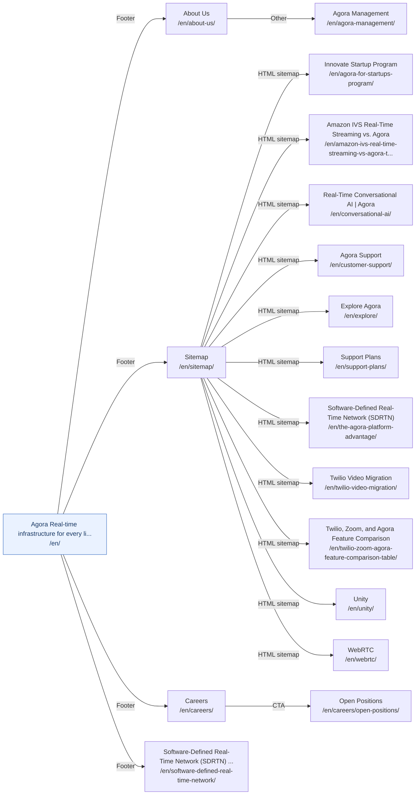

# Company and Platform Access Paths

[Back to sitemap index](../sitemap-graph.md) | [Open local entry page](http://localhost:4321/en/)

17 canonical pages. Diagram edges show each page's shortest verified path from `/en/`. Diagram nodes and page titles link to the localhost site.

| Page | Primary access path from `/en/` | Other direct canonical entries | Status |
| --- | --- | --- | --- |
| [Agora Real-time infrastructure for every live conversation](http://localhost:4321/en/) `/en/` | **Homepage entry point** | Sitewide header Sitewide mobile navigation Breadcrumb from [`/en/about-us/`](http://localhost:4321/en/about-us/) Breadcrumb from [`/en/acceptable-use-policy/`](http://localhost:4321/en/acceptable-use-policy/) Breadcrumb from [`/en/advances-in-ai-for-telehealth-webinar/`](http://localhost:4321/en/advances-in-ai-for-telehealth-webinar/) Breadcrumb from [`/en/agent-studio-pricing-request-form/`](http://localhost:4321/en/agent-studio-pricing-request-form/) +276 more direct sources | Crawlable |
| [About Us](http://localhost:4321/en/about-us/) `/en/about-us/` | [`/en/`](http://localhost:4321/en/) &rarr; **Footer: "About us"** &rarr; [`/en/about-us/`](http://localhost:4321/en/about-us/) | Sitewide footer HTML sitemap from [`/en/sitemap/`](http://localhost:4321/en/sitemap/) | Crawlable |
| [Innovate Startup Program](http://localhost:4321/en/agora-for-startups-program/) `/en/agora-for-startups-program/` | [`/en/`](http://localhost:4321/en/) &rarr; **Footer: "Sitemap"** &rarr; [`/en/sitemap/`](http://localhost:4321/en/sitemap/) &rarr; **HTML sitemap: "Innovate Startup Program"** &rarr; [`/en/agora-for-startups-program/`](http://localhost:4321/en/agora-for-startups-program/) | Inline link from [`/en/news/agora-debuts-program-to-help-startups-accelerate-time-to-market/`](http://localhost:4321/en/news/agora-debuts-program-to-help-startups-accelerate-time-to-market/) | Crawlable |
| [Agora Management](http://localhost:4321/en/agora-management/) `/en/agora-management/` | [`/en/`](http://localhost:4321/en/) &rarr; **Footer: "About us"** &rarr; [`/en/about-us/`](http://localhost:4321/en/about-us/) &rarr; **Other: "Management Team"** &rarr; [`/en/agora-management/`](http://localhost:4321/en/agora-management/) | HTML sitemap from [`/en/sitemap/`](http://localhost:4321/en/sitemap/) | Crawlable |
| [Amazon IVS Real-Time Streaming vs. Agora](http://localhost:4321/en/amazon-ivs-real-time-streaming-vs-agora-table/) `/en/amazon-ivs-real-time-streaming-vs-agora-table/` | [`/en/`](http://localhost:4321/en/) &rarr; **Footer: "Sitemap"** &rarr; [`/en/sitemap/`](http://localhost:4321/en/sitemap/) &rarr; **HTML sitemap: "Amazon IVS Real-Time Streaming vs. ..."** &rarr; [`/en/amazon-ivs-real-time-streaming-vs-agora-table/`](http://localhost:4321/en/amazon-ivs-real-time-streaming-vs-agora-table/) | Inline link from [`/en/blog/amazon-ivs-real-time-streaming-vs-agora/`](http://localhost:4321/en/blog/amazon-ivs-real-time-streaming-vs-agora/) | Crawlable |
| [Careers](http://localhost:4321/en/careers/) `/en/careers/` | [`/en/`](http://localhost:4321/en/) &rarr; **Footer: "Careers"** &rarr; [`/en/careers/`](http://localhost:4321/en/careers/) | Sitewide footer Other from [`/en/about-us/`](http://localhost:4321/en/about-us/) CTA from [`/en/careers/open-positions/`](http://localhost:4321/en/careers/open-positions/) HTML sitemap from [`/en/sitemap/`](http://localhost:4321/en/sitemap/) | Crawlable |
| [Open Positions](http://localhost:4321/en/careers/open-positions/) `/en/careers/open-positions/` | [`/en/`](http://localhost:4321/en/) &rarr; **Footer: "Careers"** &rarr; [`/en/careers/`](http://localhost:4321/en/careers/) &rarr; **CTA: "View Open Positions"** &rarr; [`/en/careers/open-positions/`](http://localhost:4321/en/careers/open-positions/) | HTML sitemap from [`/en/sitemap/`](http://localhost:4321/en/sitemap/) | Crawlable |
| [Real-Time Conversational AI \| Agora](http://localhost:4321/en/conversational-ai/) `/en/conversational-ai/` | [`/en/`](http://localhost:4321/en/) &rarr; **Footer: "Sitemap"** &rarr; [`/en/sitemap/`](http://localhost:4321/en/sitemap/) &rarr; **HTML sitemap: "Real-Time Conversational AI \| Agora"** &rarr; [`/en/conversational-ai/`](http://localhost:4321/en/conversational-ai/) | Inline link from [`/en/news/agora-builds-on-exotels-agentstream-to-deliver-real-time-ai-voice-bots/`](http://localhost:4321/en/news/agora-builds-on-exotels-agentstream-to-deliver-real-time-ai-voice-bots/) | Crawlable |
| [Agora Support](http://localhost:4321/en/customer-support/) `/en/customer-support/` | [`/en/`](http://localhost:4321/en/) &rarr; **Footer: "Sitemap"** &rarr; [`/en/sitemap/`](http://localhost:4321/en/sitemap/) &rarr; **HTML sitemap: "Agora Support"** &rarr; [`/en/customer-support/`](http://localhost:4321/en/customer-support/) | None | Crawlable |
| [Explore Agora](http://localhost:4321/en/explore/) `/en/explore/` | [`/en/`](http://localhost:4321/en/) &rarr; **Footer: "Sitemap"** &rarr; [`/en/sitemap/`](http://localhost:4321/en/sitemap/) &rarr; **HTML sitemap: "Explore Agora"** &rarr; [`/en/explore/`](http://localhost:4321/en/explore/) | None | Crawlable |
| [Software-Defined Real-Time Network (SDRTN) \| Agora](http://localhost:4321/en/software-defined-real-time-network/) `/en/software-defined-real-time-network/` | [`/en/`](http://localhost:4321/en/) &rarr; **Footer: "Network"** &rarr; [`/en/software-defined-real-time-network/`](http://localhost:4321/en/software-defined-real-time-network/) | Sitewide footer Sitewide header Sitewide mobile navigation HTML sitemap from [`/en/sitemap/`](http://localhost:4321/en/sitemap/) CTA from [`/en/tools/app-builder/`](http://localhost:4321/en/tools/app-builder/) CTA from [`/en/tools/flexible-classroom/`](http://localhost:4321/en/tools/flexible-classroom/) Inline link from [`/en/twilio-zoom-agora-feature-comparison-table/`](http://localhost:4321/en/twilio-zoom-agora-feature-comparison-table/) | Crawlable |
| [Support Plans](http://localhost:4321/en/support-plans/) `/en/support-plans/` | [`/en/`](http://localhost:4321/en/) &rarr; **Footer: "Sitemap"** &rarr; [`/en/sitemap/`](http://localhost:4321/en/sitemap/) &rarr; **HTML sitemap: "Support Plans"** &rarr; [`/en/support-plans/`](http://localhost:4321/en/support-plans/) | Inline link from [`/en/blog/world-class-support-for-building-real-time-communication-rtc-experiences/`](http://localhost:4321/en/blog/world-class-support-for-building-real-time-communication-rtc-experiences/) CTA from [`/en/software-defined-real-time-network/`](http://localhost:4321/en/software-defined-real-time-network/) CTA from [`/en/the-agora-platform-advantage/`](http://localhost:4321/en/the-agora-platform-advantage/) CTA from [`/en/tools/flexible-classroom/`](http://localhost:4321/en/tools/flexible-classroom/) | Crawlable |
| [Software-Defined Real-Time Network (SDRTN)](http://localhost:4321/en/the-agora-platform-advantage/) `/en/the-agora-platform-advantage/` | [`/en/`](http://localhost:4321/en/) &rarr; **Footer: "Sitemap"** &rarr; [`/en/sitemap/`](http://localhost:4321/en/sitemap/) &rarr; **HTML sitemap: "Software-Defined Real-Time Network ..."** &rarr; [`/en/the-agora-platform-advantage/`](http://localhost:4321/en/the-agora-platform-advantage/) | Inline link from [`/en/blog/difference-between-bandwidth-and-latency/`](http://localhost:4321/en/blog/difference-between-bandwidth-and-latency/) Inline link from [`/en/blog/how-to-build-a-live-broadcasting-web-app/`](http://localhost:4321/en/blog/how-to-build-a-live-broadcasting-web-app/) Inline link from [`/en/blog/how-to-build-a-token-server-for-agora-applications-using-golang/`](http://localhost:4321/en/blog/how-to-build-a-token-server-for-agora-applications-using-golang/) Inline link from [`/en/blog/real-time-video-resolution-making-the-best-choice-for-your-use-case/`](http://localhost:4321/en/blog/real-time-video-resolution-making-the-best-choice-for-your-use-case/) +5 more direct sources | Crawlable |
| [Twilio Video Migration](http://localhost:4321/en/twilio-video-migration/) `/en/twilio-video-migration/` | [`/en/`](http://localhost:4321/en/) &rarr; **Footer: "Sitemap"** &rarr; [`/en/sitemap/`](http://localhost:4321/en/sitemap/) &rarr; **HTML sitemap: "Twilio Video Migration"** &rarr; [`/en/twilio-video-migration/`](http://localhost:4321/en/twilio-video-migration/) | CTA from [`/en/blog/choosing-the-right-path-in-the-wake-of-twilio-video-exit/`](http://localhost:4321/en/blog/choosing-the-right-path-in-the-wake-of-twilio-video-exit/) Inline link from [`/en/blog/choosing-the-right-path-in-the-wake-of-twilio-video-exit/`](http://localhost:4321/en/blog/choosing-the-right-path-in-the-wake-of-twilio-video-exit/) CTA from [`/en/blog/migration-guide-from-twilio-to-agora-android-edition/`](http://localhost:4321/en/blog/migration-guide-from-twilio-to-agora-android-edition/) CTA from [`/en/blog/migration-guide-from-twilio-to-agora-ios-edition/`](http://localhost:4321/en/blog/migration-guide-from-twilio-to-agora-ios-edition/) +1 more direct sources | Crawlable |
| [Twilio, Zoom, and Agora Feature Comparison](http://localhost:4321/en/twilio-zoom-agora-feature-comparison-table/) `/en/twilio-zoom-agora-feature-comparison-table/` | [`/en/`](http://localhost:4321/en/) &rarr; **Footer: "Sitemap"** &rarr; [`/en/sitemap/`](http://localhost:4321/en/sitemap/) &rarr; **HTML sitemap: "Twilio, Zoom, and Agora Feature Com..."** &rarr; [`/en/twilio-zoom-agora-feature-comparison-table/`](http://localhost:4321/en/twilio-zoom-agora-feature-comparison-table/) | CTA from [`/en/twilio-video-migration/`](http://localhost:4321/en/twilio-video-migration/) | Crawlable |
| [Unity](http://localhost:4321/en/unity/) `/en/unity/` | [`/en/`](http://localhost:4321/en/) &rarr; **Footer: "Sitemap"** &rarr; [`/en/sitemap/`](http://localhost:4321/en/sitemap/) &rarr; **HTML sitemap: "Unity"** &rarr; [`/en/unity/`](http://localhost:4321/en/unity/) | Inline link from [`/en/customers/arutility/`](http://localhost:4321/en/customers/arutility/) | Crawlable |
| [WebRTC](http://localhost:4321/en/webrtc/) `/en/webrtc/` | [`/en/`](http://localhost:4321/en/) &rarr; **Footer: "Sitemap"** &rarr; [`/en/sitemap/`](http://localhost:4321/en/sitemap/) &rarr; **HTML sitemap: "WebRTC"** &rarr; [`/en/webrtc/`](http://localhost:4321/en/webrtc/) | None | Crawlable |
