# Legal, Security and Trust Access Paths

[Back to sitemap index](../sitemap-graph.md) | [Open local entry page](http://localhost:4321/en/security/)

21 canonical pages. Diagram edges show each page's shortest verified path from `/en/`. Diagram nodes and page titles link to the localhost site.

```mermaid
flowchart LR
  unlinked["No verified entry point"]
  n_477322a4d2["Agora Real-time infrastructure for every li...<br/>/en/"]
  n_3b306419b5["Acceptable Use Policy<br/>/en/acceptable-use-policy/"]
  n_53b6cfdd84["Agora Certificate Program Terms and Conditions<br/>/en/agora-certificate-program-terms-and-condi..."]
  n_a6c72c7ee1["Agora Content Standards and Community Guide...<br/>/en/agora-content-standards-and-community-gui..."]
  n_32a74359e7["Agora Infringement Policy<br/>/en/agora-infringement-policy/"]
  n_4813815ba9["Agora Processor Privacy Statement<br/>/en/agora-processor-privacy-statement/"]
  n_24c15f6f1a["CCPA Notice<br/>/en/ccpa/"]
  n_5bf6f81479["Compliance &amp; Privacy<br/>/en/compliance/"]
  n_c686511bff["Cookie Policy<br/>/en/cookie-policy/"]
  n_bd45a02059["Agora Lab, Inc. Data Privacy Framework Notice<br/>/en/data-privacy-framework-notice/"]
  n_bafe3965dd["Privacy Policy<br/>/en/privacy-policy-20210601/"]
  n_12956d4e36["Privacy Policy<br/>/en/privacy-policy/"]
  n_bc8f592c71["Content and Community Guidelines<br/>/en/rte2024/content-and-community-guidelines/"]
  n_59ddca3f00["Infringement Policy<br/>/en/rte2024/infringement-policy/"]
  n_07f5b39bce["Terms and Conditions<br/>/en/rte2024/terms-and-conditions/"]
  n_e76918e18f["SDK License Agreement<br/>/en/sdk-licence-agreement/"]
  n_72d20a4afb["Security &amp; Compliance<br/>/en/security/"]
  n_ba0ff4e4ae["Sitemap<br/>/en/sitemap/"]
  n_699d736c50["Terms of Service<br/>/en/terms-of-service/"]
  n_96b1439c6c["Third-Party Product Licenses<br/>/en/third-party-licenses/"]
  n_a9b0e14e34["Trust &amp; Safety with Agora<br/>/en/trust-safety-with-agora/"]
  n_61c8718f26["Trust &amp; Safety with Agora - Thank You<br/>/en/trust-safety-with-agora/thank-you/"]
  n_477322a4d2 -->|"Footer"| n_3b306419b5
  n_477322a4d2 -->|"Footer"| n_ba0ff4e4ae
  n_ba0ff4e4ae -->|"HTML sitemap"| n_53b6cfdd84
  n_ba0ff4e4ae -->|"HTML sitemap"| n_a6c72c7ee1
  n_ba0ff4e4ae -->|"HTML sitemap"| n_32a74359e7
  n_ba0ff4e4ae -->|"HTML sitemap"| n_4813815ba9
  n_ba0ff4e4ae -->|"HTML sitemap"| n_24c15f6f1a
  n_477322a4d2 -->|"Footer"| n_5bf6f81479
  n_477322a4d2 -->|"Footer"| n_c686511bff
  n_477322a4d2 -->|"Footer"| n_12956d4e36
  n_12956d4e36 -->|"Inline link"| n_bd45a02059
  n_ba0ff4e4ae -->|"HTML sitemap"| n_bafe3965dd
  n_ba0ff4e4ae -->|"HTML sitemap"| n_bc8f592c71
  n_ba0ff4e4ae -->|"HTML sitemap"| n_59ddca3f00
  n_ba0ff4e4ae -->|"HTML sitemap"| n_07f5b39bce
  n_ba0ff4e4ae -->|"HTML sitemap"| n_e76918e18f
  n_ba0ff4e4ae -->|"HTML sitemap"| n_72d20a4afb
  n_477322a4d2 -->|"Footer"| n_699d736c50
  n_ba0ff4e4ae -->|"HTML sitemap"| n_96b1439c6c
  n_477322a4d2 -->|"Footer"| n_a9b0e14e34
  unlinked -.-> n_61c8718f26
  click n_3b306419b5 "http://localhost:4321/en/acceptable-use-policy/" "_blank"
  click n_53b6cfdd84 "http://localhost:4321/en/agora-certificate-program-terms-and-conditions/" "_blank"
  click n_a6c72c7ee1 "http://localhost:4321/en/agora-content-standards-and-community-guidelines/" "_blank"
  click n_32a74359e7 "http://localhost:4321/en/agora-infringement-policy/" "_blank"
  click n_4813815ba9 "http://localhost:4321/en/agora-processor-privacy-statement/" "_blank"
  click n_24c15f6f1a "http://localhost:4321/en/ccpa/" "_blank"
  click n_5bf6f81479 "http://localhost:4321/en/compliance/" "_blank"
  click n_c686511bff "http://localhost:4321/en/cookie-policy/" "_blank"
  click n_bd45a02059 "http://localhost:4321/en/data-privacy-framework-notice/" "_blank"
  click n_bafe3965dd "http://localhost:4321/en/privacy-policy-20210601/" "_blank"
  click n_12956d4e36 "http://localhost:4321/en/privacy-policy/" "_blank"
  click n_bc8f592c71 "http://localhost:4321/en/rte2024/content-and-community-guidelines/" "_blank"
  click n_59ddca3f00 "http://localhost:4321/en/rte2024/infringement-policy/" "_blank"
  click n_07f5b39bce "http://localhost:4321/en/rte2024/terms-and-conditions/" "_blank"
  click n_e76918e18f "http://localhost:4321/en/sdk-licence-agreement/" "_blank"
  click n_72d20a4afb "http://localhost:4321/en/security/" "_blank"
  click n_ba0ff4e4ae "http://localhost:4321/en/sitemap/" "_blank"
  click n_699d736c50 "http://localhost:4321/en/terms-of-service/" "_blank"
  click n_96b1439c6c "http://localhost:4321/en/third-party-licenses/" "_blank"
  click n_a9b0e14e34 "http://localhost:4321/en/trust-safety-with-agora/" "_blank"
  click n_61c8718f26 "http://localhost:4321/en/trust-safety-with-agora/thank-you/" "_blank"
  click n_477322a4d2 "http://localhost:4321/en/" "_blank"
  classDef entry fill:#eaf2ff,stroke:#3b6fc4,color:#183867;
  classDef orphan fill:#fff5d6,stroke:#b77900,color:#5c3d00;
  classDef dead fill:#ffe8e6,stroke:#c53b32,color:#671d18;
  class n_477322a4d2 entry;
  class n_61c8718f26 orphan;
  class n_bafe3965dd,n_ba0ff4e4ae dead;
```

| Page | Primary access path from `/en/` | Other direct canonical entries | Status |
| --- | --- | --- | --- |
| [Acceptable Use Policy](http://localhost:4321/en/acceptable-use-policy/) `/en/acceptable-use-policy/` | [`/en/`](http://localhost:4321/en/) &rarr; **Footer: "Acceptable Use Policy"** &rarr; [`/en/acceptable-use-policy/`](http://localhost:4321/en/acceptable-use-policy/) | Sitewide footer HTML sitemap from [`/en/sitemap/`](http://localhost:4321/en/sitemap/) Inline link from [`/en/terms-of-service/`](http://localhost:4321/en/terms-of-service/) | Crawlable |
| [Agora Certificate Program Terms and Conditions](http://localhost:4321/en/agora-certificate-program-terms-and-conditions/) `/en/agora-certificate-program-terms-and-conditions/` | [`/en/`](http://localhost:4321/en/) &rarr; **Footer: "Sitemap"** &rarr; [`/en/sitemap/`](http://localhost:4321/en/sitemap/) &rarr; **HTML sitemap: "Agora Certificate Program Terms and..."** &rarr; [`/en/agora-certificate-program-terms-and-conditions/`](http://localhost:4321/en/agora-certificate-program-terms-and-conditions/) | None | Crawlable |
| [Agora Content Standards and Community Guidelines](http://localhost:4321/en/agora-content-standards-and-community-guidelines/) `/en/agora-content-standards-and-community-guidelines/` | [`/en/`](http://localhost:4321/en/) &rarr; **Footer: "Sitemap"** &rarr; [`/en/sitemap/`](http://localhost:4321/en/sitemap/) &rarr; **HTML sitemap: "Agora Content Standards and Communi..."** &rarr; [`/en/agora-content-standards-and-community-guidelines/`](http://localhost:4321/en/agora-content-standards-and-community-guidelines/) | Inline link from [`/en/agora-certificate-program-terms-and-conditions/`](http://localhost:4321/en/agora-certificate-program-terms-and-conditions/) | Crawlable |
| [Agora Infringement Policy](http://localhost:4321/en/agora-infringement-policy/) `/en/agora-infringement-policy/` | [`/en/`](http://localhost:4321/en/) &rarr; **Footer: "Sitemap"** &rarr; [`/en/sitemap/`](http://localhost:4321/en/sitemap/) &rarr; **HTML sitemap: "Agora Infringement Policy"** &rarr; [`/en/agora-infringement-policy/`](http://localhost:4321/en/agora-infringement-policy/) | Inline link from [`/en/agora-certificate-program-terms-and-conditions/`](http://localhost:4321/en/agora-certificate-program-terms-and-conditions/) | Crawlable |
| [Agora Processor Privacy Statement](http://localhost:4321/en/agora-processor-privacy-statement/) `/en/agora-processor-privacy-statement/` | [`/en/`](http://localhost:4321/en/) &rarr; **Footer: "Sitemap"** &rarr; [`/en/sitemap/`](http://localhost:4321/en/sitemap/) &rarr; **HTML sitemap: "Agora Processor Privacy Statement"** &rarr; [`/en/agora-processor-privacy-statement/`](http://localhost:4321/en/agora-processor-privacy-statement/) | Inline link from [`/en/data-privacy-framework-notice/`](http://localhost:4321/en/data-privacy-framework-notice/) | Crawlable |
| [CCPA Notice](http://localhost:4321/en/ccpa/) `/en/ccpa/` | [`/en/`](http://localhost:4321/en/) &rarr; **Footer: "Sitemap"** &rarr; [`/en/sitemap/`](http://localhost:4321/en/sitemap/) &rarr; **HTML sitemap: "CCPA Notice"** &rarr; [`/en/ccpa/`](http://localhost:4321/en/ccpa/) | None | Crawlable |
| [Compliance & Privacy](http://localhost:4321/en/compliance/) `/en/compliance/` | [`/en/`](http://localhost:4321/en/) &rarr; **Footer: "ISO/IEC 27001"** &rarr; [`/en/compliance/`](http://localhost:4321/en/compliance/) | Sitewide footer Inline link from [`/en/blog/six-security-considerations-for-selecting-an-rte-paas-provider/`](http://localhost:4321/en/blog/six-security-considerations-for-selecting-an-rte-paas-provider/) HTML sitemap from [`/en/sitemap/`](http://localhost:4321/en/sitemap/) Other from [`/en/tools/flexible-classroom/`](http://localhost:4321/en/tools/flexible-classroom/) Other from [`/en/trust-safety-with-agora/thank-you/`](http://localhost:4321/en/trust-safety-with-agora/thank-you/) +1 more direct sources | Crawlable |
| [Cookie Policy](http://localhost:4321/en/cookie-policy/) `/en/cookie-policy/` | [`/en/`](http://localhost:4321/en/) &rarr; **Footer: "Cookie Policy"** &rarr; [`/en/cookie-policy/`](http://localhost:4321/en/cookie-policy/) | Sitewide footer Inline link from [`/en/privacy-policy/`](http://localhost:4321/en/privacy-policy/) HTML sitemap from [`/en/sitemap/`](http://localhost:4321/en/sitemap/) | Crawlable |
| [Agora Lab, Inc. Data Privacy Framework Notice](http://localhost:4321/en/data-privacy-framework-notice/) `/en/data-privacy-framework-notice/` | [`/en/`](http://localhost:4321/en/) &rarr; **Footer: "Privacy Policy"** &rarr; [`/en/privacy-policy/`](http://localhost:4321/en/privacy-policy/) &rarr; **Inline link: "https://www.agora.io/en/data-privac..."** &rarr; [`/en/data-privacy-framework-notice/`](http://localhost:4321/en/data-privacy-framework-notice/) | HTML sitemap from [`/en/sitemap/`](http://localhost:4321/en/sitemap/) | Crawlable |
| [Privacy Policy](http://localhost:4321/en/privacy-policy-20210601/) `/en/privacy-policy-20210601/` | [`/en/`](http://localhost:4321/en/) &rarr; **Footer: "Sitemap"** &rarr; [`/en/sitemap/`](http://localhost:4321/en/sitemap/) &rarr; **HTML sitemap: "Privacy Policy"** &rarr; [`/en/privacy-policy-20210601/`](http://localhost:4321/en/privacy-policy-20210601/) | None | Crawlable, Dead end |
| [Privacy Policy](http://localhost:4321/en/privacy-policy/) `/en/privacy-policy/` | [`/en/`](http://localhost:4321/en/) &rarr; **Footer: "Privacy Policy"** &rarr; [`/en/privacy-policy/`](http://localhost:4321/en/privacy-policy/) | Sitewide footer Inline link from [`/en/acceptable-use-policy/`](http://localhost:4321/en/acceptable-use-policy/) Inline link from [`/en/advances-in-ai-for-telehealth-webinar/`](http://localhost:4321/en/advances-in-ai-for-telehealth-webinar/) Inline link from [`/en/agent-studio-pricing-request-form/`](http://localhost:4321/en/agent-studio-pricing-request-form/) Inline link from [`/en/agora-certificate-program-terms-and-conditions/`](http://localhost:4321/en/agora-certificate-program-terms-and-conditions/) +92 more direct sources | Crawlable |
| [Content and Community Guidelines](http://localhost:4321/en/rte2024/content-and-community-guidelines/) `/en/rte2024/content-and-community-guidelines/` | [`/en/`](http://localhost:4321/en/) &rarr; **Footer: "Sitemap"** &rarr; [`/en/sitemap/`](http://localhost:4321/en/sitemap/) &rarr; **HTML sitemap: "Content and Community Guidelines"** &rarr; [`/en/rte2024/content-and-community-guidelines/`](http://localhost:4321/en/rte2024/content-and-community-guidelines/) | Inline link from [`/en/rte2024/terms-and-conditions/`](http://localhost:4321/en/rte2024/terms-and-conditions/) | Crawlable |
| [Infringement Policy](http://localhost:4321/en/rte2024/infringement-policy/) `/en/rte2024/infringement-policy/` | [`/en/`](http://localhost:4321/en/) &rarr; **Footer: "Sitemap"** &rarr; [`/en/sitemap/`](http://localhost:4321/en/sitemap/) &rarr; **HTML sitemap: "Infringement Policy"** &rarr; [`/en/rte2024/infringement-policy/`](http://localhost:4321/en/rte2024/infringement-policy/) | Inline link from [`/en/rte2024/terms-and-conditions/`](http://localhost:4321/en/rte2024/terms-and-conditions/) | Crawlable |
| [Terms and Conditions](http://localhost:4321/en/rte2024/terms-and-conditions/) `/en/rte2024/terms-and-conditions/` | [`/en/`](http://localhost:4321/en/) &rarr; **Footer: "Sitemap"** &rarr; [`/en/sitemap/`](http://localhost:4321/en/sitemap/) &rarr; **HTML sitemap: "Terms and Conditions"** &rarr; [`/en/rte2024/terms-and-conditions/`](http://localhost:4321/en/rte2024/terms-and-conditions/) | Inline link from [`/en/rte2024/content-and-community-guidelines/`](http://localhost:4321/en/rte2024/content-and-community-guidelines/) | Crawlable |
| [SDK License Agreement](http://localhost:4321/en/sdk-licence-agreement/) `/en/sdk-licence-agreement/` | [`/en/`](http://localhost:4321/en/) &rarr; **Footer: "Sitemap"** &rarr; [`/en/sitemap/`](http://localhost:4321/en/sitemap/) &rarr; **HTML sitemap: "SDK License Agreement"** &rarr; [`/en/sdk-licence-agreement/`](http://localhost:4321/en/sdk-licence-agreement/) | None | Crawlable |
| [Security & Compliance](http://localhost:4321/en/security/) `/en/security/` | [`/en/`](http://localhost:4321/en/) &rarr; **Footer: "Sitemap"** &rarr; [`/en/sitemap/`](http://localhost:4321/en/sitemap/) &rarr; **HTML sitemap: "Security & Compliance"** &rarr; [`/en/security/`](http://localhost:4321/en/security/) | None | Crawlable |
| [Sitemap](http://localhost:4321/en/sitemap/) `/en/sitemap/` | [`/en/`](http://localhost:4321/en/) &rarr; **Footer: "Sitemap"** &rarr; [`/en/sitemap/`](http://localhost:4321/en/sitemap/) | Sitewide footer Sitewide header | Crawlable, Dead end |
| [Terms of Service](http://localhost:4321/en/terms-of-service/) `/en/terms-of-service/` | [`/en/`](http://localhost:4321/en/) &rarr; **Footer: "Terms of Service"** &rarr; [`/en/terms-of-service/`](http://localhost:4321/en/terms-of-service/) | Sitewide footer Inline link from [`/en/acceptable-use-policy/`](http://localhost:4321/en/acceptable-use-policy/) Inline link from [`/en/agora-certificate-program-terms-and-conditions/`](http://localhost:4321/en/agora-certificate-program-terms-and-conditions/) Inline link from [`/en/blog/how-to-embed-group-video-chat-in-your-unity-games/`](http://localhost:4321/en/blog/how-to-embed-group-video-chat-in-your-unity-games/) CTA from [`/en/extensions/agora-noise-suppression/`](http://localhost:4321/en/extensions/agora-noise-suppression/) +4 more direct sources | Crawlable |
| [Third-Party Product Licenses](http://localhost:4321/en/third-party-licenses/) `/en/third-party-licenses/` | [`/en/`](http://localhost:4321/en/) &rarr; **Footer: "Sitemap"** &rarr; [`/en/sitemap/`](http://localhost:4321/en/sitemap/) &rarr; **HTML sitemap: "Third-Party Product Licenses"** &rarr; [`/en/third-party-licenses/`](http://localhost:4321/en/third-party-licenses/) | None | Crawlable |
| [Trust & Safety with Agora](http://localhost:4321/en/trust-safety-with-agora/) `/en/trust-safety-with-agora/` | [`/en/`](http://localhost:4321/en/) &rarr; **Footer: "Report Abuse of Our Terms of Service"** &rarr; [`/en/trust-safety-with-agora/`](http://localhost:4321/en/trust-safety-with-agora/) | Sitewide footer Card from [`/en/explore/`](http://localhost:4321/en/explore/) HTML sitemap from [`/en/sitemap/`](http://localhost:4321/en/sitemap/) | Crawlable |
| [Trust & Safety with Agora - Thank You](http://localhost:4321/en/trust-safety-with-agora/thank-you/) `/en/trust-safety-with-agora/thank-you/` | **No verified rendered-link path** | None | Non-crawlable, Orphan |
