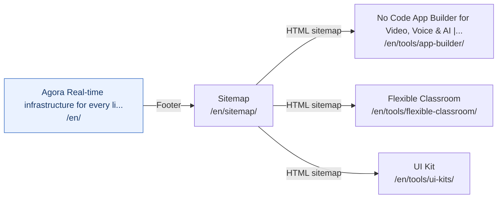

# Tools Access Paths

[Back to sitemap index](../sitemap-graph.md) | [Open local entry page](http://localhost:4321/en/tools/app-builder/)

3 canonical pages. Diagram edges show each page's shortest verified path from `/en/`. Diagram nodes and page titles link to the localhost site.

| Page | Primary access path from `/en/` | Other direct canonical entries | Status |
| --- | --- | --- | --- |
| [No Code App Builder for Video, Voice & AI \| Agora](http://localhost:4321/en/tools/app-builder/) `/en/tools/app-builder/` | [`/en/`](http://localhost:4321/en/) &rarr; **Footer: "Sitemap"** &rarr; [`/en/sitemap/`](http://localhost:4321/en/sitemap/) &rarr; **HTML sitemap: "No Code App Builder for Video, Voic..."** &rarr; [`/en/tools/app-builder/`](http://localhost:4321/en/tools/app-builder/) | CTA from [`/en/conversational-ai/`](http://localhost:4321/en/conversational-ai/) Other from [`/en/customers/englishcentral/`](http://localhost:4321/en/customers/englishcentral/) Other from [`/en/customers/symbl-ai/`](http://localhost:4321/en/customers/symbl-ai/) Inline link from [`/en/twilio-zoom-agora-feature-comparison-table/`](http://localhost:4321/en/twilio-zoom-agora-feature-comparison-table/) | Crawlable |
| [Flexible Classroom](http://localhost:4321/en/tools/flexible-classroom/) `/en/tools/flexible-classroom/` | [`/en/`](http://localhost:4321/en/) &rarr; **Footer: "Sitemap"** &rarr; [`/en/sitemap/`](http://localhost:4321/en/sitemap/) &rarr; **HTML sitemap: "Flexible Classroom"** &rarr; [`/en/tools/flexible-classroom/`](http://localhost:4321/en/tools/flexible-classroom/) | Inline link from [`/en/blog/3-benefits-of-interactive-online-education/`](http://localhost:4321/en/blog/3-benefits-of-interactive-online-education/) Other from [`/en/customers/hellotalk/`](http://localhost:4321/en/customers/hellotalk/) Other from [`/en/customers/infinity-learn/`](http://localhost:4321/en/customers/infinity-learn/) Inline link from [`/en/news/agora-flexibile-classroom-wins-edtech-breakthrough-award/`](http://localhost:4321/en/news/agora-flexibile-classroom-wins-edtech-breakthrough-award/) +1 more direct sources | Crawlable |
| [UI Kit](http://localhost:4321/en/tools/ui-kits/) `/en/tools/ui-kits/` | [`/en/`](http://localhost:4321/en/) &rarr; **Footer: "Sitemap"** &rarr; [`/en/sitemap/`](http://localhost:4321/en/sitemap/) &rarr; **HTML sitemap: "UI Kit"** &rarr; [`/en/tools/ui-kits/`](http://localhost:4321/en/tools/ui-kits/) | None | Crawlable |
